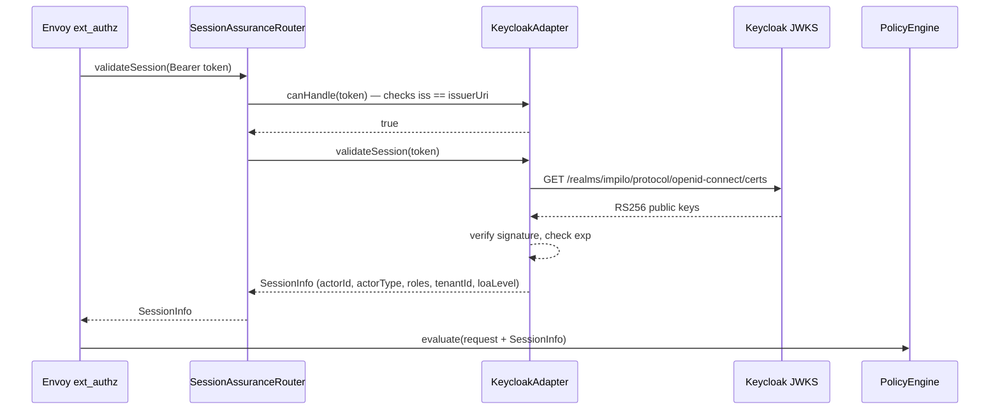
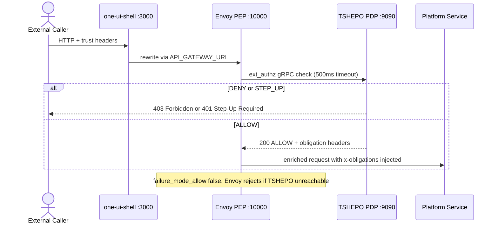
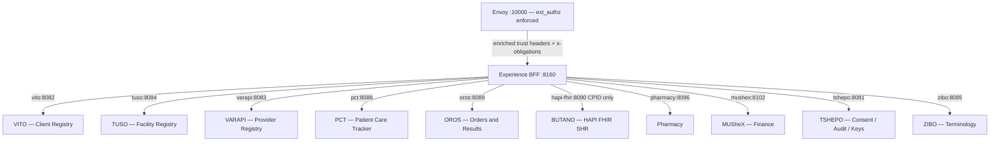
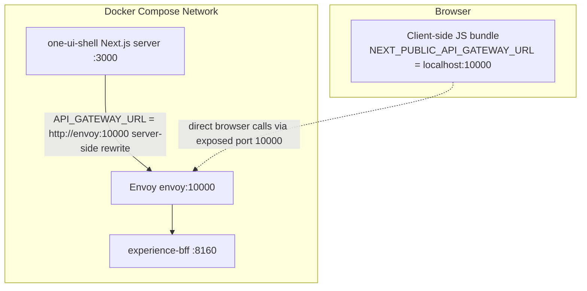
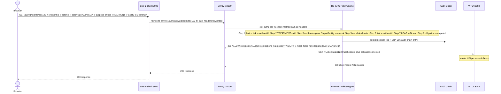

# External Service Access — Envoy Gateway & TSHEPO Trust Specification

**Version**: 1.0  
**Scope**: How external callers (browser, mobile apps, partner systems) reach platform services (VITO, TUSO, VARAPI, PCT, OROS, BUTANO, etc.) through the Envoy edge and TSHEPO Policy Decision Point.

---

## 1. Overview

All external access to Impilo platform services flows through a two-layer enforcement boundary:

1. **Envoy Proxy** (port `10000`) — the Policy Enforcement Point (PEP). Routes requests and calls TSHEPO for authorization before forwarding.
2. **TSHEPO** — the Policy Decision Point (PDP). Evaluates every request against 10 access-control dimensions and injects obligation headers into approved requests.

No request reaches a platform service without passing through both layers. Direct service-to-service calls (e.g., Experience BFF → VITO) bypass Envoy but propagate the same trust headers that TSHEPO originally stamped.

---

## 2. Authentication — How Callers Obtain and Present Credentials

### 2.1 Token Issuance — Keycloak (OIDC)

External callers authenticate against **Keycloak** (port `8480`, realm `impilo`) using standard OIDC flows before making any platform API call:

| Caller Type | Grant Flow | Result |
|---|---|---|
| Browser / citizen | Authorization Code + PKCE | JWT access token + HttpOnly refresh cookie |
| Service account / partner | Client Credentials | JWT access token |
| MFA step-up | Device / OOB challenge | Upgraded JWT with higher `acr` claim |

Token endpoint:
```
POST /realms/impilo/protocol/openid-connect/token
```

### 2.2 Carrying the Token

Every request must include the JWT as a bearer token plus the full trust header set:

```
Authorization: Bearer <keycloak-jwt>
X-Tenant-ID: <uuid>
X-Actor-ID: <health-id>
X-Actor-Type: CLINICIAN | CITIZEN | SERVICE | ADMIN
X-Purpose-Of-Use: TREATMENT | CARE_MANAGEMENT | BREAK_GLASS | ...
X-Correlation-ID: <uuid>
```

The `api-client.ts` layer in `one-ui-shell` assembles these headers automatically from the auth store and operational context on every outbound call.

### 2.3 Token Validation by TSHEPO

When Envoy's `ext_authz` filter forwards the request to **TSHEPO-authz-service** (gRPC `:9090`), the `ExtAuthzGrpcService` delegates to `SessionAssuranceRouter`, which routes the JWT to the appropriate adapter:



`KeycloakAdapter` extracts and maps the following JWT claims into `SessionInfo`:

| JWT Claim | Mapped To | Notes |
|---|---|---|
| `sub` | `actorId` | Health ID — person anchor |
| `realm_access.roles` | `roles` | Role list for RBAC checks |
| `actor_type` (custom) | `actorType` | Falls back to role-derived type |
| `tenant_id` / `organization` | `tenantId` | UUID |
| `acr` | `loaLevel` | `0`–`3` (maps LoA1–LoA4) |
| `sid` | `sessionId` | Keycloak session ID |

If the JWT is invalid, expired, or the JWKS endpoint is unreachable, `SessionValidationException` is thrown → Envoy returns **401 Unauthorized**.

### 2.4 Pluggable Identity Provider Support

`SessionAssuranceRouter` iterates all registered `SessionAssurance` adapter beans by calling `canHandle(token)` on each before falling back to `KeycloakAdapter`. This allows additional identity providers (enterprise SSO, MOSIP, federation adapters) to be registered without changing the core authorization path.

### 2.5 Defence-in-Depth: Resource Server JWT Validation

Individual platform services (VITO, TUSO, VARAPI, etc.) also validate JWTs independently as **Spring OAuth2 Resource Servers** using the same Keycloak JWKS endpoint:

```yaml
spring.security.oauth2.resourceserver.jwt:
  jwk-set-uri: ${KEYCLOAK_URL}/realms/${KEYCLOAK_REALM}/protocol/openid-connect/certs
```

By the time a request reaches a platform service it has already been authorized by TSHEPO via Envoy. The resource server check is a defence-in-depth layer only.

### 2.6 Token Refresh

On a `401` response, `api-client.ts` attempts a single silent refresh via the BFF:
```
POST /internal/v1/auth/refresh   (HttpOnly refresh cookie sent automatically)
```
If refresh succeeds the original request is retried with the new token. If it fails, the auth store is cleared and the user is redirected to `/auth/login`.

---

## 3. Request Lifecycle — External Caller to Platform Service



> **Failure mode**: `failure_mode_allow: false` — if TSHEPO is unreachable, Envoy **rejects** the request. There is no degraded passthrough.

---

## 4. Trust Header Contract

### 4.1 Mandatory Request Headers (caller must supply)

Every external request must carry:

| Header | Type | Description |
|--------|------|-------------|
| `x-tenant-id` | UUID | Tenant scope |
| `x-actor-id` | String | Health ID — person anchor (not a service account) |
| `x-actor-type` | String | e.g. `CLINICIAN`, `PATIENT`, `SYSTEM`, `SUPER_ADMIN` |
| `x-purpose-of-use` | String | e.g. `TREATMENT`, `CARE_MANAGEMENT`, `BREAK_GLASS` |
| `x-correlation-id` | UUID | Distributed trace ID (generated if absent) |
| `x-request-id` | UUID | Per-request ID |
| `x-pod-id` | String | Deployment pod identifier |

If any mandatory header is absent, TSHEPO returns `403 MISSING_HEADERS` and Envoy rejects the request without forwarding.

### 4.2 Contextual Headers (supply where applicable)

| Header | Description |
|--------|-------------|
| `x-provider-id` | Regulated professional role ID — required for clinical write actions |
| `x-facility-id` | UUID of the facility context |
| `x-tuso-facility-id` | TUSO numeric facility ID (preferred for registry alignment) |
| `x-department-id` | Department within facility |
| `x-ward-id` | Ward within department |
| `x-workspace-id` | Active workspace ID |
| `x-programme-id` | Health programme context |
| `x-shift-id` | Active shift ID |
| `x-assurance-level` | Identity assurance level: `LOA1`–`LOA4` |
| `x-subject-id` | Patient/subject of the action |
| `x-access-mode` | Access mode flag |
| `x-workflow-state` | Workflow state, e.g. `DRAFT`, `ACTIVE`, `DISCHARGED` |
| `x-device-fingerprint` | Device fingerprint for risk scoring |

### 4.3 Response / Obligation Headers (injected by TSHEPO on ALLOW)

When TSHEPO approves a request, Envoy injects these into the forwarded request before it reaches the platform service:

| Header | Description |
|--------|-------------|
| `x-decision` | Always `ALLOW` on forwarded requests |
| `x-obligations` | JSON blob of policy obligations (masking rules, scope limits, etc.) |
| `x-max-scope` | Maximum data scope permitted |
| `x-mask-fields` | Comma-separated list of fields to mask |
| `x-logging-level` | Required audit logging depth |
| `x-friction-level` | Graduated friction level for downstream UX enforcement |
| `X-Policy-Decision` | Machine-readable verdict: `ALLOW` |
| `X-Policy-Version` | Policy ruleset version, e.g. `v1.1.0` |
| `X-Decision-Reason` | Comma-separated reason codes, e.g. `POLICY_SATISFIED` |

---

## 5. TSHEPO Policy Decision Point — 10-Dimension Evaluation

`PolicyEngine.java` evaluates every request through a sequential gate chain. Any gate can short-circuit with DENY or STEP_UP before reaching the next.


Every decision — ALLOW, DENY, or STEP_UP — is written to the tamper-evident audit chain (`audit_event` table, SHA-256 hash-chained per tenant) before returning to Envoy.

### Decision Responses

| Verdict | HTTP Status | Envoy Behaviour |
|---------|-------------|-----------------|
| `ALLOW` | `200 OK` | Forwards request to upstream with obligation headers injected |
| `DENY` | `403 Forbidden` | Rejects request; returns `X-Decision-Reason` to caller |
| `STEP_UP_REQUIRED` | `401 Unauthorized` | Rejects request; returns required challenge methods |

---

## 6. Envoy Routing Table

Envoy matches request prefixes and routes to the appropriate upstream cluster. Routes are evaluated **in order** — more specific prefixes must appear first.

| External Prefix | Upstream Cluster | Internal Rewrite | Service |
|-----------------|-----------------|------------------|---------|
| `/internal/v1/*` | `experience_bff` | (none) | Experience BFF :8160 |
| `/external/v1/*` | `tshepo_service` | (none) | TSHEPO :8081 |
| `/bff/*` | `experience_bff` | `/` | Experience BFF :8160 |
| `/api/v1/authorize` | `tshepo_service` | `/v1/authorize` | TSHEPO :8081 |
| `/api/v1/step-up` | `tshepo_service` | `/v1/step-up` | TSHEPO :8081 |
| `/api/v1/break-glass` | `tshepo_service` | `/v1/break-glass` | TSHEPO :8081 |
| `/api/v1/policies` | `tshepo_service` | `/v1/policies` | TSHEPO :8081 |
| `/api/v1/consent` | `tshepo_service` | `/v1/consent` | TSHEPO :8081 |
| `/api/v1/audit` | `tshepo_service` | `/v1/audit` | TSHEPO :8081 |
| `/api/v1/keys` | `tshepo_service` | `/v1/keys` | TSHEPO :8081 |
| `/api/v1/identity` | `tshepo_service` | `/v1/identity` | TSHEPO :8081 |
| `/api/v1/clients/snapshot` | `vito_service` | `/internal/v1/snapshots/clients` | VITO :8082 |
| `/api/v1/clients` | `vito_service` | `/v1/clients` | VITO :8082 |
| `/api/v1/recovery` | `vito_service` | `/v1/recovery` | VITO :8082 |
| `/api/v1/providers/snapshot` | `varapi_service` | `/internal/v1/snapshots/providers` | VARAPI :8083 |
| `/api/v1/providers` | `varapi_service` | `/v1/internal/providers` | VARAPI :8083 |
| `/api/v1/facilities/snapshot` | `tuso_service` | `/internal/v1/snapshots/facilities` | TUSO :8084 |
| `/api/v1/facilities` | `tuso_service` | `/v1/internal/facilities` | TUSO :8084 |
| `/api/v1/workspaces` | `tuso_service` | `/v1/internal/workspaces` | TUSO :8084 |
| `/api/v1/resources` | `tuso_service` | `/v1/internal/resources` | TUSO :8084 |
| `/api/v1/bookings` | `tuso_service` | (none) | TUSO :8084 |
| `/api/v1/telemetry` | `tuso_service` | (none) | TUSO :8084 |
| `/v1/artifacts` | `zibo_service` | (none) | ZIBO :8085 |
| `/v1/packs` | `zibo_service` | (none) | ZIBO :8085 |
| `/api/v1/work` | `pct_service` | `/v1/work` | PCT :8088 |
| `/api/v1/encounters` | `pct_service` | `/v1/encounters` | PCT :8088 |
| `/api/v1/queues` | `pct_service` | `/v1/queues` | PCT :8088 |
| `/v1/orders` | `oros_service` | (none) | OROS :8089 |
| `/api/v1/pharmacy` | `pharmacy_service` | (none) | Pharmacy :8097 |
| `/api/v1/prescriptions` | `pharmacy_service` | (none) | Pharmacy :8097 |
| `/api/v1/payments` | `mushex_service` | (none) | MUSheX :8102 |
| `/api/v1/refunds` | `mushex_service` | (none) | MUSheX :8102 |
| `/api/v1/bills` | `costa_service` | (none) | COSTA :8101 |
| `/api/v1/tariffs` | `costa_service` | (none) | COSTA :8101 |
| `/api/v1/wards` | `ubomi_service` | (none) | Ubomi :8087 |
| `/api/v1/beds` | `ubomi_service` | (none) | Ubomi :8087 |
| `/api/v1/admissions` | `ubomi_service` | (none) | Ubomi :8087 |
| `/actuator/health` | `tshepo_service` | (none) | TSHEPO :8081 |

---

## 7. Upstream Cluster Definitions (Docker Compose Runtime)

| Cluster Name | Address | Protocol | Notes |
|---|---|---|---|
| `tshepo_authz_grpc` | `tshepo:9090` | HTTP/2 (gRPC) | Used exclusively by ext_authz filter |
| `tshepo_service` | `tshepo:8081` | HTTP/1.1 | TSHEPO REST API routes |
| `vito_service` | `vito:8082` | HTTP/1.1 | Client Registry |
| `varapi_service` | `varapi:8083` | HTTP/1.1 | Provider Registry |
| `tuso_service` | `tuso:8084` | HTTP/1.1 | Facility Registry |
| `zibo_service` | `zibo:8085` | HTTP/1.1 | Terminology |
| `pct_service` | `pct:8088` | HTTP/1.1 | Patient Care Tracker |
| `oros_service` | `oros:8089` | HTTP/1.1 | Orders & Results |
| `pharmacy_service` | `pharmacy:8097` | HTTP/1.1 | Pharmacy |
| `mushex_service` | `mushex:8102` | HTTP/1.1 | Finance/Payments |
| `costa_service` | `costing-engine:8101` | HTTP/1.1 | Costing Engine |
| `ubomi_service` | `ubomi:8087` | HTTP/1.1 | Inpatient/Beds |
| `experience_bff` | `experience-bff:8160` | HTTP/1.1 | Experience BFF |
| `opa_sidecar` | `opa:8181` | HTTP/1.1 | OPA (policy store) |

> **Note**: In local development (`infra/envoy/envoy.yaml`), cluster addresses use `host.docker.internal` instead of Docker service names.

---

## 8. Experience BFF — Internal Service Access Pattern

Once a request reaches the Experience BFF (via `/internal/v1/*`), the BFF makes **direct HTTP calls** to platform services using `RestTemplate` — it does **not** route back through Envoy.



### 8.1 Trust Header Propagation

`ServiceClientConfig.trustHeaderForwardingInterceptor` copies every TSHEPO-stamped header from the inbound request onto every outbound `RestTemplate` call:

- All mandatory headers (`x-tenant-id`, `x-actor-id`, `x-actor-type`, `x-purpose-of-use`, `x-correlation-id`)
- All contextual headers (`x-facility-id`, `x-workspace-id`, `x-shift-id`, `x-provider-id`, etc.)
- `Authorization` (JWT bearer token)
- Obligation headers (`x-obligations`, `x-mask-fields`, `x-logging-level`)

This means platform services (VITO, TUSO, etc.) receive the **same trust context** that Envoy/TSHEPO originally validated — they do not need to re-authorise the request.

### 8.2 BFF → Service URL Mapping

URLs are configured via `@ConfigurationProperties(prefix = "impilo.services")`, overridden by environment variables in compose:

| Service Client | Default URL | Compose Env Var |
|---|---|---|
| `VitoServiceClient` | `http://localhost:8082` | `VITO_BASE_URL` |
| `TusoServiceClient` | `http://localhost:8084` | `TUSO_BASE_URL` |
| `VarapiServiceClient` | `http://localhost:8083` | `VARAPI_BASE_URL` |
| `PctServiceClient` | `http://localhost:8088` | `PCT_BASE_URL` |
| `OrosServiceClient` | `http://localhost:8089` | `OROS_BASE_URL` |
| `ButanoServiceClient` | `http://localhost:8090` | `BUTANO_BASE_URL` |
| `PharmacyServiceClient` | `http://localhost:8096` | `PHARMACY_BASE_URL` |
| `MushexServiceClient` | `http://localhost:8102` | `MUSHEX_BASE_URL` |
| `CostaServiceClient` | `http://localhost:8101` | `COSTA_BASE_URL` |
| `ZiboServiceClient` | `http://localhost:8085` | (via `impilo.services.*`) |
| `TshepoAuthzServiceClient` | `http://localhost:8081` | (via `impilo.services.*`) |

### 8.3 PII / FHIR Split

**VITO** holds all PII (demographics, identity, contact details).  
**BUTANO (HAPI FHIR)** holds clinical resources keyed by `CPID` only — no PII ever written to BUTANO.  
The BFF is responsible for joining these two sources when composing a patient view.

---

## 9. One UI Shell — Gateway URL Routing

The Next.js `one-ui-shell` proxies browser requests to Envoy using Next.js rewrites (`next.config.mjs`):

| Browser Path | Rewrite Destination (server-side) | Notes |
|---|---|---|
| `/internal/*` | `API_GATEWAY_URL/internal/*` | → Envoy → ext_authz → BFF |
| `/api/*` | `API_GATEWAY_URL/api/*` | → Envoy → ext_authz → platform service |



**Environment variable priority** for server-side rewrites (runs inside the container):

1. `API_GATEWAY_URL` — Docker network hostname, e.g. `http://envoy:10000` ← **set this in compose**
2. `NEXT_PUBLIC_API_GATEWAY_URL` — browser-embedded fallback, e.g. `http://localhost:10000`
3. `http://localhost:10000` — hardcoded default for local dev

`NEXT_PUBLIC_*` variables are baked into the client-side JS bundle at build time. They must use `localhost` (host-accessible) addresses. The server-side `API_GATEWAY_URL` uses Docker service names and is never sent to the browser.

---

## 10. Complete End-to-End Flow: Browser → VITO



---

## 11. Security Constraints

| Rule | Enforcement |
|------|-------------|
| No request bypasses Envoy ext_authz | `failure_mode_allow: false` — Envoy rejects if TSHEPO is unreachable |
| No PII stored in BUTANO/FHIR | Architectural boundary — BFF enforces the join |
| Every decision is audited | `PolicyEngine` writes tamper-evident audit chain on every call |
| Trust headers are not caller-forgeable | Headers are validated by TSHEPO; callers cannot self-issue obligation headers |
| Clinical writes require Provider ID | `PROVIDER_NOT_ACTIVATED` deny if `x-provider-id` absent on regulated actions |
| High-sensitivity resources require LOA3+ | Assurance level gate (Step 8) — returns `STEP_UP_REQUIRED` with `IDENTITY_PROOFING` |

---

## 12. Reference Files

| Purpose | File |
|---------|------|
| Envoy runtime config (Docker Compose) | [`infra/envoy/envoy-runtime.yaml`](../../infra/envoy/envoy-runtime.yaml) |
| Envoy local dev config | [`infra/envoy/envoy.yaml`](../../infra/envoy/envoy.yaml) |
| TSHEPO Policy Decision Point | [`services/tshepo-service/…/core/PolicyEngine.java`](../../services/tshepo-service/src/main/java/zw/gov/mohcc/impilo/tshepo/core/PolicyEngine.java) |
| Trust header constants | [`services/tshepo-service/…/core/TrustHeaders.java`](../../services/tshepo-service/src/main/java/zw/gov/mohcc/impilo/tshepo/core/TrustHeaders.java) |
| Envoy ext_authz gRPC handler | [`services/tshepo-authz-service/…/grpc/ExtAuthzGrpcService.java`](../../services/tshepo-authz-service/src/main/java/zw/gov/mohcc/impilo/tshepo/authz/grpc/ExtAuthzGrpcService.java) |
| Session validation router | [`services/tshepo-authz-service/…/session/SessionAssuranceRouter.java`](../../services/tshepo-authz-service/src/main/java/zw/gov/mohcc/impilo/tshepo/authz/session/SessionAssuranceRouter.java) |
| Keycloak JWT adapter | [`services/tshepo-authz-service/…/session/KeycloakAdapter.java`](../../services/tshepo-authz-service/src/main/java/zw/gov/mohcc/impilo/tshepo/authz/session/KeycloakAdapter.java) |
| Keycloak realm config | [`tools/auth/impilo-realm.json`](../../tools/auth/impilo-realm.json) |
| BFF service client config | [`services/experience-bff/…/config/ServiceClientConfig.java`](../../services/experience-bff/src/main/java/zw/gov/mohcc/impilo/experience/config/ServiceClientConfig.java) |
| Next.js API client (trust headers + token) | [`ui/one-ui-shell/src/lib/api-client.ts`](../../ui/one-ui-shell/src/lib/api-client.ts) |
| Next.js rewrite config | [`ui/one-ui-shell/next.config.mjs`](../../ui/one-ui-shell/next.config.mjs) |
| Runtime compose | [`docker-compose.runtime.yml`](../../docker-compose.runtime.yml) |
| Port allocation | [`docs/runbooks/port-allocation.md`](../runbooks/port-allocation.md) |
