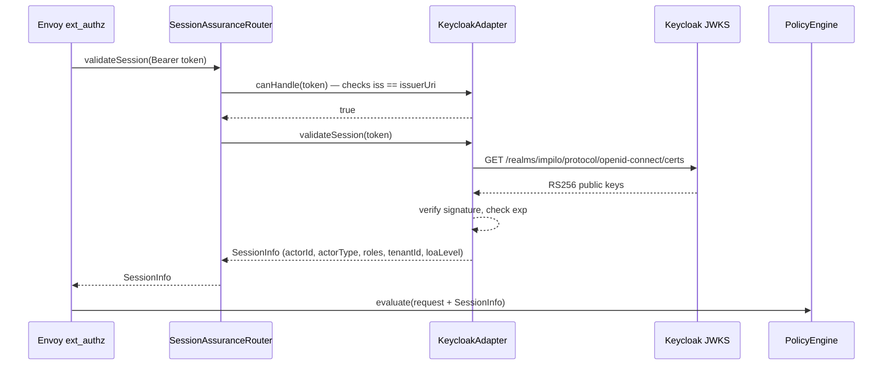
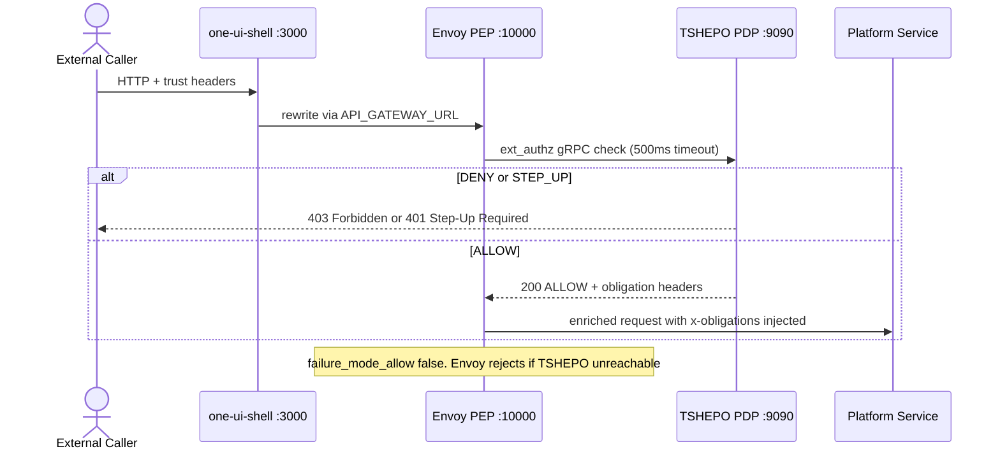
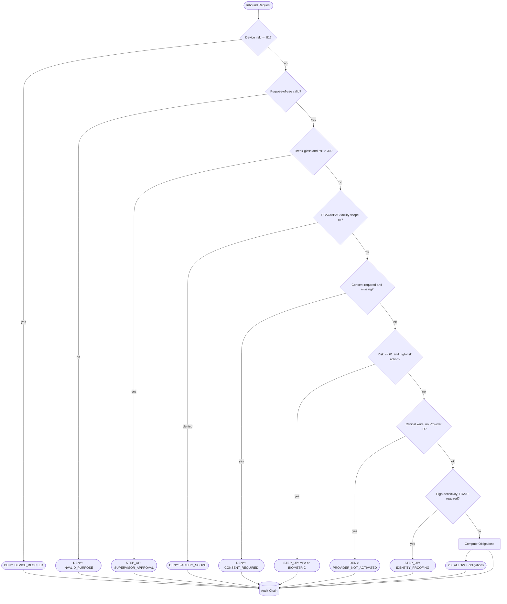
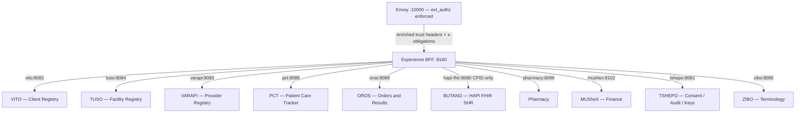
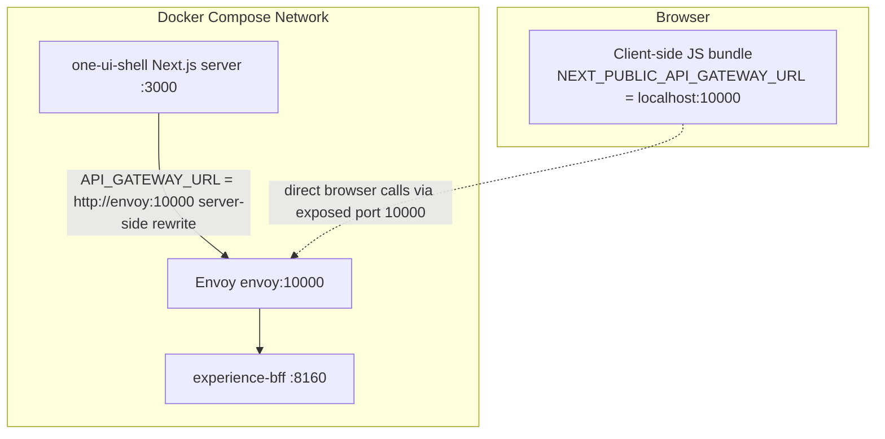
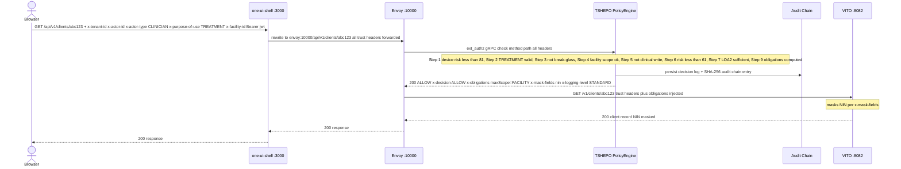

# External Service Access — Envoy Gateway & TSHEPO Trust Specification

**Version**: 1.1  
**Scope**: How external callers (browser, mobile apps, partner systems) reach platform services (VITO, TUSO, VARAPI, PCT, OROS, BUTANO, etc.) through the Envoy edge and TSHEPO Policy Decision Point. Includes a dedicated section (§13) covering machine-to-machine access patterns for external partner systems integrating directly with the Registry Spine (VITO, TUSO, VARAPI).

---

## 1. Overview

All external access to Impilo platform services flows through a two-layer enforcement boundary:

1. **Envoy Proxy** (port `10000`) — the Policy Enforcement Point (PEP). Routes requests and calls TSHEPO for authorization before forwarding.
2. **TSHEPO** — the Policy Decision Point (PDP). Evaluates every request against 10 access-control dimensions and injects obligation headers into approved requests.

No request reaches a platform service without passing through both layers. Direct service-to-service calls (e.g., Experience BFF → VITO) bypass Envoy but propagate the same trust headers that TSHEPO originally stamped.

---

## 2. Authentication — How Callers Obtain and Present Credentials

### 2.1 Token Issuance — Keycloak (OIDC)

External callers authenticate against **Keycloak** (port `8480`, realm `impilo`) using standard OIDC flows before making any platform API call:

| Caller Type | Grant Flow | Result |
|---|---|---|
| Browser / citizen | Authorization Code + PKCE | JWT access token + HttpOnly refresh cookie |
| Service account / partner | Client Credentials | JWT access token |
| MFA step-up | Device / OOB challenge | Upgraded JWT with higher `acr` claim |

Token endpoint:
```
POST /realms/impilo/protocol/openid-connect/token
```

### 2.2 Carrying the Token

Every request must include the JWT as a bearer token plus the full trust header set:

```
Authorization: Bearer <keycloak-jwt>
X-Tenant-ID: <uuid>
X-Actor-ID: <health-id>
X-Actor-Type: CLINICIAN | CITIZEN | SERVICE | ADMIN
X-Purpose-Of-Use: TREATMENT | CARE_MANAGEMENT | BREAK_GLASS | ...
X-Correlation-ID: <uuid>
```

The `api-client.ts` layer in `one-ui-shell` assembles these headers automatically from the auth store and operational context on every outbound call.

### 2.3 Token Validation by TSHEPO

When Envoy's `ext_authz` filter forwards the request to **TSHEPO-authz-service** (gRPC `:9090`), the `ExtAuthzGrpcService` delegates to `SessionAssuranceRouter`, which routes the JWT to the appropriate adapter:



`KeycloakAdapter` extracts and maps the following JWT claims into `SessionInfo`:

| JWT Claim | Mapped To | Notes |
|---|---|---|
| `sub` | `actorId` | Health ID — person anchor |
| `realm_access.roles` | `roles` | Role list for RBAC checks |
| `actor_type` (custom) | `actorType` | Falls back to role-derived type |
| `tenant_id` / `organization` | `tenantId` | UUID |
| `acr` | `loaLevel` | `0`–`3` (maps LoA1–LoA4) |
| `sid` | `sessionId` | Keycloak session ID |

If the JWT is invalid, expired, or the JWKS endpoint is unreachable, `SessionValidationException` is thrown → Envoy returns **401 Unauthorized**.

### 2.4 Pluggable Identity Provider Support

`SessionAssuranceRouter` iterates all registered `SessionAssurance` adapter beans by calling `canHandle(token)` on each before falling back to `KeycloakAdapter`. This allows additional identity providers (enterprise SSO, MOSIP, federation adapters) to be registered without changing the core authorization path.

### 2.5 Defence-in-Depth: Resource Server JWT Validation

Individual platform services (VITO, TUSO, VARAPI, etc.) also validate JWTs independently as **Spring OAuth2 Resource Servers** using the same Keycloak JWKS endpoint:

```yaml
spring.security.oauth2.resourceserver.jwt:
  jwk-set-uri: ${KEYCLOAK_URL}/realms/${KEYCLOAK_REALM}/protocol/openid-connect/certs
```

By the time a request reaches a platform service it has already been authorized by TSHEPO via Envoy. The resource server check is a defence-in-depth layer only.

### 2.6 Token Refresh

On a `401` response, `api-client.ts` attempts a single silent refresh via the BFF:
```
POST /internal/v1/auth/refresh   (HttpOnly refresh cookie sent automatically)
```
If refresh succeeds the original request is retried with the new token. If it fails, the auth store is cleared and the user is redirected to `/auth/login`.

---

## 3. Request Lifecycle — External Caller to Platform Service



> **Failure mode**: `failure_mode_allow: false` — if TSHEPO is unreachable, Envoy **rejects** the request. There is no degraded passthrough.

---

## 4. Trust Header Contract

### 4.1 Mandatory Request Headers (caller must supply)

Every external request must carry:

| Header | Type | Description |
|--------|------|-------------|
| `x-tenant-id` | UUID | Tenant scope |
| `x-actor-id` | String | Health ID — person anchor (not a service account) |
| `x-actor-type` | String | e.g. `CLINICIAN`, `PATIENT`, `SYSTEM`, `SUPER_ADMIN` |
| `x-purpose-of-use` | String | e.g. `TREATMENT`, `CARE_MANAGEMENT`, `BREAK_GLASS` |
| `x-correlation-id` | UUID | Distributed trace ID (generated if absent) |
| `x-request-id` | UUID | Per-request ID |
| `x-pod-id` | String | Deployment pod identifier |

If any mandatory header is absent, TSHEPO returns `403 MISSING_HEADERS` and Envoy rejects the request without forwarding.

### 4.2 Contextual Headers (supply where applicable)

| Header | Description |
|--------|-------------|
| `x-provider-id` | Regulated professional role ID — required for clinical write actions |
| `x-facility-id` | UUID of the facility context |
| `x-tuso-facility-id` | TUSO numeric facility ID (preferred for registry alignment) |
| `x-department-id` | Department within facility |
| `x-ward-id` | Ward within department |
| `x-workspace-id` | Active workspace ID |
| `x-programme-id` | Health programme context |
| `x-shift-id` | Active shift ID |
| `x-assurance-level` | Identity assurance level: `LOA1`–`LOA4` |
| `x-subject-id` | Patient/subject of the action |
| `x-access-mode` | Access mode flag |
| `x-workflow-state` | Workflow state, e.g. `DRAFT`, `ACTIVE`, `DISCHARGED` |
| `x-device-fingerprint` | Device fingerprint for risk scoring |

### 4.3 Response / Obligation Headers (injected by TSHEPO on ALLOW)

When TSHEPO approves a request, Envoy injects these into the forwarded request before it reaches the platform service:

| Header | Description |
|--------|-------------|
| `x-decision` | Always `ALLOW` on forwarded requests |
| `x-obligations` | JSON blob of policy obligations (masking rules, scope limits, etc.) |
| `x-max-scope` | Maximum data scope permitted |
| `x-mask-fields` | Comma-separated list of fields to mask |
| `x-logging-level` | Required audit logging depth |
| `x-friction-level` | Graduated friction level for downstream UX enforcement |
| `X-Policy-Decision` | Machine-readable verdict: `ALLOW` |
| `X-Policy-Version` | Policy ruleset version, e.g. `v1.1.0` |
| `X-Decision-Reason` | Comma-separated reason codes, e.g. `POLICY_SATISFIED` |

---

## 5. TSHEPO Policy Decision Point — 10-Dimension Evaluation

`PolicyEngine.java` evaluates every request through a sequential gate chain. Any gate can short-circuit with DENY or STEP_UP before reaching the next.



Every decision — ALLOW, DENY, or STEP_UP — is written to the tamper-evident audit chain (`audit_event` table, SHA-256 hash-chained per tenant) before returning to Envoy.

### Decision Responses

| Verdict | HTTP Status | Envoy Behaviour |
|---------|-------------|-----------------|
| `ALLOW` | `200 OK` | Forwards request to upstream with obligation headers injected |
| `DENY` | `403 Forbidden` | Rejects request; returns `X-Decision-Reason` to caller |
| `STEP_UP_REQUIRED` | `401 Unauthorized` | Rejects request; returns required challenge methods |

---

## 6. Envoy Routing Table

Envoy matches request prefixes and routes to the appropriate upstream cluster. Routes are evaluated **in order** — more specific prefixes must appear first.

| External Prefix | Upstream Cluster | Internal Rewrite | Service |
|-----------------|-----------------|------------------|---------|
| `/internal/v1/*` | `experience_bff` | (none) | Experience BFF :8160 |
| `/external/v1/*` | `tshepo_service` | (none) | TSHEPO :8081 |
| `/bff/*` | `experience_bff` | `/` | Experience BFF :8160 |
| `/api/v1/authorize` | `tshepo_service` | `/v1/authorize` | TSHEPO :8081 |
| `/api/v1/step-up` | `tshepo_service` | `/v1/step-up` | TSHEPO :8081 |
| `/api/v1/break-glass` | `tshepo_service` | `/v1/break-glass` | TSHEPO :8081 |
| `/api/v1/policies` | `tshepo_service` | `/v1/policies` | TSHEPO :8081 |
| `/api/v1/consent` | `tshepo_service` | `/v1/consent` | TSHEPO :8081 |
| `/api/v1/audit` | `tshepo_service` | `/v1/audit` | TSHEPO :8081 |
| `/api/v1/keys` | `tshepo_service` | `/v1/keys` | TSHEPO :8081 |
| `/api/v1/identity` | `tshepo_service` | `/v1/identity` | TSHEPO :8081 |
| `/api/v1/clients/snapshot` | `vito_service` | `/internal/v1/snapshots/clients` | VITO :8082 |
| `/api/v1/clients` | `vito_service` | `/v1/clients` | VITO :8082 |
| `/api/v1/recovery` | `vito_service` | `/v1/recovery` | VITO :8082 |
| `/api/v1/providers/snapshot` | `varapi_service` | `/internal/v1/snapshots/providers` | VARAPI :8083 |
| `/api/v1/providers` | `varapi_service` | `/v1/internal/providers` | VARAPI :8083 |
| `/api/v1/facilities/snapshot` | `tuso_service` | `/internal/v1/snapshots/facilities` | TUSO :8084 |
| `/api/v1/facilities` | `tuso_service` | `/v1/internal/facilities` | TUSO :8084 |
| `/api/v1/workspaces` | `tuso_service` | `/v1/internal/workspaces` | TUSO :8084 |
| `/api/v1/resources` | `tuso_service` | `/v1/internal/resources` | TUSO :8084 |
| `/api/v1/bookings` | `tuso_service` | (none) | TUSO :8084 |
| `/api/v1/telemetry` | `tuso_service` | (none) | TUSO :8084 |
| `/v1/artifacts` | `zibo_service` | (none) | ZIBO :8085 |
| `/v1/packs` | `zibo_service` | (none) | ZIBO :8085 |
| `/api/v1/work` | `pct_service` | `/v1/work` | PCT :8088 |
| `/api/v1/encounters` | `pct_service` | `/v1/encounters` | PCT :8088 |
| `/api/v1/queues` | `pct_service` | `/v1/queues` | PCT :8088 |
| `/v1/orders` | `oros_service` | (none) | OROS :8089 |
| `/api/v1/pharmacy` | `pharmacy_service` | (none) | Pharmacy :8097 |
| `/api/v1/prescriptions` | `pharmacy_service` | (none) | Pharmacy :8097 |
| `/api/v1/payments` | `mushex_service` | (none) | MUSheX :8102 |
| `/api/v1/refunds` | `mushex_service` | (none) | MUSheX :8102 |
| `/api/v1/bills` | `costa_service` | (none) | COSTA :8101 |
| `/api/v1/tariffs` | `costa_service` | (none) | COSTA :8101 |
| `/api/v1/wards` | `ubomi_service` | (none) | Ubomi :8087 |
| `/api/v1/beds` | `ubomi_service` | (none) | Ubomi :8087 |
| `/api/v1/admissions` | `ubomi_service` | (none) | Ubomi :8087 |
| `/actuator/health` | `tshepo_service` | (none) | TSHEPO :8081 |

---

## 7. Upstream Cluster Definitions (Docker Compose Runtime)

| Cluster Name | Address | Protocol | Notes |
|---|---|---|---|
| `tshepo_authz_grpc` | `tshepo:9090` | HTTP/2 (gRPC) | Used exclusively by ext_authz filter |
| `tshepo_service` | `tshepo:8081` | HTTP/1.1 | TSHEPO REST API routes |
| `vito_service` | `vito:8082` | HTTP/1.1 | Client Registry |
| `varapi_service` | `varapi:8083` | HTTP/1.1 | Provider Registry |
| `tuso_service` | `tuso:8084` | HTTP/1.1 | Facility Registry |
| `zibo_service` | `zibo:8085` | HTTP/1.1 | Terminology |
| `pct_service` | `pct:8088` | HTTP/1.1 | Patient Care Tracker |
| `oros_service` | `oros:8089` | HTTP/1.1 | Orders & Results |
| `pharmacy_service` | `pharmacy:8097` | HTTP/1.1 | Pharmacy |
| `mushex_service` | `mushex:8102` | HTTP/1.1 | Finance/Payments |
| `costa_service` | `costing-engine:8101` | HTTP/1.1 | Costing Engine |
| `ubomi_service` | `ubomi:8087` | HTTP/1.1 | Inpatient/Beds |
| `experience_bff` | `experience-bff:8160` | HTTP/1.1 | Experience BFF |
| `opa_sidecar` | `opa:8181` | HTTP/1.1 | OPA (policy store) |

> **Note**: In local development (`infra/envoy/envoy.yaml`), cluster addresses use `host.docker.internal` instead of Docker service names.

---

## 8. Experience BFF — Internal Service Access Pattern

Once a request reaches the Experience BFF (via `/internal/v1/*`), the BFF makes **direct HTTP calls** to platform services using `RestTemplate` — it does **not** route back through Envoy.



### 8.1 Trust Header Propagation

`ServiceClientConfig.trustHeaderForwardingInterceptor` copies every TSHEPO-stamped header from the inbound request onto every outbound `RestTemplate` call:

- All mandatory headers (`x-tenant-id`, `x-actor-id`, `x-actor-type`, `x-purpose-of-use`, `x-correlation-id`)
- All contextual headers (`x-facility-id`, `x-workspace-id`, `x-shift-id`, `x-provider-id`, etc.)
- `Authorization` (JWT bearer token)
- Obligation headers (`x-obligations`, `x-mask-fields`, `x-logging-level`)

This means platform services (VITO, TUSO, etc.) receive the **same trust context** that Envoy/TSHEPO originally validated — they do not need to re-authorise the request.

### 8.2 BFF → Service URL Mapping

URLs are configured via `@ConfigurationProperties(prefix = "impilo.services")`, overridden by environment variables in compose:

| Service Client | Default URL | Compose Env Var |
|---|---|---|
| `VitoServiceClient` | `http://localhost:8082` | `VITO_BASE_URL` |
| `TusoServiceClient` | `http://localhost:8084` | `TUSO_BASE_URL` |
| `VarapiServiceClient` | `http://localhost:8083` | `VARAPI_BASE_URL` |
| `PctServiceClient` | `http://localhost:8088` | `PCT_BASE_URL` |
| `OrosServiceClient` | `http://localhost:8089` | `OROS_BASE_URL` |
| `ButanoServiceClient` | `http://localhost:8090` | `BUTANO_BASE_URL` |
| `PharmacyServiceClient` | `http://localhost:8096` | `PHARMACY_BASE_URL` |
| `MushexServiceClient` | `http://localhost:8102` | `MUSHEX_BASE_URL` |
| `CostaServiceClient` | `http://localhost:8101` | `COSTA_BASE_URL` |
| `ZiboServiceClient` | `http://localhost:8085` | (via `impilo.services.*`) |
| `TshepoAuthzServiceClient` | `http://localhost:8081` | (via `impilo.services.*`) |

### 8.3 PII / FHIR Split

**VITO** holds all PII (demographics, identity, contact details).  
**BUTANO (HAPI FHIR)** holds clinical resources keyed by `CPID` only — no PII ever written to BUTANO.  
The BFF is responsible for joining these two sources when composing a patient view.

---

## 9. One UI Shell — Gateway URL Routing

The Next.js `one-ui-shell` proxies browser requests to Envoy using Next.js rewrites (`next.config.mjs`):

| Browser Path | Rewrite Destination (server-side) | Notes |
|---|---|---|
| `/internal/*` | `API_GATEWAY_URL/internal/*` | → Envoy → ext_authz → BFF |
| `/api/*` | `API_GATEWAY_URL/api/*` | → Envoy → ext_authz → platform service |



**Environment variable priority** for server-side rewrites (runs inside the container):

1. `API_GATEWAY_URL` — Docker network hostname, e.g. `http://envoy:10000` ← **set this in compose**
2. `NEXT_PUBLIC_API_GATEWAY_URL` — browser-embedded fallback, e.g. `http://localhost:10000`
3. `http://localhost:10000` — hardcoded default for local dev

`NEXT_PUBLIC_*` variables are baked into the client-side JS bundle at build time. They must use `localhost` (host-accessible) addresses. The server-side `API_GATEWAY_URL` uses Docker service names and is never sent to the browser.

---

## 10. Complete End-to-End Flow: Browser → VITO



---

## 11. Security Constraints

| Rule | Enforcement |
|------|-------------|
| No request bypasses Envoy ext_authz | `failure_mode_allow: false` — Envoy rejects if TSHEPO is unreachable |
| No PII stored in BUTANO/FHIR | Architectural boundary — BFF enforces the join |
| Every decision is audited | `PolicyEngine` writes tamper-evident audit chain on every call |
| Trust headers are not caller-forgeable | Headers are validated by TSHEPO; callers cannot self-issue obligation headers |
| Clinical writes require Provider ID | `PROVIDER_NOT_ACTIVATED` deny if `x-provider-id` absent on regulated actions |
| High-sensitivity resources require LOA3+ | Assurance level gate (Step 8) — returns `STEP_UP_REQUIRED` with `IDENTITY_PROOFING` |

---

## 12. Reference Files

| Purpose | File |
|---------|------|
| Envoy runtime config (Docker Compose) | [`infra/envoy/envoy-runtime.yaml`](../../infra/envoy/envoy-runtime.yaml) |
| Envoy local dev config | [`infra/envoy/envoy.yaml`](../../infra/envoy/envoy.yaml) |
| TSHEPO Policy Decision Point | [`services/tshepo-service/…/core/PolicyEngine.java`](../../services/tshepo-service/src/main/java/zw/gov/mohcc/impilo/tshepo/core/PolicyEngine.java) |
| Trust header constants | [`services/tshepo-service/…/core/TrustHeaders.java`](../../services/tshepo-service/src/main/java/zw/gov/mohcc/impilo/tshepo/core/TrustHeaders.java) |
| Envoy ext_authz gRPC handler | [`services/tshepo-authz-service/…/grpc/ExtAuthzGrpcService.java`](../../services/tshepo-authz-service/src/main/java/zw/gov/mohcc/impilo/tshepo/authz/grpc/ExtAuthzGrpcService.java) |
| Session validation router | [`services/tshepo-authz-service/…/session/SessionAssuranceRouter.java`](../../services/tshepo-authz-service/src/main/java/zw/gov/mohcc/impilo/tshepo/authz/session/SessionAssuranceRouter.java) |
| Keycloak JWT adapter | [`services/tshepo-authz-service/…/session/KeycloakAdapter.java`](../../services/tshepo-authz-service/src/main/java/zw/gov/mohcc/impilo/tshepo/authz/session/KeycloakAdapter.java) |
| Keycloak realm config | [`tools/auth/impilo-realm.json`](../../tools/auth/impilo-realm.json) |
| BFF service client config | [`services/experience-bff/…/config/ServiceClientConfig.java`](../../services/experience-bff/src/main/java/zw/gov/mohcc/impilo/experience/config/ServiceClientConfig.java) |
| Next.js API client (trust headers + token) | [`ui/one-ui-shell/src/lib/api-client.ts`](../../ui/one-ui-shell/src/lib/api-client.ts) |
| Next.js rewrite config | [`ui/one-ui-shell/next.config.mjs`](../../ui/one-ui-shell/next.config.mjs) |
| Runtime compose | [`docker-compose.runtime.yml`](../../docker-compose.runtime.yml) |
| Port allocation | [`docs/runbooks/port-allocation.md`](../runbooks/port-allocation.md) |

---

## 13. External Service (Machine-to-Machine) Access to the Registry Spine

This section covers **partner systems and external services** — HMIS integrations, lab systems, insurance platforms, government registries, and any non-human caller — that need to communicate directly with VITO (Client Registry), TUSO (Facility Registry), or VARAPI (Provider Registry) through the Envoy/TSHEPO gateway without routing through the Experience BFF.

---

### 13.1 Design Principles

1. **No bypass** — every M2M request must pass through Envoy (`ext_authz` → TSHEPO) regardless of caller type. There is no separate "service mesh" shortcut for external systems.
2. **Service identity != human identity** — external services authenticate as a named **Keycloak confidential client** using the Client Credentials grant. The resulting JWT identifies the _system_, not a person.
3. **Human-context headers are still required** — even for M2M calls, TSHEPO evaluates `x-purpose-of-use`, `x-actor-type` (`SERVICE` or `SYSTEM`), and `x-tenant-id`. Calls missing these headers receive `403 MISSING_HEADERS`.
4. **Audit chain applies universally** — every M2M decision (ALLOW or DENY) is written to the tamper-evident audit chain with the system's `client_id` as the audit subject.
5. **Principle of Least Privilege** — each partner system receives its own dedicated Keycloak client scoped to only the registry operations it requires. Shared service accounts are prohibited.

---

### 13.2 Keycloak Client Registration

External services must be provisioned as **confidential clients** with Service Accounts enabled in the `impilo` realm:

```json
{
  "clientId": "partner-hmis-example",
  "name": "Example HMIS Integration",
  "enabled": true,
  "publicClient": false,
  "standardFlowEnabled": false,
  "directAccessGrantsEnabled": false,
  "serviceAccountsEnabled": true,
  "secret": "<generated — never reuse impilo-backend-secret>",
  "defaultClientScopes": ["openid", "impilo-tenant"],
  "attributes": {
    "access.token.lifespan": "300"
  }
}
```

**Required realm roles** assigned to the service account (`service-account-<clientId>`):

| Registry | Minimum Role | Permitted Operations |
|---|---|---|
| VITO (Client Registry) | `DEVELOPER` | Read-only client lookup, identity resolution |
| VITO (Client Registry) | `SYSTEM_ADMIN` | Snapshot pulls, bulk reads |
| TUSO (Facility Registry) | `DEVELOPER` | Read-only facility/workspace/resource queries |
| VARAPI (Provider Registry) | `DEVELOPER` | Read-only provider lookups |

> **Note**: Write operations on any registry (create/update client, facility, or provider records) require escalation to `FACILITY_ADMIN` or `SYSTEM_ADMIN` role assignment — these are audited separately and require prior approval through the Impilo governance process.

**Protocol mappers** that must be configured on the client to populate the trust header claims in the JWT:

| Mapper | Claim | Value |
|---|---|---|
| Hardcoded claim | `actor_type` | `SERVICE` |
| Hardcoded claim | `tenant_id` | `<partner-tenant-uuid>` |
| User attribute mapper | `facility_id` | Set on the service account user if scoped to a facility |

---

### 13.3 Token Acquisition (Client Credentials Flow)

External services obtain a short-lived access token from Keycloak before every call batch (tokens expire in **300 seconds** by default):

```http
POST /realms/impilo/protocol/openid-connect/token
Host: keycloak:8480
Content-Type: application/x-www-form-urlencoded

grant_type=client_credentials
&client_id=partner-hmis-example
&client_secret=<secret>
```

**Response:**
```json
{
  "access_token": "<jwt>",
  "token_type": "Bearer",
  "expires_in": 300,
  "scope": "openid impilo-tenant"
}
```

**Token management rules**:
- Cache the token until `expires_in - 30` seconds (30-second safety margin before expiry).
- Do **not** request a new token on every API call — Keycloak rate-limits token endpoint requests.
- On a `401 Unauthorized` from Envoy, acquire a fresh token and retry **once**. Do not retry infinitely.

---

### 13.4 Constructing a Valid M2M Request

Every request to Envoy must include the JWT bearer token **and** the complete mandatory trust header set. For external services, `x-actor-type` must be `SERVICE` or `SYSTEM`.

```http
GET /api/v1/clients/{healthId}
Host: <envoy-host>:10000
Authorization: Bearer <keycloak-jwt>
X-Tenant-ID: <partner-tenant-uuid>
X-Actor-ID: partner-hmis-example
X-Actor-Type: SERVICE
X-Purpose-Of-Use: CARE_MANAGEMENT
X-Correlation-ID: <uuid-v4>
X-Request-ID: <uuid-v4>
X-Pod-ID: hmis-pod-01
```

For calls that involve a **specific facility context** (e.g., querying resources at a known facility):

```http
X-Facility-ID: <facility-uuid>
X-Tuso-Facility-ID: <tuso-numeric-id>
```

**Purpose-of-use values permitted for external services:**

| Purpose | Allowed For |
|---|---|
| `CARE_MANAGEMENT` | Clinical integration partners reading client/provider records |
| `ADMINISTRATIVE` | Insurance, billing, facility management integrations |
| `PUBLIC_HEALTH` | Surveillance, reporting, epidemiological systems |
| `RESEARCH` | Approved research institutions (requires additional consent gate) |
| `SYSTEM_SYNC` | Registry-to-registry synchronisation (snapshot pulls only) |

> `TREATMENT` and `BREAK_GLASS` purposes are **not permitted** for service accounts — they require a human actor with a verified clinical session.

---

### 13.5 Registry Endpoint Reference (via Envoy)

All paths below are relative to `envoy:10000`. Every request passes through the `ext_authz` → TSHEPO gate before being forwarded to the upstream service.

#### VITO — Client Registry (`:8082`)

| Method | Envoy Path | Internal Rewrite | Description |
|---|---|---|---|
| `GET` | `/api/v1/clients/{healthId}` | `GET /v1/clients/{healthId}` | Look up a single client by Health ID |
| `GET` | `/api/v1/clients?nid={nid}` | `GET /v1/clients?nid={nid}` | Resolve client by National ID |
| `GET` | `/api/v1/clients/snapshot` | `GET /internal/v1/snapshots/clients` | Full snapshot pull (requires `SYSTEM_SYNC` purpose) |
| `GET` | `/api/v1/recovery` | `GET /v1/recovery` | Identity recovery queries |

> VITO holds all PII. Response fields may be masked by TSHEPO obligation headers (e.g., `x-mask-fields: nin,dob`) depending on the partner's role and assurance level.

#### TUSO — Facility Registry (`:8084`)

| Method | Envoy Path | Internal Rewrite | Description |
|---|---|---|---|
| `GET` | `/api/v1/facilities/{id}` | `GET /v1/internal/facilities/{id}` | Look up a facility by UUID |
| `GET` | `/api/v1/facilities` | `GET /v1/internal/facilities` | List/filter facilities |
| `GET` | `/api/v1/facilities/snapshot` | `GET /internal/v1/snapshots/facilities` | Full snapshot pull |
| `GET` | `/api/v1/workspaces` | `GET /v1/internal/workspaces` | List workspaces |
| `GET` | `/api/v1/resources` | `GET /v1/internal/resources` | List facility resources |
| `GET` | `/api/v1/bookings` | `GET /api/v1/bookings` (no rewrite) | Booking queries |
| `GET` | `/api/v1/telemetry` | `GET /api/v1/telemetry` (no rewrite) | Facility telemetry |

#### VARAPI — Provider Registry (`:8083`)

| Method | Envoy Path | Internal Rewrite | Description |
|---|---|---|---|
| `GET` | `/api/v1/providers/{id}` | `GET /v1/internal/providers/{id}` | Look up a provider by ID |
| `GET` | `/api/v1/providers` | `GET /v1/internal/providers` | List/filter providers |
| `GET` | `/api/v1/providers/snapshot` | `GET /internal/v1/snapshots/providers` | Full snapshot pull |

---

### 13.6 Complete M2M Flow: External Service → VITO

```mermaid
sequenceDiagram
    actor ES as External Service (Partner HMIS)
    participant KC as Keycloak :8480
    participant E as Envoy PEP :10000
    participant T as TSHEPO PDP :9090
    participant DB as Audit Chain
    participant V as VITO :8082

    ES->>KC: POST /realms/impilo/protocol/openid-connect/token (client_credentials)
    KC-->>ES: access_token + expires_in 300

    Note over ES: Cache token; reuse until expires_in minus 30s

    ES->>E: GET /api/v1/clients/{healthId} + Bearer jwt + trust headers
    Note over ES: X-Actor-Type SERVICE, X-Purpose-Of-Use CARE_MANAGEMENT

    E->>T: ext_authz gRPC check — all headers forwarded (500ms timeout)

    Note over T: Gate 1 device risk ok, Gate 2 CARE_MANAGEMENT valid
    Note over T: Gate 3 not break-glass, Gate 4 facility scope ok
    Note over T: Gate 5 no consent gate, Gate 6 risk below 61
    Note over T: Gate 7 no Provider ID needed, Gate 8 LOA1 sufficient
    Note over T: Gate 9 obligations computed — mask-fields nin

    T->>DB: persist decision + SHA-256 audit chain entry (subject = partner-hmis-example)

    alt DENY — missing headers or invalid purpose
        T-->>E: 403 + X-Decision-Reason
        E-->>ES: 403 Forbidden
    else STEP_UP — high-sensitivity resource requires LOA3+
        T-->>E: 401 + required challenge methods
        E-->>ES: 401 Step-Up Required — service account cannot satisfy challenge
    else ALLOW
        T-->>E: 200 ALLOW + x-obligations + x-mask-fields nin + x-logging-level STANDARD
        E->>V: GET /v1/clients/{healthId} + trust headers + obligations injected
        Note over V: masks NIN per x-mask-fields obligation
        V-->>E: 200 client record with NIN masked
        E-->>ES: 200 response
    end
```

> **Step-up behaviour for service accounts**: TSHEPO may return `STEP_UP_REQUIRED` (`401`) for high-sensitivity resources that require LOA3+ or MFA. Service accounts **cannot** satisfy a step-up challenge. If this occurs, the partner must contact the platform governance team to request an explicit policy exception or to provide the resource through a lower-sensitivity projection endpoint.

---

### 13.7 TSHEPO Policy Evaluation for SERVICE Actors

`PolicyEngine.java` applies the same 10-dimension gate chain for service accounts as it does for human actors, with these behavioural differences:

| Gate | Human Actor Behaviour | SERVICE Actor Behaviour |
|---|---|---|
| **Device risk** | Device fingerprint from browser session | `x-device-fingerprint` evaluated if present; defaults to risk=0 if absent |
| **Break-glass** | Permitted with supervisor approval | `BREAK_GLASS` purpose denied outright — service accounts cannot break glass |
| **Facility scope** | Checked against user's facility assignments | Checked against `x-facility-id` header; if absent, evaluated at tenant scope |
| **Consent gate** | Evaluated against person's consent record | Evaluated; `RESEARCH` purpose triggers explicit consent gate |
| **MFA step-up** | Redirects to MFA challenge | Returns `STEP_UP_REQUIRED` — service account call fails; no redirect possible |
| **Provider ID** | Required for clinical write actions | `PROVIDER_NOT_ACTIVATED` if `x-provider-id` absent on regulated writes |
| **Assurance level** | Checked against JWT `acr` claim (LOA1–LOA4) | Client Credentials tokens issued at **LOA1** by default. High-sensitivity reads requiring LOA3+ will be denied |

---

### 13.8 Obligation Header Handling

When TSHEPO returns `ALLOW`, Envoy injects obligation headers into the forwarded request. External services **must not rely on receiving these directly** — they are directives to the upstream platform service, not to the caller. However, the final response body will already reflect masking or scoping applied by the registry service.

Common obligations that affect VITO/TUSO/VARAPI responses for service accounts:

| Obligation Header | Typical Value | Effect on Registry Response |
|---|---|---|
| `x-mask-fields` | `nin,dob` | NIN and date-of-birth redacted from client records |
| `x-max-scope` | `TENANT` or `FACILITY` | Results filtered to the declared scope |
| `x-logging-level` | `STANDARD` or `ENHANCED` | Audit verbosity; `ENHANCED` triggers detailed field-level logging |
| `x-obligations` | JSON blob | Additional service-specific policy constraints |

---

### 13.9 Error Handling and Retry Guidance

| HTTP Status | Cause | Recommended Action |
|---|---|---|
| `401 Unauthorized` (token expired) | JWT `exp` exceeded | Acquire a new token via Client Credentials and retry once |
| `401 Unauthorized` (step-up required) | Resource requires LOA3+ | Do not retry; log and raise a governance exception |
| `403 MISSING_HEADERS` | One or more mandatory trust headers absent | Fix the request construction; do not retry without correction |
| `403 INVALID_PURPOSE` | `x-purpose-of-use` value not permitted for service actor | Change purpose or request a policy exception |
| `403 FACILITY_SCOPE` | `x-facility-id` not within the tenant's permitted scope | Verify the facility UUID; confirm the service account's scope |
| `403 CONSENT_REQUIRED` | `RESEARCH` purpose without valid consent record | Obtain consent before accessing the record |
| `503 Service Unavailable` | Envoy cannot reach TSHEPO (ext_authz timeout) | Retry with exponential backoff; TSHEPO failure blocks all requests (`failure_mode_allow: false`) |
| `504 Gateway Timeout` | Upstream registry service unresponsive | Retry with backoff; check platform health via `/actuator/health` |

**Retry policy** (recommended):
- Initial delay: 500ms
- Backoff multiplier: 2×
- Maximum retries: 3
- Maximum delay: 8s
- Do **not** retry on `403` responses — they indicate a policy decision, not a transient failure.

---

### 13.10 Security Constraints for External Services

| Rule | Enforcement |
|---|---|
| Each partner has its own Keycloak client | Shared service accounts are prohibited; each `client_id` is individually audited |
| `BREAK_GLASS` purpose denied to service accounts | TSHEPO gate 3 hard-denies this combination |
| `TREATMENT` purpose denied to service accounts | Requires human actor with active clinical session |
| Snapshot pulls restricted to `SYSTEM_SYNC` purpose | Snapshot rewrite routes (`/api/v1/*/snapshot`) checked at TSHEPO gate 2 |
| Token lifetime capped at 300 seconds | Configured per client in Keycloak; platform governance controls this ceiling |
| No PII in BUTANO | External services must never write FHIR resources containing PII — CPID only |
| All decisions audited | `PolicyEngine` writes tamper-evident audit chain for every M2M call; `client_id` is the audit subject |
| Trust headers not self-issuable | `x-obligations`, `x-decision`, and obligation headers injected by TSHEPO are stripped from inbound requests by Envoy — callers cannot forge them |
