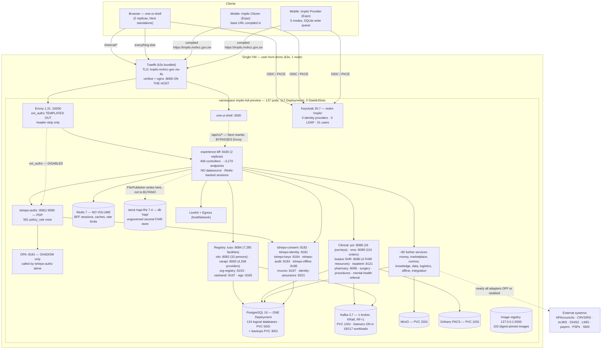

# Impilo vNext — Current-State Architecture Recovery

**Date:** 2026-08-03 · **Branch inspected:** `claude/staging-ux-orchestration-remediation-Yypyl` · **Estate probed:** `impilo-full-preview` on the single-node k3s cluster `user-hvm-domu` (10.50.1.67 / 41.57.127.235, `impilo.mohcc.gov.zw`), deployed from commit `6af50013` at 2026-08-03T05:49Z.

**Purpose.** Establish a defensible factual baseline of how vNext is *actually* wired — repository, deployment configuration, and running estate — before any hybrid or on-premises architecture is designed. This document proposes nothing. Where the intended architecture and the running architecture differ, both are stated.

## Evidence classification used throughout

| Tag | Meaning |
|---|---|
| **[VC]** Verified in code | The implementation was read |
| **[VD]** Verified in deployment configuration | Helm values, chart templates, compose, generated manifests |
| **[VR]** Verified against the running estate | `kubectl` output, live database queries, in-cluster HTTP probes performed for this report |
| **[DOC]** Documented but not verified | Exists only in documentation, comments, or naming |
| **[INF]** Inferred | Basis stated at the point of claim |
| **[MC]** Missing or contradictory | Absence proven, or two sources disagree |

A directory name, a service name, a registry entry, a doc, or a passing mocked test is **not** evidence that a capability functions. Every "works" claim below is anchored to code that executes, configuration that is deployed, or a probe that returned.

---

# A. Executive truth summary

**What vNext is architecturally.** vNext is a **single-instance national platform**: one Kubernetes namespace on one virtual machine, one Helm release, one PostgreSQL server hosting **124 logical databases** [VR], one single-broker Kafka, one Redis, one MinIO, one Keycloak realm, one Envoy, and one experience BFF through which every browser and mobile request passes. Around it sit ~100 Spring Boot services and one Next.js experience shell. It is not a distributed system in the deployment sense; it is a large modular monolith-of-services co-located on a single node, with genuine domain depth in registry, clinical, trust and money planes and a very thin operational envelope (single replicas, no distributed locking, no HA, one PVC per stateful component).

**How centralised it is.** Structurally and behaviourally centralised in every dimension examined: identity (one realm, one issuer, no federation, a *hardcoded* tenant claim), policy (one PDP, one policy table), data (one Postgres estate, patient-scoped rather than facility-scoped clinical queries), messaging (one broker), storage (one MinIO, one Orthanc), routing (one BFF, one compiled front-end base URL), integrations (one global endpoint per external system), release (one Helm release, images pinned to a **loopback registry** `127.0.0.1:5000`), and observability. There is **no concept of a node, site, or deployment instance anywhere in the domain model** — `pod_id` defaults to the literal string `national-spine` [VC].

**Is it genuinely multi-organisation?** *In vocabulary yes, in enforcement no.* The registry plane models organisations richly (17 organisation types, multi-council regulatory relationships, per-source facility legitimacy, jurisdictioned appointments, multi-employment). But the tenant boundary is an HTTP header (`X-Tenant-ID`) minted by the browser with a hardcoded default UUID [VC]; the Keycloak token's `tenant_id` claim is a **hardcoded-value mapper emitting the literal `moh-zw` for every user** [VR]; the server-authoritative tenant filter ships in `SHADOW` [VC/VR]; and clinical repositories scope by tenant + patient, **not** by facility or organisation [VC]. Two hospital groups onboarded today could be *described* separately but could not be *kept apart*.

**Is it genuinely multi-facility?** *Structurally yes, behaviourally no.* A facility's operational shape — departments, service points, queues, wards, beds, theatres, capabilities, operating hours, go-live checklist — is genuine, versioned data owned by TUSO [VC]. But no backend branches on facility type, tier, size or continuity class; the work-home experience is assembled from eight hard-coded family adapters keyed on work-mode, not on facility shape [VC]. A rural health centre and a central teaching hospital get the same compiled experience and the same national state machine.

**Is it deployable on premises today?** **No.** Not because of any single blocker but because the deployment unit does not exist: there is no facility, edge, or small-footprint Helm profile anywhere [VD, absence proven]; images are pinned to a loopback registry a second host cannot reach [VD/VR]; the public hostname and issuer are baked into ~100 services' environment and into the front-end and mobile builds [VD/VC]; TLS/ACME lives on the host outside the cluster and outside the repo [VD]; and mobile binaries refuse LAN endpoints by design [VC].

**Can it continue local clinical operations during a national outage?** **No, not as a site.** The offline capability that exists is *device*-tier, not *site*-tier: a real store-and-forward write queue in the provider mobile app [VC], signed offline capability tokens and offline packs in `tshepo-offline-service` [VC], and offline eligibility tokens in `coverage-service` [VC]. Entering any governed work mode requires a synchronous mint against the national BFF [VC]; the mobile pull-sync half is dead code targeting an endpoint no service serves [VC/MC]; and the web shell has no local runtime at all. A disconnected hospital has no Impilo to fall back to.

## The five most important current constraints

1. **The enforcement plane is deployed but disengaged.** Envoy's `ext_authz` filter is templated out in the running estate (`envoy.extAuthz.enabled: false`) [VD/VR], so no policy decision occurs at the edge. Work-context binding, tenancy, OPA, lawful-basis and decision-envelope verification are all in `SHADOW`/`OFF`/`PASSTHROUGH` [VR]. Consent is enforced in exactly one place — PDP step 5 — so any path that does not consult the PDP meets no consent gate at all [VC]. What *is* enforcing today: per-service Spring Security JWT (measured working — see §F.6), the BFF's own role matrix, its 14 in-process PDP call-outs (most flag-defaulted off), and the fail-closed confidentiality guard.
2. **There is no site or node concept — in code or in deployment.** No edge profile, no per-facility deployment, no originating-authority or record-provenance field, no conflict-resolution model, no federation envelope. `pod_id` is a constant. Any hybrid model must introduce this concept from scratch; it cannot be configured in.
3. **Identifier and data-merge safety is unestablished.** Identity is minted centrally (Health ID = random UUID in VITO; CPID = a *separate* random UUID minted by `tshepo-identity`), which is collision-safe, but there is no provenance, no version vector, no merge model, and clinical queries are patient-scoped rather than facility-scoped — so two independently-operating nodes have no defined way to reconcile, and no way to keep each other's data apart.
4. **A large amount of built capability is not on any live path.** Measured examples: the CC-5 admission handshake is fully coded but **PCT's and inpatient's Kafka listeners are disabled in the running estate** [VR]; `search-service` has **0 rows indexed** and no writer anywhere in the repo [VR/VC]; several services' inter-service base URLs are unset in Helm and resolve to `localhost` inside their own pod (OROS→BUTANO, PCT→most peers, tshepo-offline→everything, identity-assurance→ABIS, tuso→org-registry) [VD]; eight services write outbox rows that no relay ever publishes [VC]; SMS/email providers are pinned to `log` [VR].
5. **Operational fragility is total.** One node, one Postgres (124 databases, one 50 GiB volume), one Kafka broker (RF=1), Redis with **no volume at all** carrying BFF sessions, backups only for Postgres and only onto the same machine, no tested restore, `Recreate` strategy estate-wide, 74 services running `@Scheduled` jobs with **zero distributed locking** (so a second replica duplicates every sweep and every outbox publish), no HPA, no PodDisruptionBudget, and exactly **one NetworkPolicy** in the entire cluster [VR/VC].

---

# B. Current-state architecture diagram

The diagram reflects the **running** estate, not the intended design. Dashed edges are configured-but-inactive paths.



**What the diagram makes visible:**
- Every client request funnels through **one BFF**; Envoy is a header-stripping reverse proxy today, not a policy enforcement point.
- The browser has **two lanes with different paths**: `/internal/*` via Envoy, `/api/v1/*` via the Next server straight to the BFF [VD/VR — `API_GATEWAY_URL=http://experience-bff:8160` in the running shell pod].
- There are **two FHIR stores**: the governed SHR (`butano-service`, embedded HAPI, PII-blocking and tenant-tagging interceptors) and a **stock `hapi-fhir`** that the BFF's `FhirPublisher` and the FHIR gateway's default target actually write to [VC/VD]. Reads (IPS, timeline) come from the governed one.
- Everything durable is one PVC on one disk on one machine; Redis has none.

---

# C. Component catalogue

Ports below are the values in each service's own `application.yml`, cross-checked against Helm. Where they disagree with `docs/runbooks/port-allocation.md`, that is noted — the port map is stale for at least a dozen services.

## C.1 Edge, experience and trust plane

| Component | Product role | Actually implemented | Deployment unit | Data store | AuthN | AuthZ | Scope | Failure behaviour | Local-operable? | Evidence | Confidence |
|---|---|---|---|---|---|---|---|---|---|---|---|
| **Envoy** | Trust-first edge, ext_authz to TSHEPO | Reverse proxy to `experience-bff` **only**; strips assurance/obligation headers; **ext_authz filter absent from the rendered config** | Deployment, 1 replica, :10000/:9901 | none | n/a | none today | national | `failure_mode_allow:false` *would* deny on PDP outage — inactive | Yes (stateless) | `deploy/helm/.../templates/envoy.yaml:38-202`; `values-full-preview.yaml:178-179`; live ConfigMap `envoy-config` has no `ext_authz` | [VD][VR] |
| **experience-bff** | Composition/orchestration BFF | 409 `@RestController`, ~3,270 endpoints, 366 prefixes, 86 service clients, 111 downstream env vars; mints service tokens; forwards trust headers | Deployment, **2 replicas**, :8160 | **No datasource** (no JDBC/Flyway on classpath); **Redis** holds sessions, idempotency, rate limits, workspace state | Keycloak JWT + BFF OIDC cookie session | Own role matrix + 14 PDP call-outs (most default off) | national | Structured 503s; three lanes fall back to stubs | Yes, but composes nothing without downstreams | `services/experience-bff/.../config/ServiceClientConfig.java:339-538`; `application.yml`; 45 **dead** migrations in `db/migration/` never execute | [VC][VD] |
| **one-ui-shell** | The single experience shell | Next 14 app-router, 942 pages, ~100 route groups, 756-entry route registry | Deployment, 2 replicas, :3000 | none (browser storage) | BFF cookie session; no Keycloak URL in browser code | Middleware guard + server-issued contracts | national | Offline outbox in IndexedDB for mutations | Only against a reachable BFF | `ui/one-ui-shell/src/lib/api-client.ts`, `src/middleware.ts`, `next.config.mjs` | [VC][VD] |
| **Keycloak 26.7** | National IdP | One realm `impilo`, 20 clients, 61 realm roles, passkey flow; **0 identity providers, 0 user-federation components**, 51 users | Deployment, 1 replica, :8080 | `keycloak` DB in the shared Postgres (migrated off H2 2026-08-01) | — | — | national | Single point: no new logins without it | No (national singleton) | live `keycloak` DB query; `deploy/helm/.../files/realm-impilo-preview.json` | [VR][VD] |
| **tshepo-authz** | The PDP | HTTP+gRPC ext_authz, 2,203-line PolicyEngine, **561 policy_rule rows** live, step-up/TOTP, break-glass, visibility escalation, GDHCN registry | Deployment, :8081 (+:9090 gRPC, not exposed by the Service) | `tshepo_authz`, 68 migrations | JWT (`/v1/authorize` permitAll by design) | is the authority | national | Consent fail-closed; identity introspection fail-open; revocation check fail-open when Redis is down | Yes if its deps are local | `services/tshepo-authz-service/.../core/PolicyEngine.java`; live row count | [VC][VR] |
| **OPA** | Policy engine | Deployed, loaded with `infra/opa` rego; **called only by tshepo-authz, in SHADOW**; ENFORCE start-gated on a parity-evidence file | Deployment, :8181 | policies from ConfigMap | — | never authoritative | national | errors swallowed | Yes | live `opa-authz-policy` ConfigMap; `TSHEPO_AUTHZ_OPA_MODE=SHADOW` in the running pod | [VR][VC] |
| **tshepo-consent** | Consent SoR + evaluation oracle | Directives, audit, share links; `GET /v1/consent/evaluate` is the PDP's oracle and is **permitAll** | Deployment, :8182 | `tshepo_consent`, 1 migration, **3 directives live** | permitAll on evaluate; JWT elsewhere | — | tenant-scoped | Redis write-path exception escapes → evaluate 500s → estate-wide DENY | Yes | `core/ConsentEvaluationService.java`; live probe returned 400 (reached, unauthenticated) | [VC][VR] |
| **mvumo** | Consent experience | Requests, templates, remote sessions, delegations, comms preferences; materialises every grant into tshepo-consent (throws if unreachable) | Deployment, :8197 (Dockerfile says 8195) | `mvumo`, 10 migrations | JWT | — | tenant | grant fails rather than fabricating | Needs consent SoR per grant | `MvumoService.java:366-376`; `integration/TshepoConsentClient.java` | [VC] |
| **tshepo-identity** | CPID registry + internal token authority | Health-ID↔CPID mapping, O-CPID, **Ed25519 scoped/WORK_CONTEXT tokens** via tshepo-keys, MOSIP *link vault* (no live MOSIP call) | Deployment, :8181 | `tshepo_identity`, 6 migrations | JWT; introspect permitAll | — | tenant | fail-open introspection at the PDP | Token mint needs keys-service | `core/TokenIssuanceService.java`; `core/CpidGenerator.java:34` | [VC] |
| **tshepo-keys** | Key custody / signing | Per-tenant purpose-scoped Ed25519 keys, JWKS, JWS signing, scoped S2S tokens, managed secrets; KEK boot-blocking | Deployment, :8184 | `tshepo_keys`, 3 migrations | JWT | ADMIN roles for key ops | tenant | refuses to start on placeholder KEK | Yes | `core/custody/ConfigKekProvider.java:40-60` | [VC] |
| **tshepo-audit** | Tamper-evident audit ledger | Kafka + REST ingest, per-tenant SHA-256 hash chain, access history, signed exports; **9,243 audit events live** | Deployment, :8183 | `tshepo_audit`, 3 migrations | ingest/query **permitAll**, tenant from header | — | tenant (header-chosen) | at-least-once via manual ack | Yes | `core/AuditChainService.java:66-125`; live count + probe (400, reached) | [VC][VR] |
| **tshepo-offline** | Offline trust artefacts | Capability tokens (offline-verifiable via cached JWKS), signed offline packs, offline rules engine, reconciliation | Deployment, :8185 | `tshepo_offline`, 2 migrations | JWT | — | tenant+facility | **Helm sets none of its three downstream URLs → localhost → cannot issue in preview** | Verify yes; issue no | `application.yml:69-71` vs `values-full-preview-runtime.generated.yaml:813` | [VC][VD] |
| **identity-assurance** | LOA ladder | LOA1–4 ledger, dual-control upgrades, deterministic risk engine, attestations, ABIS biometric binding (fail-closed) | Deployment, :8201 | `identity_assurance`, 2 migrations | JWT | — | tenant | **`ABIS_BASE_URL` unset in Helm → biometric LOA4 unreachable** | Yes except biometrics | `shared-core/.../BiometricVerificationClient.java`; Helm env absence | [VC][VD] |
| **tshepo-service** (legacy) | Original monolith | **Retired.** Fail-open PolicyEngine (allow-by-default), federation pod registry, three policy verticals | **Not deployed** — compose only | `tshepo` + a second datasource into `tuso` | — | — | — | its compat proxy resolves to `localhost:8079` in k8s → 503 | n/a | absent from `values-full-preview-digests.generated.yaml`; `docker-compose.runtime.yml:233` | [VD][VC] |

> **CLAUDE.md correction.** The documented Golden Thread cites `services/tshepo-service/.../AuthorizeController.java` and `core/PolicyEngine.java`. Those classes exist and behave as described, but that service is **retired and not deployed**, and its engine is *allow-by-default*. The live PDP is `tshepo-authz-service`. [VC][VD]

## C.2 Registry plane

| Component | Actually implemented | Port | Data store | Scope columns | Key dependencies | Local-operable? | Confidence |
|---|---|---|---|---|---|---|---|
| **tuso** | Facility master (**7,285 facility rows live**, MFL seed of 1,773 + HPA imports), FCV legitimacy rail, HPA regulatory platform, departments/units/service points/clinical spaces/beds/theatres, facility config versioning, geo gazetteer, virtual services, public facility lane | 8084 | `tuso`, 53 migrations, ~107 tables | `tenant_id` throughout; facility is the subject | varapi, mushex, **org-registry (URL unset everywhere → permanently fail-closed)** | Yes for reads; national singleton by design | [VC][VD][VR] |
| **vito** | Person registry + PII holder, Health ID mint (UUID v4), Impilo ID mint (10-digit, ISO 7064 MOD 11,10), probabilistic matching/dedup, smart card/wallet/QR/print, patient-share | 8082 | `vito`, 39 migrations; **33 client rows live** | tenant-scoped repositories | ABIS (flag off), matcher-engine, TSHEPO policy | **Yes** — registration, search, matching and ID mint are local (STANDALONE registry mode) | [VC][VR] |
| **varapi** | Provider registration/licensure/CPD/disciplinary SoR + multi-council regulatory platform + public register verification; **4,268 provider rows live** | 8083 | `varapi`, 41 migrations, 69 entities; MinIO for documents | tenant present; two unscoped finders | org-registry (on); tuso/zibo/mushex/rito/workflow/live-HPA all **default off** | Yes | [VC][VR] |
| **organization-registry** | Organisations (17 types, NATIVE vs WGV_MIRROR), authorised reps, Channel-C claims, regulatory appointments (9 councils), NCZ config-pack registry | 8153 | `org_registry`, 15 migrations | tenant present; **`UNIQUE(code)` is global** = single-tenant assumption | workflow-service (flag) | Yes | [VC] |
| **vashandi-workforce** | Operational workforce: profiles-as-projections, memberships, assignments, rosters/shifts/swaps, attendance, leave, theatre teams, training gate, **work-context read model** | 8167 | `impilo_vashandi`, 12 migrations | tenant + org + facility, queries scoped | varapi, wgv, tuso, fundo per-request for eligibility | Local ops yes; eligibility → `pending_backend` without the spine (honest) | [VC] |
| **workforce-governance** | HSC employment truth, org/facility/regulator relationships, national appointments, jurisdictions, adjudication, governed imports, programme registry | 8165 | `impilo_workforce_governance`, 14 migrations | tenant throughout | workflow-service; org-mirror **default off, not enabled in Helm** | Yes | [VC][VD] |
| **credential-verification** | **Not** an HPA verifier: a ledger of platform-issued Ed25519 credentials; "verification" = a lookup of its own rows | 8094 | `credential_verification`, 1 migration | tenant on rows; get/supersede unscoped | none (zero HTTP clients) | Yes, fully local | [VC] |
| **abis / matcher-engine** | Biometric match delegation; matcher-engine used for proofing scores | 8186 / 9200 | — | — | — | — | [VC][VR] |

**Facility legitimacy — the decisive measured fact.** Of the 7,285 facility rows, `facility_source_legitimacy` holds 5,509 `HPA_LEGAL` denying rows, 5,509 `PLATFORM_OPERATIONAL` denying rows and **5 allowing rows**; `facility_legitimacy_decision` is **empty**. Under the veto lattice (`!anyDenies && anyAllows`), **exactly 5 facilities are operationally permitted on the platform today** [VR]. The registry is populated; the estate is not operationalised.

## C.3 Clinical plane

| Component | Actually implemented | Port | Data store | Live rows | Local-operable? | Confidence |
|---|---|---|---|---|---|---|
| **pct** (Care Continuum spine) | 53 controllers, 365 endpoints, **105 migrations**: journeys (= facility visit) with a hard-coded 19-state machine, encounters, queues/sorting desk/triage, admission/discharge/death, problems, allergies, observations, care plans, forms responses, emergency/ED, maternity/newborn/IMAM, telemedicine, referrals (the *real* referral engine) | 8088 | `pct`, schema `pct` | 16 journeys, 6 encounters | Yes locally; **all 13 Kafka listeners are OFF in the estate** and nearly all peer URLs resolve to localhost | [VC][VD][VR] |
| **butano** (SHR) | Genuine embedded HAPI FHIR R4 JPA server; **PII-prevention interceptor** (CPID-only identifiers, rejects names/telecom/address), tenant-tag enforcement, IPS/timeline generators, Kafka ingestion from identity/PCT/PACS/CKP | 8090 | `butano` (HAPI `HFJ_*` + 3 custom tables) | **4 FHIR resources** | National SHR by design | [VC][VR] |
| **butano-fhir** | A *second*, minimal JSONB store with **no PII guard**; receives free-text and collector names from inpatient; outbox never relayed | 8289 | `butano_fhir`, 1 migration | — | Yes | [VC][MC] |
| **fhir-gateway** | Real consent-enforcing forwarding proxy with route table + audit; forwarding is genuinely performed | 8091 | `fhir_gateway`, 2 migrations | — | Needs consent SoR | [VC] |
| **oros** (orders/results) | 26 controllers; complete 19-state order machine, results with immutable superseding versions, critical-result escalation with real scheduled sweeps, specimens, canonical prescriptions | 8089 | `oros` | **101 orders** | Yes; **no `OROS_*` base URLs set in Helm → BUTANO writeback and all peers dead** | [VC][VD][VR] |
| **pharmacy** | Dispense lifecycle, OTP/QR pickup, substitution, returns, real FEFO stock ledger; legacy prescription silo frozen in favour of OROS | 8096 | `pharmacy`, 8 migrations | — | Yes | [VC] |
| **inpatient** | 46 migrations; admissions, wards/beds/transfers, ward rounds, 57-endpoint clinical controller (care plans, fluid balance, MAR, NEWS2, resuscitation, handover), and a large theatre/perioperative pipeline | 8121 | `inpatient` | — | Yes; **listeners OFF in the estate** | [VC][VR] |
| **surgery / procedures / mental-health** | surgery: real episode/assessment/MDT/complication model but **emits zero events, no outbox relay**; procedures: a reference/rules engine with no execution writes; mental-health: small, coherent psychiatric-emergency module with a working relay but **no consumer of any `mentalhealth.*` topic** | 8396 / 8395 / 8397 | own DBs | — | Yes | [VC][MC] |
| **referral-service** | General referral CRUD with **no facility columns and no callers**; its live slice is the surgical funnel (worklist→decide→Kafka), whose consumer is disabled in the estate | 8399 | `referral` | — | Yes | [VC][VD] |
| **zibo** | Terminology/knowledge-artifact registry, packs, validation, mappings, ATC medicines, the SPECIALLY_PROTECTED confidentiality vocabulary | 8085 | `zibo`, 11 migrations | — | Yes; validation default LENIENT | [VC] |
| **clinical-knowledge-platform** | EDLIZ corpus ingestion + deterministic engines (three-valued predicate evaluator, ~20 programme rule packs, paediatric/maternal calculators) | 8270 | `clinical_knowledge_platform`, 13 migrations | — | Yes (deterministic locally); LLM URL unset → deterministic fallback; **outbox relay off** | [VC][VD] |
| **forms / rules / guidance / search** | forms: definitions only (submissions live in PCT); rules: a real evaluator **no production decision uses**; guidance: real Nompilo content platform, the only one of the four with a working relay; **search: Postgres `LIKE` scan with 0 rows indexed and no writer in the repo** | 8240/8241/8260/8230 | own DBs | search: **0** | Yes | [VC][VR][MC] |

## C.4 Money, marketplace, comms, logistics, data (abridged)

| Component | Honest summary | Port | Confidence |
|---|---|---|---|
| **coverage** (Ruvimbo) | The strongest money service: real line-level claim adjudication with benefit accumulators, authorisation reservations, remittance handoff; **offline eligibility JWS tokens** — a genuine disconnected-site affordance; 66/80 finders tenant-scoped | 8140 | [VC] |
| **costing-engine** (Costa) | Real billing/tariff/budget engine, widest Kafka fan-in in the estate, money DLQ with an ops replay surface (best failure handling found). AHFOZ tariffs are an explicitly *indicative placeholder* seed | 8101 | [VC] |
| **mushex** | Payment orchestration. **Only Paynow is a real rail** (SHA-512 signed, disabled everywhere; no Helm value enables it); all other adapters are declared stubs, and a three-legged fail-closed gate prevents stub rails from "moving" money | 8102 | [VC][VD] |
| **mushe-wallet** | Running-balance ledger (not double-entry); real P-256 signed **offline card purse**. Defect: the Kafka credit path mutates balance with no journal row and no idempotency → redelivery double-credits | 8126 | [VC] |
| **general-ledger** | Real enforced double-entry; posts balanced entries from Costa/MusheX/payroll/procurement events; listener swallows errors with no DLQ | 8281 | [VC] |
| **notification** | The platform's only real send seam. Real generic-HTTP SMS and SMTP providers exist but the estate pins **both to `log`** [VR]; WhatsApp/push/USSD resolve to `MockProvider` unconditionally; rows are marked `SENT` after a log line; **no retry — FAILED is terminal** | 8200 | [VC][VR] |
| **khuluma** | Real internal comms hub (conversations, calls, meetings, SSE + WebSocket over Redis); delegates external delivery to notification; outbox never published | 8390 | [VC] |
| **channels** | Hollow: `sendOutbound` sets `SENT` + `deliveredAt` with **no transport at all**; no callers anywhere; session lookup unscoped by tenant | 8130 | [VC][MC] |
| **nhume** | Real medical-logistics domain; **no Spring Security at all** (header trust only); its comms client is a logger that returns a synthetic `SENT` — handover OTPs never reach recipients | 8210 | [VC] |
| **rtc-gateway + live** | **Genuinely production-shaped**: hand-rolled LiveKit protocol client (nimbus JWT grants, Twirp room/egress calls, signed webhooks), LiveKit server + egress + TURN deployed, `livekit-client` in the shell. Dev stubs are opt-in and off | 8196 (deployed) / 8380 | [VC][VD] |
| **telemonitoring / iot-ingestion** | Real Kafka-fed ingestion (HTTP device intake, no MQTT), threshold alerting with scheduled sweeps, and a **bounded, honest write-retry ledger to the SHR** (parks as `EXHAUSTED` rather than silently dropping) | 8394 / 8330 | [VC] |
| **document-service** | Real, load-bearing MinIO-backed store with presigned URLs. **No encryption; ClamAV off by default and scan status never blocks download; `deleteObject` is not tenant-scoped** | 8093 | [VC] |
| **offline-edge / offline-sync** | offline-edge: well-built (JWT entitlements, real BUTANO vitals replay, conflict queue) but a **deployed orphan** — no route, no caller, outbox never published. offline-sync: **a simulation** — replay marks `SYNCED` with no downstream call; list queries have no tenant filter | 8360 / 8095 | [VC][MC] |
| **jobs-service** | Scaffold: CRUD over job rows, **no scheduler, no executor, no handler registry**; nothing transitions PENDING; no callers | 8109 | [VC][MC] |
| **support** | Real helpdesk + governed elevated-access grants with enforced auto-expiry; outbox never published | 8340 | [VC] |
| **reporting / ndr / data-warehouse / data-pipeline** | Registered report definitions query `varapi.*` from the `reporting` database with no FDW — registered but not executable | 8176 etc. | [VC] |

---

# D. Deployment topology

## D.1 Environments that actually exist

| Environment | Status | Evidence |
|---|---|---|
| `impilo-full-preview` (this VM) | **The only live estate.** 137 pods, 117 Deployments, 0 StatefulSets. Owns the public host | [VR] |
| `impilo-preview` (same cluster) | Legacy 4-service rollback slice; BFF and shell pods are `ErrImageNeverPull` — the rollback path is **not currently viable** | [VR] |
| `impilo-infra`, `impilo-observability` | Exist, **empty** | [VR] |
| Local dev | `docker-compose.yml` (infra only) + `docker-compose.runtime.yml` (~30 services) + per-plane `compose/` stacks. **The compose lane runs the trust services with OAuth2 resource-server auto-configuration excluded** — do not treat compose test results as auth evidence | [VD] |
| Mobile Android sandbox VM (41.57.127.218) | Active; consumes this estate's API | [DOC] |
| Staging / test / production | **Do not exist.** `FUTURE_FORMAL_TEST_STAGING_REQUIREMENTS.md` states separate infrastructure is required and not implemented; the environment ladder names 11 environments, 2 are active | [DOC][MC] |
| National Data Centre / ZCHPC | **Nothing provisioned or designed.** The only references in the repo are DNS-zone ownership for `*.mohcc.gov.zw` | [DOC][MC] |

## D.2 Infrastructure inventory (running)

| Component | Deployment shape | Durability | Replicas | Shared? |
|---|---|---|---|---|
| PostgreSQL 16 | **Deployment** (not StatefulSet), `Recreate` | PVC 50 GiB `local-path` + 30 GiB backups PVC | 1 | **124 logical databases**, incl. `keycloak`, `hapi`, 19 `oogate_*` test DBs |
| Kafka 3.7 | Deployment, single-node KRaft, RF=1 | PVC 10 GiB | 1 | one broker for the estate |
| Redis 7 | Deployment | **No volume — data lives in the container layer** | 1 | BFF sessions, caches, rate limits, policy cache |
| MinIO | Deployment | PVC 20 GiB | 1 | documents, recordings |
| Keycloak 26.7 | Deployment, custom themed image | `keycloak` DB in the shared Postgres | 1 | one realm |
| Orthanc | Deployment | PVC 10 GiB | 1 | one PACS for the nation |
| stock hapi-fhir 7.4 | Deployment | `hapi` DB in the shared Postgres | 1 | ungoverned second FHIR store |
| LiveKit + egress | Deployments, hostNetwork | ephemeral (recordings → MinIO) | 1 + 1 | one SFU |
| ~100 domain services | One generic `microservice.yaml` template | stateless | **1 each** | per-service DB inside the one Postgres |
| experience-bff / one-ui-shell / public-website | dedicated templates | stateless | **2 each** — the only >1 in the estate | — |
| OpenSearch/Elasticsearch | **Does not exist** — `search-service` is Java over Postgres | — | — | — |

StorageClass: only `local-path` (node-local, `reclaimPolicy: Delete`). 9 PVCs total.

## D.3 Ingress, TLS, DNS, images, secrets

- **Public entry:** Traefik (k3s-bundled) terminates TLS with secret `impilo-mohcc-gov-zw-tls`. IngressRoutes: `/internal|/actuator|/health` → `envoy:10000`; everything else → `one-ui-shell:3000`; plus Keycloak, public-website (`/.well-known` only), LiveKit WS, and a TURN `IngressRouteTCP` that is **inert pending a DNS record in a zone controlled by a third party (GTA/ZCHPC)** [VD/VR].
- **TLS lifecycle lives on the host, not in the cluster or the repo**: certbot webroot + host nginx on :8089, reached from the cluster via an Ingress with manually-managed Endpoints, with a deploy-hook script syncing renewals into the k8s Secret. A cluster rebuild does not restore the certificate pipeline [VD].
- **Images:** 103 digest-pinned images from **`127.0.0.1:5000`** — a registry container bound to host loopback. Third-party images route via `mirror.gcr.io` because Docker Hub is unreachable from this VM. **A second node could not pull a single image** [VD/VR].
- **Secrets:** one `impilo-app-secrets` Secret created out-of-band by `scripts/secrets/bootstrap-secrets.sh`; **Postgres credentials are rendered by Helm from committed plaintext values**; no Vault, no sealed-secrets, no external-secrets operator deployed [VD].
- **NetworkPolicy: exactly one** in the entire cluster (`cohort1-workforce-governance-ingress`) [VR]. Combined with the permitAll surfaces in §F.6, any pod can reach the consent oracle, the token introspector and the audit ledger.

## D.4 Backup and restore

- **Postgres only, and only onto the same machine**: a `postgres-backup` CronJob at 01:30 daily runs `pg_dumpall | gzip` into the backups PVC and mirrors to `/opt/impilo/backups` on the host, with a 7-day retention sweep and a size sanity check [VR]. Plus per-deploy `postgres-predeploy-*` Jobs.
- **No backup at all** for MinIO, Kafka, Orthanc or Redis [VR, absence].
- **Restore has never been drilled.** `scripts/dr/` and a quarterly restore-drill runbook exist; no drill artefact exists anywhere in `reports/` [VD/MC].

## D.5 Two parallel deployment systems in the repository

The real one is `deploy/helm/impilo-vnext` + `scripts/operator/fullboot.sh` + the SSH-based `deploy-preview.yml` workflow. A second, **aspirational and stale** system also exists — root `helm/` (helmfile + per-service charts) and `infra/k8s/` (namespaces `impilo-trust`, `impilo-registry`, `impilo-clinical`, …, RBAC, network policies, external-secrets) — still targeted by `.github/workflows/deploy.yml`. **None of those namespaces has ever existed in this cluster** [VR/MC]. The plane-per-namespace architecture is manifest-only.

## D.6 Deployment profiles

**There is no edge, facility, or small-footprint profile.** The only profiles are full-preview (~100 services), a 4-service rollback slice, and a money-posture overlay. `docs/architecture/facility-operating-model.md` defines deployment modes `SHARED_POD` / `EDGE_ASSISTED` and continuity classes — these are **documented vocabulary with zero manifests behind them**, and the matching database columns (`facility_tier`, `deployment_mode`, `continuity_class`, `workflow_archetype`) are consumed only as UI copy [VD/VC/MC].

---

# E. Organisation and facility model

## E.1 Answers to the twenty-two questions

1. **Is vNext multi-tenant?** In schema, largely yes (`tenant_id NOT NULL` almost everywhere, repositories mostly scoped). In practice, no: there is one care tenant and one registry tenant, used as *planes*, not customers.
2. **What is the tenant boundary?** The `X-Tenant-ID` HTTP header, minted by the browser (`api-client.ts` `getTenantId()`) with a hardcoded default `00000000-0000-4000-8000-000000000001`, and parsed without validation by `shared-core`'s `TrustContextFilter` [VC].
3. **Is `organisation_id` distinct from `facility_id`?** Yes — different entities in different services. **But `tuso.facility` has no organisation column at all**; ownership is a categorical string (`GOVERNMENT`, `MISSION_FAITH_BASED`, `RURAL_DISTRICT_COUNCIL`…), and the org↔facility link is `org_registry_affiliation.subject_ref VARCHAR(255)` — a string with no foreign key [VC].
4. **Where are organisations stored?** `org_registry.org_registry_organization` (17 types) and, for governance-linked organisations, `wgv_organisation` — a **deliberate dual system-of-record mid-cutover**, with a mirror that is default-off and **not enabled in Helm**, so the two stores are joined only by manual backfill endpoints today [VC/VD].
5. **Where are facilities stored?** `tuso.facility` — definitively. `organization-registry` has no facility table.
6. **Parent-child relationships?** Province/district are free `VARCHAR` columns on the facility row; a gazetteer (`zw_admin_district`, `zw_admin_ward`, `locality`) exists but facilities do not reference it. Facility-to-facility links exist as a generic untyped `facility_relationship` edge, plus a richer `SAME_CAMPUS_AS`/`PARENT_OF`/`DEPARTMENT_OF` vocabulary in `indawo` — **read by nothing** [VC/MC].
7. **Ownership vs management vs regulatory jurisdiction?** Three separate, mutually unjoined rails: ownership = a string category; management = `tuso.facility_admin_appointment`; regulation = `wgv_facility_regulator_relationship` (multi-council, typed PRIMARY/SECONDARY/LICENSING/ACCREDITING) + `org_registry` regulatory appointments + `tuso.facility_source_legitimacy`. **`owning_org` / `managing_org` columns do not exist** [VC].
8. **Can one organisation own multiple facilities?** Yes — affiliations are unconstrained on the subject side.
9. **Can a facility be managed by one org and regulated by another?** Representable, but unenforced and unjoined; the three rails live in three services and reference facilities by three different identifier styles.
10. **Can a provider work for multiple organisations/facilities?** **Yes, first-class** — `vsh_workforce_membership` (one row per profile × organisation), per-assignment org/facility/department/programme, plus `host_organisation_id` and multi-facility `cover_scope_json` [VC].
11. **Can a user move between facility, district, provincial, national, regulatory and programme contexts?** Yes — the work-context model resolves six authoritative sources and mints a duty token per context; eight work-home families exist including OVERSIGHT, PROGRAMME_MANAGEMENT and REGULATORY [VC].
12. **How is the selected work context propagated?** As loose headers (`X-Facility-ID`, `X-Department-ID`, `X-Ward-ID`, `X-Workspace-ID`, `X-Programme-ID`, `X-Shift-ID`) **plus** a signed `X-Work-Context-Token` [VC].
13. **Is context derived authoritatively or accepted from the client?** **Both, and today the client wins.** The mint is genuinely server-authoritative — the BFF re-proves the requested facility against live Vashandi assignments before tshepo-identity signs anything, and it never trusts the client value. But the PDP binds that token in `SHADOW` (`TSHEPO_WORK_CONTEXT_MODE=SHADOW` in the running pod [VR]), context-header regeneration is `PASSTHROUGH`, and the edge gate is off — so the loose browser headers travel unchallenged to every backend.
14. **Which services validate the context?** None of the backends. `shared-core`/`tshepo-sdk` `TrustContextFilter` performs parse-only extraction, on the stated assumption that "Envoy has already validated them" — which, with `ext_authz` off, it has not [VC].
15. **Which services merely store the IDs as strings?** Sampled: PCT stores and forwards facility without validating; OROS stores facility on orders; inpatient and pharmacy scope *queries* by facility but validate nothing; msika, khuluma and wellness have no facility dimension at all.
16. **Are rows consistently organisation- and facility-scoped?** No. Tenant scoping is broadly consistent; **facility/organisation scoping is not** — it exists where a facility column happens to exist.
17. **Do queries omit organisational or facility scoping?** Yes, systematically in the clinical plane: `MedicalEpisodeRepository.findByTenantIdAndSubjectCpid…`, `OrderRepository.findByTenantIdAndPatientCpid` (and one finder omitting even tenant), coverage with zero facility finders [VC].
18. **Can one organisation see another's data?** **Yes.** Within the single care tenant, any caller who passes the route policy can read any facility's clinical rows by patient identifier. The only boundary is policy plus consent — and both ride the PDP, which the edge does not consult.
19. **Can national administrators access all facility clinical records?** There is no technical facility partition to prevent it; the PDP's `facility_scope` condition is implemented as *"a facility id is present on the request"*, not *"the actor belongs to that facility"* (`PolicyEngine.java:643`) [VC].
20. **Are non-MoHCC organisations treated differently?** Only on the regulatory rail (HPA route `PUBLIC_MISSION_LA` vs `PRIVATE` drives classification and fee logic). No identity, billing, sharing or data-handling difference exists [VC].
21. **Platform administration vs institutional administration?** Distinct role vocabularies and genuinely facility/organisation-bound appointment registries exist (`facility_admin_appointment` with a closed role vocabulary and expiry; org-registry regulator admin roles with a dual-key conflict trigger). Enforcement thins out at the PDP.
22. **Tenant-specific encryption, retention, release or access policies?** Columns exist (`tshepo_keys.signing_key.tenant_id`, `deid_release_policy` unique per tenant). **No capability** — single-valued in practice, and no per-organisation retention or release policy exists anywhere [VC/MC].

## E.2 Per-service scoping table

| Service | Scoping character | Evidence |
|---|---|---|
| tuso | Nationally shared registry (registry-plane tenant); facility is the subject | `V001__init.sql:22` `UNIQUE(tenant_id, facility_code)` |
| organization-registry | Nationally shared; **global `UNIQUE(code)`** implies one tenant | `V001__init.sql` |
| vito | Tenant + patient scoped | 52 tenant-scoped repository files |
| varapi | Tenant scoped, provider-centric; two unscoped finders | `ProviderRepository.java:18,37` |
| vashandi | Tenant + organisation + facility, queries scoped | `V001__vashandi_init.sql:56-84` |
| workforce-governance | Tenant scoped (backfill pagers deliberately unscoped) | `HscEmploymentRepository` |
| **pct** | Tenant + **patient**; **not** facility-scoped for clinical reads | `MedicalEpisodeRepository.java:15` |
| **oros** | Inconsistent — mostly tenant+patient; one finder omits tenant | `OrderRepository.java:43` vs `:68` |
| inpatient | Facility-scoped for beds/wards; episode reads by id | `BedRepository.findByFacilityIdAndWardId` |
| pharmacy | Inconsistent — 28 facility-scoped methods, thinner tenant discipline | grep of `src/main` |
| **butano (SHR)** | **Tenant-ENFORCED** — the only hard boundary in the estate (meta.tag stamping, forced `_tag` search filter, 403 on cross-tenant update); read-by-id is an acknowledged gap | `interceptor/TenantEnforcementInterceptor.java` |
| butano-fhir | Tenant filtered, but tenant is **caller-supplied input** | `FhirResourceService.java:25-33` |
| fhir-gateway | Tenant filtered; null tenant silently becomes the zero UUID | `GatewayRouteController.java:53` |
| coverage | Tenant + member; **zero facility finders** | `CobDecisionRepository.java:12` |
| costing-engine | 89/124 finders tenant-scoped | — |
| msika / msika-flow | Tenant scoped + public catalogues; no facility | `CatalogRepository` |
| khuluma | Tenant scoped at the conversation gate; facility absent | `ConversationRepository` |
| **wellness** | **Not scoped** — zero repository classes, zero tenant filters | absence in `src/main` |
| channels | Tenant stored; **session lookup unscoped** | `MessageService.sendOutbound` |
| document-service | Tenant enforced on reads; **`deleteObject` unscoped** | `ObjectStorageService.java:314` |
| offline-sync | Tenant stored; **`listSyncPacks()` = `findAll()`** | `SyncPackService.java:46` |
| tshepo-authz | Tenant-keyed policy; `facility_scope` = presence check | `PolicyEngine.java:643` |
| tshepo-audit | Tenant on rows; **tenant chosen by request header on a permitAll endpoint** | `AuditQueryController.java:40` |
| forms / rules / search / CKP | Tenant only — **no facility dimension exists at all** | migrations |
| experience-bff | Composition layer; server-authoritative tenant filter in SHADOW | `config/TenantContextFilter.java` |

**Verdict.** vNext is multi-organisation in vocabulary and governance rails, and single-organisation in enforcement. Every control built to close the gap — server-authoritative tenant, duty-token binding, context-header regeneration, the edge gate itself — ships in SHADOW, PASSTHROUGH or disabled.

---

# F. Trust and access model

Tshepo is correctly understood as the whole trust layer: Keycloak (authentication), tshepo-authz (decision), OPA (parity), Envoy and applications (enforcement), plus consent (tshepo-consent + mvumo), identity (tshepo-identity), keys (tshepo-keys), audit (tshepo-audit), assurance (identity-assurance), offline (tshepo-offline). All of these exist and most are substantial. The problem is not depth; it is engagement.

## F.1 The actual path a request takes today

```
Browser (one-ui-shell)
  → mints ~15 trust headers from sessionStorage (tenant, actor hint, purpose,
    facility/department/ward/workspace/programme/shift, work-context token)
  → Traefik (TLS) 
     ├─ /internal/* → Envoy :10000  ── ext_authz filter ABSENT (extAuthz.enabled=false)
     │                                  strips assurance/obligation headers only
     │                                  (the identity-header strip list is inside the
     │                                   same disabled if-block, so x-actor-id,
     │                                   x-tenant-id, x-facility-id are NOT stripped)
     └─ /api/v1/* → one-ui-shell Next server → build-time rewrite →
                    experience-bff:8160 directly, BYPASSING Envoy entirely
  → experience-bff :8160   ← the de-facto policy enforcement point
       • Spring Security JWT / OIDC cookie session
       • ActorContextFilter: overrides X-Actor-ID from the JWT health_id claim
         (only when a JWT is present)
       • TenantContextFilter: SHADOW — logs divergence, forwards the client's value
       • 14 governance services optionally call tshepo-authz /v1/authorize
         (most gated by `require-tshepo-authorize` flags that default false)
  → tshepo-authz :8081 (only when asked)
       PolicyEngine: device risk → purpose → break-glass → RBAC/ABAC over 561
       policy_rule rows → delegation → self-treatment → confidentiality (ENFORCE)
       → consent (fail-closed) → step-up → ALLOW + obligations
  → backend service
       shared-core TrustContextFilter reads all trust headers RAW, no validation
       (its comment says Envoy already validated them)
       + per-service Spring Security JWT — measured working (see F.6)
  → PostgreSQL / Kafka / MinIO
```

## F.2 Keycloak — measured

One realm (`impilo`), 20 clients, 61 realm roles, 51 users, **zero identity providers and zero user-federation components** [VR]. A MOSIP OIDC provider and a `facility-ldap` federation entry exist **only in `infra/keycloak/realm-impilo-production.json`, which is mounted nowhere**, and the MOSIP entry is disabled [VC/MC]. Applications: the shell uses the BFF's OIDC cookie session (no Keycloak URL reaches browser code); the BFF drives `experience-ui` (user lane) and `impilo-backend` (service account); mobile uses public PKCE clients `impilo-mobile-citizen` / `impilo-mobile-provider`.

**Token claims.** The `impilo-tenant` client scope — default on every client — carries a **hardcoded-claim mapper emitting `tenant_id = "moh-zw"`** for every user [VR]. This corrects a common assumption in both directions: a tenant claim *does* exist, and it is *incapable* of distinguishing tenants (and is not even in the UUID format the services parse). `impilo-trust-headers` (on `experience-ui` only) maps `health_id`, `x_actor_id`, `x_tenant_id`, `x_pod_id` from user attributes. **No facility, organisation, provider or role-context claim exists.**

**Live-versus-committed drift.** The running realm has `basic` and `acr` client scopes (the 2026-08-03 repairs that made session `user.id` non-null and AAL2 reachable). **Neither appears in any committed realm JSON** — a realm re-import from the repo regresses both [VR/MC].

## F.3 Decision, enforcement and their modes (running estate)

| Control | Deployed mode | Consequence |
|---|---|---|
| Envoy `ext_authz` | **disabled** | No decision at the edge; identity headers not stripped |
| OPA | `SHADOW` | Divergence measured, never authoritative; ENFORCE start-blocked without a parity-evidence file |
| Work-context binding | `SHADOW` | Duty token introspected and compared, decision unchanged |
| Context header regeneration | `PASSTHROUGH` | Browser facility/ward/department values survive end-to-end |
| Tenancy | `SHADOW` | Divergence logged, client value forwarded |
| Lawful basis | `SHADOW` | — |
| Decision envelope | `OFF` | Signed decisions not verified downstream |
| **Confidentiality (SPECIALLY_PROTECTED)** | **ENFORCE** | Real fail-closed masking where wired |

**Fail-open paths inside the PDP** (each deliberate and documented, each still real): an invalid or expired token is *logged* and evaluation continues on client headers with empty roles; identity introspection failure yields "no duty context" rather than a denial; decision-envelope signing failure allows the request unsigned; and a provider-privilege revocation check returns "not revoked" when Redis is unavailable [VC].

## F.4 Consent

Consent truth lives in `tshepo-consent` (directives, audit, share links); `mvumo` owns the capture journey and synchronously materialises every grant into tshepo-consent, failing the grant rather than fabricating one. **Enforcement exists in exactly one place**: PolicyEngine step 5, fail-closed on service unavailability. There is **no consent check inside BUTANO or PCT reads themselves** [VC]. Therefore: any read path that does not traverse a BFF governance check that is switched on meets no consent gate at all. Additionally, `tshepo-offline`'s signed offline pack ships an **empty consent-directive list with `defaultConsentPolicy: IMPLICIT_CONSENT_FOR_TREATMENT`**, over a comment claiming the directives come from the consent service — a signed artefact asserting a consent posture nobody evaluated [VC/MC].

## F.5 SPECIALLY_PROTECTED, break-glass, audit

- **SPECIALLY_PROTECTED** is real where wired: `shared-core`'s `SpeciallyProtectedVisibilityGuard` is category-scoped and **fails closed on a missing profile** (unlike its permissive siblings), waives only for EMERGENCY/BREAK_GLASS with loud audit, and is consumed by PCT's confidential lane and the BFF's obligation propagator. Elsewhere it is a label.
- **Break-glass** is a genuine lifecycle: mandatory reason, 60-minute TTL, post-hoc review, and the PDP grants it only with a verified provider capacity, LOA2, facility, a named patient, an active request and a fresh step-up. It only bites when the PDP is consulted. On mobile, break-glass **proceeds even when its audit call fails** [VC].
- **Audit** flows PDP → `policy_decision_log` (**91 rows live**) + outbox → Kafka `tshepo.audit.events` → `tshepo-audit`'s per-tenant SHA-256 hash chain (**9,243 events live**) [VR]. Two caveats: the chain hash **excludes** `subjectRef`, `resourceType`, `resourceId`, `purposeOfUse`, `facilityId` and `detail`, so those columns can be altered without breaking it; and no code routinely calls the chain-verification endpoint.

## F.6 What is actually enforcing — measured, not assumed

I probed the running estate directly from inside the cluster (unauthenticated GETs; positive control: `pct-service /actuator/health` → **200**):

| Target | Result | Reading |
|---|---|---|
| `pct-service /v1/journeys` | **401** | JWT enforced |
| `vito-service /v1/internal/clients` | **401** | JWT enforced |
| `tuso-service /v1/internal/facilities` | **401** | JWT enforced |
| `abis-service /v1/abis/verify` | **401** | JWT enforced |
| `search-service /internal/v1/search` | **401** | JWT enforced |
| `butano-service /fhir/Patient` | **403** | permitAll at Spring level; trust interceptor denies |
| `tshepo-consent /v1/consent/evaluate` | **400** | **reached unauthenticated** (by design — the PDP's oracle) |
| `tshepo-identity /v1/identity/tokens/introspect` | **500** | **reached unauthenticated** |
| `tshepo-audit /v1/audit/events` | **400** | **reached unauthenticated** — ingest and query |
| `offline-edge /internal/v1/offline/entitlements` | **400** | **reached unauthenticated** |
| `nhume-service /api/v1/nhume/deliveries` | **500** | **no Spring Security in the service at all** |
| `matcher-engine` | **404** | open |

**This corrects a widely-cited internal figure.** The CP9 conformance note records "95 of 98 workloads running with the OAuth bypass ON". That is **not true of today's estate**: measured, **zero** deployments set `IMPILO_SECURITY_DISABLE_OAUTH_FOR_TESTS=true`, two set it to `false`, and the remaining 115 do not set it at all, so the Java default `false` applies — and the probes above confirm 401s [VR]. The real exposure is narrower and more precise: a handful of deliberately-`permitAll` trust endpoints plus one service with no security library, all reachable by any pod because the cluster has **one** NetworkPolicy.

## F.7 Could a hospital authenticate locally if national Keycloak were unavailable?

| Capability | Survives? | Why |
|---|---|---|
| Validating already-issued tokens | **Yes, while pods stay up** — JWKS is cached in memory | `KeycloakAdapter` / Spring resource server |
| Validating tokens after a pod restart | **No** — JWKS cannot be fetched; services fail closed, and some refuse to boot without a reachable issuer | [VC][VD] |
| New logins, refresh, OTP step-up | **No** — all terminate at Keycloak | [VC] |
| Existing BFF cookie sessions | Until access-token expiry | [VC] |
| Offline capability tokens | **Verifiable offline** via last-known-good JWKS caching — a genuine design; but they can only be *issued* while connected, and the issuing service's downstream URLs are unset in Helm | [VC][VD] |

---

# G. Data and integration model

## G.1 Database layout

One PostgreSQL server, **124 logical databases**, one per service plus `keycloak`, `hapi`, `impilo`, and 19 `oogate_*` test databases [VR]. Services do not share a database with each other. Cross-service *database* access exists in at least one governed place: several ACTIVE report definitions in `reporting` query `varapi.*` with no foreign-data wrapper — registered but not executable [VC].

## G.2 Identifiers and federation safety

| Identifier | Generator | Federation-safe across independent nodes? |
|---|---|---|
| Health ID (vito) | `UUID.randomUUID()` in `ClientEntity.@PrePersist` | **Yes** (collision-safe) |
| Impilo ID (human-facing) | 9 random digits + ISO 7064 MOD 11,10 check digit, uniqueness by DB constraint | **No** — ~10⁹ space with a central uniqueness constraint; two nodes minting independently will collide |
| CPID (SHR subject) | Random UUID v4 minted by **tshepo-identity**, not vito | Yes for uniqueness; but the Health-ID↔CPID mapping is a single central table |
| Provider ID (varapi) | First 26 hex chars of a random UUID, uppercased (documented as "ULID-style" — it is not) | Yes probabilistically; ~104 bits |
| Facility ID (tuso) | **BIGSERIAL** primary key + a deterministic uuidv5 `facility_uuid` derived from facility code | **The serial is not** — the uuidv5 is |
| Journey ID (pct) | ULID `VARCHAR(26)` | Yes |
| Order / referral / consent / audit IDs | UUIDs | Yes |

**No record-provenance, originating-authority, or origin-node concept exists anywhere in the data model**, and **no conflict-resolution or version-vector model exists** — last-write-wins is universal. Two nodes could generate non-colliding row identifiers and still have no defined way to merge or attribute the resulting records.

## G.3 Eventing

Kafka carries a genuine outbox pattern in the services that implement the relay (PCT at a 500 ms poll, OROS, butano, guidance, campaigns, surveillance, rito, mushex, coverage, costa with a money DLQ and replay surface). But three failure classes are widespread:

1. **Outbox written, no relay exists** — surgery, procedures, dispatch, support, jobs, offline-edge, butano-fhir, fhir-gateway, forms, rules, search, tshepo-keys, khuluma, notification, channels, nhume. Rows accumulate forever.
2. **Relay that marks rows published without sending** — `scheduling` and `booking` both implement a "deferred Kafka bridge" that stamps `published_at` with no Kafka client. Measured: `booking.event_outbox` holds 11 rows, all marked published [VR/VC].
3. **Topics with a producer and no consumer** — `butano.resource.*`, `mentalhealth.*`, `rito.notification.requested`, `impilo.campaigns.*`, `zibo.*`, and PCT's catch-all `pct.events` for ~30 unrouted event types.

**And in the running estate, listeners are off for most services**: exactly **18 of 117 workloads** have `SPRING_KAFKA_LISTENER_AUTO_STARTUP=true` [VR]. `pct-service`, `inpatient-service` and `zibo-service` are among those set to `false` — so the fully-coded CC-5 admission handshake (PCT approves → inpatient materialises the census → PCT stamps back the bed reference) **cannot execute today**, and PCT's 13 consumers (OROS results, payment-clearance for discharge, VITO merges, TUSO queue configuration) are dormant.

## G.4 The FHIR split-brain

Four FHIR-shaped components exist. `butano-service` is the real, governed SHR (embedded HAPI R4, PII-blocking, tenant-tagging). `butano-fhir` is a second, ungoverned JSONB store that receives free text and personal names from inpatient. `fhir-gateway` is a real consent-enforcing proxy. And a **stock `hapi-fhir`** runs on database `hapi` with none of butano's interceptors. **The BFF's `FhirPublisher` and the gateway's default target both point at the stock server**, while IPS and timeline reads come from the governed one — so writes on the governed HTTP path are invisible to record reads [VC/VD]. Live counts: butano holds **4** FHIR resources.

Clinical ingestion into the governed SHR is Kafka-only in practice (identity subjects, PCT observations/problems/examinations, PACS imaging, CKP issues). The older concern that PCT problems never reach the SHR is **fixed in source** — `pct.problem.recorded` is routed and consumed — but the deployed listener state (§G.3) means it does not run here. Allergies, immunisations, prescriptions and encounters have **no write path into the governed SHR at all**, yet the IPS generator reads them: readable, never written.

## G.5 Storage, encryption, retention

MinIO holds documents and recordings; `document-service` writes with server-side SHA-256 and presigned URLs but **no encryption at rest configured, no content-type validation, and no enforcement of virus-scan status on download** (scanning is off by default). Field-level encryption exists narrowly and well where it matters — VITO's Impilo ID cipher (service refuses to start without the key), mushe-wallet's card master key, tshepo-identity's MOSIP link vault — but there is **no per-tenant or per-organisation encryption, retention or release policy capability** anywhere.

## G.6 External integrations

| Integration | Implementing component | Protocol | Per-facility routable? | Verdict |
|---|---|---|---|---|
| Legacy EHR relay | `connector-fhir-adapter` | — | schema yes | **MOCKED** — writes `outcome="RELAYED"` with **no HTTP client in the module** |
| Legacy DMS | `landela-adapter-service` | REST / MinIO | no | Partially built; external mode dormant |
| LIMS / lab | `oros-service` HL7v2 MLLP (ORM in, ORU out) | HL7v2 | no — one tenant+facility per listener | Built, **flag-gated off everywhere**; no `lims.*` producer exists |
| Lab analysers (ASTM) | — | — | — | **Absent** |
| eLMIS (inventory) | `inventory-elmis-adapter` | bespoke JSON | no | Configured-only, honest fail-closed |
| eLMIS (pharmacy) | `pharmacy-elmis-adapter` | — | — | **Scaffold** — writes `RUNNING` and stops |
| DHIS2 | — | — | — | **Absent** (identifier alignment only) |
| PACS/DICOM | `pacs-adapter-service` + Orthanc | Orthanc REST + DICOMweb | capability modelled, endpoint global | **Real** for embedded Orthanc; external VNA configured-only; no C-STORE listener or poller — studies arrive by REST registration |
| Modality worklist | `oros` UPS-RS / DIMSE | real code | no | Built, default OFF |
| CRVS / Registrar General | `ubomi-service` | REST over **mTLS**, host allow-list | national by nature | Built with an excellent failure posture; `rg.enabled: false` everywhere |
| HPA / councils | `workforce-governance` CSV import + `credential-verification` | file import | — | **No live council API**; a one-shot NDJSON import dated 2026-07-17 |
| HSC | `workforce-governance` | CSV import | — | Internal register only |
| Payments | `mushex` | Paynow HTTPS (SHA-512) | no | Real code, **enabled nowhere**; all other rails declared stubs behind a fail-closed gate |
| Payers/claims | `coverage` | internal | — | Real adjudication; no external claim wire format |
| SMS / email | `notification-service` | HTTP gateway / SMTP | no — global | Real providers, **pinned to `log` in the estate** |
| WhatsApp / push / USSD | — | — | — | **Absent** — resolve to `MockProvider` |
| Video | `rtc-gateway` + LiveKit | Twirp + signed webhooks | no | **Production-real and deployed** |
| National ID | `ubomi` RG adapter | mTLS | — | Configured-only, flag off |
| External EMR inbound | `fhir-gateway` + `integration-hub` | FHIR/HTTP/Kafka/file-drop | per-route in DB | Real machinery, **no third-party-facing facade or partner credential model** |
| Devices / IoT | `iot-ingestion` + `telemonitoring` | HTTPS + Kafka | device registry exists | Partially built — no MQTT, no device-native protocol |
| **Node ↔ national federation** | latent only — see §G.7 | — | — | **Not implemented.** See §J |

## G.7 Correction: a latent hub-and-spoke federation concept does exist

It would be wrong to say vNext has *no* notion of an instance. It has a **latent, hub-and-spoke one, unused in deployment** [VC]:

- `libs/tech-companion/.../FederationAuthority.java` gates merge-class operations to the literal pod id `"national"`.
- `libs/federation-connector` provides `PodIdentityVerifier`, a revocation filter and `FederationConflictHandler.assertNational`.
- The **retired** `tshepo-service` carries a complete pod registration lifecycle (register / heartbeat / revoke / reinstate, 30-day validity, 48-hour maximum offline) and publishes `impilo.federation.pod.revoked.v1`, which `vito` and `tshepo-identity` genuinely consume.
- `EventEnvelope` requires a `pod_id` field — but the dominant legacy publishers (PCT, OROS, pharmacy, inpatient) do not emit envelopes, and `pod_id` defaults to the constant `national-spine`.
- A `SpineClient` (national-spine HTTP client) exists with **zero usages**.

So the *intended* answer to federation in this codebase is hub-spoke arbitration by a national pod, not peer-to-peer merge. Nothing implements data flow between two installations, no record carries an origin-node marker, and the one service that owns pod registration is not deployed.

## G.8 Identifier corrections and the four hard merge blockers

Refining §G.2 with the detailed generator audit:

1. **The public Impilo ID is collision-prone across independent issuers.** `ImpiloIdFormatV2.generate()` produces 9 `SecureRandom` digits plus an ISO 7064 MOD 11,10 check digit — a 10⁹ space with **no node prefix and no shared pool**, uniqueness enforced only by a local database constraint. Two nodes issuing independently reach a ~50% collision probability at roughly 37,000 issuances. This is the single sharpest identifier blocker.
2. **`GenerationType.IDENTITY` (bigserial) primary keys appear in ~90 of ~100 services.** Most domain anchors carry a parallel UUID/ULID, but the foreign-key web built on numeric PKs makes row-level merge of two installations' databases impossible without complete re-keying.
3. **CPID is minted per installation.** The same person registered at two nodes receives two different CPIDs. A genuine repoint rail exists (`libs/shared-kernel-java/.../identity/IdentityRepointHandler.java` consuming `impilo.identity.subject.merged.v1`, designed for O-CPID reconciliation) — but it presumes a single `id_mapping` authority and a single Kafka cluster.
4. **Audit chains are single-writer by construction.** Per-tenant gapless sequence plus a serialized head-row lock (`UNIQUE(tenant_id, prev_hash)`, `UNIQUE(tenant_id, sequence_num)`) — correct locally, and un-interleavable across nodes without re-hashing.

Also corrected: SHR writes **do** carry facility-level provenance — `butano/interceptor/ProvenanceStampingInterceptor.java` stamps tenant, facility, workspace, actor, purpose, correlation and break-glass meta tags, with `meta.source = urn:impilo:butano:{tenantId}`. What is missing is *node*-level provenance: `meta.source` is tenant-scoped, and the `source_system` columns elsewhere identify the internal service, not an installation.

## G.9 Two further measured data facts

- **The analytics plane is blind to most clinical events.** `data-ingestion`'s bronze consumer subscribes to `topicPattern impilo\..*`, while PCT/OROS/pharmacy/inpatient publish on the legacy namespaces (`pct.*`, `oros.*`, …) and PCT's canonical dual-emit is **off by default**. The warehouse therefore never sees the clinical flow [VC].
- **`schema-registry-service` is a real service that no producer or consumer consults** — an out-of-band catalogue, not an enforcement point. Serialization across the estate is JSON strings (157 `StringSerializer` configurations, one `JsonSerializer`, zero Avro) [VC].

---

# H. End-to-end journey traces

Every journey shares two hops, cited once: the shell's `ui/one-ui-shell/src/lib/api-client.ts` (mints ~15 trust headers, adds an `Idempotency-Key` on writes) → Traefik → **Envoy, whose `ext_authz` filter is absent from the rendered config**, so the request reaches `experience-bff:8160` unchecked by any policy decision point. The BFF's own `SecurityConfig` role matrix is the real gate on almost every path.

**Verdict key:** *Works in code* (chain complete) · *Partial* (broken hop named) · *UI-only* · *Absent*.

### 1. Citizen sign-in — **Works in code**
```
PublicLanding → /auth/login → beginOidcLogin() (lib/auth/web-session.ts:66)
  → GET /internal/v1/auth/oidc/authorize   [Envoy strips actor/authn headers on this route — unconditionally]
  → BFF OidcSessionController.authorize (permitAll) → OidcSessionService.begin
      authorization code + PKCE S256, client_id = experience-ui (confidential)
  → Keycloak /realms/impilo/protocol/openid-connect/auth
  → callback → OidcSessionService.complete (nonce, issuer, audience, ACR floor validated)
  → server-side session in Redis; cookies __Host-impilo_session (HttpOnly) + __Host-impilo_csrf
  → 302 /home ; later calls: cookie → SessionBearerTokenResolver → Keycloak access token → Spring JWT
```
Notably strong: every legacy credential endpoint (`/auth/login`, `/auth/register`, MFA verify, passkey, biometric) is `denyAll()` — credentials are only ever entered inside Keycloak. **National dependencies:** Keycloak realm + `experience-ui` secret, Redis, issuer/`iss` agreement.

### 2. Provider sign-in and step-up — **Partial** (login-time ACR real; no assurance gate on minting duty)
Same lane with `requiredAcr: urn:impilo:aal2`; `validateRequestedAcr` **fails closed** with `OIDC_AAL_NOT_SATISFIED` if the minted `acr` ranks lower. Mid-session step-up re-runs the flow with `prompt=login&max_age=0`. Recovery-code logins are classified `CONSTRAINED_RECOVERY` and fenced with a 15-minute TTL.
**Broken hop:** the work-session mint itself has **no AAL check anywhere** — not in `WorkContextController`, not in `TokenIssuanceService` (assurance is copied into a claim, never enforced). Server-side assurance is recomputed only on the ~14 governed BFF lanes that call the PDP.

### 3. Work-context selection — **Partial** (mint is genuinely server-authoritative; validation is SHADOW and mostly unreachable)
```
/auth/context-chooser → GET /internal/v1/work-context/resolved
  → BFF WorkContextResolutionService (unions six sources: vashandi, varapi, org-registry, governance, support…)
→ POST /internal/v1/work-context/session   ← the mint
  → re-proves contextId AGAINST SOURCE (never trusts the client value)
  → tshepo-identity POST /v1/identity/tokens/work-context
  → Ed25519 JWS signed by tshepo-keys; jti, TTL, proven facility/department/ward/programme/org/jurisdiction claims
  → previousJti revoked on switch
→ browser stores it; api-client.ts:180 sends X-Work-Context-Token; BFF forwards it downstream
```
**Broken hop:** the only consumer is `PolicyEngine.bindWorkContext`, whose mode is `SHADOW` in the running estate [VR] — and even `ENFORCE` would deny only mutating requests. On ordinary clinical routes the sovereign services receive loose, client-originated `X-Facility-ID`/`X-Ward-ID` headers **with no token cross-check at all**, and on the deployed catch-all route Envoy does not strip them.

### 4. Patient registration — **Partial** (creation solid; dedup not in-line)
```
GuardianAssistedIntakePanel → POST /internal/v1/client-registry/registrations
  → BFF ClientRegistryController (proxy) → VITO POST /v1/client-registry/registrations
  → ClientIdentityOperationsService.createRegistration
       ClientEntity saved — Health ID = UUID.randomUUID() in @PrePersist
       identifiers written · audit row · outbox event client.registration.initiated
  → VitoOutboxPublisher → topic impilo.vito.identity
→ submitRegistration → PENDING_VERIFICATION | ACTIVE + client.registration.completed
```
**Vito is the sole patient system of record**, with about six ingress doors (client-registry, legacy identity register, external registration, legacy PHID import, provisional identities, and the Kafka newborn path). PCT has no patient table at all.
**Broken hops:** (a) demographic matching is **operator-triggered, not in-line** — `createRegistration` never calls `MatchingEngine`, so duplicates are created silently until someone runs `/match`; (b) nothing else is created at registration — the **CPID is minted lazily** on first clinical composition by the BFF's `SubjectResolutionService`, and no PCT anchor is created.

### 5. Patient search and identity resolution — **Works in code**
Two lanes, both answered by **vito's PostgreSQL** (not `search-service`, which is a separate, empty global-search plane): a typeahead over `/internal/v1/client-registry/clients`, and a **PII-masked** search-before-create (`POST /v1/internal/clients/search` — first-two-characters plus year-only date of birth, with a search-audit row). Biometric resolution runs separately through ABIS. Access-control note: both fall to `anyRequest().authenticated()`, so any signed-in role can run the masked search.

### 6. Opening a clinical record — **Partial** (composition works; the consent and sensitivity seam is dormant)
```
/ehr/[patientId] → GET /internal/v1/summary/patient/{id}
  → BFF EhrPatientSummaryController → resolveCpid (vito profile → healthId → tshepo-identity CPID)
  → PctServiceClient.getPatientHealthSummary(cpid)  [pct-service:8088]
  + vito demographics + a DISPLAY-ONLY Mvumo consent summary
  → on PCT failure: honest 502 with an explicit "do not treat as absence of allergies" body
```
**Broken hops, three deep:** (a) `ext_authz` is off, so no visibility obligation is ever minted; (b) the BFF's `VisibilityObligationPropagator` ships **disabled**, and its own comment records why — with no edge stripping, all eleven visibility headers are client-forgeable, so *the BFF's refusal to forward them is currently the only thing preventing a forged `x-confidential-categories: *` privilege escalation*; (c) PCT's `ConfidentialRecordGuard` runs in **SHADOW**, logging `pct.confidentiality.shadow_withhold` and returning the rows anyway. Net effect: an authenticated CLINICAL-role session reads any patient's summary with no consent check, no subject-relationship check and no sensitivity masking.

### 7. Citizen viewing own record — **Works in code**
`/my-life` redirects to `/my`; data flows through `citizenPortalClient` → `/internal/v1/vito/portal` and `/internal/v1/citizen/health-summary`. **"Self" is cryptographically bound**: the browser does send `X-Actor-ID`, but `ActorContextFilter` — registered after the bearer-token filter — **overwrites it with the JWT's `health_id` claim**. The designed caveat remains that the browser-held person anchor *is* the raw Health ID; the opaque-subject migration is future work.

### 8. Consent capture — **Partial to capture, effectively Absent on the read side**
Two stores: legal/platform agreements via Mvumo, clinical consent via tshepo-consent (`/v1/consent` create, list, revoke, evaluate) with a real citizen consent centre.
**Two broken hops.** First, `PolicyConsentController` is **fail-safe-to-yes**: a Mvumo outage during the login consent interstitial is logged and the flow proceeds as accepted — consent capture that can silently not capture. Second, and decisively: I looked for one read path where a consent record changes what is returned, and **none exists in the deployed posture**. The only enforcement is PolicyEngine step 5, which fires only when the derived resource type is in `CLINICAL_RESOURCE_TYPES` — and those paths arrive only via `ext_authz`, which is off. The governed BFF lanes send synthetic paths like `/internal/v1/telemedicine-governed-read`, which do not match the clinical list, so even those live PDP calls skip consent evaluation. The BFF's own `evaluateConsent` client method has **zero controller callers**. *A revoked consent changes no clinical read anywhere in the running system.*

### 9. Break-glass — **Partial** (lifecycle real; grant consumed only where the PDP is reached)
```
BreakGlassRequestPanel (EHR emergency, clinical emergency) → POST /internal/v1/trust/break-glass
  → BFF TrustProviderController (reason mandatory, honest 502 on upstream failure)
  → tshepo-authz POST /v1/break-glass → BreakGlassService.createRequest
      break_glass_request row · PENDING_REVIEW · grantedAt=now · expiresAt=+60min · WARN audit
→ consumption: PolicyEngine — purpose=BREAK_GLASS requires an active non-expired row AND a completed
  step-up, then bypasses consent with elevated audit and mints obligation headers
```
**Broken hop:** that consumption runs only under `ext_authz` or on the governed synthetic lanes. On plain EHR routes an emergency reader needs no break-glass **because nothing checks purpose at all**.

### 10. Regulator workspace — **Works in code**
`/work/regulatory` → `GET /internal/v1/work-context/regulatory/appointments` (org-registry is the appointment system of record) → `POST /internal/v1/work-context/session {organisationId}` proving an ACTIVE appointment → token minted with `workMode=REGULATORY_OPERATIONS`, `purposeOfUse=REGULATORY_DUTY` and **`jurisdictionCode` bound into the token** (the province-scoped-inspector-holding-a-national-session defect is fixed in code). The workspace then reads tuso (facility truth) and varapi (professional registers). Cross-organisation isolation is delegated to the PDP's organisation dimension — with the same reachability caveat as journey 3.

### 11. Facility administration — **Works in code**, across four rails
Staffing/rosters → `StaffingController` → vashandi; facility lifecycle, departments and services offered → `FacilityLifecycleController` (`/api/v1/facility-lifecycle`) → tuso; site self-service → indawo + identity-assurance; claiming administration of an MFL facility → `FacilityClaimController` → tuso claim rail + org-registry + document-service for evidence. Note the access-control asymmetry: `/internal/v1/admin/**` carries `ADMIN_ROLES`, while the `/api/v1/*` facility routes fall to `anyRequest().authenticated()` plus in-controller assurance checks.

### 12. Recording a consultation — **Works in code**, with an SHR asterisk
```
/ehr/[id]/encounter/[encounterId] → POST /internal/v1/encounters (+/close), /clinical-notes (+/sign),
  /extensions/forms/* (draft → submit → countersign → amend → void)
  → BFF EncounterController / ClinicalNotesController / EncounterFormsController → pct-service
  → EncounterService (outbox ENCOUNTER_STARTED/COMPLETED) · ClinicalNoteService (real persisted sign state)
  · FormResponseService (deferred extraction on countersign) ; definitions from forms-service:8240
  → OutboxPublisher → pct.encounter.started / .completed
  → form answers → FormExtractionService → ObservationService → pct.observation.recorded
  → butano ButanoEventConsumer:372 archives a FHIR Observation
```
**Broken hops:** PCT's `ButanoIntegration` (the FHIR Encounter shell) **has zero callers** and butano has no `pct.encounter.*` listener, so **no Encounter resource ever forms in the SHR**; clinical notes and consultations emit no events at all; form-response events fall to the `pct.events` catch-all that nobody archives.

### 13. Creating an order — **Works in code** (in-platform), **Absent** externally
```
/ehr/[id]/orders, /diagnostics → POST /internal/v1/diagnostics/orders → submit → route
  → BFF LabOrdersController / DiagnosticsExperienceController → oros-service
  → OrderSubmissionService + OrderStateMachine (19 states, versions, worksteps, SLA timers, accessions)
  → RoutingEngine → AdapterDispatcher → LimsAdapter (throws on failure, so the route marks FAILED — honest)
  → outbox oros.order.placed / .routed / .status_changed
  → pharmacy OrosConsumer (medication category) · costa charge capture · BFF upstream consumer
```
Default routing mode is **INTERNAL** — the in-Impilo worklist. The DICOM modality-worklist publishers (real dcm4che UPS N-CREATE and DICOMweb) default **OFF** with no deploy override, and the HL7 ORM inbound listener is disabled. Nothing reaches an external lab or modality.

### 14. Receiving a result — **Partial**, with two precisely-located payload-contract breaks
Manual result posting, FHIR intake and the full release/acknowledge/critical lifecycle are real, as is the polled results inbox. But:
- PCT's consumer of `oros.result.available` requires `journeyId` and `resultType`; the published payload is a serialized `ResultEntity` that contains **neither** — so the clinician review task is **never created**, and the consumer logs "missing required fields, skipping" forever.
- The critical-result path works when published by `ReportService.criticalPayload` (which supplies `tenantId` and `requesterId`) and is **silently skipped** when published by `ResultService.publishEvent` (which does not).
- Butano has no OROS listener, so **lab results never become FHIR DiagnosticReports in the SHR**.

### 15. Prescribing and dispensing — **Works in code up to eLMIS, where it dead-ends**
Prescription → dispense → FEFO pick → substitution → `StockLedgerService.recordMovement` (local decrement) → outbox `pharmacy.stock.movement.requested` → inventory-service decrements sovereign stock → `pharmacy.dispense.complete` → costa charge capture. All real.
**Broken hop:** `pharmacy-elmis-adapter` is a **shell** — `triggerSync` writes a `RUNNING` row and returns, and the module contains no HTTP or Kafka client at all despite `mode: REST` configuration. The sibling `inventory-elmis-adapter` has a real client pointed at `localhost:9080`.

### 16. Admission and discharge — **Works in code**; discharge summary reaches no consumer
The CC-5 handshake is complete and idempotent in both directions in code: PCT approves → `pct.admission.updated` → inpatient materialises the census (idempotent on `pct_admission_id`) → `inpatient.admission.bed_assigned` → PCT stamps the bed reference back. Discharge runs through PCT's `DischargeWorkflow` with a payment blocker auto-cleared by `mushex.payment.status.changed`.
**Broken hops:** inpatient's discharge-summary FHIR Composition is emitted "toward Butano/SHR" to a topic **butano does not consume**; and in the running estate **PCT's and inpatient's Kafka listeners are both disabled** [VR], so the handshake cannot execute at all today.

### 17. Referral between facilities — **Partial: rows plus a polled inbox, no transport**
The clinical referral path runs through **PCT**, not `referral-service`: a rich state machine, a transition ledger, a lifecycle timer job, and a genuine receiving-facility inbox (`GET /internal/v1/referrals/incoming?facilityId=`). **Broken hop:** the package service and state machine emit **no events and call no notification client**. "Cross-facility" means both facilities query the same PCT database, and the receiving facility learns of a referral only if someone opens the inbox page. Nationally this works only while every facility shares one PCT database — there is no store-and-forward for referrals.

### 18. District, provincial and national aggregates — **Partial: real plumbing, starved feed**
`/reports` → `GET /internal/v1/operations/national-kpis` → BFF → data-warehouse `goldStats` (**fail-closed 502 when the warehouse is down — honest**), materialised from `din_bronze_event`.
**Broken hop:** bronze is filled by a consumer subscribing to `topicPattern impilo\..*`, while PCT, OROS and pharmacy publish on `pct.*`, `oros.*`, `pharmacy.*`, and PCT's canonical dual-emit is off by default with no deploy override. **The clinical event stream never reaches the warehouse.** Partial mitigations are real (reporting-service builds theatre and emergency metrics from its own consumers). No district or province rollup dimension exists anywhere in the gold model.

### 19. Public-health reporting — **Partial**; DHIS2 **Absent**
Manual surveillance reporting is real end to end (signals, cases, investigations, contacts, field tasks, outbreak lifecycle). Death events flow. **Broken hop:** the notifiable-encounter consumer ingests only when the payload carries `notifiable` markers, and **PCT's `EncounterService` never sets that field** — so it skips 100% of encounters. **DHIS2 does not exist**: zero client or export code anywhere. The shell's "DHIS2 indicators" tab renders warehouse key-value pairs relabelled `district: "National"`.

### 20. Khuluma communications — **Works in code to the send edge, which is a log stub**
Producer → `NotifyService.enqueue` (durable PENDING row) → 10-second worker → `ProviderRegistry.resolve`. Khuluma delegates all external channels to notification-service and never reports a send that did not happen. **Broken hop:** the estate pins both providers to `log` [VR], so every "SENT" SMS or email is a log line; WhatsApp, push and USSD resolve to `MockProvider` unconditionally; and there is **no retry anywhere** — `FAILED` is terminal. Separately, a 21-topic subscriber exists whose entire handler is a `log.debug`, subscribing to topics nothing publishes.

### 21. Mobile provider access to the same workflows — **Partial**
The provider app reaches the **same BFF endpoints** as web, including the identical work-context mint (`/internal/v1/work-context/*`), and carries the same trust-header contract including `X-Work-Context-Token`. The governed-mode TYPE fence is real: `setMode()` accepts only the ungoverned `offline` mode, and every governed mode requires a successful server mint first. **Broken hops:** the API base URL is a compiled constant with no runtime override, and the production build refuses LAN and `http://` endpoints; mobile break-glass proceeds even when its audit call fails.

### 22. Offline and degraded operation — **Partial: one real, narrow lane; one fabricated**
- **Real:** the shell's feature-scoped service worker covers **emergency only** (`/clinical/emergency`, `/ehr/` prefixes), queueing writes in IndexedDB with the idempotency key minted at enqueue and replayed unchanged — triage writes are explicitly never queued. Every non-emergency web journey fails offline.
- **Real:** the provider mobile SQLite queue across 15+ clinical services, replaying against the original BFF paths with 409 → conflict record.
- **Real:** `offline-edge-service` replays **vitals** into the SHR as FHIR Observations, idempotently.
- **Fabricated:** `offline-sync-service.replaySyncPack` flips PENDING → SYNCING → SYNCED with the literal comment `// Simulate replay`, moving no data.
- **Dead:** the mobile pull-sync (`downloadEdgeSnapshot`) targets an endpoint no service serves and has zero callers, so a device joining during an outage has nothing.

### 23. Billing at the point of care — **Works in code** (the best-wired loop in the estate)
Charge capture is event-driven into Costa from encounter start and completion, order placement, teleconsult value, dispense completion and inventory ledger events. Bill settlement with coverage applied files a claim at coverage-service; adjudication and remittance live in MusheX; the payment-status event flows back to Costa's budget actuals and clears PCT's discharge blocker. **National dependency:** the loop closes *inside* the platform — there is no external payer wire format, and no live payment rail is enabled.

### 24. Theatre and surgery — **Works in code**; runtime state unproven
Booking → theatre list → episode → WHO checklist (with an audited emergency override) → operation note → FHIR Procedure and DocumentReference posted to **butano-fhir:8289** (the ungoverned side-store, not the governed SHR) → trainee logbook to Fundo. The specialty layer (surgery-service, procedures-service) is wired through the BFF and the shell. Helm declares all three services enabled; nothing in this pass proved a request has ever traversed the chain at runtime, and surgery-service emits **no events at all** despite a configured outbox poll interval.

## Cross-cutting root cause visible across the traces

Nine of the eleven identity and access journeys have their real governance in `tshepo-authz`, **and the deployed edge does not call it**. The BFF's role-based `requestMatchers` is doing the entire job of a ten-dimension access-control doctrine: it evaluates dimensions 1–3 (person identity, active role, attached role identifier) and none of 4–10 (organisational affiliation, facility context, subject relationship, purpose of use, consent or legal basis, assurance level, workflow state).

## Where errors become apparent success, on these paths

1. **Consent acceptance is fail-safe-to-yes** — a Mvumo outage during the login interstitial proceeds as accepted, recording nothing.
2. **The consent read-side is disconnected** — real records that govern nothing.
3. **Visibility masking is dormant and its enablement is booby-trapped** — turning on obligation propagation before Envoy strips the eleven visibility headers converts a gap into a forgeable grant.
4. **Work-context duty proof is decorative on ordinary routes.**
5. **Registration dedup is optional**, so duplicate golden records are created silently.
6. **Deployed BFF stub modes** — citizen long-tail answers from in-process stubs, provider hubs fall back to stubs on failure [VR].
7. **Seeded facility names** — a hardcoded UUID→name map renders plausible names ("Harare Central Hospital") when the TUSO lookup fails.
8. **Walk-in registration fallback** — any exception from the governed registry path, including a validation rejection, falls through to the legacy identity-register path before the honest 503.
9. **Degrade-to-empty context reads** — a Vashandi outage is indistinguishable from "you have no job".
10. **Honest counter-examples worth preserving:** the LIMS adapter throws so routes mark FAILED; the national-KPI endpoint returns 502 rather than inventing numbers; the EHR summary route returns an explicit "do not treat as absence of allergies" body; empty disease and mortality report tabs are explicitly empty; the eligibility gate returns `pending_backend` rather than a verdict.

---

# I. Facility-size comparison matrix

Each cell is grounded in the findings above. "Supported" means the code chain exists; it does not mean it is exercised on the running estate (see §M).

| Dimension | Small clinic / RHC | District or mission hospital | Provincial hospital | Central / teaching hospital | Non-MoHCC private or mission hospital |
|---|---|---|---|---|---|
| **Journeys with a complete code chain** | Registration → queue → consultation → dispense. Triage is legally skippable in the state machine, but **a queue stop is always mandatory** — there is no combined registration+consultation flow | Adds admission → ward → discharge, theatre, referral, basic lab/pharmacy | Adds ED (emergency episode machine, ED triage discriminator), ICU/HDU spaces, specialist workflows | Everything, plus teaching (Fundo readiness is a go-live gate) and the perioperative pipeline | Adds the claim → verification → legitimacy rail (the most mature governed rail in the estate) and the HPA regulatory platform |
| **Services required** | The entire national estate — there is no clinic-sized footprint | Same | Same | Same | Same |
| **Departments / workspaces fit** | Over-modelled but harmless — one department, one service point, one FIFO queue is expressible | Good: departments + units + service points + clinical spaces with referential integrity | Good; `workspace_rule` cadre eligibility and configurable dashboards add shape | Good structurally; **multi-campus is representable but read by nothing** | Adequate; `facility_relationship_type` distinguishes regulated from administrative claimants |
| **Configuration-driven?** | Structure yes (setup wizard to go-live is data). **Behaviour no** — one national state machine, eight hard-coded work-home families | Same | Same | Same | Ownership and regulatory profile are data; **no per-facility module enable/disable exists at all** |
| **Volume readiness** | n/a locally | Modest pools (10–20 connections), pagination mostly disciplined | Token-number and priority queues exist for volume | **Vertical only** — replicaCount 1, no HPA, no PDB, and 74 services run `@Scheduled` jobs with zero distributed locking, so a second replica duplicates every sweep and outbox publish | Same |
| **Offline survival** | None for web; provider mobile has a real write queue but **no pull-sync**, and governed mode entry requires a synchronous national mint | None | None | None — and this is the category that most requires it | None |
| **Where it breaks first** | Loss of connectivity closes the clinic; SMS/printer/PACS seams all assume the centre | Lab analyser integration is entirely absent; the CC-5 admission handshake is dormant in the estate | Cannot scale out; ED and inpatient listeners are off in the running estate | Cannot express a multi-building estate (one PACS URL, one SMS sender, one printer URI); campus topology is inert; no HA | No institutional identity provider, no per-institution keys, no data-sharing boundary, no institution-controlled upgrade window |

**The single most consequential cross-cutting fact:** of the 7,285 facility rows in the registry, **five** currently hold an allowing legitimacy row [VR]. Facility diversity is therefore, today, a design question rather than an operational one — but the design answers above are what a hospital would meet on day one.

---

# J. Centralisation-dependency register

| # | Assumption | Class | Evidence | Current impact | Deployment issue or embedded in domain logic? | Blocks on-prem? | Blocks hybrid? | Cross-org exposure risk? |
|---|---|---|---|---|---|---|---|---|
| 1 | One Keycloak realm `impilo`, one issuer, **zero identity providers, zero federation** | Identity | live realm query; the only IdP (MOSIP, disabled) and LDAP entry exist in an unmounted file | Every login nationwide terminates at one issuer | Deployment + configuration | **Yes** | Partly — mitigable with federation | No |
| 2 | `tenant_id` token claim is a **hardcoded literal `moh-zw`** for every user; no facility/org claim exists | Identity | live client-scope mappers | Tenancy cannot be asserted cryptographically; the server-authoritative filter is inert by construction | **Embedded** (services parse tenant as a UUID) | Yes | **Yes** | **Yes** |
| 3 | Tenant boundary is a browser-minted header with a hardcoded default UUID | Identity / data | `api-client.ts` `getTenantId()`; `shared-core` `TrustContextFilter` | Any caller can assert any tenant | **Embedded** | Yes | **Yes** | **Yes** |
| 4 | One PDP; all consent enforcement rides it; the edge gate is off | Policy / consent | `values-full-preview.yaml:178`; `PolicyEngine` step 5 | Requests that skip the PDP skip consent | Deployment for the gate; **embedded** for the single-enforcement-point design | Partly | Yes | **Yes** |
| 5 | PDP `facility_scope` means *"a facility id is present"*, not *"the actor belongs to it"* | Policy | `PolicyEngine.java:643` | Facility scoping is not an access boundary | **Embedded** | — | Yes | **Yes** |
| 6 | Clinical repositories are tenant + patient scoped, **not** facility/organisation scoped | Database | `MedicalEpisodeRepository`, `OrderRepository`, coverage | One organisation can read another's clinical rows | **Embedded** | — | **Yes** | **Yes** |
| 7 | One PostgreSQL server, 124 databases, `postgres:5432` hardcoded in the chart template | Database | live query; `templates/microservice.yaml:86` | One failure domain, one 600-connection budget | Deployment | Yes | No | No |
| 8 | ~90 services use bigserial primary keys | Database | entity audit | Row-level merge across installations impossible without re-keying | **Embedded** | No | **Yes** | No |
| 9 | Public Impilo ID = 9 random digits, no node prefix, no shared pool | Database / identity | `ImpiloIdFormatV2.java:38-44` | Two issuers collide at ~37k issuances | **Embedded** | No | **Yes** | No |
| 10 | CPID minted per installation; mapping is one central table | Database | `CpidGenerator`; `id_mapping` | Same person, two CPIDs | **Embedded** | No | **Yes** | No |
| 11 | Audit chains are single-writer (gapless per-tenant sequence + serialized head lock) | Audit | `V002__audit_chain.sql` | Chains cannot be interleaved across nodes | **Embedded** | No | **Yes** | No |
| 12 | No record-provenance / originating-authority / origin-node field anywhere | Data | absence proven | No way to attribute or arbitrate a record's source | **Embedded** | No | **Yes** | **Yes** |
| 13 | No conflict-resolution or version-vector model; last-write-wins universal (`@Version` in 13 services only) | Data | code audit | Concurrent edits silently overwrite | **Embedded** | No | **Yes** | No |
| 14 | One Kafka broker, RF=1, node-unqualified topic names; two coexisting namespaces | Messaging | live estate; `EventTopicRegistry` | No replication, no cross-site event fabric; the analytics plane misses legacy clinical topics entirely | Deployment + **embedded** (namespace split) | Yes | **Yes** | No |
| 15 | One MinIO, one Orthanc, one LiveKit for the nation; no encryption at rest on object storage | Storage | chart + code | All images, documents and recordings centralise | Deployment | Yes | Partly | Partly |
| 16 | One BFF is the single route target; browser `/api/v1/*` bypasses Envoy via a build-time Next rewrite | API routing | live shell env `API_GATEWAY_URL=http://experience-bff:8160` | Single chokepoint, and two lanes with different enforcement paths | Deployment + build | Yes | Yes | Partly |
| 17 | Front-end base URL, public hostname and issuer are **baked at build time** into images (Next rewrites, `NEXT_PUBLIC_*`, mobile `EXPO_PUBLIC_*`) | API routing | `next.config.mjs` comment; `scripts/mobile/build-apks.sh` | Retargeting requires a rebuild, not a config change | **Build-time embedded** | **Yes** | **Yes** | No |
| 18 | Mobile production builds **refuse LAN/`http://` endpoints** by design | API routing | `provider-app/src/config.ts:50-69` | A hospital cannot point the app at a local node | **Embedded** | **Yes** | Yes | No |
| 19 | Governed mobile mode entry requires a synchronous national mint | Identity / policy | `useSwitchAppMode`, `workContextService` | Offline, only the ungoverned `offline` mode is enterable | **Embedded** (deliberately) | Partly | Yes | No |
| 20 | Images pinned to registry `127.0.0.1:5000`; Docker Hub unreachable from the VM | Release | live pod specs | No second host can pull any image | Deployment | **Yes** | Yes | No |
| 21 | TLS/ACME lifecycle lives on the host outside the cluster and repo; DNS zone owned by a third party | Release | `deploy/tls/mohcc-gov/`, host certbot | A cluster rebuild does not restore certificates; TURN is blocked pending an external DNS record | Deployment | **Yes** | Yes | No |
| 22 | One global endpoint per external integration (PACS, SMS+sender ID, eLMIS, printer IPP URI); Khuluma channel adapters are per-**tenant**, not per-facility; no analyser configuration exists | Integration | adapter configs | A facility cannot use its own lab, PACS, SMS sender or till | **Embedded** for the tenant-keyed ones; env for the rest | Partly | **Yes** | No |
| 23 | Terminology and clinical content are national and compiled (zibo packs, CKP EDLIZ corpus, hard-coded shell arrays for order sets, investigation catalogue, ward chart types) | Terminology / clinical content | `ui/one-ui-shell/src/data/*`, CKP migrations | An institution cannot vary formulary, order sets or protocols | Mixed | No | Partly | No |
| 24 | One Helm release, one namespace; the plane-per-namespace design exists only in dead manifests; **no facility/edge profile** | Release | `deploy/helm`, `infra/k8s` unused | No unit of deployment smaller than the nation | Deployment | **Yes** | **Yes** | No |
| 25 | No local identity cache, no local policy cache beyond in-memory JWKS; offline packs ship an **empty consent snapshot** with an implicit-consent default | Identity / policy / consent | `OfflinePackService.java:190-204` | Offline trust artefacts assert a posture nobody evaluated | **Embedded** | Yes | **Yes** | **Yes** |
| 26 | Eight-plus services write outbox rows with no relay; two "relays" mark rows published without sending | Messaging | code audit; `booking.event_outbox` 11 rows all marked published | Durable-outbox guarantees are not uniformly real | **Embedded** | No | Yes | No |
| 27 | Observability is one namespace (currently empty); no per-site telemetry model | Observability | live cluster | No institutional visibility boundary | Deployment | Partly | Partly | No |
| 28 | Platform administration and institutional administration share one Keycloak realm and one role space | Org administration | realm roles | No separation of administrative authority | Deployment + **embedded** | Yes | **Yes** | **Yes** |
| 29 | Analytics/reporting are national; several ACTIVE report definitions query another service's schema with no FDW | Analytics | `V003__regulatory_report_definitions.sql` | Registered but not executable; no institutional reporting boundary | **Embedded** | No | Yes | Partly |
| 30 | Referral is patient-scoped rows plus a pull-only inbox; no push notification to the receiving facility; the FSM guard defaults to SHADOW | Referral | `pct` referral engine | Cross-facility workflow depends on polling a central store | **Embedded** | Partly | **Yes** | No |

---

# K. On-premises readiness scorecard

**Scenario.** A large central hospital installs vNext on its own infrastructure tomorrow. It must run registration, casualty, OPD, inpatient, theatre, laboratory, radiology, pharmacy, orders, results, referrals, billing, discharge and audit, with national connectivity most of the time and **seven days of autonomous operation** required.

Ratings: **Works now** · **Works with configuration** · **Partially works** · **Requires material engineering** · **Not present** · **Unsafe**.

| # | Question | Rating | Basis |
|---|---|---|---|
| 1 | Which components would have to be installed locally? | **Requires material engineering** | Realistically the whole estate: Postgres, Kafka, Redis, MinIO, Keycloak, Envoy, the BFF, the shell, and the ~60 services any clinical path touches. There is no smaller unit — no edge profile exists, and the generic chart deploys whatever is in `fullBootServices`, so subsetting is *mechanically* possible but has never been defined or tested |
| 2 | Which components cannot currently be installed independently? | **Requires material engineering** | Images are pinned to `127.0.0.1:5000` and Docker Hub is unreachable from the build host; the front-end and mobile base URLs, the Keycloak issuer and the public hostname are **baked at build time**; TLS/ACME lives on the host outside the cluster |
| 3 | Which national services would still be required synchronously? | **Partially works** | Keycloak (every login, refresh and step-up), the PDP for any consent-gated read, tshepo-identity + tshepo-keys for every work-context and scoped token, VITO/VARAPI/TUSO for identity and eligibility resolution, and the BFF mint for any governed mode entry |
| 4 | Which workflows stop during disconnection? | **Partially works** | New logins, all governed mode entry, provider eligibility (correctly degrades to `pending_backend`), consent-gated clinical reads (fail-closed DENY), referrals in and out, payments, SMS/notifications, and — in this estate — anything Kafka-mediated, since most listeners are off anyway |
| 5 | Could local staff authenticate? | **Partially works / Unsafe** | Already-issued tokens validate against cached JWKS while pods stay up. **A pod restart during the outage cannot fetch keys** and services fail closed; some refuse to boot without a reachable issuer. No local identity cache, no offline login, no PIN unlock |
| 6 | Could Provider IDs and professional standing be validated? | **Partially works** | VARAPI holds the register locally and would answer if deployed locally; Vashandi's eligibility gate degrades honestly to `pending_backend` rather than fabricating. But there is no live council API at all — standing derives from batch imports |
| 7 | Could patients be registered? | **Works now (if VITO is local)** | VITO's registration, matching, dedup and ID mint are genuinely local in STANDALONE mode; biometric verification and patient-share would degrade closed |
| 8 | Do provisional identities exist? | **Works now** | O-CPID provisional identifiers with a designed reconciliation rail (`tshepo-offline` → `tshepo-identity`), plus VITO's pre-generated offline PHID pool |
| 9 | Could local clinical records be written? | **Works now** | PCT, OROS, pharmacy, inpatient and surgery all commit to their own databases with outbox buffering; their cross-service calls are best-effort or deliberately fail-safe |
| 10 | Could national records later be reconciled? | **Requires material engineering / Unsafe** | Four hard blockers: bigserial primary keys estate-wide, a collision-prone public Impilo ID, per-node CPID minting, and single-writer audit chains. No provenance field, no conflict model, no peer-merge path — the in-code intent is hub-spoke arbitration that is not implemented |
| 11 | Could orders and results be processed? | **Partially works** | The order → result lifecycle is real and complete *in-platform*. But there is **no live LIMS or analyser integration anywhere** (HL7 code exists, disabled in every environment; no `lims.*` producer exists), and PACS ingestion is REST-registration, not autonomous |
| 12 | Would consent and sensitive-record rules work? | **Unsafe** | Consent is enforced only via the central PDP; the offline pack that is meant to carry consent to a disconnected site ships an **empty directive list with an implicit-consent default**, signed. SPECIALLY_PROTECTED masking is real but rides the same obligations |
| 13 | Could referrals leave or enter the hospital? | **Not present** (cross-installation) | The referral engine is real *within one installation* (rich FSM, receiving-facility inbox, transition ledger). There is no inter-installation transport, and no push notification even within one |
| 14 | Could mobile applications connect to the local node? | **Not present** | The API base URL is a compiled constant with no runtime override, and the production build **actively refuses** LAN and `http://` endpoints |
| 15 | Would the hospital's data be isolated from other organisations? | **Unsafe** | Tenant is a client-supplied header with a hardcoded default and a hardcoded token claim; clinical queries are patient-scoped not facility-scoped; the PDP's facility scope is a presence check |
| 16 | Could upgrades be managed without replacing local configuration? | **Requires material engineering** | Configuration is baked into images (front-end and mobile) and into generated Helm overlays regenerated per deploy; there is no institution-controlled upgrade window concept |
| 17 | Could the hospital recover from infrastructure failure? | **Requires material engineering** | Single node, all data on `local-path` volumes on one disk, Redis with no volume, backups only for Postgres and only onto the same machine, no tested restore, `Recreate` strategy estate-wide |
| 18 | Could the national platform safely receive accumulated changes later? | **Unsafe** | Same four blockers as (10), plus: no origin marker on any record, so the national side could not distinguish, attribute, or arbitrate what arrived |

---

# L. Seven-day national disconnection analysis

Assumes the hospital has a **local** installation of everything (the best case, which does not exist today), losing only the national link.

**Continues working (local database writes, honest degradation):**
- Patient registration, search, matching, dedup and identifier issuance (VITO STANDALONE, offline PHID pool, O-CPID).
- Encounters, journeys, queues, triage, sorting desk, clinical notes, observations, problems, allergies, care plans — PCT commits locally and buffers events in its outbox.
- Orders and results within the platform; specimen tracking; critical-result escalation (its sweeps are local `@Scheduled` jobs).
- Dispensing and stock movement (real FEFO ledger); ward, bed, transfer, ward-round, MAR, NEWS2 and discharge-summary capture.
- Theatre and perioperative capture; surgery and procedures episodes.
- Billing capture and charge accrual (Costa consumes local events); coverage adjudication against locally-held benefit data.
- Local audit chain append (it is per-tenant and node-local by construction).
- Coverage **offline eligibility tokens** and the wallet's **signed offline card purse** — the two genuinely designed carry-and-reconcile artefacts.

**Degrades:**
- Provider eligibility and activation → `pending_backend` (honest, never fabricated) — meaning new staff cannot be activated for seven days.
- Facility verification authority (already permanently fail-closed today because the URL is unset).
- Terminology validation → LENIENT admits unvalidated codes, flagged as such.
- Analytics, reporting and public-health signals stop leaving the site.

**Stops:**
- **All new authentication** after cached tokens expire, and immediately for any pod that restarts.
- **All governed work-mode entry** (web and mobile) — the mint is synchronous against the national BFF.
- Consent-gated clinical reads → fail-closed DENY, because the PDP's consent client denies on unavailability and the offline pack carries no directives.
- Referrals in and out; national record contribution; payments; SMS, email and all notifications; telemedicine and LiveKit sessions; document sharing via share-slip.

**Risks data loss or inconsistency:**
- **Redis has no volume.** A Redis restart during the outage discards BFF sessions, idempotency keys, rate-limit state and the policy cache.
- **`FAILED` is terminal in every notification path** — no retry anywhere in the chain, so a transiently unreachable gateway permanently loses that message.
- Outbox rows accumulate safely in the services that have a real relay, but **eight-plus services have no relay at all** and two mark rows published without sending — those events are lost, not deferred.
- The mobile write queue replays against the original BFF paths on reconnect, which is sound; but there is **no pull-sync**, so devices joining during the outage have no data.
- On reconnection, **no merge model exists**: last-write-wins, no version vectors, no provenance, per-node CPIDs and per-node audit chains. Seven days of local records could not be safely absorbed by the national platform without engineering that does not exist.

---

# M. Contradictions and false assurances

Ordered by how much they would mislead an architecture decision.

1. **CLAUDE.md's Golden Thread cites a retired service.** It names `services/tshepo-service/.../AuthorizeController.java` and `core/PolicyEngine.java` as the proof path. That service is **not deployed**, and its engine is **allow-by-default**. The live PDP is `tshepo-authz-service`.
2. **"Trust-first: every request flows through Envoy ext_authz → TSHEPO."** True only of the local-dev `infra/envoy/envoy.yaml`. In the deployed estate the filter is templated out, so **no request is policy-checked at the edge**, and the browser's `/api/v1/*` lane bypasses Envoy entirely.
3. **The internal figure "95 of 98 workloads running with the OAuth bypass ON" is not true today.** Measured: zero deployments set the flag true, and unauthenticated probes return 401 from PCT, VITO, TUSO, ABIS and search. The real exposure is a small set of deliberately-`permitAll` trust endpoints plus one service with no security library — reachable by any pod because the cluster has one NetworkPolicy.
4. **`search-service` answers every search over an empty table.** Postgres `LIKE`, **0 rows indexed** in the live database, and no caller of the index endpoint exists anywhere in the repository. The shell search palette, the intelligence fusion surface and CKP's semantic retrieval all query it.
5. **"Outbox pattern: every service has an `event_outbox` table."** Table presence is not delivery. 98 services have the table; ~34 have no relay under any recognisable pattern (six confirmed by inspection to have none), and `scheduling` and `booking` implement a "deferred Kafka bridge" that stamps `published_at` **without any Kafka client** — measured: 11 booking events, all marked published, none sent.
6. **Two FHIR stores called BUTANO, and the governed one is not the write target.** `butano-service` is the real, PII-blocking, tenant-enforcing SHR; `butano-fhir` is an ungoverned JSONB side-store that receives free text and personal names; and a **stock `hapi-fhir`** is what the BFF's `FhirPublisher` and the FHIR gateway's default target actually write to, while IPS and timeline read from the governed store.
7. **`credential-verification-service` verifies nothing external.** It has zero HTTP clients; "verification" is a lookup of credentials this platform itself issued. Real practitioner-register verification is in VARAPI, sourced from a one-shot NDJSON import dated 2026-07-17.
8. **`connector-fhir-adapter` records `outcome="RELAYED"` with no HTTP client in the module.** This is the precise defect class that `fhir-gateway`'s own code comments say was fixed there — it survives here.
9. **`offline-sync-service` simulates sync.** `replaySyncPack` transitions PENDING → SYNCING → SYNCED in one method with the comment "Simulate replay", moving no data; and its list queries have no tenant filter.
10. **Signed offline packs assert a consent posture nobody evaluated.** `OfflinePackService.buildConsentSnapshot` returns an empty directive list with `defaultConsentPolicy: IMPLICIT_CONSENT_FOR_TREATMENT`, over a comment claiming the directives come from the consent service.
11. **`channels-service` marks messages `SENT` with `deliveredAt` and no transport of any kind**, and nothing calls it. `nhume`'s comms client returns a synthetic `SENT` from a log line — so handover OTPs never reach recipients. `notification-service` marks rows `SENT` after its `log` provider returns, and WhatsApp/push/USSD resolve to a `MockProvider` unconditionally.
12. **`jobs-service` has no scheduler and no executor.** It stores job definitions and creates `PENDING` executions that nothing ever advances; no service calls it.
13. **`rules-service` is a real engine that no production decision uses** — mvumo's consent requirement engine is a `@Primary` heuristic whose own comment says it is a placeholder, and coverage evaluates eligibility in-service. Separately, the 147 surgical CDS rules live in CKP as **prose with NULL logic, an effective date of 9999-01-01 and an `ENGINEERING_SEED` approval status** — four independent kill-switches.
14. **`WEB_MOBILE_PARITY_MATRIX.md` states no APK has ever been built.** Signed 86 MB and 79 MB release APKs exist with redroid launch logs and PKCE login evidence from 2026-07-23/26. The banner is stale in the *opposite* direction from most stale claims — it understates what works.
15. **`experience-bff` carries 45 Flyway migrations and a `SPRING_DATASOURCE_URL` in its per-service chart, and has no JDBC driver, no Flyway and no datasource.** Dead cargo that will mislead the next architecture pass exactly as it nearly misled this one.
16. **Resilience4j is fully configured in the BFF and wired to nothing** — nine declared circuit breakers, zero annotations, so no configured breaker guards any call.
17. **`infra/k8s/` and root `helm/` describe a plane-per-namespace architecture that has never existed in this cluster**, and `.github/workflows/deploy.yml` still targets it.
18. **Registry documents disagree with the code** on consent ownership (`services-registry.yaml` attributes it to mvumo in one place and tshepo-consent in another; the code is unambiguous — tshepo-consent owns truth, mvumo owns the journey), and `docs/runbooks/port-allocation.md` is stale for at least a dozen services (mushe-wallet 8126, GL 8281, HR 8282, procurement 8283, inventory 8098, dispatch 8320, offline-edge 8360, mvumo 8197, tshepo-consent 8182, khuluma 8390, live 8380, rtc-gateway **8196 deployed vs 8195 in code**).
19. **Demo and seed data ship in production migration chains** — inpatient `V004/V006/V008`, PCT `V010/V011`, pharmacy `V004`, mushex `V007`, dispatch `V004`, msika-apps `V002`. All idempotent, all running on every fresh database.
20. **Several services' deployment configuration silently disables them.** OROS's integration base URLs, PCT's peer URLs, tshepo-offline's three downstream URLs, identity-assurance's `ABIS_BASE_URL`, tuso's org-registry URL, and mental-health's PCT URL (a variable-name mismatch) are all unset in Helm and resolve to `localhost` inside the service's own pod, where the graceful-degradation catches turn them into permanent silent no-ops.
21. **Consent acceptance is fail-safe-to-yes.** A Mvumo outage during the login consent interstitial is logged and the flow proceeds as accepted — the user has "accepted" something that was never recorded.
22. **Two result-delivery breaks are payload-contract mismatches, not missing code.** PCT's consumer of `oros.result.available` requires `journeyId` and `resultType`, which the published serialized `ResultEntity` does not contain — so the clinician review task is never created and the consumer logs "skipping" indefinitely. The critical-result path works from one publisher and is silently skipped from another.
23. **The notifiable-disease listener skips every encounter.** Surveillance ingests `clinical.pct.encounter.completed` only when the payload carries `notifiable` markers, and PCT's `EncounterService` never sets that field.
24. **The reports page presents warehouse key-value pairs under a "DHIS2 indicators" heading** with a hardcoded `district: "National"`. The numbers are real; the label is not — no DHIS2 integration exists anywhere.
25. **`BffSeededFacilities` renders plausible hardcoded facility names** ("Harare Central Hospital"…) when the TUSO lookup fails, so a registry outage looks like data rather than an error.
26. **The walk-in registration path converts a governed refusal into a legacy success.** Any exception from the client-registry path — including a validation rejection — falls through to the legacy `/v1/identity/register` route before the honest 503 is reached.
27. **PCT's `ButanoIntegration` is a dead class with zero callers**, and butano has no `pct.encounter.*` listener — so the FHIR Encounter shell that the encounter service's own javadoc describes never forms in the SHR.

---

# N. Architecture questions that remain unresolved

These cannot be answered from the repository or this estate. Each is stated with the evidence that would resolve it.

1. **Is the intended hybrid model hub-and-spoke or peer-to-peer?** The latent code (`FederationAuthority` gating merges to a `"national"` pod, the pod registration lifecycle, `SpineClient`) implies hub-and-spoke. *Resolved by:* a product decision, recorded as doctrine.
2. **What is the intended tenant unit — a country, an organisation, or an installation?** The schema says organisation, the token says one national constant, the planes say two. *Resolved by:* a written tenancy doctrine plus a Keycloak claim design.
3. **Which clinical data must a hospital node hold locally versus fetch?** Nothing in the repository states a data-residency or replication policy. *Resolved by:* a data-classification decision per domain (person, encounter, order, image, document).
4. **What is the acceptable staleness of policy, consent and provider standing at a disconnected node?** The offline pack machinery presumes an answer that was never specified (and currently ships empty). *Resolved by:* a signed-pack TTL and refresh policy per artefact class.
5. **Who arbitrates a conflicting record after reconnection — the national record, the originating node, or a human?** No model exists. *Resolved by:* a conflict doctrine, which then determines whether provenance, version vectors or both are required.
6. **Is the national platform's actual production hosting the NDC, ZCHPC, or this VM?** No production hosting is provisioned or designed; the only references to either are DNS-zone ownership. *Resolved by:* an infrastructure decision and a target-environment specification.
7. **What are the real transaction volumes at a central hospital?** No sizing or capacity guidance exists anywhere, and the only load-testing baselines cover a narrow read/write ring. *Resolved by:* volumetrics from an existing hospital (registrations/day, orders/day, images/day, concurrent users).
8. **Does an existing hospital system have to keep operating alongside vNext?** The inbound-FHIR machinery exists but has no third-party facade or partner credential model. *Resolved by:* a per-institution integration inventory.
9. **Which regulator holds jurisdiction over data leaving a non-MoHCC institution, and under what legal basis?** The lawful-basis engine ships in SHADOW and no institutional data-sharing policy object exists. *Resolved by:* a legal/policy determination that can then be modelled.
10. **Is the estate's stale-image problem still material?** The provenance overlay records commit `6af50013` and every workload is digest-pinned, but I did not verify per-service image contents against the branch in this pass. *Resolved by:* a per-service `IN_IMAGE` check comparing each running digest's build commit against the service's own `src/main` history.
11. **Do the deliberately-`permitAll` trust endpoints have any network protection beyond the single NetworkPolicy?** *Resolved by:* an in-cluster reachability test from a non-Impilo pod, plus a NetworkPolicy design pass.
12. **Has any restore from the nightly `pg_dumpall` ever succeeded?** Tooling and a runbook exist; no drill artefact does. *Resolved by:* a restore drill into a scratch database with a post-restore verification report.

---

## Provenance of this report

Recovered on 2026-08-03 by direct inspection of the repository at `/opt/impilo/repos/Impilo-vNext` (branch `claude/staging-ux-orchestration-remediation-Yypyl`) and read-only probing of the running `impilo-full-preview` estate. Runtime evidence comprises `kubectl get`/`describe` output, read-only SQL against the live PostgreSQL instance, live Keycloak database queries, and unauthenticated in-cluster HTTP probes with a positive control. **No estate state was modified**: no restarts, no writes, no Helm operations, no image builds, no state-changing HTTP calls.

Where an internal document, a service name or a registry entry disagrees with what the code or the estate shows, this report follows the code and the estate and records the disagreement in §M.
