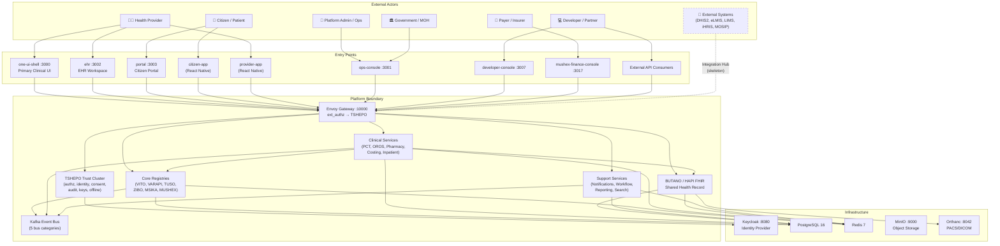
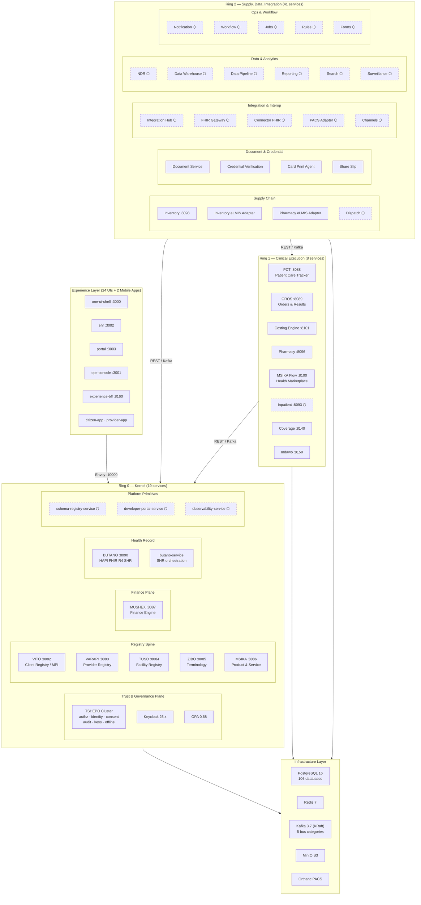
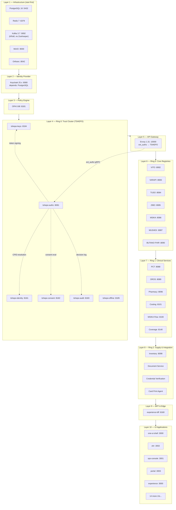
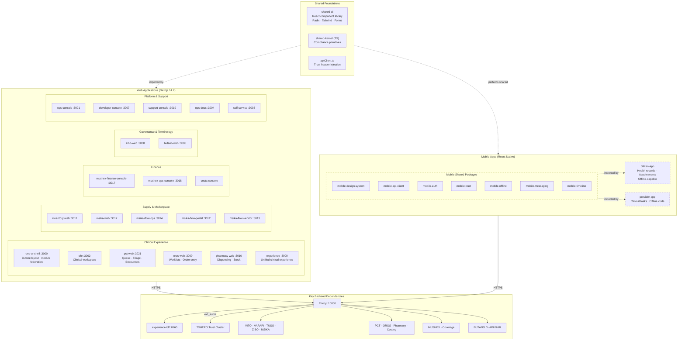

```mermaid
graph LR
    subgraph TRUST_GOV["Trust & Governance"]
        T1["tshepo-authz-service"]
        T2["tshepo-identity-service"]
        T3["tshepo-consent-service"]
        T4["tshepo-audit-service"]
        T5["tshepo-keys-service"]
        T6["tshepo-offline-service"]
        T7["tshepo-service (legacy)"]
    end

    subgraph REGISTRY["Registry Spine"]
        R1["vito-service<br/>Client/MPI"]
        R2["varapi-service<br/>Provider"]
        R3["tuso-service<br/>Facility"]
        R4["zibo-service<br/>Terminology"]
        R5["msika-service<br/>Product Catalog"]
    end

    subgraph CLINICAL["Clinical Execution"]
        C1["pct-service<br/>Care Tracker"]
        C2["oros-service<br/>Orders & Results"]
        C3["pharmacy-service<br/>Dispensing"]
        C4["costing-engine-service<br/>Billing"]
        C5["msika-flow-service<br/>Marketplace"]
        C6["coverage-service"]
        C7["indawo-service<br/>Location"]
    end

    subgraph FINANCE["Finance"]
        F1["mushex-service<br/>Payments · Claims · Settlement"]
    end

    subgraph HEALTH_RECORD["Health Record (SHR)"]
        H1["butano-service<br/>Orchestration"]
        H2["butano-fhir<br/>HAPI FHIR R4"]
        H3["ubomi-service<br/>CRVS"]
    end

    subgraph SUPPLY["Supply Chain"]
        S1["inventory-service"]
        S2["inventory-elmis-adapter"]
        S3["pharmacy-elmis-adapter"]
        S4["product-registry-service"]
    end

    subgraph DOC_CRED["Document & Credential"]
        D1["document-service"]
        D2["landela-adapter-service"]
        D3["credential-verification-service"]
        D4["card-print-agent"]
        D5["share-slip-service"]
    end

    subgraph LIBS["Shared Libraries"]
        L1["shared-kernel-java"]
        L2["shared-kernel (TS)"]
        L3["tshepo-contracts"]
        L4["tshepo-sdk"]
        L5["tech-companion"]
        L6["ops-instrumentation"]
        L7["security-baseline"]
        L8["offline-sdk"]
        L9["federation-connector"]
    end

    subgraph UI_APPS["UI Applications (Next.js)"]
        U1["one-ui-shell :3000"]
        U2["ehr :3002"]
        U3["ops-console :3001"]
        U4["experience :3000"]
        U5["pct-web · oros-web · pharmacy-web"]
        U6["inventory-web · msika-web"]
        U7["mushex-finance-console · mushex-ops-console"]
        U8["zibo-web · butano-web"]
        U9["developer-console · support-console"]
        U10["msika-flow-ops · msika-flow-portal · msika-flow-vendor"]
    end

    subgraph MOBILE["Mobile Apps (React Native)"]
        M1["citizen-app"]
        M2["provider-app"]
    end

    subgraph INFRA_COMP["Infrastructure"]
        I1["PostgreSQL 16"]
        I2["Redis 7"]
        I3["Kafka 3.7 (KRaft)"]
        I4["Keycloak 25.x"]
        I5["Envoy 1.31"]
        I6["OPA 0.68"]
        I7["HAPI FHIR 7.4"]
        I8["MinIO"]
        I9["Orthanc PACS"]
    end

    UI_APPS & MOBILE -->|"via Envoy"| TRUST_GOV
    TRUST_GOV --> REGISTRY & CLINICAL & FINANCE & HEALTH_RECORD & SUPPLY & DOC_CRED
    CLINICAL --> REGISTRY & HEALTH_RECORD & FINANCE
    SUPPLY --> CLINICAL & REGISTRY
    LIBS -.->|"consumed by"| TRUST_GOV & REGISTRY & CLINICAL & FINANCE & HEALTH_RECORD & SUPPLY & DOC_CRED & UI_APPS
```

# Impilo vNext — High-Level Architecture Diagrams

**Date**: 2026-03-28
**Version**: 1.0
**Status**: Living document — updated as architecture evolves

> **Convention**: Each diagram is labeled **CURRENT STATE**, **TARGET STATE**, or **MIXED**.
> Target-state elements not yet implemented are called out explicitly in the notes.

---

## 1. Platform Context Diagram

**State: MIXED**

**Notes:**
- All UI and API traffic enters through **Envoy Gateway** with mandatory ext_authz to TSHEPO before reaching any service.
- The TSHEPO Trust Cluster (7 services) validates every request: authenticate, classify (A/B/C), evaluate RBAC/ABAC, inject 14 trust headers.
- Core registries (VITO, VARAPI, TUSO, ZIBO, MSIKA, MUSHEX) are Ring 0 — no outbound dependencies to Ring 1+.
- BUTANO (SHR) stores **CPID only** — PII remains in VITO.
- **Target-state elements**: Integration Hub (skeleton), channels-service (USSD/WhatsApp — skeleton), mobile apps (early stage), external system adapters (mostly skeleton).

---

## 2. Ring / Plane Architecture Diagram

**State: MIXED**

**Notes:**
- **Ring 0 (Kernel)** has zero outbound dependencies to Ring 1+. All registries, trust, finance, and health record live here.
- **Ring 1 (Clinical)** depends on Ring 0 only — PCT, OROS, Pharmacy, Costing, Marketplace, Coverage.
- **Ring 2 (Supply/Data/Integration)** depends on Ring 0 + Ring 1 — supply chain, analytics, interoperability, workflow.
- **⬡ = skeleton** services that exist in the repo but have only scaffolding (no business logic yet).
- Dashed-border nodes are skeleton/target-state. Of 68 backend services, ~33 are implemented and ~32 are skeleton.
- Dependency rule enforcement: Ring 0 → nothing outbound; Ring 1 → Ring 0 only; Ring 2 → Ring 0 + Ring 1.

---

## 3. Major Component Landscape Diagram

**State: CURRENT STATE**

**Notes:**
- This diagram shows **only implemented components** from the repo — no skeleton services are included.
- The landscape is organized by functional domain, matching the repo directory structure under `services/`, `ui/`, `apps/mobile/`, and `libs/`.
- All backend services are Java 21 + Spring Boot 3.3; all UIs are Next.js 14.2 + TypeScript 5.5.
- Shared libraries (9 Java, 3 TypeScript) provide cross-cutting concerns: trust contracts, compliance enforcement, observability, security.
- The `experience-bff` aggregation layer sits between UIs and backend services.

---

## 4. Runtime Layer / Startup Order Diagram

**State: CURRENT STATE**

**Notes:**
- Startup order reflects Docker Compose `depends_on` and service health dependencies.
- **Layer 1** (PostgreSQL, Redis, Kafka, MinIO, Orthanc) must be healthy before any service starts.
- **Layer 2** (Keycloak) depends on PostgreSQL for its database.
- **Layers 3–4** (OPA + TSHEPO cluster) must be up before Envoy can authorize requests.
- **Layer 5** (Envoy) must have TSHEPO available for ext_authz — no request passes without it.
- **Layers 6–8** follow ring dependency order: registries first, then clinical, then supply/integration.
- **Layer 9–10** (BFF + UIs) start last as they depend on backend services being ready.
- `platformctl.sh up lite` starts infrastructure + Ring 0; `platformctl.sh up full` starts all layers.

---

## 5. Experience / App Ecosystem Diagram

**State: MIXED**

**Notes:**
- **24 web UIs** exist in the `ui/` directory, all using Next.js 14.2 + TypeScript + TailwindCSS + Radix + TanStack Query + Zustand.
- **`one-ui-shell`** is the primary entry point — a 3-zone layout (Work/Pro/Life) that acts as module federation host.
- **`shared-ui`** provides the shared component library (Radix primitives, form components, design tokens).
- **`experience`** is a unified clinical experience app with its own BFF (`experience-bff`).
- **Mobile apps** (citizen-app + provider-app) are React Native with 7 shared packages under `apps/mobile/packages/`.
- **Target-state elements**: Mobile apps exist in the repo with directory structure and shared packages, but are early-stage (dashed border). Most web UIs have implemented scaffolding.
- All UIs inject trust headers via `apiClient.ts` — every request flows through Envoy → TSHEPO before reaching backend services.

---

## Appendix: Diagram Legend

| Symbol | Meaning |
|--------|---------|
| Solid border | Implemented — has business logic |
| Dashed border / ⬡ | Skeleton — repo scaffolding only, no business logic |
| Solid arrow | Synchronous dependency (REST/gRPC) |
| Dashed arrow | Asynchronous or indirect dependency (Kafka events, library import) |
| `:NNNN` | Local development port assignment |

---

## References

- [Component Catalog](vnext-component-catalog.md) — full inventory of all 68 services, 24 UIs, 12 libraries
- [Service Dependency Map](vnext-service-dependency-map.md) — detailed inter-service dependency graph
- [Platform Operations Runbook](../runtime/platform-operations-runbook.md) — platformctl startup/shutdown
