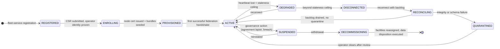
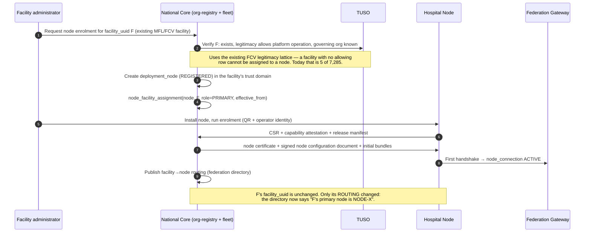
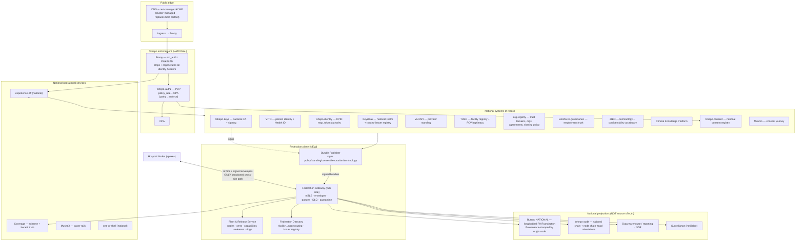
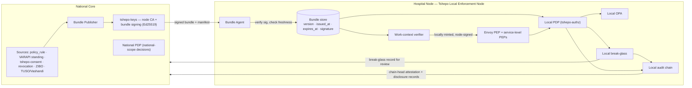
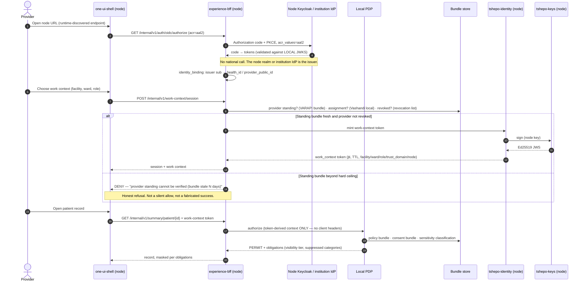
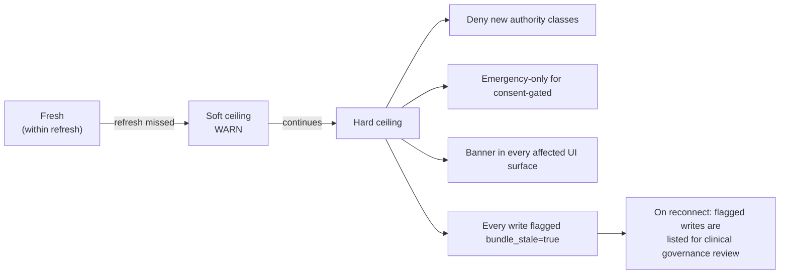
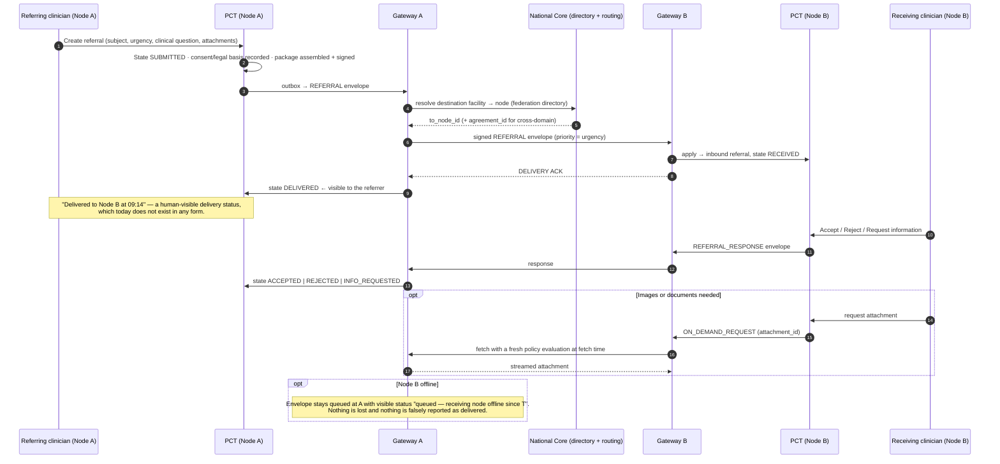
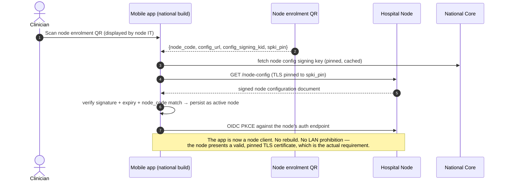
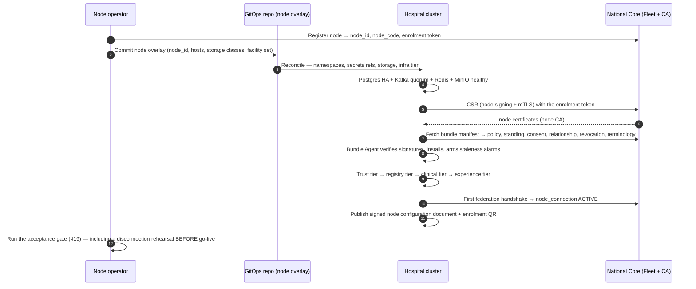

# Impilo vNext — Hybrid / Federated Target Architecture

**Status:** Controlling architecture · **Version:** 1.0 · **Date:** 2026-08-03
**Factual basis:** [`vnext-current-state-recovery-2026-08-03.md`](vnext-current-state-recovery-2026-08-03.md) (commit `1870cf33d`). Every current-state statement in this document is a reference to that recovery, not a re-derivation.
**Scope:** Converts vNext from a single-instance national deployment into a hub-and-spoke federated national platform. Immediate delivery target is the **large Hospital Node**. This document does not implement; it governs implementation.

---

# 1. Target-state architecture doctrine

## 1.1 The six doctrine lines

> **Federation line.** One national hub, many governed spokes; nodes federate through signed contracts, never through shared databases or raw brokers.

> **Authority line.** The node that creates a clinical fact is authoritative for that fact; the National Core holds projections, and a projection never overwrites its source.

> **Boundary line.** A trust domain is a data controller, an organisation is an operator, a facility is a place, a node is a machine. Four different things, four different identifiers, never interchangeable.

> **Continuity line.** Local care never waits on the national platform. Seven days of autonomy is a functional requirement of the Hospital Node, not a degraded mode.

> **Enforcement line.** Trust decisions move to the node with the data. A disconnected node enforces the same rules from signed bundles — it never relaxes consent or sensitivity because the hub is unreachable.

> **Single-product line.** One codebase, many profiles. A Hospital Node is a deployment configuration of vNext, never a fork of it.

## 1.2 The eight architectural inversions

The recovery established what vNext is. The target state is defined by eight specific inversions of it. Everything in this document serves one of these.

| # | From (current, per recovery) | To (target) | Why it is the crux |
|---|---|---|---|
| **I1** | Tenancy is a browser-minted `X-Tenant-ID` header with a hardcoded default UUID, and the token's `tenant_id` claim is the hardcoded literal `moh-zw` for every user | `trust_domain_id` is derived server-side from a verified issuer + subject binding, never accepted from a client, and carried in a signed work-context token | Without this, no institutional boundary can be enforced, so non-MoHCC federation is legally impossible |
| **I2** | The PDP is deployed and disengaged: `ext_authz` templated out, work-context/tenancy/OPA/lawful-basis all SHADOW; consent is enforced in exactly one place the edge never reaches | Enforcement is **on** at every node, PDP-local, bundle-fed; consent evaluation sits on the clinical read path itself, not only in the gateway | A federated platform that ships enforcement in shadow mode exports its defects to every institution |
| **I3** | No node concept in the domain model; `pod_id` is the constant `national-spine`; no provenance, no origin, no conflict model | Every clinical fact carries origin node, origin record, version and a signature; amendments supersede, never overwrite | Federation without provenance is data laundering |
| **I4** | Clinical repositories scope by tenant + patient, not facility or organisation; the PDP's `facility_scope` means "a facility id is present" | Facility and organisation scoping are query-level predicates and PDP-level membership assertions | One organisation can currently read another's clinical rows; this is the top pre-federation blocker |
| **I5** | Four FHIR-shaped stores; the BFF and gateway write to a stock ungoverned HAPI while IPS/timeline read the governed one | One governed FHIR implementation (`butano-service`), instantiated as a **local projection** at the node and a **longitudinal projection** nationally | Split-brain cannot be federated; it must be resolved before it is replicated |
| **I6** | Single node, one Postgres (124 DBs), one Kafka (RF=1), Redis with no volume, loopback registry, host-managed TLS, `Recreate` everywhere, 74 services with `@Scheduled` and zero distributed locking | Three-node reference cluster, HA data plane, real registry, cluster-managed TLS, rolling updates, leader-elected schedulers | The current envelope cannot survive a hospital's uptime expectations, let alone seven-day autonomy |
| **I7** | Endpoints baked into images at build time (Next rewrites, `NEXT_PUBLIC_*`, `EXPO_PUBLIC_*`); mobile production builds refuse LAN endpoints | Runtime endpoint discovery from a signed node configuration document, with QR enrolment and a governed failover policy | A hospital cannot be asked to rebuild the national mobile app to reach its own node |
| **I8** | Integration endpoints are global environment variables (one PACS, one SMS sender, one printer URI, no analyser config) | A versioned, audited configuration hierarchy: trust domain → organisation → node → facility → department → service point | A hospital's lab, PACS and till are its own; global env is not a configuration model |

## 1.3 Non-negotiable invariants

These are testable statements. The acceptance plan in §19 proves each one.

1. **No client-supplied authority.** No `X-Tenant-ID`, `X-Facility-ID`, `X-Actor-ID`, `X-Provider-ID`, `X-Purpose-Of-Use` or assurance header originating from a browser or handset is ever load-bearing in a decision. All are derived from a verified token or a signed work-context token, or the request is refused.
2. **No silent overwrite across nodes.** A federated write that would replace a record whose `origin_node_id` differs from the writer is rejected, not merged. Cross-node last-write-wins is prohibited by contract and by database constraint.
3. **Offline never weakens policy.** When a signed bundle expires beyond its permitted staleness, the affected decision class **fails closed**, except for the explicitly enumerated emergency classes in §4.7, which proceed with elevated, non-repudiable audit.
4. **National administration is not clinical access.** A National Core platform administrator role grants no clinical read inside any trust domain. Cross-domain clinical access requires a federation agreement, a consent or legal basis, and produces a disclosure record visible to the institution.
5. **Local care has no synchronous national dependency.** No routine clinical action in the seven-day autonomy set makes a blocking call to the National Core. Verified by the disconnection test, not by inspection.
6. **One artefact set.** A Hospital Node runs the same signed images as the National Core, selected by profile. Any node-only code path is a defect.
7. **Honest failure is preserved.** The recovery's honest degradations (fail-closed consent, `pending_backend` eligibility, the 502 on national KPIs, the "do not treat as absence of allergies" body) are retained as-is. The false-success paths it named are retired, not federated.

## 1.4 What is explicitly out of scope

- Peer-to-peer node exchange without a national federation route.
- Database replication of any kind between sites.
- A second vNext codebase, a hospital fork, or a node-only service.
- Facility Edge (small clinics) as a first-wave deliverable — its profile is designed in §8.6 but sequenced after the first Hospital Node pilot.

---

# 2. The named products

| Product | What it is | Ships as | First delivery |
|---|---|---|---|
| **Impilo National Core** | The federation hub and the national systems of record for identity, provider standing, facility registry, terminology, policy, national longitudinal record and national reporting | The existing estate, re-profiled: `values-national-core.yaml` | Phase 2 (re-profile of the current estate) |
| **Impilo Hospital Node** | A self-sufficient clinical instance for one institution and one or more facilities, authoritative for the care it delivers | `values-hospital-node.yaml` + node config package | **Phase 2 — the immediate target** |
| **Impilo Federation Gateway** | The only sanctioned cross-site path. A Spring Boot service deployed at both ends; signed envelopes over mTLS, durable queues both sides | New service `services/federation-gateway` | Phase 3 |
| **Tshepo Local Enforcement Node** | The node-local trust plane: Envoy PEP + local PDP + local OPA + bundle agent + local audit chain | Composition of existing `tshepo-*` services + new `bundle-agent` sidecar | Phase 2 |
| **Impilo Fleet & Release Service** | National registry of nodes, releases, certificates, capabilities, health and upgrade rings | New service `services/fleet-service` (National Core only) | Phase 2 (registry) → Phase 5 (rings) |
| **Impilo Facility Edge** | A reduced profile for small facilities: local registration, OPD, dispensing, offline capture; no local inpatient/theatre/lab estate | `values-facility-edge.yaml` | Post-pilot |

**Product relationship rule.** National Core and Hospital Node are *profiles of the same chart and the same images*. Federation Gateway and Fleet Service are new code. Tshepo Local Enforcement is a *packaging* of existing services plus one new agent. Nothing else is new.

---

# 3. Trust-domain and node model

## 3.1 The six identifiers, disambiguated

| Identifier | Answers | Authority | Example | Never |
|---|---|---|---|---|
| `trust_domain_id` | *Under whose legal control does this data sit?* | National Core (issued at accreditation) | `MoHCC-ZW`, `TD-CIMAS`, `TD-MISSION-KAROI` | …a deployment. One trust domain may span many nodes |
| `organisation_id` | *Who operates or governs this?* | org-registry (existing) | Ministry, a mission board, a private group | …a legal controller by itself. Many organisations may sit in one trust domain |
| `facility_id` | *Where does care happen?* | TUSO (existing, unchanged) | Parirenyatwa, a virtual service point | …changed when a facility moves onto a node |
| `node_id` | *Which deployment instance?* | Fleet Service (new) | `NODE-PARI-01`, `NODE-NATIONAL-CORE` | …a tenant, an organisation, or a facility |
| `work_context_id` | *In what authorised capacity is this actor acting, right now?* | BFF mint + tshepo-identity (existing, hardened) | "Registrar, Ward 3B, Parirenyatwa, CLINICAL_CARE" | …browser state |
| `jurisdiction_id` | *Under whose oversight authority?* | org-registry / wgv (existing) | district, province, national, HPA, NCZ, a programme | …conflated with organisation |

**The cardinal rule, stated as a constraint:** `node_id` appears in **no** clinical or registry business predicate. It appears only in provenance, routing, audit and operations. A query that filters clinical data by `node_id` is a design defect; the correct predicate is `trust_domain_id` + `facility_id` + policy.

## 3.2 Canonical schema

New authority: `services/organization-registry-service` gains the trust-domain and agreement tables (it already owns organisations and the closed 17-type vocabulary); a **new** `services/fleet-service` owns node, certificate, capability, release and connection state. Splitting them this way keeps governance data in the registry plane and operational data in the enterprise plane, and prevents the Fleet Service from becoming a second organisation registry.

```sql
-- ── org-registry (governance plane) ─────────────────────────────────────────

trust_domain (
  trust_domain_id        UUID PRIMARY KEY,
  code                   VARCHAR(48) NOT NULL UNIQUE,     -- 'MOHCC-ZW', 'TD-CIMAS'
  display_name           TEXT NOT NULL,
  controller_type        VARCHAR(32) NOT NULL,            -- MINISTRY | PRIVATE_GROUP | MISSION |
                                                          -- LOCAL_AUTHORITY | SECURITY_SECTOR |
                                                          -- UNIVERSITY | REGULATOR | PARTNER
  data_controller_legal_name TEXT NOT NULL,
  data_controller_contact    JSONB NOT NULL,
  jurisdiction_id        UUID NULL REFERENCES jurisdiction,
  accreditation_status   VARCHAR(24) NOT NULL,            -- see lifecycle below
  accredited_at          TIMESTAMPTZ, suspended_at TIMESTAMPTZ, withdrawn_at TIMESTAMPTZ,
  default_data_sharing_policy_id UUID NULL,
  key_custody_mode       VARCHAR(24) NOT NULL DEFAULT 'NATIONAL',  -- NATIONAL | INSTITUTIONAL
  created_at, updated_at, created_by_actor, version INT NOT NULL
);

organisation ADD COLUMN trust_domain_id UUID NOT NULL REFERENCES trust_domain;
-- Backfill: every existing organisation → the MoHCC trust domain (§10.1).

facility  -- stays in TUSO; TUSO gains:
  ALTER TABLE tuso.facility
    ADD COLUMN trust_domain_id UUID NOT NULL,        -- denormalised for query scoping
    ADD COLUMN governing_organisation_id UUID NULL;  -- closes the "facility has no org column" gap

federation_agreement (
  agreement_id           UUID PRIMARY KEY,
  from_trust_domain_id   UUID NOT NULL REFERENCES trust_domain,
  to_trust_domain_id     UUID NOT NULL REFERENCES trust_domain,
  agreement_type         VARCHAR(32) NOT NULL,  -- NATIONAL_CONTRIBUTION | REFERRAL_EXCHANGE |
                                                -- PATIENT_AUTHORISED | STATUTORY_REPORTING |
                                                -- EMERGENCY_ACCESS | RESEARCH_EXTRACT
  data_sharing_policy_id UUID NOT NULL REFERENCES data_sharing_policy,
  legal_basis            VARCHAR(48) NOT NULL,
  signed_by_from         JSONB NOT NULL,   -- signatory identity + signature ref
  signed_by_to           JSONB NOT NULL,
  effective_from         TIMESTAMPTZ NOT NULL,
  effective_to           TIMESTAMPTZ NULL,
  status                 VARCHAR(24) NOT NULL,  -- DRAFT|PENDING_COUNTERSIGNATURE|ACTIVE|
                                                -- SUSPENDED|TERMINATED|EXPIRED
  version                INT NOT NULL,
  supersedes_agreement_id UUID NULL
);

data_sharing_policy (
  policy_id              UUID PRIMARY KEY,
  trust_domain_id        UUID NOT NULL,
  policy_code            VARCHAR(64) NOT NULL,
  domain_rules           JSONB NOT NULL,   -- per data domain (§7): residency class, disclosure
                                           -- class, sensitivity ceiling, purpose allow-list,
                                           -- consent requirement, redaction profile
  sensitivity_ceiling    VARCHAR(32) NOT NULL,  -- highest class disclosable under this policy
  requires_patient_consent BOOLEAN NOT NULL,
  emergency_override_allowed BOOLEAN NOT NULL,
  retention_days         INT NULL,
  status                 VARCHAR(24) NOT NULL,
  version                INT NOT NULL,
  UNIQUE (trust_domain_id, policy_code, version)
);

local_authority (          -- who may act for a trust domain, and over what
  local_authority_id     UUID PRIMARY KEY,
  trust_domain_id        UUID NOT NULL,
  organisation_id        UUID NULL,
  facility_id            UUID NULL,
  authority_type         VARCHAR(40) NOT NULL,  -- TRUST_DOMAIN_ADMIN | NODE_OPERATOR |
                                                -- CLINICAL_GOVERNANCE | PRIVACY_OFFICER |
                                                -- BREAK_GLASS_REVIEWER | DISCLOSURE_REVIEWER
  subject_health_id      UUID NOT NULL,
  granted_by             UUID NOT NULL, granted_at TIMESTAMPTZ NOT NULL,
  expires_at             TIMESTAMPTZ NULL, revoked_at TIMESTAMPTZ NULL,
  UNIQUE (trust_domain_id, subject_health_id, authority_type, facility_id)
      WHERE revoked_at IS NULL
);

-- ── fleet-service (operations plane) ────────────────────────────────────────

deployment_node (
  node_id                UUID PRIMARY KEY,
  node_code              VARCHAR(48) NOT NULL UNIQUE,   -- 'NODE-PARI-01'
  node_type              VARCHAR(24) NOT NULL,          -- NATIONAL_CORE | HOSPITAL_NODE |
                                                        -- FACILITY_EDGE | DR_STANDBY
  trust_domain_id        UUID NOT NULL,                 -- the node belongs to exactly one
  operating_organisation_id UUID NOT NULL,
  profile                VARCHAR(48) NOT NULL,          -- helm profile name
  lifecycle_state        VARCHAR(24) NOT NULL,          -- see §3.3
  contact                JSONB NOT NULL,                -- operator, escalation, site address
  network                JSONB NOT NULL,                -- advertised endpoints, egress posture
  created_at, activated_at, suspended_at, decommissioned_at,
  version                INT NOT NULL
);

node_facility_assignment (
  assignment_id          UUID PRIMARY KEY,
  node_id                UUID NOT NULL REFERENCES deployment_node,
  facility_id            UUID NOT NULL,                 -- TUSO facility_uuid — UNCHANGED
  role                   VARCHAR(16) NOT NULL,          -- PRIMARY | DR | MIGRATION_TARGET
  effective_from         TIMESTAMPTZ NOT NULL,
  effective_to           TIMESTAMPTZ NULL,
  assigned_by            UUID NOT NULL,
  -- exactly one PRIMARY per facility at any instant:
  EXCLUDE USING gist (facility_id WITH =, tstzrange(effective_from, effective_to) WITH &&)
      WHERE (role = 'PRIMARY')
);

node_certificate (
  certificate_id         UUID PRIMARY KEY,
  node_id                UUID NOT NULL,
  purpose                VARCHAR(24) NOT NULL,          -- MTLS_CLIENT | MTLS_SERVER |
                                                        -- ENVELOPE_SIGNING | BUNDLE_VERIFY
  subject_dn             TEXT NOT NULL,
  serial                 TEXT NOT NULL UNIQUE,
  spki_sha256            TEXT NOT NULL,                 -- pinning material
  issued_at, not_before, not_after TIMESTAMPTZ NOT NULL,
  status                 VARCHAR(16) NOT NULL,          -- PENDING|ACTIVE|ROTATING|REVOKED|EXPIRED
  revoked_at             TIMESTAMPTZ NULL, revocation_reason TEXT NULL,
  issued_by_ca           VARCHAR(48) NOT NULL           -- 'impilo-node-ca-v1'
);

node_capability (
  node_id                UUID NOT NULL,
  capability_key         VARCHAR(64) NOT NULL,          -- 'clinical.inpatient', 'lab.lims.hl7v2',
                                                        -- 'imaging.pacs.local', 'pharmacy.dispense'
  enabled                BOOLEAN NOT NULL,
  declared_version       VARCHAR(24) NOT NULL,
  attested_at            TIMESTAMPTZ NOT NULL,          -- self-reported by the node, signed
  PRIMARY KEY (node_id, capability_key)
);

node_release (
  node_id                UUID NOT NULL,
  release_channel        VARCHAR(24) NOT NULL,          -- CANARY | EARLY | STABLE | LTS
  release_version        VARCHAR(48) NOT NULL,
  chart_version          VARCHAR(24) NOT NULL,
  image_digest_manifest_sha TEXT NOT NULL,
  applied_at             TIMESTAMPTZ NULL,
  state                  VARCHAR(24) NOT NULL,          -- OFFERED|ACKNOWLEDGED|APPLYING|
                                                        -- APPLIED|FAILED|ROLLED_BACK
  compatibility_floor    VARCHAR(48) NOT NULL,          -- min federation schema_version it speaks
  PRIMARY KEY (node_id, release_version)
);

node_connection (
  node_id                UUID NOT NULL,
  peer                   VARCHAR(24) NOT NULL,          -- 'NATIONAL_CORE'
  state                  VARCHAR(24) NOT NULL,          -- CONNECTED|DEGRADED|DISCONNECTED|
                                                        -- SUSPENDED|QUARANTINED
  last_heartbeat_at      TIMESTAMPTZ NULL,
  last_successful_exchange_at TIMESTAMPTZ NULL,
  outbound_queue_depth   BIGINT NOT NULL DEFAULT 0,
  inbound_queue_depth    BIGINT NOT NULL DEFAULT 0,
  oldest_unacked_at      TIMESTAMPTZ NULL,
  disconnected_since     TIMESTAMPTZ NULL,
  PRIMARY KEY (node_id, peer)
);
```

`work_context` and `jurisdiction` already exist in substance — `work_context` as the minted duty token plus `tshepo_identity.scoped_token`, `jurisdiction` as `jurisdiction_code` on regulatory appointments and `wgv_jurisdiction`. Both are **promoted to first-class rows** (§10.3) so they can be referenced by federation metadata rather than carried as loose strings.

## 3.3 Lifecycles



**Trust domain:** `PROVISIONAL → ACCREDITED → (SUSPENDED ⇄ ACCREDITED) → WITHDRAWN`. A domain in `PROVISIONAL` may run a node but may not receive cross-domain disclosures. `SUSPENDED` halts all outbound disclosure to that domain and all inbound contribution from it; local care continues (a governance suspension must never stop a hospital treating patients).

**Federation agreement:** `DRAFT → PENDING_COUNTERSIGNATURE → ACTIVE → (SUSPENDED ⇄ ACTIVE) → TERMINATED|EXPIRED`, with `supersedes_agreement_id` for renegotiation. Expiry of an agreement stops *new* disclosure; it does not retro-delete what was lawfully disclosed, and it does not stop referral **replies** on in-flight cases (an in-flight clinical episode is completed under the agreement in force when it started, recorded on the referral).

## 3.4 How an existing TUSO facility joins a node — without changing its Facility ID

This is the single most important continuity requirement in the model, and it is satisfied by construction: **`node_facility_assignment` is a separate table keyed by the existing `tuso.facility.facility_uuid`.** No facility identifier changes, ever.



**One node, several facilities.** A hospital node commonly serves a main campus, satellite clinics and a virtual service point. Each is a separate `node_facility_assignment` row with `role=PRIMARY`. All share the node's databases; separation is by `facility_id` predicates and PDP membership, exactly as it must already be *within* a facility today (inversion **I4**).

**One facility, several nodes.** Permitted only as `PRIMARY` + `DR` (+ `MIGRATION_TARGET` during a move). The `EXCLUDE` constraint guarantees at most one `PRIMARY` at any instant — this is the mechanism that prevents split-brain writes for a facility. DR promotion is a governed act recorded in the fleet service, and the federation directory refuses to route to a non-primary node except for read-only DR verification traffic.

---

# 4. Data-residency and disclosure matrix

## 4.1 Classes

**Residency class** — where the authoritative copy lives: `NATIONAL_AUTHORITATIVE` · `LOCALLY_AUTHORITATIVE` · `DUAL` (distinct facets authoritative in each place).
**Disclosure class** — what crosses the federation boundary: `FULL` · `SUMMARY` · `INDEX_ONLY` (existence + pointer, fetch on demand) · `ON_DEMAND` (nothing pushed; pull under a live authorisation) · `STATUTORY_ONLY` (de-identified or aggregate for a legal report) · `NEVER_WITHOUT_SPECIFIC_AUTHORITY`.

## 4.2 The matrix

Columns are defaults per context; a `data_sharing_policy` may tighten them and may only loosen them where the column marked *(negotiable)* says so.

| Data domain | Authority | MoHCC Hospital Node → National | Non-MoHCC node → National | Patient-authorised cross-institution | Statutory reporting | Emergency access |
|---|---|---|---|---|---|---|
| Patient identity (Health ID, CPID map) | **National** | N/A — national issues | N/A — national issues, node caches | Resolved nationally | — | Provisional O-CPID locally, reconciled |
| Demographics (PII) | National, node-cached | SUMMARY (updates as amendments) | INDEX_ONLY *(negotiable → SUMMARY)* | SUMMARY under consent | Aggregate only | SUMMARY with elevated audit |
| Provider standing / licensure | **National** | N/A — bundle-cached at node | N/A — bundle-cached | — | — | Cached bundle within staleness ceiling |
| Facility configuration | **DUAL** — TUSO owns registry identity; node owns operational shape | Registry facts SUMMARY up; operational config stays local | Same | — | Aggregate | Local |
| Workforce assignments | **DUAL** — national employment truth (wgv/HSC), local rostering | SUMMARY (assignment state) | INDEX_ONLY | — | Aggregate | Local roster |
| Encounters | **Local** | SUMMARY (encounter header: type, facility, dates, provider, disposition) | INDEX_ONLY *(negotiable → SUMMARY)* | SUMMARY under consent | Aggregate counts | SUMMARY |
| Clinical notes (free text) | **Local** | **NEVER without specific authority** | NEVER | ON_DEMAND under explicit consent | Never | ON_DEMAND, elevated audit |
| Problems / diagnoses | **Local** | FULL (coded) | SUMMARY *(negotiable)* | FULL under consent | Aggregate + notifiable | FULL |
| Allergies / intolerances | **Local** | **FULL** — safety-critical, always contributed | **FULL** — the one clinical domain non-negotiable for patient safety | FULL | — | FULL |
| Medications | **Local** | FULL (coded, dispensed + active) | SUMMARY *(negotiable → FULL)* | FULL under consent | Aggregate | FULL |
| Orders | **Local** | SUMMARY (order header + status) | INDEX_ONLY | SUMMARY | Aggregate | SUMMARY |
| Results | **Local** | FULL (coded results + abnormal flags) | SUMMARY *(negotiable)* | FULL under consent | Notifiable + aggregate | FULL |
| Imaging metadata | **Local** | INDEX_ONLY (study exists, modality, date, accession) | INDEX_ONLY | INDEX_ONLY + ON_DEMAND fetch | — | INDEX_ONLY + ON_DEMAND |
| **Images (pixel data)** | **Local** | **ON_DEMAND only** — never bulk-pushed | ON_DEMAND | ON_DEMAND under consent | Never | ON_DEMAND, bandwidth-negotiated |
| Documents | **Local** | INDEX_ONLY + ON_DEMAND | INDEX_ONLY | ON_DEMAND under consent | Never | ON_DEMAND |
| Theatre records | **Local** | SUMMARY (procedure coded, date, outcome) | INDEX_ONLY | SUMMARY under consent | Aggregate | SUMMARY |
| Mental-health records | **Local** | **NEVER without specific authority** | NEVER | ON_DEMAND under *explicit, category-specific* consent | Aggregate only, k-anonymised | **Break-glass only, dual-authorised** |
| Sexual & reproductive health | **Local** | **NEVER without specific authority** | NEVER | ON_DEMAND under explicit, category-specific consent | Aggregate only, k-anonymised | Break-glass only, dual-authorised |
| Other SPECIALLY_PROTECTED | **Local** | NEVER without specific authority | NEVER | Category-specific consent | Aggregate only | Break-glass only, dual-authorised |
| Consent directives | **DUAL** — captured either side, both authoritative for their own captures | FULL (directives are federation control data) | FULL | FULL | — | Cached bundle |
| Referrals | **Local at origin; routed** | FULL to the routed counterpart + SUMMARY nationally | FULL to counterpart, SUMMARY national *(negotiable)* | N/A — referral *is* the authorised exchange | Aggregate | FULL, emergency basis recorded |
| Billing | **Local** | SUMMARY (charge classes, totals) | **NEVER** — commercially sensitive | — | Aggregate | — |
| Insurance / coverage | **National** (scheme + benefit truth) | Claims FULL | Claims FULL (that is the point of the payer rail) | — | Aggregate | Offline eligibility token |
| Payments | **DUAL** | SUMMARY (settlement state) | SUMMARY | — | Aggregate | — |
| Public-health / notifiable | **National** | **FULL, mandatory, no consent gate** (legal basis) | **FULL, mandatory** | — | This *is* the statutory channel | FULL |
| Audit | **Local, chained per node** | SUMMARY (chain heads + disclosure records) | SUMMARY (chain heads only) | Disclosure records visible to both | Chain attestation | FULL local record |
| Research datasets | **Local** | NEVER without specific authority | NEVER | Under a separate research agreement + ethics | Never | — |

## 4.3 Five rules that make the matrix enforceable

1. **The matrix is data, not code.** It is expressed as `data_sharing_policy.domain_rules` rows and evaluated by the Federation Gateway's disclosure engine before an envelope is emitted, and again by the receiver before it is accepted. Two independent evaluations, both auditable.
2. **Sensitivity ceiling wins over domain default.** A record classified SPECIALLY_PROTECTED (existing `zibo` V008 confidentiality vocabulary, existing `ResourceSensitivityClassifier`) is never disclosed above its category ceiling, regardless of what the domain row says.
3. **Statutory beats consent; consent beats convenience.** Notifiable-disease reporting proceeds under legal basis with no consent gate and is recorded as such (`consent_basis = LEGAL_OBLIGATION`). Everything else that lacks a legal basis requires consent, and "the receiving clinician would find it useful" is not a basis.
4. **Emergency is a disclosure *mode*, not a policy bypass.** It raises what may cross for a bounded window under break-glass, records a disclosure record on both sides, and triggers post-hoc review in the *disclosing* institution.
5. **Non-MoHCC defaults are tighter and negotiable upward only.** A non-MoHCC institution starts at INDEX_ONLY for most clinical domains and negotiates outward through a `federation_agreement`. It cannot be defaulted into contribution.

---

# 5. Seven-day outage behaviour

## 5.1 What must continue, and what makes it possible

| Capability | Made possible by | Bundle / local artefact it depends on |
|---|---|---|
| Local user authentication | Node Keycloak (MoHCC-managed) or institution IdP; both node-local | Local IdP; national issuer not required |
| Work-context entry | Local PDP + local work-context mint signed by the node's key | `workforce-standing` bundle (assignments), node signing key |
| Patient registration | Local VITO instance with a pre-allocated identifier block | Identifier allocation grant (§6.5) |
| Casualty, triage, OPD | PCT local, unchanged code | policy + consent + terminology bundles |
| Inpatient, ward, theatre | inpatient, surgery, procedures local | policy bundle; local device config |
| Orders and results | OROS local + local LIMS/PACS adapters | node integration config |
| Pharmacy | pharmacy + inventory local | product/terminology bundle |
| Billing | costa local; coverage eligibility from offline tokens | offline eligibility JWS (already exists) |
| Discharge | PCT + inpatient local | — |
| Local clinical record access | Local Butano projection + PCT + OROS | consent + sensitivity bundles |
| Consent & SPECIALLY_PROTECTED | Local tshepo-consent + local PDP with ENFORCE confidentiality | `consent` + `relationship` bundles, fail-closed on expiry |
| Local audit | Local tshepo-audit chain, per-node chain | — |
| Devices and integrations | Node-scoped configuration | node integration config |

## 5.2 What queues, and what stops

**Queues (durable, replayed on reconnect):** national record contribution, outbound referrals to other nodes, statutory and public-health reports, national audit chain-head attestations, disclosure records, fleet health telemetry, claims submission to national payers.

**Degrades honestly (returns a stated, non-fabricated limitation):** remote provider verification beyond the standing bundle's staleness ceiling → `pending_backend` (existing behaviour, retained); cross-institution record lookup → "unavailable while disconnected", never an empty result presented as "no records"; national KPI views → the existing 502 rather than invented numbers.

**Stops (and must be visible in the UI):** inbound referrals from other nodes (they queue at the sender), new national identity minting beyond the local allocation block, cross-institution emergency access *initiated from elsewhere*, telemedicine with remote participants, national payment rails.

## 5.3 The staleness ladder

Each bundle class has a **refresh interval**, a **soft ceiling** (warn, continue) and a **hard ceiling** (fail closed or degrade to a stated fallback). These are the numbers the seven-day test proves.

| Bundle | Refresh | Soft ceiling | Hard ceiling | At hard ceiling |
|---|---|---|---|---|
| Policy rules | 15 min | 24 h | **30 days** | Fail closed on new policy classes; continue on cached rules for already-permitted routine care classes, with elevated audit |
| Provider standing | 1 h | 72 h | **14 days** | New clinical authority denied; providers already in an active work context continue for the episode; all writes flagged `standing_stale=true` |
| Consent directives | 15 min | 24 h | **7 days** | **Fail closed** for non-emergency access to consent-gated records; emergency path only |
| Relationship / delegation | 1 h | 72 h | 14 days | Delegated (guardian/proxy) access denied |
| Revocation list | 5 min | 1 h | **24 h** | Any actor or credential not affirmatively present in the last good list is treated as **potentially revoked** for high-authority actions (prescribing controlled drugs, break-glass approval, disclosure approval) |
| Terminology / clinical content | daily | 30 days | 90 days | Continue; new codes rejected with a stated reason |
| Facility / workforce registry | 1 h | 72 h | 14 days | Continue on cache; new staff cannot be activated |
| Trust anchors (issuer keys, node CA) | 6 h | 7 days | **30 days** | Fail closed on federation; local operation continues |

**Design note.** The consent hard ceiling (7 days) is deliberately equal to the autonomy requirement, not longer. A node that has been dark for more than seven days has, by doctrine, exceeded its designed autonomy and must not keep making consent-gated disclosures on a week-old picture — it drops to emergency-only for those classes and says so on screen.

---

# 6. MoHCC versus non-MoHCC operating model

| Dimension | MoHCC Hospital Node | Non-MoHCC institutional node |
|---|---|---|
| Trust domain | Inside `MOHCC-ZW` | Its own (`TD-<institution>`); a group may hold one domain over many organisations, facilities and nodes |
| Identity | **Managed node Keycloak** — realm provisioned and rotated by the National Core, credentials local | **Institution-owned** Keycloak / AD / LDAP / approved OIDC or SAML IdP, registered as a trusted issuer |
| Signing keys | National `tshepo-keys` custody | **Institutional custody permitted** (`key_custody_mode=INSTITUTIONAL`): institution holds its node signing key; the National Core holds only the public half and the CA trust |
| Clinical data default | Contribution ON by default (national longitudinal record is the ministry's purpose) | Contribution **OFF** by default; INDEX_ONLY, negotiated upward by agreement |
| National platform admin | May administer the node's platform (releases, infrastructure) — **still no clinical read** | **No platform administration at all** beyond release publication and certificate lifecycle; the institution operates its own node |
| Facility/org boundary inside the domain | **Still technically enforced** (inversion I4) — a MoHCC hospital may not read another MoHCC hospital's records without a basis | Enforced identically |
| Statutory reporting | Mandatory, automatic | **Mandatory, automatic — the one channel that is never negotiable** |
| Upgrade control | Ring-managed by the National Core, with a node-declared maintenance window | **Institution-controlled window**; the Core may only *offer* a release, plus a security floor with a contractual deadline |
| Disclosure visibility | Disclosure dashboard available | **Disclosure dashboard mandatory** — every national access to institutional data is visible to the institution, itemised, with actor and basis |
| Break-glass review | Reviewed by MoHCC clinical governance | Reviewed by the **institution's** governance; the National Core is notified, not the approver |
| Data on withdrawal | Facilities reassigned within the domain | Governed disposition: institution retains local records; national projections are frozen and marked `source_withdrawn`, not deleted (they are part of others' clinical history) |

**The administration separation, stated precisely.** Three distinct role spaces, in three distinct places, and no inheritance between them:
- **Platform administration** (Fleet Service, National Core realm) — releases, certificates, node lifecycle. Grants zero data access.
- **Trust-domain administration** (`local_authority` rows) — agreements, sharing policy, disclosure review, break-glass review. Grants governance rights over one domain, not clinical read.
- **Clinical access** (work context + PDP) — requires an active assignment at a facility, a purpose, a subject relationship, and consent or legal basis, as today but actually enforced.

---

# 7. National Core — target diagram



**Three things this diagram asserts.** First, the National Core keeps every registry that must be nationally unique (identity, provider standing, facility, terminology, policy) — these are the bundle sources, not per-node data. Second, the national clinical store is explicitly a **projection**, drawn separately from the systems of record, because it is not authoritative for anything a node created. Third, `Hospital Nodes` touch exactly one box: the Federation Gateway. There is no other line into the National Core, and drawing one is a design violation.

# 8. Hospital Node — target diagram

```mermaid
flowchart TB
  subgraph clients["Local clients"]
    WEB["Browser → one-ui-shell (node)<br/>runtime endpoint discovery"]
    MOB["Mobile (same national app)<br/>node-enrolled via signed QR config"]
    DEV["Modalities · analysers · printers · card agents"]
  end

  subgraph k8s["Hospital Kubernetes cluster — 3+ nodes"]
    subgraph tshepo["Tshepo Local Enforcement Node"]
      LENV["Envoy — ext_authz ENABLED, unconditional header strip"]
      LPDP["tshepo-authz (local PDP)"]
      LOPA["OPA (local)"]
      BAG["Bundle Agent (NEW)<br/>fetch · verify signature · install · expiry alarm"]
      LAUD["tshepo-audit (local chain)"]
    end

    subgraph identity["Local identity"]
      LKC["Node Keycloak (MoHCC-managed)<br/>— or — institution IdP / AD / LDAP"]
      LTID["tshepo-identity (local)<br/>work-context + O-CPID + local ID block"]
      LKEYS["tshepo-keys (local)<br/>node signing key, bundle verification"]
      LIA["identity-assurance (local)"]
      LCONS["tshepo-consent (local) + Mvumo"]
    end

    subgraph clinical["Clinical estate — authoritative locally"]
      LBFF["experience-bff (node profile)"]
      PCT["PCT"]; OROS["OROS"]; INP["Inpatient"]; PHA["Pharmacy"]
      SUR["Surgery"]; PRO["Procedures"]; REF["Referral"]; FRM["Forms"]
      LBUT["Butano LOCAL projection<br/>the governed FHIR store for this node"]
    end

    subgraph registrycache["Locally cached national authority (read-only)"]
      LVITO["VITO local instance<br/>+ allocated identifier block"]
      LVAR["VARAPI standing cache (bundle)"]
      LTUSO["TUSO facility cache (bundle) + local operational config"]
      LVASH["Vashandi (local rostering) + assignment bundle"]
      LZIBO["ZIBO terminology (bundle)"]; LCKP["CKP content (bundle)"]
    end

    subgraph money["Money (local capture)"]
      COSTA["Costa"]; LCOV["Coverage — offline eligibility tokens"]
    end

    subgraph data["Node data plane — HA"]
      PG[("PostgreSQL HA<br/>primary + replica + PITR")]
      KF[("Kafka — 3 brokers, RF=3")]
      RD[("Redis — persistent + replica")]
      MI[("MinIO — distributed")]
      OR[("Orthanc — local PACS")]
    end

    LFGW["Federation Gateway (node side)<br/>outbound + inbound durable queues"]
    OBS["Observability + capacity/health reporting"]
  end

  NC["National Core"]

  WEB & MOB --> LENV --> LBFF
  DEV --> clinical
  LENV --> LPDP --> LOPA
  BAG -.->|installs signed bundles| LPDP & LCONS & LVAR & LZIBO & LTUSO
  LBFF --> clinical & identity & registrycache & money
  clinical --> PG & KF
  clinical --> LBUT
  LBUT --> PG
  clinical --> MI & OR
  LFGW -->|consumes local outbox/Kafka| KF
  LFGW <-->|"mTLS + signed envelopes"| NC
  BAG <-->|bundle fetch| NC
  OBS -->|health/capacity| NC
```



**What the node does not have.** No national reporting stack, no NDR, no national surveillance authority, no MusheX national rails, no national Keycloak realm, no LiveKit SFU (unless the institution licenses one), no research extract capability. These are National Core responsibilities and their absence is what makes the node's footprint tractable.

# 9. Tshepo distributed trust — target diagram



**The rule this diagram encodes:** the local PDP makes decisions from **local state only** — bundles, local consent captures, local work contexts. It never makes a synchronous call to the National Core to decide. Everything the current PolicyEngine reaches for over HTTP mid-decision (consent service, delegation, identity introspection, envelope signing) becomes either a node-local service or a signed bundle. That is the single change that makes seven-day autonomy possible.

---

# 10. Component-placement matrix

Legend for **Placement**: `NAT` national only · `LOC` hospital local · `BOTH` deployed both places · `CACHE` locally cached national authority · `PACK` optional hospital pack · `RETIRE` retired/consolidated · `REDESIGN` not suitable for federation without redesign.

| Component | Placement | Target role | Data authority | Local dependency behaviour | Federation behaviour | Code changes | Deployment changes | Reuse verdict |
|---|---|---|---|---|---|---|---|---|
| **Envoy** | BOTH | PEP at both edges; **ext_authz unconditionally on** | none | Node Envoy calls the local PDP only | none | Render ext_authz + header-strip outside the `if` guard; add node-identity header injection | New `envoy-node.yaml` template; `extAuthz.enabled` removed as a switch (becomes always-true) | **Repair** |
| **experience-bff** | BOTH | Composition layer; node profile has a reduced downstream set | none (no datasource) | Node BFF composes only node services + caches | Never calls the peer directly | Remove client-header trust (I1); derive context server-side; profile-driven client set; delete the 45 dead migrations | `values-hospital-node` env subset; Redis becomes persistent | **Repair** |
| **one-ui-shell** | BOTH | Same app, runtime-discovered endpoint | none | Node shell works fully offline-of-national | none | Replace build-time `NEXT_PUBLIC_*`/rewrite baking with runtime config (§16) | Node ingress; signed node config document | **Repair** |
| **Keycloak** | BOTH (separate realms, **never synchronised**) | National realm for national actors; node realm or institution IdP for local actors | Each realm authoritative for its own users | Node login works with national dark | Trusted-issuer registry + claim binding, not DB sync | Multi-issuer resource-server config; issuer registry client | Node Keycloak in the node profile; realm provisioning job | **Reuse, re-profile** |
| **tshepo-authz (PDP)** | BOTH | Local PDP is the decision point for local data | policy from bundles | **Must decide with zero national calls** | Publishes decision/audit upward | Replace mid-decision HTTP calls with bundle lookups; add bundle freshness gates; add trust-domain + node dimensions to the condition vocabulary | Node deployment + bundle volume | **Repair — the largest single work item** |
| **OPA** | BOTH | Parity today, enforcement later, at both tiers | policy bundles | Local sidecar | Bundles distributed with policy bundles | Keep the existing parity gate; add node-scope inputs | Node sidecar | **Reuse** |
| **tshepo-identity** | BOTH | National: CPID authority + Health-ID map. Node: work-context minting, O-CPID, local ID block | National for CPID map; node for its own tokens and O-CPIDs | Mints work-context tokens locally, signed by the node key | O-CPID reconciliation upward | Node mode: local signing key, allocation-block awareness; VITO URL must be configured (recovery defect) | Node deployment; fix the missing `VITO_SERVICE_URL` | **Split** |
| **tshepo-keys** | BOTH | National: node CA + bundle signing. Node: local signing + bundle verification | Each holds its own private material | Node signs work contexts, envelopes, local audit | Publishes JWKS; verifies national bundle signatures | Add node-CA issuance (CSR → cert); add bundle sign/verify API | Node deployment; KEK per node; institutional custody option | **Repair + extend** |
| **tshepo-consent** | BOTH | Node is authoritative for consent captured locally; national registry aggregates | **DUAL** | Local evaluate on the clinical read path | Consent directives federate FULL both ways | Add origin/version fields; add bundle export/import; fix the Redis catch-scope defect (a Redis blip currently denies estate-wide) | Node deployment | **Repair** |
| **Mvumo** | BOTH | Consent journey UX; materialises into tshepo-consent | none (journey state) | Works locally | Journeys stay local; directives federate | Retire the fail-safe-to-yes path (recovery §M21) | Node deployment | **Repair** |
| **tshepo-audit** | BOTH | Per-node hash chain; national holds chain-head attestations + disclosure records | Node authoritative for its chain | Local append always works | Chain heads + disclosure records upward; national never rewrites a node chain | Add `node_id` to the chain hash input; add attestation export; **add the six unhashed columns to the hash** (recovery §F.5) | Node deployment | **Repair** |
| **tshepo-offline** | REDESIGN → folded into Tshepo Local Enforcement | Its bundle/capability-token ideas become the Bundle Agent contract | — | — | — | Reuse `CapabilityTokenJwsVerifier` and the last-known-good JWKS cache; **delete the empty consent snapshot** (recovery §M10) | Not deployed as a standalone service | **Split then retire** |
| **identity-assurance** | BOTH | LOA ledger per domain | Node for local assurance events | ABIS binding degrades closed | Assurance summaries upward | Fix the missing `ABIS_BASE_URL` (recovery §M20) | Node deployment | **Reuse** |
| **VITO** | BOTH (**CACHE + local authority for local registrations**) | Person identity; node registers locally from an allocated identifier block | National for the Health-ID space; node for its own registrations until reconciled | Registration works fully offline | New persons contribute upward; national dedupe runs at the hub | **In-line dedup at registration** (recovery §H4); identifier-block allocation; origin fields | Node deployment | **Repair + extend** |
| **VARAPI** | NAT + CACHE | National provider/licence truth; node holds a signed standing bundle | **National only** | Standing bundle within staleness ceiling; then denies new authority | Standing bundles down; local privilege events up | Bundle export; standing-summary contract | No node deployment — bundle only | **Reuse (national)** |
| **TUSO** | NAT + CACHE + LOC(config) | National registry identity; node holds facility cache **plus** its own operational configuration | **DUAL** | Facility identity from cache; operational config local | Registry facts down; operational changes up as amendments | Split registry facts from operational config; add `trust_domain_id` + `governing_organisation_id`; fix the org-registry URL (recovery §M20) | Node deployment for the config half | **Split** |
| **Vashandi** | BOTH | Local rostering/attendance authority; assignments from bundle | Node for rosters; national for employment | Eligibility → `pending_backend` (existing honest behaviour retained) | Assignment state upward | Enable its Kafka events in Helm (currently unset) | Node deployment | **Reuse** |
| **workforce-governance** | NAT | Employment and governance truth | National | Bundle-cached at node | Employment bundles down | Bundle export | — | **Reuse (national)** |
| **PCT** | LOC (+ NAT for the national referral spine) | Care-continuum spine, authoritative locally | **Local** | Fully local | Encounter summaries + referrals upward | Federation metadata on all clinical writes; **referral state machine extended cross-node** (§15); enable listeners | Node deployment; listeners ON | **Reuse + extend** |
| **OROS** | LOC | Orders/results, authoritative locally | **Local** | Fully local; local LIMS/PACS adapters | Result summaries upward | Fix the two payload-contract breaks that silently drop review tasks and critical alerts (recovery §H14); node-scoped adapter config | Node deployment; set the integration base URLs | **Repair** |
| **Butano (butano-service)** | BOTH — **the single governed FHIR implementation** | Node: local projection of local clinical facts. National: longitudinal projection across nodes | Neither is a source of truth; both are projections with provenance | Local IPS/timeline from the local projection | Node → national via federation, Provenance-stamped | Node/national mode flag; provenance carries `origin_node_id`; ingestion from federation envelopes | Deployed both places | **Reuse — promote to the only FHIR store** |
| **butano-fhir** | **RETIRE** | — | — | — | — | Migrate inpatient's writes to the governed store; delete the service | Removed from all profiles | **Retire** (recovery §M6: it has no PII guard and receives personal names) |
| **stock hapi-fhir** | **RETIRE** | — | — | — | — | Repoint `FhirPublisher` and the gateway default target at the governed store; migrate the `hapi` database | Removed | **Retire** |
| **fhir-gateway** | BOTH | FHIR ingress PEP: consent + policy before any FHIR write; the federation receiver's FHIR arm | none | Local ingress for local systems | Validates federated FHIR on arrival | Fix the misplaced env (its config lives in the BFF's block); add federation-envelope awareness | Node + national | **Repair** |
| **Inpatient** | LOC | Ward/bed/theatre operations | **Local** | Fully local | Discharge summaries upward | Discharge summary must reach the governed store (currently emitted to a topic nobody consumes) | Node deployment | **Repair** |
| **Pharmacy** | LOC | Dispensing + stock | **Local** | Fully local | Dispense summaries upward | Node-scoped eLMIS config; retire the adapter shell or mark it absent | Node deployment | **Reuse** |
| **Surgery / Procedures** | LOC (PACK) | Theatre packs | **Local** | Fully local | Procedure summaries upward | Surgery must actually emit events (it emits none today) | Optional pack in the node profile | **Repair** |
| **Referral** | RETIRE-INTO-PCT (surgical slice retained) | Cross-node referral is PCT's, transported by the Federation Gateway | Local at origin | Queues when disconnected | Signed referral packages | Consolidate: PCT owns clinical referral; keep the surgical funnel | Node deployment | **Consolidate** |
| **ZIBO** | NAT + CACHE | Terminology + confidentiality vocabulary | **National** | Terminology bundle; LENIENT locally is acceptable, STRICT for federated writes | Bundles down | Bundle export | — | **Reuse (national)** |
| **Clinical Knowledge Platform** | NAT + CACHE | Clinical content and deterministic engines | **National** | Content bundle; engines run locally | Bundles down | Bundle export; the relay flag must be set | Node runs the engines from cached content | **Reuse** |
| **Forms** | NAT + CACHE (definitions) / LOC (responses in PCT) | Definitions national, responses local | National for definitions | Definition bundle | Definitions down | Bundle export; retire the phantom submissions endpoints (recovery §M) | Node deployment | **Repair** |
| **Costa** | LOC | Billing capture, authoritative locally | **Local** | Fully local | Charge summaries upward | Node-scoped tariff packs | Node deployment | **Reuse** |
| **Coverage** | NAT (+ CACHE) | Scheme/benefit truth national; **offline eligibility tokens** already exist | National | Offline eligibility token — a genuine existing asset | Claims upward | Reuse the token model as a template for other bundles | Node caches; claims queue | **Reuse — exemplar** |
| **MusheX** | NAT | Payer rails and settlement | National | Node queues claims | Claims/remittance | — | Not deployed at nodes | **Reuse (national)** |
| **Document Service** | BOTH | Local documents authoritative locally | **Local** | Fully local | INDEX_ONLY + on-demand fetch | **Encryption at rest; tenant-scope the delete; enforce scan status** (recovery §G.5) | Node deployment | **Repair** |
| **MinIO** | BOTH | Object storage per node | Local | Fully local | Never bulk-replicated | — | Distributed mode; backup | **Reuse** |
| **Orthanc** | LOC | Local PACS | **Local** | Fully local | Imaging metadata index up; pixels on demand | Node-scoped DICOM config | Node deployment | **Reuse** |
| **Kafka** | BOTH — **intra-node only** | Local event bus | — | Local | **Never a cross-site protocol** | — | 3 brokers RF=3 at the node | **Reuse, re-scope** |
| **Redis** | BOTH | Sessions, caches, idempotency | — | Local | none | — | **Persistent + replicated** (today it has no volume) | **Repair** |
| **Khuluma** | BOTH | Internal comms; local conversations local | Local | Fully local | Cross-node comms only via federation | Retire the never-published outbox or wire it | Node deployment | **Repair** |
| **Notification** | BOTH | Local sends via node-scoped providers | Local | **Node holds its own SMS/SMTP credentials** | none | **Add retry (FAILED is terminal today); retire `MockProvider` for unsupported channels** | Node deployment; per-node provider config | **Repair** |
| **LiveKit** | NAT (+ optional PACK) | National SFU; a node may license its own | — | Telemedicine degrades when national is dark | none | — | Optional node pack | **Reuse** |
| **Reporting** | NAT | National reporting | National | Node reports queue | Statutory + aggregate upward | **Fix the cross-schema report definitions that cannot execute** | Not at nodes | **Repair (national)** |
| **Surveillance** | NAT (+ local capture) | National notifiable authority | National | Local capture queues | Mandatory statutory channel | **PCT must actually set the `notifiable` marker** (recovery §H19) | National | **Repair** |
| **Data warehouse / NDR** | NAT | National analytics | National | — | Fed by federation, not by cross-DB reads | **Fix the topic-pattern mismatch that starves bronze**; remove the peer-DB JDBC pull | National | **Repair** |
| **offline-edge** | REDESIGN → absorbed | Its entitlement + replay model informs the Bundle Agent and the mobile sync contract | — | — | — | Harvest the working parts; retire the service | Removed | **Split then retire** |
| **offline-sync** | **RETIRE** | — | — | — | — | Delete — its replay is a simulation that marks work `SYNCED` without moving data | Removed | **Retire** |
| **jobs-service** | **RETIRE** | — | — | — | — | Delete — no scheduler, no executor, no callers | Removed | **Retire** |
| **channels-service** | **RETIRE** | — | — | — | — | Delete — marks messages `SENT` with no transport, and nothing calls it | Removed | **Retire** |
| **connector-fhir-adapter** | **REDESIGN** | Legacy-EHR relay, if still needed, becomes a node integration adapter | — | — | — | It records `RELAYED` with no HTTP client in the module — either implement or retire | — | **Repair or retire** |
| **Fleet & Release Service** | NAT (**new**) | Node registry, certificates, capabilities, releases, rings, health | National | — | The control plane for federation membership | New service | National only | **New** |
| **Federation Gateway** | BOTH (**new**) | The only cross-site path | — | Node side queues durably | The federation protocol | New service | Both | **New** |
| **Bundle Agent** | LOC (**new**) | Fetch, verify, install, alarm on staleness | — | The node's lifeline to policy truth | Pull-based, resumable | New sidecar/daemon | Node only | **New** |

**Four services are retired outright** (`offline-sync`, `jobs-service`, `channels-service`, `butano-fhir`) and **two are retired into others** (`tshepo-offline` into the Bundle Agent, `referral-service`'s clinical half into PCT). Every one of these is retired because the recovery proved it either fabricates success or has no callers — not because federation is inconvenient for it. Retiring them *before* federation prevents exporting those defects to every institution.

---

# 11. Identity and authentication architecture

## 11.1 The rule that replaces database synchronisation

**Keycloak databases are never synchronised.** Instead: *many trusted issuers, one claim-binding contract, one national identifier space.*

A node accepts tokens from a small set of registered issuers. Each issuer is registered nationally with its JWKS URI, its trust domain, and — critically — **what it is allowed to assert**. An institution's Active Directory can assert *who logged in*; it can never assert *that this person is a licensed prescriber*. That claim comes only from VARAPI, through a signed standing bundle.

```sql
trusted_issuer (
  issuer_id             UUID PRIMARY KEY,
  issuer_uri            TEXT NOT NULL UNIQUE,      -- the `iss` value
  trust_domain_id       UUID NOT NULL,
  issuer_type           VARCHAR(24) NOT NULL,      -- NATIONAL_KEYCLOAK | NODE_KEYCLOAK |
                                                    -- INSTITUTION_OIDC | INSTITUTION_SAML |
                                                    -- INSTITUTION_AD_LDAP_BRIDGE
  jwks_uri              TEXT NOT NULL,
  jwks_cache            JSONB NOT NULL,            -- last-known-good, for offline validation
  assertable_claims     TEXT[] NOT NULL,           -- e.g. {sub, email, groups, employee_id}
  identity_binding_mode VARCHAR(24) NOT NULL,      -- NATIONAL_BOUND | LOCAL_ONLY
  max_assurance_assertable VARCHAR(8) NOT NULL,    -- e.g. 'AAL2'
  status                VARCHAR(16) NOT NULL,      -- PENDING|ACTIVE|SUSPENDED|REVOKED
  registered_at, last_verified_at TIMESTAMPTZ
);

identity_binding (   -- the join between a local login and a national identity
  binding_id            UUID PRIMARY KEY,
  issuer_id             UUID NOT NULL,
  issuer_subject        TEXT NOT NULL,             -- the IdP's `sub`
  health_id             UUID NULL,                 -- VITO person — the national anchor
  provider_public_id    VARCHAR(26) NULL,          -- VARAPI provider
  trust_domain_id       UUID NOT NULL,
  binding_method        VARCHAR(32) NOT NULL,      -- IN_PERSON_PROOFED | BIOMETRIC |
                                                    -- NATIONAL_ID_VERIFIED | ADMIN_ASSERTED
  bound_at, bound_by, revoked_at,
  UNIQUE (issuer_id, issuer_subject) WHERE revoked_at IS NULL
);
```

## 11.2 Authoritative / cached / locally issued — stated exactly

| Credential or claim | Authoritative source | At the node it is… | Offline behaviour |
|---|---|---|---|
| Login credential (password, passkey, OTP) | The issuer that holds it (national Keycloak, node Keycloak, or institution IdP) | **Locally issued** when the node realm or institution IdP holds it | Works — this is why a node realm exists |
| `sub`, session, `acr`/`amr` | The authenticating issuer | Locally validated against cached JWKS | Works within the trust-anchor staleness ceiling |
| **Health ID** | **VITO (national)** | Cached in the identity binding; new persons minted from the node's allocation block | Registration works; national reconciliation queues |
| **CPID** | **tshepo-identity (national)** | Local O-CPID minted offline, reconciled on reconnect (existing mechanism) | Works |
| **Provider ID + licensure/standing** | **VARAPI (national) — never assertable by an IdP** | Signed standing bundle | Works to the standing ceiling; then no *new* clinical authority |
| Employment / post | workforce-governance (national) | Signed workforce bundle | As above |
| Facility assignment (roster) | **Vashandi at the node** | Locally authoritative | Works |
| **Work context** | **Minted at the node**, signed by the node key, proven against local assignment + standing bundle | Locally issued | **Works — this is the key change from today** |
| Assurance level (LOA) | identity-assurance in the acting trust domain | Local ledger | Works; ABIS-dependent elevation degrades closed |
| Consent directive | Whichever node captured it (DUAL) | Local capture + national bundle | Works; fail-closed past the 7-day ceiling |
| Revocation | National revocation feed | Signed revocation list | Works to 24 h, then high-authority actions deny |
| Node identity (mTLS + envelope signing) | Node CA in national tshepo-keys | Node holds the private key | Certificate valid until `not_after`; rotation queues |

## 11.3 Provider sign-in at a Hospital Node, with the national platform dark



**What changed from today, precisely.** Today the loose `X-Facility-ID` header travels unchallenged to every backend and the PDP is not on the path at all. Here, the work-context token is the *only* source of facility, ward, role and trust domain; Envoy strips the client's versions unconditionally; and the PDP is consulted on the clinical read itself.

## 11.4 Break-glass, offline

Break-glass remains the existing `tshepo-authz` lifecycle (reason mandatory, TTL, post-hoc review) with three federation changes: the request is **minted and stored locally**; the grant is bounded by the local consent bundle's emergency provisions rather than a national call; and the record is queued for review by the **trust domain's** reviewers (§6), with a copy to the National Core as a disclosure record when it reaches SPECIALLY_PROTECTED categories. The mobile fail-open (break-glass proceeding when its audit call fails) is **retired**: offline break-glass writes to the local audit chain first, and a break-glass that cannot be audited does not proceed.

## 11.5 Key and certificate rotation

| Material | Issuer | Rotation | Offline tolerance |
|---|---|---|---|
| Node mTLS client/server cert | National node CA (tshepo-keys) | 90 days, auto-renewed from 30 days before expiry | Federation stops at expiry; **local care unaffected** |
| Node envelope-signing key | Node-generated, CSR to national CA | 180 days, overlapping validity | Signed backlog remains verifiable via the overlap window |
| Bundle-signing key (national) | tshepo-keys | 180 days, published in JWKS with the previous key retained | Node keeps last-known-good JWKS; new bundles rejected if the key is unknown and the anchor is stale |
| Institution-custody signing key | Institution HSM/KMS | Institution's schedule, public half registered | Institution controls its own continuity |
| Realm client secrets | Per realm | 90 days | Local |

---

# 12. Tshepo distributed enforcement

## 12.1 The bundle set

Five signed bundles plus one manifest. All are **Ed25519-signed by the national bundle-signing key** (an extension of the existing `tshepo-keys` purpose-scoped signing), delivered as content-addressed, resumable, compressed artefacts over the federation transport.

```jsonc
// bundle-manifest.json — fetched first, tiny, tells the agent what to pull
{
  "manifest_version": "1",
  "issued_at": "2026-08-03T04:00:00Z",
  "issuer": "impilo-national-core",
  "node_id": "…",                       // bundles are node-scoped: a node gets only its own
  "trust_domain_id": "…",
  "bundles": [
    { "type": "policy",        "version": "2026.08.03-1", "sha256": "…", "size": 184320,
      "expires_at": "2026-09-02T04:00:00Z", "hard_ceiling_days": 30 },
    { "type": "standing",      "version": "…", "sha256": "…", "expires_at": "…", "hard_ceiling_days": 14 },
    { "type": "consent",       "version": "…", "sha256": "…", "expires_at": "…", "hard_ceiling_days": 7 },
    { "type": "relationship",  "version": "…", "hard_ceiling_days": 14 },
    { "type": "revocation",    "version": "…", "hard_ceiling_days": 1 },
    { "type": "terminology",   "version": "…", "hard_ceiling_days": 90 }
  ],
  "signature": { "alg": "Ed25519", "kid": "impilo-bundle-2026-Q3", "value": "…" }
}
```

| Bundle | Contents | Scope | Source |
|---|---|---|---|
| **policy** | `policy_rule` rows for the node's trust domain and facility set; the closed condition vocabulary version; obligation templates; the OPA rego bundle | Node's trust domain + assigned facilities | `tshepo_authz.policy_rule` (existing table, existing 68 migrations of seeded packs) |
| **standing** | For each provider with an assignment at the node's facilities: provider public id, registration status, licence validity window, scope-of-practice codes, supervision requirement, suspension flags | Only providers relevant to this node | VARAPI |
| **consent** | Directives for patients with a local record or an open episode: subject CPID, scope, permit/deny, period, category restrictions, version | Node's patient cohort | tshepo-consent (national registry) |
| **relationship** | Delegations, guardianships, proxies, care-team relationships that bear on access | Node's cohort | Mvumo delegations + PCT care teams |
| **revocation** | Revoked providers, revoked credentials, revoked work contexts (jti list), revoked node certs, suspended trust domains | Global, small, frequent | Aggregated nationally |
| **terminology** | ZIBO artefacts, confidentiality category vocabulary, CKP content packs, forms definitions, order sets | National, versioned | ZIBO / CKP / forms |

**Cohort scoping is a privacy control, not an optimisation.** A node receives consent and relationship data only for patients it has a lawful relationship with (an open episode, a local record, or an inbound referral). This is enforced at the publisher, and the bundle's cohort definition is itself recorded as a disclosure.

## 12.2 What is decidable offline

| Decision class | Offline? | Basis |
|---|---|---|
| Local clinician reads a local record for a local patient | **Yes** | policy + consent + relationship bundles + local work context |
| Local clinician writes a clinical fact | **Yes** | policy + standing bundle |
| Prescribing (ordinary) | **Yes** | policy + standing |
| Prescribing controlled drugs / high-authority actions | **Yes, if revocation list < 24 h**; otherwise **deny** | revocation freshness gate |
| Access to SPECIALLY_PROTECTED categories | **Yes, with a fresh consent bundle**; otherwise **emergency path only** | consent bundle, confidentiality ENFORCE |
| Delegated (guardian/proxy) access | **Yes** within the relationship ceiling; then **deny** | relationship bundle |
| Break-glass | **Yes**, with local audit written first and post-hoc review queued | local |
| Cross-institution record access | **No — fail closed** | requires a live agreement evaluation |
| National record contribution | **No — queue** | federation |
| New provider activation | **No — deny with a stated reason** (`pending_backend`) | standing is national |
| Consent capture | **Yes** — captured locally, authoritative locally, federated on reconnect | DUAL authority |
| Consent *revocation* honoured | **Yes locally, immediately**; nationally on reconnect | local capture wins locally |

## 12.3 Behaviour at each ceiling



The UI banner is not decoration. A clinician must be able to see, without asking anyone, that the node is operating on a policy picture of a known age — and the record must carry that fact forever, because a decision made on stale authority is a different clinical artefact from one made on fresh authority.

## 12.4 Eliminating browser-authoritative headers

| Header today | Target |
|---|---|
| `X-Tenant-ID` | **Deleted from the client contract.** `trust_domain_id` is a work-context token claim, derived server-side |
| `X-Facility-ID`, `X-Department-ID`, `X-Ward-ID`, `X-Workspace-ID`, `X-Programme-ID`, `X-Shift-ID` | **Deleted from the client contract.** All become work-context token claims; Envoy strips any inbound copy unconditionally; the PDP regenerates them downstream (the existing `ContextHeaderAuthority`, promoted from `PASSTHROUGH` to `REGENERATE`) |
| `X-Actor-ID`, `X-Actor-Type`, `X-Provider-ID` | Derived from the verified token (the existing `ActorContextFilter` override becomes the only source; the client no longer sends a "hint") |
| `X-Purpose-Of-Use` | Retained as a client *declaration* — but it selects among purposes the work context already permits, and an unpermitted purpose is refused, not trusted |
| `X-Subject-ID` (delegation) | Retained as a declaration, validated against the relationship bundle |
| `X-Work-Context-Token` | **The only client-supplied authority artefact** — signed, short-TTL, revocable, node-issued |
| Visibility obligation headers (11) | **Never client-supplied.** Minted by the PDP, stripped unconditionally at the edge — which finally makes it safe to turn on obligation propagation (today it is off precisely because the edge does not strip) |

`services/shared-core/.../auth/TrustContext.java` is the seam: today it is a 10-field record read from headers (`tenantId`, `actorId`, `actorType`, `purposeOfUse`, `deviceFingerprint`, `correlationId`, `facilityId`, `workspaceId`, `shiftId`, `mode`). It becomes a record built from **verified token claims**, extended with `trustDomainId`, `nodeId`, `organisationId`, `jurisdictionId`, `workContextId`, `assuranceLevel` and `consentBasis`, with a construction path that **cannot** be reached from raw headers. Because every service uses this one type, changing it changes the whole estate at once — that is the point.

---

# 13. Federation metadata, provenance and identifiers

## 13.1 The common metadata block

```jsonc
"federation": {
  "trust_domain_id":   "uuid",
  "organisation_id":   "uuid",
  "facility_id":       "uuid",      // TUSO facility_uuid — unchanged from today
  "node_id":           "uuid",      // the node processing
  "origin_node_id":    "uuid",      // the node that CREATED the fact — never rewritten
  "origin_record_id":  "uuid",      // the record's identity in its origin node
  "global_event_id":   "uuid",      // v7 UUID — globally unique, time-ordered
  "origin_sequence":   9007,        // monotonic per (origin_node_id, stream)
  "record_version":    3,           // monotonic per origin_record_id
  "occurred_at":       "2026-08-03T09:14:00Z",   // clinical time
  "recorded_at":       "2026-08-03T09:14:07Z",   // system time
  "author_provider_id":"VARAPI public id",
  "subject_cpid":      "uuid",
  "sensitivity":       "ROUTINE|RESTRICTED|SPECIALLY_PROTECTED:<category>",
  "purpose_of_use":    "TREATMENT|...",
  "consent_basis":     "CONSENT|LEGAL_OBLIGATION|VITAL_INTEREST|BREAK_GLASS|CARE_TEAM",
  "schema_version":    "1.2.0",
  "integrity_signature": { "alg": "Ed25519", "kid": "node-PARI-01-2026Q3", "value": "…" }
}
```

**Three fields do the heavy lifting.** `origin_node_id` + `origin_record_id` + `record_version` together make cross-node last-write-wins *impossible to express*: a write whose `origin_node_id` is not the receiver's own is only ever an append of a new version, and a version that is not `current + 1` for that origin record is a conflict, not a winner (§18).

## 13.2 Where it lands

| Surface | Mapping |
|---|---|
| **Request context** | `TrustContext` gains `trustDomainId`, `nodeId`, `organisationId`, `jurisdictionId`, `workContextId` (§12.4) |
| **JWT / work-context token** | Claims `tdid`, `nid`, `fid`, `oid`, `jid`, `wcid`, `aal`, plus the existing role/mode claims |
| **Kafka events** | The existing `EventEnvelope` already mandates `pod_id` — it is **renamed/extended to the full block**, which is the cheapest possible landing because the envelope type already exists and is shared |
| **Outbox tables** | Add `federation_meta JSONB NOT NULL` + generated columns for `origin_node_id`, `global_event_id`, `origin_sequence` (indexed). One migration shape, applied per service |
| **Audit events** | `tshepo_audit.audit_event` gains the block; the chain hash input is extended to cover it **and the six currently-unhashed columns** |
| **FHIR `Provenance`** | One `Provenance` per contributed resource: `agent.who` → author provider, `agent.onBehalfOf` → organisation, `entity.what` → origin record, `recorded` → `recorded_at`, extension `origin-node` → `origin_node_id` |
| **FHIR `meta.source`** | `urn:impilo:node:{origin_node_id}:{origin_record_id}` — replacing today's tenant-scoped `urn:impilo:butano:{tenantId}` |
| **FHIR identifiers/tags** | `identifier` gains system `https://impilo.gov.zw/origin-record`; `meta.tag` gains trust-domain, facility and sensitivity tags (extending the existing tenant-tag mechanism, which already works) |
| **Documents** | `document.federation_meta`; the object key becomes `{trust_domain}/{node}/{object_id}/{filename}` |
| **Images** | DICOM: `IssuerOfAccessionNumberSequence` + private tags for origin node; the index record carries the block |
| **Referrals** | The signed referral package **is** an envelope with this block as its header (§15) |
| **Orders/results** | Order and result identifiers become `(origin_node_id, origin_record_id)` pairs in federated references |

## 13.3 Identifier migration — what changes and what does not

The recovery established that ~90 services use `GenerationType.IDENTITY` bigserial keys, and that four things are hard merge blockers. The migration is deliberately **additive**, not a re-keying.

| Identifier | Verdict | Action |
|---|---|---|
| **Local database primary keys** (bigserial, ~90 services) | **Stay local, forever** | No change. They are never exposed in a federated reference |
| Health ID (UUID v4) | Already federation-safe | Add allocation-block awareness for offline minting |
| CPID (UUID v4) | Safe for uniqueness; the *mapping* is central | Keep central minting; O-CPID for offline; reconcile (existing rail) |
| **Public Impilo ID** (9 random digits + check digit) | **BLOCKER — collides across issuers** | **Add a node/issuer discriminator to the issuance scheme** (an allocation-block prefix), and issue only from a nationally allocated block per node. Existing IDs remain valid |
| Provider ID (26 hex chars) | Safe | Keep |
| Facility ID | `facility_uuid` safe; bigserial local | Use `facility_uuid` in all federated references — never the serial |
| Journey / order / result (ULID) | Safe | Promote to the federated reference; strengthen the RNG (currently `java.util.Random`) |
| Encounter | Row PK bigserial, external `encounter_ref` UUID exists | Use `encounter_ref` |
| Referral, consent (UUID) | Safe | Keep |
| **Audit event** (bigserial + per-tenant chain) | **BLOCKER for merge — by design** | Do not merge. **Per-node chains stay per-node**; the National Core stores signed chain-head attestations, not interleaved events (§18.4) |

**The migration path that avoids a big-bang re-key**: every federated entity gains a nullable `origin_record_id UUID` populated on write and backfilled once; a unique index on `(origin_node_id, origin_record_id)`; federated references use that pair exclusively. Local joins keep using the serial. A service is "federation-ready" when its outbound contract contains no serial — provable by a contract test, not by inspection.

**Measured identifier state (verified for this design).** Seven domains are *already* federation-safe and need no new column: PCT journey and OROS order (ULID primary keys), OROS result, referral and consent (UUID primary keys), VITO client (`health_id` unique UUID), TUSO facility (`facility_uuid` unique, immutable, and whose javadoc already states its purpose is exactly this), VARAPI provider (two candidates — `provider_ref` UUID and `provider_public_id` ULID; §20 records the open ruling on which is canonical). **Exactly one high-value gap exists: the PCT encounter.** Its primary key is a bigserial and its `encounter_ref UUID` column is nullable and carries no unique constraint — yet it is the anchor that OROS orders reference and that the care-continuum admission handshake depends on. Making `encounter_ref` `UNIQUE NOT NULL` is therefore the single highest-leverage identifier change in the programme.

## 13.4 The three request contexts — the real seam, and a trap

The estate does not have one request context. It has **three**, and a federation field added to only one is invisible to two-thirds of the estate:

| Context object | Used by | Fields today | Verdict |
|---|---|---|---|
| `services/shared-core/.../auth/TrustContext.java` | **70 services** construct its filter | the 10-field record above; header constants inlined | **The primary landing site.** Its filter is the *sole* caller of the canonical constructor, so adding record components is source-compatible for all 70 consumers |
| `libs/tech-companion/.../context/RequestContext.java` | **83 services** read its holder | `tenantId, podId, requestId, correlationId, authToken, principal, clientTimeoutMs` — **it already has `podId`** and an `isNationalPod()` helper | **The second landing site.** `node_id` is a refinement of the existing `podId`; `trust_domain_id` is new |
| `libs/tshepo-sdk/.../TrustContext.java` | **zero consumers** | field-identical to shared-core's, fail-closed filter | **Retire.** Its fail-closed filter is the better design and should be harvested into shared-core, whose filter is fail-open (`parseUuid` returns null on garbage) |

There are likewise **three** header-constant classes (`libs/tshepo-contracts/.../TrustHeaders.java` ~45 constants, `libs/tech-companion/.../CompanionHeaders.java` ~40, `services/shared-core/.../TrustHeaders.java` 19). The contracts one *declares* itself the single source of truth and lists four mirrors — but omits shared-core's, and shared-core's `TrustContext` inlines a fourth copy anyway. **Consolidating to one generated constant set is a Phase 1 prerequisite**, not a tidy-up: a federation whose header vocabulary has four definitions cannot have one contract test.

> **⚠ The `pod_id` landmine.** `pod_id` already exists in `EventEnvelope`, in four of six sampled outbox tables, and as part of the `idempotency_keys` primary key in both FHIR services. But the SQL default written in ≥12 migrations is the literal **`'national-spine'`**, while `FederationAuthority.NATIONAL_POD_ID` in Java is **`"national"`**. *These two strings do not match*, so `requireNational()` evaluated against a database-defaulted `pod_id` denies. Any node work that leans on the existing `pod_id` plumbing must reconcile these two literals in the same change — and `OutboxEventBuilder` fills the string `"unknown"` when the value is absent, which is precisely the fabrication pattern §1.3(7) forbids for `origin_node_id`.

## 13.5 Why the event contract cannot be changed in one place

`EventEnvelope` is a shared record with a **hand-written `LinkedHashMap` serializer** in `CompanionOutboxPublisher.serializeEnvelope()` — a new field added to the record but not to that method silently never reaches Kafka. More consequentially:

- **32 services extend `CompanionOutboxPublisher`** and therefore emit real envelopes.
- **33 services hand-roll their own publisher** — and they include **pct, oros, pharmacy, referral, tshepo-consent and tshepo-identity**, six of the highest-value clinical and trust services in the estate. PCT's publisher sends `event.getPayload()` **raw**, with no envelope at all, routed by a 128-line string `switch` with a `pct.events` catch-all.

**Therefore:** adding federation metadata to `EventEnvelope` reaches *none* of the six services whose events matter most for federation. The migration plan (§17, Phase 1) makes converting those six publishers to `CompanionOutboxPublisher` a **hard prerequisite** for Phase 3, and treats it as a correctness fix rather than a refactor — it also closes PCT's unrouted-event catch-all in the same pass.

The outbox tables are equally non-uniform — six services, six shapes: the payload column is `payload` in five and `payload_json` in coverage; `tenant_id` is `UUID` in four and `TEXT` in two; `schema_version` is `INT` in three and `VARCHAR(16)` in coverage. Coverage is the only service with a natural `event_id UUID` (the obvious `global_event_id` carrier) and the only one enforcing `UNIQUE (idempotency_key)`. **Coverage's outbox is therefore adopted as the canonical target shape**, and the federation migration normalises the others toward it rather than inventing a new one.

---

# 14. Impilo Federation Gateway

## 14.1 What it is, and what it is explicitly not

A Spring Boot service deployed at both ends, speaking **one governed protocol over mTLS HTTPS**. Local Kafka and local outbox tables feed the node-side gateway; **they never cross the site boundary**. Calling a Kafka topic a federation protocol is prohibited by §1.4 — the topic is the local plumbing behind the gateway, not the contract between institutions.

## 14.2 The envelope

```jsonc
{
  "envelope_id": "uuid-v7",
  "envelope_type": "CLINICAL_CONTRIBUTION | REFERRAL | REFERRAL_RESPONSE | CONSENT_DIRECTIVE |
                    DISCLOSURE_RECORD | AUDIT_ATTESTATION | STATUTORY_REPORT |
                    ON_DEMAND_REQUEST | ON_DEMAND_RESPONSE | BUNDLE_ACK | NODE_HEARTBEAT",
  "schema_version": "1.2.0",
  "federation": { /* the §13.1 block */ },
  "routing": {
    "from_node_id": "…", "from_trust_domain_id": "…",
    "to_node_id": "…|NATIONAL_CORE", "to_trust_domain_id": "…",
    "agreement_id": "…",            // the federation_agreement authorising this transfer
    "policy_version": "…",          // the data_sharing_policy version evaluated
    "priority": "EMERGENCY | URGENT | ROUTINE | BULK"
  },
  "disclosure": {
    "basis": "CONSENT | LEGAL_OBLIGATION | VITAL_INTEREST | BREAK_GLASS | CARE_TEAM",
    "consent_ref": "…|null",
    "redaction_profile": "…",       // what was withheld, by category
    "withheld_categories": ["MENTAL_HEALTH"]   // declared, so the receiver knows the view is partial
  },
  "payload": { "content_type": "application/fhir+json | application/json",
               "inline": { }, "attachments": [ { "attachment_id":"…","sha256":"…","size":123,
                                                  "fetch_url":"…","encryption":"…" } ] },
  "signature": { "alg": "Ed25519", "kid": "node-PARI-01-2026Q3", "value": "…" }
}
```

**`withheld_categories` is a deliberate design choice.** A receiving clinician who sees a partial record must be told it is partial. Silent redaction is a patient-safety hazard: a clinician who believes they are looking at a complete medication list will prescribe on it.

## 14.3 Transport and queues

```mermaid
sequenceDiagram
  autonumber
  participant SVC as Node service (PCT/OROS/…)
  participant OBX as Local outbox / Kafka
  participant NFG as Node Federation Gateway
  participant CFG as Core Federation Gateway
  participant DIS as Disclosure engine
  participant PRJ as National projection (Butano/DWH)

  SVC->>OBX: write record + outbox row (one transaction)
  OBX-->>NFG: relay reads local outbox (in-node only)
  NFG->>DIS: evaluate data_sharing_policy + agreement + consent
  alt Disclosure permitted
    NFG->>NFG: build envelope, redact, sign (node key), enqueue outbound (durable)
    NFG->>CFG: POST /federation/v1/envelopes (mTLS, batched, bandwidth-aware)
    CFG->>CFG: verify cert + signature + schema + agreement + sequence
    alt Accepted
      CFG->>PRJ: apply as a NEW VERSION (never an overwrite)
      CFG-->>NFG: ACK {envelope_id, applied_sequence}
      NFG->>NFG: mark sent; advance the per-stream watermark
    else Rejected (schema/policy/integrity)
      CFG-->>NFG: NACK {reason_code, retryable}
      NFG->>NFG: retryable → backoff; terminal → DLQ + operator surface
    end
  else Disclosure denied
    NFG->>NFG: record a non-disclosure decision (auditable, with the reason)
    Note over NFG: The record stays local. The refusal is visible, not silent.
  end
```

| Property | Mechanism |
|---|---|
| **Durability** | Both ends persist to PostgreSQL before acknowledging anything (`fed_outbound_envelope`, `fed_inbound_envelope`). Nothing lives only in memory or only in Kafka |
| **Idempotency** | `envelope_id` (UUID v7) unique-constrained at the receiver; a replay is acknowledged, not re-applied |
| **Deduplication** | `(origin_node_id, origin_record_id, record_version)` unique at the receiver |
| **Sequencing** | `origin_sequence` monotonic per `(origin_node_id, stream)`; the receiver tracks a watermark and **detects gaps**, requesting a replay range rather than silently accepting out-of-order clinical history |
| **Retry** | Exponential backoff with jitter, priority-aware: EMERGENCY retries aggressively, BULK yields |
| **DLQ** | `fed_dead_letter` with the reason code, the full envelope and an operator replay action — modelled on Costa's money DLQ, the recovery's best-in-estate failure handling |
| **Quarantine** | Signature failure, unknown certificate, schema violation or an agreement that is not ACTIVE → the envelope is quarantined and the node's `node_connection` state moves to `QUARANTINED`. **Quarantine never stops local care** |
| **Bandwidth awareness** | Priority queues, a configurable per-node rate ceiling, compression, delta-only contribution, and attachments transferred **out-of-band by reference** (§14.4) |
| **Replay after ≥7 days** | The watermark is per stream, so reconnection is a resumable range request, not a full resend. §18 covers the ordering and conflict rules |
| **Selective disclosure** | Two independent evaluations — sender-side before signing, receiver-side before applying. Divergence between them is itself an alert |

## 14.4 Large objects: documents and images

Pixel data and documents are **never** inlined. The envelope carries an attachment descriptor; the receiver fetches on demand through an authenticated, time-boxed, resumable channel (HTTP range requests; DICOMweb WADO-RS for imaging), subject to a fresh policy evaluation *at fetch time*. This is what makes `INDEX_ONLY` and `ON_DEMAND` in §4.2 implementable, and it keeps a single CT study from blocking a referral queue on a constrained link.

## 14.5 Gateway schema (both ends)

```sql
fed_outbound_envelope (envelope_id UUID PK, envelope_type, to_node_id, agreement_id,
  priority, federation_meta JSONB, payload JSONB, attachments JSONB,
  origin_sequence BIGINT NOT NULL, state VARCHAR(24) NOT NULL,  -- PENDING|SENDING|SENT|ACKED|
                                                                 -- NACKED|DLQ|SUPPRESSED
  attempts INT, next_attempt_at, last_error TEXT, created_at, sent_at, acked_at,
  UNIQUE (to_node_id, origin_sequence, envelope_type));

fed_inbound_envelope (envelope_id UUID PK, from_node_id, received_at, verified_at,
  state VARCHAR(24),                                            -- RECEIVED|VERIFIED|APPLIED|
                                                                 -- REJECTED|QUARANTINED|CONFLICT
  origin_sequence BIGINT, applied_at, reject_reason, raw JSONB,
  UNIQUE (from_node_id, envelope_id));

fed_stream_watermark (peer_node_id, stream VARCHAR(64), last_applied_sequence BIGINT,
  gap_detected_at, PRIMARY KEY (peer_node_id, stream));

fed_disclosure_record (disclosure_id UUID PK, direction, envelope_id, subject_cpid,
  data_domain, basis, agreement_id, policy_version, withheld_categories TEXT[],
  actor_provider_id, occurred_at);   -- the institution's disclosure dashboard reads this

fed_dead_letter (…, reason_code, envelope JSONB, replayable BOOLEAN, resolved_at, resolved_by);
```

`fed_disclosure_record` is written on **both** sides of every transfer. It is the evidentiary backbone of §6's mandatory disclosure dashboard: an institution can prove what left, and the National Core can prove what it received and why it was entitled to it.

---

# 15. Referral federation

The current model — a receiving facility discovers a referral only by polling the same PCT database, with no events emitted and no notification — is replaced. PCT keeps the state machine and gains a transport.



**Design commitments.** Urgency maps to queue priority end-to-end. Transfer summaries are a referral subtype carrying the discharge/transfer document set. Amendments supersede by `record_version` and never mutate the delivered package. Patient consent or emergency legal basis is recorded *on the referral itself*, so the receiving institution can see the basis on which it holds the data. Every state transition is visible to a human on both sides — including failure states, which today have no representation at all.

---

# 16. Mobile and browser routing

## 16.1 Signed node configuration document

```jsonc
{
  "config_version": "2026.08.03-1",
  "node_id": "…", "node_code": "NODE-PARI-01",
  "trust_domain_id": "…", "display_name": "Parirenyatwa Group of Hospitals",
  "endpoints": {
    "api":      "https://impilo.parirenyatwa.health.zw",
    "auth":     "https://id.parirenyatwa.health.zw/realms/impilo-node",
    "realtime": "wss://impilo.parirenyatwa.health.zw/internal/v1/khuluma/stream/ws"
  },
  "failover": {
    "policy": "LOCAL_FIRST",          // LOCAL_FIRST | LOCAL_ONLY | NATIONAL_ONLY
    "national_fallback": "https://impilo.mohcc.gov.zw",
    "fallback_allowed_scopes": ["citizen.self", "public.gateway"],
    "fallback_prohibited_scopes": ["clinical.write", "clinical.read"]
  },
  "tls": { "spki_pins": ["sha256/…"] },
  "facilities": ["facility_uuid …"],
  "issued_at": "…", "expires_at": "…",
  "signature": { "alg": "Ed25519", "kid": "impilo-node-config-2026Q3", "value": "…" }
}
```

**Failover is scoped, not blanket.** A handset that cannot reach its node must not silently start writing clinical data to the National Core — that would create records with the wrong origin node and the wrong authority. `fallback_prohibited_scopes` makes that structurally impossible; citizen self-service may fall back, clinical work may not, and the app says which mode it is in.

## 16.2 Enrolment and discovery



**Two current constraints are removed by this design.** The build-time endpoint baking (Next rewrites resolved into `routes-manifest.json`, `NEXT_PUBLIC_*` and `EXPO_PUBLIC_*` inlined by Metro) is replaced by runtime configuration fetched at startup and cached. The mobile production guard that rejects LAN and `http://` endpoints is replaced by the correct rule: **reject any endpoint that does not present a valid, pinned TLS certificate for a signed, enrolled node** — which permits a hospital's own domain on its own network, and still rejects an attacker's plaintext host.

## 16.3 Offline and synchronisation posture

The provider app's existing SQLite queue is retained (it works). Three additions: queued operations are tagged with the enrolled `node_id` so they can never replay against a different node; the dead pull-sync (`downloadEdgeSnapshot`, which targets an endpoint no service serves and has no callers) is **replaced** by a real node-side snapshot endpoint scoped to the clinician's work context and cohort; and the web shell's emergency-only service-worker lane is extended to the node's core clinical read set, since a node-local browser is on the same LAN as its server and its outage modes are different from a national outage.

---

# 17. Hospital Node deployment profile

## 17.1 What the current chart already gives us, and the eight things it does not

The chart is closer than expected: `templates/microservice.yaml` already reads `replicaCount`, `resources`, `env`, `secretEnv`, per-service probes and digest-pinned images through the `impilo.image` helper, and the estate is expressed as data in `fullBootServices`. A node profile is therefore **another values file plus eight capabilities the chart has never needed**:

| # | Missing primitive | Evidence | Node requirement |
|---|---|---|---|
| 1 | `storageClassName` — **the field does not exist in any template**; all seven PVCs take the cluster default and are RWO | grep of `templates/` + all values files: zero hits | Parameterise per PVC; the node uses replicated block storage, not `local-path` |
| 2 | `StatefulSet` — **no template renders one** | zero hits | Postgres, Kafka, MinIO and Orthanc all need stable ordinals |
| 3 | `RollingUpdate` — `microservice.yaml` emits only `strategy.type`, no `rollingUpdate:` block; `global.deploymentStrategy` is `Recreate` | `values-full-preview.yaml:11` | Node runs rolling updates with surge/unavailable per service |
| 4 | `PodDisruptionBudget`, `HorizontalPodAutoscaler`, `affinity`, `topologySpreadConstraints`, `nodeSelector`, `tolerations`, `priorityClassName` | zero hits, all seven | Spread replicas across three cluster nodes; protect quorum during drain |
| 5 | `imagePullSecrets` | zero hits | Node pulls from a real registry with credentials |
| 6 | Namespace and public host are **hardcoded** — `impilo-full-preview` in ingress routes, the secrets script and the TLS sync script; `impilo.mohcc.gov.zw` written literally into ~40 env entries and into every generated service block | `deploy/tls/mohcc-gov/ingressroutes.yaml:15,31`; `scripts/secrets/bootstrap-secrets.sh:28` | Both become values |
| 7 | Distributed scheduler locking — **139 `@Scheduled` annotations across 74 services and zero locks anywhere** (ShedLock, advisory locks, `SKIP LOCKED`, leader election: all zero hits) | measured | Required before any service runs `replicas > 1` |
| 8 | Node identity — the only per-cluster identifier the chart mints is `impilo.workloadId` (`urn:impilo:workload:<env>:<cluster>:<ns>:<sa>:<workload>`) | `_helpers.tpl:31-34` | `node_id` becomes a first-class chart value threaded into every pod |

> **⚠ Double-firing is not hypothetical — it is happening now.** `experience-bff` already runs `replicaCount: 2` and carries three `@Scheduled` beans (`BookingOutboxCommsPoller`, `AppointmentReminderScheduler`, `WorkContextRevalidationJob`). Appointment reminders are being scheduled twice in the current estate. Fixing scheduler locking is therefore a **current-estate defect fix (Phase 0)**, not node-enablement work.

## 17.2 Deployment-profile matrix

| Concern | Current single-node preview | **National Core** target | **Hospital Node** target | Facility Edge (later) |
|---|---|---|---|---|
| Cluster | 1 k3s node | ≥3 control + workers | **≥3 nodes** | 1–2 nodes |
| Namespaces | one (`impilo-full-preview`) | `impilo-core`, `impilo-fed`, `impilo-data`, `impilo-obs` | `impilo-clinical`, `impilo-trust`, `impilo-data`, `impilo-fed`, `impilo-obs` | one |
| Storage | `local-path`, RWO, node-local | replicated CSI + snapshots | **replicated CSI, per-PVC class**, snapshot-capable | local + nightly off-box |
| PostgreSQL | 1 Deployment, 124 DBs | HA operator, per-plane clusters | **primary + ≥1 sync replica + PITR (CloudNativePG or Patroni)** | single + PITR |
| Kafka | 1 broker, RF=1, `NODE_ID` hardcoded in the pod env | 3 brokers RF=3 | **3 brokers, RF=3, min.isr=2, TLS+SASL** | single broker or none |
| Redis | **no volume at all** — 23-line template | persistent + replica | **AOF persistence + replica/Sentinel, auth on** | persistent |
| MinIO | standalone single drive | distributed | **distributed (≥4 drives)** | standalone + off-box copy |
| Orthanc | 1 replica, index and storage on the same RWO path, **auth disabled** | n/a | **auth on, index separated, replicated storage** | n/a |
| Keycloak | 1 replica, `Recreate` hardcoded, realm import forbidden | HA, Infinispan | **2+ replicas, Infinispan; or institution IdP instead** | national only |
| Update strategy | `Recreate` estate-wide | RollingUpdate | **RollingUpdate + PDB + anti-affinity** | Recreate acceptable |
| Registry | `127.0.0.1:5000` loopback, plus four other hardcoded copies | real registry | **real registry + pull secrets + digest pinning retained** | mirror/pull-through |
| TLS | host certbot + host nginx + manual Endpoints | cert-manager | **cert-manager (institutional CA or ACME)** | cert-manager |
| Secrets | `impilo-app-secrets` created by an imperative script; Postgres password committed in values | External Secrets / Vault | **External Secrets or Vault; no committed credentials** | sealed secrets |
| Deploy | GitHub Action → SSH → shell script on one known host | GitOps | **GitOps (Argo or Flux — neither exists today)**; digest pins committed, not generated on the box | GitOps |
| Backup | nightly `pg_dumpall` to the same VM | off-site | **PITR + nightly logical + MinIO replication + Orthanc archive, all off-node and off-site, with a proven restore** | nightly off-box |
| Observability | none deployed; tracing force-disabled estate-wide | full stack | **Prometheus + Loki/ELK + OTel + alerting; capacity and queue-depth reporting to the Fleet Service** | health only |
| Health→national | none | n/a | **`observability-service` `/ops/heartbeat` + `/health/summary` + `/metrics/lag` extended with node capacity and federation queue depth** | heartbeat only |
| Upgrade rings | n/a | publisher | **CANARY → EARLY → STABLE → LTS**, with an institution-controlled window for non-MoHCC | STABLE only |

## 17.3 Service dependency closure for the node

Derived from the BFF's `impilo.services.*` block and each clinical service's own configuration, expressed as the chart's existing deployment tiers.

**Tier DATA (must be first):** postgres · redis · kafka · minio · orthanc *(if imaging)* — plus the node's IdP if MoHCC-managed.
**Tier TRUST (all seven):** tshepo-authz · tshepo-identity · tshepo-consent · tshepo-audit · tshepo-keys · bundle-agent *(new, replaces tshepo-offline)* · envoy.
**Tier REGISTRY (cache + local config):** vito · varapi *(read cache)* · tuso · organization-registry *(read cache)* · vashandi · indawo.
**Tier CLINICAL (the reason the node exists):** pct · oros · butano *(local projection)* · fhir-gateway · inpatient · pharmacy · inventory · product-registry · forms · zibo *(cache)* · clinical-knowledge-platform *(cache)* · document-service · pacs-adapter · identity-assurance · surgery + procedures *(theatre pack)* · mental-health *(pack)*.
**Tier MONEY (local capture):** costa · coverage *(offline tokens)* · mushe-wallet.
**Tier EXPERIENCE:** experience-bff · one-ui-shell.
**Tier FEDERATION:** federation-gateway · observability-service.

**Explicitly not on the node:** reporting · ndr · national-data-repository · surveillance *(national authority; local capture only)* · data-warehouse · data-pipeline · data-ingestion · analytics-pipeline · campaigns · data-governance · developer-portal · schema-registry · mushex *(national rails)* · livekit *(optional pack)*.

> **⚠ A closure blocker inherited from the current estate.** Most service-to-service base URLs **are not set in any values file** — `OROS_BUTANO_BASE_URL`, `OROS_VARAPI_BASE_URL`, `OROS_TUSO_BASE_URL`, `INVENTORY_BASE_URL`, `PCT_BASE_URL`, `MADI_BASE_URL`, `COSTA_BASE_URL` and `ZIBO_BASE_URL` among them. Unset, they fall back to `localhost:PORT`, which inside a pod is the pod itself. **The node profile cannot be built by copying the current values files** — the closure must be generated from each service's declared dependencies and verified by a startup assertion that every configured peer resolves. Newer services (surgery, procedures) already default to `http://<service>:<port>` and show the correct pattern.

## 17.4 Node bootstrap sequence



---

# 18. Facility-specific configuration

## 18.1 The hierarchy

Resolution is **most-specific-wins**, with each level able to *narrow* but never *widen* what the level above permits:

```
trust_domain  →  organisation  →  node  →  facility  →  department  →  service_point
```

| Setting class | Owned at | Rationale |
|---|---|---|
| Data-sharing policy, retention, sensitivity ceiling, key custody | **trust_domain** | Legal controller decisions |
| Branding, clinical governance defaults, formulary policy, tariff schedule | **organisation** | Operator decisions |
| Infrastructure endpoints, storage, registry, TLS, backup targets, federation queues | **node** | Deployment decisions |
| LIMS, PACS/DICOM AE titles, eLMIS endpoint, SMS sender ID, payment till, printers, opening hours, capability set | **facility** | Where care happens; a node serving three facilities has three of these |
| Modality worklist filters, analyser mappings, department printers, order sets | **department** | Departmental workflow |
| Queue behaviour, kiosk/label printer, card reader | **service_point** | Point-of-service devices |

## 18.2 Replacing global environment variables

| Integration | Today | Target level | Configuration object |
|---|---|---|---|
| LIMS | one HL7 MLLP listener bound to a single tenant+facility from static env, disabled everywhere | **facility** (+ department for analyser routing) | `lims_endpoint` — protocol, host/port or URL, credentials ref, AE/sender identifiers, result-mapping profile |
| Laboratory analysers | **no analyser configuration exists at all** | **department** | `analyser_device` — driver, connection, test-code map, QC profile |
| PACS | one global `ORTHANC_BASE_URL`, one external VNA URL | **facility** | `pacs_endpoint` — DICOMweb/DIMSE, AE title, TLS, storage-commit policy |
| DICOM modalities | MWL publishers exist, default OFF | **department** | `modality` — AE title, IP, worklist filter, procedure-code map |
| eLMIS | one global URL pointed at `localhost:9080` | **organisation** (+ facility overrides) | `elmis_endpoint` |
| Printers | one IPP URI per print agent | **service_point** | `printer` — URI, media, purpose (card, label, document) |
| SMS / email | one gateway URL and one sender ID estate-wide; providers pinned to `log` | **node** (credentials) + **facility** (sender identity) | `messaging_provider` |
| LiveKit | one national SFU | **node** (optional) | `rtc_provider` |
| Payment rails | deployment-level env, no live rail enabled | **organisation** (+ facility till) | `payment_rail` |
| Payers | national schemes | **organisation** | `payer_contract` |
| Existing hospital systems | none | **facility** | `external_system` — adapter type, endpoint, credentials, mapping profile |
| External FHIR/HL7 | `fhir_route` keyed `(tenant, source_system, resource_type)` with **no uniqueness constraint and no node dimension** | **node + facility** | extend `fhir_route` with `node_id`, `facility_id` and a real unique key |

## 18.3 Configuration object contract

Every configuration object is a versioned, audited row — never an environment variable:

```sql
config_binding (
  binding_id      UUID PRIMARY KEY,
  scope_level     VARCHAR(16) NOT NULL,   -- TRUST_DOMAIN|ORGANISATION|NODE|FACILITY|
                                          -- DEPARTMENT|SERVICE_POINT
  scope_id        UUID NOT NULL,
  config_key      VARCHAR(96) NOT NULL,   -- 'lims_endpoint', 'pacs_endpoint', …
  config_value    JSONB NOT NULL,         -- secrets by REFERENCE only, never inline
  secret_refs     JSONB NOT NULL DEFAULT '{}',
  version         INT NOT NULL,
  effective_from  TIMESTAMPTZ NOT NULL, effective_to TIMESTAMPTZ NULL,
  status          VARCHAR(16) NOT NULL,   -- DRAFT|ACTIVE|SUPERSEDED|WITHDRAWN
  created_by, created_at, approved_by, approved_at,
  UNIQUE (scope_level, scope_id, config_key, version)
);
```

**Three guarantees.** Configuration is *data*, so it survives upgrades — a Helm release never overwrites it, which is the specific failure the current model has (a hand edit to a generated values file survives only until the next generator run, and the recovery records `KEYCLOAK_BACKEND_SECRET` being lost exactly that way). It is *versioned and approved*, so a change to a lab endpoint is an auditable clinical-safety event. And it holds *secret references, never secrets*, so it can be replicated to a node without moving credentials.

TUSO already owns the facility operational shape (departments, service points, clinical spaces, capabilities, operating hours, versioned facility config with a tenant→facility→workspace override cascade). `config_binding` extends that existing cascade upward to trust domain and node and downward to department and service point — it does not replace it.

---

# 19. Resolving the FHIR split-brain

## 19.1 The single governed implementation

**`butano-service` is the only FHIR store.** It is the one with the interceptor chain that actually enforces doctrine: PII prevention (CPID-only identifiers, rejecting names/telecom/address), tenant tag stamping and cross-tenant 403, provenance stamping, terminology validation, header validation.

- **`butano-fhir` is retired.** It has no PII guard and demonstrably receives free text and collector names from inpatient. Its data migrates into the governed store; the service is deleted.
- **Stock `hapi-fhir` is retired.** The BFF's `FhirPublisher` and the FHIR gateway's default target are repointed at the governed store, and the `hapi` database is migrated then dropped.

## 19.2 Local projection and national projection

Both run `butano-service` in different modes.

| | **Node Butano** | **National Butano** |
|---|---|---|
| Contains | FHIR facts created at this node | Longitudinal projection across all contributing nodes |
| Authority | Projection of the node's own clinical records | Projection of everyone's — authoritative for nothing |
| Writes | From local PCT/OROS/inpatient/pharmacy/theatre via the local FHIR gateway | **Only** from verified federation envelopes |
| IPS / timeline | Local record, complete for this node | Cross-node, each row labelled with its origin node |
| Provenance | `meta.source = urn:impilo:node:{node_id}:{origin_record_id}` | Preserves the origin node's provenance unchanged |

**Two concrete blockers, both identified and both cheap to fix.** First, `butano-fhir`'s unique index `(tenant_id, resource_type, resource_id)` would collide across projections — moot once it is retired, but the governed store's tenant-tag read filter has the same shape and gains a node/domain tag. Second, `IpsBundleGenerator` and `TimelineService` filter solely by tenant across 8 and 11 resource types respectively, and `TimelineItem` carries no origin field — so a merged view could not tell a clinician which node a row came from. Adding an origin label to the timeline item is a patient-safety requirement, not a nicety.

## 19.3 How clinical facts reach the governed store

| Source | Today | Target |
|---|---|---|
| PCT observations, problems, examinations | Kafka → butano consumer (**works in code**) | Unchanged locally; contributed nationally by federation |
| PCT encounters | **No listener exists; `ButanoIntegration` is a dead class with zero callers** | Encounter projection added to the local FHIR write path |
| OROS results | **Butano has no OROS listener**; the REST writeback is dead because its base URL is unset | Local FHIR write path + result contribution |
| Inpatient discharge summaries | Emitted to a topic **nobody consumes** | Consumed by the local projection, contributed nationally |
| Theatre procedures | Written to `butano-fhir` (ungoverned) | Written to the governed store |
| Documents | Index only | `DocumentReference` in the governed store, binary in MinIO |
| Allergies, immunisations, prescriptions | **Read by the IPS generator, written by nothing** | Local write path — this closes the readable-never-written gap |

## 19.4 Provenance representation

```jsonc
{ "resourceType": "Provenance",
  "target": [{ "reference": "Condition/…" }],
  "occurredDateTime": "2026-08-03T09:14:00Z",
  "recorded": "2026-08-03T09:14:07Z",
  "agent": [
    { "type": {"coding":[{"code":"author"}]},
      "who":        {"identifier": {"system":"https://impilo.gov.zw/provider","value":"…"}},
      "onBehalfOf": {"identifier": {"system":"https://impilo.gov.zw/organisation","value":"…"}} },
    { "type": {"coding":[{"code":"custodian"}]},
      "who": {"identifier": {"system":"https://impilo.gov.zw/node","value":"NODE-PARI-01"}} }
  ],
  "entity": [{ "role":"source",
               "what": {"identifier": {"system":"https://impilo.gov.zw/origin-record","value":"…"}} }],
  "signature": [{ "type":[{"code":"1.2.840.10065.1.12.1.1"}], "when":"…",
                  "who":{"identifier":{"value":"NODE-PARI-01"}}, "data":"<Ed25519 JWS>" }]
}
```

The existing `ProvenanceStampingInterceptor` already stamps eight tag codes and sets `meta.source` — this extends that mechanism rather than replacing it, and the `PiiPreventionInterceptor` allow-list must admit the federation extension or the stamped resource is rejected by its own guard.

---

# 20. Reconnection and conflict-resolution model

## 20.1 The four reconnection phases

```mermaid
sequenceDiagram
  autonumber
  participant N as Hospital Node
  participant C as National Core
  N->>C: HANDSHAKE — node_id, cert, release version, schema_version, disconnected_since
  C-->>N: capability + schema negotiation; suspension/agreement status
  Note over N,C: Phase 1 — CONTROL. Revocation list, then policy, standing, consent,<br/>relationship bundles. Policy truth is restored BEFORE any data moves.
  C-->>N: bundle manifest → agent installs → staleness alarms clear
  Note over N,C: Phase 2 — INBOUND. Referrals, consent revocations and directives<br/>captured elsewhere that bear on patients currently in the building.
  C->>N: queued inbound envelopes (priority order)
  Note over N,C: Phase 3 — OUTBOUND. The node drains its backlog in origin_sequence order<br/>per stream, rate-limited, EMERGENCY first.
  N->>C: envelopes … ACK/NACK … watermark advances
  Note over N,C: Phase 4 — RECONCILE. Divergence report: stale-flagged writes,<br/>break-glass records, provisional identities, conflicts.
  N->>C: reconciliation report
  C-->>N: conflict decisions + O-CPID resolutions
```

**Ordering is a safety property, not an optimisation.** Revocation and consent must land before the node's backlog is accepted — otherwise the Core ingests a week of records made under authority the node did not know had been withdrawn. And inbound consent revocations precede outbound contribution so that a patient who withdrew consent on day 2 does not have day 3–7 records contributed on reconnect.

## 20.2 Conflict taxonomy

| Class | How it arises | Resolution | Automated? |
|---|---|---|---|
| **Duplicate delivery** | Envelope replayed | Idempotent — acknowledge, do not re-apply | Yes |
| **Sequence gap** | Envelopes lost or out of order | Receiver requests a replay range; does **not** apply past the gap | Yes |
| **Concurrent amendment** | The same origin record amended at two nodes | **Impossible by construction** — only the origin node may amend. A non-origin amendment is rejected with `NOT_ORIGIN_AUTHORITY` | Yes (prevented) |
| **Duplicate patient** | The same person registered at two nodes offline | Both records stand; the national matcher proposes a link; **a clinician confirms the merge**; both CPIDs redirect via the existing repoint rail | No — human confirmation required |
| **Provisional identity** | O-CPID minted offline | Reconciled to the canonical CPID via the existing mechanism; local references repointed | Yes |
| **Stale-authority write** | Written past a bundle's hard ceiling | Applied and **flagged** `bundle_stale`; listed for clinical governance review | Applied, reviewed |
| **Retrospective consent withdrawal** | Consent withdrawn nationally during the outage | The record stays (it lawfully existed); **national disclosure is suppressed**; a disclosure record notes the suppression | Yes |
| **Policy divergence** | The node decided under a policy version the Core has since replaced | Never re-litigated retrospectively; the decision is recorded with its policy version and audited | Yes |
| **Schema mismatch** | The node runs an older release | Negotiated at handshake; below `compatibility_floor` the node is quarantined and told to upgrade | Yes |
| **Integrity failure** | Bad signature or unknown certificate | Quarantine the envelope, alert both sides, **never apply** | Yes |

## 20.3 Amendment, not overwrite — stated as a database rule

```sql
-- On any federated projection table:
UNIQUE (origin_node_id, origin_record_id, record_version)
CHECK  (record_version >= 1)
-- Applying a version requires: version = current_max + 1 for that origin record,
-- and the applying party's node_id = origin_node_id  OR  the envelope is a
-- projection write from the authoritative origin. Anything else raises a conflict.
```

There is no code path that updates a projection row in place. Corrections are new versions; retractions are a version with `status = ENTERED_IN_ERROR` (FHIR-native); superseding is explicit. **Last-write-wins cannot be expressed in this schema**, which is the point — invariants that depend on developer discipline do not survive contact with 100 services.

## 20.4 Per-node audit chains

Node chains are never interleaved into a national chain. Each node's chain stays whole and local; the node periodically signs its chain head and sends an attestation, which the Core stores as an anchor. A national investigator can prove a node's chain was intact at time T without holding its events.

This requires four changes to the current chain: scope it `(tenant_id, node_id)` instead of `tenant_id` alone — today there is effectively **one global chain serialised by a single row lock**, which is both a throughput ceiling and an absolute barrier to disconnected operation; add `node_id` to the hash input; **add the six columns the hash currently omits** (`subject_ref`, `resource_type`, `resource_id`, `purpose_of_use`, `facility_id`, `detail` are persisted but unhashed, so precisely the fields a hostile node would alter are the ones not protected); and delimit the concatenation, which is currently an undelimited string join and therefore collision-constructible across field boundaries. All four are one breaking change, gated by a `hash_algorithm_version` column so existing rows verify under the old formula — the existing legacy-timestamp recovery shim is the precedent for exactly this.

---

# 21. Trust and threat model

## 21.1 Trust boundaries

```
┌ National Core ────────────────────────────────────────────┐
│ trusted: its own services, its CA, its issuers            │
│ semi-trusted: enrolled nodes (authenticated, not obeyed)  │
│ untrusted: everything else                                │
└───────────────────────────────────────────────────────────┘
        ▲  mTLS + signed envelopes + agreement evaluation
        ▼
┌ Hospital Node ────────────────────────────────────────────┐
│ trusted: its own services, its local IdP, its bundles     │
│ semi-trusted: the National Core (authenticated; may NOT   │
│               read clinical data without an agreement)    │
│ untrusted: browsers, handsets, devices, LAN               │
└───────────────────────────────────────────────────────────┘
```

**The Core is semi-trusted from the node's perspective.** This is the architectural expression of §1.3(4): a hospital's node authenticates the Core, accepts bundles from it, and still refuses it clinical data absent an agreement and a basis.

## 21.2 Threats and controls

| # | Threat | Control | Residual |
|---|---|---|---|
| T1 | Compromised node exfiltrates other institutions' data | A node receives only its own cohort's bundles; no cross-node read path exists; every disclosure is recorded on both sides | A node sees its own patients — inherent |
| T2 | Compromised node injects false clinical facts | Envelopes signed by the node key; `origin_node_id` is immutable; a node can only ever assert *its own* authorship; suspension revokes acceptance | A node can lie about its own care — same as any EHR |
| T3 | National administrator reads institutional clinical data | Platform administration carries no data grant; PDP requires work context + basis; disclosure dashboard is mandatory for non-MoHCC | Insider with clinical credentials — mitigated by audit |
| T4 | Stolen node certificate | Short lifetime, revocation list every 5 minutes, SPKI pinning, mTLS both directions | Window up to the revocation ceiling |
| T5 | Bundle tampering | Ed25519 signature verified at install; unknown `kid` rejected; expiry enforced | Compromise of the national signing key — mitigated by rotation and institutional custody |
| T6 | **Rollback attack** — replaying an old bundle to restore revoked authority | Monotonic bundle version enforced at the agent; a version lower than the installed one is refused | — |
| T7 | Offline consent bypass | Consent hard ceiling of 7 days; emergency-only past it; every emergency access audited and reviewed | Genuine emergencies proceed — by design |
| T8 | Browser or handset forges context | All context derives from the signed work-context token; Envoy strips client copies unconditionally | Compromised endpoint with a valid session — mitigated by TTL and revocation |
| T9 | Replay of federation envelopes | `envelope_id` uniqueness + sequence watermarks + signature freshness | — |
| T10 | Node runs modified code | Digest-pinned signed images; release attestation in the fleet registry; capability attestation signed by the node | An operator with cluster admin — inherent; detected by attestation drift |
| T11 | Denial of service on the Core by a chatty node | Per-node rate ceilings, priority queues, backpressure, suspension | — |
| T12 | Local PDP unavailability | `failure_mode_allow: false` means the node **denies** rather than opens — correct, and it makes local PDP availability the node's hard SLO | Clinical stoppage — mitigated by PDP HA and a documented break-glass procedure |
| T13 | Data remanence on decommission | Governed disposition workflow; national projections frozen and marked, never deleted | Physical media handling — operational |

## 21.3 Two current-estate hazards this design must not inherit

**The `x-confidential-categories` asymmetry.** The header is stripped at every Envoy route and **regenerated nowhere** — it travels only inside the `x-obligations` JSON. The parser reads both, so the BFF path works and a downstream reading flat headers gets nothing. On a node with unconditional stripping this becomes a silent loss of the confidentiality obligation. It must be emitted as a flat header by the PDP in the same change that turns stripping on.

**The strip-order trap.** The current catch-all route deliberately does *not* strip `x-facility-id`, `x-workspace-id`, `x-department-id`, `x-ward-id`, `x-programme-id`, `x-shift-id`, `x-work-context-token`, `x-purpose-of-use` or `x-workflow-state`, because "the browser genuinely supplies them and the PDP does not regenerate them" — and those names are also absent from `allowed_upstream_headers`. **Turning on unconditional stripping before flipping `context-header-mode` to authoritative and adding those nine names to the upstream allow-list would delete the operating context the entire estate runs on.** The regenerator already exists and is switched off; the sequencing in §22 Phase 0 reflects this exactly.

---

# 22. Migration roadmap

Six phases. **Phase 0 is not preparation for federation — it is the correction of defects that would otherwise be replicated into every institution.** No phase begins before its predecessor's acceptance gate is green.

## Phase 0 — Current-estate safety

*Goal: make the existing estate honest and enforcing, so federation replicates something worth replicating.*

**Repository changes**
- **Consolidate the three request contexts and four header-constant classes.** Retire `libs/tshepo-sdk`'s zero-consumer `TrustContext` after harvesting its fail-closed filter into `shared-core` (whose filter is fail-open). Generate one constant set consumed by Java, TypeScript and Envoy config.
- **Turn on enforcement, in this exact order** (the strip-order trap, §21.3): (1) flip `tshepo.authz.context-header-mode` to authoritative so the PDP regenerates context headers — *the regenerator already exists and is switched off*; (2) add the nine operating-context header names to Envoy's `allowed_upstream_headers`; (3) emit `x-confidential-categories` as a flat header from `buildHeaderMutations`; (4) render ext_authz and the unconditional strip list; (5) enable `experience.trust.propagate-obligations`.
- **Wire consent to real clinical reads** — the PDP's `CLINICAL_RESOURCE_TYPES` gate must match the paths the BFF actually calls, so consent evaluation stops being unreachable.
- **Facility and organisation scoping** — add facility/organisation predicates to clinical repositories (PCT, OROS, inpatient, pharmacy, coverage) and change the PDP's `facility_scope` from "a facility id is present" to a membership assertion.
- **Resolve the FHIR split** — repoint `FhirPublisher` and the gateway default target at `butano-service`; migrate and retire `butano-fhir` and stock `hapi-fhir`.
- **Repair event contracts** — convert the six hand-rolled publishers (pct, oros, pharmacy, referral, tshepo-consent, tshepo-identity) to `CompanionOutboxPublisher`; fix PCT's unrouted-event catch-all; fix the two OROS result payload contracts that silently drop review tasks and critical alerts; set the `notifiable` marker so surveillance stops skipping every encounter; fix the warehouse topic-pattern mismatch.
- **Retire false-success paths** — delete `offline-sync-service`, `jobs-service`, `channels-service`; fix or retire `connector-fhir-adapter`; add retry to notification and remove `MockProvider` for unsupported channels; remove the mobile break-glass fail-open, the consent fail-safe-to-yes, the seeded facility-name fallback and the walk-in registration fallthrough.
- **Scheduler locking** — introduce leader election or advisory locks across all 139 `@Scheduled` beans. **`experience-bff` already runs two replicas with three schedulers, so this is a live defect.**
- **Set the missing service base URLs** and add a startup assertion that every configured peer resolves to a non-loopback address in a cluster profile.

**Schema changes:** `encounter_ref UNIQUE NOT NULL` on PCT encounters; audit hash extended to the six unhashed columns with `hash_algorithm_version`; outbox tables normalised toward the coverage shape.
**Deployment changes:** durable Redis; proven restore from the nightly dump; NetworkPolicies beyond the single existing one; `extAuthz.enabled: true`.
**Tests:** a negative control proving each newly-enabled gate denies when it should; a consent-revocation test proving a clinical read changes; a restore drill with a verification report.
**Gate:** ext_authz on in the live estate; unauthenticated probes 401 across the estate; a revoked consent demonstrably blocks a read; restore proven; zero known false-success paths.
**Rollback:** every enforcement flag is independently reversible; the strip list and ext_authz revert together.

## Phase 1 — Node-aware domain foundation

*Goal: the domain model can express a node, a trust domain and an origin — with nothing yet deployed remotely.*

**Repository:** `trust_domain`, `federation_agreement`, `data_sharing_policy`, `local_authority` in org-registry; `deployment_node` and the fleet tables in a new `services/fleet-service`; federation metadata in `EventEnvelope`, `CompanionOutboxPublisher.serializeEnvelope`, `OutboxRow`, `TrustContext`, `RequestContext`; **reconcile the `pod_id` literal mismatch** (`'national-spine'` in SQL defaults versus `"national"` in `FederationAuthority`) and replace `OutboxEventBuilder`'s `"unknown"` fallback with a hard failure.
**Schema:** federation band **`V600–V629`** in every co-edited service — it clears PCT's `V500` head and the telemedicine `V500–V529` lease, satisfying the estate's "reserve by numeric distance" rule. **`out-of-order: true` must land in the same wave** for org-registry, pharmacy, tshepo-consent, tshepo-audit and tshepo-identity, which do not set it — otherwise a `V600` migration applies now and silently never runs on a peer that later adds a lower number.
**Deployment:** `node_id` threaded into every pod; the National Core self-registers as `NODE-NATIONAL-CORE`.
**Dependencies:** Phase 0's publisher conversion — the six hand-rolled publishers must be converted first or federation metadata reaches none of them.
**Tests:** contract test that every outbound event carries a complete federation block; a test that no federated reference contains a bigserial.
**Gate:** every clinical write in the estate carries `origin_node_id` and `origin_record_id`; the audit chain is node-scoped.
**Rollback:** additive columns, nullable until backfilled; dual-emit policy already exists as the phased-rollout precedent.

## Phase 2 — Deployable Hospital Node

*Goal: a hospital runs vNext standalone and passes a disconnection rehearsal. **This is the delivery target.***

**Repository:** `values-hospital-node.yaml` and the eight missing chart primitives (§17.1); **Bundle Agent** (harvesting `tshepo-offline-service`'s working signed-pack, capability-token and JWKS-cache machinery); **bundle publishers** — hang signing and versioning on `PolicyRuleBundleBuilder`, *which already exists with a passing test and no production caller*; node CSR and X.509 issuance in `tshepo-keys` (**the one genuinely absent primitive** — there is no CA anywhere today); multi-issuer session validation with a real issuer allowlist reading the existing `trust_issuer_system` table (**which exists and nothing reads**); **fix `KeycloakAdapter`'s permanent `jwtProcessor = null` cold-start failure** — a node that boots while the IdP is briefly unreachable is otherwise dead until restarted; local work-context minting proven against the standing bundle rather than six live upstreams; runtime endpoint discovery in shell and mobile.
**Schema:** `config_binding`; node-scoped audit chains; local identifier allocation blocks.
**Deployment:** HA Postgres/Kafka/Redis/MinIO; GitOps; cert-manager; External Secrets; real registry; observability; `observability-service`'s existing `/ops/heartbeat`, `/health/summary` and `/metrics/lag` extended with node capacity and federation queue depth.
**Tests:** the **seven-day disconnection rehearsal** (§23) in a lab; bundle expiry behaviour at every ceiling; local login and work-context entry with the Core unreachable.
**Gate:** all twelve autonomy capabilities (§5.1) pass with the Core network-partitioned for seven days; every ceiling behaves as specified; no fabricated success anywhere in the disconnection log.
**Rollback:** the node profile is additive; the National Core is unaffected.

## Phase 3 — Federation Gateway

**Repository:** `services/federation-gateway` (both profiles); disclosure engine; reconciliation reporter; the cross-node referral extension of PCT's state machine; national Butano ingestion from envelopes only.
**Schema:** the `fed_*` tables both ends; `fed_disclosure_record`.
**Deployment:** mTLS between node and Core; the federation directory.
**Tests:** replay after seven days; sequence-gap detection; conflict taxonomy end-to-end; a referral round trip with attachments; quarantine on a bad signature.
**Gate:** a node contributes and receives without a single overwrite; every transfer produces a disclosure record on both sides; the reconciliation report is complete and human-readable.
**Rollback:** contribution is a per-node feature flag; local care is unaffected by disabling it.

## Phase 4 — Non-MoHCC sovereignty

**Repository:** institutional IdP federation; institutional key custody (`key_custody_mode = INSTITUTIONAL`); the disclosure dashboard; per-institution sharing policy authoring; institution-controlled upgrade windows.
**Gate:** an institution can prove what left its walls and can refuse a national request it has not agreed to.

## Phase 5 — Production pilot

One large central hospital. Seven-day disconnection under real clinical load; reconnection and conflict tests; failover; restore; independent security assessment; load and capacity testing against measured volumes.
**Gate:** clinical sign-off, security sign-off, and a data-protection sign-off from the institution's own controller.

---

# 23. Proof and acceptance test plan

**Standing rule, inherited from the recovery:** a capability is proven by a *positive* control that exercises the real path, never by the absence of an error and never by a mocked test. A fail-closed check is proven by watching a success reach it.

| # | Test | Method | Pass condition |
|---|---|---|---|
| **A1** | No client-supplied authority | Replay every clinical request with forged `X-Tenant-ID`, `X-Facility-ID`, `X-Provider-ID` and the eleven visibility headers | Forged values have **zero** effect on any response; each is stripped or refused |
| **A2** | Consent actually gates a read | Read a record; revoke consent; read again | Second read is refused with a consent reason code — the exact test that fails in the current estate |
| **A3** | Facility scoping | Facility A credentials request facility B's clinical rows | Refused, and audited |
| **A4** | National admin ≠ clinical access | A platform administrator attempts a clinical read in an institutional trust domain | Refused; the attempt appears on the institution's disclosure dashboard |
| **A5** | **Seven-day disconnection** | Partition the node for 7×24 h under simulated clinical load; exercise all twelve autonomy capabilities daily | All pass; every ceiling behaves as specified; **no fabricated success in the log** |
| **A6** | Ceiling behaviour | Age each bundle past soft and hard ceilings | Warn then fail-closed per §5.3; UI banner present; writes flagged |
| **A7** | Offline consent integrity | Withdraw consent nationally on day 2 of a disconnection | Node honours it on reconnect; the day 3–7 records are **not** contributed; suppression is recorded |
| **A8** | Break-glass offline | Emergency access with the Core dark | Proceeds, audits locally **first**, queues for review; a break-glass that cannot be audited does not proceed |
| **A9** | Reconnection ordering | Reconnect with a 7-day backlog | Revocation and consent land before outbound contribution is accepted |
| **A10** | No overwrite | Attempt a federated write against a record whose `origin_node_id` differs | Rejected `NOT_ORIGIN_AUTHORITY`; the database constraint blocks it independently |
| **A11** | Duplicate patient | Register the same person at two nodes offline | Both stand; a link is proposed; **a clinician confirms**; both CPIDs resolve after repoint |
| **A12** | Referral round trip | Cross-node referral with images while the receiver is offline | Queued with a visible status; delivered on reconnect; delivery and acceptance visible to both humans |
| **A13** | Disclosure completeness | Compare every transfer against `fed_disclosure_record` on both sides | Exact match; a divergence raises an alert |
| **A14** | Rollback attack | Replay an old bundle | Refused on monotonic version |
| **A15** | Quarantine | Send an envelope with a bad signature | Quarantined; node marked; **local care unaffected** |
| **A16** | Scheduler safety | Run every service at `replicas: 2` for 24 h | No duplicated outbox publish, sweep, reminder or print job |
| **A17** | HA failover | Kill the Postgres primary, a Kafka broker, and a cluster node in turn | Clinical operations continue within the stated RTO |
| **A18** | Restore | Restore from off-site backup into a clean cluster | Verified clinical dataset; audit chains verify |
| **A19** | Endpoint discovery | Enrol a stock national mobile build to a node by QR; then fail over | Reaches the node with no rebuild; clinical write scopes **refuse** national fallback |
| **A20** | Upgrade and rollback | Upgrade a node one ring; roll back | No configuration loss; `config_binding` survives; federation resumes |
| **A21** | Sensitivity offline | Access a SPECIALLY_PROTECTED record offline with and without a fresh consent bundle | Permitted only with a fresh bundle or an audited emergency path |
| **A22** | Audit chain integrity | Verify each node chain; verify national anchors | Chains verify; anchors match; a tampered row is detected — including in the six columns the current hash omits |

---

# 24. Prioritised engineering backlog

Priority reflects *what unblocks the most* and *what is riskiest to defer*. P0 items are current-estate defects that federation would otherwise multiply.

| # | Item | Pri | Phase | Why here |
|---|---|---|---|---|
| 1 | Enforcement sequencing: context-header authority → upstream allow-list → flat `x-confidential-categories` → ext_authz + strip → obligation propagation | **P0** | 0 | Every other control is downstream of this, and the wrong order deletes the estate's operating context |
| 2 | Consent on the clinical read path | **P0** | 0 | Today a revoked consent changes nothing |
| 3 | Facility/organisation scoping in clinical repositories + PDP membership | **P0** | 0 | One organisation can read another's records |
| 4 | Scheduler locking across 139 `@Scheduled` beans | **P0** | 0 | Already double-firing at `replicas: 2` in the live BFF |
| 5 | Convert the six hand-rolled publishers to `CompanionOutboxPublisher` | **P0** | 0→1 | Federation metadata otherwise reaches none of PCT, OROS, pharmacy, referral, consent, identity |
| 6 | Retire `offline-sync`, `jobs`, `channels`, `butano-fhir`, stock `hapi-fhir` | **P0** | 0 | Fabricated success must not be federated |
| 7 | Missing service base URLs + startup peer-resolution assertion | **P0** | 0 | The node closure cannot be built on the current values files |
| 8 | Durable Redis, proven restore, NetworkPolicies | **P0** | 0 | Data-loss exposure |
| 9 | `trust_domain` / `deployment_node` / agreement / policy schema | P1 | 1 | The vocabulary everything else references |
| 10 | Federation metadata into envelope, outbox, contexts, audit | P1 | 1 | The provenance substrate |
| 11 | `encounter_ref UNIQUE NOT NULL` | P1 | 1 | The one identifier gap on the critical path |
| 12 | Node CA: CSR intake and X.509 issuance in `tshepo-keys` | P1 | 2 | The single genuinely absent trust primitive |
| 13 | Bundle publishers on `PolicyRuleBundleBuilder` + Bundle Agent from `tshepo-offline` | P1 | 2 | Both halves largely exist; this joins them |
| 14 | Fix `KeycloakAdapter` cold-start (`jwtProcessor = null` is permanent) | P1 | 2 | A node that boots during an IdP blip is dead until restarted |
| 15 | Multi-issuer validation reading `trust_issuer_system` | P1 | 2 | The table exists and nothing reads it |
| 16 | Local work-context mint from the standing bundle | P1 | 2 | Today it needs six live upstreams |
| 17 | Hospital Node Helm profile + the eight missing chart primitives | P1 | 2 | The deployment unit itself |
| 18 | HA data plane (Postgres, Kafka, Redis, MinIO) | P1 | 2 | Hospital uptime |
| 19 | Runtime endpoint discovery (web + mobile) | P1 | 2 | Removes build-time coupling and the LAN prohibition |
| 20 | Local Butano projection + retire the split-brain | P1 | 2 | Clinical record access offline |
| 21 | Federation Gateway both ends | P2 | 3 | The protocol |
| 22 | Disclosure engine + `fed_disclosure_record` | P2 | 3 | Legal defensibility |
| 23 | Cross-node referral | P2 | 3 | The highest-value federated journey |
| 24 | National Butano ingestion from envelopes | P2 | 3 | The longitudinal record |
| 25 | Reconciliation reporter + conflict surfaces | P2 | 3 | Reconnection safety |
| 26 | Fleet & Release Service + upgrade rings | P2 | 2→5 | Fleet operations |
| 27 | `config_binding` hierarchy + per-facility integrations | P2 | 2→3 | Node integrations |
| 28 | Institutional IdP + institutional key custody | P3 | 4 | Non-MoHCC sovereignty |
| 29 | Disclosure dashboard | P3 | 4 | Institutional trust |
| 30 | Facility Edge profile | P4 | post-pilot | Explicitly not first |

---

# 25. Architecture decision records

| ADR | Decision | Alternatives rejected | Consequence |
|---|---|---|---|
| **ADR-01** | Hub-and-spoke federation; all cross-site exchange traverses the Federation Gateway | Peer-to-peer mesh; database replication; cross-site Kafka | The Core is a governance chokepoint by design; peer-to-peer needs a national route |
| **ADR-02** | The node that creates a clinical fact is authoritative for it; the Core holds projections | Central authority with local caches | The Core cannot correct a hospital's record; corrections are amendments at origin |
| **ADR-03** | `trust_domain_id` is the data-controller boundary; `node_id` never appears in a business predicate | Reusing `tenant_id`; treating a node as a tenant | Migrating `tenant_id` is unavoidable work |
| **ADR-04** | Signed, versioned, node-scoped bundles carry policy, standing, consent, relationship, revocation and terminology | Synchronous PDP calls to the Core; Keycloak database replication | Bundle freshness becomes a first-class clinical-safety property |
| **ADR-05** | Many trusted issuers, one claim-binding contract; **an IdP may assert who logged in, never professional standing** | Federating Keycloak realms; syncing user databases | Institutions keep their IdP; standing stays national |
| **ADR-06** | `butano-service` is the only FHIR store, instantiated as a local projection and a national projection | Keeping `butano-fhir`; keeping stock HAPI; a single central store | Two retirements and a data migration |
| **ADR-07** | Local database primary keys stay bigserial; federated references use UUID/ULID pairs | Re-keying ~90 services | Additive migration; a contract test enforces the boundary |
| **ADR-08** | Audit chains are per-node and never interleaved; the Core stores signed chain-head attestations | One national chain; merging events | A breaking hash change, versioned per row |
| **ADR-09** | Consent bundles carry a **negative assertion** ("N active directives as of T") | Positive directives only | Without it a node cannot distinguish "no consent exists" from "the bundle does not cover this subject" — two outcomes the engine already treats differently |
| **ADR-10** | Break-glass grants are scoped to a resource or patient, not to an actor for a TTL | Retaining the current actor-wide grant | Fixes a live over-grant: today one active request covers *any* resource for that actor until expiry |
| **ADR-11** | Runtime endpoint discovery via a signed node configuration document; failover is scope-limited | Build-time endpoints; blanket national fallback | Clinical writes may never silently fall back to the Core |
| **ADR-12** | Images and documents are never bulk-replicated; index up, fetch on demand under a fresh policy evaluation | Full replication | Cross-node image viewing needs connectivity — accepted |
| **ADR-13** | Statutory public-health reporting is mandatory and never negotiable, for every trust domain | Making it agreement-dependent | Institutions cannot contract out of notifiable-disease reporting |
| **ADR-14** | Non-MoHCC defaults are INDEX_ONLY and negotiate upward only | Contribution-by-default | Slower onboarding; defensible data protection |
| **ADR-15** | Local enforcement fails closed (`failure_mode_allow: false`) at the node | Fail-open for availability | Local PDP availability becomes the node's hard SLO |
| **ADR-16** | One product, profile-selected; a node-only code path is a defect | A hospital edition | Profiles and feature flags carry all variation |

---

# 26. Risks and unresolved policy decisions

## 26.1 Engineering risks

| # | Risk | Severity | Mitigation |
|---|---|---|---|
| R1 | Phase 0 is larger than the federation work itself and could consume the programme | **High** | Sequence it by inversion; ship enforcement flags independently; treat P0 items 1–8 as the funded critical path |
| R2 | Turning on enforcement breaks working journeys, because much of the estate has never run with the PDP on the path | **High** | Shadow-then-enforce per route family, with divergence measurement before each flip — the OPA parity gate is the existing pattern |
| R3 | The audit hash change invalidates existing chains | Medium | `hash_algorithm_version` per row; the legacy-timestamp shim is the precedent |
| R4 | Node PDP outage stops clinical care (fail-closed) | **High** | PDP HA at the node; documented degraded procedure; local PDP as a hard SLO with alerting |
| R5 | Bundle cohort scoping leaks or under-covers | Medium | Publisher-side cohort tests; the negative assertion (ADR-09); disclosure records for bundles |
| R6 | Institutional key custody defeats national incident response | Medium | Contractual escrow and dual-control break-glass agreed at accreditation, not at incident time |
| R7 | Seven-day autonomy proves untestable at real load | Medium | Rehearse in a lab in Phase 2 before the pilot; instrument the node so the test is measurable |
| R8 | Hospital IT cannot operate a three-node Kubernetes cluster | **High** | Managed-node option for MoHCC hospitals; capacity and skills assessment before enrolment; Facility Edge for smaller sites |
| R9 | Backlog replay overwhelms the Core when several nodes reconnect together | Medium | Per-node rate ceilings, priority queues, staggered reconnection |
| R10 | Identifier collision from the current 9-digit public Impilo ID | Medium | Allocation blocks before any second issuer exists — this must precede the first node going live |

## 26.2 Policy decisions required before Phase 3

These are **not** engineering questions. Each one blocks a specific design element and needs a named owner and a date.

1. **Who is the data controller for a MoHCC hospital's records** — the Ministry, or the hospital? Determines whether a MoHCC hospital node sits inside `MOHCC-ZW` or holds its own trust domain. *Blocks the trust-domain assignment model.*
2. **What is the minimum mandatory national contribution set for a non-MoHCC institution?** The matrix proposes allergies plus statutory reporting. *Blocks non-MoHCC onboarding.*
3. **May a patient compel cross-institution disclosure that an institution's policy would otherwise refuse?** Determines whether patient authorisation overrides institutional policy. *Blocks the patient-authorised exchange design.*
4. **Who reviews break-glass in a non-MoHCC institution, and what visibility does the Ministry get?** *Blocks the disclosure dashboard scope.*
5. **How long may a node operate disconnected before it must stop accepting new patients?** The design proposes seven days for consent-gated access; an absolute operating limit is a clinical-governance decision. *Blocks the ceiling table.*
6. **What is the legal status of a record created under stale authority?** *Blocks the governance review workflow.*
7. **On withdrawal, what happens to an institution's contributed data?** The design proposes freeze-and-mark, never delete. *Blocks the decommissioning workflow.*
8. **Who pays for node infrastructure, and who is accountable when a node fails?** *Blocks the operating model and the pilot contract.*
9. **Which regulator supervises cross-domain clinical exchange, under what instrument?** *Blocks the federation agreement template.*
10. **Is emergency cross-institution access permitted without a pre-existing agreement?** The design assumes yes, under vital interest, with dual audit. *Blocks the emergency access path.*

## 26.3 Questions this architecture deliberately leaves open

- The canonical VARAPI federated provider reference — `provider_ref` UUID or `provider_public_id` ULID. Both exist and are unique; the ruling is a doctrine call, not a technical one.
- Whether OPA eventually replaces the Java `PolicyEngine` or remains a parity check. The current parity gate is sound; the decision can wait until parity evidence exists.
- Whether the Facility Edge profile shares the Hospital Node chart or becomes a distinct profile. Deferred until after the first pilot, deliberately.

---

## Document control

**Supersedes:** nothing. **Depends on:** the current-state recovery of 2026-08-03, which remains the factual baseline; where this document states a current-state fact, that document is the citation.
**Change discipline:** an architecture decision recorded in §25 changes only by a new ADR. The data-residency matrix (§4) and the staleness ladder (§5.3) are clinical-safety artefacts and change only with clinical governance sign-off.
**Implementation status:** nothing in this document is implemented. §22 defines the sequence; §23 defines the gates; no phase begins before its predecessor's gate is green.
