# Impilo vNext Solution In Diagrams

**Status:** Living document  
**Audience:** Ministry leadership, data centre engineers, platform engineers, implementation partners, security reviewers  
**Purpose:** Explain the Impilo vNext Health Operating System as an end-to-end solution through diagrams.

This document is intentionally solution-oriented. It shows how people, applications, trust services, registries, clinical workflows, data stores, eventing, deployment, and operations fit together.

Related documents:

- [Health OS doctrine](../doctrine/health-os-doctrine.md)
- [High-level architecture diagrams](vnext-high-level-diagrams.md)
- [Service dependency map](vnext-service-dependency-map.md)
- [Component catalog (full inventory)](vnext-component-catalog.md)
- [Data centre sandbox deployment guide](../deployment/data-centre-sandbox-deployment.md)
- [Service classification matrix](../deployment/service-classification-matrix.md)
- [Data centre enforcement gates](../acceptance/data-centre-enforcement-gates.md)

---

## 0. vNext at a glance (components + layers)

This diagram is meant for readers who have never seen vNext before. It answers three questions quickly:

- **What do users touch?** The experience surfaces (web + mobile) they use every day.
- **What enforces safety?** The gateway + trust layer that governs every request.
- **How is the platform layered?** Ring 0 (kernel), Ring 1 (clinical), Ring 2 (integration/data/supply) sitting on shared infrastructure.

```mermaid
flowchart TB
    subgraph People["People"]
        Citizen["Citizen"]
        Provider["Provider"]
        Ops["Admin/Ops"]
        Partner["Partner/Dev"]
        Regulator["Ministry/Regulator"]
    end

    subgraph Experience["Experience surfaces (UI)"]
        OneUIShell["one-ui-shell"]
        CitizenPortal["portal"]
        MobileApps["citizen-app / provider-app"]
        OpsConsoles["ops-console / developer-console"]
        ExperienceBff["experience-bff"]
    end

    subgraph GovernanceEntry["Governance entry"]
        Envoy["Envoy Gateway (ext_authz)"]
        TShepoAuthz["TSHEPO Authz (+ OPA where used)"]
        Keycloak["Keycloak (OIDC)"]
        TrustHeaders["Trust context headers"]
    end

    subgraph Ring0["Ring 0 — Kernel (authoritative primitives)"]
        subgraph TrustCluster["Trust & governance (TSHEPO cluster)"]
            TShepoIdentity["tshepo-identity-service"]
            TShepoConsent["tshepo-consent-service"]
            TShepoAudit["tshepo-audit-service"]
            TShepoKeys["tshepo-keys-service"]
            TShepoOffline["tshepo-offline-service"]
        end

        subgraph Registries["Registry spine"]
            Vito["vito-service (person/MPI)"]
            Varapi["varapi-service (providers)"]
            Tuso["tuso-service (facilities)"]
            Zibo["zibo-service (terminology)"]
            Msika["msika-service (products/services)"]
        end

        subgraph SharedRecordFinance["Shared record + finance"]
            ButanoSvc["butano-service (SHR orchestration)"]
            ButanoFhir["butano-fhir (HAPI FHIR)"]
            Mushex["mushex-service (finance engine)"]
        end
    end

    subgraph Ring1["Ring 1 — Clinical execution (depends on Ring 0)"]
        Pct["pct-service (care journeys)"]
        Oros["oros-service (orders/results)"]
        Pharmacy["pharmacy-service"]
        Costa["costing-engine-service (COSTA)"]
        Coverage["coverage-service"]
    end

    subgraph Ring2["Ring 2 — Integration, data, supply (depends on Ring 0 + Ring 1)"]
        Integration["integration-hub (adapters)"]
        OfflineSync["offline-sync-service"]
        DocumentSuite["document-service / credential-verification / share-slip"]
        Inventory["inventory-service (+ eLMIS adapters)"]
        DataPlane["reporting / pipeline / warehouse / ndr"]
        NotifyFlow["notification / workflow / jobs / rules / forms"]
    end

    subgraph Foundations["Shared foundations"]
        Postgres["PostgreSQL (per-service databases)"]
        Kafka["Kafka (trust.* / kernel.* / clinical.* / finance.* / analytics.*)"]
        Redis["Redis"]
        ObjectStorage["Object storage (documents)"]
        Imaging["PACS storage (imaging)"]
        Obs["Observability/SecOps"]
    end

    People --> Experience
    Experience --> Envoy
    Envoy --> TShepoAuthz
    TShepoAuthz --> Keycloak
    TShepoAuthz --> TrustHeaders

    TrustHeaders --> Ring0
    TrustHeaders --> Ring1
    TrustHeaders --> Ring2

    Ring1 --> Registries
    Ring1 --> SharedRecordFinance
    Ring2 --> Registries
    Ring2 --> Ring1

    Ring0 --> Foundations
    Ring1 --> Foundations
    Ring2 --> Foundations
```

**How to read this:**

- **All requests** enter through **Envoy** and must pass **TSHEPO authorization** before reaching any service.
- **Ring 0** is the kernel: trust + registries + shared record primitives that everything else relies on.
- **Ring 1** is clinical execution: care journeys, orders/results, dispensing, costing, coverage.
- **Ring 2** adds integration, offline, supply chain, and analytics workloads without breaking Ring 0 authority.

---

## 1. Solution Context

Impilo vNext is a Health Operating System, not a single app. It provides a governed runtime for many roles, many facilities, many workflows, and many applications anchored on one person identity model.

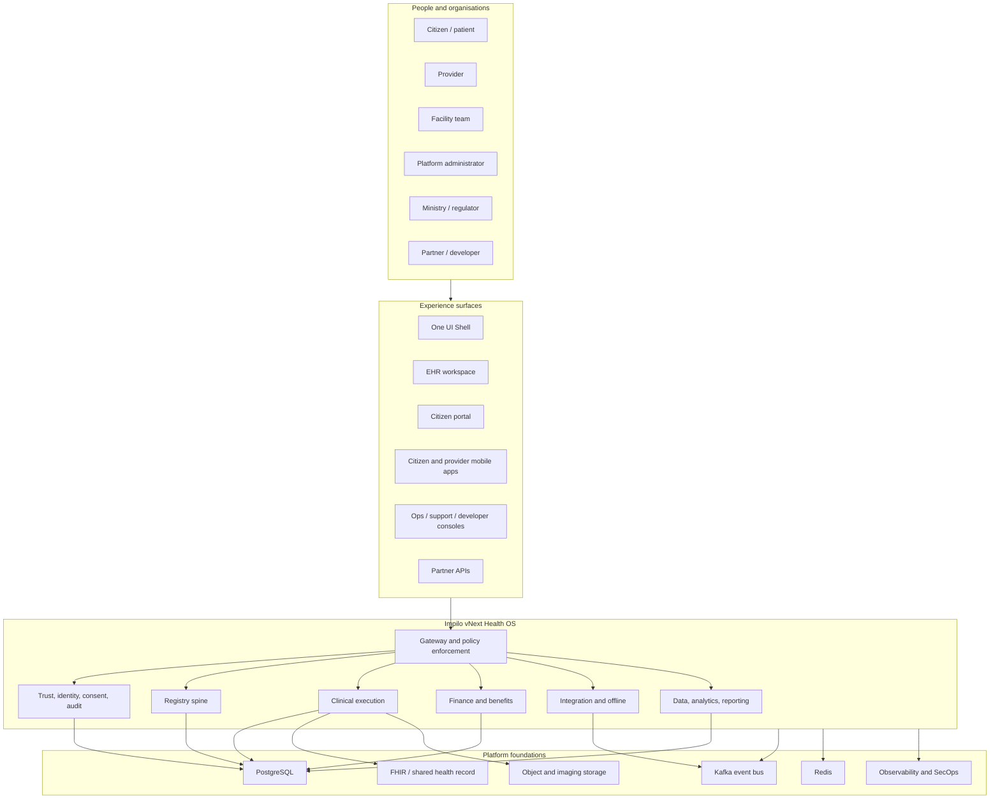

**Key point:** users do not connect directly to services or databases. They use governed experience surfaces and APIs that enter through the platform gateway.

---

## 2. Architectural Planes

The platform is organised into planes. Each plane owns a different kind of responsibility and should be deployed as independently scalable workloads.

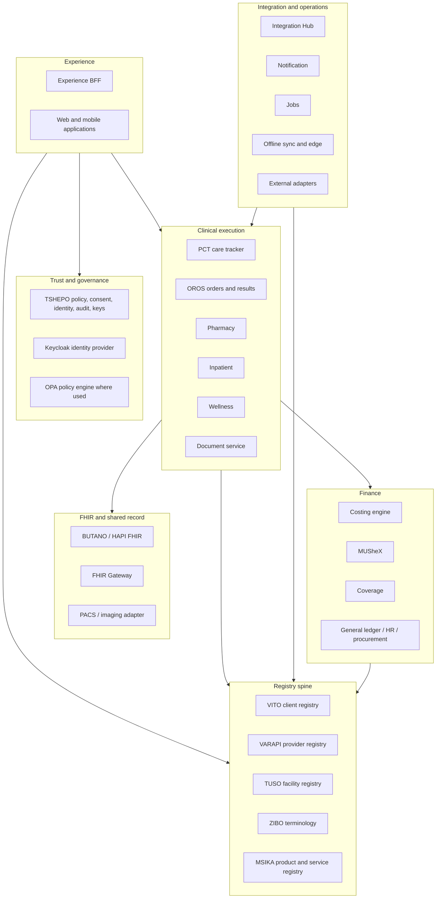

**Key point:** the registry spine and trust layer are not optional helpers. They are core runtime infrastructure for the Health OS.

---

## 3. Request Governance Flow

Every protected request must be governed before it reaches a service.

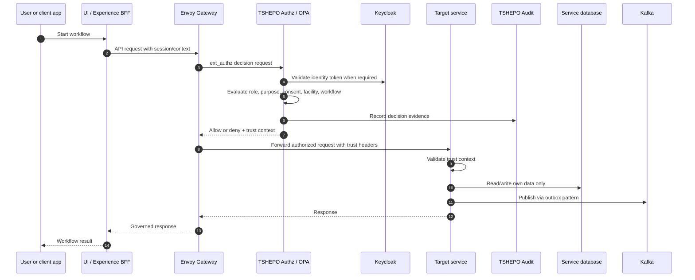

**Key point:** services do not make policy shortcuts. Trust, consent, audit, and context are part of the runtime contract.

---

## 4. Person, Provider, Facility, And Record Model

Impilo separates identity, context, and clinical record data.

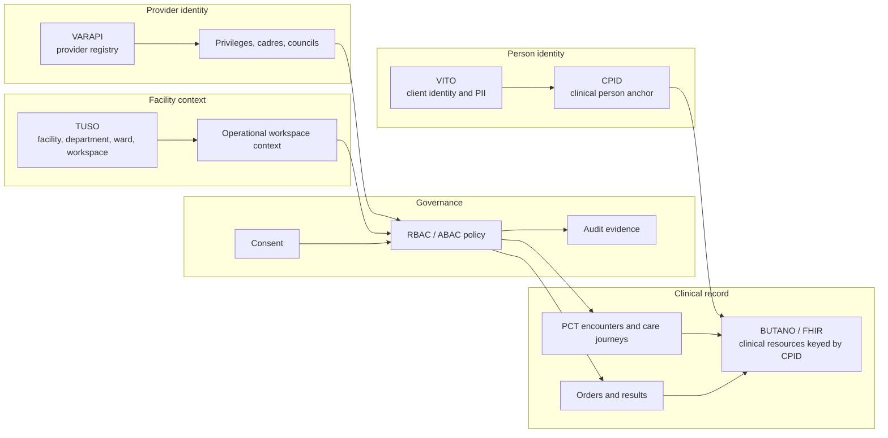

**Key point:** PII belongs in identity/registry services such as VITO. BUTANO/FHIR stores clinical resources against the approved person anchor, not raw demographic PII.

---

## 5. Clinical Workflow Example

This diagram shows a typical care flow from login to encounter, orders, record update, and audit/event publication.

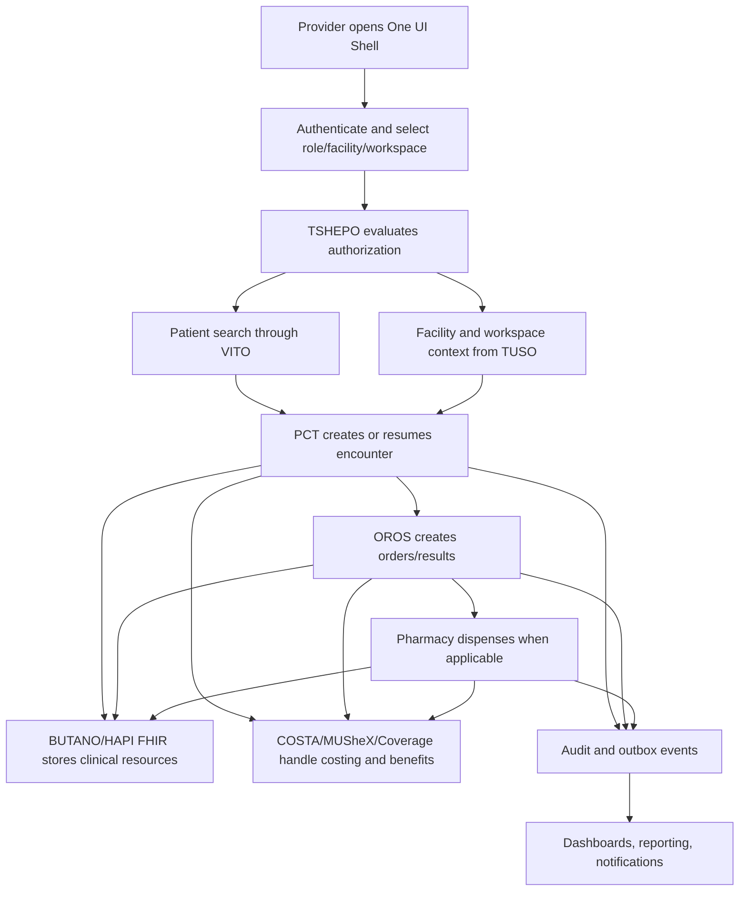

**Key point:** clinical workflows are not just UI screens. They are governed transactions across identity, facility context, care services, FHIR, finance, audit, and eventing.

---

## 6. Data And Eventing Model

Services own their data. Cross-service integration happens through governed APIs and reliable events.

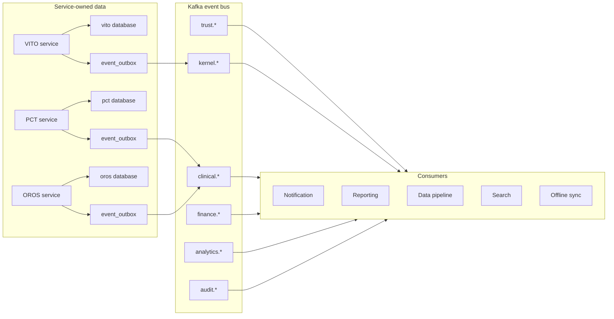

**Key point:** no service should read another service database directly. Events are published reliably through the outbox pattern.

---

## 7. Experience Shell Model

The user experience is one governed shell with multiple role and workspace surfaces.

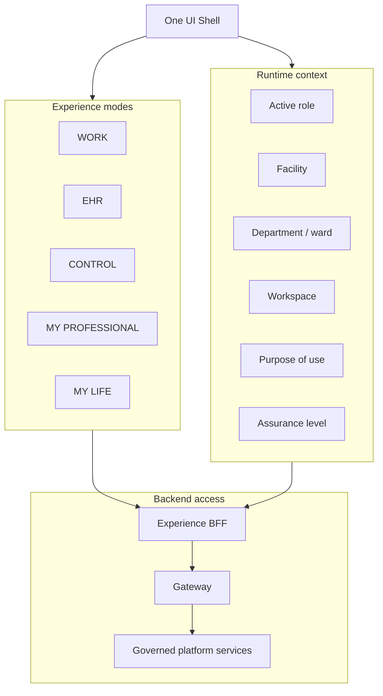

**Key point:** the shell is not just navigation. It carries operational context that affects authorization, workflow shape, audit, and data visibility.

---

## 8. Data Centre Sandbox Runtime

The data centre sandbox deploys the same solution as independent workloads with node pools and enforcement gates.

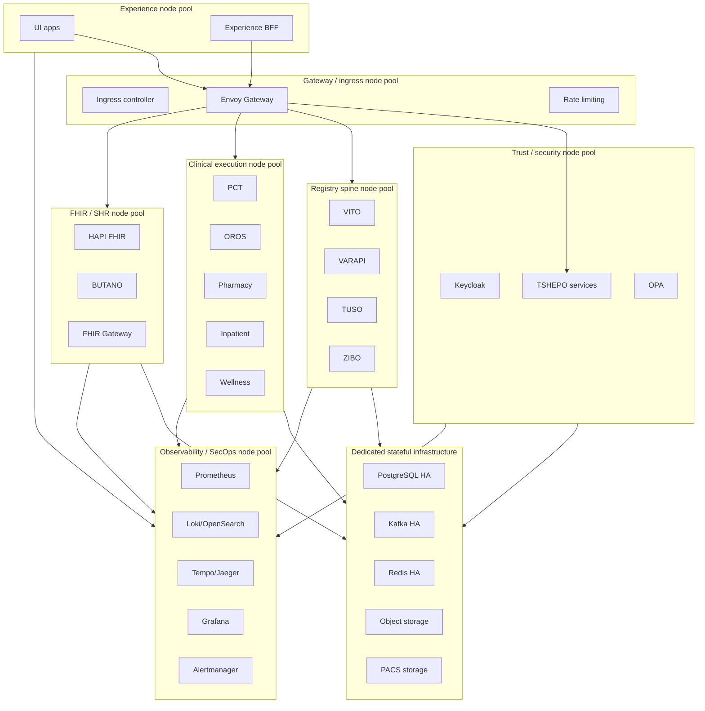

**Key point:** Docker Compose is local/dev bootstrap. The data centre sandbox is Kubernetes/OpenShift with node pools, HA stateful services, network policy, GitOps, observability, and acceptance gates.

---

## 9. Minimum Viable Sandbox Phase

Phase 1 is the first production-shaped sandbox that can produce meaningful evidence before the full target estate exists.

```mermaid
flowchart LR
    subgraph PHASE1["Phase 1 minimum viable sandbox"]
        W["6-8 Kubernetes/OpenShift workers"]
        DB["3 PostgreSQL HA nodes"]
        K["3 Kafka brokers"]
        R["3 Redis nodes"]
        S3["4 object storage nodes or managed S3"]
        OBS["2-3 observability/SecOps nodes"]
        CICD["2 CI/CD runner nodes"]
    end

    subgraph PROVES["What Phase 1 proves"]
        P1["Gateway-only access"]
        P2["TSHEPO/OPA enforcement"]
        P3["Trust header propagation"]
        P4["Ring 0 registry and trust path"]
        P5["Clinical and FHIR control path"]
        P6["Outbox/Kafka and audit"]
        P7["Baseline load and failure tests"]
        P8["Backup and restore"]
    end

    PHASE1 --> PROVES
```

**Key point:** Phase 1 is not a demo. It is a smaller but production-shaped environment sized for discovery.

---

## 10. Acceptance Gates

The sandbox is accepted only when it proves Health OS governance, isolation, and observability.

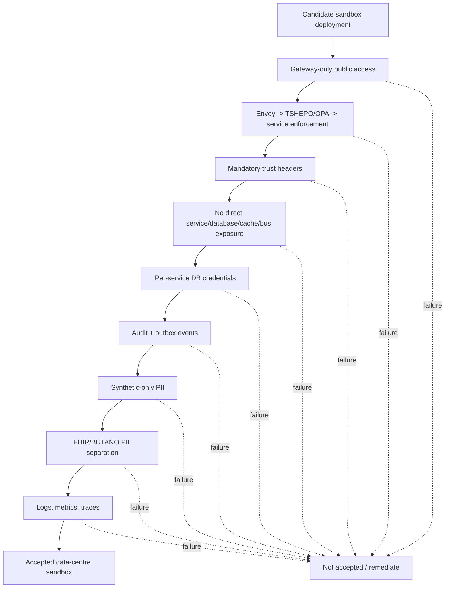

**Key point:** infrastructure health is necessary, but not enough. The sandbox must prove Impilo-specific governance and safety rules.

---

## 11. DevOps Feedback Loop

The deployment documents must evolve as the platform is measured.

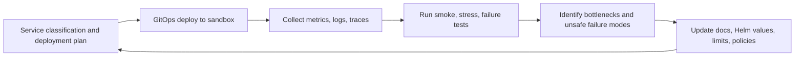

**Key point:** the service classification matrix is not a static guess. It is a living baseline updated by evidence from the sandbox.

