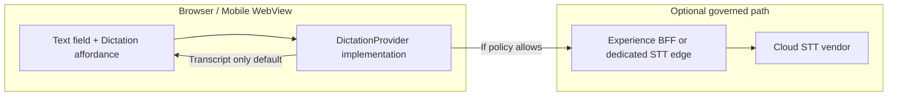

# Voice dictation — platform integration (architecture)

## Placement

- **Contracts & types**: `ui/shared-ui/dictation/` — framework-agnostic TypeScript (`DictationProvider`, `DictationSession`, transcription types, `DictationAuditMetadata`).
- **Orchestration UI (canonical)**: `ui/one-ui-shell` — user-facing routes, trust headers, BFF calls. Dictation UI components should import **types** from `shared-ui` and implement providers that respect **Envoy → TSHEPO** outbound patterns when calling any **server-side STT**.
- **Legacy workspace**: `ui/experience` — parallel copies exist; **migrate** toward shell + `shared-ui` to satisfy “one experience shell” doctrine.

## Data flow (target)

- **Default**: Web Speech API → transcript text only → **no** Impilo audio retention.
- **Optional**: Chunked audio to BFF only with **Mvumo consent** + **purpose of use** + **retention class** defined in privacy pack.

## Audit & observability

- Emit structured client events (and server audit when configured): `dictation_session_started`, `dictation_session_ended`, `dictation_transcript_committed` with **no transcript body** in audit by default.

## Service catalog

See `docs/plan/SERVICE_CATALOG.md` §10 — voice dictation adjunct.
