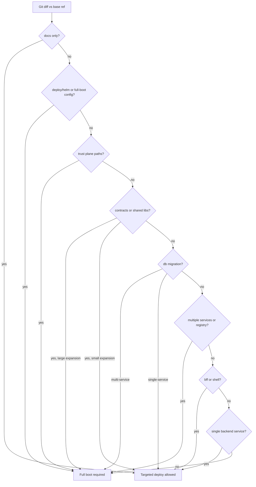

# Preview Blast Radius Strategy

**Audit date:** 2026-06-20  
**Companion:** [`preview-full-boot-pipeline-truth.md`](preview-full-boot-pipeline-truth.md), [`preview-deploy-speedup-plan.md`](preview-deploy-speedup-plan.md)

This document defines when Impilo vNext can safely rebuild/deploy only affected services versus when a full-estate boot is mandatory.

---

## 1. Core principles

1. **Product Truth over speed** — targeted deploy must never silently skip platform-critical guardrails.
2. **Digest alignment is mandatory** — every changed runtime component must be digest-pinned and truth-checked post-rollout.
3. **Full boot remains the release gate** — targeted preview is for ordinary development iteration, not release promotion.
4. **Refuse rather than guess** — when blast-radius class is ambiguous or high-risk, refuse targeted deploy and require full boot.
5. **Estate guard compatibility** — targeted deploy operates within `impilo-full-preview` using selective image/digest updates; it does not weaken `_estate-guard.sh` for default full-boot paths.

---

## 2. Blast-radius classification (A–I)

### Class A — Docs-only

**Trigger paths:** `docs/**` only (no code, config, contracts, or deploy touches).

| Dimension | Requirement |
|-----------|-------------|
| Required checks | `change-safety` (advisory), documentation review |
| Required builds | None |
| Required images | None |
| Required deployments | None |
| Required smoke tests | None |
| Full boot mandatory? | No |
| Targeted deploy allowed? | Yes (skip deploy) |

---

### Class B — Frontend-only

**Trigger paths:** `ui/one-ui-shell/**` without concurrent changes to `contracts/`, `services/experience-bff/`, or BFF route inventory.

| Dimension | Requirement |
|-----------|-------------|
| Required checks | `security`, `static`, `frontend`, `parity-web`, `change-safety` |
| Required builds | `one-ui-shell` npm build |
| Required images | `one-ui-shell` (add `experience-bff` if new BFF proxy routes or API client modules added) |
| Required deployments | `one-ui-shell` Deployment; BFF if API surface changed |
| Required smoke tests | `/health/version`, UI bundle truth if shell changed |
| Full boot mandatory? | No |
| Targeted deploy allowed? | **Yes** |

**Expansion rule:** If changed files include `ui/one-ui-shell/src/lib/api-client.ts` or new hooks under `src/hooks/`, include `experience-bff` in expanded set when new BFF endpoints are implied.

---

### Class C — Single service backend

**Trigger paths:** `services/<one-module>/**` only (one Maven module), no shared lib or contract changes.

| Dimension | Requirement |
|-----------|-------------|
| Required checks | `security`, `backend`, `api-contracts` (if controllers/DTOs), `change-safety` |
| Required builds | `mvn -pl <module> -am package -DskipTests` |
| Required images | Affected service only |
| Required deployments | That service's Deployment |
| Required smoke tests | Service health if exposed; BFF downstream if BFF calls changed API |
| Full boot mandatory? | No |
| Targeted deploy allowed? | **Yes** |

**Expansion rule:** If service is in BFF downstream env (`values-full-preview-bff-env.generated.yaml`), add `experience-bff` when BFF env regeneration is required (rare for single-service logic-only changes).

---

### Class D — BFF or experience-layer

**Trigger paths:** `services/experience-bff/**`, BFF Helm env overlay, experience orchestration routes.

| Dimension | Requirement |
|-----------|-------------|
| Required checks | `security`, `backend`, `parity-web`, `api-contracts`, `change-safety` |
| Required builds | experience-bff Maven + optional one-ui-shell if route surfacing changed |
| Required images | `experience-bff`, `one-ui-shell` (if UI routes/hooks touched in same change) |
| Required deployments | BFF + shell + ingress path |
| Required smoke tests | `/health/version`, BFF behaviour truth, UI bundle truth |
| Full boot mandatory? | No |
| Targeted deploy allowed? | **Yes** |

---

### Class E — Shared package / contract change

**Trigger paths:** `libs/**`, `services/shared-core/**`, `contracts/**`, `libs/tshepo-contracts/**`, generated TypeScript contracts.

| Dimension | Requirement |
|-----------|-------------|
| Required checks | `security`, `api-contracts`, `backend` (expanded), `parity-web`, `change-safety` |
| Required builds | Maven `-am` closure for all dependent modules |
| Required images | All services in expanded dependency graph with image strategy |
| Required deployments | Expanded runtime set |
| Required smoke tests | Digest truth per affected service; BFF behaviour if contract surfaces in BFF |
| Full boot mandatory? | **Often yes** if expansion > 10 services or trust/contracts plane |
| Targeted deploy allowed? | Only if expansion ≤ configured threshold (default 10) and no breaking OpenAPI change |

**Detection:**
- Direct: path prefix `libs/`, `contracts/`, `services/shared-core/`
- Maven expansion: `mvn -pl <affected> -am` dependency closure
- Registry expansion: 1-hop `consumes_from` / `exposes_to` from `docs/registry/services-registry.yaml`
- Contract expansion: services with handlers matching changed OpenAPI paths

---

### Class F — Database migration

**Trigger paths:** `**/db/migration/V*.sql`, Flyway version bumps.

| Dimension | Requirement |
|-----------|-------------|
| Required checks | `security`, `backend` (owning service), `integration`, `change-safety` |
| Required builds | Owning service JAR + image |
| Required images | Owning service |
| Required deployments | Owning Deployment; migration runs on pod start |
| Required smoke tests | Service health + data-plane smoke if available |
| Full boot mandatory? | **Yes** if migration affects shared schema or multiple services |
| Targeted deploy allowed? | **No** for multi-service schema; **Yes** for single-service isolated schema only |

**Refusal:** Any migration file outside a single known service directory → full boot required.

---

### Class G — Helm / infrastructure / config

**Trigger paths:** `deploy/**`, `config/full-boot*`, `infra/envoy/**`, generated Helm values, `docker-compose` for preview.

| Dimension | Requirement |
|-----------|-------------|
| Required checks | Full pipeline + `check-doctrine-compliance`, `check-helm-chart-integrity`, `check-full-boot-waves` |
| Required builds | All runtime images if image refs or strategies change |
| Required images | Full estate or infra spine as applicable |
| Required deployments | Full Helm release |
| Required smoke tests | Full boot smoke + estate completeness |
| Full boot mandatory? | **Yes** |
| Targeted deploy allowed? | **No** |

---

### Class H — Security / auth / trust plane

**Trigger paths:** `tshepo*`, `envoy`, `keycloak`, `mvumo`, `vito` (identity), trust libs, `infra/envoy`, policy engine.

| Dimension | Requirement |
|-----------|-------------|
| Required checks | `security`, `backend`, trust tests, `parity-web`, full change-safety |
| Required builds | Trust spine (22 `required_full_boot`) minimum |
| Required images | Trust plane + dependents |
| Required deployments | Trust spine + experience layer |
| Required smoke tests | Full boot smoke, authz golden path |
| Full boot mandatory? | **Yes** |
| Targeted deploy allowed? | **No** |

**Trust service IDs (non-exhaustive):** `tshepo-authz-service`, `tshepo-service`, `vito-service`, `mvumo-service`, `identity-assurance-service`, `envoy`, `keycloak`.

---

### Class I — Cross-platform / full-estate

**Trigger paths:** Registry reseed, classification regen, multi-plane changes, `docs/registry/services-registry.yaml` structural edits, wave config changes, seed data affecting multiple services.

| Dimension | Requirement |
|-----------|-------------|
| Required checks | Full `run-local-quality-gates.sh` with `PIPELINE_FULL_BOOT_BLOCKING=1` |
| Required builds | Full estate |
| Required images | Full runtime estate |
| Required deployments | Full Helm release |
| Required smoke tests | `FULL_ESTATE_PASS` + public `/health/version` |
| Full boot mandatory? | **Yes** |
| Targeted deploy allowed? | **No** |

---

## 3. Detection: changed paths → affected services

Implemented in `scripts/preview/resolve-blast-radius.mjs`.

### Direct path mapping

| Path pattern | Service / component |
|--------------|---------------------|
| `services/<maven_module>/` | Service id = maven module directory name |
| `services/experience-bff/` | `experience-bff` |
| `ui/one-ui-shell/` | `one-ui-shell` |
| `apps/mobile/<app>/` | Mobile lane (parity gates; no k3s deploy) |
| `libs/<lib>/` | Shared lib → Maven `-am` expansion |
| `contracts/openapi/<name>.openapi.yaml` | Contract → handler index expansion |
| `deploy/helm/` | Class G |
| `config/full-boot-service-classification.yml` | Class I |

### Base ref resolution

Uses `resolve_base_ref` from `scripts/guard/_guard-common.sh`:

1. `GUARD_BASE_REF` (explicit)
2. `GITHUB_EVENT_BEFORE` on push
3. `origin/${GITHUB_BASE_REF}` on PR
4. `HEAD~1`
5. `origin/main` / `origin/HEAD`
6. `HEAD`

### Dependency expansion

1. **Maven `-am`:** For each directly affected Java module, include all reactor dependencies.
2. **Registry 1-hop:** Read `consumes_from` and `exposes_to` from `docs/registry/services-registry.yaml`.
3. **BFF downstream:** If a changed service is in BFF env map, consider `experience-bff` when URL or routing semantics change.
4. **Experience layer:** Frontend API client or hook changes that reference new BFF paths → add BFF.

### Shared packages and contracts

| Change | Expansion |
|--------|-----------|
| `libs/shared-kernel-java` | All services depending on shared-kernel (Maven reactor) |
| `services/shared-core` | All services in Maven reactor depending on shared-core |
| `contracts/openapi/*.yaml` | Services with matching controller/handler paths |
| `libs/tshepo-contracts` | Trust plane + all authz-consuming services |

---

## 4. Special cases

### Frontend-only changes

- Build and deploy `one-ui-shell` only.
- Run `verify-ui-bundle-truth.sh` post-deploy.
- Do not skip `test:no-stubs` or `test:routes` in static phase.

### BFF changes

- Always include `experience-bff` image rebuild.
- Run `verify-bff-behaviour-truth.sh`.
- If BFF downstream env overlay must regenerate (`generate-full-preview-bff-downstream-env.mjs`), evaluate whether change is class D or G.

### Registry / catalogue / seed changes

- `docs/registry/services-registry.yaml` structural edit → Class I (full boot).
- `seed-full-preview-sovereign-data.sh` data seed → full boot or explicit operator authorization.
- Classification YAML change → Class G/I.

### Helm / chart / secret / env changes

- Any change to `deploy/helm/impilo-vnext/templates/` → Class G.
- Changes to `values-full-preview.yaml` base → Class G.
- Secret placeholder changes in values → Class G with full boot.

### Mobile app changes

- No k3s deploy for mobile artifacts.
- Required: `check-mobile-parity.sh`, `run-mobile-checks.sh` (advisory).
- Mobile changes do not trigger runtime image rebuild unless paired with BFF/API changes.

### Database migrations

- Single-service isolated schema: targeted deploy of owning service permitted.
- Cross-schema or shared Postgres instance migrations: full boot required.
- Always run Flyway on pod start; migrations must be idempotent.

### Tests without skipping guardrails

Even for targeted deploy, **always run:**

| Guardrail | Phase ID |
|-----------|----------|
| Secret scan | `security` |
| Change safety bundle | `change-safety` |
| No-stubs (if frontend touched) | `static` |
| Parity web (if user-facing paths) | `parity-web` |

Configurable via `PIPELINE_ONLY` from blast-radius resolver plus this fixed critical set.

---

## 5. Refusal conditions for targeted deploy

Targeted deploy **must refuse** (exit 2) when:

1. Change class is F (multi-service), G, H, or I.
2. Class E expansion exceeds threshold (default: 10 services).
3. Changes touch `config/full-boot-service-classification.yml` or `config/full-boot-waves.yml`.
4. Changes touch `deploy/helm/impilo-vnext/templates/`.
5. Trust plane service in affected set (class H).
6. Dirty working tree (unless `TARGETED_ALLOW_DIRTY=1` with explicit operator flag).
7. Missing kube context or `impilo-full-preview` namespace.
8. Local registry not reachable.
9. Helm release `impilo-full-preview` not installed (first deploy must use full boot).

---

## 6. Recommended defaults

| Scenario | Command |
|----------|---------|
| Ordinary dev (single service, UI, BFF) | `scripts/preview/targeted-deploy.sh` |
| Explain before deploy | `scripts/preview/explain-blast-radius.sh` |
| Shared contracts, schema, auth, Helm, release | `scripts/preview/full-boot.sh` |
| Final preview validation before promotion | Full boot with `FULL_ESTATE_PASS` |

---

## 7. Classification decision tree



---

## 8. Report output

Blast-radius resolution writes `reports/audits/blast-radius-<sha>.json`:

```json
{
  "change_class": "C",
  "change_classes": ["C"],
  "full_boot_required": false,
  "targeted_deploy_allowed": true,
  "direct_services": ["pharmacy-service"],
  "expanded_services": ["pharmacy-service"],
  "images_to_build": ["pharmacy-service"],
  "pipeline_only": "security,static,backend,change-safety",
  "refusal_reasons": [],
  "rationale": ["Single backend module changed with no shared dependencies"]
}
```
