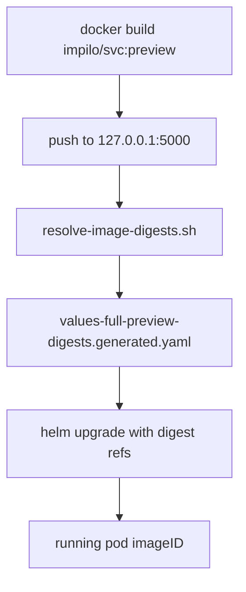

# Preview Full-Boot Pipeline Truth Map

**Audit date:** 2026-06-20  
**Branch:** `claude/staging-ux-orchestration-remediation-Yypyl`  
**Public preview URL:** http://41.57.127.235  
**VM workspace:** `/opt/impilo/repos/Impilo-vNext`

This document maps the **actual** end-to-end flow from local code change through full-boot preview deploy and public `/health/version` confirmation. It is the canonical pipeline truth reference for operators and agents.

---

## 1. What happens after a developer changes files?

### Typical developer rhythm

1. **Edit** on the VM Remote SSH workspace (`robert@41.57.127.235:2276`, path `/opt/impilo/repos/Impilo-vNext`).
2. **Run quality gates** (recommended before deploy authorization):
   ```bash
   bash scripts/pipeline/run-local-quality-gates.sh
   bash scripts/pipeline/cursor-local-feedback.sh
   ```
3. **Commit and push** to GitHub (source of truth).
4. **Collect CI feedback** (GitHub Actions or VM fallback):
   ```bash
   bash scripts/ci/collect-ci-feedback.sh
   ```
5. **Choose deploy path:**
   - **Slice preview** (4 services, `impilo-preview`) — legacy fallback; ingress disabled.
   - **Full boot** (full estate, `impilo-full-preview`) — owns public IP when validated.
   - **Targeted preview** (new) — affected services only when blast-radius class permits.
6. **Authorize deploy** with the required phrase (never auto-deploy).
7. **Post-deploy validation** — smoke, digest truth, estate completeness, `/health/version`.

### Dual-mode testing doctrine

When GitHub Actions billing blocks runners, **VM local gates are authoritative** for code pass/fail. CI infrastructure failure must not be reported as code failure. See [`docs/environment/DUAL_MODE_TEST_PIPELINE.md`](../environment/DUAL_MODE_TEST_PIPELINE.md).

---

## 2. Command and script inventory

### Quality gates (no deploy)

| Category | Script | What it runs |
|----------|--------|--------------|
| **Master pipeline** | `scripts/pipeline/run-local-quality-gates.sh` | 16 blocking phases + advisory full-boot/mobile/E2E |
| **Workspace** | `scripts/pipeline/verify-workspace.sh` | Path, branch, remote, dirty tree |
| **Tools** | `scripts/pipeline/verify-tools.sh` | java, node, npm, python3, git, curl, mvn |
| **Security** | `scripts/test/run-security-checks.sh` | Secret scan, no committed `.env`, BFF password literals |
| **Static** | `scripts/test/run-static-checks.sh` | Deprecated surfaces, `test:routes`, `test:no-stubs`, `test:launchers`, registry maturity |
| **Frontend lint** | `scripts/test/run-frontend-checks.sh` → `ui/one-ui-shell` | `npm ci`, `lint`, `type-check`, `npm test`, `build` |
| **Backend tests** | `scripts/test/run-backend-checks.sh` | shared libs, experience-bff IT, tshepo-authz tests |
| **Parity web** | `scripts/guard/check-backend-frontend-parity.sh` | Matrix sync, mocks/stubs, API surfacing |
| **Parity mobile** | `scripts/guard/check-mobile-parity.sh` | Mobile matrix, mocks, API surfacing |
| **API contracts** | `scripts/test/run-api-contract-checks.sh` | OpenAPI validity, registry validation, contract matrix |
| **Integration** | `scripts/test/run-integration-checks.sh` | HTTP regression, optional live preview health |
| **Regression** | `tests/regression/preview-http-regression.sh` | Preview HTTP regression |
| **Change safety** | `scripts/guard/run-change-safety-gates.sh` | Inventory, contracts, parity, dangerous deletions |
| **Full-boot advisory** | `check-full-boot-runtime-completeness.sh`, `check-doctrine-compliance.sh`, etc. | Estate readiness (blocking only if `PIPELINE_FULL_BOOT_BLOCKING=1`) |
| **Feedback** | `scripts/pipeline/cursor-local-feedback.sh` | Human summary of VM + CI + deploy readiness |
| **CI collect** | `scripts/ci/collect-ci-feedback.sh` | GitHub Actions status for deploy gate |

### Frontend npm scripts (`ui/one-ui-shell/package.json`)

| Script | Command |
|--------|---------|
| `lint` | `next lint` |
| `type-check` | `tsc --noEmit` |
| `test` | `vitest run` |
| `test:routes` | `node scripts/route-parity-check.mjs` |
| `test:no-stubs` | `node scripts/no-stub-guard.mjs` |
| `test:launchers` | Launcher dead-end guard |
| `build` | `next build` |
| `e2e` | `playwright test` |

### Build and image pipeline

| Step | Script | Notes |
|------|--------|-------|
| Discover targets | `scripts/build/discover-build-targets.sh` | Emits `reports/full-boot/build-targets.*`, `image-strategy-targets.json` |
| Maven + UI compile | `scripts/build/build-full-vnext.sh` | Full reactor; per-module fallback |
| Docker images | `scripts/build/build-full-vnext-images.sh` | Default `--full-estate`; `--only`, `--wave`, `--debug-required-spine-only` |
| JAR template image | `scripts/build/build-runtime-image-from-jar.sh` | Shared JRE template for Java services |
| Registry push | `scripts/build/push-images-to-local-registry.sh` | Modes: `runtime`, `required`, `wave N`; parallel `IMPILO_PUSH_PARALLEL=4` |
| Digest resolve | `scripts/full-boot/resolve-image-digests.sh` | Writes `values-full-preview-digests.generated.yaml` |
| Classification | `node scripts/full-boot/generate-full-boot-artifacts.mjs` | Regenerates classification catalog |

### Image tagging

| Mechanism | Location | Value |
|-----------|----------|-------|
| Deploy tag | `FULL_BOOT_IMAGE_TAG` env | Default `preview` (mutable) |
| Commit-scoped tag | `full_boot_image_tag()` in `_full-boot-common.sh` | `preview-<short-sha>` |
| Registry ref | `values-full-preview.yaml` | `127.0.0.1:5000/impilo/<service-id>:preview` |
| Digest pin | `values-full-preview-digests.generated.yaml` | `@sha256:...` per service |

### k3s / containerd loading

| Script | Scope |
|--------|-------|
| `scripts/operator/impilo-k3s-import-images` | Full boot; `--runtime-only --only id1,id2 --force` |
| `scripts/operator/fullboot.sh import-images` | Orchestration + sudo checkpoint fallback |
| `scripts/deploy/k3s-import-preview-images.sh` | Slice only (2 images) |
| `scripts/operator/registry-up.sh` | Local OCI registry on port 5000 |

### Helm deploy

| Track | Release | Namespace | Values stack |
|-------|---------|-----------|--------------|
| Slice | `impilo-preview` | `impilo-preview` | `values-preview.yaml` |
| Full boot | `impilo-full-preview` | `impilo-full-preview` | `values-full-preview.yaml` + 3 generated overlays |

**Chart root:** `deploy/helm/impilo-vnext/`

**Generated overlays:**
- `values-full-preview-runtime.generated.yaml` — enables runtime microservices
- `values-full-preview-bff-env.generated.yaml` — BFF downstream URLs
- `values-full-preview-digests.generated.yaml` — `@sha256` pins

**Orchestrator:** `scripts/deploy/full-boot-preview-deploy.sh`

### Rollout and smoke

| Script | Purpose |
|--------|---------|
| `kubectl rollout status deployment -n impilo-full-preview` | In full-boot deploy (timeout `FULL_BOOT_ROLLOUT_TIMEOUT`, default 45m) |
| `scripts/test/run-full-boot-smoke-tests.sh` | Required deployment readiness + optional `/health/version` |
| `scripts/deploy/preview-smoke-test.sh` | Slice HTTP smoke |
| `scripts/operator/staged-wave-rollout-restart.sh` | Wave-by-wave pod recycle |
| `scripts/operator/wave-gates.sh` | Post-wave smoke/completeness |

### Preview validation and truth

| Script | Purpose |
|--------|---------|
| `scripts/guard/check-runtime-image-truth.sh` | Digest chain: docker → registry → deployment → pod |
| `scripts/guard/check-full-boot-runtime-completeness.sh` | `FULL_ESTATE_PASS` (92/92 runtime + image truth) |
| `scripts/test/verify-ui-bundle-truth.sh` | Served Next.js bundle hash |
| `scripts/test/verify-bff-behaviour-truth.sh` | BFF endpoint behaviour |
| `scripts/operator/report-preview-generation.sh` | `SINGLE_PUBLIC_STACK` invariant |
| `curl http://41.57.127.235/health/version` | Public commit/environment truth |

---

## 3. Relevant file map

### Package and workspace config

- `ui/package.json` — Turborepo root (`build`, `lint`, `type-check`)
- `ui/one-ui-shell/package.json` — Canonical experience shell
- `apps/mobile/package.json` — Mobile workspace (`guard:mobile-parity`, typecheck)

### Classification and registry

- `config/full-boot-service-classification.yml` — Image strategy per component (147 entries)
- `config/full-boot-waves.yml` — Wave sequencing for phased boot
- `docs/registry/services-registry.yaml` — Service ownership, `consumes_from`, `exposes_to`
- `docs/environment/RUNTIME_IMAGE_STRATEGY_DOCTRINE.md` — Image strategy doctrine

### Docker and compose

- `services/*/Dockerfile` — Per-service Dockerfiles (92 under `services/`)
- `ui/one-ui-shell/Dockerfile` — Experience shell image
- `scripts/build/templates/impilo-jre-runtime.Dockerfile` — Shared JRE template
- `compose/experience/docker-compose.yml` — Local dev experience stack

### Kubernetes and Helm

- `deploy/helm/impilo-vnext/Chart.yaml`
- `deploy/helm/impilo-vnext/values.yaml`, `values-preview.yaml`, `values-full-preview.yaml`
- `deploy/helm/impilo-vnext/templates/microservice.yaml`, `experience-bff.yaml`, `one-ui-shell.yaml`

### GitHub Actions

| Workflow | File | Role |
|----------|------|------|
| CI | `.github/workflows/ci.yml` | Main test suite; VM parity job on active branch |
| VM Local Gates | `.github/workflows/vm-local-gates.yml` | Self-hosted `run-local-quality-gates.sh` |
| Deploy Preview | `.github/workflows/deploy-preview.yml` | SSH slice deploy only |
| Deploy | `.github/workflows/deploy.yml` | Staging/production GHCR (not k3s preview) |

**No GitHub Actions workflow for full-boot deploy.** Full boot is VM-manual only.

### E2E and parity

- `ui/one-ui-shell/e2e/` — Playwright specs
- `scripts/guard/check-backend-frontend-parity.sh`
- `scripts/guard/check-mobile-parity.sh`
- `docs/frontend/BACKEND_CAPABILITY_TO_FRONTEND_SURFACING_MATRIX.md`

### Reports

- `reports/pipeline/latest-summary.json` — VM gate result
- `reports/full-boot/runtime-image-truth.json` — Per-service digest alignment
- `reports/full-boot/full-boot-runtime-report.json` — Estate completeness
- `reports/full-boot/preview-generation.json` — Public stack generation

---

## 4. Rebuild behaviour: all services or selective?

### Default full-boot deploy: **rebuilds the full estate every time**

| Stage | Default | Selective options |
|-------|---------|-------------------|
| Maven/UI compile | All `build_required` targets | Per-module fallback on reactor failure only |
| Docker images | All non-`not-required` strategies (`--full-estate`) | `--only <svc>`, `--wave N`, `--debug-required-spine-only` |
| Registry push | All runtime images (`runtime` mode) | Skips if `:preview` tag already exists; `IMPILO_PUSH_ONLY` filter |
| k3s import | All runtime service IDs (`--force`) | `--only id1,id2` on import helper |
| Helm deploy | Full chart, all enabled microservices | `--max-wave N` + `--allow-partial` (debug only) |

### Estate guard doctrine

`scripts/full-boot/_estate-guard.sh` refuses partial deploy unless an explicit debug flag is passed:

```
--debug-required-spine-only | --debug-wave-zero-only | --slice | --allow-partial | --no-full-estate
```

Banner: *"This is not the full vNext estate and is not valid for full product testing. All of vNext is vNext."*

### Slice preview (separate track)

`manual-authorized-preview-deploy.sh` rebuilds **only 2 app images** (experience-bff + one-ui-shell) into `impilo-preview`. Does not own public ingress when full boot is active.

### Wave path (sequencing, not optionality)

`fullboot.sh wave-build N` / `wave-deploy N` builds cumulative waves from `config/full-boot-waves.yml`. Valid for debugging sequencing; final wave must reach full estate for release-quality confidence.

### Skip flags (operator override)

| Flag | Effect |
|------|--------|
| `FULL_BOOT_SKIP_BUILD=1` | Skip compile + image build |
| `FULL_BOOT_SKIP_PUSH=1` | Skip registry push (warns stale images) |
| `FULL_BOOT_SKIP_IMPORT=1` | Skip k3s import |
| `IMPILO_DEPLOY_NO_DIGEST_PIN=1` | Use mutable tags (not recommended) |

### Answer

**Yes — the current default full-boot path rebuilds and redeploys the full runtime estate (~92 services) on every authorized full-boot deploy.** Selective mechanisms exist at the image-build and import layers but are gated as debug/partial modes until the new targeted preview tooling (`scripts/preview/targeted-deploy.sh`) is used for ordinary iteration.

---

## 5. Digest pinning and alignment validation

### Pinning generation (deploy-time)



1. Images pushed to local registry (`127.0.0.1:5000`).
2. `resolve-image-digests.sh` queries registry manifest `@sha256` per runtime service.
3. Writes `deploy/helm/impilo-vnext/values-full-preview-digests.generated.yaml`.
4. Stamps digests into `reports/full-boot/full-image-build-records.json`.
5. Helm deploy adds `-f` digests file + `--set global.imagePullPolicy=Always`.

### Alignment validation (read-only guards)

`check-runtime-image-truth.sh` verifies per runtime service:

```
source commit → local Docker (impilo/<svc>:preview)
             → local registry digest
             → containerd (best-effort via k3s ctr)
             → Deployment spec image ref (@sha256 or tag)
             → running pod status.containerStatuses[0].imageID
```

- **Pre-rollout:** warn-only in deploy script
- **Post-rollout:** **blocking** — deploy exits 1 on failure

`check-full-boot-runtime-completeness.sh` consumes `runtime-image-truth.json` — stale non-exempt services block `FULL_ESTATE_PASS`.

### Post-deploy commit alignment

| Track | Endpoint | Expected |
|-------|----------|----------|
| Full boot | `http://41.57.127.235/health/version` | `environment=full-preview`, commit matches `PREVIEW_DEPLOY_COMMIT` |
| Slice | Same URL when slice active | `environment=preview` |

### Highest-Validated-Stack-Wins

After full boot, `report-preview-generation.sh` asserts the public IP is served only by `impilo-full-preview` ingress (`SINGLE_PUBLIC_STACK: yes`). The 4-service `impilo-preview` slice is a rollback fallback with `ingress.enabled: false`.

---

## 6. Flow diagrams

### Full boot (canonical)

```
Developer change
  → run-local-quality-gates.sh
  → git commit + push
  → collect-ci-feedback.sh
  → AUTHORIZE FULL BOOT PREVIEW DEPLOY
  → full-boot-preview-deploy.sh
       → build-full-vnext.sh (all targets)
       → build-full-vnext-images.sh --full-estate
       → push-images-to-local-registry.sh runtime
       → resolve-image-digests.sh
       → impilo-k3s-import-images --runtime-only --force
       → helm upgrade impilo-full-preview
       → rollout status + smoke
       → check-runtime-image-truth.sh (blocking)
       → check-full-boot-runtime-completeness.sh
       → verify-ui-bundle-truth + verify-bff-behaviour-truth
       → report-preview-generation.sh
       → /health/version commit match
```

### Slice preview (legacy fallback)

```
manual-authorized-preview-deploy.sh
  → collect-ci-feedback.sh
  → github-actions-remote-preview-deploy.sh
       → build-all.sh
       → preview-build-images.sh (BFF + shell)
       → preview-deploy.sh (impilo-preview)
       → preview-smoke-test.sh
```

### New targeted preview (ordinary iteration)

See [`docs/audits/preview-blast-radius-strategy.md`](preview-blast-radius-strategy.md) and [`docs/environment/PREVIEW_DEPLOY_OPERATOR_GUIDE.md`](../environment/PREVIEW_DEPLOY_OPERATOR_GUIDE.md).

```
explain-blast-radius.sh (dry-run)
  → targeted-deploy.sh --dry-run | --execute
       → resolve-blast-radius.mjs
       → selective build/push/import/helm
       → targeted digest truth + /health/version
```

---

## 7. Estate size reference

| Metric | Count | Source |
|--------|-------|--------|
| Catalog entries | 147 | `full-boot-service-classification.yml` |
| Runtime K8s microservices | 90 | classification `deployment_lane` |
| Runtime estate (90 + BFF + shell) | **92** | `check-full-boot-runtime-completeness.sh` |
| Required spine | 22 | `required_full_boot` classification |
| UAT deployment target | **98/98** | 92 app + ~6 infra Deployments |

---

## 8. Operator quick reference

```bash
# Quality gates (no deploy)
bash scripts/pipeline/run-local-quality-gates.sh
bash scripts/pipeline/cursor-local-feedback.sh

# Understand blast radius
bash scripts/preview/explain-blast-radius.sh

# Targeted iteration (when class permits)
bash scripts/preview/targeted-deploy.sh --dry-run
bash scripts/preview/targeted-deploy.sh --execute

# Full estate (release-quality)
bash scripts/preview/full-boot.sh
# Type: AUTHORIZE FULL BOOT PREVIEW DEPLOY

# Legacy entrypoints (still valid)
bash scripts/deploy/full-boot-preview-deploy.sh
bash scripts/operator/full-estate.sh update
bash scripts/deploy/manual-authorized-preview-deploy.sh  # slice only
```
