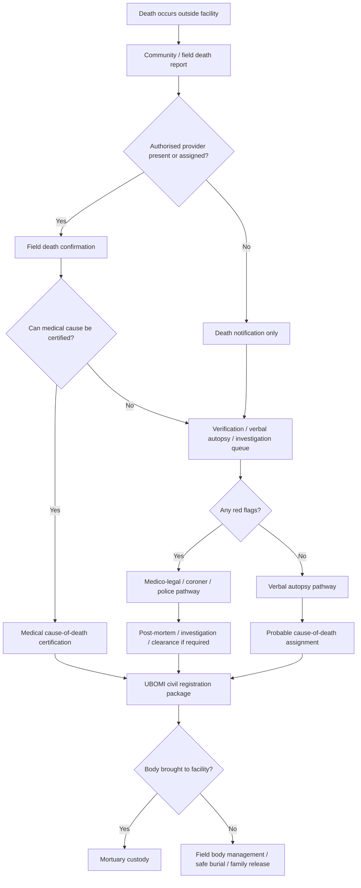

# Community / Field Death Pathway — contract refinement (product-owner directed)

**Status:** Design spec / follow-up. **Owner:** death-pathway team (PCT DeathCase + UBOMI CRVS + mobile
`deathPathwayService`). **Origin:** raised while flagging the pre-existing `deathPathwayService.test.ts`
failure during the Encounter Structured Forms work; expanded into a proper model by the product owner.
This document is a **specification to implement**, not implemented behaviour.

## Why

The current contract collapses two different clinical realities into one `sourceContext: "COMMUNITY"`:

> **Community/field death ≠ brought-in-dead ≠ facility death confirmation**
> **Verbal autopsy ≠ medical certification of cause of death**

Sending `sourceContext: "COMMUNITY"` is directionally right but too crude. A person can die outside a
facility, be registered, be assigned a **probable** cause via verbal autopsy, be managed through safe burial
or public-health isolation, and **never physically enter a facility** — the death case still belongs in
vNext. The model must not force every community death down the `brought-in-dead` / facility-mortuary path.

## Death-pathway origins (`sourceContext`)

1. **`COMMUNITY_FIELD` / `COMMUNITY_HOME` / `OUTREACH_FIELD_OPS` / `DISASTER_SITE` / `ISOLATION_FIELD_SITE`**
   — died in the community, at home, on outreach, in field/disaster ops, or in an isolation/public-health
   setting. The body may never come to a facility. **Not** "brought in dead."
2. **`BROUGHT_IN_DEAD`** — body physically brought to a facility / mortuary / police point. Facility body
   receipt, mortuary custody, and medico-legal screening apply.
3. **`FACILITY`** — death occurs inside a facility during an active encounter / admission / procedure.
4. **`CUSTODY` / `UNKNOWN_LOCATION`** — in custody, or location not yet established.

## Flow



## Cause-of-death certainty class (`causeOfDeathBasis`)

Verbal autopsy is its own workflow (WHO VA standard/instrument for deaths outside health facilities). Do
**not** mix VA-inferred causes with medically certified facility deaths in mortality intelligence — store a
distinct certainty class:

| `causeOfDeathBasis` | Meaning |
|---|---|
| `MEDICALLY_CERTIFIED` | Clinician certifies medical cause of death |
| `POST_MORTEM_CERTIFIED` | Cause based on post-mortem / pathology |
| `VERBAL_AUTOPSY_PROBABLE` | Cause inferred from structured VA interview |
| `FIELD_INVESTIGATION_PROBABLE` | Cause inferred from field / public-health investigation |
| `MEDICO_LEGAL_PENDING` | Pending coroner / police / post-mortem |
| `UNKNOWN_UNCERTIFIED` | No adequate cause assignment yet |

## Body disposition & custody (`bodyDispositionContext`)

The death case must support **no facility mortuary custody**. Custody may be field team, family, police,
funeral director, public-health safe-burial team, disaster-response, or unknown/unrecovered.

```
sourceContext:
  "FACILITY" | "BROUGHT_IN_DEAD" | "COMMUNITY_HOME" | "COMMUNITY_FIELD" | "OUTREACH_FIELD_OPS"
  | "DISASTER_SITE" | "ISOLATION_FIELD_SITE" | "CUSTODY" | "UNKNOWN_LOCATION"

bodyDispositionContext:
  "BROUGHT_TO_FACILITY" | "NOT_BROUGHT_TO_FACILITY" | "FIELD_SAFE_BURIAL" | "COMMUNITY_RELEASE"
  | "POLICE_CUSTODY" | "FUNERAL_DIRECTOR_DIRECT" | "TRANSFERRED_TO_MORTUARY" | "TRANSFERRED_TO_POST_MORTEM_SITE"

causeOfDeathBasis: (table above)
```

Isolation / infectious-risk deaths need a **Field Body Management / Safe & Dignified Burial** branch
(WHO safe-and-dignified-burial protocol; IFRC safe handling of bodies as a public-health intervention).

## Endpoint logic (corrected)

`/death/confirm` should mean **an authorised actor has confirmed death**. A report is **not** a confirmation.

| Scenario | Endpoint |
|---|---|
| Provider confirms death in facility | `/internal/v1/death/confirm` |
| Provider confirms death in field/community | `/internal/v1/death/confirm` + `sourceContext: COMMUNITY_FIELD` (+ `bodyDispositionContext`) |
| Family / CHW / surveillance team **reports** a community death (unverified) | `/internal/v1/death/community-report` |
| Body arrives at facility already dead | `/internal/v1/death/brought-in-dead` or `/death/confirm` + `sourceContext: BROUGHT_IN_DEAD` |
| Verbal autopsy interview | `/internal/v1/death/verbal-autopsy` |
| Public-health / isolation body handling | `/internal/v1/death/field-body-management` (linked under the same death case) |

## Product rule

> A person can die outside the facility, be registered, be assigned a probable cause through verbal autopsy,
> be managed through safe burial or public-health isolation protocols, and never physically enter a facility.
> The death case still belongs in vNext.

## Immediate action for the failing test

`apps/mobile/provider-app/src/__tests__/services/deathPathwayService.test.ts` (community/brought-in-dead)
was flagged failing during the encounter-forms work. **Do not** fix it by collapsing community and
brought-in-dead into one meaning. Reconcile it against this refined contract: decide whether the mobile flow
under test is a provider-**confirmed** field death (→ `/death/confirm` + `COMMUNITY_FIELD`) or a
**report** (→ `/death/community-report`), then align the test and service accordingly.

## References
- WHO Verbal Autopsy standard (ascertaining/attributing causes of death, incl. outside health facilities).
- WHO safe and dignified burial protocol (infection control + family/religious involvement).
- IFRC Safe and Dignified Burial guide (safe handling of bodies during outbreaks as public-health intervention).
