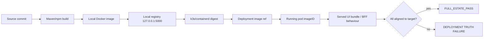

# vNext Unified Runtime Estate and Runtime Image Truth Doctrine

> **All of vNext is accountable. All deployable vNext services must run. One estate
> means all deployable vNext services. Supporting artifacts do not run as pods, but
> they remain part of vNext truth. Waves are sequencing, not optionality. Deployment
> truth is the running estate, not the deployment story. A deployment is not complete
> until the full estate is running, aligned, healthy, current, and testable.**

This document is doctrine. It governs how Impilo vNext is built, deployed, started,
stopped, updated, validated, and reported. It supersedes any tooling behaviour that
treats a subset of vNext as a valid product/runtime end state.

Related doctrine:
- [`docs/environment/RUNTIME_IMAGE_STRATEGY_DOCTRINE.md`](../environment/RUNTIME_IMAGE_STRATEGY_DOCTRINE.md)
- [`docs/environment/DUAL_MODE_TEST_PIPELINE.md`](../environment/DUAL_MODE_TEST_PIPELINE.md)
- `.cursor/rules/ci-feedback-and-manual-deploy.mdc`

---

## 1. Doctrine line

> All of vNext is accountable. All deployable vNext services must run. One estate means
> all deployable vNext services. Supporting artifacts do not run as pods, but they remain
> part of vNext truth. Waves are sequencing, not optionality. Deployment truth is the
> running estate, not the deployment story. A deployment is not complete until the full
> estate is running, aligned, healthy, current, and testable.

Impilo vNext is **one integrated Health Operating System**. It is not a loose collection
of optional apps, debug slices, wave-zero components, required-only services, disconnected
deployments, stale pods, old images, or partial runtime states. Services may be modular
for engineering, independently buildable, and rolled out in waves for operational safety,
but product-wise and runtime-wise they form **one estate**.

The default operating rule:

- vNext **runs** as one estate.
- vNext **starts** as one estate.
- vNext **stops** as one estate.
- vNext **updates** as one estate.
- vNext **validates** as one estate.
- vNext **is tested** as one estate.

---

## 2. The three estates

### 2.1 Full accountability estate (everything)

Everything in vNext is accountable, versioned, validated, and usable as evidence:

- deployable services
- shared libraries
- contracts
- schemas
- documentation
- generated reports
- test fixtures
- mobile apps
- external adapter definitions
- infrastructure definitions
- tests
- deployment scripts
- operator scripts
- CI/CD gates
- product testing workbooks
- architecture documents

### 2.2 Full runtime estate (everything that must run)

Everything that must actually run as a deployable workload:

- all deployable backend services
- all deployable adapters
- all deployable workflow services
- all deployable registry services
- all deployable clinical services
- all deployable public-health services
- all deployable enterprise/resource services
- all deployable intelligence/Nompilo services
- all notification, search, scheduling, guidance, audit, and support services
- all backend services used by mobile
- `experience-bff`
- `one-ui-shell`
- the runtime infrastructure required to run them

In this repository the runtime estate is currently:
**89 `runtime_k8s_microservice` + 2 dedicated (`experience-bff`, `one-ui-shell`) + 7 required
infrastructure images (postgres, redis, kafka, keycloak, envoy, minio, hapi-fhir).**

### 2.3 Full testing estate

The full runtime estate exercised end-to-end, mobile surfaces tested on mobile, and all
supporting accountability artifacts validated where relevant.

---

## 3. Waves are sequencing only

Waves are an **internal rollout sequencing mechanism** to protect operational safety
(pod/memory pressure). Waves must never define the final runtime estate. A phased rollout
is acceptable **only if the final outcome is the full vNext estate running the intended
version.**

Canonical vocabulary (use these; do not use "optional"/"required-only" as product end states):

| Term | Meaning |
|------|---------|
| `full_estate` | all deployable vNext services running and aligned |
| `wave_sequenced_full_estate` | phased rollout mechanism whose final outcome is full estate |
| `debug_required_spine_only` | explicit partial operator mode for emergency/core diagnostics only |
| `debug_wave_zero_only` | explicit partial operator mode for wave-zero diagnostics only |
| `debug_slice` | explicit partial troubleshooting mode |
| `partial_wave` | intermediate rollout state, not product-ready |
| `blocked_service` | service expected to run but currently blocked |
| `non_runtime_artifact` | library/schema/doc/test fixture/supporting artifact, not an independent deployable service |
| `mobile_surface_requires_mobile_test` | surface whose parity is validated on mobile, not as a pod |
| `external_dependency_with_internal_adapter` | external system represented by an internal vNext adapter that must run |

Partial/debug modes may exist only as explicit operator modes. They must never be the
default, never be called full estate / full preview / full boot, and must require an
explicit flag (`--debug-required-spine-only`, `--debug-wave-zero-only`, `--slice`,
`--allow-partial`, `--no-full-estate`). When used, tooling must print:

> This is not the full vNext estate and is not valid for full product testing. All of vNext is vNext.

---

## 4. Deployment truth vs metadata truth

**Deployment truth is the running estate, not the deployment story.**

Deployment truth **is**:

- the active registry digest
- the k3s/containerd digest
- the Kubernetes Deployment image reference
- the running pod `imageID`
- the served UI browser bundle
- the API/runtime behaviour
- the full estate readiness state

…all matching the intended target commit/digest set.

Deployment truth is **not**:

- Helm metadata
- local Docker
- a successful build
- `/health/version` alone
- a report saying the commit changed

If k3s is serving old images, **vNext is not updated.** k3s must not be left to infer from
mutable tags. The deploy pipeline must tell k3s exactly what to run, then prove it is
running exactly that.

---

## 5. Runtime image truth chain

Hard runtime image truth rules:

1. **Build is not enough.** Every built image must be pushed to the registry used by k3s before rollout.
2. **Registry truth is required.** After build, verify the expected image exists in `127.0.0.1:5000` with the expected digest.
3. **Import/pull truth is required.** If containerd import is used, verify the imported digest matches the pushed digest.
4. **Deployment image truth is required.** Helm/deployment image fields must point to an immutable digest, or a tag whose registry digest is verified immediately before rollout.
5. **Running pod truth is required.** After rollout, verify each running pod `imageID` matches the expected digest.
6. **Browser bundle truth is required for `one-ui-shell`.** Verify the served JS/CSS bundle hash changed when expected and contains expected feature markers/routes/strings.
7. **BFF/runtime behaviour truth is required for `experience-bff`.** Verify changed endpoint behaviour, not only `/health/version`.
8. **Stale tag detection is mandatory.** For mutable tags (`:preview`), compare local Docker digest, registry digest, containerd digest, deployment image ref, and running pod `imageID`. If any differ unexpectedly, fail.
9. **Digest pinning is preferred for changed services.**
10. **Full estate deploy cannot pass with stale services.** A deploy cannot return `FULL_ESTATE_PASS` if any non-exempt application service runs an old digest.

---

## 6. Status vocabulary

| Status | Meaning |
|--------|---------|
| `FULL_ESTATE_PASS` | All expected runtime services deployed, Ready, digest-aligned to target; BFF+shell on target; single public ingress to full estate; infra healthy; runtime-image-truth passes; UI bundle + BFF behaviour fresh; supporting artifacts validated. |
| `PARTIAL_WAVE_PASS` | An intermediate, healthy wave state during a `wave_sequenced_full_estate` rollout. Not product-ready. |
| `DEBUG_SLICE_PASS` | An explicitly flagged debug/emergency partial mode is healthy for its narrow purpose. Not product-ready. |
| `FAIL` | Missing/not-ready services, stale digests, drift, or truth-chain breakage. |

`FULL_BOOT_PASS` / `FULL_BOOT_PARTIAL` / `FULL_BOOT_FAIL` / `FULL_BOOT_NOT_ATTEMPTED` are
retained as **warned backward-compatibility aliases** only.

---

## 7. Non-runtime artifact classification (required proof)

Supporting artifacts (shared libraries, contracts, schemas, documentation, generated
reports, test fixtures) are part of vNext accountability, governance, testing, build truth,
and product truth. They **must be versioned, validated, and used as evidence** where
appropriate. They are **not** counted as runtime services.

An artifact may be classified `non_runtime_artifact` **only if it is proven** that it does
**not** produce, configure, package, or operate a deployable service. If it does any of
those, it is part of the runtime truth chain.

---

## 8. External dependency with internal adapter

True external third-party systems are **not** owned runtime services of vNext. However, any
vNext **adapter, proxy, orchestration service, API surface, UI surface, workflow component,
or test harness** representing that external system **is internal vNext and must run** in the
full estate. Such components are classified `external_dependency_with_internal_adapter` and
the internal adapter is named explicitly in
[`config/runtime-image-truth-exemptions.yml`](../../config/runtime-image-truth-exemptions.yml).

---

## 9. Why wave-0 is not full boot

Wave-0 (the required spine, ~13/89 microservices enabled) is a **diagnostic / sequencing
start point**, not the product. Reporting wave-0 or a required-only subset as a successful
full deploy is a doctrine violation: the product testing workbook assumes the **whole estate**
is live, and partial subsets silently break downstream BFF wiring (the `/health/version`-says-new
but-services-stale failure class). Wave-0 must return `PARTIAL_WAVE_PASS` or
`DEBUG_WAVE_ZERO_ONLY`, never `FULL_ESTATE_PASS`.

---

## 10. Why `/health/version` alone is insufficient

`/health/version` reflects **Helm/deployment metadata and the BFF build it was compiled with**.
It can report a new commit while running pods still serve old image layers (observed in
production: BFF metadata updated to a new commit while the served UI bundle and an added
endpoint stayed on the previous commit). Truth requires the **running pod `imageID`**, the
**served UI bundle hash**, and **changed endpoint behaviour** to all match the target.

---

## 11. Full estate update / start / stop / status / restart semantics

Operator entrypoint: [`scripts/operator/full-estate.sh`](../../scripts/operator/full-estate.sh).

- **status** (read-only): expected vs deployed vs running vs missing vs not-ready vs
  stale-digest; pod count vs cap; infra health; BFF/shell version; public ingress; registry
  and containerd digest state; served UI bundle hash; BFF behaviour proof; supporting-artifact
  validation; final label.
- **update**: fresh build for all target services -> push to registry -> registry digest
  verify -> containerd import/verify -> Helm upgrade with full estate enabled ->
  digest-pinned/verified rollout -> phased to respect pod cap -> per-wave readiness -> final
  digest alignment + UI bundle + BFF behaviour + API smoke -> full estate report.
- **stop**: safely scale the whole estate to zero, preserving PVCs, Postgres data, secrets,
  namespace, and configuration. **No destructive delete.**
- **start**: start the whole estate to the desired version and validate it.
- **restart**: restart the whole estate in safe sequence (infra -> trust spine -> rest) and
  validate it.

A vNext deployment is **not successful** until the full deployable vNext runtime estate is
running, aligned, healthy, and testable, and the full accountability estate is versioned,
validated, and traceable — or any exception is explicitly listed as a `blocker_service` or a
documented exemption.

---

## 12. Debug modes

Partial modes are explicit, flagged, and never default. Each must print the banner in §3 and
report itself as `DEBUG_SLICE_PASS` / `PARTIAL_WAVE_PASS`, never as full estate. They are
retained because they are useful for emergency/core diagnostics, but they are not product
testing modes.
