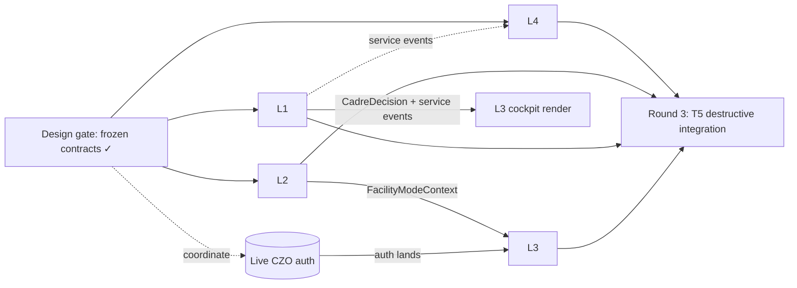

# Lean Implementation-Lane Plan (Round-2 Spawn Spec) — T1 · T3 · T4

> **Status:** DESIGN GATE output — **this plan is what round 2 spawns.** Branch
> `intake/provider-clinical-place-design`. Do not begin implementation from this gate; hand back.
> Lanes are carved by **service ownership so files are disjoint** (parallel-produce, serial-integrate), and
> deconflicted against live sessions + the Tshepo single-writer lock.
> Companions: [audit](../../audits/provider-clinical-place/cross-program-audit.md) ·
> [journey](../../journeys/core-transaction-patient-access-encounter-orchestration.md) ·
> [ownership split](facility-mode-ownership-split.md) · [read-models](shared-read-models.md) ·
> [policy list](tshepo-policy-contract-list.md).

## 1. Decomposition principle & lane count

The user chose **lean parallelism** — not 3 task-sessions, not 9 lanes. The minimal disjoint carve is
**4 implementation lanes + 1 non-lane policy track** (already owned by CZO/WS-OPA). Inpatient folds into the
clinical lane (the PCT↔inpatient admission handshake is the bug-risk seam — do not split a team across it).
The cross-cutting experience-bff is stateless: each lane edits **its own** BFF controllers (the BFF is
partitioned by controller, not shared state), so BFF work does not force a shared lane.

```
        ┌── L1 Clinical/Encounter (PCT + inpatient) ──────── net-new heavy
 design │   L2 Facility/Place/Org (TUSO + Indawo + WGV) ──── net-new heavy
 gate   │   L3 Provider Experience (Vashandi+Varapi+VITO+BFF+web) ── coordinates w/ CZO
 (this) │   L4 Access/Value/Compensation (COSTA+Coverage+MUSheX) ─ wiring
        └── (P) Policy track → WS-OPA `impilo.authz` / CZO lead (NOT a new lane)
```

## 2. The four lanes

### L1 — Clinical / Encounter spine  (PCT + inpatient-service)
**Owns (disjoint files):** `services/pct-service/**`, `services/inpatient-service/**`, the encounter cockpit
web under `ui/one-ui-shell/src/app/ehr/**` + `src/components/encounter/**`, provider-app clinical screens.
**Builds:**
- **PCT Cadre Engine** (C9) — `pct/core/CadreEngine.java` + decision API. *Highest leverage.*
- **Sorting Desk + visit-type** selection (D5) — `pct/core/SortingDeskService.java`.
- **Problems list** + **outpatient Care Plan** (parity with inpatient) in PCT.
- **Community work-context** backend + offline reconciliation (mobile outreach screens already exist, NotWired).
- **Telemedicine completeness** (journey §7): consent modal hook, attachment backend, structured response,
  routing pools, telemed→value trigger. (Consumes OROS for orders — **never edits oros-service**.)
- **Adaptive Encounter Cockpit** web rendered strictly from `CadreDecision.cockpitSpine` (no dead buttons).
- **PCT↔inpatient admission handshake** — reconcile the two `AdmissionEntity` owners (PCT requests/approves;
  inpatient-service assigns bed/ward). Define which is SoR for which field; wire the event.
**Consumes (frozen contracts):** C1 provider profile, C2 workforce context, C3 person, C6 core-transaction,
C7 referral package, C8 value-event (emits service events), Tshepo ext_authz (existing path).
**Migrations:** PCT **V015, V016, V017…**; inpatient **V013, V014…**. (⚠ must NOT use OROS V003 / MADI V006 — OROS live session.)
**Collisions:** OROS `task_6b859160` (consume only); Khuluma `task_7bda0e52` (consume comms). No file overlap.
**Policy needs (spec→track P):** `CADRE-ACTION`, `ORDER-CREATE`, `TRIAGE-RECORD`, `ADMIT/DISCHARGE`,
`CARE-PLAN-WRITE`, `REFER/CONSULT`, `HANDOVER`, `ENCOUNTER-ENTER`.

### L2 — Facility / Place / Org  (TUSO + Indawo + workforce-governance + facility-mode experience)
**Owns (disjoint files):** `services/tuso-service/**`, `services/indawo-service/**`,
`services/workforce-governance-service/**`, BFF `FacilityModeController` + facility/site/org controllers,
web `ui/one-ui-shell/src/app/facility/[facilityId]/**` + `src/app/indawo/**` + `src/components/facility-mode/**`,
provider-app facility-admin screens.
**Builds (per [ownership split](facility-mode-ownership-split.md) — T4 BUILDS):**
- **Facility Mode cockpit** + **setup wizard** (dept→service-point→queue→workflow→workforce→OROS-routing→
  Khuluma-channel→Fundo-readiness→go-live) + `FacilityModeContext` producer (C4).
- `FacilityUnitController` / `ServicePointController` (expose existing entities); facility admin UI;
  complete `ControlTowerController` real-time aggregation + scoped dashboards (reuse `AggregateVisibilityGuard`).
- Wire `FacilityNameResolver` → real TUSO lookup (replace seeded fixture).
- **Indawo surveillance/outbreak/field-teams** (net-new) + Indawo place-mode UI; inspection/enforcement UI.
- **Org membership REST** + **multi-regulator relationship** model (no hardcoded single regulator) + regulator-mode wiring.
**Consumes:** C2 (affiliations), C5 Fundo readiness (honest stub if Fundo not ready), Tshepo ext_authz.
**Migrations:** TUSO **V012, V013…**; Indawo **V007, V008…**; WGV **V004, V005…**.
**Collisions:** shares shell-state files (`identity-context.ts`, `useSessionExperienceContract`) with L3 —
**additive edits only, coordinate**; does not touch CZO auth or PolicyEngine.
**Policy needs (track P):** `FACILITY-MODE-ENTER`, `FACILITY-SETUP`, `ORG-ADMIN`, `FACILITY-REGISTER`,
`REGULATOR-MODE`, `INDAWO-MODE`, `INSPECTION`, `XTENANT-ISOLATION`, `XTENANT-AGGREGATE`.

### L3 — Provider Experience  (Vashandi + Varapi + VITO/tshepo-identity + experience-bff session + web shell)
**Owns (disjoint files):** `services/vashandi-workforce-service/**`, the Varapi resolution additions,
`services/tshepo-identity-service/**` resolution, BFF auth/session/identity controllers + `SessionExperienceService`,
web `ui/one-ui-shell/src/app/facility/page.tsx` (entry), `WorkspaceSwitcher`, `ContextRail`, provider shell
(`/provider/**`, `/professional/**`), bootstrap.
**Builds:**
- **Person-first login hardening**: `LOGIN-PROVIDERID-DENY`, anti-enumeration (timing in BFF + policy),
  silent identifier resolution (email/phone→Health ID via tshepo-identity).
- **Vashandi work-context query** (C2 `GET /v1/internal/vashandi/work-context`) + ad-hoc check-in.
- **WHERE/WHAT context picker** extended to dept/ward/service-point/virtual-pool/above-site × role/workspace.
- **Work/My-Professional/My-Life separation** enforcement (consume policy; render boundaries).
- **Facility Mode ENTER** trigger (flip `ShellMode`; route into L2's cockpit — does NOT build the cockpit).
- **Bootstrap chain**: national-admin→org→reps→bulk preload→self-claim.
**Consumes:** C1, C2, C3, C4 (`FacilityModeContext` from L2 — entry only), Tshepo ext_authz.
**Migrations:** Vashandi **V002, V003…**; Varapi **V016…**; tshepo-identity **V002…**; VITO **V030** (resolution).
**Collisions — the sensitive lane:** the login/identity/session contract surface **overlaps the live CZO auth
cluster** (`task_430f1240` + WS sessions) and the `PolicyEngine.java` lock. **L3 must sequence after / coordinate
with CZO**; it edits **session/identity composition + Vashandi/Varapi/VITO**, never `PolicyEngine.java`/
`ExtAuthzGrpcService.java`/`AuthorizeController.java`. Shares shell-state files with L2 (additive, coordinate).
**Policy needs (track P):** `LOGIN-*`, `IDRES-*`, `WORK-PRO-LIFE-ISOLATION`, `LIFE-SELF-ONLY`, `PRO-PROFILE-SELF`,
`WORK-REQUIRES-ASSIGNMENT`, `SELF-TREATMENT-BLOCK`, `CHECKIN-SCOPE`, `CONTEXT-SELECT`, `WORKSPACE-ENTER`.

### L4 — Access / Value / Compensation  (COSTA + Coverage + MUSheX)
**Owns (disjoint files):** `services/costing-engine-service/**`, `services/coverage-service/**`,
`services/mushex-service/**`, BFF finance/coverage controllers.
**Builds:**
- **Emergency reconciliation endpoint** (Law 1) — list emergency-overridden/deferred charges, link
  provisional→confirmed person, route to settle/claim/waiver. (COSTA; `EMERGENCY_DEFERRED_CHARGE` value-event.)
- **Waiver CRUD** (grant/approve/revoke) — distinct from rules-driven exemption.
- **Subsidy enrolment** (member↔subsidy↔balance) + cap enforcement at eligibility time.
- **telemed→value** wiring (teleconsult completed → charge) coordinated with L1.
- Value-event completeness on `core.transaction.events` (C8) — no leakage / no double-charge.
**Consumes:** C6 core-transaction, C8 (produces), service events from L1/inpatient.
**Migrations:** COSTA **V012, V013…**; Coverage **V010, V011…**; MUSheX **V009…**.
**Collisions:** none with live sessions (disjoint services). Payment rails stay honestly stubbed
(`liveCapable()=false`) unless a real rail is in scope — do not fake liveness.
**Policy needs (track P):** `EMERGENCY-CARE-NEVER-BLOCKED`, `BREAK-GLASS`, `STEP-UP` (verify existing).

### (P) Policy track — NOT a new lane
All `*` policy IDs from the [policy list](tshepo-policy-contract-list.md) route to **WS-OPA `impilo.authz`**
(author rego + `*_test.rego`, SHADOW first) or **queue for the CZO lead** (consent/delegation/break-glass/
self-treatment/emergency cross-cutting). **No lane edits `PolicyEngine.java`.** Lanes call the existing Tshepo
ext_authz path; the *rules* land via track P. OPA-down ⇒ Java DENY; Envoy fail-closed; never an off-switch.

## 3. Migration-version assignment (collision-free)

> **⚠ STALE — superseded 2026-07-19.** The ranges below predate the IATG waves and the estate work; actual
> heads have moved far past them (tuso V029, indawo V009, varapi V023, vashandi V007, tshepo-identity V003).
> Current authoritative reservations live in
> [provider-place-identity-program.md](provider-place-identity-program.md) § Migration reservations.
> Also note: tshepo-authz is no longer blanket "do not touch" — `policy_rule` **seed migrations**
> (V031–V035 landed; V036–V040 reserved) are the sanctioned channel; the single-writer lock still covers
> `PolicyEngine.java`/`ExtAuthzGrpcService.java`/`AuthorizeController.java`/rego authorship.

| Service | Owner lane | Assigned range | ⚠ Reserved by live session |
|---------|-----------|----------------|----------------------------|
| pct-service | L1 | V015+ | — |
| inpatient-service | L1 | V013+ | — |
| tuso-service | L2 | V012+ | — |
| indawo-service | L2 | V007+ | — |
| workforce-governance-service | L2 | V004+ | — |
| vashandi-workforce-service | L3 | V002+ | — |
| varapi-service | L3 | V016+ | — |
| tshepo-identity-service | L3 | V002+ | — |
| vito-service | L3 | V030+ | — |
| costing-engine-service | L4 | V012+ | — |
| coverage-service | L4 | V010+ | — |
| mushex-service | L4 | V009+ | — |
| oros-service | — | **do not touch** | OROS `task_6b859160` (V003+) |
| madi-service | — | **do not touch** | OROS session (V006+) |
| tshepo-authz-service | — | **do not touch** | CZO single-writer lock |
| experience-bff | all (per-controller) | **no new migrations — stateless, datasource dead** | — |

## 4. Dependency & merge order (parallel-produce, serial-integrate)



**Recommended order:**
1. **L4 + L2 in parallel first** — most independent (L4 wholly disjoint; L2 shares only additive shell-state).
2. **L1 next** — net-new heavy but consumes only frozen read-models; merges without blocking on others.
3. **L3 last among builders** — gated on (a) CZO auth landing/coordination and (b) L2's `FacilityModeContext`
   producer existing. It is the riskiest seam; integrate it after the surfaces it consumes are stable.
4. **Round 3 = T5 destructive integration** (merge accepted branches into canonical
   `claude/staging-ux-orchestration-remediation-Yypyl` in dependency order, gates per batch, delete only
   fully-absorbed branches). T5 is the integrator — never parallel with builders.

**Branch base:** every L-lane branches off canonical `claude/staging-ux-orchestration-remediation-Yypyl` at
current HEAD, own worktree, atomic commits, `git pull --rebase` often, push.

## 5. Per-lane production guardrails (every lane, every route)

Per the production architecture guardrails, each lane's work is **incomplete** unless every new production
route includes: **authz** (via Tshepo ext_authz + track-P rule), **audit**, **error handling**,
**observability**, and **tests**; backend is wired through BFF/contracts and surfaced in experience where
applicable; **no mocks/stubs in production paths**, **no dead buttons / fake completions**; ownership verified
against `docs/registry/services-registry.yaml` before introducing anything. Honest product truth: declare
fail-closed gaps (telemedicine media, payment rails) rather than fake them.

## 6. Round-2 spawn checklist (what to hand the lanes)

Each spawned lane session gets: (1) its row in §2 (owned files, builds, consumes, migrations, collisions,
policy needs), (2) the frozen [read-models](shared-read-models.md), (3) the relevant
[policy IDs](tshepo-policy-contract-list.md) to route to track P, (4) the [journey map](../../journeys/core-transaction-patient-access-encounter-orchestration.md)
for the clinical lanes, (5) the [ownership split](facility-mode-ownership-split.md) for L2/L3, (6) the merge
order in §4. **Hand back now — implementation begins in round 2.**
