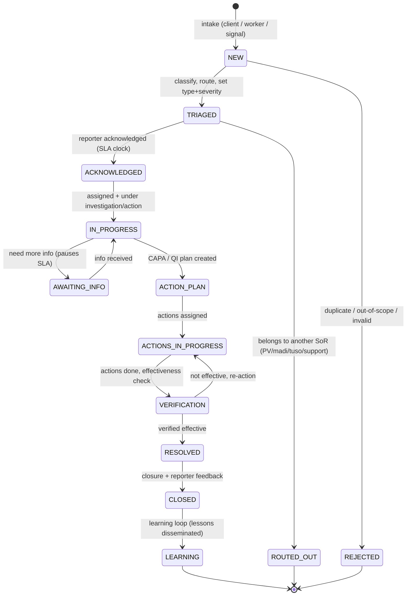
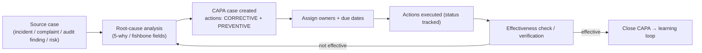
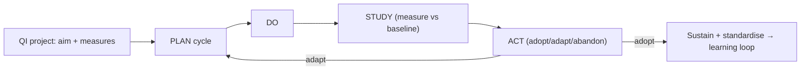
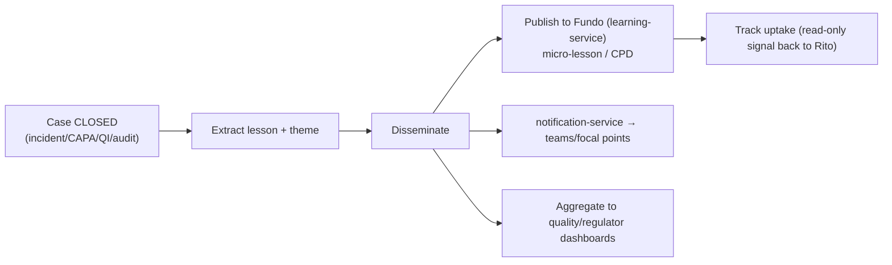
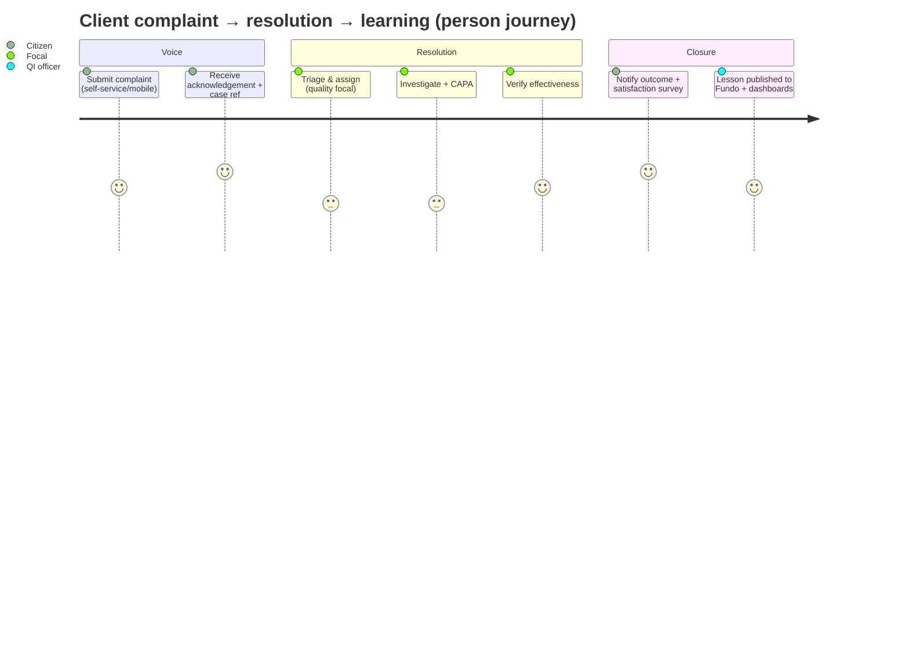
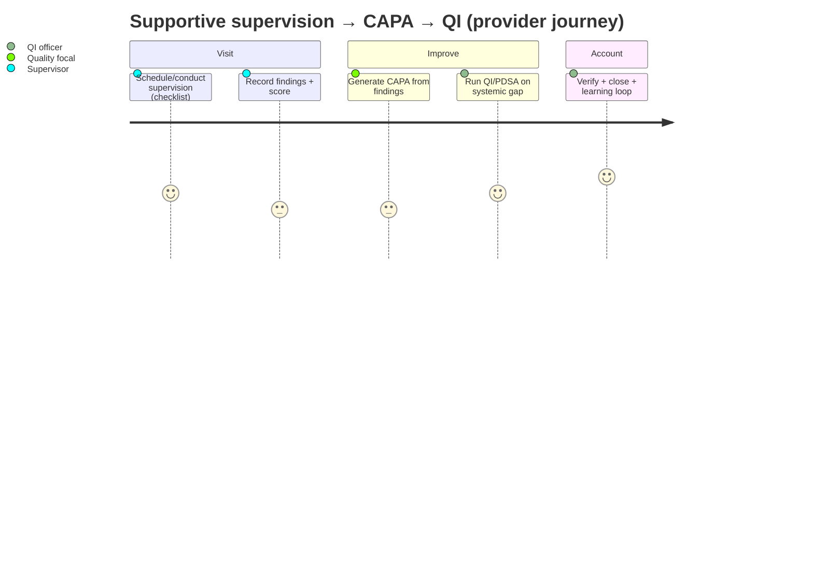

# rito-service — Domain Design (Quality, Safety & Client Voice)

> **Status:** DESIGN-FIRST (docs only). This is the spawn spec for Rito's later build round,
> pending the user supplying the truncated tail (see `../../audits/rito/TRUNCATION-GAPS.md`).
> All assumptions are flagged ⚠️ and listed in the truncation-gap note for confirmation.
> SoR boundary is FROZEN in `sor-boundary-rito-vs-patient-safety.md`.

Rito (= *voice / word / signal*) listens to clients, workers, supervisors, regulators and
system signals, and turns feedback, safety concerns, service-quality findings, audits,
assurance results and complaints into **accountable improvement**. It is a real operating
service with a case lifecycle, corrective actions, QI plans, learning loops — not a dashboard.

- **Plane:** experience-adjacent operating service; **primary plane = clinical/enterprise
  quality** (⚠️ confirm plane assignment in `services-registry.yaml`).
- **Proposed port:** **8390** (see audit §4; coordinate vs patient-safety).
- **Stack:** Java 21 / Spring Boot 3.3.6 / PostgreSQL 16 / Kafka (outbox), per platform standard.
- **Schema name:** `rito` (Flyway `V001__init.sql`, tables prefixed `rito_*`, outbox `rito_event_outbox`).

---

## 1. Domain model

### 1.1 Core aggregate — `Case`

A single polymorphic **Case** aggregate with a `caseType` discriminator keeps the lifecycle,
audit, assignment, SLA, and event machinery uniform while letting each type carry a typed detail
payload. This mirrors the proven surveillance `CaseEntity` and madi `HaemovigilanceCaseEntity`
shapes (reused as patterns, not tables).

**Case types** (`rito_case.case_type`):

| caseType | Description | Detail payload (typed) |
|---|---|---|
| `COMPLAINT` | Dissatisfaction about service/staff/access/dignity | category, severity, against (facility/dept/staff ref), desired outcome |
| `COMPLIMENT` | Positive feedback / recognition | recognised party ref, theme |
| `SUGGESTION` | Improvement idea | theme, area |
| `FEEDBACK` | General/structured feedback | source channel, rating snapshot |
| `GRIEVANCE` | Formal worker/community grievance | grievant ref, grievance class, escalation tier |
| `CLINICAL_QUALITY_INCIDENT` | General patient-safety/quality incident (NOT madi/PV) | harm level, incident category (fall, wrong-site, process, doc, diagnostic delay…), encounter ref, contributing factors |
| `NEAR_MISS` | No-harm event with learning value | as incident, harm level = NONE |
| `QUALITY_AUDIT` | Internal clinical/quality audit | standard ref, checklist (forms `form_key`), score, findings[] |
| `SUPERVISION_VISIT` | Supportive supervision of worker/facility | supervisee ref (vashandi), checklist, observations, dev plan |
| `ACCREDITATION_READINESS` | Self-assessment vs accreditation standard | standard set, maturity scores, gaps[] |
| `CAPA` | Corrective & preventive action plan | linked source case, root-cause (RCA), actions[], effectiveness check |
| `QI_PROJECT` | Quality improvement project (PDSA) | aim statement, measures[], PDSA cycles[] |
| `RISK` | Risk register entry | hazard, likelihood, consequence, rating, mitigation, owner, review date |
| `SATISFACTION_SURVEY` | Survey instance + responses | survey def ref (forms `form_key`), responses[], score (CSAT/NPS/Likert) |

> ⚠️ The truncated brief must confirm this case-type set and whether `M&M_REVIEW` is a distinct
> type (provisionally folded into `CLINICAL_QUALITY_INCIDENT` review). See truncation gaps.

### 1.2 Entities (logical; `rito_*` tables)

- **`rito_case`** — id, tenant_id, pod_id, case_type, title, status, severity/priority, harm_level,
  reporter (actor ref + anonymity flag), subject (client/patient CPID ref, nullable), facility_id,
  department_id, workspace_id, encounter_ref (nullable), assigned_to, due_at, opened_at, closed_at,
  source_channel, confidentiality, linked_case_refs (json), created/updated audit columns.
- **`rito_case_detail`** — case_id, typed JSONB payload per caseType (validated against a
  `forms-service` schema where applicable).
- **`rito_case_event`** — append-only case timeline (state transitions, comments, assignments,
  attachments-added, escalations) — the human-readable audit of the case.
- **`rito_action`** — CAPA/QI actions: case_id, action_type (CORRECTIVE/PREVENTIVE/IMPROVEMENT),
  description, owner, due_at, status, completed_at, verification (effectiveness check) fields.
- **`rito_pdsa_cycle`** — for QI_PROJECT: case_id, cycle_no, plan, do, study, act, measure_values.
- **`rito_survey_response`** — survey_case_id, respondent (anon-capable), answers JSONB, computed score.
- **`rito_audit_finding`** — for QUALITY_AUDIT/SUPERVISION/ACCREDITATION: case_id, standard_ref,
  checklist_item, result, score, evidence_ref, → may spawn a CAPA.
- **`rito_risk`** — risk register row (or modelled as `rito_case` + detail; ⚠️ confirm).
- **`rito_learning`** — learning-loop record: source_case_id, lesson, dissemination targets,
  published_to (Fundo refs), status.
- **`rito_event_outbox`** — canonical outbox (copy `ch_event_outbox` schema).
- **`rito_signal_inbox`** — idempotent log of consumed external signals (dedupe by source event id).

### 1.3 Identifiers (Impilo multi-class model)

- **Transaction IDs:** Case ID, Action ID, Survey-Response ID (action instances).
- **Record IDs:** Audit-Finding ID, Risk ID, Learning ID, PDSA-Cycle ID.
- **Context IDs:** Facility ID, Department ID, Workspace ID (where the case sits).
- **Actor IDs:** Reporter (Health ID / Staff ID / anon token), Assignee (Provider/Staff ID),
  Subject (CPID — never PII in case, reference only).
- **Event IDs:** Outbox event id, case-timeline event id.

---

## 2. Case lifecycle / state machine

A **unified base lifecycle** with type-specific entry/exit nuances. ⚠️ Exact states are an
assumption pending the truncated tail — this is the provisional canonical set.



- **`ROUTED_OUT`** is the boundary-enforcement state: when triage decides the case belongs to
  patient-safety / madi / tuso / support, Rito emits a routing event and closes its shell as
  `ROUTED_OUT` (it never holds the foreign case record — see SoR boundary).
- **SLA clock**: starts at `TRIAGED`/`ACKNOWLEDGED`, pauses in `AWAITING_INFO`, breach → escalation event.
- **Severity/harm escalation**: `CLINICAL_QUALITY_INCIDENT` with harm ≥ severe → mandatory
  escalation to facility quality focal + district (notification + dashboard flag).

### Type-specific shapes
- `SATISFACTION_SURVEY`: NEW → IN_PROGRESS (open for responses) → CLOSED (window closed) → LEARNING.
- `RISK`: NEW → TRIAGED (rated) → ACTION_PLAN (mitigation) → VERIFICATION (review date) → cycles;
  risks are *reviewed*, rarely "closed" — supports periodic re-review.
- `QUALITY_AUDIT`/`SUPERVISION`: NEW → IN_PROGRESS (conducting) → ACTION_PLAN (findings → CAPA) →
  RESOLVED → CLOSED → LEARNING.

---

## 3. Key flows

### 3.1 Corrective action (CAPA) flow



### 3.2 QI / PDSA flow



### 3.3 Learning loop (the accountability differentiator)



### 3.4 Signal ingestion (Rito as a listener)

Rito consumes events (copying surveillance's `@KafkaListener` consumer pattern) and may
auto-open cases or attach signals:

| Source service | Signal | Rito reaction |
|---|---|---|
| `pct-service` | encounter completed / adverse note flagged | candidate incident / experience prompt |
| `live-service`, `madi` (donor) | post-event/donor feedback rating low | open/append client-voice/satisfaction signal |
| `support-service` | ticket escalated with clinical-quality content | open COMPLAINT (linked ticket) |
| `tuso`/`indawo` | regulatory finding | open internal CAPA/QI (linked finding) |
| `vashandi` | supervision-due / competency flag | open SUPERVISION_VISIT |
| `varapi` | terminology/standard updates | refresh checklist/standard refs |
| `surveillance` | sentinel/threshold signal | open CLINICAL_QUALITY_INCIDENT candidate |
| `patient-safety`, `madi` haemovigilance | case opened | optional linked systemic CAPA (no copy) |

All consumed signals are deduped via `rito_signal_inbox`; auto-opened cases enter at `NEW`/`TRIAGED`.

---

## 4. Events / outbox

Outbox table `rito_event_outbox` (copy canonical schema); publisher extends
`CompanionOutboxPublisher`. Topic namespace **`impilo.rito.*`**.

| Event | Topic | When |
|---|---|---|
| `rito.case.created` | `impilo.rito.case` | case opened |
| `rito.case.triaged` / `.routed_out` | `impilo.rito.case` | triage outcome |
| `rito.case.status_changed` | `impilo.rito.case` | any transition |
| `rito.case.escalated` | `impilo.rito.case` | SLA breach / severe harm |
| `rito.capa.created` / `.action_completed` / `.verified` | `impilo.rito.capa` | CAPA lifecycle |
| `rito.qi.cycle_recorded` | `impilo.rito.qi` | PDSA cycle |
| `rito.survey.response_received` | `impilo.rito.survey` | response captured |
| `rito.audit.finding_recorded` | `impilo.rito.audit` | audit/supervision finding |
| `rito.learning.published` | `impilo.rito.learning` | learning loop disseminated |
| `rito.risk.reviewed` | `impilo.rito.risk` | risk register review |

Rito also emits domain audit events to `tshepo-audit-service` (security/non-repudiation) for
sensitive actions (case access, closure, regulator export).

---

## 5. BFF surface (experience-bff)

Add a dedicated `RitoBffController` (sibling to ~200 existing controllers) + `RitoServiceClient`;
register base URL in `ServiceClientConfig`/`ServiceEndpoints` (known gotcha — see lane plan).
All routes proxy with trust headers (`CompanionHeaders`).

```
POST   /internal/v1/rito/cases                 # create (any type) — graduated friction by type
GET    /internal/v1/rito/cases                 # list/filter (type,status,facility,assignee,severity)
GET    /internal/v1/rito/cases/{id}            # detail + timeline
POST   /internal/v1/rito/cases/{id}/triage     # classify/route (→ ROUTED_OUT emits routing event)
POST   /internal/v1/rito/cases/{id}/transition # status transition (guarded)
POST   /internal/v1/rito/cases/{id}/comment
POST   /internal/v1/rito/cases/{id}/assign
POST   /internal/v1/rito/cases/{id}/capa       # create CAPA from source case
POST   /internal/v1/rito/capa/{id}/actions     # add/track actions
POST   /internal/v1/rito/capa/{id}/verify
POST   /internal/v1/rito/qi/{id}/pdsa          # record PDSA cycle
POST   /internal/v1/rito/surveys               # define survey (refs forms form_key)
POST   /internal/v1/rito/surveys/{id}/responses
GET    /internal/v1/rito/surveys/{id}/results  # aggregation (CSAT/NPS/Likert)
GET    /internal/v1/rito/risks                 # risk register
POST   /internal/v1/rito/learning              # publish learning loop
GET    /internal/v1/rito/dashboards/{scope}    # facility/district/national rollups
POST   /internal/v1/rito/intake/client-voice   # public/low-friction client front door
```

**Graduated friction** (per CLAUDE.md): client-voice intake = MINIMAL; clinical-quality incident
reporting = MODERATE (auth + facility context); regulator export / closure of severe-harm case =
MAXIMUM (assurance level + purpose-of-use). Nompilo guidance surfaces on user-facing actions and
never overrides provider judgement (auditable).

---

## 6. UI surfaces

| Surface | Audience | Where | Key screens |
|---|---|---|---|
| **Client-voice intake** | citizens/patients | `ui/self-service` + `mobile/` + `one-ui-shell` public entry | submit complaint/compliment/suggestion/feedback; track my case; respond to survey; **anonymous option** |
| **Worker workspace** | frontline workers | `one-ui-shell` | report incident/near-miss; my reported cases; my assigned actions |
| **Supervisor / quality focal workspace** | facility quality focal, supervisors | `one-ui-shell` | triage queue; conduct supervision/audit (checklist); manage CAPA; QI projects; risk register |
| **QI officer workspace** | district/QI officers | `one-ui-shell` | QI portfolio (PDSA), aggregated CAPA, audit programme, learning library |
| **Regulator / oversight workspace** | district/national/regulator | `one-ui-shell` (+ export) | dashboards, trends, severe-harm escalations, accreditation-readiness rollups, governed export |

**Provider/citizen context separation** is enforced: citizen client-voice routes never expose
provider triage/quality data; provider workspaces gate by active role + facility + purpose-of-use.





---

## 7. Consumed services (composition, never duplication)

| Service | Rito use | Direction |
|---|---|---|
| **Khuluma / channels-service** | client-voice conversation front door; link `subject_ref` → case id (coordinate with comms-hub session `task_7bda0e52`) | consume |
| **Tshepo** (authz/PolicyEngine — LOCKED) | every route authz; audit emit; **Rito only SPECS policy** | consume (spec only) |
| **forms-service** | checklist/survey/audit **schema** definition + validation (Rito owns packs + responses) | consume |
| **campaigns-service** | survey/feedback solicitation campaigns (`campaign_type=RITO_*`) | consume |
| **notification-service** | case/CAPA/survey/escalation notifications | consume |
| **surveillance-service** | sentinel/threshold signals (read); does not own Rito cases | consume |
| **pct / clinical encounter read-model** | encounter ref for incident/experience context (bind to Design-Gate `task_52b8c583`) | consume |
| **vashandi** | worker/roster/supervisee identity for supervision | consume |
| **varapi** | terminology/standards refs for checklists | consume |
| **tuso / indawo** | regulatory findings as signals (linked, not owned) | consume |
| **Fundo / learning-service** | publish learning-loop lessons; track uptake | publish/consume |
| **document-service** | case attachments | consume |
| **patient-safety / madi** | linked PV/haemovigilance case references | consume (links only) |

---

## 8. Non-negotiables baked into this design

- SoR-first: no duplication of madi/patient-safety/tuso/indawo/support records (see boundary).
- No mock-only screens, dead buttons, or fake completions in the build; every action has a real
  state transition + event + audit + permission meaning.
- Honest Product Truth: surfaces show real state (e.g., "routed to patient-safety", "learning
  pending dissemination") — never fabricated "resolved/submitted".
- Provider/citizen context separation; anonymity supported for client voice.
- Offline/federated and failure-path behaviour to be specified at build (flagged in truncation note).
- Nompilo guidance + accessibility + feedback capture on user-facing surfaces.
