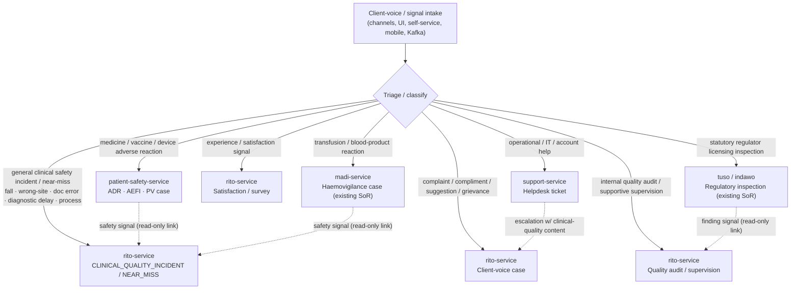

# FROZEN SoR Boundary — Rito vs patient-safety-service (and madi, tuso/indawo, support)

> **Status: FROZEN.** This is the non-negotiable system-of-record boundary for the two new
> safety services built in parallel — `rito-service` (`intake/rito-design` → later build) and
> `patient-safety-service` (`intake/patient-safety-pv`, `task_a98418a6`). It also resolves the
> pre-existing overlaps with `madi` (haemovigilance), `tuso`/`indawo` (regulatory inspection),
> and `support-service` (helpdesk). Derived from memory `rito-patientsafety-coordination`.
> Any change requires re-freezing here and notifying both sessions.

## 1. One sentence each

- **`patient-safety-service`** owns **regulated pharmacovigilance**: medicine/vaccine/device
  adverse reactions — **ADR, AEFI, serious-AEFI investigation**, seriousness/causality/outcomes,
  MCAZ review workbench, **VigiFlow** ID + manual-entry tracking, **E2B(R3)-aligned** export
  readiness, follow-up.
- **`rito-service`** owns **general quality & client voice**: complaints/compliments/
  suggestions/feedback, **general clinical-quality incidents & near-misses** (those NOT owned
  by a specialised vigilance SoR), **internal quality audit / supportive supervision /
  accreditation-readiness self-assessment**, **CAPA & QI/PDSA**, **risk register**, **grievance**,
  **experience/satisfaction surveys**, case lifecycle → closure → **learning loops**.

## 2. The routing rule (front door → owner)

A shared **client-voice front door** (via `channels-service`/intake UI) may *receive* any signal,
but it **routes to exactly one owning case record**. No case is duplicated across services.

### Decisive routing predicates

| Signal | Owner | Rationale |
|---|---|---|
| Suspected reaction to a **drug/medicine** | patient-safety | ADR = regulated PV |
| Adverse event **following immunization** | patient-safety | AEFI = regulated PV |
| **Medical-device** malfunction causing harm | patient-safety | device vigilance = regulated PV |
| **Transfusion / blood-product** reaction | **madi** (existing) | haemovigilance SoR already live |
| Patient **fall**, **wrong-site/procedure**, **medication administration process error** (not a drug *reaction*), **documentation/diagnostic delay**, **near-miss** | **rito** | general clinical-quality/safety incident |
| **Complaint / compliment / suggestion / grievance** about service, staff, access, dignity, waiting | **rito** | client voice |
| **Satisfaction / experience** rating, CSAT/NPS, survey response | **rito** | experience |
| Internal **quality audit**, **supportive supervision** visit, **accreditation-readiness** self-assessment, **CAPA**, **QI/PDSA**, **risk register** | **rito** | quality improvement |
| **Statutory regulator** licensing inspection + enforcement of a facility/site | **tuso/indawo** (existing) | regulatory SoR |
| **IT/operational/account** support request | **support-service** (existing) | helpdesk |

### The grey-zone rule (medication)
- A **reaction** to a drug (patient had an adverse *reaction*) → **patient-safety (ADR)**.
- A **process/administration error** with a drug (wrong dose given, wrong patient, near-miss with
  no reaction) → **rito (clinical-quality incident / near-miss)**.
- If a process error *also* caused a reaction → create the **patient-safety ADR case** as owner,
  and rito may hold a *linked* CAPA/QI case for the systemic process fix. **The ADR record is not
  copied into rito**; rito references the patient-safety case id.

## 3. What is shared vs owned

| Concern | Shared (both use) | Owned distinctly |
|---|---|---|
| Front door / intake conversation | `channels-service` session (one per contact) | Each service creates **its own** case from the session; `subject_ref` points to the owning case |
| Form packs | `forms-service` (each seeds its **own** `form_key`s in **separate** files) | PV forms (PVF01/AEFI) = patient-safety packs; complaint/audit/survey/checklist = rito packs |
| Solicitation | `campaigns-service` | PV solicitation campaigns vs rito survey campaigns (distinct `campaign_type`) |
| Send engine | `notification-service` | distinct template keys |
| Signal bus | Kafka | distinct topic namespaces: `impilo.patientsafety.*` vs `impilo.rito.*` |
| Case record | **never shared** | Each owns its own table/aggregate; cross-links are **id references only** |
| Document attachments | `document-service` | distinct owning references |

## 4. Cross-links (read-only references, never copies)

- patient-safety ADR/AEFI case → may publish `impilo.patientsafety.case.opened`; rito **may**
  open a *linked* CAPA/QI case for a systemic fix, storing `linkedPatientSafetyCaseId`. Rito does
  **not** store the reaction/causality data.
- madi haemovigilance case → same pattern; rito may hold a linked systemic CAPA referencing
  `linkedHaemovigilanceCaseId`.
- tuso/indawo regulatory finding → rito may open an internal CAPA/QI referencing
  `linkedRegulatoryFindingId`. Rito does **not** replicate the enforcement case.
- support ticket → if a helpdesk ticket carries a clinical-quality complaint, support escalates by
  emitting an event; rito opens a client-voice case referencing `linkedSupportTicketId`.

## 5. Hard non-duplication assertions (both teams enforce)

1. There is exactly **one** owner per case; the front door routes, it does not fork records.
2. Neither service writes the other's tables, controllers, consumers, or form packs.
3. Cross-service relationships are **id references** + events, never embedded copies of the
   other's domain data.
4. Topic namespaces, `form_key` prefixes, `campaign_type` values, and notification template keys
   are **prefixed by owning service** (`rito.*` / `patientsafety.*`) to prevent collision.
5. `madi` haemovigilance and `tuso`/`indawo` regulatory inspection remain the **pre-existing
   SoRs**; neither new service migrates or re-homes their data.

## 6. Open boundary question for user confirmation (see TRUNCATION-GAPS)

- **Mortality/Morbidity (M&M) review**: surveillance owns death *counters*. Does the *structured
  M&M review + RCA workflow* belong to **rito** (as a clinical-quality review case type) or stay
  out of scope? Provisional assumption: **rito owns M&M review case type**; confirm.
- **Serious patient-harm overlap**: a sentinel event that is *also* a drug reaction — provisional
  rule above (patient-safety owns the reaction case; rito holds linked systemic CAPA). Confirm.
