# Core Transaction — Patient Access, Flow & Encounter Orchestration (Canonical Journey Map)

> **Status:** DESIGN GATE output (T3). Authored on branch `intake/provider-clinical-place-design`.
> This is the canonical T3 journey map mandated by the T3 Addendum to be produced **before** any build.
> It is grounded in the **real repo** (see [`../audits/provider-clinical-place/cross-program-audit.md`](../audits/provider-clinical-place/cross-program-audit.md)).
> Implementation lanes are carved in [`../design/provider-clinical-place/implementation-lane-plan.md`](../design/provider-clinical-place/implementation-lane-plan.md).

## 0. Doctrine anchor & non-negotiables

Impilo is a **Health Operating System**. The Core Transaction is the clinical/operational spine that runs
across **three simultaneous lanes** that must stay coherent at every step:

| Lane | Question it answers | Owning systems-of-record |
|------|---------------------|--------------------------|
| **A — Provider / Facility** | *Who is doing the work, where, under what authority?* | Varapi (provider), Vashandi (workforce), TUSO (facility), Indawo (place), PCT (encounter) |
| **B — Patient / Client** | *Who is the person, what do they need, what is happening to them?* | VITO (person), PCT (journey/encounter), OROS (orders), inpatient-service (bed/ward), BUTANO (SHR) |
| **C — Access / Value / Compensation** | *Is access permitted, who pays, what value event results?* | Coverage (eligibility), COSTA (charge/bill), MUSheX (claim/payment), Tshepo (authz/consent) |

**Five laws this map enforces (hard constraints):**

1. **Emergency care is NEVER blocked by identity or payment gaps.** Every gate has an `EMERGENCY_OVERRIDE`
   path with deferred reconciliation. Grounded: `costa/domain/enums/ServiceAccessStatus.java` already
   defines `EMERGENCY_OVERRIDE`, `BLOCKED_PENDING_PAYMENT`, `DEFERRED_PAYMENT_ALLOWED`.
2. **Provider/citizen context separation is absolute.** Work permissions never leak into a provider's own
   citizen record access, and citizen identity never authorises clinical work. (See policy spec
   `WORK-PRO-LIFE-*` in [`../design/provider-clinical-place/tshepo-policy-contract-list.md`](../design/provider-clinical-place/tshepo-policy-contract-list.md).)
3. **No source-of-record duplication.** PCT owns the encounter; OROS owns orders; COSTA/MUSheX/Coverage own
   value. This map composes them; it never re-implements them.
4. **Patient-facing messages are plain-language + multilingual-ready** (en/sn/nd already wired in
   `one-ui-shell/src/lib/i18n/locales`). See §8.
5. **Every meaningful action has state-transition + event + permission + audit meaning.** Orphan actions are
   rejected.

## 1. The Core Transaction object (the spine's state carrier)

The Core Transaction is a **composition object** the experience-bff assembles from sovereign services — it is
NOT a new system-of-record. Its canonical shape is frozen in
[`../design/provider-clinical-place/shared-read-models.md`](../design/provider-clinical-place/shared-read-models.md) (§ Core-Transaction state object).

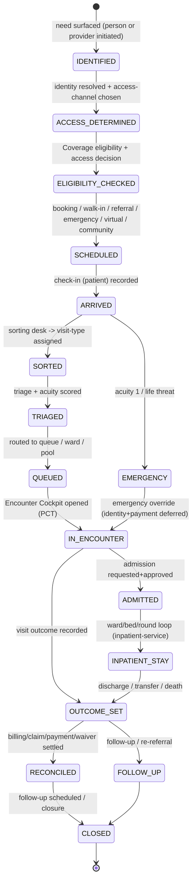

The Core Transaction state is **derived**, not authoritative: each substate is owned by a sovereign service
(`JourneyEntity` states in PCT drive ARRIVED→TRIAGED→QUEUED→SEEN→ADMITTED/DISCHARGED; COSTA
`ServiceAccessDecisionEntity` drives the access gate; Coverage drives eligibility). The composition layer
maps them onto this single carrier so every surface speaks one vocabulary.

## 2. End-to-end master journey (all contexts collapsed)

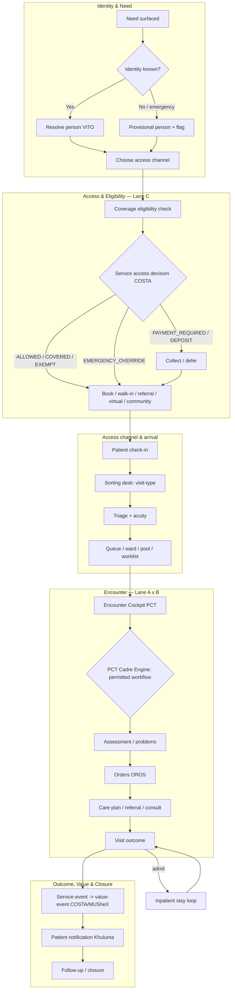

**Grounding note (honest product truth):** the **PCT Cadre Engine** (`CADRE` node) does **NOT exist today** —
PCT's `RoutingEngine` only does explicit-queue + acuity→priority routing. Sorting Desk and Visit-Type
selection are also absent. These are the headline T3 builds; everything else (journey state machine, triage,
queue, encounter, discharge, referral, telemedicine orchestration) is Live or Partial. See the audit for the
per-node Live/Partial/Missing verdict.

## 3. The PCT Cadre Engine (the heart of T3 — to be built)

The Cadre Engine is **real workflow enforcement**, distinct from Tshepo authorization. Tshepo answers
"*may this actor perform this action?*" (RBAC/ABAC). The Cadre Engine answers "*given role + cadre + scope +
visit-type + acuity + work-context + access-state, what workflow is this person permitted to drive right
now, and which Encounter Cockpit tabs/actions light up?*" It is the adaptive-spine resolver.

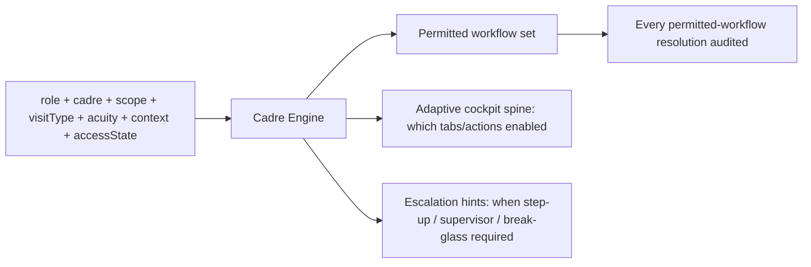

**Inputs (all already resolvable from existing read-models):**
- `role` + `cadre` ← Varapi provider profile (`cadre`, `profession`).
- `scope` ← Vashandi active assignment (facility/dept/unit/role-template) + check-in state.
- `visitType` ← Sorting Desk output (to build).
- `acuity` ← PCT `TriageRecordEntity` (1–5, Live).
- `context` ← one of the six work contexts (§5).
- `accessState` ← COSTA `ServiceAccessDecisionEntity` + Tshepo decision.

**Output contract** is frozen in shared-read-models (§ Cadre Engine decision). The Cadre Engine consumes
Tshepo decisions but **does not author policy** — when an action needs an authz check it calls the existing
Tshepo ext_authz path; the new policy *rules* are specified (not authored) in the Tshepo policy contract list.

**SoR placement:** the Cadre Engine is encounter-workflow logic → it belongs in **PCT** (encounter SoR), not
in the BFF and not in Tshepo. New PCT migrations start at **V015**.

## 4. Three-lane swimlane (canonical OPD instance)

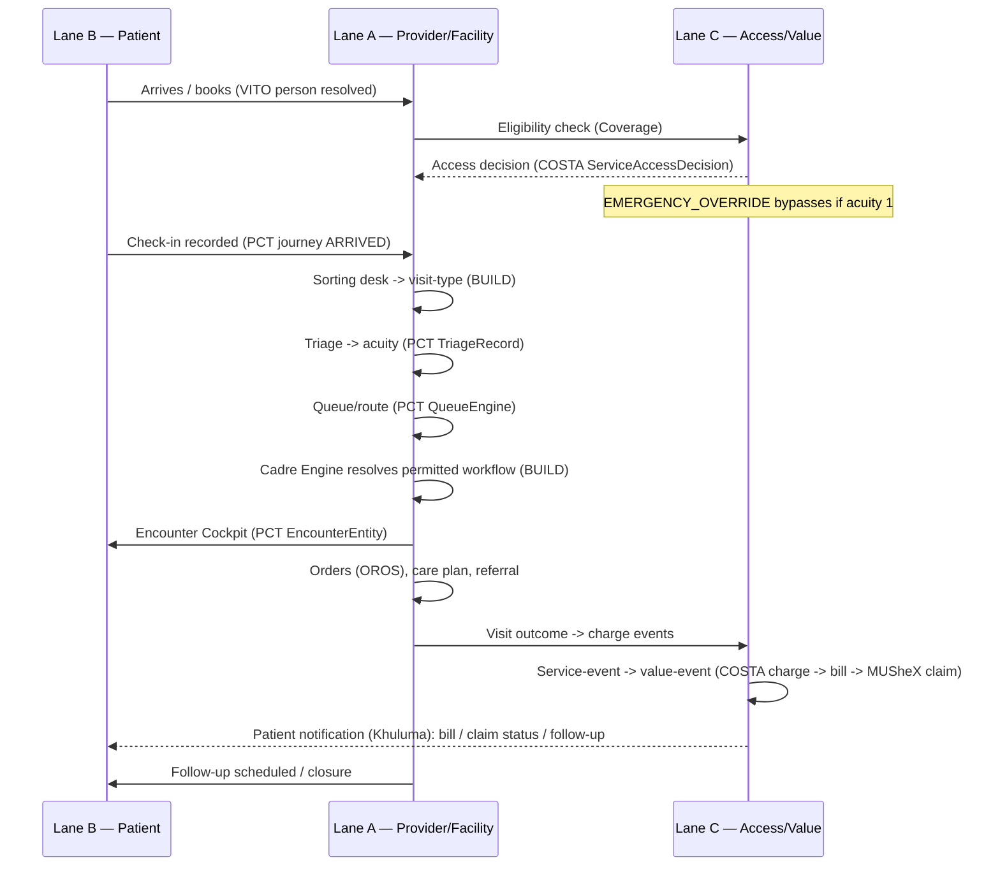

## 5. Per-context journey maps (six work contexts)

The six work contexts share the spine but differ in entry, sorting, queue target, cockpit spine, and outcome.
**Context modelling status today:** Inpatient (Live), Casualty/ED (Live, `EdVisitEntity` + protocol catalog),
Virtual (Live, telemedicine), Procedure (Partial, inpatient-only `ProcedureEpisode`), Outpatient (Partial,
generic encounter), Community (**Missing**).

### 5.1 Outpatient (OPD)
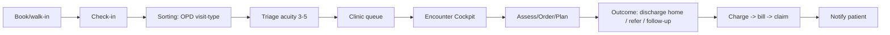
- **Cockpit spine:** Overview · Assessment · Problems · Orders&Results · Care · Consults&Referrals · Notes · Visit-Outcome.
- **Gap:** outpatient has no Care Plan CRUD (inpatient-only today) and no Problems List entity — both T3 builds in PCT.

### 5.2 Inpatient
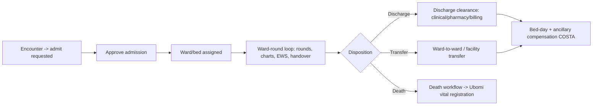
- **Mostly Live:** `inpatient-service` has Admission/Ward/Bed/WardRound/Transfer/DischargeClearance/CarePlan/
  EarlyWarningScore/ShiftHandover/ProcedureEpisode (V012 head). COSTA `InpatientCostingService` posts bed-day,
  food, laundry, oxygen, theatre-time (Live).
- **Build:** wire admission approval → bed assignment handshake between PCT `AdmissionWorkflow` and
  inpatient-service (two admission entities exist — one in each; reconcile ownership, see lane plan).

### 5.3 Casualty / Emergency (ED)
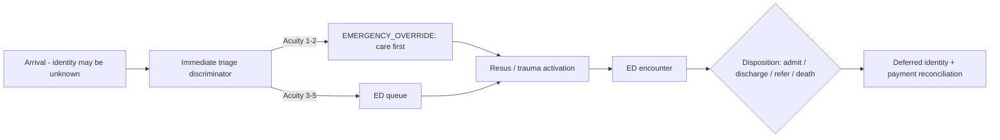
- **Law 1 enforced here:** identity provisional, payment deferred, care proceeds. `EdVisitEntity`,
  `EdProtocolCatalog`, `EdTriageDiscriminatorEngine` are Live.

### 5.4 Procedure (day-surgery / theatre)
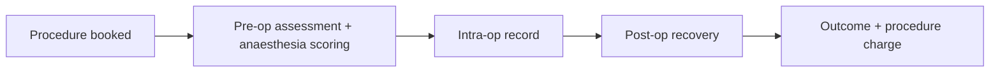
- **Partial:** `ProcedureEpisodeDocumentEntity` + anaesthesia scoring exist in inpatient-service only.
  **Build:** outpatient/day-surgery procedure context (no admission) — new visit-type, reuse procedure episode.

### 5.5 Community (outreach / household)
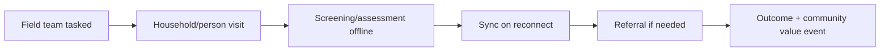
- **Missing backend context** (no community visit/outreach entity in PCT). Mobile provider-app HAS outreach
  screens (household list, screening, follow-up, outreach dashboard) — **NotWired** to a backend context.
  **Build:** community work-context in PCT + offline reconciliation.

### 5.6 Virtual / Telemedicine
See §7 (the 7-stage closed loop). Telemedicine is governed exactly like in-person care (same access gate,
same outcome→value mapping, same audit).

## 6. Decision-point register

Each decision point has: owning service, inputs, outputs, failure path, emergency behaviour, audit. This is
the authoritative list the build wires; "Status" is today's reality.

| # | Decision point | Owner (SoR) | Inputs | Outputs | Emergency behaviour | Status |
|---|----------------|-------------|--------|---------|---------------------|--------|
| D1 | Identity resolved? | VITO via Tshepo-identity | Health ID / phone / email / provisional | person ref or provisional ref | provisional person, care proceeds | Partial (no silent email→HealthID) |
| D2 | Access channel | Composition (BFF) | need, urgency, modality | booking / walk-in / referral / emergency / virtual / community | force emergency channel | Partial |
| D3 | Eligibility | Coverage | person, scheme, service | eligible / not / unknown | skip, defer | Live |
| D4 | Service access gate | COSTA `ServiceAccessDecision` | eligibility, tariff, exemption | ALLOWED/PAYMENT_REQUIRED/DEPOSIT/COVERED/EXEMPT/WAIVER/BLOCKED/**EMERGENCY_OVERRIDE** | EMERGENCY_OVERRIDE + deferred reconcile | Live (gate); reconcile endpoint **Missing** |
| D5 | Sorting desk visit-type | PCT (BUILD) | arrival reason, context | visit-type | default to emergency assessment | **Missing** |
| D6 | Triage acuity | PCT `TriageService` | vitals, complaint | acuity 1–5 | acuity 1 → bypass queue | Live |
| D7 | Routing target | PCT `RoutingEngine` | acuity, queue, context | queue / ward / pool / worklist | direct to resus | Live (no cadre/pool routing) |
| D8 | Permitted workflow | PCT Cadre Engine (BUILD) | role,cadre,scope,visitType,acuity,context,accessState | workflow set + cockpit spine + escalation | break-glass widens, audited | **Missing** |
| D9 | Order placement | OROS | order type, facility capability | INTERNAL/ADAPTER/HYBRID route | stat order priority | Live |
| D10 | Admission | PCT `AdmissionWorkflow` + inpatient-service | bed availability, clinical need | admitted / waitlist | emergency bed | Live (handshake to wire) |
| D11 | Discharge clearance | PCT `DischargeWorkflow` | clinical/pharmacy/billing/payment blockers | discharged / blocked | clinical override of billing block | Live |
| D12 | Visit outcome | PCT | disposition | outcome event | recorded regardless | Live |
| D13 | Value event | COSTA→MUSheX | outcome, charges | charge→bill→claim→payment | EMERGENCY_OVERRIDE charges flagged for later reconcile | Live; subsidy/waiver CRUD + reconcile **Missing** |
| D14 | Step-up / break-glass | Tshepo (spec only) | sensitivity, access mode | challenge / grant | break-glass grant, audited | Live (StepUp); rules specced not authored |

## 7. Telemedicine — 7-stage closed loop

Telemedicine is a first-class work-context, governed like in-person care, across modalities
**async / chat / audio / video / scheduled / MDT**. The orchestration already exists in PCT
(`TelemedicineOrchestrationService`, `TelemedicineController`) with 4 pluggable session providers
(managed video, async no-video, manual phone, external). **Real-time transport (WebRTC/WebSocket) is
intentionally absent** and fails closed (`501 BACKEND_CAPABILITY_MISSING`) — honest product truth.

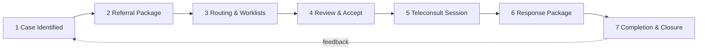

| Stage | What happens | Backend | Build gap |
|-------|--------------|---------|-----------|
| 1 Case Identified | provider flags case for teleconsult | implicit (encounter context) | auto-encounter creation |
| 2 Referral Package | build package: summary, attachments, consent | `createReferral()` + `ReferralPackageBuilder.tsx` | consent modal, attachment backend, auto-summary panels |
| 3 Routing & Worklists | route to provider/pool/on-call | `RoutingEngine` + worklist | team/pool/on-call routing, capacity checks, real-time updates |
| 4 Review & Accept | receiving provider accepts/reassigns | `acceptReferral()` | reassign workflow, full-page review |
| 5 Teleconsult Session | conduct session (modality-specific) | `TelehealthSessionEntity` + 4 providers | **real-time media (WebRTC/WS) absent by design** |
| 6 Response Package | structured clinical response + orders | `submitResponse()` | structured form, orders/attachment linkage |
| 7 Completion & Closure | outcome, follow-up, archival | `completeReferral()` | outcome archival to timeline, follow-up verification |

**Governance parity:** stages 2–7 each pass the same access gate (D4), Cadre Engine (D8), and outcome→value
mapping (D13) as in-person care. The referral/consult package shape is frozen in shared-read-models.

## 8. Patient-facing message catalog (plain-language, multilingual-ready)

Messages are sent via Khuluma (comms SoR — **consume, never rebuild**, live session `task_7bda0e52`) and
rendered through the existing notification system (typed INFO/WARNING/SUCCESS/MESSAGE) with i18n keys in
`one-ui-shell/src/lib/i18n/locales/{en,sn,nd}.json`. Every message below is a **key**, not hardcoded text.

| Key | Trigger (state) | Plain-language English (en) | Tone |
|-----|-----------------|------------------------------|------|
| `ct.msg.booking_confirmed` | SCHEDULED | "Your visit is booked for {date} at {facility}." | neutral |
| `ct.msg.checkin_ok` | ARRIVED | "You're checked in. Please take a seat — we'll call you." | reassuring |
| `ct.msg.queue_position` | QUEUED | "You are number {n} in the queue. Estimated wait {mins} minutes." | neutral |
| `ct.msg.triage_priority` | TRIAGED (high acuity) | "You will be seen as a priority. A nurse is coming to you." | reassuring |
| `ct.msg.order_placed` | order placed | "Your {testName} has been requested. We'll let you know when results are ready." | neutral |
| `ct.msg.results_ready` | result available | "Your results are ready. Your care team will discuss them with you." | neutral |
| `ct.msg.referral_sent` | referral created | "You have been referred to {service}. They will contact you about next steps." | neutral |
| `ct.msg.admitted` | ADMITTED | "You have been admitted to {ward}. Your care team will keep you informed." | reassuring |
| `ct.msg.discharge_ready` | discharge cleared | "You are ready to go home. Please collect your discharge summary and medicines." | positive |
| `ct.msg.followup_due` | follow-up | "Please come back on {date} for your follow-up. Reply HELP if you can't make it." | neutral |
| `ct.msg.bill_issued` | value event | "A bill of {amount} has been issued for your visit. See payment options in the app." | neutral |
| `ct.msg.payment_received` | payment | "We've received your payment of {amount}. Thank you." | positive |
| `ct.msg.waiver_applied` | waiver/exemption | "Your visit costs have been covered. There is nothing to pay." | positive |
| `ct.msg.emergency_reassurance` | EMERGENCY_OVERRIDE | "You are being treated now. We'll sort out registration and payment afterwards." | reassuring |
| `ct.msg.teleconsult_scheduled` | telemed S3/4 | "Your virtual consultation is set for {date}. We'll send a join link." | neutral |
| `ct.msg.teleconsult_response` | telemed S6 | "Your virtual consultation is complete. Here's what your clinician advised." | neutral |

**Rules:** no clinical jargon; never deliver a diagnosis by automated message; always offer a human/opt-out
path; respect consent + communication preferences (existing `CommunicationPreferences`); all keys must exist
in all three locale files before the build ships them.

## 9. Service-event → value-event mapping

Every clinical/operational event that should generate value passes through the **outbox** of its owning
service onto `core.transaction.events` (COSTA and MUSheX already dual-emit). This table is the canonical map
the build wires; it prevents value leakage (service happened, nobody billed) and double-charging.

| Service event (source) | Owner | Value event (target) | Target owner | Status |
|------------------------|-------|----------------------|--------------|--------|
| Encounter completed (OPD) | PCT | charge → bill line | COSTA | Live (charge ingest) |
| Bed-day accrued | inpatient-service | BEDDAY bill line | COSTA `InpatientCostingService` | Live |
| Ancillary (food/laundry/oxygen/theatre) | inpatient-service | bill line | COSTA | Live |
| Order priced (lab/imaging/procedure) | OROS / msika-flow | CHARGE_CREATED | COSTA `ingestMsikaFlowOrderPriced` | Live |
| Blood unit issued/transfused | MADI | charge | COSTA | Partial |
| Bill finalized | COSTA | claim pack (if insured) | MUSheX | Live |
| Claim adjudicated | MUSheX | settlement / remittance | MUSheX | Live |
| Payment captured | MUSheX | receipt + ledger entry | MUSheX | Live (rails stubbed) |
| Teleconsult completed | PCT | charge | COSTA | **Build** (telemed→value not wired) |
| Emergency override invoked | COSTA | flagged deferred charge | COSTA reconcile | **Build** (reconcile endpoint Missing) |

## 10. Emergency override & deferred reconciliation (Law 1, expanded)

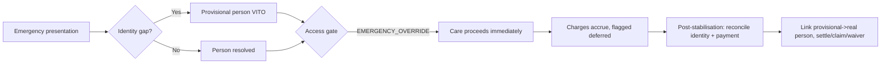

- The gate (`ServiceAccessDecisionEntity`) already supports `EMERGENCY_OVERRIDE` with `decided_by`,
  `decision_reason`, `audit_reference`. **Missing:** the reconciliation endpoint that, post-care, lists
  emergency-overridden charges, links the provisional→confirmed person, and routes to settle/claim/waiver.
  This is a Lane-C build (COSTA, V012).
- Identity reconciliation links the provisional VITO person to the confirmed record without losing the audit
  chain (VITO is SoR; the link is recorded, not overwritten).

## 11. What this map asks the build to create (T3 net-new, ranked)

1. **PCT Cadre Engine** (D8) — role+cadre+scope+visitType+acuity+context+accessState ⇒ permitted workflow +
   adaptive cockpit spine. *Highest leverage; nothing today.* (PCT, V015+)
2. **Sorting Desk + Visit-Type selection** (D5) — explicit pre-queue step. (PCT, V016+)
3. **Outpatient Care Plan + Problems List** in PCT (parity with inpatient). (PCT)
4. **Community work-context** backend + offline reconciliation (mobile screens already exist, NotWired). (PCT)
5. **Emergency reconciliation endpoint** + deferred-charge review. (COSTA, V012)
6. **Telemedicine completeness:** consent modal, attachment backend, structured response, telemed→value
   wiring, routing pools. (PCT + OROS coordination — OROS is a live session; consume, don't rebuild.)
7. **Subsidy enrolment + Waiver CRUD** for Lane C (Coverage V010 / COSTA V012).
8. **Adaptive encounter cockpit spine** in one-ui-shell driven by the Cadre Engine output.

Everything else on the spine is Live or Partial and needs **wiring/completion, not creation**. The disjoint
service ownership for each of these builds is carved in the implementation-lane plan.
