# Core Transaction — Patient Access, Flow & Encounter Orchestration (Canonical Journey Map)

> **Status:** DESIGN GATE output (T3). Authored on branch `intake/provider-clinical-place-design`.
> This is the canonical T3 journey map mandated by the T3 Addendum to be produced **before** any build.
> It is grounded in the **real repo** (see [`../audits/provider-clinical-place/cross-program-audit.md`](../audits/provider-clinical-place/cross-program-audit.md)).
> Implementation lanes are carved in [`../design/provider-clinical-place/implementation-lane-plan.md`](../design/provider-clinical-place/implementation-lane-plan.md).

## 0. Doctrine anchor & non-negotiables

Impilo is a **Health Operating System**. The Core Transaction is the clinical/operational spine that runs
across **three simultaneous lanes** that must stay coherent at every step:

| Lane | Question it answers | Owning systems-of-record |
|------|---------------------|--------------------------|
| **A — Provider / Facility** | *Who is doing the work, where, under what authority?* | Varapi (provider), Vashandi (workforce), TUSO (facility), Indawo (place), PCT (encounter) |
| **B — Patient / Client** | *Who is the person, what do they need, what is happening to them?* | VITO (person), PCT (journey/encounter), OROS (orders), inpatient-service (bed/ward), BUTANO (SHR) |
| **C — Access / Value / Compensation** | *Is access permitted, who pays, what value event results?* | Coverage (eligibility), COSTA (charge/bill), MUSheX (claim/payment), Tshepo (authz/consent) |

**Five laws this map enforces (hard constraints):**

1. **Emergency care is NEVER blocked by identity or payment gaps.** Every gate has an `EMERGENCY_OVERRIDE`
   path with deferred reconciliation. Grounded: `costa/domain/enums/ServiceAccessStatus.java` already
   defines `EMERGENCY_OVERRIDE`, `BLOCKED_PENDING_PAYMENT`, `DEFERRED_PAYMENT_ALLOWED`.
2. **Provider/citizen context separation is absolute.** Work permissions never leak into a provider's own
   citizen record access, and citizen identity never authorises clinical work. (See policy spec
   `WORK-PRO-LIFE-*` in [`../design/provider-clinical-place/tshepo-policy-contract-list.md`](../design/provider-clinical-place/tshepo-policy-contract-list.md).)
3. **No source-of-record duplication.** PCT owns the encounter; OROS owns orders; COSTA/MUSheX/Coverage own
   value. This map composes them; it never re-implements them.
4. **Patient-facing messages are plain-language + multilingual-ready** (en/sn/nd already wired in
   `one-ui-shell/src/lib/i18n/locales`). See §8.
5. **Every meaningful action has state-transition + event + permission + audit meaning.** Orphan actions are
   rejected.

## 1. The Core Transaction object (the spine's state carrier)

The Core Transaction is a **composition object** the experience-bff assembles from sovereign services — it is
NOT a new system-of-record. Its canonical shape is frozen in
[`../design/provider-clinical-place/shared-read-models.md`](../design/provider-clinical-place/shared-read-models.md) (§ Core-Transaction state object).

> **⚠ DOCTRINE RECONCILIATION (added by the full audit).** The **authoritative** Core Transaction state machine
> is **`contracts/core-transaction.ts`** (54 states + transition validators + journey-stage mappers) and
> [`../doctrine/CORE_TRANSACTION_STATE_MACHINE.md`](../doctrine/CORE_TRANSACTION_STATE_MACHINE.md). The diagram
> below is a **simplified narrative overlay for readability only — it is NOT a new state machine.** All
> implementation MUST use `CoreTransactionState` from the contract and its helpers
> (`isValidCoreTransactionTransition`, `getAllowedNextStates`, `getProviderJourneyStageForTransactionState`,
> `getPersonJourneyStageForTransactionState`, `getPlatformJourneyStageForTransactionState`). The narrative
> stages map onto canonical states as follows:
>
> | Narrative stage (below) | Canonical `CoreTransactionState`(s) |
> |---|---|
> | IDENTIFIED | `INITIATED` · `IDENTITY_PENDING` (`PROVISIONAL_IDENTITY` / `DUPLICATE_SUSPECTED` for emergency/unknown) |
> | ACCESS_DETERMINED | `IDENTITY_RESOLVED` · `TRUST_CONTEXT_ESTABLISHED` · `SERVICE_SELECTED` |
> | ELIGIBILITY_CHECKED | `COSTING_REQUIRED` · `COST_ESTIMATED` · `COVERAGE_CHECK_PENDING` · `COVERAGE_CONFIRMED` · `EXEMPTION_CONFIRMED` · `PRE_SERVICE_PAYMENT_*` · `ACCESS_GRANTED` / `ACCESS_BLOCKED_PAYMENT_REQUIRED` |
> | SCHEDULED | `SCHEDULED` |
> | ARRIVED | `QUEUED` · `TASKED` |
> | SORTED | `TASKED` (sorting desk → visit-type) |
> | TRIAGED | `TRIAGE_IN_PROGRESS` → `READY_FOR_PROVIDER` |
> | QUEUED | `QUEUED` · `READY_FOR_PROVIDER` |
> | IN_ENCOUNTER | `IN_SERVICE` · `ORDERS_PENDING` · `ANCILLARY_IN_PROGRESS` · `PROVIDER_REVIEW_PENDING` |
> | ADMITTED / INPATIENT_STAY | `ADMITTED` |
> | OUTCOME_SET | `CLINICAL_COMPLETION_PENDING` · `SHR_UPDATE_PENDING` |
> | RECONCILED | `POST_SERVICE_BILLING_PENDING` · `FINANCIAL_PROCESSING` · `CLAIM_PENDING` · `RECONCILIATION_PENDING` |
> | FOLLOW_UP | `FOLLOW_UP_ACTIVE` |
> | CLOSED | `COMPLETED` · `CLOSED` |
> | EMERGENCY | `EMERGENCY_OVERRIDE` (+ later `PENDING_RECONCILIATION`) |
> | (branches) | `CANCELLED` · `NO_SHOW` · `REFERRED_OUT` · `TRANSFERRED` · `CONSENT_DENIED` · `ACCESS_DENIED` · `SERVICE_DEFERRED` |
>
> The shared-read-model C6 `CoreTransactionState.state` enum is likewise corrected to **be** the contract's
> `CoreTransactionState` union, not a parallel vocabulary.

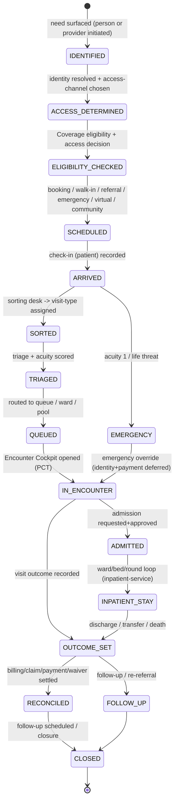

The Core Transaction state is **derived**, not authoritative: each substate is owned by a sovereign service
(`JourneyEntity` states in PCT drive ARRIVED→TRIAGED→QUEUED→SEEN→ADMITTED/DISCHARGED; COSTA
`ServiceAccessDecisionEntity` drives the access gate; Coverage drives eligibility). The composition layer
maps them onto this single carrier so every surface speaks one vocabulary.

## 2. End-to-end master journey (all contexts collapsed)

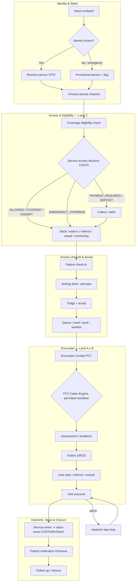

**Grounding note (honest product truth):** the **PCT Cadre Engine** (`CADRE` node) does **NOT exist today** —
PCT's `RoutingEngine` only does explicit-queue + acuity→priority routing. Sorting Desk and Visit-Type
selection are also absent. These are the headline T3 builds; everything else (journey state machine, triage,
queue, encounter, discharge, referral, telemedicine orchestration) is Live or Partial. See the audit for the
per-node Live/Partial/Missing verdict.

## 3. The PCT Cadre Engine (the heart of T3 — to be built)

The Cadre Engine is **real workflow enforcement**, distinct from Tshepo authorization. Tshepo answers
"*may this actor perform this action?*" (RBAC/ABAC). The Cadre Engine answers "*given role + cadre + scope +
visit-type + acuity + work-context + access-state, what workflow is this person permitted to drive right
now, and which Encounter Cockpit tabs/actions light up?*" It is the adaptive-spine resolver.

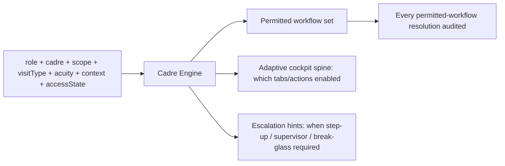

**Inputs (all already resolvable from existing read-models):**
- `role` + `cadre` ← Varapi provider profile (`cadre`, `profession`).
- `scope` ← Vashandi active assignment (facility/dept/unit/role-template) + check-in state.
- `visitType` ← Sorting Desk output (to build).
- `acuity` ← PCT `TriageRecordEntity` (1–5, Live).
- `context` ← one of the six work contexts (§5).
- `accessState` ← COSTA `ServiceAccessDecisionEntity` + Tshepo decision.

**Output contract** is frozen in shared-read-models (§ Cadre Engine decision). The Cadre Engine consumes
Tshepo decisions but **does not author policy** — when an action needs an authz check it calls the existing
Tshepo ext_authz path; the new policy *rules* are specified (not authored) in the Tshepo policy contract list.

**SoR placement:** the Cadre Engine is encounter-workflow logic → it belongs in **PCT** (encounter SoR), not
in the BFF and not in Tshepo. New PCT migrations start at **V015**.

## 4. Three-lane swimlane (canonical OPD instance)

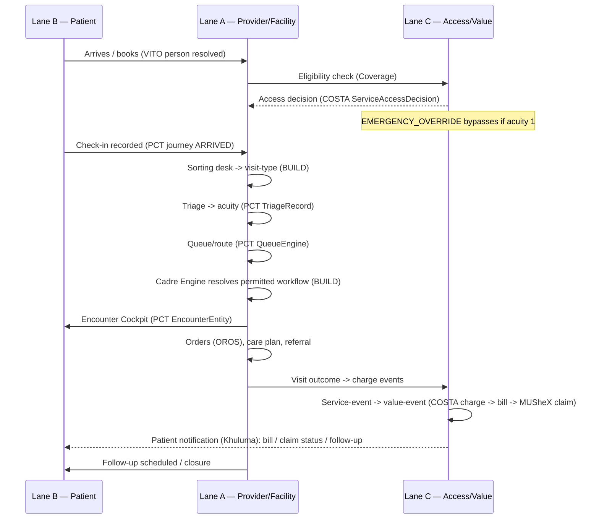

## 5. Per-context journey maps (six work contexts)

> **Expanded in §16.** These are the **status sketches**; the **full** per-context journey maps (three lanes
> + decision points + patient messages + value events, including the full Inpatient admission-source/ward-bed/
> round-loop/discharge/transfer/bed-day-comp map) are in **§16 (Addendum-1)**. This §5 is retained for the
> at-a-glance status verdict per context.

The six work contexts share the spine but differ in entry, sorting, queue target, cockpit spine, and outcome.
**Context modelling status today:** Inpatient (Live), Casualty/ED (Live, `EdVisitEntity` + protocol catalog),
Virtual (Live, telemedicine), Procedure (Partial, inpatient-only `ProcedureEpisode`), Outpatient (Partial,
generic encounter), Community (**Missing**).

### 5.1 Outpatient (OPD)
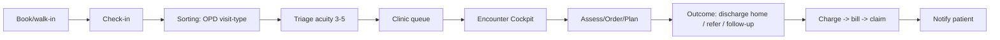
- **Cockpit spine:** Overview · Assessment · Problems · Orders&Results · Care · Consults&Referrals · Notes · Visit-Outcome.
- **Gap:** outpatient has no Care Plan CRUD (inpatient-only today) and no Problems List entity — both T3 builds in PCT.

### 5.2 Inpatient
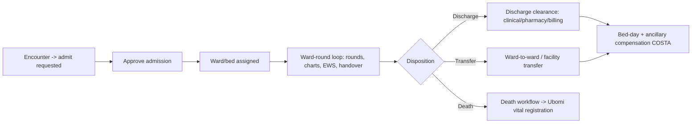
- **Mostly Live:** `inpatient-service` has Admission/Ward/Bed/WardRound/Transfer/DischargeClearance/CarePlan/
  EarlyWarningScore/ShiftHandover/ProcedureEpisode (V012 head). COSTA `InpatientCostingService` posts bed-day,
  food, laundry, oxygen, theatre-time (Live).
- **Build:** wire admission approval → bed assignment handshake between PCT `AdmissionWorkflow` and
  inpatient-service (two admission entities exist — one in each; reconcile ownership, see lane plan).

### 5.3 Casualty / Emergency (ED)
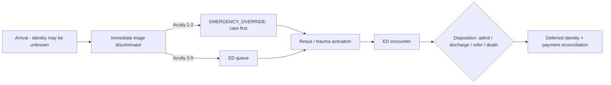
- **Law 1 enforced here:** identity provisional, payment deferred, care proceeds. `EdVisitEntity`,
  `EdProtocolCatalog`, `EdTriageDiscriminatorEngine` are Live.

### 5.4 Procedure (day-surgery / theatre)
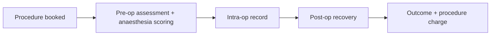
- **Partial:** `ProcedureEpisodeDocumentEntity` + anaesthesia scoring exist in inpatient-service only.
  **Build:** outpatient/day-surgery procedure context (no admission) — new visit-type, reuse procedure episode.

### 5.5 Community (outreach / household)
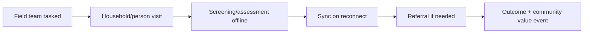
- **Missing backend context** (no community visit/outreach entity in PCT). Mobile provider-app HAS outreach
  screens (household list, screening, follow-up, outreach dashboard) — **NotWired** to a backend context.
  **Build:** community work-context in PCT + offline reconciliation.

### 5.6 Virtual / Telemedicine
See §7 (the 7-stage closed loop). Telemedicine is governed exactly like in-person care (same access gate,
same outcome→value mapping, same audit).

## 6. Decision-point register

> **Canonical register moved.** The **canonical** Decision Point Register is now **§18** (Addendum-1 format:
> Decision ID · Decision Point · Inputs · Decision Owner · System Action · Patient Message · Audit Required).
> The table below (D1–D14) is retained for its **emergency-behaviour and SoR-detail** view and is
> cross-referenced from §18 (DP-IDs map to these D-IDs). Use §18 as the build's authoritative list.

Each decision point has: owning service, inputs, outputs, failure path, emergency behaviour, audit.
"Status" is today's reality.

| # | Decision point | Owner (SoR) | Inputs | Outputs | Emergency behaviour | Status |
|---|----------------|-------------|--------|---------|---------------------|--------|
| D1 | Identity resolved? | VITO via Tshepo-identity | Health ID / phone / email / provisional | person ref or provisional ref | provisional person, care proceeds | Partial (no silent email→HealthID) |
| D2 | Access channel | Composition (BFF) | need, urgency, modality | booking / walk-in / referral / emergency / virtual / community | force emergency channel | Partial |
| D3 | Eligibility | Coverage | person, scheme, service | eligible / not / unknown | skip, defer | Live |
| D4 | Service access gate | COSTA `ServiceAccessDecision` | eligibility, tariff, exemption | ALLOWED/PAYMENT_REQUIRED/DEPOSIT/COVERED/EXEMPT/WAIVER/BLOCKED/**EMERGENCY_OVERRIDE** | EMERGENCY_OVERRIDE + deferred reconcile | Live (gate); reconcile endpoint **Missing** |
| D5 | Sorting desk visit-type | PCT (BUILD) | arrival reason, context | visit-type | default to emergency assessment | **Missing** |
| D6 | Triage acuity | PCT `TriageService` | vitals, complaint | acuity 1–5 | acuity 1 → bypass queue | Live |
| D7 | Routing target | PCT `RoutingEngine` | acuity, queue, context | queue / ward / pool / worklist | direct to resus | Live (no cadre/pool routing) |
| D8 | Permitted workflow | PCT Cadre Engine (BUILD) | role,cadre,scope,visitType,acuity,context,accessState | workflow set + cockpit spine + escalation | break-glass widens, audited | **Missing** |
| D9 | Order placement | OROS | order type, facility capability | INTERNAL/ADAPTER/HYBRID route | stat order priority | Live |
| D10 | Admission | PCT `AdmissionWorkflow` + inpatient-service | bed availability, clinical need | admitted / waitlist | emergency bed | Live (handshake to wire) |
| D11 | Discharge clearance | PCT `DischargeWorkflow` | clinical/pharmacy/billing/payment blockers | discharged / blocked | clinical override of billing block | Live |
| D12 | Visit outcome | PCT | disposition | outcome event | recorded regardless | Live |
| D13 | Value event | COSTA→MUSheX | outcome, charges | charge→bill→claim→payment | EMERGENCY_OVERRIDE charges flagged for later reconcile | Live; subsidy/waiver CRUD + reconcile **Missing** |
| D14 | Step-up / break-glass | Tshepo (spec only) | sensitivity, access mode | challenge / grant | break-glass grant, audited | Live (StepUp); rules specced not authored |

## 7. Telemedicine — 7-stage closed loop

Telemedicine is a first-class work-context, governed like in-person care, across modalities
**async / chat / audio / video / scheduled / MDT**. The orchestration already exists in PCT
(`TelemedicineOrchestrationService`, `TelemedicineController`) with 4 pluggable session providers
(managed video, async no-video, manual phone, external). **Real-time transport (WebRTC/WebSocket) is
intentionally absent** and fails closed (`501 BACKEND_CAPABILITY_MISSING`) — honest product truth.

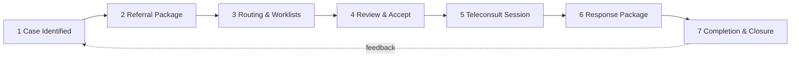

| Stage | What happens | Backend | Build gap |
|-------|--------------|---------|-----------|
| 1 Case Identified | provider flags case for teleconsult | implicit (encounter context) | auto-encounter creation |
| 2 Referral Package | build package: summary, attachments, consent | `createReferral()` + `ReferralPackageBuilder.tsx` | consent modal, attachment backend, auto-summary panels |
| 3 Routing & Worklists | route to provider/pool/on-call | `RoutingEngine` + worklist | team/pool/on-call routing, capacity checks, real-time updates |
| 4 Review & Accept | receiving provider accepts/reassigns | `acceptReferral()` | reassign workflow, full-page review |
| 5 Teleconsult Session | conduct session (modality-specific) | `TelehealthSessionEntity` + 4 providers | **real-time media (WebRTC/WS) absent by design** |
| 6 Response Package | structured clinical response + orders | `submitResponse()` | structured form, orders/attachment linkage |
| 7 Completion & Closure | outcome, follow-up, archival | `completeReferral()` | outcome archival to timeline, follow-up verification |

**Governance parity:** stages 2–7 each pass the same access gate (D4), Cadre Engine (D8), and outcome→value
mapping (D13) as in-person care. The referral/consult package shape is frozen in shared-read-models.

## 8. Patient-facing message catalog (plain-language, multilingual-ready)

Messages are sent via Khuluma (comms SoR — **consume, never rebuild**, live session `task_7bda0e52`) and
rendered through the existing notification system (typed INFO/WARNING/SUCCESS/MESSAGE) with i18n keys in
`one-ui-shell/src/lib/i18n/locales/{en,sn,nd}.json`. Every message below is a **key**, not hardcoded text.

| Key | Trigger (state) | Plain-language English (en) | Tone |
|-----|-----------------|------------------------------|------|
| `ct.msg.booking_confirmed` | SCHEDULED | "Your visit is booked for {date} at {facility}." | neutral |
| `ct.msg.checkin_ok` | ARRIVED | "You're checked in. Please take a seat — we'll call you." | reassuring |
| `ct.msg.queue_position` | QUEUED | "You are number {n} in the queue. Estimated wait {mins} minutes." | neutral |
| `ct.msg.triage_priority` | TRIAGED (high acuity) | "You will be seen as a priority. A nurse is coming to you." | reassuring |
| `ct.msg.order_placed` | order placed | "Your {testName} has been requested. We'll let you know when results are ready." | neutral |
| `ct.msg.results_ready` | result available | "Your results are ready. Your care team will discuss them with you." | neutral |
| `ct.msg.referral_sent` | referral created | "You have been referred to {service}. They will contact you about next steps." | neutral |
| `ct.msg.admitted` | ADMITTED | "You have been admitted to {ward}. Your care team will keep you informed." | reassuring |
| `ct.msg.discharge_ready` | discharge cleared | "You are ready to go home. Please collect your discharge summary and medicines." | positive |
| `ct.msg.followup_due` | follow-up | "Please come back on {date} for your follow-up. Reply HELP if you can't make it." | neutral |
| `ct.msg.bill_issued` | value event | "A bill of {amount} has been issued for your visit. See payment options in the app." | neutral |
| `ct.msg.payment_received` | payment | "We've received your payment of {amount}. Thank you." | positive |
| `ct.msg.waiver_applied` | waiver/exemption | "Your visit costs have been covered. There is nothing to pay." | positive |
| `ct.msg.emergency_reassurance` | EMERGENCY_OVERRIDE | "You are being treated now. We'll sort out registration and payment afterwards." | reassuring |
| `ct.msg.teleconsult_scheduled` | telemed S3/4 | "Your virtual consultation is set for {date}. We'll send a join link." | neutral |
| `ct.msg.teleconsult_response` | telemed S6 | "Your virtual consultation is complete. Here's what your clinician advised." | neutral |

**Rules:** no clinical jargon; never deliver a diagnosis by automated message; always offer a human/opt-out
path; respect consent + communication preferences (existing `CommunicationPreferences`); all keys must exist
in all three locale files before the build ships them.

## 9. Service-event → value-event mapping

Every clinical/operational event that should generate value passes through the **outbox** of its owning
service onto `core.transaction.events` (COSTA and MUSheX already dual-emit). This table is the canonical map
the build wires; it prevents value leakage (service happened, nobody billed) and double-charging.

| Service event (source) | Owner | Value event (target) | Target owner | Status |
|------------------------|-------|----------------------|--------------|--------|
| Encounter completed (OPD) | PCT | charge → bill line | COSTA | Live (charge ingest) |
| Bed-day accrued | inpatient-service | BEDDAY bill line | COSTA `InpatientCostingService` | Live |
| Ancillary (food/laundry/oxygen/theatre) | inpatient-service | bill line | COSTA | Live |
| Order priced (lab/imaging/procedure) | OROS / msika-flow | CHARGE_CREATED | COSTA `ingestMsikaFlowOrderPriced` | Live |
| Blood unit issued/transfused | MADI | charge | COSTA | Partial |
| Bill finalized | COSTA | claim pack (if insured) | MUSheX | Live |
| Claim adjudicated | MUSheX | settlement / remittance | MUSheX | Live |
| Payment captured | MUSheX | receipt + ledger entry | MUSheX | Live (rails stubbed) |
| Teleconsult completed | PCT | charge | COSTA | **Build** (telemed→value not wired) |
| Emergency override invoked | COSTA | flagged deferred charge | COSTA reconcile | **Build** (reconcile endpoint Missing) |

## 10. Emergency override & deferred reconciliation (Law 1, expanded)

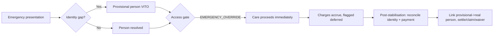

- The gate (`ServiceAccessDecisionEntity`) already supports `EMERGENCY_OVERRIDE` with `decided_by`,
  `decision_reason`, `audit_reference`. **Missing:** the reconciliation endpoint that, post-care, lists
  emergency-overridden charges, links the provisional→confirmed person, and routes to settle/claim/waiver.
  This is a Lane-C build (COSTA, V012).
- Identity reconciliation links the provisional VITO person to the confirmed record without losing the audit
  chain (VITO is SoR; the link is recorded, not overwritten).

## 11. What this map asks the build to create (T3 net-new, ranked)

1. **PCT Cadre Engine** (D8) — role+cadre+scope+visitType+acuity+context+accessState ⇒ permitted workflow +
   adaptive cockpit spine. *Highest leverage; nothing today.* (PCT, V015+)
2. **Sorting Desk + Visit-Type selection** (D5) — explicit pre-queue step. (PCT, V016+)
3. **Outpatient Care Plan + Problems List** in PCT (parity with inpatient). (PCT)
4. **Community work-context** backend + offline reconciliation (mobile screens already exist, NotWired). (PCT)
5. **Emergency reconciliation endpoint** + deferred-charge review. (COSTA, V012)
6. **Telemedicine completeness:** consent modal, attachment backend, structured response, telemed→value
   wiring, routing pools. (PCT + OROS coordination — OROS is a live session; consume, don't rebuild.)
7. **Subsidy enrolment + Waiver CRUD** for Lane C (Coverage V010 / COSTA V012).
8. **Adaptive encounter cockpit spine** in one-ui-shell driven by the Cadre Engine output.

Everything else on the spine is Live or Partial and needs **wiring/completion, not creation**. The disjoint
service ownership for each of these builds is carved in the implementation-lane plan.

---

# ADDENDUM 1 — Detailed Journey Maps

> **Scope.** §0–§11 above are the canonical narrative. This addendum supplies the **detailed journey
> artifacts** mandated by "ADDENDUM 1 — Detailed Journey Maps" of the T3 spec. It does **not** restate the
> state machine — the authoritative state machine remains `contracts/core-transaction.ts`
> (`CoreTransactionState`, 54 states) and [`../doctrine/CORE_TRANSACTION_STATE_MACHINE.md`](../doctrine/CORE_TRANSACTION_STATE_MACHINE.md);
> every state name below is taken verbatim from that union. Sections are numbered §12–§24 to continue the
> document coherently; the Addendum's own letter/number scheme is given in parentheses on each heading.
>
> **Honesty contract.** Each artifact carries a Live / Partial / Missing label cross-referenced to
> [`../audits/provider-clinical-place/consolidated-gap-register.md`](../audits/provider-clinical-place/consolidated-gap-register.md)
> (GAP-n). Aspirational flows are **not** drawn as built.
>
> **Three lanes everywhere.** A = Provider/Facility · B = Patient/Client · C = Access/Compensation (see §0).

## 12. Per-stage service mapping (Add §1)

Authoritative stage→owner→event table. "State(s)" are canonical `CoreTransactionState` values; "Event"
is the canonical `CoreTransactionEventName` from the contract (and, where a real Kafka topic exists, the
grounded topic — see §22). Status reflects today's repo.

| # | Stage (narrative) | Canonical state(s) | Owning service(s) (SoR) | Event emitted | Status |
|---|-------------------|--------------------|-------------------------|---------------|--------|
| 1 | Need / trigger | `DRAFT` · `INITIATED` | experience-bff (compose) | `core.transaction.initiated` | Live |
| 2 | Identity resolve | `IDENTITY_PENDING` → `IDENTITY_RESOLVED` (`PROVISIONAL_IDENTITY`/`DUPLICATE_SUSPECTED` branch) | VITO (person) via Tshepo-identity | `core.identity.resolution.requested` · `core.identity.resolved` · `core.identity.provisional.created` | Partial (GAP-5: phone/email/invite deny-safe) |
| 3 | Trust + consent | `TRUST_CONTEXT_ESTABLISHED` (`CONSENT_DENIED`/`ACCESS_DENIED` branch) | Tshepo (authz/consent/policy) | `core.trust.context.established` · `core.consent.checked` · `core.consent.granted`/`core.consent.denied` | Live (engine); GAP-6 new rego unauthored |
| 4 | Service selection | `SERVICE_SELECTED` | MSIKA/ZIBO catalogue via experience-bff | `core.service.selected` | Live |
| 5 | Costing | `COSTING_REQUIRED` → `COST_ESTIMATED` | COSTA (costing) | `core.costing.required` · `core.cost.estimated` (`costa.estimate.created`) | Live |
| 6 | Coverage / eligibility | `COVERAGE_CHECK_PENDING` → `COVERAGE_CONFIRMED` / `EXEMPTION_CONFIRMED` | Coverage (eligibility) | `core.coverage.check.requested` · `core.coverage.confirmed` · `core.exemption.confirmed` | Live; subsidy-enrolment CRUD Partial (GAP-7-adjacent) |
| 7 | Pre-service payment gate | `PRE_SERVICE_PAYMENT_REQUIRED`/`_PENDING`/`_COMPLETED`/`_FAILED` · `ACCESS_GRANTED` / `ACCESS_BLOCKED_PAYMENT_REQUIRED` | COSTA `ServiceAccessDecision` + MUSheX (payment) | `core.pre_service_payment.required`/`.initiated`/`.completed`/`.failed` · `core.access.granted`/`core.access.blocked.payment_required` | Live (gate); reconcile endpoint Missing |
| 8 | Schedule | `SCHEDULED` | PCT (appointment) | `core.appointment.created` | Live |
| 9 | Arrive / check-in | `QUEUED` · `TASKED` | PCT `JourneyEntity` | `core.queue.joined` | Live |
| 10 | Sorting desk → visit-type | `TASKED` | PCT Sorting Desk | (no canonical event — internal `pct.sorting.routed`) | **Missing** (GAP-11) |
| 11 | Triage + acuity | `TRIAGE_IN_PROGRESS` → `READY_FOR_PROVIDER` | PCT `TriageService`/`TriageRecordEntity` | `core.triage.started` · `core.triage.completed` | Live |
| 12 | Queue / route | `QUEUED` · `READY_FOR_PROVIDER` | PCT `RoutingEngine`/`QueueEngine` | `core.provider.assigned` | Live (no cadre/pool routing) |
| 13 | Cadre decision | (no own state; gates `IN_SERVICE`) | PCT Cadre Engine | (internal `pct.cadre.resolved`) | **Missing** (GAP-4 unify) |
| 14 | Encounter | `IN_SERVICE` · `PROVIDER_REVIEW_PENDING` | PCT `EncounterEntity` | `core.encounter.started` · `core.encounter.updated` | Live |
| 15 | Orders / ancillary | `ORDERS_PENDING` · `ANCILLARY_IN_PROGRESS` · `PENDING_RESULT` | OROS (orders), MADI (blood) | `core.order.created` · `core.order.completed` · `core.result.available` | Live (MADI charge Partial) |
| 16 | Admission (branch) | `ADMITTED` | PCT `AdmissionWorkflow` + inpatient-service | `core.encounter.updated` (`admission.admitted`) | Live (handshake to wire) |
| 17 | Visit outcome | `CLINICAL_COMPLETION_PENDING` | PCT | `core.encounter.updated` | Live |
| 18 | SHR contribution | `SHR_UPDATE_PENDING` | BUTANO (SHR/FHIR) | `core.shr.update.requested` · `core.shr.updated` | Live |
| 19 | Client instructions | `CLIENT_INSTRUCTIONS_PENDING` | PCT + Khuluma (comms) | `core.client.instructions.generated` · `core.notification.sent` | Partial (GAP-8/9) |
| 20 | Billing / value | `POST_SERVICE_BILLING_PENDING` · `FINANCIAL_PROCESSING` | COSTA (bill) | `core.invoice.generated` (`costa.bill.finalized`) | Live |
| 21 | Claim / payment | `CLAIM_PENDING` · `RECONCILIATION_PENDING` | MUSheX (claim/payment), COSTA reconcile | `core.claim.submitted` · `core.claim.adjudicated` · `core.payment.initiated`/`.completed` | Live; emergency-reconcile Missing |
| 22 | Follow-up | `FOLLOW_UP_ACTIVE` (`REFERRED_OUT` branch) | PCT | `core.followup.created` · `core.referral.created`/`.accepted`/`.completed` | Live |
| 23 | Close | `COMPLETED` · `CLOSED` | experience-bff (compose) | `core.transaction.completed` · `core.transaction.closed` | Live |
| E | Emergency override | `EMERGENCY_OVERRIDE` → `PENDING_RECONCILIATION` | COSTA `ServiceAccessDecision` | `core.access.granted` (override flag) · `core.transaction.audit.flagged` | Live (gate); reconcile Missing |

## 13. Master three-lane swimlane table (Add §2)

The OPD instance, expanded across all stages. **Required UI** names the surface that must exist;
where it is not yet built the cell carries (Missing/GAP-n). Columns: Stage · Provider/Facility (A) ·
Patient/Client (B) · Access/Compensation (C) · Platform Events · Required UI.

| Stage (state) | A — Provider/Facility | B — Patient/Client | C — Access/Compensation | Platform Events | Required UI |
|---|---|---|---|---|---|
| Need (`INITIATED`) | — | "I need care" / search | — | `core.transaction.initiated` | Patient find-care / Nompilo search |
| Identity (`IDENTITY_RESOLVED`) | reception resolves person | confirm who I am | — | `core.identity.resolved` | Reg desk · patient identity confirm |
| Trust (`TRUST_CONTEXT_ESTABLISHED`) | consent/purpose-of-use check | consent prompt | — | `core.trust.context.established` | Consent modal (Partial GAP-6) |
| Service (`SERVICE_SELECTED`) | select service/clinic | "what for" | — | `core.service.selected` | Service picker |
| Cost (`COST_ESTIMATED`) | — | see estimate | COSTA estimate | `core.cost.estimated` (`costa.estimate.created`) | Cost estimate card |
| Coverage (`COVERAGE_CONFIRMED`/`EXEMPTION_CONFIRMED`) | — | "you're covered / exempt" | Coverage eligibility | `core.coverage.confirmed`/`core.exemption.confirmed` | Coverage badge |
| Gate (`ACCESS_GRANTED` / `ACCESS_BLOCKED_PAYMENT_REQUIRED`) | access decision shown | pay / nothing-to-pay | COSTA `ServiceAccessDecision` + MUSheX | `core.access.granted`/`core.access.blocked.payment_required` | Access banner · pay sheet (Partial GAP-8) |
| Schedule (`SCHEDULED`) | slot booked | "booked for {date}" | — | `core.appointment.created` | Booking · `ct.msg.booking_confirmed` |
| Arrive (`QUEUED`/`TASKED`) | check-in recorded | "you're checked in" | — | `core.queue.joined` | Check-in · `ct.msg.checkin_ok` (Partial GAP-8) |
| Sort (`TASKED`) | sorting desk → visit-type | (transparent) | — | `pct.sorting.routed` | Sorting Desk (**Missing** GAP-11) |
| Triage (`TRIAGE_IN_PROGRESS`→`READY_FOR_PROVIDER`) | triage + acuity | "priority / take a seat" | — | `core.triage.started`/`.completed` | Triage form · `ct.msg.triage_priority` |
| Queue (`QUEUED`/`READY_FOR_PROVIDER`) | worklist/queue | queue number + ETA | — | `core.provider.assigned` | Queue board · `ct.msg.queue_position` (Partial GAP-8) |
| Cadre (gates `IN_SERVICE`) | permitted workflow resolved | (transparent) | access-state in | `pct.cadre.resolved` | Adaptive cockpit spine (**Missing** GAP-4) |
| Encounter (`IN_SERVICE`) | Encounter Cockpit | being seen | — | `core.encounter.started`/`.updated` | Encounter Cockpit |
| Orders (`ORDERS_PENDING`/`PENDING_RESULT`) | place/track orders | "test requested / results ready" | order priced → charge | `core.order.created`/`.completed`/`core.result.available` | Orders & Results · `ct.msg.order_placed`/`results_ready` |
| Outcome (`CLINICAL_COMPLETION_PENDING`) | record disposition | — | — | `core.encounter.updated` | Visit-Outcome panel (see §17) |
| SHR (`SHR_UPDATE_PENDING`) | contribute to record | — | — | `core.shr.updated` | (background) |
| Instructions (`CLIENT_INSTRUCTIONS_PENDING`) | issue instructions | "here's what to do" | — | `core.client.instructions.generated`/`core.notification.sent` | Instructions card (Partial GAP-9) |
| Billing (`POST_SERVICE_BILLING_PENDING`) | — | "bill issued" | COSTA bill | `core.invoice.generated` (`costa.bill.finalized`) | Bill view · `ct.msg.bill_issued` |
| Claim/pay (`CLAIM_PENDING`/`RECONCILIATION_PENDING`) | — | "payment received / claim status" | MUSheX claim+payment | `core.claim.submitted`/`.adjudicated`/`core.payment.completed` | Pay sheet · `ct.msg.payment_received` |
| Follow-up (`FOLLOW_UP_ACTIVE`/`REFERRED_OUT`) | schedule follow-up/referral | "come back {date}" | — | `core.followup.created`/`core.referral.created` | Follow-up · `ct.msg.followup_due`/`referral_sent` |
| Close (`COMPLETED`/`CLOSED`) | visit closed | — | reconciled | `core.transaction.completed`/`.closed` | Closure gate |

Per-context lane tables (Inpatient, ED, Virtual, Referral, Procedure, Community) extend this in §16.

## 14. Sorting Desk decision tree (Add §4) — **Missing** (GAP-11)

The Sorting Desk is the unified front-door step between arrival (`QUEUED`) and triage
(`TRIAGE_IN_PROGRESS`); it assigns a **visit-type** that drives routing and the Cadre Engine. **Status:
Missing today** — there is no `SortingDeskService` or sorting-session entity in PCT; the audit tracks this
as GAP-11 (unified "sorting session" binding arrival→identity→triage→route) and D5 in §6. The tree below is
the **build target**.

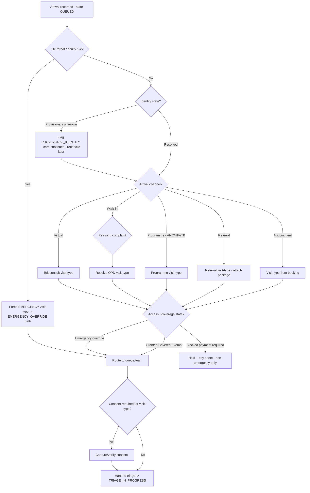

**Sorting Desk field list (the sorting-session record to build):**

| Field | Source | Drives | Status |
|---|---|---|---|
| Identity state (resolved / provisional / unknown) | VITO via Tshepo-identity | provisional path, audit | Partial (GAP-5) |
| Health ID / MRN / temporary ID | VITO; facility MRN; emergency temp-ID | record linkage | Live (HealthID) / Missing (temp-ID issuance) |
| Arrival channel (appointment/walk-in/referral/programme/virtual/community) | check-in input | visit-type default | **Missing** (GAP-11 arrival_mode tiles) |
| Visit type | sorting decision | routing + Cadre Engine | **Missing** (GAP-11) |
| Reason / chief complaint | reception/patient | triage prep, visit-type | Partial |
| Appointment / referral / programme link | PCT appointment; referral package; programme registry | continuity | Live (appt) / Partial (programme) |
| Access / coverage state | COSTA `ServiceAccessDecision` + Coverage | hold vs proceed | Live |
| Consent requirement | Tshepo (purpose-of-use × visit-type) | consent capture gate | Live (engine) / Partial (modal GAP-6) |
| Triage score (acuity 1–5) | PCT `TriageRecordEntity` (post-sort) | priority, queue bypass | Live |
| Acuity / discriminator | PCT triage; ED discriminator engine | emergency branch | Live |
| Queue destination | PCT `RoutingEngine` | queue placement | Live (no pool routing) |
| Provider / team destination | PCT routing; on-call/pool | worklist | Partial (no team/pool) |
| Patient-facing instruction | Khuluma message key | patient comms | Partial (GAP-8) |
| Audit entry | every sorting decision → audit | traceability | **Missing** (with the session) |

## 15. Queue & patient-flow state machine (Add §5)

Queue micro-states are an **operational projection** of canonical states (`QUEUED`, `READY_FOR_PROVIDER`,
`IN_SERVICE`, `PROVIDER_REVIEW_PENDING`, `NO_SHOW`, `TRANSFERRED`) — they are not new `CoreTransactionState`
values. PCT `QueueEngine`/`JourneyEntity` is **Live**; the per-state patient view is **Partial** (GAP-8).

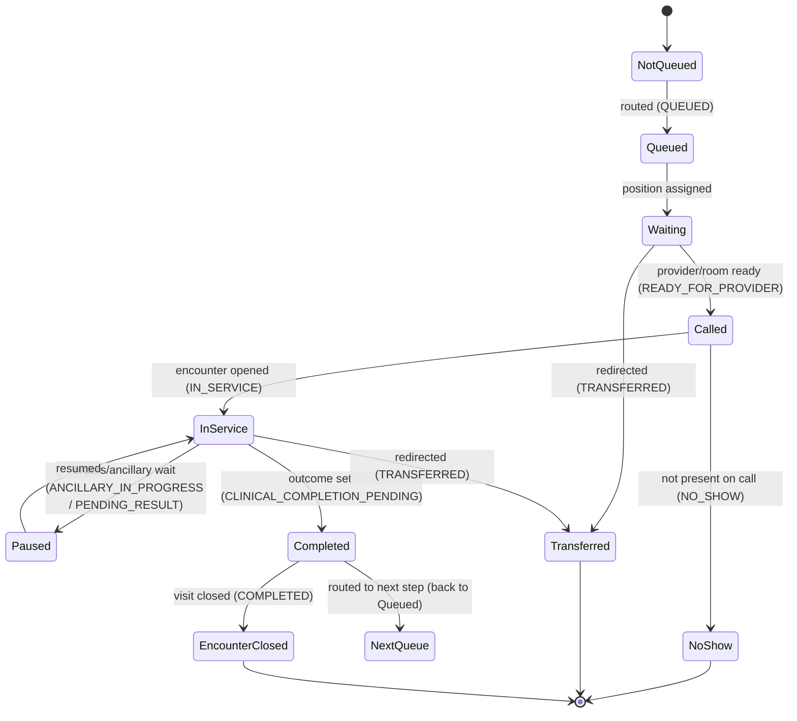

| Queue state | Provider view | Patient view | Access/Value event | Allowed actions |
|---|---|---|---|---|
| NotQueued | not on worklist | (none) | — | route |
| Queued | appears in queue | "you're in the queue" | — | reorder, reprioritise |
| Waiting | position + ETA | number + ETA (`ct.msg.queue_position`) | — | call, transfer, mark late |
| Called | flagged "calling" | "please come to {room}" | — | open encounter, mark no-show |
| InService | active encounter | "you're being seen" | charges begin accruing | document, order, pause |
| Paused | awaiting orders/results | "waiting for {test}" | order charge created | resume, escalate |
| Completed | outcome recorded | "visit done" | bill line draft | route-next, close |
| NextQueue | re-queued downstream | new queue number | — | route |
| NoShow | removed, flagged | "you missed your slot" | no charge / no-show fee per policy | rebook, close `NO_SHOW` |
| Transferred | handed off | "you've been moved to {dest}" | charge follows patient | accept at destination |
| EncounterClosed | closed | "complete" | reconciliation triggered | — |

## 16. Full per-context journey maps (Add §6–§12)

These **replace the thin §5 sketches** with full maps. Each context keeps all three lanes, a decision-points
table (referencing the canonical register in §18), patient messages, and value events. Context status (from
§5/audit): Inpatient Live · ED Live · Virtual Live · Procedure Partial · OPD Partial · Community Missing.

### 16.1 Outpatient (OPD) — Partial

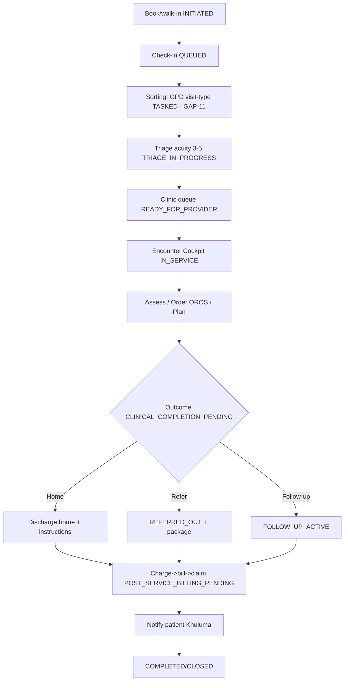

| Lane | OPD specifics |
|---|---|
| A Provider/Facility | clinic queue · cockpit spine Overview→Visit-Outcome · OROS orders · referral builder |
| B Patient/Client | check-in confirm, queue number/ETA, results notice, outcome & follow-up |
| C Access/Compensation | pre-service gate (D4), encounter charge → bill → claim/waiver |

- **Decision points:** DP-002, DP-003, DP-004, DP-005, DP-006, DP-007, DP-008, DP-011, DP-012 (§18).
- **Patient messages:** `ct.msg.checkin_ok`, `queue_position`, `order_placed`, `results_ready`, `referral_sent`, `followup_due`, `bill_issued`.
- **Value events:** encounter-completed → COSTA charge → bill → MUSheX claim (§9 / §22).
- **Gaps:** no outpatient Care Plan CRUD or Problems List entity (inpatient-only today) — PCT build; sorting/cadre Missing.

### 16.2 Inpatient (full) — Live (handshake to wire)

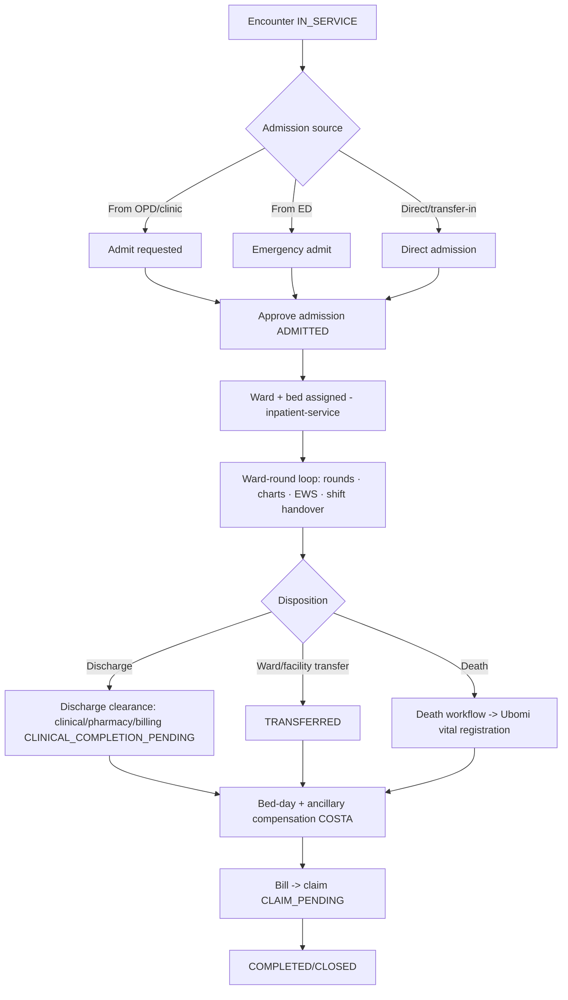

| Lane | Inpatient specifics |
|---|---|
| A Provider/Facility | admission approval · bed board · ward-round loop (rounds/charts/EWS/handover) · discharge clearance · transfer |
| B Patient/Client | "admitted to {ward}", daily updates, discharge-ready, transfer notice |
| C Access/Compensation | bed-day accrual, ancillary (food/laundry/oxygen/theatre) charges, discharge billing block (clinically overridable), claim |

- **Admission-source branches:** OPD/clinic, ED (emergency admit), direct/transfer-in — each lands in `ADMITTED`.
- **Ward-round loop:** rounds, observation charts, Early Warning Score (`EarlyWarningScore`), shift handover (`ShiftHandover`) — all Live in inpatient-service.
- **Decision points:** DP-009 (admission), DP-010 (discharge clearance), DP-011 (value), DP-012 (outcome).
- **Patient messages:** `ct.msg.admitted`, `ct.msg.discharge_ready`, `ct.msg.bill_issued`.
- **Value events:** bed-day → `BEDDAY` bill line (COSTA `InpatientCostingService`, Live); ancillary bill lines (Live).
- **Bed-day compensation:** posted per accrued day; discharge clearance checks clinical+pharmacy+billing blockers (billing block clinically overridable — Law-1-adjacent).
- **Gap:** two admission entities (PCT `AdmissionWorkflow` + inpatient-service) — reconcile ownership/handshake (lane plan; D10).

### 16.3 Casualty / Emergency (ED) — Live

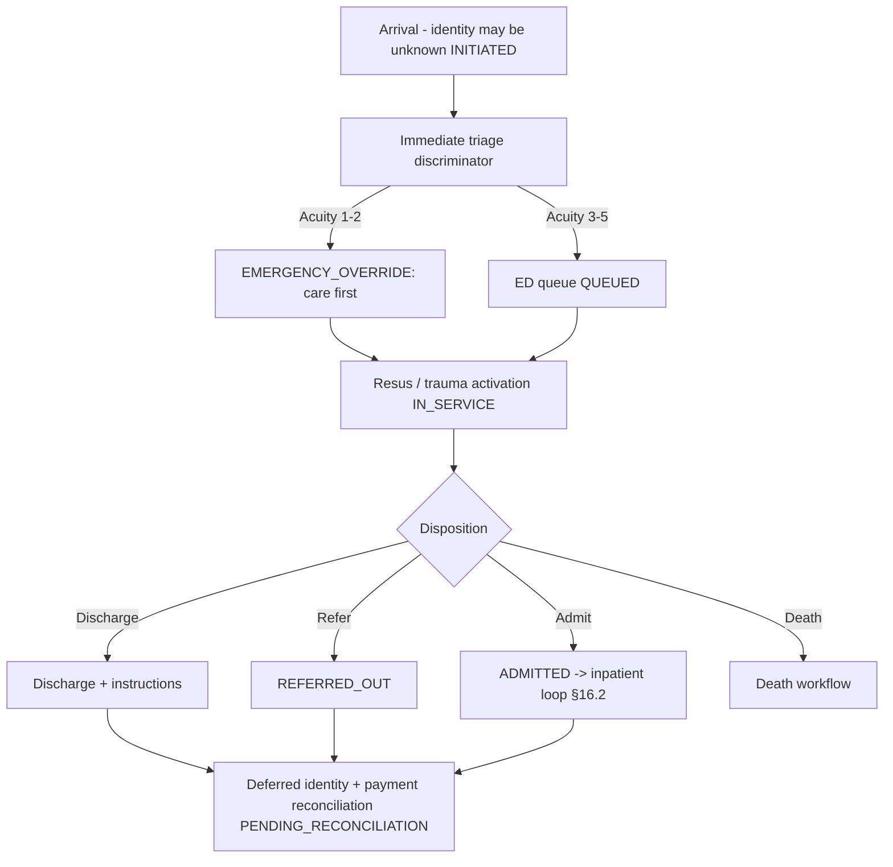

| Lane | ED specifics |
|---|---|
| A Provider/Facility | discriminator engine, resus/trauma activation, ED protocols |
| B Patient/Client | reassurance ("being treated now"), deferred registration |
| C Access/Compensation | **EMERGENCY_OVERRIDE**, charges accrue flagged-deferred, post-stabilisation reconcile |

- **Law 1 enforced:** identity provisional (`PROVISIONAL_IDENTITY`), payment deferred, care proceeds. `EdVisitEntity`, `EdProtocolCatalog`, `EdTriageDiscriminatorEngine` Live.
- **Decision points:** DP-001 (identity, force-provisional), DP-004 (gate → override), DP-006 (triage), DP-009/010, DP-011.
- **Patient messages:** `ct.msg.emergency_reassurance`, then standard.
- **Value events:** override charges flagged deferred → reconcile (Missing endpoint, GAP §10 / D13).

### 16.4 Virtual / Teleconsult — Live (real-time media absent by design)

Full 7-stage loop is in **§7**; this is the lane/decision/message view.

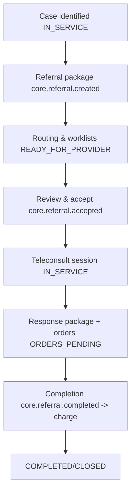

| Lane | Teleconsult specifics |
|---|---|
| A Provider/Facility | referral package builder, worklist accept/reassign, session (4 providers), structured response |
| B Patient/Client | "virtual consult set", join link, "consult complete — here's the advice" |
| C Access/Compensation | same access gate (D4); teleconsult-completed → charge (**Build** — telemed→value not wired) |

- **Decision points:** DP-004 (gate), DP-008 (cadre), DP-011 (value), DP-012 (outcome).
- **Patient messages:** `ct.msg.teleconsult_scheduled`, `ct.msg.teleconsult_response`.
- **Value events:** `telemedicine.session.completed` / `telemedicine.referral.completed` → COSTA charge (**Build**); real-time transport fails closed `501 BACKEND_CAPABILITY_MISSING` (honest).

### 16.5 Referral package — Live (builder enhancements pending)

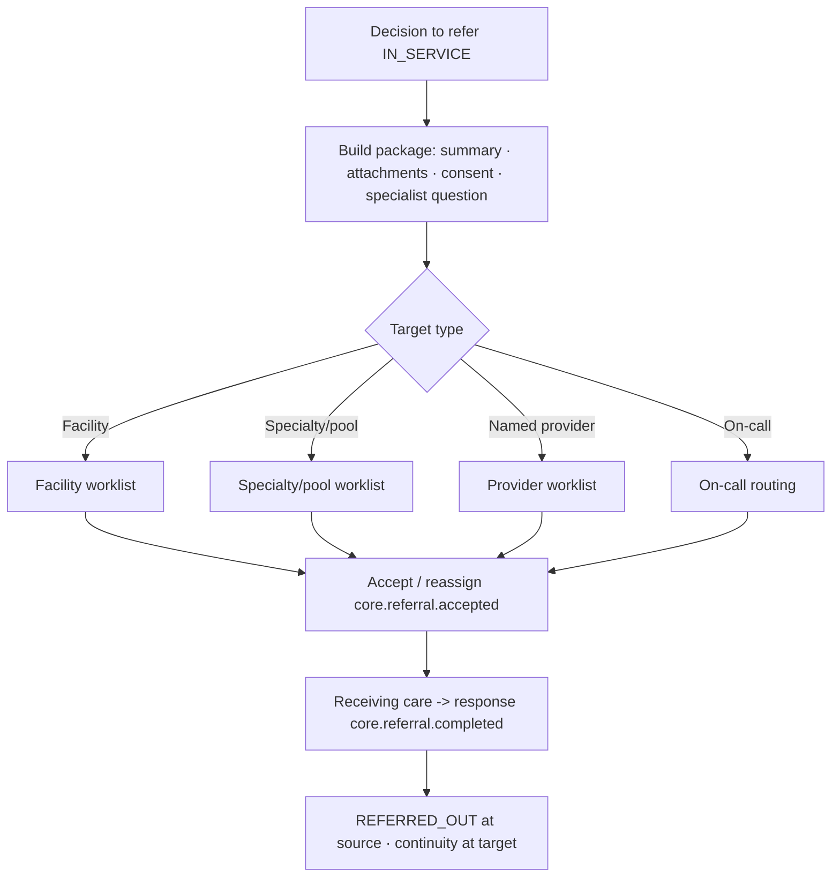

| Lane | Referral specifics |
|---|---|
| A Provider/Facility | package builder, target selection, accept/reassign at receiving end |
| B Patient/Client | "you've been referred to {service}; they'll contact you" |
| C Access/Compensation | charge follows the service that delivers; cross-facility value attribution |

- **Decision points:** DP-008 (cadre), DP-012 (outcome=refer), DP-011 (value at target).
- **Patient messages:** `ct.msg.referral_sent`.
- **Gap (GAP-12):** specialist-question prompts + multi-target (facility/specialty/provider/pool/on-call) routing are enhancements; core create/accept/complete is Live.

### 16.6 Procedure room (day-surgery / theatre) — Partial

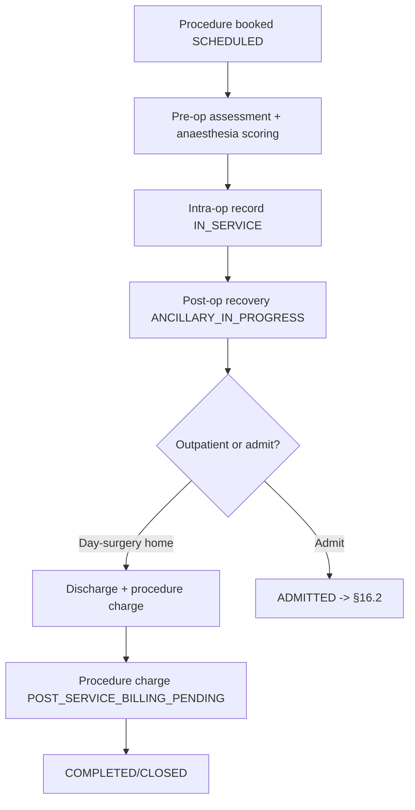

| Lane | Procedure specifics |
|---|---|
| A Provider/Facility | pre-op/anaesthesia scoring, intra-op record, post-op recovery |
| B Patient/Client | pre-op instructions, recovery updates, discharge |
| C Access/Compensation | procedure + theatre-time charge (theatre-time Live in COSTA inpatient costing) |

- **Decision points:** DP-008, DP-011, DP-012.
- **Partial (GAP-20):** `ProcedureEpisodeDocumentEntity` + anaesthesia scoring exist **inpatient-only**. Build: outpatient/day-surgery procedure context (no admission) — new visit-type, reuse procedure episode.

### 16.7 Community (outreach / household) — Missing backend

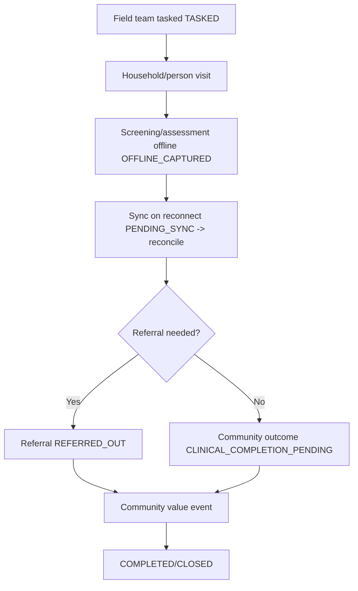

| Lane | Community specifics |
|---|---|
| A Provider/Facility (CHW/field team) | household list, screening, follow-up, outreach dashboard |
| B Patient/Client (household) | screening result, referral if needed |
| C Access/Compensation | community value event; programme-funded (often exempt) |

- **Missing backend context** — no community visit/outreach entity in PCT. Mobile provider-app **has** the screens (household list, screening, follow-up, outreach dashboard) but they are **NotWired** to a backend context.
- **Build:** community work-context in PCT + offline reconciliation (`OFFLINE_CAPTURED`→`PENDING_SYNC`→`SYNC_RECONCILED`).
- **Decision points:** DP-002 (channel=community), DP-012, plus offline-sync handling (`HANDLE_FAILURE_OFFLINE_AND_RECONCILIATION`).

## 17. Encounter cockpit journey — adaptive spine (Add §13)

The cockpit spine is **adaptive**: which tabs/actions light up is resolved by the PCT Cadre Engine, not
hardcoded. The spine itself maps to `IN_SERVICE` → `PROVIDER_REVIEW_PENDING` → `CLINICAL_COMPLETION_PENDING`.

```mermaid
flowchart LR
    O[Overview] --> A[Assessment]
    A --> P[Problems]
    P --> OR[Orders & Results - OROS]
    OR --> C[Care]
    C --> CR[Consults & Referrals]
    CR --> N[Notes]
    N --> VO[Visit Outcome]
    VO --> G{Closure gate: required sections complete?}
    G -->|No| N
    G -->|Yes| Z[Close -> CLINICAL_COMPLETION_PENDING]
```

**PCT decision formula (the Cadre Engine — D8, §3):**

```
permitted_workflow / forms / actions / blocks / escalation / closure_rules
  = CadreEngine(
       role, cadre, scope, specialty,
       facility, shift, patient, visitType, acuity, accessState
    )
```

- Inputs resolve from existing read-models: role/cadre (Varapi), scope/specialty/facility/shift (Vashandi active assignment + check-in), visitType (Sorting Desk — Missing GAP-11), acuity (PCT triage), accessState (COSTA `ServiceAccessDecision` + Tshepo).
- Output: which spine tabs are enabled, which forms render (DB-driven `CadreHistoryForm`/`CadreExamForm` — Partial GAP-10 for cadre-specific *content*), which actions are blocked, when step-up/break-glass is required, and the closure gate (mandatory sections).
- **Status: Missing** (the engine itself) — PCT `RoutingEngine` only does acuity→priority today.
- **GAP-4 (honest):** there are **two server-side cadre authorities** — pre-existing `cadre_scope_rules`/`clinical_cadre_definitions` tables (consumed by client `cadreEngine.ts`) **and** L1's new Java `CadreEngine`. They can diverge. **Unify:** the Java `CadreEngine` must be the single authority, sourcing its rules from those tables (not parallel hardcoded families); the scope-rules endpoint becomes a read-projection.

## 18. Decision Point Register (canonical) (Add §17)

> **This is the canonical register.** The earlier **§6** register (D1–D14, ownership/inputs/emergency view)
> is retained for its emergency-behaviour and SoR detail; it now **points here** for the Addendum-format
> register. DP-IDs below cross-reference the §6 D-IDs.

| Decision ID | Decision point | Inputs | Decision owner | System action | Patient message | Audit required |
|---|---|---|---|---|---|---|
| DP-001 (D1) | Identity resolved? | Health ID / phone / email / provisional | VITO via Tshepo-identity | resolve or create provisional (`PROVISIONAL_IDENTITY`) | (silent; `ct.msg.emergency_reassurance` if emergency) | Yes — identity event |
| DP-002 (D2) | Access channel | need, urgency, modality | experience-bff (compose) | set channel (booking/walk-in/referral/emergency/virtual/community) | `ct.msg.booking_confirmed` (if booked) | Yes |
| DP-003 (D3) | Eligibility | person, scheme, service | Coverage | eligible / not / unknown | `ct.msg.waiver_applied` (if exempt) | Yes |
| DP-004 (D4) | Service access gate | eligibility, tariff, exemption | COSTA `ServiceAccessDecision` | ALLOWED/COVERED/EXEMPT/PAYMENT_REQUIRED/DEPOSIT/WAIVER/BLOCKED/**EMERGENCY_OVERRIDE** | `ct.msg.bill_issued` / `ct.msg.emergency_reassurance` | Yes — value/access |
| DP-005 (D5) | Sorting desk visit-type | arrival reason, channel, context | PCT Sorting Desk (**Missing** GAP-11) | assign visit-type | (transparent) | Yes (with session) |
| DP-006 (D6) | Triage acuity | vitals, complaint | PCT `TriageService` | acuity 1–5; acuity 1→bypass queue | `ct.msg.triage_priority` (high) | Yes — triage event |
| DP-007 (D7) | Routing target | acuity, queue, context | PCT `RoutingEngine` | queue / ward / pool / worklist | `ct.msg.queue_position` | Yes |
| DP-008 (D8) | Permitted workflow | role,cadre,scope,visitType,acuity,context,accessState | PCT Cadre Engine (**Missing** GAP-4) | enable spine tabs/actions; escalation hints | (transparent) | Yes — every resolution |
| DP-009 (D10) | Admission | bed availability, clinical need | PCT `AdmissionWorkflow` + inpatient-service | admit (`ADMITTED`) / waitlist | `ct.msg.admitted` | Yes |
| DP-010 (D11) | Discharge clearance | clinical/pharmacy/billing/payment blockers | PCT `DischargeWorkflow` | discharge / blocked (clinical override of billing block) | `ct.msg.discharge_ready` | Yes |
| DP-011 (D13) | Value event | outcome, charges | COSTA → MUSheX | charge→bill→claim→payment; override→flag deferred | `ct.msg.bill_issued`/`payment_received`/`waiver_applied` | Yes — financial |
| DP-012 (D12) | Visit outcome | disposition | PCT | record outcome event (discharge/admit/transfer/refer/follow-up) | `ct.msg.followup_due`/`referral_sent` | Yes |
| DP-013 (D9) | Order placement | order type, facility capability | OROS | INTERNAL/ADAPTER/HYBRID route; stat priority | `ct.msg.order_placed`/`results_ready` | Yes |
| DP-014 (D14) | Step-up / break-glass | sensitivity, access mode | Tshepo (rules specced GAP-6) | challenge / grant (audited) | (transparent) | Yes — elevated |

## 19. Downstream events & integrations (Add — events)

Grounded in the real outbox/Kafka topics (verified by `grep` over `services/*/src`). Canonical
`CoreTransactionEventName` values dual-emit to the composition topic; sovereign services emit their own
domain topics. "Topic" is the real topic where one exists.

| Event | Emitting service | Consuming service(s) | Topic | Status |
|---|---|---|---|---|
| Transaction lifecycle (`core.transaction.*`) | experience-bff (compose) | reporting, audit, NDR | `core.transaction.events` | Live |
| Identity resolved/provisional | VITO via Tshepo-identity | experience-bff, audit | `core.transaction.events` | Partial (GAP-5) |
| Triage completed | PCT | experience-bff, queue board | `core.transaction.events` | Live |
| Order priced | OROS / msika-flow | COSTA (`ingestMsikaFlowOrderPriced`) | `costa.charge.created` | Live |
| Cost estimated | COSTA | experience-bff | `costa.estimate.created` | Live |
| Bill finalized | COSTA | MUSheX, experience-bff | `costa.bill.finalized` | Live |
| Claim pack created | COSTA | MUSheX | `costa.claim.pack.created` | Live |
| Admission approved | inpatient-service / PCT | experience-bff, COSTA (bed-day) | `admission.admitted` | Live |
| Bed-day accrued | inpatient-service | COSTA `InpatientCostingService` | `costa.charge.created` (BEDDAY) | Live |
| Teleconsult completed | PCT | experience-bff `TelemedicineLifecycleConsumer`, COSTA (charge) | `telemedicine.session.completed` · `teleconsult.lifecycle` | Live (event); telemed→value charge **Build** |
| Referral created/accepted/completed | PCT | experience-bff, target facility | `telemedicine.referral.created`/`.completed` · `core.transaction.events` | Live |
| Comms dispatched | Khuluma | patient channels | `telemedicine.communication.events` · notification topic | Partial (GAP-9) |
| Emergency override invoked | COSTA `ServiceAccessDecision` | COSTA reconcile, audit | `core.transaction.events` (audit-flagged) | Gate Live; reconcile **Missing** |

## 20. Audit & Product Truth implications (Add — audit/product-truth)

**Audit per stage (every meaningful action — Law 5).** Each transition must emit an audited
`CoreTransactionTimelineEntry` (stateBefore→stateAfter, actor, journeyStage). `requiresAuditEvent()` in the
contract already flags `core.transaction.*`, consent, payment, claim, audit, and nompilo events.

| Stage | Must audit |
|---|---|
| Identity | resolution / provisional creation + reconciliation link (VITO SoR-preserving) |
| Trust/consent | consent checked/granted/denied, purpose-of-use, break-glass reference |
| Access gate | access decision, exemption/waiver, `EMERGENCY_OVERRIDE` with `decided_by`/`decision_reason`/`audit_reference` |
| Cadre decision | every permitted-workflow resolution (inputs → output set) |
| Encounter/orders | encounter open/update, each order, result acknowledgment |
| Outcome | disposition, discharge clearance overrides |
| Value | charge/bill/claim/payment/waiver, deferred-charge flags |
| Comms | notification sent + delivery status (channel, consent respected) |

**Product Truth / parity assets to record (GAP-22/23, not yet done):**
- **Product Truth** must register the new PCT routes (Sorting Desk, Cadre decision) and the patient-experience surfaces.
- **ROUTE_MAP** + **SERVICE_WIRING_MATRIX** must list every new route with authz/audit/observability/tests.
- **WEB_MOBILE_PARITY_MATRIX** must record web↔mobile parity for new provider + patient surfaces (GAP-19).
- **`CORE_TRANSACTION_FEATURE_ALIGNMENT_CHECKLIST` (26 pts)** must be filled per new feature (GAP-24).
- No-stub/route-parity/preview-smoke/screenshots run on an **integrated** tree (GAP-21/23) — these are blocked until round-3 integration.

## 21. Patient message flow diagram (Add §15)

Catalog is in **§8** (State | Message | Tone | Channel keys). This is the dispatch flow. **Status: Partial**
(design keys exist; full dispatch across stages is GAP-8/9). Khuluma is the comms SoR — consume, never rebuild.

```mermaid
flowchart TD
    A[State change in Core Transaction] --> B{Notify on this state?}
    B -->|No| X[No message]
    B -->|Yes| C{Consent + comm-preferences allow?}
    C -->|No| X
    C -->|Yes| D[Resolve i18n key en/sn/nd]
    D --> E{Channel by context + preference}
    E -->|Has app| AP[In-app notification]
    E -->|SMS preferred / no app| SM[SMS via Khuluma]
    E -->|Rich/2-way| KH[Khuluma message]
    E -->|In facility| QB[Queue board display]
    E -->|Discharge/handout| PR[Printed summary]
    AP --> F[Record delivery + audit core.notification.sent]
    SM --> F
    KH --> F
    QB --> F
    PR --> F
```

Rules (from §8): no clinical jargon; never auto-deliver a diagnosis; always a human/opt-out path; all keys
must exist in `{en,sn,nd}.json` before shipping.

## 22. Visit Outcome decision map (Add §16)

```mermaid
flowchart TD
    A[Visit Outcome PROVIDER_REVIEW_PENDING] --> G{Required sections complete?}
    G -->|No| B[Block closure · return to cockpit]
    G -->|Yes| D{Disposition}
    D -->|Discharge home| H[Discharge + instructions CLINICAL_COMPLETION_PENDING]
    D -->|Admit| AD[ADMITTED -> inpatient §16.2]
    D -->|Transfer| TF[TRANSFERRED]
    D -->|Refer| RF[REFERRED_OUT + package]
    D -->|Follow-up| FU[FOLLOW_UP_ACTIVE]
    D -->|Investigation pending| IP[PENDING_RESULT - hold]
    D -->|Prescription only| RX[CLIENT_INSTRUCTIONS_PENDING]
    D -->|No-show| NS[NO_SHOW]
    H --> V{Value path}
    AD --> V
    TF --> V
    RF --> V
    FU --> V
    RX --> V
    V -->|Billable| BL[Bill POST_SERVICE_BILLING_PENDING]
    V -->|Insured| CL[Claim CLAIM_PENDING]
    V -->|Exempt/override| WV[Waiver / deferred reconcile RECONCILIATION_PENDING]
    BL --> NT[Notify patient]
    CL --> NT
    WV --> NT
    NS --> Z[Close NO_SHOW]
    NT --> Z2[Close COMPLETED/CLOSED]
```

- **Closure gate** = the cockpit's required-sections check (§17). No close without a recorded disposition.
- **Decision owner:** PCT (outcome) → COSTA/MUSheX (value) → Khuluma (notify).

## 23. Definition-of-Done coverage table (Add §M — 21 DoD)

One-line pointer per DoD question; honest answered/partial.

| # | DoD question | Answered by | Status |
|---|---|---|---|
| 1 | Canonical state machine used (no parallel vocabulary)? | §12–§22 use `CoreTransactionState` verbatim; §1 reconciliation | ✅ |
| 2 | Per-stage service mapping? | §12 | ✅ |
| 3 | Master 3-lane swimlane (Stage·A·B·C·Events·UI)? | §13 | ✅ |
| 4 | Three lanes shown in every journey? | §13, §16.1–§16.7 lane tables | ✅ |
| 5 | Sorting Desk decision tree + full field list? | §14 | ✅ (labelled Missing/GAP-11) |
| 6 | Queue & patient-flow state machine + per-state table? | §15 | ✅ |
| 7 | Full per-context maps (OPD/Inpatient/ED/Virtual/Referral/Procedure/Community)? | §16 | ✅ (Community/Procedure honestly Missing/Partial) |
| 8 | Inpatient full (admission-source/ward-bed/round loop/discharge/transfer/bed-day comp)? | §16.2 | ✅ |
| 9 | Encounter cockpit adaptive spine + closure gate? | §17 | ✅ |
| 10 | PCT decision formula (role…access-state ⇒ workflow/forms/blocks/escalation/closure)? | §17 | ✅ |
| 11 | GAP-4 (two cadre authorities) noted honestly? | §17, §18 DP-008 | ✅ |
| 12 | Access/Compensation decision tree (emergency→override; coverage/…→proceed/hold/pay/waive)? | §22 value path + §14 ACS + §6/§9 | ✅ (cross-ref) |
| 13 | Service-event→value-event table kept/cross-ref? | §9 (canonical) + §19 | ✅ |
| 14 | Patient message flow (state→notify?→channel→audit)? | §21 | ✅ |
| 15 | Message catalog State·Message·Tone·Channel? | §8 | ✅ |
| 16 | Visit Outcome decision map (sections→disposition→billing/claim/waiver→notify→close)? | §22 | ✅ |
| 17 | Decision Point Register (DP-001…+ ID·point·inputs·owner·action·message·audit)? | §18 (canonical; §6 points here) | ✅ |
| 18 | Downstream events & integrations (event→emit→consume→topic, grounded)? | §19 | ✅ |
| 19 | Audit & Product Truth implications? | §20 | ✅ (Product Truth update itself = GAP-22, pending) |
| 20 | Patient messages plain-language + multilingual (en/sn/nd)? | §8, §21 | ✅ |
| 21 | Honest Live/Partial/Missing labelling against the audit? | throughout (GAP cross-refs) | ✅ |

> **Honest residual:** the DoD is satisfied **as a design artifact**. The *implementation* gaps it documents
> (Sorting Desk GAP-11, Cadre Engine GAP-4/D8, patient surfaces GAP-8, message dispatch GAP-9, telemed→value,
> emergency reconcile, Product Truth/parity GAP-22/23) remain open and are sequenced in the gap register §7.
