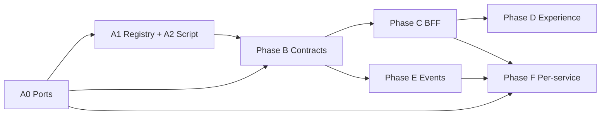

# Agent-led full-stack completeness roadmap

This document captures the **execution-oriented** roadmap for closing gaps across **backend → contracts → BFF → Experience → integration hooks**, aligned with the Health OS experience doctrine ([`docs/doctrine/health-os-doctrine.md`](../doctrine/health-os-doctrine.md)). It is tuned for **implementation by AI agents (e.g. Cursor) with optional parallelization**, not for calendar-week estimates of a human-only team.

---

## Context (why this exists)

- **Doctrine:** One governed runtime, one experience shell, intelligent and searchable surfaces where applicable (see doctrine §2, §2a, §12–14).
- **Gaps addressed:** Contract inventory vs services, port/URL drift, BFF vs downstream consistency, Experience placeholders vs real `/internal/v1` wiring, implicit Kafka/event boundaries, uneven OpenAPI/springdoc coverage.

Prior strategic framing (success criteria, phases A–F playbook) remains valid; this file **replaces calendar timelines** with **agent cycles** and **explicit parallelization rules**.

---

## Execution model

| Mode | Use when |
|------|----------|
| **Single agent thread** | One service end-to-end (port + contract + BFF + UI + smoke) to avoid merge conflicts. |
| **Parallel agents** | **Disjoint** work: different files, different services, different layers **after** Phase A0 artifacts exist (registry + port matrix as **one merged PR** first). |

**Repository rule:** One **mergeable unit** per agent — **atomic commits**, one logical change per commit ([`CLAUDE.md`](../../CLAUDE.md)). Parallel work must not touch the same `application.yml` / compose file without coordination.

---

## Phases (agent-time, not “weeks”)

Phases are ordered by **dependency**. **Agent cycles** = bounded agent run + human review + merge. They are **order-of-magnitude**, not wall-clock for part-time work.

| Phase | Scope | Parallel? | Agent cycles (order of magnitude) |
|-------|--------|------------|-------------------------------------|
| **A0** | Port matrix doc + align defaults (or env-only ports) + fix worst collisions | **Serial first** (one authoritative file set), then parallel per-service YAML if split by service | **1–2** cycles if only top collisions; **2–4** if normalizing most services |
| **A1** | Service registry (YAML) + small generator script for completeness report | After A0 schema frozen | **1** cycle |
| **A2** | Completeness script (seven dimensions) + CI optional job | With A1 once paths known | **1** (completed 2026-04-11) |
| **B** | Contracts: policy + backfill **per domain** (TSHEPO, registry, clinical, finance, data, knowledge) | **Yes — one agent per domain** once naming convention locked | **~1 cycle per domain** for first pass; **+1** per domain if Spectral + sample contract tests added |
| **C** | BFF: route map doc + client normalization **per domain** | Parallel **per domain** after B contracts for that domain exist | **~1–2 cycles per domain** |
| **D** | Experience: remove placeholders, wire search, public-health hardening | Parallel **per feature** (search vs public-health vs friction) | **1 cycle** per major feature slice |
| **E** | Event catalog + AsyncAPI or schema table for Kafka surfaces | Parallel **per bounded context** (e.g. clinical vs finance outbox) | **1–2** cycles total if starting with inventory + highest-traffic topics, not exhaustive day-one |
| **F** | Per-service playbook to “green” in completeness report | **Highly parallel — one agent per service** once A–E patterns exist | **~0.5–1 cycle** per small service; **2–4 cycles** for TSHEPO, BUTANO stack, or BFF-heavy surfaces |

**Baseline credible** (A0–A2 + one contract domain + matching BFF + one smoke): often **~3–6** agent cycles with review.

**Most Tier-1 services green:** scales with **number of agents × merge rate**, dominated by **review throughput** and **test stability**, not typing speed.

---

## Seven assessment dimensions (for A2 script and F playbook)

Each service (or product cluster) should be scored **None / Stub / Partial / Substantial / Production-grade** on:

1. **Backend** — Boot app, Flyway, domain logic, tests, Helm/Docker.
2. **BFF integration** — Typed `*Client` or deliberate proxy; `impilo.services.*`; trust header forwarding.
3. **Contracts** — `contracts/openapi/*.yaml` and/or AsyncAPI / documented FHIR-only boundary.
4. **Public APIs** — REST surface + `springdoc-openapi` where REST applies.
5. **Hooks (integration)** — Kafka listeners, outbox, webhooks, gRPC (e.g. TSHEPO authz).
6. **Hooks (experience)** — TanStack Query hooks under `ui/experience/src/hooks/**` calling `/internal/v1/...`.
7. **One UI / Experience** — Routes in `ui/experience` completing a governed journey (or explicit ops-only waiver).

---

## Parallelization map (example schedule)

```text
Cycle 1 (serial):     A0 port matrix + compose/env alignment (merge first)

Cycle 2 (parallel):   Agent-1: A2 completeness script skeleton
                      Agent-2: B-clinical OpenAPI deltas (pct/oros/pharmacy)
                      Agent-3: B-registry OpenAPI stubs (varapi/tuso/zibo/ubomi)

Cycle 3 (parallel):   Agent-1: B-registry (varapi/tuso/zibo/ubomi)
                      Agent-2: B-finance (coverage + mushex + costa alignment)
                      Agent-3: C-BFF route map + one domain client cleanup

Cycle 4 (parallel):   Agent-1: D-search vertical (BFF route + hook + page)
                      Agent-2: D-public-health (wire or feature-flag)
                      Agent-3: E event inventory slice-1

Cycle 5+ (parallel):  F: pick N services from report; N agents; strict file ownership per service
```

---

## Operating rules (parallel agents)

1. **Merge A0 first** — port and compose (or env) truth before wide parallel edits.
2. **Contract naming convention** locked in one short contributor note or registry README (one small PR).
3. **Per-agent file ownership** in the task prompt (e.g. only `services/coverage-service/**` and `contracts/openapi/coverage.openapi.yaml`).
4. **CI:** completeness job **informational** until baseline, then flip **required** service-by-service.
5. **End of every wave:** **commit** (conventional, scoped) → **`git pull --rebase`** (or project-standard pull) → **`git push`**. Documented in [`CLAUDE.md`](../../CLAUDE.md) under **Wave completion**.

---

## Per-service “total fix” playbook (Phase F)

For each registry row, same order every time:

1. Ports — align to matrix.
2. Contract — OpenAPI / AsyncAPI / FHIR-only doc.
3. Backend — match contract; Flyway; tests.
4. springdoc — on if REST; off with documented reason if not.
5. BFF — client + controller slice + error mapping.
6. Experience — hook + page (or ops-only waiver).
7. Smoke — one automated path in CI compose profile.

Prioritize **sovereign nine** + high-traffic clinical and finance paths (PCT, OROS, Pharmacy, Document, Costa, Mushex, Coverage) first.

---

## Dependencies (what not to parallelize blindly)

- **A** before honest local dev and reporting.
- **B** before **C** for the same domain (unless C is documentation-only).
- **C** before **D** for routes that do not exist yet.
- **E** can overlap **B** once topic naming is fixed.



---

## Next concrete step

**A0 (done):** authoritative port matrix and aligned defaults — see [`docs/runbooks/port-allocation.md`](../runbooks/port-allocation.md).

**A1 (done):** service registry — [`docs/registry/services-registry.yaml`](../registry/services-registry.yaml); regenerate tables with `cd scripts/registry && npm install && npm run generate` (see [`docs/registry/README.md`](../registry/README.md)).

**A2 (done):** seven-dimension completeness report — `scripts/completeness` (`npm run report`) → `docs/reports/completeness-report.{json,md}`; CI job **Completeness report (informational)** uploads artifacts (see `.github/workflows/ci.yml`).

**Phase B (in progress):** OpenAPI baselines under [`contracts/openapi/`](../../contracts/openapi/) — registry slice (VARAPI, TUSO, UBOMI) landed; **+** INDAWO, Product Registry, Coverage, Guidance, Clinical Knowledge Platform; **+** Search, Forms, Notification, Rules; **+** registry mapping fixes (`costing-engine-service` → COSTA contract, `butano-fhir` module key); **+** workflow, integration-hub, FHIR gateway control plane, data governance, surveillance, campaigns. Remaining: trust/TSHEPO decomposition, more integration adapters, FHIR-only narrative for BUTANO stack.

**Phase C (started):** downstream index — [`docs/architecture/experience-bff-downstream-route-map.md`](../architecture/experience-bff-downstream-route-map.md) (expand per-controller paths next).

**Next:** extend Phase B for remaining REST modules; Phase C — normalize BFF paths vs contracts per domain and add controller-level route tables.

---

## Document history

| Date | Change |
|------|--------|
| 2026-04-11 | Initial agent-led roadmap (retimed phases, parallelization, operating rules). |
| 2026-04-11 | Phase A0 completed: linked `docs/runbooks/port-allocation.md`. |
| 2026-04-11 | Operating rule 5: wave end = commit → pull --rebase → push (`CLAUDE.md`). |
| 2026-04-11 | Phase A1: `docs/registry/services-registry.yaml` + Node generator (`scripts/registry`). |
| 2026-04-11 | Phase A2: `scripts/completeness` + `docs/reports/` + informational CI artifact job. |
| 2026-04-11 | Phase B (slice): OpenAPI baselines for registry plane VARAPI, TUSO, UBOMI (`contracts/openapi/`). |
| 2026-04-11 | Phase B (slice): INDAWO, Product Registry, Coverage, Guidance, Clinical Knowledge Platform OpenAPI baselines. |
| 2026-04-11 | Phase B: Search, Forms, Notification, Rules OpenAPI; completeness mapper fixes (BUTANO/COSTA module keys, Extension client for forms/rules). |
| 2026-04-11 | Phase C seed: `docs/architecture/experience-bff-downstream-route-map.md`. |
| 2026-04-11 | Phase B: workflow, integration-hub, FHIR gateway, data governance, surveillance, campaigns OpenAPI baselines. |
