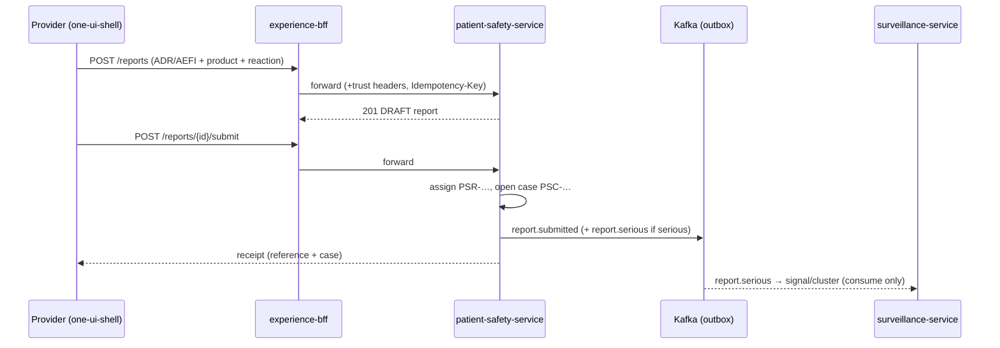
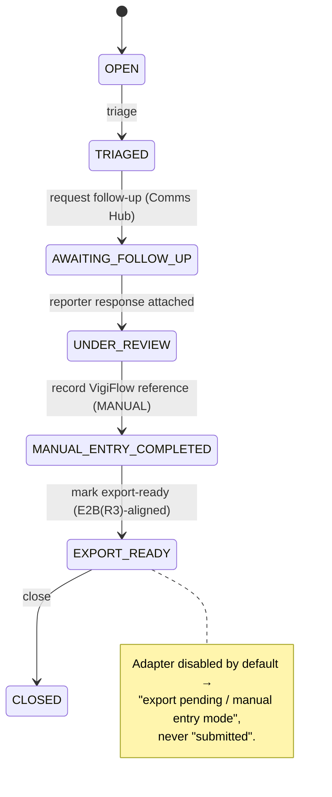
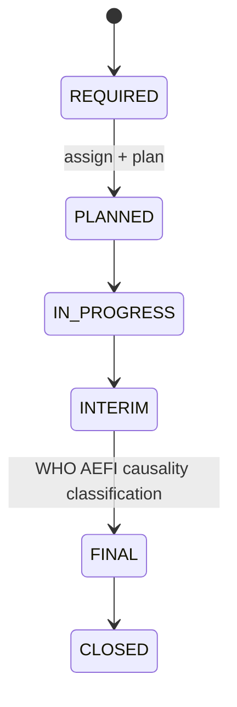

# Patient Safety & Pharmacovigilance Service

> **Status:** PoC for MCAZ requirements refinement. vNext-native, end-to-end, architecturally
> honest. **No faked external submission anywhere in this build.**

`patient-safety-service` is the system of record for regulated pharmacovigilance: adverse drug
reaction (ADR) and adverse event following immunisation (AEFI) reports, the regulatory safety cases
they open, seriousness/outcomes, the MCAZ review workbench, **manual** VigiFlow submission tracking,
E2B(R3)-**aligned** export readiness, follow-up requests and serious-AEFI investigations.

- **Port:** 8202 · **DB:** `impilo_patientsafety` · **Package:** `zw.gov.mohcc.impilo.patientsafety`
- **Base path:** `/internal/v1/patient-safety/**` · **Events:** `impilo.patient_safety.*.v1`
- **BFF:** `experience-bff` proxies the same paths (port 8160) + a `/prefill` view and a public
  citizen endpoint `/v1/public/patient-safety/reports`.

## Service boundary (owns vs consumes)

| Concern | Owner |
|---|---|
| Safety reports, cases, seriousness, outcomes, case review, MCAZ status, VigiFlow id, manual-entry tracking, E2B export readiness, follow-up, investigations, safety domain events | **patient-safety-service (this)** |
| Versioned ADR/AEFI/investigation form packs | forms-service |
| Conversations / inbound / replies / escalation (Comms Hub) | channels-service (this service stores only its own `ps_conversation_link` reference) |
| Proactive solicitation cohorts | campaigns-service |
| Send engine | notification-service |
| External dispatch / transforms / retries / dead-letters / adapters | integration-hub |
| Signal / cluster detection (consumes selected safety events) | surveillance-service |
| Attachment binaries | document-service |
| Patient / provider / facility / product context (prefill) | VITO / VARAPI / TUSO / PCT / pharmacy / product-registry |

Distinct from **rito-service** (general quality & client voice): a medicine/vaccine/device adverse
reaction is ours; a general complaint/quality/experience signal is Rito's. See the coordination memo
in the sprint notes.

## Domain model (`ps_*`)

```
ps_safety_report ──┬─ ps_product_exposure   (suspect / concomitant drug or vaccine)
                   ├─ ps_safety_event       (reactions; severity, outcome)
                   └─ ps_attachment_ref      (document-service objectId)
        │ (submit opens a case 1:1)
        ▼
ps_safety_case ────┬─ ps_case_action         (auditable timeline)
                   ├─ ps_follow_up_request ── ps_follow_up_response
                   ├─ ps_aefi_investigation
                   ├─ ps_vigiflow_submission  (entry_mode = MANUAL)
                   ├─ ps_e2b_export_attempt   (adapter_enabled default false)
                   └─ ps_conversation_link    (channels-service session ref)
ps_event_outbox · idempotency_keys           (v1.1 transactional outbox + idempotency)
```

### Lifecycles

- **Report:** `DRAFT → SUBMITTED → NEEDS_MORE_INFORMATION → UNDER_REVIEW → ESCALATED → DUPLICATE/INVALID/CLOSED`
- **Case:** `OPEN → TRIAGED → FOLLOW_UP_REQUESTED → AWAITING_FOLLOW_UP → READY_FOR_VIGIFLOW → MANUAL_ENTRY_COMPLETED → EXPORT_READY → DISPATCH_PENDING/FAILED → ACKNOWLEDGED/REJECTED/CLOSED`
- **Investigation:** `NOT_REQUIRED → REQUIRED → PLANNED → IN_PROGRESS → INTERIM → FINAL → CLOSED`

Reference codes: reports `PSR-YYYY-######`, cases `PSC-YYYY-######`, investigations `PSI-YYYY-######`.

## Internal API (`/internal/v1/patient-safety`)

All mutations require the v1.1 trust headers (`X-Tenant-ID`, `X-Pod-ID`, `X-Request-ID`,
`X-Correlation-ID`) **and** an `Idempotency-Key` (enforced by tech-companion).

| Method | Path | Purpose |
|---|---|---|
| POST | `/reports` | create draft (optional nested products/events) |
| GET | `/reports?status=&reporter_actor_id=&facility_id=` | list (my-reports / facility dashboard) |
| GET | `/reports/{id}` | full report with children + opened case ref |
| PATCH | `/reports/{id}` | edit a draft / needs-more-info report |
| POST | `/reports/{id}/products` · `/events` · `/attachments` | add children |
| POST | `/reports/{id}/submit` | assign reference, open case, emit events |
| GET | `/cases?status=&priority=` · `/cases/{id}` | list / case detail (timeline, follow-ups, vigiflow, export, investigation) |
| POST | `/cases/{id}/triage` | priority + reviewer + status TRIAGED |
| POST | `/cases/{id}/review-actions` | note / status change / WHO-UMC causality |
| POST | `/cases/{id}/follow-up` | issue follow-up (Comms Hub), AWAITING_FOLLOW_UP |
| POST | `/cases/{id}/follow-up/{fid}/response` | attach reporter response |
| POST | `/cases/{id}/vigiflow-manual-entry` | record **manual** VigiFlow reference id |
| POST | `/cases/{id}/mark-export-ready` | build E2B(R3)-aligned package (honest adapter status) |
| POST | `/cases/{id}/close` | close |
| GET | `/mcaz/workbench` · `/mcaz/incoming-queue` · `/mcaz/priority-queue` | regulator queues + counts |
| POST | `/cases/{caseId}/investigation` · GET · PATCH `/investigations/{id}` | serious-AEFI investigation |
| GET | `/config/vigimobile-links` · `/config/adapters` | external link-outs + honest adapter posture |

## Events (outbox → Kafka, dual-emit)

`report.submitted`, `report.serious` (consumed by surveillance for signal/cluster), `case.opened`,
`case.triaged`, `case.follow_up_requested`, `case.follow_up_received`, `case.vigiflow_recorded`,
`case.export_ready`, `investigation.opened`, `investigation.updated` — all under
`impilo.patient_safety.*.v1`.

## BFF + UI

- **BFF** (`experience-bff`): `PatientSafetyServiceClient` + `PatientSafetyController` proxy the SoR;
  `/internal/v1/patient-safety/prefill?cpid=` composes recently-dispensed medicines (pharmacy-service)
  with the VigiMobile links + adapter posture; `PatientSafetyPublicController` backs the citizen path.
- **one-ui-shell** `/work/patient-safety`: provider home, `new` ADR/AEFI capture→receipt, report
  detail, `mcaz` workbench, `cases/[caseId]` review + actions.
- **self-service** `/report-side-effect`: citizen/caregiver guided report → public endpoint.

## Journeys

### Provider ADR/AEFI → MCAZ case



### MCAZ review → follow-up → manual VigiFlow → export-ready



### Serious AEFI investigation



## Honesty posture (product-truth: no-stub)

- **No faked VigiFlow submission.** `entry_mode` is always `MANUAL`; the reference id is what an MCAZ
  officer pastes back after keying the case into the external VigiFlow system.
- **No "certified/validated E2B(R3) transmission".** Packages are labelled `E2B_R3_ALIGNED`; the
  export attempt carries `adapter_enabled` (default **false**) and an honest message
  ("Adapter not configured — manual entry mode …").
- **VigiMobile QR/URL = external WHO-UMC/VigiFlow eForm link-out.** The config surface carries a
  disclaimer that Impilo does not receive those submissions without a callback adapter.
- **integration-hub owns external dispatch.** This service never performs live external submission;
  the adapter list (`/config/adapters`) reflects what is connected (all DISPATCH adapters default OFF).

## Known limitations / next for MCAZ refinement

See [`docs/services/patient-safety-known-limitations.md`](patient-safety-known-limitations.md).
