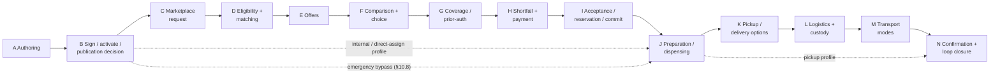
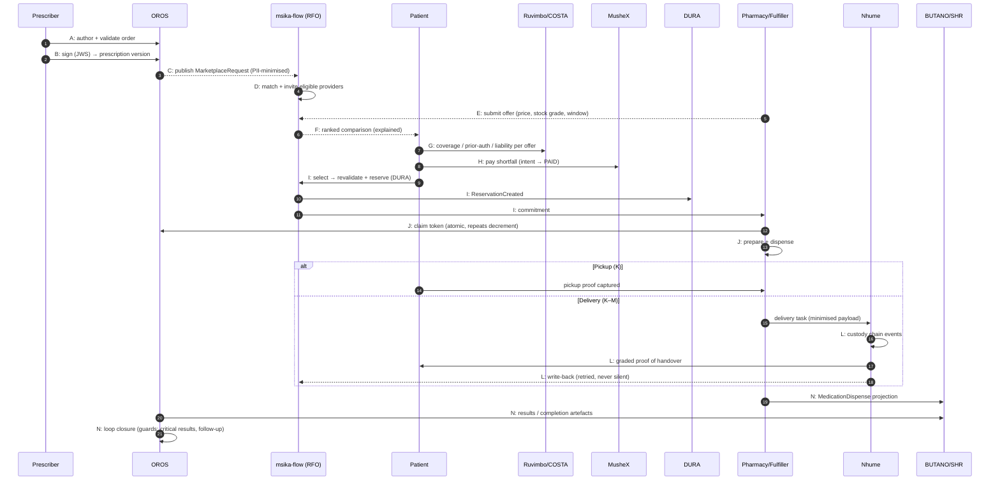
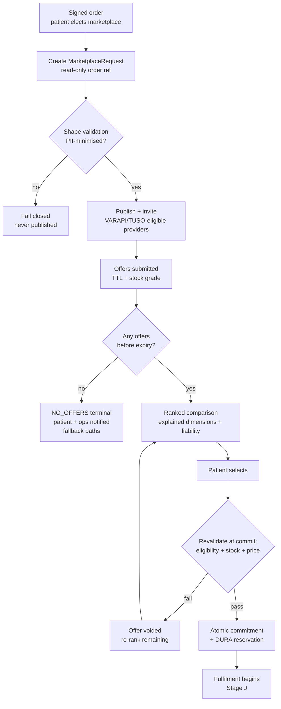
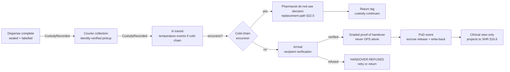
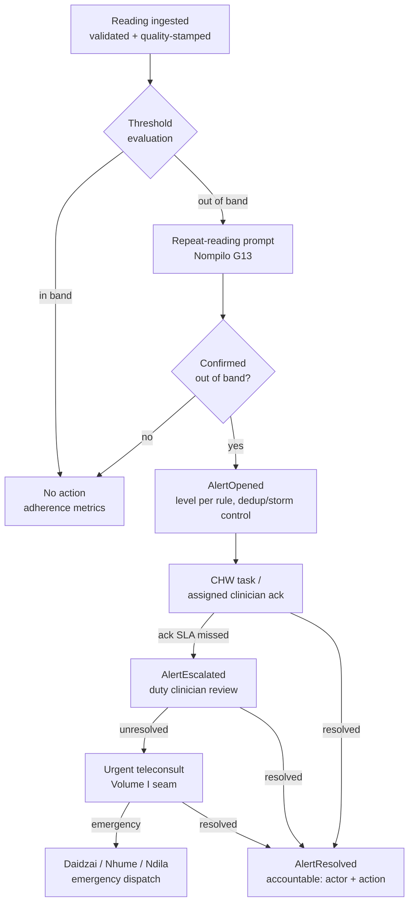
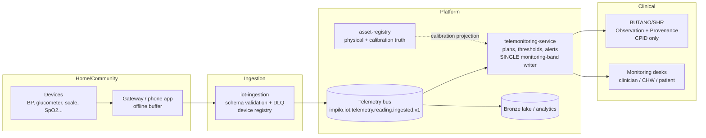

# Impilo Platform vNext — National e-Orders, e-Prescription, Fulfilment Marketplace, Coverage, Logistics, Community Telemonitoring and IoT

## Volume II of the National Telemedicine & Virtual Care Specification Pack

---

## 1. Document Control

| Field | Value |
|---|---|
| Title | Impilo Platform vNext — National e-Orders, e-Prescription, Fulfilment Marketplace, Coverage, Logistics, Community Telemonitoring and IoT: Full Functional, Clinical, UX and Technical Implementation Specification |
| Volume relationship | **Volume II** of the National Telemedicine & Virtual Care specification pack. Co-normative with [Volume I](NATIONAL_TELEMEDICINE_VIRTUAL_CARE_SPECIFICATION.md). The pack shares ONE traceability matrix, ONE backlog, ONE journey catalogue and ONE open-decision register across both volumes. |
| Owner | Impilo vNext Platform Programme (order spine: OROS product ownership; marketplace: Msika; coverage: Ruvimbo; logistics: Nhume; telemonitoring: clinical plane) |
| Status | **CANONICAL — NORMATIVE** for e-order, e-prescription, fulfilment-marketplace, coverage-resolution, payment, logistics, telemonitoring and health-IoT product, design and engineering work. Implementation-status claims are evidence-graded (see §25 pointer and the [traceability matrix](telemedicine-traceability-gap-matrix.md) §4). |
| Version | 1.0.0-draft (Wave 0 scaffold — sections marked `[AUTHORING]` are reserved and not yet normative) |
| Effective date | 2026-07-23 |
| Scope note | Clinical orders arise from **all** encounter types — in-person, ward, theatre, discharge, chronic review, community visit, remote-monitoring alert, standing protocol, and teleconsultation. Volume I's teleconsultation is ONE originating context of this pipeline, not its owner. |
| Composes with (cites, never duplicates) | [`docs/marketplace/msika-health-marketplace.md`](../marketplace/msika-health-marketplace.md) · [`docs/architecture/nhume-dispatch-and-delivery.md`](../architecture/nhume-dispatch-and-delivery.md) · [`docs/product/ruvimbo-coverage-specification.md`](../product/ruvimbo-coverage-specification.md) · [`docs/supply-iot-platform/README.md`](../supply-iot-platform/README.md) · [`docs/assets/asset-device-iot-discovery.md`](../assets/asset-device-iot-discovery.md) · [`docs/doctrine/health-os-doctrine.md`](../doctrine/health-os-doctrine.md) (§16 identifier doctrine, §17 device/IoT doctrine) · [`docs/registry/system-of-record-map.md`](../registry/system-of-record-map.md). Where any cited document conflicts with this volume, registry constraints win on ownership and `identity-trust-contract.md` wins on identifier semantics (Volume I §1 precedence rule). |
| Normative status | RFC-2119 keywords **MUST/MUST NOT/SHOULD/MAY**. Implementation-status tags: `[LIVE]` runtime-proven · `[BUILT]` code-verified · `[PARTIAL]` · `[CONFIG-ONLY]` · `[ABSENT]` · `[PENDING-POLICY]`. |
| Change control | Pull request against this file on the canonical branch; identifier/consent/ownership language changes additionally sign off against `identity-trust-contract.md` and `services-registry.yaml` (Volume I rule applies pack-wide). |

### 1.1 Commissioning-instruction → section map (completeness contract)

The commissioning instruction ("ADDITIONAL MAJOR DOMAIN", 2026-07-23) prescribes nineteen content areas. Each maps to exactly one normative home:

| Instruction § | Content | Volume II home |
|---|---|---|
| 1 | Product doctrine | §4 (with instruction §19 critical constraints as doctrine invariants) |
| 2 | Platform service ownership | §6 |
| 3 | Canonical identifiers and core objects | §5 |
| 4 | Order and prescription types | §7 |
| 5 | End-to-end pipeline stages A–N | §8 (detail volumes: §10 coverage/payment, §11 marketplace, §12 logistics) |
| 6 | E-prescription safety, legality, anti-fraud | §13 |
| 7 | State machines | §9 |
| 8 | Community telemonitoring | §14 |
| 9 | IoT architecture | §15 |
| 10 | Clinical and IoT data mapping (FHIR) | §16 |
| 11 | Frontend and mobile experiences | §20 |
| 12 | Notifications and Nompilo guidance | §19 |
| 13 | Analytics, quality and market fairness | §21 |
| 14 | Required domain events | §18 |
| 15 | Failure modes and recovery | §22 |
| 16 | End-to-end test journeys | §23 → [journey catalogue](telemedicine-journey-catalogue.md) #41–#70 |
| 17 | Implementation truth recovery | §25 → [traceability matrix](telemedicine-traceability-gap-matrix.md) §4 (R41+, OF-G*) |
| 18 | Implementation backlog | §26 → [backlog](telemedicine-implementation-backlog.md) OF-B1..OF-B30 |
| 19 | Critical constraints | §4.9 (verbatim-or-stronger doctrine invariants) |

### 1.2 Reserved namespaces (locked in this Wave-0 commit)

- **Epics:** `OF-B1`..`OF-B30` in the shared [backlog](telemedicine-implementation-backlog.md) (titles reserved in §26 below; blocks authored Wave 3).
- **Gap refs:** `OF-G1`.. in the shared matrix; **requirement rows:** `R41`.. continuing the single monotonic namespace.
- **Journeys:** `#41`–`#70` in the shared [journey catalogue](telemedicine-journey-catalogue.md).
- **Open decisions:** `OD-11`+ appended to the pack-wide register in Volume I §32.
- **Handoffs:** `HO-7`+ (HO-1..HO-6 taken by Volume I workstreams).

---

## 2. Executive Summary

A teleconsultation, ward round, discharge, chronic review or community visit is not complete when advice is written: the clinical decision MUST execute. This volume specifies the national **order-to-outcome pipeline** — authorised orders and prescriptions, regulated provider discovery and offers, coverage and shortfall resolution, payment, preparation and dispensing, pickup or tracked delivery with chain of custody, result and dispense documentation, follow-up, reconciliation and permanent SHR linkage — as ONE reusable orchestration framework with clinically appropriate profiles per order category (§7), plus the community-telemonitoring and health-IoT programme (§14–§15) that keeps the loop closed at home. Volume I's teleconsultation is one originating context of this pipeline, not its owner; the same pipeline serves every encounter type. Where [Volume I](NATIONAL_TELEMEDICINE_VIRTUAL_CARE_SPECIFICATION.md) governs the consultation, this volume governs what the consultation *sets in motion*, and the two are co-normative under a single traceability matrix, backlog, journey catalogue and open-decision register.

This volume is grounded in a code-verified truth recovery ([traceability matrix §4](telemedicine-traceability-gap-matrix.md), rows R41–R74, evidence sweep 2026-07-23 @ `6074bcbc4`), not in aspiration. The estate already holds a mature order spine, real dispensing, a live marketplace transaction plane, the platform's most complete coverage engine, live payments and a comprehensive logistics machine. The backlog ([OF-B1..OF-B30](telemedicine-implementation-backlog.md)) therefore closes precisely located gaps — the prescription aggregate and signing, the request-for-offer layer, marketplace↔DURA stock wiring, the anti-fraud token, the telemonitoring engine — rather than rebuilding what exists. The doctrine of §4 and the constraint invariants of §4.9 exist to protect that inheritance: nothing downstream of a clinical order may ever weaken, mutate or impersonate it.

| Already real (evidence-graded) | The gaps this volume closes |
|---|---|
| OROS clinical-order spine: 13-status guarded machine, order lines, TELECONSULT source, duplicate guard `[BUILT — R41]` (spine `[LIVE]` for lab/imaging/pharmacy/blood) | Order-level clinician signing — `placed_by` is a plain string, edge-authz only `[ABSENT — R42/OF-G1]`; order amendment as immutable versions `[ABSENT — R43/OF-G2]` |
| Pharmacy dispensing SoR: batch/expiry, FEFO, partial fill, substitution rules, stock movements, pickup proofs `[BUILT — R46]` | E-prescription aggregate — legacy `rx_prescriptions` is flat, single-med, unsigned, no repeats/expiry/controlled flag `[PARTIAL — R44/OF-G3]`; prescription↔dispense linkage and atomic claim `[ABSENT — R45/OF-G4]` |
| Msika catalogue/listings/storefronts/vendor onboarding, server-resolved prices, real MusheX/Nhume seams `[LIVE — R50]` | Request-for-offer machinery (request → invitations → offers) `[ABSENT — R51/OF-G8]`; offer lifecycle with TTL/revalidation `[ABSENT — R52/OF-G9]`; patient offer-comparison experience `[ABSENT — R53/OF-G10]` |
| DURA sovereign reservation ledger `inv_stock_reservations` + batch lots `[BUILT — R56]` | Marketplace stock wiring — local placeholder reservations, no-op inventory consumer `[MOCKED at marketplace — R56/OF-G12]`; stock-attestation grading `[PARTIAL — R57/OF-G12]` |
| Ruvimbo coverage: eligibility/benefits/accumulators `[BUILT — R58]`, 14-status prior-auth with appeals `[BUILT — R59]`, 21-status claims with COB `[BUILT — R61]` | Per-offer patient liability in the selection flow — engine built, wired to no checkout `[PARTIAL — R60/OF-G13]`; payer formulary and ZIBO medicine registry `[ABSENT — R62/OF-G14]` |
| MusheX payment intents, refunds, settlement `[LIVE — R63]` | Escrow hold-until-handover for fulfilment — machinery built for campaigns, not wired to proof-of-delivery `[PARTIAL — R64/OF-G13]` |
| Nhume logistics: 24-status machine, multi-cargo, custody chain, temperature events, delivery proofs `[BUILT — R65]` | Fulfilment↔delivery write-back is best-effort, failures swallowed to warnings `[PARTIAL — R66/OF-G15]`; drone/alternative modes `[CONFIG-ONLY — R67/OF-G21]` |
| IoT ingestion: device registry, validated telemetry, DLQ, provenance events `[BUILT — R69/OF-G17]`; CHW community workflow with offline idempotency `[BUILT — R71]` | Per-patient telemonitoring engine (plans, thresholds, alert lifecycle) `[ABSENT — R68/OF-G16]`; clinical device assignment and calibration gating `[ABSENT — R70/OF-G18]` |
| Anti-fraud posture: no payment-marks-fulfilment path, no hardcoded prices, durable shipments (matrix §4.1 sweep) | Prescription anti-fraud token `[ABSENT — R48/OF-G6]`; controlled-medicine workflow gating over the built register `[PARTIAL — R49/OF-G7]`; fulfilment FHIR projections `[ABSENT — R73/OF-G19]`; cross-pipeline runtime proof `[ABSENT — R74/OF-G20]` |

## 3. Purpose, Scope and Non-Scope

**Purpose.** This volume is the single canonical, implementation-ready description of order-to-fulfilment execution and community telemonitoring/IoT for the national platform. It exists so that every service, workspace and integration touching a clinical order shares ONE pipeline model, ONE identifier registry, ONE ownership map and ONE evidence-graded view of what is real. Product, design and engineering work in this domain MUST trace to this volume; conflicting local documents are superseded except where [`system-of-record-map.md`](../registry/system-of-record-map.md) (ownership) or `identity-trust-contract.md` (identifier semantics) wins under the Volume I precedence rule.

**Scope.** The following are normatively in scope:

- Clinical orders and prescriptions originating from **all** encounter types — in-person, ward, theatre, discharge, chronic review, community visit, remote-monitoring alert, standing protocol, and teleconsultation (§7, §8).
- The regulated fulfilment marketplace: request-for-offer creation, PII-minimised publication, provider eligibility, offers, comparison, selection and commitment (§11).
- Coverage, benefits, prior authorisation, patient-liability calculation, shortfall resolution and payment (§10).
- Pickup, collection and delivery logistics with chain of custody, proof of handover, cold chain, failed delivery and returns (§12).
- E-prescription safety, legality and anti-fraud controls, including controlled-medicine governance (§13).
- Community telemonitoring programmes: monitoring plans, personalised thresholds, alert lifecycle, CHW workflow, escalation (§14).
- Health-IoT device lifecycle, digital identity, telemetry ingestion, data quality and device security (§15).
- The FHIR mapping, event catalogue, experience surfaces, analytics, failure catalogue and runtime-proof journeys for all of the above (§16–§23).

**Non-scope.** The following are explicitly out of scope and MUST NOT be re-specified here:

- Teleconsultation session mechanics, consent journeys, media-plane behaviour and case state — [Volume I](NATIONAL_TELEMEDICINE_VIRTUAL_CARE_SPECIFICATION.md) governs; this volume consumes the case seam only.
- EMS clinical dispatch internals — Daidzai owns emergency missions; a Nhume delivery is never an EMS mission (§5.3).
- Payer internal adjudication logic beyond the platform contract surface defined in [`ruvimbo-coverage-specification.md`](../product/ruvimbo-coverage-specification.md).
- General retail commerce — Msika's non-clinical commerce is governed by [`msika-health-marketplace.md`](../marketplace/msika-health-marketplace.md); this volume constrains only order-driven fulfilment.
- Population surveillance analytics — surveillance-service owns population alerts, which are distinct from clinical AlertEpisodes (§5.3).
- Wellness self-tracking — simba-service retains the wellness observation path; this volume governs clinical monitoring only (§6).

## 4. Product Doctrine and Critical Constraints

The fourteen doctrine clauses of the commissioning instruction §1 are normative product law for this domain. They are grouped below (§4.1–§4.8); the instruction §19 critical constraints are restated as testable invariants in §4.9. Every clause binds every service in §6 and every stage in §8.

### 4.1 A clinical order is a regulated instruction

A clinical order or prescription **IS** a regulated clinical instruction issued under professional authority, consent and audit — never a shopping-cart line, never a message, never a UI artefact. It carries: an authorised issuer with verifiable professional standing (VARAPI), a clinical subject (CPID), a purpose of use, a guarded lifecycle, and permanent provenance. Consequences:

- Every order MUST flow through the trust plane like any clinical act; no ordering-specific authz bypass exists or may be created.
- The order/prescription is the **clinical source instruction**. Offers, payments, reservations, deliveries and claims are downstream execution artefacts; none of them MUST ever alter the clinical content of the source instruction. Amendment happens only by the authorised clinical actor, as a new immutable version (§9.2) — in-place mutation of order content is prohibited `[ABSENT today — R43/OF-G2; versioning is a build obligation, not an option]`.
- An unsigned prescription is not a prescription. The legacy `rx_prescriptions` silo (unsigned, single-medication, status flips with zero stock effect) is a deprecated namespace `[PARTIAL — R44/OF-G3]` and MUST NOT be extended; the OROS prescription aggregate with detached-JWS signing `[ABSENT — R42/OF-G1]` replaces it.

### 4.2 The identifier-distinction rule

An order id is not a prescription id, is not an offer id, is not a claim id, is not a payment id, is not a fulfilment id, is not a shipment id. Each identifier class in §5 has exactly one issuer, one purpose and one lifecycle, and they are joined by explicit references — never by reuse, embedding or derivation. The bare term "OrderId" is banned platform-wide (§5.3): `ClinicalOrderId` (OROS) and `MarketOrderId` (msika-flow) are different objects with different owners. This rule is already respected at the boundary the estate has built — ULID order ids and UUID delivery ids occupy distinct namespaces (matrix §4.1: "Order IDs reused as shipment IDs — **None**") — and MUST remain invariant as the net-new identifier families of §5 are minted.

### 4.3 Provider-fulfilment eligibility — the six preconditions

A provider or vendor MUST satisfy **all six** preconditions before it may see an invitation, lodge an offer, or be committed to fulfil (revalidated at offer time AND at commitment — `[PARTIAL — R54/OF-G11]`, the per-offer revalidation loop is a build obligation):

| # | Precondition | Authority |
|---|---|---|
| 1 | Verified professional registration with an **active licence in the class the order category requires** (e.g. dispensing authority for Category A) | VARAPI |
| 2 | Scope of practice matching the order's items — a licence class alone does not confer authority over every item (controlled schedules, compounding) | VARAPI + ZIBO coding |
| 3 | A verified, currently **operational** premises of the required type (pharmacy, laboratory, collection point) with truthful hours and geolocation | TUSO |
| 4 | A current employment/affiliation binding the acting professional to that premises — **a licence alone is never facility authority** | VASHANDI |
| 5 | Demonstrated capability grade for order-specific constraints: cold chain, controlled register, compounding, home-service delivery, specimen handling | TUSO capability + DURA controlled register |
| 6 | Regulatory and marketplace good standing: not suspended, not sanctioned, not under quality embargo; vendor risk-friction gates passed `[LIVE — R50]` | VARAPI + Rito + Msika onboarding |

Failure of any precondition at revalidation MUST void the invitation or offer with a recorded reason; it MUST NOT silently drop the provider from view.

### 4.4 Patient choice preserved; emergency orders never auctioned

**Choice.** Where policy and urgency permit, the patient (or authorised caregiver) chooses among eligible offers. The platform MUST present eligible offers fairly (§4.5), MUST explain ranking, MUST NOT pre-select on commercial grounds, and MUST honour the patient's declared preferences (pickup vs delivery, preferred provider, continuity of dispensing). Choice MAY be constrained only by: clinical urgency class (§7), regulated-item routing (controlled medicines, blood products), coverage network rules disclosed to the patient, and geography. Constraint of choice MUST always be visible and reasoned — never silent. The comparison-and-selection experience is a build obligation `[ABSENT — R53/OF-G10]`.

**Emergency.** An order in an emergency urgency class MUST NOT be delayed by marketplace competition, offer windows, payment capture, or prior authorisation. Emergency orders route directly to the designated capable fulfiller under **regulated emergency policies** (pre-agreed tariffs, retrospective coverage resolution, post-hoc reconciliation), with the financial pipeline executing *after* clinical execution — mirroring the emergency financial-bypass policy of §10 and the BLOOD_BANK→MADI sovereign-fulfiller precedent (§7.6). Break-glass access follows the platform emergency-authority model (Volume I §5); every emergency bypass is captured and reviewed.

### 4.5 A regulated request-for-offer — never a cheapest-bidder auction

The marketplace mechanism is a **regulated request-for-offer (RFO)**: a PII-minimised, ZIBO-coded request published to eligible providers, who respond with structured, persistent, TTL-bounded offers `[ABSENT — R51/OF-G8, R52/OF-G9]`. It is NOT an auction. Cheapest-bidder-wins MUST NOT be implemented, displayed, or emergent-by-default. Ranking MUST be multi-dimensional, explainable ("ranked because…" labels), and MUST weigh, at minimum, the following **nineteen ranking dimensions**:

| # | Dimension | # | Dimension |
|---|---|---|---|
| 1 | Clinical completeness of fulfilment (whole order vs partial) | 11 | Coverage network participation and prior-auth compatibility |
| 2 | Item-level match fidelity (exact product vs governed substitution grade) | 12 | Tariff conformance and price transparency (COSTA schedule) |
| 3 | Provider regulatory standing and recency of verification (VARAPI) | 13 | Clinical quality and safety record (Rito clinical-safety indicators) |
| 4 | Premises authority and operational status (TUSO) | 14 | Service reliability (completed-fulfilment ratio, failed-delivery rate) |
| 5 | Capability match: cold chain, controlled register, compounding, home service | 15 | Patient-experience rating (Rito convenience band, displayed separately from safety) |
| 6 | Stock truth grade (DURA-verified > attested > reported; §8E) | 16 | Continuity of care (existing dispensing/fulfilment relationship) |
| 7 | Urgency compatibility (preparation + handover time vs the order's urgency window) | 17 | Accessibility fit (language, disability support, caregiver-collection support) |
| 8 | Distance and delivery-time estimate (Ndila) | 18 | Equity and market-health adjustments (concentration limits, new-entrant fairness — §21) |
| 9 | Delivery-mode availability against the order's delivery constraints | 19 | The patient's own declared preferences |
| 10 | Total patient liability after coverage, per offer (COSTA + Ruvimbo) `[PARTIAL — R60/OF-G13]` | | |

Clinical-safety dimensions (1–7, 13) MUST dominate commercial dimensions in every ranking profile; the fairness policy governing weights and any broadcast mode is OD-12.

### 4.6 Commercial competition never weakens clinical safety; competition is PII-minimised

**Safety envelope.** Competition operates strictly **inside** the regulatory envelope. No commercial mechanism — pricing, ranking boosts, promotions, volume incentives — may weaken clinical safety validation, regulatory eligibility (§4.3), cold-chain requirements, privacy minimisation, or continuity of care. A provider MUST NOT buy visibility that its safety record does not support; Rito's clinical-safety indicators are firewalled from convenience ratings (§21) and MUST NOT be tradeable.

**PII minimisation.** No provider receives patient-identifying or clinical data **merely to decide whether to offer**. RFO invitations carry only: ZIBO-coded order lines, quantity/constraint flags (cold chain, controlled class — noting controlled items are never open-broadcast, §13), a coarse Ndila delivery zone, the urgency class, and the coverage-network hint needed to price `[design settled, rides the RFO build — R55/OF-G8]`. Patient identity, contact details and precise address are disclosed **only after selection and commitment**, at the minimum grade each actor needs: the dispensing pharmacist sees what dispensing law requires; the courier sees a handover name, contact channel and destination — never diagnosis, never medication content (§12).

### 4.7 Governed substitution, partial fill and splitting

Substitution (generic or therapeutic), partial fill, and order splitting across fulfillers are **governed clinical events**, never vendor conveniences:

- Substitution MUST occur only within the governed substitution rules (`rx_substitution_rules` `[BUILT — R46]`), MUST be recorded against the prescription version, MUST be explained to the patient (Nompilo, §19), and — where rules require — MUST obtain prescriber clarification before dispensing.
- Partial fill MUST leave the outstanding balance visible and claimable, decrementing the server-side repeats/quantity ceiling atomically `[ABSENT — R45/OF-G4]`.
- Splitting one order across multiple fulfillers MUST preserve one clinical source instruction with per-line fulfilment status; no fulfiller ever sees more of the order than its committed lines require.

### 4.8 Stock claims are not fulfilment; video-end is not pipeline-end

Claiming stock is not fulfilling an order. Reservation (DURA ledger `[BUILT — R56]`), preparation, handover and completion are **separately tracked states** with separate evidence (§9.6); a reservation that never proceeds to preparation MUST expire and release, and marketplace surfaces MUST NOT present a reservation, an attestation, or a payment as fulfilment. Equally: the end of a video session, the closing of a consultation window, or the payment confirmation is **never** the end of the pipeline. The clinical case (Volume I) and the PCT loop-closure tasks stay open while any order, dispense, delivery, result or monitoring obligation pends; loop closure (§8N) is a clinical act with an artefact, not a timeout.

### 4.9 Critical-Constraint Invariants

The commissioning instruction §19 constraints are restated here verbatim-or-stronger as twenty-three numbered invariants. Each is normative, testable (§24), and enforced by the acceptance criteria of its owning stage. Violation of any invariant is a release blocker.

| # | Invariant | Evidence / anchor |
|---|---|---|
| CC-1 | A prescription MUST NOT exist unsigned in any production path; mock or placeholder prescriptions MUST NOT be created. | Legacy silo confirmed unsigned `[PARTIAL — R44/OF-G1, OF-G3]` |
| CC-2 | Payment success MUST NOT imply clinical fulfilment; no payment event may set a fulfilment, dispense or delivery state. | Clean today (matrix §4.1) — MUST stay clean |
| CC-3 | No offer, payment, reservation, delivery or marketplace event MUST alter the content of a clinical order or prescription. | §4.1; versioning `[ABSENT — R43/OF-G2]` |
| CC-4 | The marketplace MUST NOT be implemented as, degrade into, or default to cheapest-bidder-wins. | §4.5; OD-12 |
| CC-5 | Emergency orders MUST NOT be delayed by marketplace competition, payment capture or prior authorisation. | §4.4; §10 emergency bypass |
| CC-6 | Vendor-attested stock MUST NOT be presented as verified availability; availability and prices MUST be server-resolved, never client-supplied or hardcoded. | Attestation grading `[PARTIAL — R57/OF-G12]`; prices clean `[LIVE — R50]` |
| CC-7 | A stock-reservation ledger MUST NOT be created outside DURA; marketplace rows carry `dura_reservation_id` and never mint reservations. | `[MOCKED at marketplace — R56/OF-G12]` — remediation, not tolerance |
| CC-8 | GPS proximity MUST NOT be accepted as proof of delivery; proof-of-handover grades (§12) require an accountable handover event. | Nhume proof machinery `[BUILT — R65]` |
| CC-9 | A courier or logistics actor MUST NOT receive clinical content, diagnosis, or medication identity beyond what safe transport lawfully requires. | §4.6; §12 task minimisation |
| CC-10 | A ClinicalOrderId MUST NOT be reused as, embedded in, or derived into any shipment, market, payment or claim identifier. | Clean today (matrix §4.1); §5.3 |
| CC-11 | A patient-facing QR or token MUST NOT carry clinical payload; tokens are opaque references resolved server-side. | `[ABSENT — R48/OF-G6]` — build to this shape only |
| CC-12 | Dispense/repeat counters MUST NOT be maintained client-side; a prescription claim MUST be atomic and server-side; a status flip MUST NOT stand in for a stock-effecting dispense. | `[ABSENT — R45/OF-G4]`; legacy flip confirmed (matrix §4.1) |
| CC-13 | Controlled medicines MUST NOT be open-broadcast to the marketplace; their workflow MUST consume the DURA controlled register. | `[PARTIAL — R49/OF-G7]` |
| CC-14 | No provider MUST receive patient-identifying or clinical data merely to decide whether to offer. | §4.6 `[ABSENT — R55/OF-G8]` |
| CC-15 | A parallel marketplace, payer, logistics or IoT identity system MUST NOT be created; all actor, patient, professional and facility identity resolves through TSHEPO/VITO/VARAPI/TUSO. | §6 ownership table |
| CC-16 | An IoT broker, telemetry store or device platform MUST NOT become the clinical record; clinical monitoring facts land in the SHR via the designated writer only. | `[PARTIAL — R72/OF-G16]` — three ad-hoc writer paths to collapse |
| CC-17 | Device readings MUST NOT be silently dropped or silently corrected; data-quality issues are stamped on the reading, never hidden. | Ingest validates + DLQs `[BUILT — R69/OF-G17]` |
| CC-18 | Readings from unassigned, uncalibrated or quarantined devices MUST NOT be presented as clinical truth. | `[ABSENT — R70/OF-G18]` — assignment + calibration gate are prerequisites |
| CC-19 | A monitoring alert MUST NOT be closed without an accountable, recorded action by an identified actor. | §14 mandates from day one `[ABSENT — R68/OF-G16]` |
| CC-20 | No order, prescription, offer, payment, shipment or alert MUST ever silently disappear; every failure path has a visible owner, status and terminal resolution. | §22 failure catalogue; write-back today swallows failures `[PARTIAL — R66/OF-G15]` |
| CC-21 | Offer ranking MUST NOT be hidden, unexplained or commercially biased; Nompilo MUST NOT carry hidden commercial influence and MUST explain substitutions. | §4.5, §19, §21 |
| CC-22 | Experience and BFF layers MUST NOT become sources of truth for any pipeline state; they compose sovereign services only. | Platform law (BFF statelessness); §6 |
| CC-23 | The end of a video session or consultation MUST NOT close the case or the pipeline while any fulfilment, result or monitoring obligation pends. | §4.8; Volume I closure model |

CC-20's honesty rule extends to capability claims: transport modes (including drones) MUST NOT be claimed operational without runtime evidence — capability matrices are configuration, not claims `[CONFIG-ONLY — R67/OF-G21]` (restated normatively in §12).

## 5. Canonical Identifiers and Core Objects

### 5.1 Doctrine basis

The multi-class identifier doctrine of [`health-os-doctrine.md`](../doctrine/health-os-doctrine.md) §16 is binding: every identifier below is an Actor, Context, Object, Transaction, Record or Event id with exactly one issuer, one purpose and one lifecycle. `identity-trust-contract.md` wins on identifier semantics pack-wide (Volume I §1 precedence rule). This section **maps** existing identifiers to their owners and **mints** only the identifiers no service owns today; it never re-mints what exists.

### 5.2 Master identifier registry

Status column: does the identifier exist in the estate today, evidence-graded per the [traceability matrix §4](telemedicine-traceability-gap-matrix.md). Exposure abbreviations: Pt=patient/caregiver, Pr=provider/fulfiller, Py=payer, Co=courier; "QR" = permitted inside a patient-facing QR (only ever as an opaque token wrap, §5.4).

| Identifier | Issuer / Owner | Exists today? | Uniqueness | Public exposure | Lifecycle | Notes |
|---|---|---|---|---|---|---|
| ClinicalOrderId | OROS | `[BUILT — R41]` `oros_orders` | ULID, global | Pr (fulfilment context); Pt as short reference only; never Co | 13-status guarded machine (§9.1) | The clinical source instruction anchor |
| OrderItemId | OROS | `[BUILT — R41]` `oros_order_items` | Unique within order | Pr (committed lines only) | Follows parent order | Per-line fulfilment status lives here |
| PrescriptionId | OROS (target) | `[ABSENT — R44/OF-G3]` | ULID, global | Pt (short ref), Pr, Py | Aggregate root; versions carry content | Legacy `rx_prescriptions` UUIDs = deprecated namespace (§5.3) |
| PrescriptionVersionId | OROS | `[ABSENT — R44/OF-G3]` | Unique per version | Pr (dispensing), Py (claims) | Immutable once signed; superseded by amendment | The signable, dispensable unit (CC-1, CC-3) |
| PrescriptionItemId | OROS | `[ABSENT — R44/OF-G3]` | Unique within version | Pr | Immutable with version | ZIBO-coded medication line |
| RefillAuthorisationId | OROS | `[ABSENT — R45/OF-G4]` | One per version | Pr, Py | Repeats ceiling; decremented atomically server-side (CC-12) | Not a standalone document — the repeats ceiling on the version |
| PrescriptionTokenId | OROS + tshepo-keys | `[ABSENT — R48/OF-G6]` | Single-active per version | Pt (QR-permitted — opaque) | Issued → active → claimed/revoked/expired | No clinical payload ever (CC-11) |
| DispenseOrderId | pharmacy-service | `[BUILT — R46]` `rx_dispense_orders` | UUID, global | Pr (dispensary) | Dispense episode machine (§9.6) | Carries `prescription_version_id` once R45 lands |
| DispenseItemId | pharmacy-service | `[BUILT — R46]` `rx_dispense_order_items` | Unique within dispense | Pr | Follows dispense | Batch/expiry, FEFO, substitution recorded here |
| MarketplaceRequestId | msika-flow | `[ABSENT — R51/OF-G8]` | UUID, global | Pr (invited only) | RFO machine (§9.3) | Read-only reference to ClinicalOrderId; PII-minimised (§4.6) |
| ProviderInvitationId | msika-flow | `[ABSENT — R51/OF-G8]` | One per provider per request | Pr (own invitation only) | Issued → viewed → offered/declined/expired | Eligibility snapshot recorded at issue |
| FulfilmentOfferId | msika-flow | `[ABSENT — R52/OF-G9]` | UUID, global | Pt (comparison), Py (liability calc) | Offer machine w/ TTL + revalidation (§9.4) | Persistent — never ephemeral UI state |
| OfferLineId | msika-flow | `[ABSENT — R52/OF-G9]` | Unique within offer | Pt, Py | Follows offer | Carries substitution grade + stock truth grade |
| OfferSelectionId | msika-flow | `[ABSENT — R52/OF-G9]` | One active per request | Pt (own), Pr (selected) | Selected → revalidated → committed/voided | Idempotent commit anchor (race handling, §8I) |
| CartId | msika-flow | `[LIVE — R50]` `mf_carts` | UUID | Pt (own) | Msika transactional lifecycle | Non-order commerce; never holds a clinical order |
| MarketOrderId | msika-flow | `[LIVE — R50]` `mf_orders` | UUID | Pt (own), Pr (vendor) | Msika order lifecycle | NOT a ClinicalOrderId (§5.3) |
| ReservationId | DURA (inventory-service) | `[BUILT — R56]` `inv_stock_reservations` | UUID, global | Pr (own stock) | Reserved → consumed/released/expired | THE reservation ledger — sole issuer (CC-7) |
| BatchLotId | DURA | `[BUILT — R57]` `inv_batch_lots` | Unique per lot | Pr; Pt on dispense label | Received → available → consumed/recalled/expired | Expiry + FEFO source |
| RecallId | DURA | `[BUILT]` (inventory recall model — R57 context) | UUID | Pr, regulators | Opened → actioned → closed | Joins BatchLotId to affected dispenses |
| ControlledRegisterEntryId | DURA | `[PARTIAL — R49/OF-G7]` (table built, ungated) | Append-only sequence | Regulators; Pr (own register) | Immutable append | Audit spine of the controlled workflow (CC-13) |
| CoverageEligibilityRequestId | Ruvimbo (coverage) | `[BUILT — R58]` eligibility v2 | UUID | Py, Pt (result) | Request → decided | Eligibility ≠ benefit ≠ adjudication (§6) |
| CoverageDecisionId | Ruvimbo | `[BUILT — R58]` | UUID | Pt, Pr, Py | Immutable decision record | Cited by offers and liability estimates |
| PriorAuthorisationId | Ruvimbo | `[BUILT — R59]` `cv_authorisations` | UUID | Pt, Pr, Py | 14-status machine incl. appeals | Line-level via `cv_authorisations_lines` |
| PatientLiabilityId | Ruvimbo (+COSTA charge) | `[PARTIAL — R60/OF-G13]` `cv_liability_estimates` | UUID | Pt (per offer) | Estimated → superseded/confirmed | Per-offer shortfall; wiring into selection is the gap |
| ClaimId | Ruvimbo | `[BUILT — R61]` `cv_claims` | UUID | Py, Pr | 21-status machine, COB waterfall | Financial, never clinical, truth |
| ClaimResponseId | Ruvimbo | `[BUILT — R61]` | UUID | Py, Pr | Immutable adjudication result | FHIR ClaimResponse mapping (§16) |
| PaymentIntentId | MusheX | `[LIVE — R63]` `mushex_payment_intents` | UUID | Pt (own) | Intent → PAID/failed; no two-phase capture | The only object patient payment attaches to |
| PaymentTransactionId | MusheX | `[LIVE — R63]` | UUID per attempt | Pt (receipt) | Attempt-scoped | Many attempts per intent |
| RefundId | MusheX | `[LIVE — R63]` | UUID | Pt | Requested → settled | Joins PaymentIntentId |
| SettlementId | MusheX | `[LIVE — R63]` | UUID | Pr (payee), Py | Batch settlement lifecycle | Reconciliation anchor (§10) |
| TariffId | COSTA | `[BUILT]` (COSTA pricing plane — R60 context) | Versioned code | Pr, Py | Versioned schedule | AHFOZ-derived national schedule |
| EstimateId | COSTA | `[BUILT]` (R60 context) | UUID | Pt, Py | Point-in-time estimate | Input to PatientLiabilityId |
| ChargeSheetId | COSTA | `[BUILT]` (R60 context) | UUID | Pr, Py | Draft → finalised | Facility billing artefact |
| DeliveryId (=ShipmentId) | Nhume | `[BUILT — R65]` `nhume_delivery_*` | UUID, global | Pt (tracking), Co (task), Pr | 24-status machine (§12) | One canonical id — "ShipmentId" is an alias, never a second id |
| PackageId | Nhume | `[BUILT — R65]` | Unique within delivery | Co (label) | Packed → delivered/returned | Multi-cargo support |
| RouteId | Nhume | `[BUILT — R65]` | UUID | Co, dispatcher | Planned → completed | Never exposed to Pt |
| CustodyEventId | Nhume | `[BUILT — R65]` `nhume_chain_of_custody_events` | Append-only | Auditors; Pt (summary) | Immutable append | Incl. temperature events (cold chain) |
| ProofOfHandoverId | Nhume | `[BUILT — R65]` `nhume_delivery_proofs` | One per handover | Pt (receipt), auditors | Immutable | Graded proof — never GPS proximity alone (CC-8) |
| ReturnId | Nhume + pharmacy | `[ABSENT]` (failed-delivery/return governance — R66/OF-G15 context) | UUID | Pr, Co | Initiated → restocked/destroyed | Governs medication return + restock decision |
| SupplyDeliveryId | fhir-gateway (projection) | `[ABSENT — R73/OF-G19]` | FHIR logical id | SHR consumers | Projection of DeliveryId | A **view**, not a second delivery record |
| DeviceId | iot-ingestion | `[BUILT — R69]` `iot.device_registry` | UUID, global | Pr (ops), CHW | Device lifecycle (§15) | Connectivity/digital identity — not physical custody |
| ExternalDeviceId | iot-ingestion | `[BUILT — R69]` | Unique per vendor namespace | Ops only | Follows DeviceId | Manufacturer serial/IMEI; never a join key alone |
| EquipmentId / AssetId | asset-registry | `[BUILT — R70 context]` `asr_equipment` | UUID | Ops, biomed | Physical asset lifecycle incl. calibration | Physical/calibration truth — distinct from DeviceId (§5.3) |
| DeviceAssignmentId | telemonitoring-service (new) | `[ABSENT — R70/OF-G18]` | One active per device | Pr (clinician), CHW, Pt | Assigned → active → returned/lost | The patient↔device↔plan clinical binding |
| MonitoringPlanId | telemonitoring-service (new) | `[ABSENT — R68/OF-G16]` | UUID | Pt, Pr, CHW | Draft → approved → active → completed | Clinician-approved; ordered via the OROS spine (§7.3) |
| ThresholdProfileId | telemonitoring-service (new) | `[ABSENT — R68/OF-G16]` | Versioned per plan | Pr | Versioned with plan | Personalised thresholds — never global-only |
| AlertRuleId | telemonitoring-service (new) | `[ABSENT — R68/OF-G16]` | Unique per profile | Pr | Versioned with profile | Multi-signal rules (§14) |
| AlertEpisodeId | telemonitoring-service (new) | `[ABSENT — R68/OF-G16]` | UUID | Pr, CHW | Raised → acknowledged → actioned → closed (accountable, CC-19) | Clinical — NOT a surveillance population alert (§5.3) |
| MonitoringEpisodeId | telemonitoring-service (new) | `[ABSENT — R68/OF-G16]` | UUID | Pr | Enrolment-to-discharge span | Joins plan, assignments, alerts, SHR writes |
| MonitoringProgrammeId | existing programme constructs | `[BUILT]` (programme registry — platform baseline) | Code | Pr, planners | Programme lifecycle | Reused, not re-minted; plans instantiate programmes |
| TaskId | PCT | `[BUILT — R71 context]` | UUID | Pr, CHW | PCT task lifecycle | Loop-closure and CHW work items |
| EncounterId | PCT | `[BUILT]` (Volume I baseline) | UUID | Pr | PCT encounter lifecycle | Clinical-record event anchor for order provenance |
| SpecimenId / AccessionNumber | OROS (results) | `[BUILT — R41 context]` | Accession unique per lab | Pr (lab), Co (specimen transport label — id only) | Collected → resulted | Label carries id, never clinical indication |
| DiagnosticResultId | OROS (results) | `[BUILT — R41 context]` | UUID | Pr; Pt via release policy | Preliminary → final → amended | Result amendment machinery exists (R43 note) |

### 5.3 Collision rules

The following identifier collisions are settled and MUST be enforced in code review and schema review:

1. **Bare "OrderId" is banned.** Every API, schema, event and UI label MUST say `ClinicalOrderId` (OROS) or `MarketOrderId` (msika-flow). They are different objects, different owners, different lifecycles.
2. **Marketplace rows never mint reservations.** Marketplace and fulfilment rows carry `dura_reservation_id` referencing DURA's ledger; `mf_reservations` is demoted to a projection and MUST NOT be written as truth `[MOCKED at marketplace today — R56/OF-G12]` (CC-7).
3. **Clinical AlertEpisodeId ≠ surveillance population alert.** surveillance-service owns population-level alerting; telemonitoring-service owns per-patient AlertEpisodes. Neither consumes the other's id as its own.
4. **A Nhume delivery is never a Daidzai EMS mission.** Emergency clinical transport is a Daidzai mission with clinical dispatch semantics; Nhume DeliveryId covers goods/specimen/product movement only (§7.5, Category E).
5. **DeviceId (connectivity identity, iot-ingestion) ≠ EquipmentId/AssetId (physical/calibration truth, asset-registry).** The clinical binding between them is DeviceAssignmentId (telemonitoring) — the three-way split of §6.2 applies.
6. **Legacy `rx_prescriptions` UUIDs are a deprecated namespace.** No new references; migration cutover is OD-13. New work joins PrescriptionVersionId only.
7. **"ShipmentId" is an alias of DeliveryId**, never a second identifier; documents MAY use either term but systems store one column.

### 5.4 Construction, exposure and offline rules

- **No embedded meaning.** Identifiers MUST NOT embed diagnosis, medicine, facility-sensitivity or any inferable clinical fact. ULIDs/UUIDs satisfy this; human-meaningful codes (TariffId, MonitoringProgrammeId) MUST be clinically non-sensitive by construction.
- **Patient-facing references are wraps.** The patient sees a short display reference and, where permitted, a QR. The QR wraps an **opaque token** (PrescriptionTokenId pattern, §13) resolved server-side — it is never the internal canonical id and never carries payload (CC-11). Internal anchors (CPID, HID) are never surfaced, per the Volume I identifier vocabulary.
- **Exposure is role-graded.** The exposure column of §5.2 is normative: a payer never sees dispensing operational ids; a courier never sees clinical or prescription ids (CC-9); a provider sees only ids for work committed to it.
- **Offline reconciliation.** Client-originated creates in offline-capable surfaces (CHW visits, dispense capture) MUST carry a `client_offline_id` idempotency key with server-side dedup on replay — the pattern proven in `pct` V019 and referral V050 — so that no offline retry can mint duplicate orders, dispenses or visits.

## 6. Architectural Positioning and Service Ownership

[`system-of-record-map.md`](../registry/system-of-record-map.md) and `services-registry.yaml` are the **binding** ownership registry; this section reconciles the commissioning instruction's ownership contract against them and changes nothing without registry sign-off. Plane values below are the registry's `primary_plane`. No service below may absorb another's row; extend-before-create applies — the single net-new service carries an ownership-exhaustion proof (§6.1).

| Service | Plane | Owns (in this domain) | MUST NOT | Status |
|---|---|---|---|---|
| **OROS** | clinical | Clinical order spine (all categories); prescription aggregate + versions + tokens (target); diagnostics results/accessioning | MUST NOT process payments, host marketplace UI, or manage delivery fleets | Order spine `[BUILT — R41]`; prescription aggregate `[ABSENT — R44/OF-G3]`; signing `[ABSENT — R42/OF-G1]` |
| **MSIKA (core)** | enterprise | Catalogue, listings, storefronts, vendor onboarding, marketplace eligibility, risk friction | MUST NOT alter clinical order content (CC-3); MUST NOT disclose patient data beyond §4.6 minimisation | `[LIVE — R50]` |
| **MSIKA Flow** | enterprise | Transactional plane: RFO requests/invitations/offers/selections; carts; market orders; fulfilment orchestration | MUST NOT mint reservations (CC-7); MUST NOT hold clinical truth; references ClinicalOrderId read-only | Carts/orders `[LIVE — R50]`; RFO `[ABSENT — R51/OF-G8]` |
| **DURA (inventory-service)** | clinical | The sole stock and reservation ledger; batch lots; recalls; controlled register | MUST NOT allow any peer ledger; MUST keep reported ≠ available ≠ reserved ≠ verified as distinct truths | Ledger `[BUILT — R56]`; attestation grading `[PARTIAL — R57/OF-G12]`; controlled gating `[PARTIAL — R49/OF-G7]` |
| **pharmacy-service** | clinical | Dispensing execution SoR: dispense episodes, FEFO, partial fill, substitution execution, pickup proofs | MUST NOT own prescriptions (OROS target); MUST NOT flip status without stock effect (CC-12) | `[BUILT — R46]` (counselling capture absent) |
| **ZIBO** | registry | Terminology; national medicine registry (target) — the coding that prevents free-text products in orders, offers and formularies | MUST NOT be bypassed by free-text product entry anywhere in the pipeline | Terminology baseline; medicine-registry artefact `[ABSENT — R62/OF-G14]` |
| **TSHEPO** (authz/consent/keys/audit) | trust | Authorisation, consent enforcement, break-glass, signing keys, audit chain for every pipeline action | MUST NOT be bypassed by any marketplace/payer/logistics/IoT path (CC-15) | Platform baseline (Volume I); order-signing key use `[ABSENT — R42/OF-G1]` |
| **VARAPI** | registry | Professional authority: registration, licence class, scope incl. dispensing authority (§4.3 preconditions 1–2) | MUST NOT be shadowed by marketplace-local professional records | Baseline live; per-offer revalidation loop `[PARTIAL — R54/OF-G11]` |
| **TUSO** | registry | Facility/pharmacy/lab/collection-point truth: verification, operational status, hours, geolocation, capability grades | MUST NOT be duplicated by vendor-supplied facility claims | Baseline live; per-offer revalidation loop `[PARTIAL — R54/OF-G11]` |
| **VASHANDI** | enterprise | Employment/shift authority binding professionals to premises — **a licence alone is never facility authority** (§4.3 precondition 4) | MUST NOT own professional registration or facility truth (registry `forbidden_responsibilities`) | Baseline live (registry-codified charter) |
| **VITO** | registry | Patient identity resolution; safe fulfilment confirmation (name-grade handover identity) without exposing internal anchors | MUST NOT leak CPID/HID to marketplace, courier or payer surfaces | Baseline live (Volume I identifier vocabulary applies) |
| **BUTANO / SHR** | clinical | The longitudinal record: dispense projections, monitoring Observations, order provenance — CPID-keyed, PII-free | MUST NOT become the transaction engine; MUST NOT receive logistics noise (§16) | FHIR fulfilment projections `[ABSENT — R73/OF-G19]` |
| **PCT** | clinical | Order dependencies, tasks, loop closure; the care pathway that stays open until outcomes land (§4.8, CC-23) | MUST NOT be bypassed by "fire-and-forget" ordering | CHW/community workflow `[BUILT — R71]` |
| **RUVIMBO (coverage)** | enterprise | Coverage SoR: eligibility ≠ benefit ≠ adjudication (three distinct answers); prior auth; claims; COB; liability estimates | MUST NOT price services (COSTA) or move money (MusheX) | `[BUILT — R58/R59/R61]`; liability wiring `[PARTIAL — R60/OF-G13]` |
| **COSTA (costing-engine)** | enterprise | Pricing/tariff truth; charge computation; the patient-liability breakdown input | MUST NOT adjudicate coverage or hold payment credentials | Engine built (R60 context); offer-flow wiring `[PARTIAL — R60/OF-G13]` |
| **MUSHEX** (+ mushe-wallet) | enterprise | Payment intents, transactions, refunds, settlement, reconciliation; wallet escrow | MUST NOT pass payment credentials to clinical services; payment events MUST NOT set fulfilment state (CC-2) | `[LIVE — R63]`; escrow-on-handover wiring `[PARTIAL — R64/OF-G13]` |
| **NHUME** | integration | Dispatch, delivery, custody chain, proof of handover, cold-chain transport, returns | MUST NOT expose clinical content to couriers — minimum-necessary task payloads only (CC-9) | `[BUILT — R65]`; write-back hardening `[PARTIAL — R66/OF-G15]`; drone modes `[CONFIG-ONLY — R67/OF-G21]` |
| **NDILA** | integration | Geospatial truth: zones, distance/ETA, coverage geography for ranking dimension 8 and delivery constraints | MUST NOT receive or expose clinical context in geo queries | Baseline live (public map stack) |
| **KHULUMA** (+ notification-service) | experience / integration | Status communications across the pipeline — PHI-minimised ("your order is ready", never contents on notify surfaces) | MUST NOT include clinical payload in notifications (§19) | Baseline live; pipeline catalogue authored §19 |
| **NOMPILO (guidance-service)** | clinical | Explanation duties: compare offers, explain rankings, explain substitutions, guide next steps | MUST NOT carry hidden commercial influence (CC-21); MUST NOT diagnose | Guidance-registry pattern proven (Volume I); pipeline duties §19 |
| **RITO** | experience | Experience/quality capture; clinical-safety indicators firewalled from convenience ratings; anti-gaming controls | MUST NOT let ratings be bought, traded or gamed (§21) | Baseline live; fairness monitoring authored §21 |
| **DAIDZAI** | experience (registry plane value) — emergency operations | Emergency escalation seam: monitoring alerts and emergency orders requiring EMS response | MUST NOT absorb goods logistics (a delivery is never an EMS mission, §5.3) | Baseline (Volume I escalation ladder) |
| **FUNDO** | — (no registry entry; training domain) | Training/competency content for pipeline roles (dispensers, courier handling certification, CHWs) | MUST NOT gate clinical execution at runtime | Baseline (LMS estate); curricula out of the critical path |
| **telemonitoring-service** | clinical **[new]** | Monitoring plans, threshold profiles, alert rules, AlertEpisodes, DeviceAssignments, MonitoringEpisodes; the sole monitoring-band Observation writer | MUST NOT own device connectivity (iot-ingestion) or physical asset truth (asset-registry); MUST NOT close alerts unaccountably (CC-19) | `[ABSENT — R68/OF-G16]`; writer consolidation `[PARTIAL — R72/OF-G16]` |
| **iot-ingestion** | integration | Device digital identity, telemetry ingestion, validation, DLQ, provenance, trust scoring | MUST NOT become the clinical record (CC-16); MUST NOT silently drop/alter readings (CC-17) | `[BUILT — R69/OF-G17]` (trust scoring heuristic hardcoded) |
| **asset-registry** | integration | Physical asset/equipment truth: custody, maintenance, **calibration** state that gates clinical acceptability of readings | MUST NOT hold telemetry or clinical assignment | `[BUILT — R70 context]` (`asr_equipment`); calibration-gate consumption `[ABSENT — R70/OF-G18]` |

### 6.1 Ownership-exhaustion proof: why telemonitoring-service is net-new

Under extend-before-create, a new service is admissible only when no existing service owns the capability. The per-patient remote-monitoring engine (clinician-approved plans, personalised thresholds, accountable alert lifecycle) was tested against every candidate owner and each fails on its registry charter:

- **simba-service** (enterprise) is wellness-only: self-tracked diet/sleep/fitness with no clinical accountability model; its ingest has no alerting `[R68 evidence]`. Making it clinical would violate its plane and charter.
- **surveillance-service** (data) owns **population** signal detection; it has no per-patient plan, threshold or accountable-closure model, and its alerts are a different identifier class (§5.3 rule 3).
- **iot-ingestion** (integration) is connectivity and telemetry transport; giving it clinical alerting would make an integration-plane broker the clinical decision point (CC-16).
- **inpatient-service** (clinical) owns the ward episode; its EWS is ward-scoped with client-supplied scores `[R68 evidence]` and ends at discharge — precisely where community telemonitoring begins.
- **PCT** (clinical) owns task execution and will carry monitoring *tasks*, but a threshold/alert rules engine is a distinct aggregate with its own lifecycle; embedding it in PCT would recreate the "orchestrator absorbs domain truth" anti-pattern Volume I prohibits.

No existing service owns the capability; therefore telemonitoring-service is minted on the clinical plane `[ABSENT — R68/OF-G16]`, initiated via the OROS order spine (Category C, §7.3), and registered in `services-registry.yaml` before first commit per the registry rules.

### 6.2 The three-way device split

Device truth is deliberately split three ways and MUST stay split: **iot-ingestion** owns the device's *digital* identity and telemetry (DeviceId, validation, DLQ); **asset-registry** owns the device's *physical* truth (EquipmentId/AssetId, custody, maintenance, calibration); **telemonitoring-service** owns the device's *clinical* binding (DeviceAssignmentId: which patient, which plan, which clinician accountable). A reading is clinically presentable only when all three agree — valid telemetry, calibrated asset, active assignment `[ABSENT — R70/OF-G18]` (CC-18).

## 7. Order and Prescription Type Catalogue

Five order categories (A–E) share the single OROS spine and the single pipeline of §8; profiles differ per type in the dimensions tabulated below. "Initiators" are subject to the §4.3 authority checks; "Coverage pathway" refers to §10; "Completion artefact" is the object whose existence closes the fulfilment; "Loop closure" is the PCT obligation that keeps the case open until done (§4.8, CC-23).

### 7.1 Category A — Medication / pharmacy

| Type | Authorised initiators | Minimum clinical data | Validity | Urgency classes | Amend / Cancel / Substitution | Fulfilment actors | Coverage pathway | Delivery constraints | Completion artefact | Loop-closure requirement |
|---|---|---|---|---|---|---|---|---|---|---|
| Acute medication prescription | Prescriber within VARAPI scope for each item | CPID, ZIBO-coded items, dose/route/frequency/duration, indication, allergy-check evidence (§13) | Policy per schedule (national acute validity window on the version) | ROUTINE · URGENT | Amend = new signed version (CC-3); cancel voids unclaimed token; substitution per `rx_substitution_rules` with patient explanation | Licensed pharmacy (§4.3, all six) | Eligibility → benefit → liability per offer; claim on dispense | Pickup, locker, caregiver-collection (with authority), or tracked delivery | Dispense record + pickup/handover proof; MedicationDispense projection `[ABSENT — R73/OF-G19]` | Dispense confirmed on case; adherence follow-up task where plan requires |
| Repeat / chronic prescription | Prescriber; renewal per chronic-care policy | As acute + RefillAuthorisationId ceiling (repeats), review date | Version validity spans the repeats ceiling | ROUTINE | Repeats decrement atomically server-side (CC-12) `[ABSENT — R45/OF-G4]`; early-claim rules policy-gated | Pharmacy; continuity weighting in ranking (dimension 16) | Chronic benefit rules; accumulators `[BUILT — R58]` | As acute; scheduled delivery MAY be standing | Per-claim dispense records until ceiling exhausted | Review-due task raised before final repeat |
| Controlled-medicine prescription | Prescriber holding the controlled-schedule authority (VARAPI) | As acute + controlled flag, schedule class | Shorter statutory validity per schedule | ROUTINE · URGENT | No substitution without prescriber contact; cancellation logged to register | Pharmacies with controlled licence + DURA controlled register; **never open-broadcast** (CC-13) `[PARTIAL — R49/OF-G7]` | Standard, plus payer PA where formulary requires `[ABSENT — R62/OF-G14]` | Identity-verified handover, second factor; no locker | Controlled-register entry + graded handover proof | Register reconciliation; discrepancy = incident (§22) |
| Cold-chain medication / vaccine | Prescriber; vaccination programmes per standing protocol | As acute + storage class, cold-chain flag | Per product stability data | ROUTINE · URGENT · CAMPAIGN | Substitution constrained to equivalent storage class | Cold-chain-capable fulfillers only (§4.3, precondition 5) | Programme-funded or standard pathway | Cold chain end-to-end: temperature custody events `[BUILT — R65]`; excursion = quarantine, never silent | Dispense/administration record + temperature-clean custody chain | Administration recorded to SHR; excursion incidents closed |
| Compounded preparation | Prescriber; compounding pharmacy confirms feasibility | As acute + formula specification | Short, preparation-specific validity | ROUTINE · URGENT | Formula changes = prescriber-approved new version only | Compounding-capable pharmacies (§4.3, precondition 5) | Standard; PA common | Stability-window delivery; may require cold chain | Preparation record + dispense + handover proof | Preparation QA attached before closure |

### 7.2 Category B — Diagnostics

| Type | Authorised initiators | Minimum clinical data | Validity | Urgency classes | Amend / Cancel / Substitution | Fulfilment actors | Coverage pathway | Delivery constraints | Completion artefact | Loop-closure requirement |
|---|---|---|---|---|---|---|---|---|---|---|
| Laboratory order (facility draw) | Clinician within scope; standing protocols | CPID, coded test panel, clinical indication, specimen requirements | Order validity window; specimen stability governs execution | ROUTINE · URGENT · STAT | Amend = new version; cancel before collection; no substitution — test changes are clinical amendments | Licensed laboratory (TUSO type) | Eligibility → liability; claim on resulting | Specimen transport = Category E order, cold chain per analyte | DiagnosticResultId (final) `[BUILT — R41 context]` | Result acknowledged by ordering clinician; abnormal-result task |
| Home specimen collection | Clinician; MAY ride telemonitoring plans | As above + collection-visit constraints | As above | ROUTINE · URGENT | Cancel/reschedule of visit ≠ cancel of order | Accredited collection service + laboratory | As above | Collector carries id-only labels (never indication, §5.4); chain of custody from home | Collection custody chain + DiagnosticResultId | As above + failed-collection retry path (§22) |
| Imaging order | Clinician within scope | CPID, coded modality/protocol, indication, safety screening (contrast, pregnancy) | Order validity window | ROUTINE · URGENT · STAT | Protocol change = amendment; cancel before acquisition | Imaging facility (TUSO capability) | PA common for high-cost modalities `[BUILT — R59]` | Patient transport MAY attach (Category E) | DiagnosticResultId + report | Report acknowledged; critical-finding escalation path |
| Point-of-care / rapid test | Clinician, authorised CHW within scope | CPID, coded test, indication | Immediate execution | ROUTINE · URGENT | Cancel before execution only | Ordering context itself (self-fulfilled) | Programme or standard | None (in-context) | Result recorded at point of care (offline-idempotent, §5.4) | Result on SHR; reflex-order rules MAY fire |

### 7.3 Category C — Procedures / services

| Type | Authorised initiators | Minimum clinical data | Validity | Urgency classes | Amend / Cancel / Substitution | Fulfilment actors | Coverage pathway | Delivery constraints | Completion artefact | Loop-closure requirement |
|---|---|---|---|---|---|---|---|---|---|---|
| Procedure referral order | Clinician within scope | CPID, coded procedure, indication, relevant history package | Referral validity per policy | ROUTINE · URGENT | Amend = new version; cancellation notifies receiving facility | Facility with procedure capability (TUSO) | PA frequently required `[BUILT — R59]` | Patient transport MAY attach | Procedure note / encounter documentation | Outcome documented; post-procedure tasks scheduled |
| Home nursing service | Clinician; discharge planning | CPID, coded service, care instructions (minimum-necessary to the nurse) | Service episode window | ROUTINE · URGENT | Visit reschedule governed; service change = amendment | Accredited home-nursing providers (§4.3) | Benefit-dependent; liability per visit `[PARTIAL — R60/OF-G13]` | Visit scheduling; identity verification at the door (VITO name-grade) | Visit records per schedule | Episode summary to SHR; missed-visit escalation |
| Physiotherapy / rehabilitation service | Clinician within scope | CPID, coded programme, functional goals | Programme window | ROUTINE | Programme change = amendment | Accredited rehab providers | Benefit-dependent | Facility or home per programme | Session records + outcome measures | Goal review task at programme end |
| **Telemonitoring enrolment order** | Clinician (plan approver) | CPID, MonitoringProgrammeId, proposed MonitoringPlanId parameters, device needs | Plan approval window | ROUTINE · URGENT | Plan changes are ThresholdProfile versions (§5.2), clinician-approved | telemonitoring-service + device issuance (Category D) `[ABSENT — R68/OF-G16]` | Programme-funded or benefit-dependent | Device delivery rides Category D/E | Active MonitoringPlanId + DeviceAssignmentId(s) | MonitoringEpisode open until clinician-closed; rides OrderType `OTHER` pending OD-16 |

### 7.4 Category D — Products / supplies

| Type | Authorised initiators | Minimum clinical data | Validity | Urgency classes | Amend / Cancel / Substitution | Fulfilment actors | Coverage pathway | Delivery constraints | Completion artefact | Loop-closure requirement |
|---|---|---|---|---|---|---|---|---|---|---|
| Durable medical equipment (DME) | Clinician; assessment-backed | CPID, coded product class, clinical justification, fitting requirements | Order validity window | ROUTINE | Product-class substitution within governed equivalence only | Accredited suppliers (Msika-verified `[LIVE — R50]`) | PA common; liability per offer `[PARTIAL — R60/OF-G13]` | Fitting/setup MAY require home visit | Handover proof + fitting record | Usability confirmed; asset registered where serialised |
| Home oxygen | Clinician with respiratory authority | CPID, flow prescription, duration, safety assessment | Clinical review cycle | URGENT · ROUTINE | Flow changes = prescription amendment (Category A-grade rigour) | Licensed oxygen suppliers (§4.3, precondition 5) | Benefit + programme pathways | Hazmat transport rules; cylinder custody chain | Delivery + installation record + safety briefing | Refill cycle tasks; safety re-check scheduled |
| Monitoring device issuance | Clinician via telemonitoring enrolment (§7.3) | CPID, device category, plan linkage | Assignment duration | ROUTINE · URGENT | Device swap preserves MonitoringPlanId; new DeviceAssignmentId | Device pool (asset-registry custody) + delivery | Programme-funded typically | Standard delivery; activation on handover | DeviceAssignmentId active + first valid reading `[ABSENT — R70/OF-G18]` | Assignment returned/closed at episode end |
| Consumables / supplies | Clinician, authorised CHW within scope | CPID (or context id for stock-to-site), coded items, quantities | Order window | ROUTINE · URGENT | Quantity amendment governed; substitution within coded equivalence | Pharmacies/suppliers per item class | Benefit or programme | Standard | Handover proof | Restock cadence task where recurring |

### 7.5 Category E — Movement / logistics

Category E orders are clinical instructions whose *fulfilment is movement itself*. They are Nhume-fulfilled (goods/specimen classes) with the explicit carve-out that emergency patient movement is a **Daidzai mission, never a Nhume delivery** (§5.3, rule 4).

| Type | Authorised initiators | Minimum clinical data | Validity | Urgency classes | Amend / Cancel / Substitution | Fulfilment actors | Coverage pathway | Delivery constraints | Completion artefact | Loop-closure requirement |
|---|---|---|---|---|---|---|---|---|---|---|
| Patient transport (non-emergency) | Clinician, discharge coordinator | CPID, mobility needs, origin/destination context ids — never diagnosis on the task | Booking window | ROUTINE · URGENT (emergency → Daidzai) | Reschedule governed; mode substitution per capability matrix | Accredited transport providers via Nhume `[BUILT — R65]` | Benefit-dependent | Mobility-appropriate vehicle; escort rules | Journey completion + handover confirmation | Arrival confirmed on the originating case |
| Specimen transport | Laboratory/collection workflow (auto-attached to Category B) | Specimen ids + handling class only (id-only labels, §5.4) | Specimen stability window | ROUTINE · URGENT · STAT | Re-route on failure per §22; no substitution of handling class | Nhume couriers with handling certification | Bundled with the diagnostic order | Temperature/stability custody events | Custody chain closed at lab accession | Accession confirmed back to the ordering case |
| Blood product shipment | Blood-bank workflow (OrderType `BLOOD_BANK`) | Product ids, compatibility references, handling class | Product viability window | URGENT · STAT | No substitution; re-issue is a new blood-bank order | **MADI sovereign fulfiller** (§7.6) + certified cold-chain transport | Programme pathway | Strict cold chain, custody at every hop `[BUILT — R65]` | Custody chain + recipient-site acceptance | Transfusion documentation on the clinical record |
| Cold-chain shipment (vaccine/medication redistribution) | Pharmacy/programme logistics roles | Product/batch ids, storage class — site-to-site, context ids | Product stability | ROUTINE · CAMPAIGN | Re-route governed; excursion = quarantine | Nhume cold-chain-capable modes | Programme-funded | Temperature custody events; excursion protocol | Custody chain + receiving-site stock receipt (DURA movement) | DURA ledgers reconciled at both sites |
| Inter-facility medication transfer | Pharmacy roles with stock authority | Batch/lot ids, quantities, context ids | Transfer window | ROUTINE · URGENT | Quantity amendment before dispatch only | Nhume + both facilities' DURA ledgers | N/A (stock movement) | Controlled items follow CC-13 handover rules | Custody chain + destination stock receipt | Source and destination `rx_stock_movements`/DURA entries reconciled |

### 7.6 Mapping to the live OrderType enum

The live OROS spine exposes `OrderType ∈ {LAB, IMAGING, PHARMACY, PROCEDURE, BLOOD_BANK, OTHER}` `[BUILT — R41]`. Categories map without enum changes today; enum evolution is governed, not casual:

| Category | Live OrderType | Notes |
|---|---|---|
| A — Medication/pharmacy | `PHARMACY` | The prescription aggregate becomes the parent authorisation; PHARMACY orders are dispense episodes (R44 canonical decision) |
| B — Diagnostics | `LAB`, `IMAGING` | Point-of-care tests ride `LAB` with in-context fulfilment |
| C — Procedures/services | `PROCEDURE`; telemonitoring enrolment rides `OTHER` | A dedicated `MONITORING` OrderType vs `OTHER` is **OD-16**; until decided, `OTHER` + a monitoring profile discriminator |
| D — Products/supplies | `OTHER` | Profile discriminator distinguishes DME/oxygen/device/consumable |
| E — Movement/logistics | `BLOOD_BANK` (blood products); `OTHER` (transport/specimen/cold-chain) | `BLOOD_BANK` already routes to **MADI as sovereign fulfiller** — the precedent this volume generalises: a sovereign fulfiller MAY bypass the marketplace by regulation, exactly as emergency orders do (§4.4). Movement orders are Nhume-fulfilled `[BUILT — R65]`; specimen transport auto-attaches to its Category B parent |

Every category, whatever its enum value, inherits the full pipeline (§8), the state machines (§9), the failure catalogue (§22) and the loop-closure obligation (CC-23). `OTHER` is a typing convenience, never a governance exemption.

## 8. The Fourteen-Stage Order-to-Outcome Pipeline (Stages A–N)

The pipeline is ONE reusable orchestration framework, profiled per order type (§7). Not every order traverses every stage: an in-facility lab order skips C–I entirely (facility-internal profile); an emergency medication order traverses a compressed A→B→(direct-assign)→J→K/N path under the regulated emergency policy (§4.9, §10.8); a marketplace-fulfilled prescription traverses all fourteen. **Stage skipping is a profile decision recorded on the order — never an ad-hoc runtime shortcut.** Each stage below follows the fixed template: **Purpose · Actors · Inputs · Normative requirements (MUSTs) · Events · Estate status** (evidence-graded, row-cited to the [traceability matrix](telemedicine-traceability-gap-matrix.md) §4).

Cross-cutting invariants that bind every stage:

1. The clinical order (OROS) is the single parent authority. Marketplace, financial and logistics objects hold **read-only references** to it and MUST NOT mutate clinical content.
2. Every stage transition is an audited event on the §18 families; no stage may complete silently.
3. Failure at any stage lands the order in a visible, owned exception posture (§22) — never a void.
4. Emergency orders bypass marketplace competition and payment delays under the regulated emergency policy; the bypass itself is recorded, reason-bound and auditable (§10.8).



---

### 8.1 Stage A — Order and Prescription Authoring

**Purpose.** Convert a clinical decision into a structured, coded, safety-validated draft order or prescription — inside the clinical context that justifies it (encounter, teleconsult case, ward round, chronic review, community visit, monitoring alert, standing protocol).

**Actors.** Authorised clinician (author — authority per order type via VARAPI axes), supervising clinician (countersign where cadre policy requires `[PENDING-POLICY]`), clinical system (auto-population, validation), patient (allergy/medication history confirmation where present).

**Inputs.** Resolved patient (CPID), active clinical context (`encounterId` / teleconsult `referralId` / monitoring `AlertEpisodeId`), order type + profile (§7), ZIBO-coded item lines (medication codes from the national medicine registry; test codes; procedure codes), clinical indication, urgency (`impilo-clinical-priority`), SHR safety facts (allergies, active medications, problems, renal/pregnancy status) with freshness stamps.

**Normative requirements.**

1. Every order line MUST be ZIBO-coded; free-text-only medication or test lines are prohibited on the production path (free text MAY annotate a coded line).
2. The authoring surface MUST run the **pre-signature validation battery** before Stage B is reachable:
   - allergy check against the SHR allergy list (structured match, not substring `[PARTIAL — substring matching today — R47/OF-G5]`);
   - drug–drug interaction check;
   - dose-range check (age/weight/renal-banded);
   - duplicate-therapy and duplicate-order check (same patient, same/equivalent item, overlapping validity — including open orders elsewhere in the estate);
   - contraindication check (pregnancy, renal, hepatic, age bands);
   - therapeutic-limit check (cumulative dose, repeat ceilings);
   - formulary posture check (national ZIBO registry → payer formulary where coverage context known → facility list) `[ABSENT payer + national layers — R62/OF-G14]`.
3. **Warning-fatigue discipline (binding):** checks MUST be severity-tiered (`BLOCK` / `WARN` / `INFO`); `BLOCK` findings prevent signing outright; `WARN` findings require an explicit, coded **override reason** recorded with the author's identity against the specific finding — blanket "acknowledge all" controls are prohibited; `INFO` findings never interrupt. Repeated identical warnings for the same patient-item pair within one authoring session MUST be coalesced, not re-fired.
4. When a safety source of record is unavailable, the check MUST degrade **honestly** — displayed as "not evaluated: source unavailable", never as "no issues found" (the estate already degrades to WARNING when the PCT allergy SoR is absent `[PARTIAL — R47/OF-G5]`).
5. Prescriptions MUST be authored against the **OROS prescription aggregate** (settled §5/§6): parent prescription with 1..N item lines, each with dose/route/frequency/duration/quantity, repeats ceiling, validity window, controlled-substance flag, substitution-permission flag, indication. The legacy flat single-medication `rx_prescriptions` record is a migration source, not an authoring target `[PARTIAL/INCONSISTENT — R44/OF-G3; cutover = OD-13]`.
6. A draft MUST be durable (survives navigation/device loss), attributable and versioned; drafts MUST NOT be visible to any fulfilment or marketplace surface.
7. Authoring from a teleconsultation MUST carry `RequestSource=TELECONSULT` + case linkage (Volume I §10 Stage 6 seam, TM-G4).

**Events.** `oros.order.*` (draft created/updated); no marketplace or fulfilment event may fire at Stage A.

**Estate status.** OROS order spine with composers and duplicate guard `[BUILT — R41]`; safety validation layered but heuristic (hardcoded rules engine, substring allergy match, no licensed interaction/dose database — a procurement decision) `[PARTIAL — R47/OF-G5]`; prescription aggregate not yet in OROS `[PARTIAL — R44/OF-G3]`; order versioning absent `[ABSENT — R43/OF-G2]`.

---

### 8.2 Stage B — Signing, Activation and the Publication Decision

**Purpose.** Transform a validated draft into a legally attributable, immutable clinical authorisation — and decide, with the patient, **how** it will be fulfilled.

**Actors.** Author (signs), countersigning supervisor where required `[PENDING-POLICY — OD-11]`, patient/caregiver (fulfilment-pathway preference), system (signature service, activation).

**Inputs.** Validated draft (Stage A battery passed or overridden with reasons), author's authenticated signing context, patient preference input.

**Normative requirements.**

1. Signing MUST produce a **detached JWS signature via tshepo-keys** over the canonical serialised order/prescription version; the signature is stored with the version and verifiable offline against published keys `[ABSENT — R42/OF-G1; signature model scope = OD-11]`.
2. Signed content is **immutable by construction**: any change after signing is a new version (amendment) that supersedes — never edits — its predecessor `[ABSENT — R43/OF-G2]`; §9.2.
3. Activation (order `ACTIVE` / prescription version `ACTIVE`) MUST be atomic with signature persistence; a signed-but-not-activated order is impossible.
4. **Publication decision — the pathway options** (each recorded on the order; the set offered is profile- and policy-dependent):
   - fulfil internally at the ordering facility (no marketplace);
   - direct-assign to a named fulfiller (continuity, e.g. the patient's regular pharmacy);
   - publish to the fulfilment marketplace as a request for offers (Stage C);
   - hold for patient-initiated fulfilment later (patient carries the prescription token and triggers Stage C themselves within validity);
   - split: some lines internal, some published (split rules per §8.6.4);
   - emergency direct dispatch (bypass, §10.8).
5. **Patient preference list (MUST be captured where a choice exists):** preferred fulfiller (continuity); pickup vs delivery preference; geographic anchor (home zone / work zone / current location — coarse ndila zone only at this stage); price sensitivity (willing to wait for cheaper vs fastest); generic-substitution preference (within the prescriber's substitution-permission flag — the patient can narrow, never widen it); language/communication preference for fulfilment updates.
6. Controlled-substance lines MUST NOT be eligible for open-broadcast publication regardless of preference (§13.4) `[PARTIAL — R49/OF-G7]`.
7. The prescription token (§13.2) is minted at activation, bound to the `PrescriptionVersionId` `[ABSENT — R48/OF-G6]`.

**Events.** `oros.prescription.signed.v1`, `oros.prescription.activated.v1` (net-new family); `oros.order.*` status events.

**Estate status.** No order-level clinician signing exists — `placed_by`/`prescribed_by` are bare strings with edge-authz only `[ABSENT — R42/OF-G1]`; publication-decision machinery rides the RFO build `[ABSENT — R51/OF-G8]`.

---

### 8.3 Stage C — Marketplace-Request Creation

**Purpose.** Where the publication decision selects the marketplace, mint a **PII-minimised** `MarketplaceRequest` in msika-flow that lets regulated providers compete on fulfilment — without receiving the patient's identity or clinical narrative.

**Actors.** System (request assembly from the signed order — no human re-keying), ordering clinician or patient (trigger, per pathway), marketplace operations (exception handling).

**Inputs.** Activated order/prescription version (read-only reference), publication mode (§11.2), patient's coarse geographic anchor (ndila zone), urgency, delivery/pickup preference.

**Normative requirements.**

1. The request holds a **read-only reference** to the OROS order (`ClinicalOrderId`/`PrescriptionVersionId`); msika-flow MUST NOT copy mutable clinical content (settled §6 ownership).
2. **Published-content allow-list — an invitation MUST carry only:**
   - ZIBO-coded item lines (code + quantity + form/strength — what is needed, not why);
   - coarse geographic zone (ndila zone code — never an address, never coordinates);
   - required capability flags (cold-chain, compounding, paediatric preparation, wheelchair-accessible pickup, home-service capability, controlled-licence class where applicable via the invited-only mode);
   - urgency class and required fulfilment window;
   - delivery-vs-pickup preference;
   - coverage-scheme class where payer-network mode applies (scheme family, not member number);
   - offer deadline and request identifier.
3. **Forbidden content — an invitation MUST NEVER carry:** patient name, Impilo ID, CPID, contact details, exact address or coordinates, diagnosis or indication, clinical narrative, prescriber's free-text notes, other order lines outside this request, coverage member numbers, prior fulfilment history, or any photograph/document `[design settled; enforcement rides the RFO build — R55/OF-G8]`.
4. Patient identity and delivery address are disclosed **only to the selected vendor, only after commitment** (Stage I), and only the minimum needed to fulfil (§11.8).
5. Request creation MUST be idempotent per order + publication decision; re-publication after a failed round is a new round on the same request, versioned.
6. Controlled lines MUST be excluded from open-broadcast requests and routed via the invited-licensed-only mode (§13.4).
7. Emergency profile: no request is created — the bypass path direct-assigns (§10.8).

**Events.** `msika.flow.request.created.v1`, `.published.v1`, `.invitation.sent.v1` (net-new family).

**Estate status.** Request-for-offer machinery is absent entirely — grep-zero for RFQ/bid/quote across msika and coverage `[ABSENT — R51/OF-G8]`; the catalogue/listing/storefront plane it composes with is live `[LIVE — R50]`.

---

### 8.4 Stage D — Provider Eligibility and Matching

**Purpose.** Determine which regulated providers may see, and respond to, a request — a licensure-and-capability gate, not a commercial filter.

**Actors.** Matching engine (msika-flow), VARAPI (professional/organisational registration truth), TUSO (premises/facility truth), Ruvimbo (payer-network truth where applicable), marketplace operations.

**Inputs.** Published request (capability flags, zone, urgency, scheme class), vendor profiles (`mf_vendor_profiles`), registration/licensure axes, premises registration, sanctions/restrictions state.

**Normative requirements.**

1. Eligibility MUST be validated at **invitation time AND again at acceptance/commitment time** (Stage I) — a licence that lapses mid-auction disqualifies the offer `[PARTIAL — onboarding + risk-friction gates exist; no per-offer revalidation loop — R54/OF-G11]`.
2. The eligibility conjunction per request: valid VARAPI organisational registration for the fulfilment class · valid responsible-person professional registration · valid TUSO premises registration for the dispensing/service location · required capability flags attested and (where gradeable) verified · not sanctioned/suspended/restricted (VARAPI axes; RECUSAL rules where the regulator relationship applies) · in-network where the payer-network mode applies (explicit, policy-encoded, auditable — never a silent commercial filter) · controlled-licence class held for controlled-line requests.
3. Matching (which eligible vendors get invited, in which order) is distinct from eligibility and MUST record its basis (zone coverage, capability, mode, fairness rotation) — §11.3–§11.6.
4. A request with **zero eligible vendors** MUST land in a monitored exception queue with honest patient-facing copy ("no provider currently available; here are your alternatives") — never silent expiry.
5. Vendors MUST NOT be able to see requests they are ineligible for (no browse-then-complain surface for out-of-scope requests).

**Events.** `msika.flow.request.invitation.sent.v1`, `.invitation.declined.v1`; eligibility-denial audit events.

**Estate status.** Vendor onboarding + risk friction `[LIVE — R50]`; per-request eligibility loop `[PARTIAL — R54/OF-G11]`; the settled backbone doctrine (Tuso/Varapi/Vashandi axes) applies unchanged.

---

### 8.5 Stage E — Offer and Quotation

**Purpose.** Invited providers respond with structured, binding-within-TTL offers the patient can actually compare — priced, stock-graded, time-bounded and substitution-explicit.

**Actors.** Vendor (offer author — pharmacist/lab manager/service provider), vendor system (DURA-connected stock truth where integrated), msika-flow (offer lifecycle), COSTA (tariff reference).

**Inputs.** Invitation, vendor catalogue/stock position, tariff schedule (AHFOZ where applicable), vendor capability posture.

**Normative requirements.**

1. **Offer content (MUST):** per-line price (server-resolved, never client-asserted); per-line **stock-truth grade** (below); fulfilment window (ready-by time); pickup/delivery options offered with per-option cost; substitution proposals (explicit, per line, with the proposed ZIBO code — never silent; only where the prescriber's substitution flag permits; §11.4); partial-offer declaration where the vendor cannot supply all lines; offer TTL; capability attestations relied on.
2. **Stock-truth grade ladder (normative vocabulary — every stock claim on every surface MUST carry exactly one):**

| Grade | Meaning | Source of truth |
|---|---|---|
| `CATALOGUE` | Item is in the vendor's catalogue; no availability claim | msika catalogue `[LIVE — R50]` |
| `REPORTED` | Vendor attests availability; unverified | vendor attestation — MUST be visibly flagged "vendor-reported" `[ABSENT grading — R57/OF-G12]` |
| `VERIFIED` | Availability confirmed against the DURA ledger at offer time | DURA `inv_batch_lots` (available = on-hand − reserved) `[BUILT at DURA — R57]` |
| `AVAILABLE` | Verified and sufficient for the requested quantity | DURA |
| `RESERVED` | Quantity held in `inv_stock_reservations` for this offer/commitment | DURA — the single reservation ledger `[BUILT at DURA; MOCKED at marketplace — R56/OF-G12]` |
| `PREPARED` | Picked/prepared against the reservation | pharmacy dispense (`PICKING`→`READY`) `[BUILT — R46]` |
| `DISPENSED` | Dispensed to the fulfilment episode | pharmacy `[BUILT — R46]` |
| `HANDED_OVER` | Custody transferred to patient/courier with proof | pharmacy pickup proof / Nhume PoD `[BUILT — R46/R65]` |

3. Vendors without DURA integration MAY offer at `REPORTED` grade only, within the policy tolerance `[OD-17]`; ranking MUST prefer higher grades at equal suitability (§11.5).
4. **Offer variants (all first-class, all explicit):** full offer · partial offer (subset of lines) · substitution offer (per-line alternates) · conditional offer (subject to prior-auth outcome) · delivery-inclusive vs pickup-only · scheduled-service offer (for procedures/home services: proposed slots).
5. Offer TTL semantics: the TTL is chosen by the vendor within policy bounds; **on selection, offer TTL = reservation TTL** (Stage I) — an offer whose TTL lapses before commitment fails closed and MUST be re-validated, never silently honoured (§9.4).
6. Price components MUST be decomposed (item, preparation/professional fee, delivery) so Stage G can compute liability per component.
7. No offer may embed patient identity (the vendor does not have it yet); offers reference the request id only.

**Events.** `msika.flow.offer.submitted.v1`, `.updated.v1`, `.withdrawn.v1`, `.expired.v1`.

**Estate status.** Offer lifecycle entity, TTL, revalidation and race handling all absent `[ABSENT — R52/OF-G9]`; stock grading partial `[PARTIAL — R57/OF-G12]`; server-resolved pricing proven on the msika transaction plane `[LIVE — R50]`.

---

### 8.6 Stage F — Comparison and Patient Choice

**Purpose.** Present competing offers so the patient (or caregiver, or clinician-assisted chooser) can make a genuinely informed choice — transparently ranked, honestly labelled, free of dark patterns.

**Actors.** Patient/caregiver (chooser; MVUMO delegation where acting on behalf), Nompilo (explanation, never steering), clinician or facility desk (assisted choice for low-digital-access patients), experience shell + BFF (composition).

**Inputs.** Active offers with liability decomposition (Stage G runs per-offer before or during comparison), patient preferences (Stage B), coverage posture.

**Normative requirements.**

1. **Comparison factors (each MUST be visible per offer):** total due-now cost to the patient (post-coverage shortfall — the headline number); gross price; covered amount; readiness time; distance/zone + pickup vs delivery options with delivery cost; stock-truth grade per line; substitutions proposed (clearly diffed against the prescription); partial-fulfilment posture (which lines are missing); vendor quality signals (Rito clinical-safety indicators shown separately from convenience ratings — §21); continuity flag ("your usual pharmacy").
2. **Ranked-because transparency:** every ranking position MUST carry a machine-readable and human-readable label from the closed taxonomy — `SUITABLE` (meets all requirements) · `CHEAPEST` · `NEAREST` · `FASTEST` · `FULLY_COVERED` · `LOWEST_SHORTFALL` · `COMPLETE` (all lines, no substitution) · `PREFERRED` (patient's stated preference) · `CONTINUITY` (prior relationship). The default sort and its rationale MUST be displayed and user-changeable `[ranking policy = OD-12]`.
3. **No dark patterns (binding):** no paid placement or pay-to-rank (§11.5, §21); no countdown pressure beyond the true offer TTL (shown factually); no pre-selected upsells; no hiding of cheaper offers behind interaction; no "recommended" badge without a taxonomy label; decline/see-all always as prominent as accept.
4. **Splitting warnings (8.6.4):** if the patient composes fulfilment across vendors (line-splitting) or accepts a partial offer, the surface MUST warn about: multiple payments, multiple pickups/deliveries, therapy-start desynchronisation (one line ready today, another in three days), interaction-check fragmentation, and per-vendor delivery-fee duplication. Splitting controlled lines from their prescribing context is prohibited (§13.4).
5. Choice capture MUST be explicit and idempotent (selection id + Idempotency-Key); an unchosen request past its window escalates per §9.3, never auto-selects.
6. Patients without smartphone/portal access MUST have parity paths: assisted selection at the facility desk, USSD/IVR summary, or clinician-assisted choice — recorded with the assisting actor's identity.
7. Nompilo MAY explain trade-offs in plain language and MUST NOT recommend a specific vendor beyond the transparent ranking (never commercially biased — §19).

**Events.** `msika.flow.selection.made.v1` (with ranked-position + label snapshot for fairness audit — §21).

**Estate status.** Comparison/selection experience absent `[ABSENT — R53/OF-G10]`; liability-per-offer wiring absent `[PARTIAL — R60/OF-G13]`.

---

### 8.7 Stage G — Coverage, Benefits and Prior Authorisation

**Purpose.** Resolve, per offer, what the patient's funding sources will bear — before the patient is asked to pay anything. Detail volume: §10; this stage states the pipeline contract.

**Actors.** Ruvimbo (coverage SoR), COSTA (tariff/charge), payer organisations (adjudication, PA decisions), patient (funding-source election), prescriber (PA clinical justification).

**Inputs.** Selected/candidate offers with decomposed prices, member coverage records, benefit definitions, accumulator balances, prior-auth requirements.

**Normative requirements.**

1. **The ladder — eligibility ≠ benefit ≠ adjudication (binding, §10.2):** *eligibility* (is this person covered under this scheme today?) is necessary but not sufficient for *benefit* (does the scheme cover this item, at what tariff, within what limits and accumulators?), which is not *adjudication* (what will the payer actually pay for this claim, post-review?). Surfaces MUST NOT present an earlier rung as a later one.
2. **Funding sources (per line, orderable, COB-capable):** medical-aid scheme(s) with coordination-of-benefits waterfall `[BUILT — R61]` · public-sector entitlement (exemption categories) · subsidy programmes (Ruvimbo subsidy enrolment) · voucher/campaign funding · employer schemes · out-of-pocket. The COB order is persisted and auditable.
3. **Per-offer liability calculation:** COSTA supplies the charge; Ruvimbo `cv_liability_estimates` decomposes into gross / tariff base / covered / copay / deductible / delivery / subsidy / shortfall / due-now / subject-to-adjudication (§10.4) `[engine BUILT, not wired into any offer flow — R60/OF-G13]`.
4. **Estimate-vs-final rule (binding):** every pre-adjudication figure MUST be labelled an **estimate**; "subject to adjudication" amounts MUST be visually distinct from due-now; an estimate MUST NEVER be presented as final, and post-adjudication deltas follow the §10.5 reconciliation contract.
5. **Prior authorisation — the nine-step flow** (mapped to the live 14-status `cv_authorisations` machine `[BUILT — R59]`):
   1. Determine PA requirement (benefit rule / formulary flag) at offer-liability time.
   2. Assemble the **minimum-necessary** clinical justification (coded indication + required fields only — never the whole record; §10.6).
   3. Submit (`DRAFT → SUBMITTED`).
   4. Payer acknowledgement (`ACKNOWLEDGED`).
   5. Review with information-request loop (`IN_REVIEW ↔ INFORMATION_REQUESTED` — requests routed to the prescriber, SLA-timed).
   6. Decision (`APPROVED` / `PARTIALLY_APPROVED` / `DENIED`).
   7. Decision communication to patient + prescriber with alternatives on denial (therapeutic alternates, self-pay path, appeal rights).
   8. Appeal (`APPEALED → OVERTURNED` or upheld) `[BUILT — R59]`.
   9. Consumption tracking (`USED` on claim linkage; `EXPIRED` on validity lapse).
6. PA pending MUST NOT block the rest of the pipeline where the patient elects to proceed self-pay (conditional-offer variant), and MUST block commitment where the offer is conditional on approval.
7. Emergency profile: financial resolution is bypassed at the point of care and reconciled afterwards (§10.8); care before coverage (gateway doctrine).

**Events.** Coverage events (existing families); `msika.flow.selection.financials.updated.v1`.

**Estate status.** Eligibility/benefits/accumulators `[BUILT — R58]`; prior-auth incl. appeals `[BUILT — R59]`; claims/COB `[BUILT — R61]`; per-offer wiring `[PARTIAL — R60/OF-G13]`; payer formulary `[ABSENT — R62/OF-G14]`.

---

### 8.8 Stage H — Shortfall Resolution and Payment

**Purpose.** Collect (or hold) the patient's due-now shortfall through governed rails — exactly once, reversibly, and without ever letting payment state corrupt clinical state.

**Actors.** Patient/payer-of-record, MusheX (payment SoR), mushe-wallet (escrow), COSTA (charge truth), msika-flow (orchestration).

**Inputs.** Financially-resolved selection (due-now amount, escrow policy for the fulfilment class), tender choice.

**Normative requirements.**

1. **Tender catalogue (MUST support, availability policy-gated per channel):** mushe-wallet balance · mobile money (EcoCash/OneMoney rails via MusheX) · card · bank transfer/EFT · cash-at-facility (recorded against the intent by an authorised cashier) · employer/scheme direct-settlement · subsidy/voucher redemption · mixed tender (split across sources, each auditable).
2. **PaymentIntent doctrine (settled):** one MusheX `PaymentIntent` per selection payment obligation; the flow is **intent → PAID** with refunds as first-class reverse flows. **Two-phase capture (authorise-then-capture) is settled NOT-BUILD** — the national rails do not support it; hold-until-handover semantics are achieved with **mushe-wallet escrow**, released on Nhume proof-of-delivery `[intent machine LIVE — R63; escrow BUILT for campaigns, not wired to fulfilment PoD — PARTIAL — R64/OF-G13]`.
3. Escrow applies where the fulfilment class carries handover risk (marketplace delivery); pickup-at-vendor MAY settle directly on handover per policy.
4. **Failure handling:** payment failure MUST preserve the selection and reservation for the reservation TTL (retry window); it MUST NOT cancel the clinical order; expiry of the retry window releases the reservation and returns the request to `OFFERS_AVAILABLE` with honest patient copy. Duplicate-payment protection via intent idempotency; orphaned PAID intents (payment succeeded, commitment failed) trigger the compensating refund path automatically and visibly (§8.9 RC-5, §22).
5. **No clinical data to payment providers:** MusheX and external rails receive amount, references and tender data only — never diagnosis, item names or prescription content (§10.7).
6. Refund flows (partial fulfilment, failed delivery, returns) ride MusheX `REFUND_PENDING → REFUNDED` and MUST reconcile against the fulfilment record that justified them.
7. Emergency bypass: no payment gate precedes emergency dispensing; obligations are recorded for post-hoc resolution (§10.8).

**Events.** `mushex.payment.status.changed` (existing) `[LIVE — R63]`; `msika.flow.selection.payment.updated.v1`.

**Estate status.** Intents/refunds/settlement/reconciliation `[LIVE — R63, money-stack proofs]`; escrow-on-handover `[PARTIAL — R64/OF-G13]`.

---

### 8.9 Stage I — Acceptance, Reservation and Commitment

**Purpose.** The atomic hinge of the pipeline: turn a chosen, financially-cleared offer into a binding commitment with reserved stock, a claimed prescription, captured/escrowed payment and a dispatched fulfilment order — exactly once, race-safe.

**Actors.** msika-flow (orchestrator), DURA/inventory-service (reservation ledger), OROS (prescription claim), MusheX/mushe-wallet (payment), vendor (acceptance), pharmacy-service or service fulfiller (fulfilment order intake).

**Inputs.** Selection + financial clearance + payment readiness; offer within TTL.

**Normative requirements.**

1. **The twelve-step commitment sequence (normative order; steps 3–9 form the atomic core with compensation on any failure):**
   1. Patient confirms selection (explicit act; Idempotency-Key bound).
   2. Commitment transaction opened, keyed by `SelectionId` (all retries idempotent on it).
   3. **Offer revalidation**: TTL live, price snapshot unchanged (or within policy tolerance → re-consent), lines unchanged.
   4. **Provider eligibility recheck** (VARAPI/TUSO/network/sanctions — the Stage D conjunction, re-evaluated) `[PARTIAL — R54/OF-G11]`.
   5. **Stock reservation in DURA**: atomic conditional reserve on `inv_stock_reservations` (available = on-hand − reserved must cover the quantity); reservation TTL = the commitment's fulfilment window; **fail-close** — no reservation, no commitment. `mf_reservations` is a demoted read-projection of the DURA row, never a second truth `[MOCKED at marketplace / BUILT at DURA — R56/OF-G12]`.
   6. **Prescription claim** (medication profiles): atomic claim against the `PrescriptionVersionId` via the token model — server-side repeats counter decremented in the same transaction; a claim on an exhausted/revoked/superseded version fails the commitment `[ABSENT — R45/OF-G4, R48/OF-G6]`.
   7. Financial clearance re-verified (liability figures still current; PA state unchanged where conditional).
   8. Payment executed: intent → `PAID`, or wallet escrow hold placed (§8.8).
   9. Commitment record written (`mf_selections` → `COMMITTED`); vendor identity+delivery-minimum patient data released to the selected vendor only (§11.8).
   10. Losing offers released (`NOT_SELECTED`), their vendors notified; any shadow reservations released.
   11. Fulfilment order dispatched: PHARMACY profile → pharmacy dispense episode created from the OROS order via the existing Kafka seam `[BUILT — R46]`; service profiles → provider work order; dispatch idempotent on `SelectionId`.
   12. Events emitted, patient notified (confirmation with pickup/delivery expectations), stage timers armed (preparation SLA, reservation expiry).
2. **The eight named race conditions (each with its binding resolution):**

| # | Race | Resolution |
|---|---|---|
| RC-1 | Double selection (two devices/sessions select different offers for one request) | Single-active-selection constraint per request + Idempotency-Key; second commit attempt receives the first's result (same key) or `409 SELECTION_EXISTS` (different key) |
| RC-2 | Offer TTL expires during checkout | Step 3 fails closed → selection voided, request returns to `OFFERS_AVAILABLE`, patient sees honest "offer expired" with refreshed offers; nothing charged |
| RC-3 | Stock taken by a concurrent commitment between offer and commit | Step 5's conditional reserve fails → `FAILED_REVALIDATION` on the offer; patient re-offered alternatives; vendor's grade for the line drops to `REPORTED` pending DURA refresh |
| RC-4 | Price/tariff changes mid-flow | Committed price = the offer snapshot; if revalidation detects a delta beyond policy tolerance, explicit re-consent is required — silent repricing is prohibited |
| RC-5 | Payment succeeds, a later step fails | Compensating flow: escrow released / intent refunded automatically; failure visible to patient and ops (§22); commitment never half-exists (transaction + saga compensation) |
| RC-6 | Vendor eligibility lapses between offer and commit | Step 4 hard-denies; offer → `FAILED_REVALIDATION`; ops-visible; patient re-offered |
| RC-7 | Prescription amended/revoked during the marketplace round | Step 6's version-bound claim fails (token is bound to the superseded `PrescriptionVersionId`); patient and prescriber notified; new version requires a new round |
| RC-8 | Duplicate fulfilment dispatch on retry/replay | Step 11 idempotent on `SelectionId`; pharmacy/service intake dedupes on the same key; at-least-once delivery never yields two dispense episodes |

3. Reservation expiry (patient never completes, vendor never prepares) MUST auto-release stock, reverse escrow, and surface the outcome — fail-close, no zombie holds.

**Events.** `msika.flow.selection.committed.v1`, `inventory.reservation.{created,released,expired}.v1` (net-new), `oros.prescription.claimed.v1` (net-new), `pharmacy.dispense.*` (intake).

**Estate status.** The atomic core is the volume's P0 build: marketplace reservation is mocked (local placeholder rows; no-op inventory consumer; no availability check at checkout — double-sell risk) `[MOCKED — R56/OF-G12]`; claim linkage `[ABSENT — R45/OF-G4]`; offer revalidation `[ABSENT — R52/OF-G9]`.

---

### 8.10 Stage J — Preparation, Dispensing and Service Delivery

**Purpose.** The fulfiller performs the regulated work — picking, preparing, dispensing, collecting the sample, delivering the service — against the committed order, capturing the professional record as they go.

**Actors.** Pharmacist + pharmacy technicians (medication), lab/phlebotomy staff (diagnostics), service providers (procedures/home services), device suppliers (equipment), patient (counselling recipient).

**Inputs.** Fulfilment order (dispense episode / work order) bound to the commitment; reserved stock; prescription version (read-only, verified).

**Normative requirements.**

1. **Provider action list (medication profile):** accept the episode (`PENDING → ACCEPTED`) · verify the prescription version + signature + token claim (§13.2) · pick FEFO against the reservation's batch/lot (`PICKING`) · pharmacist verification (right patient-reference/drug/dose/form/quantity; batch + expiry recorded) · prepare/compound where required · label (patient-safe labelling; no diagnosis on outer packaging) · substitution handling (only within the prescriber's flag and the committed offer's declared substitutions; any *new* substitution need → prescriber clarification loop, never unilateral) · counselling (captured — `[counselling capture ABSENT — R46]`) · mark `READY` · dispense confirmation on handover (`DISPENSED` / `PARTIALLY_DISPENSED`).
2. **"The fulfiller never rewrites the prescription" (binding):** dispensing records what was *done* (including permitted substitution, partial fill, batch/lot); it MUST NOT alter the prescription aggregate. A clinical change need (dose problem discovered, interaction with newly-disclosed medication) routes back to the prescriber as a clarification/amendment request → new version (§9.2); the episode holds (`ON_HOLD` posture) meanwhile.
3. **Capture field lists (minimum professional record):**
   - *Medication dispense:* dispensing pharmacist identity + registration ref; per-line: ZIBO code dispensed, batch/lot, expiry, quantity, substitution ref + reason where applicable; preparation notes; counselling given (topics, language, interpreter); storage/cold-chain instructions issued; stock-ledger movement refs (`rx_stock_movements`).
   - *Diagnostics collection:* collector identity; specimen type + container; collection time/site; patient-preparation state (fasting etc., attested); specimen id + label verification; transport/cold-chain requirement; rejection criteria checked.
   - *Device/equipment supply:* device identity (serial → asset/DeviceId linkage); functional check performed; calibration state; consumables included; patient training delivered (topics); warranty/support contact; return/decommission terms.
4. Partial fulfilment MUST be explicit: undelivered lines carry a reason (out of stock post-reservation = an ops incident; recalled; clarification pending) and the financial delta routes to refund/re-offer (§8.8, §22).
5. Every dispense episode MUST write its stock effect to the DURA ledger (reservation consumed → stock movement); a status flip with zero stock effect is prohibited on the production path (the legacy `POST /{id}/dispense` behaviour is exactly this and is retired with OD-13) `[ABSENT linkage — R45/OF-G4]`.
6. Controlled lines additionally require the §13.4 second-factor handover and the mandatory DURA controlled-register write keyed by `DispenseId` `[PARTIAL — R49/OF-G7]`.

**Events.** `pharmacy.dispense.*`, `pharmacy.stock.movement.*` (existing) `[BUILT — R46]`; service-profile fulfilment events per owning service.

**Estate status.** Dispensing workflow (batch/expiry, FEFO, partial fill, substitution rules, stock ledger, pickup proofs) `[BUILT — R46]`; driven from OROS PHARMACY orders via Kafka `[BUILT — R41/R46]`; prescription↔dispense claim linkage `[ABSENT — R45/OF-G4]`; MedicationDispense FHIR projection `[ABSENT — R73/OF-G19]`.

---

### 8.11 Stage K — Pickup, Collection and Delivery Options

**Purpose.** Move the prepared order into the patient's hands through the channel they chose — each channel with its own custody, identity and suitability rules.

**Actors.** Patient/caregiver/delegate (collector), vendor staff (handover), Nhume (delivery orchestration — Stage L), locker operators, facility desks.

**Inputs.** `READY` fulfilment episode; committed channel choice (changeable pre-dispatch within policy).

**Normative requirements.**

1. **Option catalogue (availability = vendor capability ∩ product suitability ∩ policy):** pickup at vendor · pickup at an alternate branch · caregiver/delegate collection (MVUMO delegation or named-delegate-with-second-factor) · curbside pickup (§8.11.4) · locker pickup (§8.11.5) · facility-desk collection (order delivered in bulk to a health facility for local handout) · home/work delivery (Nhume — Stage L) · in-facility direct administration (no handover to patient at all).
2. **Product-suitability matrix (normative gate — the channel picker MUST enforce it):**

| Product class | Pickup | Delegate | Curbside | Locker | Home delivery | Notes |
|---|---|---|---|---|---|---|
| Standard OTC/chronic refill | ✓ | ✓ | ✓ | ✓ | ✓ | — |
| Prescription-only (non-controlled) | ✓ | ✓ (delegation-bound) | ✓ | ✓ (policy) | ✓ | token claim at handover |
| Controlled substances | ✓ (second factor) | policy-restricted | ✗ | ✗ | ✓ only with identity-verified PoD | §13.4 |
| Cold-chain items | ✓ | ✓ | ✓ (time-boxed) | ✗ unless actively-cooled locker | ✓ cold-chain mode only | §12.6 |
| Compounded/short-stability | ✓ | ✓ | ✓ | ✗ | time-boxed delivery | — |
| Diagnostic specimens (reverse flow) | n/a | n/a | ✓ (collection) | ✗ | ✓ (courier collection) | specimen custody rules |
| Devices requiring training | ✓ (with training) | ✗ for first issue | ✗ | ✗ | ✓ with scheduled setup | training is part of fulfilment |

3. **Pickup-code rules:** collection is authorised by a time-limited pickup code/proof (`rx_pickup_proofs` — `PENDING → CLAIMED | EXPIRED | CANCELLED` `[BUILT — R46]`); codes MUST be opaque (no name, no medication, no diagnosis derivable); single-use; expiry policy-set with escalation before expiry (reminder → vendor outreach → return-to-stock + refund path for uncollected orders); delegate collection binds the delegate's identity to the claim record.
4. **Curbside (8.11.4):** patient signals arrival (app/SMS/call); staff verify code + identity at the vehicle; handover recorded exactly as an in-store claim (same proof record, location-tagged `CURBSIDE`); cold-chain items time-boxed from fridge-exit to handover; no order contents visible/audible to bystanders.
5. **Locker (8.11.5):** deposit event (staff → locker, custody event) · patient notified with locker location + time-limited access code (code carries no clinical content) · collection event (locker-open telemetry = the claim event, grade `LOCKER_EVENT` on the PoD ladder §12.4) · uncollected-escalation (reminder → extended window per policy → retrieval by staff with custody event → return/refund flow) · the unsuitable-for-locker list (controlled, cold-chain without active cooling, compounded/short-stability, training-required devices, oversized) enforced at channel selection, not discovered at deposit.
6. Channel change after `READY` but before dispatch is permitted within policy (e.g. pickup → delivery adds the delivery fee via a supplementary intent); after custody transfer to a courier, changes route through Nhume redirection rules (§12).

**Events.** `pharmacy.dispense.*` (ready/pickup), custody events (§12.3 schema) for locker/curbside, `nhume` events on delivery handoff.

**Estate status.** Pickup proofs `[BUILT — R46]`; locker/curbside orchestration `[ABSENT — rides OF-B16]`; delivery seam to Nhume `[BUILT — R65]`.

---

### 8.12 Stage L — Logistics and Chain of Custody

**Purpose.** Tracked, custody-proven movement of the fulfilled order to the patient. **This stage's full contract is §12** (delivery-task minimisation, custody event schema, proof-of-handover ladder, cold chain, failure/return/refund, write-back hardening); this section binds only the pipeline seam.

**Pipeline seam (normative).** A delivery task is created from the committed channel choice (Stage K) referencing the fulfilment episode — never the clinical order directly; the courier payload is minimum-necessary (§12.2); delivery progress writes back to the fulfilment record through the hardened callback contract (`[PARTIAL — best-effort today, failures swallowed to warnings — R66/OF-G15]`); proof-of-delivery triggers escrow release (§8.8) and feeds Stage N. Nhume is the logistics SoR `[BUILT — R65]`.

**Events.** Nhume event set (§12, §18); `msika.flow.selection.delivery.updated.v1` projection events.

---

### 8.13 Stage M — Transport Modes

**Purpose.** Which physical transport mode carries the delivery — a governed capability decision (geography × policy × product × weather), not a courier free-for-all. **The normative per-mode enablement matrix is §12.9**; drones are modelled strictly as a governed capability `[CONFIG-ONLY — R67/OF-G21]` and are never claimed operational without runtime evidence.

**Pipeline seam (normative).** Mode selection happens inside Nhume dispatch against the §12.9 matrix; the pipeline constrains it only via product requirements (cold-chain, controlled-PoD-grade, fragility, mass/volume) carried on the delivery task; mode changes mid-delivery follow §12.9 fallback rules with custody continuity.

---

### 8.14 Stage N — Fulfilment Confirmation and Clinical Loop Closure

**Purpose.** Close the loop: confirm what actually reached the patient, write the permanent record, settle the money, decrement/complete the clinical authorisation, and hand the outcome back to the ordering clinician — video-end is not pipeline-end, and handover is not loop-closure.

**Actors.** System (confirmation assembly), patient (receipt confirmation, adherence entry where enrolled), ordering clinician (result review / outcome acknowledgement), vendor (final documentation), Ruvimbo/MusheX (financial closure), BUTANO (SHR projection).

**Inputs.** Handover proof (pickup claim / PoD), dispense/service documentation (Stage J), result artefacts (diagnostics), financial state.

**Normative requirements.**

1. **Completion record (MUST assemble):** what was ordered vs what was fulfilled (line-level diff incl. substitutions and partials); who fulfilled (vendor + professional identities); when and where handover occurred + proof grade; batch/lot traceability refs; delivery custody summary ref; counselling/training delivered; final financial state (paid, escrow released, refunds, subject-to-adjudication residue); repeats remaining on the prescription version; result artefacts linked (diagnostics: `RESULT_AVAILABLE → REVIEWED → RELEASED` on the OROS machine `[BUILT — R41]`); SHR projections written (MedicationDispense / DiagnosticReport / SupplyDelivery `[ABSENT dispense projection — R73/OF-G19]`); loop-closure notification to the ordering context (teleconsult case task, encounter note, monitoring plan).
2. **The ten do-not-auto-close conditions — the order MUST NOT auto-close while any holds:**
   1. Repeats remaining on an active prescription version (the *prescription* stays `ACTIVE`; only the dispense episode closes).
   2. Any line unfulfilled without a resolved disposition (re-offer, refund or explicit clinician cancellation).
   3. A diagnostic result pending, or available but unreviewed by an accountable clinician.
   4. A critical/panic result unacknowledged (escalation ladder owns it — never closure).
   5. An open substitution or clarification loop with the prescriber.
   6. An active dispute, refund or chargeback on the financial side.
   7. Escrow held but not released (PoD missing or contested).
   8. A failed/returned delivery without a completed return-and-refund chain (§12.7).
   9. A controlled line whose DURA controlled-register write is missing (`[PARTIAL — R49/OF-G7]` — closure gate is part of the target).
   10. An open adverse-event report, product recall flag, or patient-safety signal attached to the fulfilled item.
3. Closure MUST notify the ordering clinician's context (PCT task / case event) — the prescriber sees that their order executed, with what deltas; for monitoring-originated orders the monitoring plan is updated.
4. Post-closure: reopen is governed and reason-bound; records remain retrievable under retention policy (closure is a state, not disappearance — Volume I §10 Stage 7 rule applies).
5. The end-to-end journey (order→offer→coverage→payment→dispense→delivery→SHR) MUST be runtime-proven by the #41–#70 journey rigs `[ABSENT — R74/OF-G20]`.

**Events.** `oros.order.*` (completed), `oros.prescription.*` (exhausted where final repeat), `msika.flow.selection.closed.v1`, escrow-release events, SHR-projection provenance events.

**Estate status.** OROS result-to-completion path `[BUILT — R41]`; COSTA value trigger at teleconsult completion `[LIVE — Volume I §10 Stage 7]`; dispense SHR projection `[ABSENT — R73/OF-G19]`; cross-pipeline proof `[ABSENT — R74/OF-G20]`.

---

## 9. State Machines

### 9.0 Six linked machines (architectural invariant)

The pipeline's truth is held by **six linked state machines plus one delegated machine** — each with a single owning service, each on its own field, each versionable independently. **A single overloaded status field is FORBIDDEN**: no field may try to encode clinical, marketplace, financial, fulfilment and delivery truth at once (the classic "order.status = SHIPPED_BUT_UNPAID" anti-pattern). Cross-machine views are **read-model compositions** (BFF/projections), never a seventh writeable status.

| # | Machine | Owner | Field/table | Relationship |
|---|---|---|---|---|
| 1 | Clinical order | OROS | `oros_orders.status` | Parent clinical authority; everything else references it read-only |
| 2 | Prescription version | OROS | `oros_prescriptions*` (new) | Child of the order for medication content; versions immutable; claims decrement repeats |
| 3 | Marketplace request | msika-flow | `mf_marketplace_requests` (new) | 0..1 per order publication decision; references the order read-only |
| 4 | Offer | msika-flow | `mf_fulfilment_offers` (new) | 0..N per request; at most one reaches `COMMITTED` per round |
| 5 | Financial resolution | composite: Ruvimbo (`cv_authorisations`, `cv_liability_estimates`) + COSTA + MusheX (`IntentStatus`) | authoritative sub-machines in their SoRs; msika-flow materialises a per-selection **read model** | Attaches per offer/selection; never a second truth |
| 6 | Fulfilment | pharmacy-service (medication) / owning fulfiller (services) | `rx_dispense_orders.status` | 1..N dispense episodes per prescription (dispense episodes ARE the PHARMACY orders — no new MEDICATION OrderType, settled §7) |
| — | Shipment (delegated) | Nhume | `DeliveryStatus` (24 states) | 0..N per fulfilment episode; canonical in Nhume `[BUILT — R65]`; §9.7 mapping |

**In words:** the clinical order (1) authorises; the prescription version (2) is the immutable medication content of that authorisation; the marketplace request (3) asks the market to fulfil it; offers (4) compete; the financial resolution (5) clears each candidate; commitment instantiates a fulfilment episode (6); delivery (7) moves it. An event in a downstream machine may *trigger* a transition upstream (e.g. dispense completion advances order fulfilment tracking) but only through explicit orchestration events on the §18 families — never by direct writes across ownership boundaries.

Per-state documentation discipline (applies to every table below): **owner · entry event · guards · timer · user-visible meaning · terminal? · recovery**.

### 9.1 Clinical order machine

**LIVE machine (OROS, 13 statuses, guarded `OrderStateMachine` `[BUILT — R41]`):** `DRAFT`, `PLACED`, `ACCEPTED`, `SCHEDULED`, `IN_PROGRESS`, `PARTIAL_RESULT`, `RESULT_AVAILABLE`, `REVIEWED`, `RELEASED`, `COMPLETED`, `CANCELLED`, `REJECTED`, `FAILED`. This machine **remains canonical for fulfilment tracking** — it is proven for lab/imaging/pharmacy/blood and is not replaced.

**Reconciliation with the commissioning list** (`DRAFT / PENDING_SIGNATURE / ACTIVE / ON_HOLD / PARTIALLY_FULFILLED / FULLY_FULFILLED / COMPLETED / CANCELLED / REVOKED / REPLACED / EXPIRED / ENTERED_IN_ERROR`). The instruction's `ACTIVE` ≈ live `PLACED` (order authorised and visible to fulfilment); `PARTIALLY_FULFILLED` ≈ `PARTIAL_RESULT`; `FULLY_FULFILLED` ≈ `RESULT_AVAILABLE`/`RELEASED` (family-dependent); `COMPLETED` = `COMPLETED`; `CANCELLED` = `CANCELLED`. **Target additions (each backward-compatible, none present today):** `PENDING_SIGNATURE` `[ABSENT — R42/OF-G1]`, `ON_HOLD`, `REPLACED`, `REVOKED`, `EXPIRED`, `ENTERED_IN_ERROR` `[ABSENT — R43/OF-G2]`. Deliberately NOT adopted: a separate `PARTIALLY_FULFILLED`/`FULLY_FULFILLED` pair duplicating the live result states; payment/delivery states on the order (they belong to machines 5–7).

**State table:**

| State | Owner | Entry event | Guards | Timer | User-visible meaning | Terminal | Recovery |
|---|---|---|---|---|---|---|---|
| DRAFT | Author | order created | author authority | draft-age | "Being prepared" | No | edit/cancel |
| PENDING_SIGNATURE* | Author/countersigner | validation passed | Stage A battery complete | signing SLA | "Awaiting signature" | No | back to DRAFT on edit |
| PLACED (≈ACTIVE) | OROS | signed+activated | JWS present* | acceptance SLA | "Order active" | No | cancel/revoke* |
| ACCEPTED | Fulfiller | fulfiller accepts | eligibility valid | prep SLA | "Accepted by fulfiller" | No | reject → re-route |
| SCHEDULED | Fulfiller/booking | slot bound | slot valid | slot timers | "Scheduled" | No | reschedule |
| IN_PROGRESS | Fulfiller | work started | — | progress SLA | "In progress" | No | fail → FAILED |
| ON_HOLD* | Order owner | hold applied (clarification, PA, safety) | reason coded | hold-age escalation | "On hold — reason shown" | No | resume to prior state |
| PARTIAL_RESULT | Fulfiller | partial artefact | — | completion timer | "Partially complete" | No | continue |
| RESULT_AVAILABLE | Fulfiller | artefact complete | — | review SLA | "Result ready" | No | — |
| REVIEWED | Ordering clinician | clinician review | reviewer authority | release SLA | "Reviewed" | No | amend result (result-level, exists) |
| RELEASED | Ordering clinician | released to patient | release policy | — | "Available to you" | No | — |
| COMPLETED | OROS | loop closure (§8.14 gates) | 10 no-auto-close conditions clear | — | "Complete" | Yes (reopen governed) | governed reopen |
| CANCELLED | Order owner | cancel w/ reason | not past point-of-no-return (dispensed lines survive as fulfilled facts) | — | "Cancelled — reason" | Yes | — |
| REVOKED* | Prescriber/governance | clinical revocation | reason coded; token revocation-list write (§13.2) | — | "Revoked by clinician" | Yes | new order |
| REPLACED* | OROS | superseding version/order activated | successor exists + linked | — | "Replaced by a newer order" | Yes | successor carries on |
| EXPIRED* | OROS scheduler | validity lapsed | no active fulfilment episode | pre-expiry warnings | "Expired" | Yes | re-order |
| REJECTED | Fulfiller | rejection w/ reason | reason coded | — | "Rejected — being re-routed" | No (must be re-actioned) | re-route/cancel |
| FAILED | Fulfiller/system | fulfilment failure | — | — | "Failed — see next steps" | No (exception queue) | retry/re-route/cancel |
| ENTERED_IN_ERROR* | Governance | error marking | governance authority | — | hidden from clinical reads | Yes | never reused |

\* = target addition. **Transition table for the target additions (Volume I §11.3 style):**

| # | From | To | Trigger | Guard | Owner |
|---|---|---|---|---|---|
| T1 | DRAFT | PENDING_SIGNATURE | validation battery passed / overrides recorded | all BLOCK findings resolved | OROS |
| T2 | PENDING_SIGNATURE | PLACED | detached JWS persisted (tshepo-keys) | signer authority for the order type (VARAPI axes); countersignature where cadre policy requires | OROS |
| T3 | PENDING_SIGNATURE | DRAFT | author edits | — | OROS |
| T4 | PLACED\|ACCEPTED\|IN_PROGRESS | ON_HOLD | hold applied (PA pending, clarification loop, safety signal, recall) | coded reason; downstream episodes paused not cancelled | order owner |
| T5 | ON_HOLD | prior state | hold released | blocking condition resolved | order owner |
| T6 | PLACED | REVOKED | prescriber/governance revocation | coded reason; active reservations released; token revoked | OROS |
| T7 | PLACED | REPLACED | amendment activated as new version/order | successor signed + linked; predecessor's unclaimed repeats void | OROS |
| T8 | PLACED | EXPIRED | validity window lapsed | no in-flight committed episode (in-flight episodes complete; no NEW claims) | OROS scheduler |
| T9 | any pre-fulfilment | ENTERED_IN_ERROR | governance marking | no dispense episode reached DISPENSED (else correction flows, not erasure) | governance |

### 9.2 Prescription version lifecycle

The prescription aggregate lives in OROS (settled): parent prescription → immutable **versions**; amendment = new version carrying a supersession link; the *current* version is the only claimable one. `[PARTIAL/INCONSISTENT today — legacy flat rx_prescriptions — R44/OF-G3; claim linkage ABSENT — R45/OF-G4]`

| State | Owner | Entry event | Guards | Timer | User-visible meaning | Terminal | Recovery |
|---|---|---|---|---|---|---|---|
| DRAFT | Author | version authored | Stage A battery | draft-age | "Draft prescription" | No | edit/discard |
| SIGNED_ACTIVE | OROS | JWS persisted + activated | signer authority; atomic with signing | validity window | "Active — N repeats remaining" | No | amend/cancel/revoke |
| SUPERSEDED | OROS | successor version activated | successor signed + linked | — | "Replaced by an updated prescription" | Yes | successor active |
| EXHAUSTED | OROS | final claim decremented repeats to 0 **and** its episode closed | server-side counter (§13.2) | — | "All repeats used" | Yes | new prescription |
| EXPIRED | OROS scheduler | validity lapsed | no active claim in flight | pre-expiry reminders (repeats remaining) | "Expired" | Yes | re-prescribe |
| CANCELLED | Prescriber | cancel w/ reason | unclaimed remainder only; dispensed episodes stand | — | "Cancelled" | Yes | — |
| ENTERED_IN_ERROR | Governance | error marking | no dispense occurred (else correction flow) | — | hidden from clinical reads | Yes | never reused |

**Claim semantics (binding):** each successful commitment-step-6 claim (§8.9) atomically decrements the server-side repeats counter and spawns exactly one dispense episode; claim events (`oros.prescription.claimed.v1`) are the ONLY decrement path; a cancelled/failed episode before dispensing **restores** the counter with an audited compensation event; a claim against anything but the current `SIGNED_ACTIVE` version fails (RC-7).

### 9.3 Marketplace request machine (msika-flow, net-new `[ABSENT — R51/OF-G8]`)

| State | Owner | Entry event | Guards | Timer | User-visible meaning | Terminal | Recovery |
|---|---|---|---|---|---|---|---|
| NOT_REQUIRED | msika-flow | publication decision ≠ marketplace | — | — | (not shown) | Yes | new decision creates a real request |
| DRAFT | msika-flow | request assembled | order ACTIVE; allow-list validated (§8.3) | — | "Preparing your request" | No | cancel |
| PUBLISHED | msika-flow | publication per mode (§11.2) | eligible-vendor set non-empty (else exception) | offer-collection window | "Finding providers" | No | cancel/expire |
| COLLECTING_OFFERS | msika-flow | first invitation delivered | — | window countdown | "Providers are responding" | No | extend-once policy |
| OFFERS_AVAILABLE | msika-flow | ≥1 active offer | — | selection window | "Offers ready — choose" | No | window lapse → EXPIRED w/ re-run offer |
| SELECTION_PENDING | msika-flow | patient opens comparison / assisted flow engaged | — | selection window | "Choosing" | No | — |
| COMMITTED | msika-flow | commitment sequence completed (§8.9) | all 12 steps | — | "Confirmed with <vendor>" | Yes (per round) | post-commit failures ride fulfilment/refund machines |
| FAILED_NO_OFFERS | ops exception queue | window closed, zero offers | — | — | "No provider available — alternatives shown" | No | re-publish (new round), widen mode, internal fallback |
| CANCELLED | requester | patient/clinician cancel; order revoked/held | reason coded; live offers released | — | "Cancelled" | Yes | new request |
| EXPIRED | msika-flow scheduler | selection window lapsed unactioned | reminders sent first | — | "Expired — you can restart" | Yes | one-tap re-run (new round, same request lineage) |

### 9.4 Offer machine (msika-flow, net-new `[ABSENT — R52/OF-G9]`)

| State | Owner | Entry event | Guards | Timer | User-visible meaning | Terminal | Recovery |
|---|---|---|---|---|---|---|---|
| DRAFT | Vendor | vendor composing | invitation valid | invitation window | (vendor-side only) | No | discard |
| SUBMITTED | msika-flow | vendor submits | content spec valid (§11.4); price server-resolved | TTL armed | "Offer received" | No | withdraw |
| ACTIVE | msika-flow | validation passed | vendor still eligible | **TTL** | visible in comparison | No | withdraw/expire |
| SELECTED | msika-flow | patient selects | single-active selection (RC-1) | commitment window | "Selected — confirming" | No | revalidation |
| REVALIDATING | msika-flow | commitment steps 3–5 running | — | short technical timeout | "Confirming availability…" | No | pass → COMMITTED path; fail → FAILED_REVALIDATION |
| COMMITTED | msika-flow | commitment written (step 9) | reservation held; payment/escrow done | — | "Confirmed" | Yes | fulfilment machine takes over |
| NOT_SELECTED | msika-flow | another offer committed | — | — | (vendor: "not selected" + fairness stats §21) | Yes | — |
| WITHDRAWN | Vendor | vendor withdraws w/ reason | not while SELECTED-in-commit (then = RC handling) | — | removed from comparison | Yes | — |
| EXPIRED | msika-flow scheduler | TTL lapsed | — | — | "Offer expired" (removed / refresh prompted) | Yes | vendor may re-offer while request open |
| FAILED_REVALIDATION | msika-flow | steps 3–6 failed (RC-2/3/4/6/7) | failure coded | — | "No longer available — see alternatives" | Yes | patient re-offered; vendor + ops see the coded cause |

**TTL semantics (binding):** offer TTL is the vendor's availability promise; from SELECTED onward, **offer TTL = reservation TTL** — the DURA hold and the offer expire together, fail-close; no component may honour an expired counterpart.

### 9.5 Financial resolution machine (composed read model; authoritative sub-machines in their SoRs)

The per-selection financial posture is a **projection** over three live machines — it exists so patients and ops see ONE honest financial state, but it owns nothing:

- **Prior-auth (Ruvimbo `cv_authorisations`, 14 statuses `[BUILT — R59]`):** `DRAFT`, `SUBMITTED`, `ACKNOWLEDGED`, `IN_REVIEW`, `INFORMATION_REQUESTED`, `PARTIALLY_APPROVED`, `APPROVED`, `DENIED`, `WITHDRAWN`, `EXPIRED`, `USED`, `CANCELLED`, `APPEALED`, `OVERTURNED`.
- **Payment intent (MusheX `IntentStatus` `[LIVE — R63]`):** `CREATED`, `PENDING`, `AUTHORIZED`, `PAID`, `FAILED`, `CANCELLED`, `REFUND_PENDING`, `REFUNDED`, `PARTIALLY_PAID`, `SUBMITTED`, `ADJUDICATED`, `REJECTED`.
- **Liability estimate (Ruvimbo `cv_liability_estimates` `[PARTIAL wiring — R60/OF-G13]`)** and escrow (mushe-wallet `[PARTIAL — R64]`).

| Projection state | Composed from | Owner (projection) | Entry event | Guards | Timer | User-visible meaning | Terminal | Recovery |
|---|---|---|---|---|---|---|---|---|
| ELIGIBILITY_PENDING | eligibility query in flight | msika-flow | selection financials requested | — | technical timeout | "Checking your cover" | No | retry; degrade to self-pay offer |
| ELIGIBILITY_RESOLVED | Ruvimbo eligibility answer (covered / not covered / unavailable→self-pay) | msika-flow | answer received | honest degrade on SoR outage | — | "Cover confirmed" / "Self-pay" | No | — |
| BENEFIT_MAPPED | benefit + accumulator evaluation | msika-flow | liability inputs ready | — | — | "What's covered per item" | No | — |
| PRIOR_AUTH_PENDING | cv_auth `SUBMITTED..INFORMATION_REQUESTED` | msika-flow | PA required + submitted | minimum-necessary payload (§10.6) | payer SLA | "Approval pending — estimate shown" | No | proceed self-pay (patient election) or wait |
| PRIOR_AUTH_RESOLVED | cv_auth `APPROVED\|PARTIALLY_APPROVED\|DENIED` (+`APPEALED/OVERTURNED`) | msika-flow | decision event | — | appeal window | decision + alternatives | No | appeal path |
| LIABILITY_ESTIMATED | `cv_liability_estimates` row | msika-flow | decomposition computed | estimate-vs-final labelling (§10.4) | re-estimate on offer change | "You'll pay ~X now" | No | recompute |
| PAYMENT_IN_PROGRESS | intent `CREATED\|PENDING` | msika-flow | intent opened | idempotent intent | payment timeout | "Paying…" | No | retry within reservation TTL |
| ESCROW_HELD | wallet escrow hold | msika-flow | hold placed | escrow policy for class | release-on-PoD | "Held until delivery" | No | auto-release/refund on failure |
| FINANCIALLY_CLEARED | intent `PAID` (or escrow held, or waiver/emergency) | msika-flow | terminal payment fact | — | — | "Payment complete" | Yes (per selection) | refunds ride `REFUND_PENDING→REFUNDED` |
| EMERGENCY_BYPASSED | regulated bypass (§10.8) | msika-flow | bypass invoked | policy + reason + authoriser | reconciliation deadline | "Emergency — settled later" | No | post-hoc resolution to CLEARED |
| FAILED | intent `FAILED\|CANCELLED\|REJECTED` unrecovered | msika-flow | terminal failure | preservation rules (§8.8.4) | reservation TTL | "Payment failed — retry" | No | retry → new intent; TTL lapse releases everything |

### 9.6 Fulfilment machine

**LIVE machine (pharmacy dispense `[BUILT — R46]`):** episode `PENDING → ACCEPTED → PICKING → READY → DISPENSED | PARTIALLY_DISPENSED | CANCELLED | REJECTED`; item `PENDING → PICKED → DISPENSED | SUBSTITUTED`; pickup proof `PENDING → CLAIMED | EXPIRED | CANCELLED`; reconciliation `PENDING → MATCHED | RESOLVED | REJECTED`. This machine is canonical for medication fulfilment; service/diagnostic profiles reuse the OROS fulfilment states (§9.1). The instruction's fulfilment list maps onto it as follows — no parallel machine is built:

| Instruction concept | Live realisation |
|---|---|
| RECEIVED | `PENDING` (episode created from OROS order via Kafka) |
| ACCEPTED / IN_PREPARATION | `ACCEPTED` → `PICKING` |
| READY_FOR_PICKUP / READY_FOR_DISPATCH | `READY` (+ pickup proof `PENDING`, or Nhume task created) |
| DISPENSED / HANDED_OVER | `DISPENSED` + pickup proof `CLAIMED` (or Nhume `DELIVERED` PoD) |
| PARTIALLY_FULFILLED | `PARTIALLY_DISPENSED` (+ per-item states) |
| SUBSTITUTED | item `SUBSTITUTED` (rule-bound, §8.10) |
| ON_HOLD (clarification) | target: episode hold posture tied to order `ON_HOLD*` (§9.1 T4) |
| CANCELLED / REJECTED | `CANCELLED` / `REJECTED` (reason-coded) |

| State | Owner | Entry event | Guards | Timer | User-visible meaning | Terminal | Recovery |
|---|---|---|---|---|---|---|---|
| PENDING | pharmacy | episode created (commitment step 11 / OROS Kafka) | idempotent on SelectionId (RC-8) | acceptance SLA | "Sent to <vendor>" | No | timeout → re-route/ops |
| ACCEPTED | pharmacist | pharmacist accepts | prescription version verified; token claim verified | prep SLA | "Being prepared" | No | reject w/ reason |
| PICKING | pharmacy | picking starts | FEFO against reservation batch/lot | prep SLA | "Being prepared" | No | stock incident → partial/ops |
| READY | pharmacy | verification complete | pharmacist check recorded | pickup/dispatch window | "Ready for pickup/delivery" | No | uncollected escalation (§8.11) |
| DISPENSED | pharmacy | handover confirmed | proof (claim/PoD); controlled: second factor + register write (§13.4) | — | "Collected/Delivered" | Yes | reconciliation only |
| PARTIALLY_DISPENSED | pharmacy | partial handover | per-line disposition + financial delta routed | remainder window | "Partially fulfilled — see details" | No | complete remainder / refund |
| CANCELLED | pharmacy/orchestrator | cancel pre-handover | reservation released; counter restored (§9.2); refund path | — | "Cancelled" | Yes | new episode |
| REJECTED | pharmacist | reject w/ coded reason | — | — | "Being re-routed" | No (exception) | re-route to alternate vendor |

### 9.7 Shipment machine — pointer and mapping

**Nhume's LIVE 24-status machine is canonical** `[BUILT — R65]`: `DRAFT, SUBMITTED, VALIDATION_REQUIRED, AWAITING_APPROVAL, APPROVED, REJECTED, AWAITING_PAYMENT, AWAITING_STOCK, AWAITING_PICKUP, DISPATCH_PENDING, ASSIGNED, ACCEPTED, EN_ROUTE_TO_PICKUP, PICKED_UP, IN_TRANSIT, AT_DESTINATION, DELIVERY_ATTEMPTED, DELIVERED, PARTIALLY_DELIVERED, FAILED, RETURNED, CANCELLED, DISPUTED, CLOSED` (terminals: `DELIVERED, FAILED, RETURNED, CANCELLED, CLOSED, REJECTED`). This volume adds NO shipment states; the instruction's shipment vocabulary reconciles as:

| Instruction shipment concept | Nhume canonical state(s) |
|---|---|
| CREATED / REQUESTED | `DRAFT` → `SUBMITTED` |
| VALIDATED / APPROVED | `VALIDATION_REQUIRED` → `AWAITING_APPROVAL` → `APPROVED` |
| BLOCKED_ON_PAYMENT | `AWAITING_PAYMENT` |
| BLOCKED_ON_STOCK / AWAITING_HANDOVER_FROM_VENDOR | `AWAITING_STOCK` / `AWAITING_PICKUP` |
| DISPATCH / COURIER_ASSIGNED | `DISPATCH_PENDING` → `ASSIGNED` → `ACCEPTED` |
| COLLECTION_RUN | `EN_ROUTE_TO_PICKUP` → `PICKED_UP` |
| IN_TRANSIT / ARRIVING | `IN_TRANSIT` → `AT_DESTINATION` |
| ATTEMPTED / FAILED_ATTEMPT | `DELIVERY_ATTEMPTED` |
| DELIVERED (full/partial) | `DELIVERED` / `PARTIALLY_DELIVERED` |
| FAILED / RETURN_TO_SENDER | `FAILED` → `RETURNED` |
| DISPUTE / RESOLUTION | `DISPUTED` → `CLOSED` |
| CANCELLED | `CANCELLED` |

The fulfilment↔shipment seam (write-back of these states onto the fulfilment episode and the patient view) is the §12.8/§8.12 hardening requirement `[PARTIAL — R66/OF-G15]`.

---

## 10. Coverage, Prior-Authorisation, Liability and Payment

This section is the pipeline-facing **RUVIMBO/COSTA/MUSHEX contract** for Stages G–H. It composes with — and never duplicates — [`docs/product/ruvimbo-coverage-specification.md`](../product/ruvimbo-coverage-specification.md) (coverage internals) and the money-stack doctrine (Coverage decides · COSTA prices · MUSHEX pays).

### 10.1 Ownership boundary (restated, binding)

- **Ruvimbo (coverage-service)** decides: eligibility, benefits, limits, accumulators `[BUILT — R58]`, prior authorisation `[BUILT — R59]`, claims/adjudication/COB/remittance `[BUILT — R61]`, liability decomposition (`cv_liability_estimates`) `[PARTIAL wiring — R60/OF-G13]`.
- **COSTA** prices: tariffs (AHFOZ schedule as the ZW baseline), charge construction, estimates.
- **MusheX** pays: intents, refunds, settlement, reconciliation `[LIVE — R63]`; **mushe-wallet** holds escrow `[PARTIAL — R64]`.
- **msika-flow** orchestrates and projects (§9.5) — it decides nothing financial.

### 10.2 Eligibility ≠ benefit ≠ adjudication (the ladder)

Three distinct questions, three distinct answers, three distinct rungs — surfaces MUST label which rung a figure sits on:

1. **Eligibility** — "is this person covered under this scheme, today, for this service class?" Answerable in real time; failure modes: lapsed membership, waiting period, suspension.
2. **Benefit** — "does the scheme cover THIS item at THIS tariff, within remaining limits/accumulators, subject to PA?" Computed from benefit definitions + accumulator balances; may require the payer formulary `[ABSENT — R62/OF-G14]`.
3. **Adjudication** — "what will the payer actually pay for this claim?" Known only post-claim; everything earlier is an estimate.

An affirmative on a lower rung MUST NEVER be presented as an affirmative on a higher one.

### 10.3 Funding sources and coordination of benefits

Per-line funding resolution supports: medical-aid scheme(s) (with the persisted COB waterfall — primary/secondary ordering, `cv_cob_decisions` `[BUILT — R61]`) · public-sector entitlements and exemption categories · Ruvimbo subsidy programmes (enrolment + drawdown ledger) · campaign/voucher funding · employer direct-settlement · out-of-pocket residual. The resolved stack is recorded on the liability estimate and re-verified at commitment (§8.9 step 7).

### 10.4 Per-offer liability calculation flow

For each candidate offer: **COSTA constructs the charge** from the offer's decomposed price components against the applicable tariff → **Ruvimbo `cv_liability_estimates`** decomposes it into: `gross` · `tariff_base` · `covered` · `copay` · `deductible` · `delivery` (never coverable unless the benefit explicitly says so) · `subsidy` · `shortfall` · `due_now` · `subject_to_adjudication`. The decomposition is per-line and per-offer, cached with a validity stamp, and re-computed on any offer change. `[Engine BUILT; not called from any offer/checkout flow — R60/OF-G13; wiring is OF-B9.]`

### 10.5 Estimate-never-final (binding rule)

Every pre-adjudication figure carries the `ESTIMATE` label and its assumptions (tariff version, accumulator snapshot time, PA state). Post-adjudication deltas: patient-favourable deltas are refunded via MusheX; patient-adverse deltas within the policy tolerance are absorbed per scheme rules; beyond tolerance they route to a governed reconciliation conversation — **never a silent debit**. The `subject_to_adjudication` figure MUST be visually distinct from `due_now` on every surface.

### 10.6 Prior authorisation

The nine-step flow is normative at §8.7.5; the machine is the live 14-status `cv_authorisations` (§9.5) `[BUILT — R59]`. Binding rules:

1. **Minimum-necessary disclosure:** the PA payload carries the coded indication and the payer's declared required-field set only — never the full record, never the teleconsult transcript; the payload composition is audited.
2. Tracking postures surfaced to patient + prescriber: pending (`SUBMITTED..IN_REVIEW`), information-requested (routed to the prescriber with SLA), approved / partially approved / rejected (with alternatives + appeal rights), expired (validity lapse before use), appealed/overturned `[BUILT — R59]`.
3. PA state changes re-trigger liability recomputation (§10.4) and re-labelling of affected offers (conditional-offer variant, §8.5.4).
4. Emergency: PA is never a pre-condition for emergency fulfilment (§10.8); retrospective authorisation flows apply per scheme rules.

### 10.7 Payment doctrine

1. Tender catalogue and PaymentIntent doctrine per §8.8 — one intent per obligation; **intent → `PAID`**; refunds first-class; **no two-phase capture (settled not-build — rails don't support it)**; escrow-on-handover via mushe-wallet, released on Nhume PoD `[LIVE intents — R63; PARTIAL escrow — R64/OF-G13]`.
2. **Payment-fail preservation:** clinical order untouched; selection + reservation preserved for the reservation TTL; honest retry UX; TTL lapse releases and re-offers (§8.8.4, RC-5).
3. **No clinical data to payment providers:** external rails receive amount + opaque references only. Item names, ZIBO codes, diagnosis and prescriber identity MUST NOT appear in payment metadata, statement descriptors, or reconciliation exports beyond an opaque `SelectionId`.
4. Settlement to vendors and payer remittance ride the existing MusheX settlement/reconciliation machinery `[LIVE — R63]`; marketplace commission handling (if any) is a COSTA/MusheX ledger concern, never a hidden price component (§11.5 fairness).

### 10.8 Emergency financial bypass

Under the regulated emergency policy (gateway doctrine: care before coverage): emergency-profile orders skip Stages C–I competition and payment gates; fulfilment proceeds immediately; the bypass event records invoker, clinical justification class and authoriser; financial resolution runs **retrospectively** (eligibility → benefit → claim/exemption) with the patient protected from point-of-care collection. Abuse monitoring of the bypass is a §13.7/§21 anomaly stream. The bypass is a first-class, auditable pathway — not an override hack.

---

## 11. Fulfilment Marketplace — the Request-for-Offer Model

The catalogue/listing/storefront/vendor-onboarding plane already exists and is live — see [`docs/marketplace/msika-health-marketplace.md`](../marketplace/msika-health-marketplace.md) `[LIVE — R50: completion wave 25/25, server-resolved prices, real MusheX/Nhume seams]`. This section specifies the **net-new regulated RFO layer** on the msika-flow transaction plane `[ABSENT — R51/OF-G8]`. Doctrine: *regulated request-for-offer, not cheapest-bidder auction* — eligibility gates precede price competition, ranking is transparent, and the patient chooses.

### 11.1 Entities and relationships (msika-flow, net-new tables)

| Entity | Table | Cardinality | Holds |
|---|---|---|---|
| MarketplaceRequest | `mf_marketplace_requests` | 0..1 per order publication decision (rounds versioned within) | read-only OROS order ref, publication mode, PII-minimised content (§8.3 allow-list), windows, state (§9.3) |
| Invitation | `mf_marketplace_invitations` | 0..N per request round | vendor ref, delivery/decline state, eligibility-evaluation snapshot ref |
| Offer | `mf_fulfilment_offers` (+ `mf_fulfilment_offer_lines`) | 0..N per request | §8.5 content, TTL, state (§9.4), stock-grade per line, price snapshot |
| Selection | `mf_selections` | ≤1 active per request (RC-1) | chosen offer ref, Idempotency-Key, financial-projection ref (§9.5), commitment record, ranked-position snapshot (§21 fairness audit) |
| Reservation projection | `mf_reservations` | 1 per committed offer line-set | **demoted read-projection** of DURA `inv_stock_reservations` — never writeable truth `[settled — R56/OF-G12]` |

Relationships: request →(references, read-only)→ OROS order/prescription version; invitation →→ vendor profile (`mf_vendor_profiles` `[LIVE — R50]`); offer →→ invitation; selection →→ offer; committed selection →(spawns)→ fulfilment episode (§9.6) and optional Nhume task (§12).

### 11.2 Publication modes

| Mode | Semantics | Guard |
|---|---|---|
| OPEN | all eligible vendors in scope see it | never for controlled lines (§13.4) |
| INVITED | named/short-listed eligible vendors | default for controlled (licensed-only) |
| PAYER_NETWORK | scheme's contracted network only | policy-encoded + auditable, never a silent filter |
| GEO_RADIUS | eligible vendors within N zones of the anchor | coarse ndila zones only |
| SPECIALITY | capability-flag-scoped (compounding, paediatric, cold-chain…) | flags verified where gradeable |
| PUBLIC_SECTOR | public facilities/pharmacies only | entitlement pathways |
| FACILITY_OWNED | the ordering facility's own fulfilment points | internal profile shading into RFO |
| EMERGENCY_DIRECT | no competition; direct assignment | §10.8 regulated bypass only |
| SEQUENTIAL_FALLBACK | try preferred vendor; on decline/timeout, cascade | each step time-boxed; cascade audited |
| PATIENT_REQUESTED_CHECK | patient asks a specific vendor "can you fulfil this?" | single-invitation round |
| SEARCH_WITHOUT_AUCTION | patient browses eligible vendors + indicative posture without publishing | read-only; converts to INVITED on request |

### 11.3 Eligibility validation — at invitation AND acceptance

The Stage D conjunction (VARAPI professional/organisational registration · TUSO premises · payer network where applicable · capability flags · sanctions/restrictions/RECUSAL) MUST be evaluated **twice**: at invitation issuance and again inside commitment step 4 (§8.9). Evaluation snapshots are stored on the invitation and the commitment for audit. `[PARTIAL — onboarding + risk-friction gates exist; the per-offer/per-acceptance loop is the OF-B5 build — R54/OF-G11]`

### 11.4 Offer content specification

Per §8.5.1–7 (price decomposition, stock-truth grades, fulfilment window, channel options, TTL, partial declaration). **Substitution proposals — never silent (binding):** a proposed substitute appears as an explicit per-line diff (prescribed item vs proposed item, both ZIBO-coded, with the substitution class — generic equivalent / therapeutic alternative), only where the prescriber's substitution-permission flag allows that class; therapeutic alternatives additionally require prescriber confirmation before commitment (clarification loop). A committed substitution is recorded on the dispense item (`SUBSTITUTED` `[BUILT — R46]`).

### 11.5 Ranking transparency and fairness

1. Every comparison list is ranked by a declared, user-changeable sort; every position carries a **ranked-because** label from the closed taxonomy: `SUITABLE` · `CHEAPEST` · `NEAREST` · `FASTEST` · `FULLY_COVERED` · `LOWEST_SHORTFALL` · `COMPLETE` · `PREFERRED` · `CONTINUITY` (§8.6.2).
2. **No pay-to-rank:** commercial consideration MUST NOT influence position or labelling; there is no sponsored-placement product in the clinical fulfilment marketplace. Fairness monitoring (vendor concentration, win-rate anomalies, ranking-input audits, collusion signals) is a §21 obligation with Rito capture.
3. Ranking inputs are logged per request (the ranked-position snapshot on the selection) so any patient's list is reproducible in audit. Broadcast-mode and residual ranking-policy parameters are `[OD-12]`.
4. Clinical-safety signals (Rito) rank ahead of convenience ratings and are displayed separately (§8.6.1, §21).

### 11.6 Comparison UX contract

The §8.6 rules are the binding UX contract (comparison factors, no-dark-patterns, splitting warnings, assisted-choice parity, Nompilo neutrality) `[ABSENT — R53/OF-G10]`. BFF composes; it holds no truth (experience-bff is stateless by doctrine).

### 11.7 Selection, revalidation, commitment — idempotency

The twelve-step sequence and eight race conditions of §8.9 are the normative contract; msika-flow is the orchestrator; all external effects (DURA reserve, OROS claim, MusheX intent, fulfilment dispatch) are idempotent on `SelectionId`/Idempotency-Key; compensation is saga-style with every compensating action evented and visible.

### 11.8 PII-minimisation table (binding)

| Data element | Competing candidates (invitation) | Selected vendor (post-commitment) |
|---|---|---|
| ZIBO-coded lines + quantities | ✓ | ✓ |
| Coarse ndila zone | ✓ | ✓ (superseded by delivery address where delivery chosen) |
| Capability/urgency/window flags | ✓ | ✓ |
| Coverage scheme *class* (network mode only) | ✓ | ✓ + billing references needed to claim |
| Patient name | ✗ | ✓ (dispensing label + handover verification only) |
| Impilo ID / CPID | ✗ | verification token only (§13.2) — never raw CPID |
| Contact details | ✗ | ✓ (fulfilment coordination only) |
| Delivery address / coordinates | ✗ | ✓ only if delivery chosen; pickup ⇒ never |
| Diagnosis / indication / clinical narrative | ✗ | ✗ (dispensing needs the prescription lines, not the diagnosis) |
| Prescriber identity | ✗ (request carries a verifiable authorisation fact, not the name) | ✓ (professional verification + clarification channel) |
| Other orders / fulfilment history | ✗ | ✗ |

Vendor-side retention of post-selection PII is bounded by the dispensing-record retention policy; marketplace-side invitation data is PII-free by construction `[design settled; enforcement rides the RFO build — R55/OF-G8]`.

---

## 12. Logistics, Chain of Custody and Transport Modes

Nhume is the logistics system of record — see [`docs/architecture/nhume-dispatch-and-delivery.md`](../architecture/nhume-dispatch-and-delivery.md) for dispatch internals; the 24-status delivery machine, multi-cargo model, chain-of-custody events and delivery proofs are `[BUILT — R65]` (`nhume_delivery_*`, `nhume_chain_of_custody_events`, `nhume_delivery_proofs`). This section binds the pipeline-facing contract; it adds no second logistics truth.

### 12.1 Delivery-task creation

A delivery task is created from a committed selection's delivery choice (or a facility replenishment/specimen flow), referencing the **fulfilment episode** — never the clinical order. Task content: pickup point (vendor premises), drop point (delivery address — disclosed to Nhume only at task creation), package descriptor (mass/volume/fragility/cold-chain class/controlled-PoD-grade), required PoD grade (§12.4), time window, special-handling flags.

### 12.2 Courier minimum-necessary (binding)

The courier surface shows: pickup/drop addresses, contact channel (masked/proxied number where the channel supports it), package descriptor, handling flags, PoD requirement. The courier MUST NEVER receive: diagnosis, medication list or item names, prescription content, payer/coverage data, or the reason for the order. Package labelling is opaque (routing codes; no clinical content on the outer package — §8.10.1 labelling rule).

### 12.3 Custody event record (schema, normative)

Every custody-relevant fact is an append-only event on `nhume_chain_of_custody_events` `[BUILT — R65]` with: `custody_event_id` · delivery ref · event type (`PACKAGE_SEALED`, `HANDOVER_TO_COURIER`, `CHECKPOINT`, `TEMPERATURE_READING`, `TEMPERATURE_EXCURSION`, `SEAL_INSPECTED`, `HANDOVER_ATTEMPTED`, `HANDOVER_COMPLETED`, `RETURN_INITIATED`, `RETURN_RECEIVED`, `EXCEPTION`) · actor identity (staff/courier/locker/device) · timestamp (device + server) · location (zone-grade for privacy; precise only where operationally required) · payload (seal id, temperature value + sensor DeviceId, photo ref, verification-method ref) · integrity hash chaining to the previous event. Custody chains are never editable; corrections are compensating events.

### 12.4 Proof-of-handover grade ladder

| Grade | Mechanism | Acceptable for |
|---|---|---|
| `OTP` | one-time code delivered to the patient's registered channel, entered/confirmed at handover | default for prescription-only |
| `QR_CLAIM` | recipient presents the pickup/delivery claim token (opaque, §13.2); server-verified | default; controlled requires + second factor |
| `SIGNATURE` | captured signature + name of receiver | low-risk classes, delegate receipt |
| `LOCKER_EVENT` | locker-open telemetry bound to the time-limited code | locker-suitable classes only (§8.11.5) |
| `WITNESS` | facility-staff witnessed handover (identity recorded) | facility-desk collection, assisted patients |

**GPS-proximity alone is FORBIDDEN as proof of handover** — location corroborates, it never proves. Controlled substances require `QR_CLAIM` **plus** the VITO second factor (§13.4). PoD grade achieved is recorded on `nhume_delivery_proofs` and gates escrow release (§8.8).

### 12.5 Pickup, curbside and locker flows

Normative flows per §8.11 (pickup codes time-limited + opaque + single-use; no diagnosis derivable from any code; uncollected escalation ladder: reminder → vendor outreach → staff retrieval with custody event → return-to-stock + refund; the unsuitable-for-locker list enforced at channel selection). Locker deposits and collections are custody events (§12.3); curbside handovers record location-tagged claims.

### 12.6 Cold chain

Cold-chain deliveries carry temperature custody: sensor-equipped packaging (sensor = registered DeviceId), periodic `TEMPERATURE_READING` events, threshold breach → `TEMPERATURE_EXCURSION` event which **immediately** opens an exception: delivery continues only if the excursion is within the product's stability budget (pharmacist decision, recorded); otherwise the package is quarantined, returned, and the replacement + refund chain triggers. Excursion events are never suppressible; missing expected readings past a tolerance window are themselves an exception. Cold-chain custody rides the same event schema `[BUILT machinery — R65; cold-chain IoT completion = OF-B19]`.

### 12.7 Failed delivery, returns, refunds

`DELIVERY_ATTEMPTED` (reason-coded: recipient absent, verification failed, address wrong, refused, unsafe) → policy retry ladder (N attempts / re-window / re-route to pickup) → `FAILED` → `RETURNED` with return custody events → vendor return-receipt (`RETURN_RECEIVED`) → restock-or-destroy decision (batch integrity + cold-chain history decide; destruction is itself a custody event) → refund via MusheX (`REFUND_PENDING → REFUNDED`) and escrow reversal → patient notified with next options (re-delivery, pickup, cancel). No failed delivery may terminate silently: `FAILED` without a completed return-and-refund chain is a Stage-N no-auto-close condition (§8.14.2.8).

### 12.8 Write-back hardening (requirement)

Delivery-state changes MUST write back to the fulfilment episode and patient view through a **guaranteed** channel: today's callback is best-effort (failures swallowed to warnings) `[PARTIAL — R66/OF-G15]`. Target contract: outbox-published Nhume events + idempotent consumer on msika-flow/pharmacy + retry with escalation to ops on persistent failure + periodic reconciliation sweep (delivery terminal states vs fulfilment records). A `DELIVERED` delivery whose fulfilment record does not reflect it within the reconciliation SLA is an ops incident, not a warning line.

### 12.9 Transport-mode enablement matrix

Modes are **governed capabilities**, enabled per geography (ndila zone) × policy × season, never assumed. Per-mode normative posture:

| Mode | Regulatory prerequisites | Package limits | Cold-chain | Weather constraints | Handover | Fallback | Incident reporting |
|---|---|---|---|---|---|---|---|
| Motorcycle | rider licence; carrier registration | small; secured box | passive-cooled, short-range | heavy-rain restrictions | standard PoD ladder | car/van | road-incident + package-integrity report |
| Bicycle | carrier registration | very small | passive short-range only | daylight/weather-limited | standard | motorcycle | standard |
| Car | driver licence; carrier registration | medium | passive/active | minimal | standard | van | standard |
| Van | commercial licence | large/multi-drop | active refrigeration capable | minimal | standard | re-dispatch | standard |
| Ambulance (clinical) | Daidzai EMS governance — clinical missions only; never a courier pool | clinical cargo (blood, specimens, emergency meds) | active, monitored | mission rules | clinical handover protocol | EMS escalation | EMS incident system |
| CHW last-mile | CHW scope-of-practice; supervised route | very small; non-controlled only | no | route-dependent | WITNESS/OTP | facility pickup | CHW supervision chain |
| **Drone** | see below — governed capability `[CONFIG-ONLY — R67/OF-G21]` | strict mass/volume per airframe cert | certified payload bay only | wind/rain/visibility envelopes hard-coded | drop-site attendant or locker-grade receptacle + OTP | ground-mode auto-fallback | aviation incident + platform incident, dual-filed |

**Drones — governed capability, not a claim.** `nhume_autonomous_missions` exists as a table; there is **zero operational evidence**, and no surface may describe drone delivery as available `[CONFIG-ONLY — R67/OF-G21]`. Enablement per corridor requires ALL of: civil-aviation authority approval (operator certificate, airframe certification, BVLOS permission where applicable) · approved corridor definitions (geo-fenced, ndila-mapped, altitude-banded) · certified drop-site register (attended sites or locker-grade receptacles with custody telemetry) · payload certification per product class (cold-chain payload bays certified separately) · recovery procedures (lost-link, forced-landing, payload-recovery custody protocol — a downed package is a custody exception, never a write-off) · full mission audit (flight log + custody events joined) · weather-envelope enforcement in dispatch (not pilot discretion) · incident reporting to both the aviation authority and the platform incident system. Mode activation is a configuration + evidence gate: a corridor flips to enabled only with the evidence pack attached, and the first `[LIVE]` claim requires runtime proof per the pack's evidence doctrine.

---

## 13. Anti-Fraud and Integrity Controls

### 13.1 Threat catalogue

Grouped register (each threat maps to ≥1 control in §13.2–§13.9; the anomaly stream §13.7 watches all of them):

**Document fraud** — T1 forged prescription (fabricated document/QR); T2 alteration after signing (dose/quantity/item edits); T3 photocopied/screenshotted token reuse across pharmacies; T4 fabricated repeats (claiming more than authorised); T5 forged prior-auth approval.

**Identity fraud** — T6 impersonation at pickup (collecting another patient's order); T7 stolen-identity ordering (account takeover ordering to a new address); T8 delegate abuse (expired/never-granted delegation used to collect); T9 synthetic patients (fabricated identities to farm subsidised medicines).

**Dispensing fraud** — T10 phantom dispense (billing coverage without handover); T11 repeat-mining (same prescription claimed across multiple pharmacies); T12 unauthorised substitution for margin (dispensing cheaper than billed, or switching outside the permission flag); T13 stock diversion (dispense recorded, stock sold parallel); T14 controlled-medicine diversion (staff-side leakage).

**Commercial fraud** — T15 bid-rigging/collusion between vendors on offers; T16 ranking manipulation (attempts at pay-to-rank or metric-gaming); T17 fake stock attestation (offering `REPORTED` stock that never existed to win, then failing); T18 price-bait-and-switch (committed price differs at handover); T19 self-referral steering (prescriber financially linked to a vendor steering fulfilment); T20 rating fraud (fake reviews, coerced ratings).

**Logistics fraud** — T21 fake proof-of-delivery (courier self-confirming); T22 GPS spoofing to simulate route/arrival; T23 package tampering or content swap in transit; T24 cold-chain falsification (suppressed or fabricated temperature data); T25 courier diversion/theft of medicines.

**Device/observation spoofing** — T26 replayed or fabricated telemetry to trigger fulfilment (e.g. faked glucose readings to farm test-strip/consumable refills, or to trigger monitoring-driven orders); includes unassigned-device data injection and calibration masking (composes with §15 device trust and §14 monitoring integrity).

### 13.2 The signed PrescriptionToken model `[ABSENT — R48/OF-G6]`

**Doctrine: signed reference + server retrieval.** The token proves *the right to retrieve and claim* — the clinical content never travels in the token.

1. **Issuance.** Minted at prescription activation (Stage B), bound 1:1 to the current `PrescriptionVersionId`. **Single-active invariant:** amendment (new version) atomically revokes the predecessor's token and mints a successor; at most one claimable token exists per prescription at any moment (defeats T2/T3 across versions; RC-7).
2. **Format.** Detached **JWS signed by tshepo-keys** over an opaque payload: `{token_id, prescription_version_id (opaque), issued_at, expires_at, key_id}`. **NO clinical content in the QR** — no patient name, no items, no prescriber, nothing derivable (defeats content-harvesting from screenshots). TTL per policy `[OD-15]`; expiry ≠ prescription expiry (tokens are re-mintable within prescription validity).
3. **Claim (server retrieval).** A dispensing vendor scans/enters the token → server verifies signature, revocation list, single-active status, prescription state (`SIGNED_ACTIVE`), repeats remaining → returns the authoritative prescription lines for dispensing → **claim is atomic**: the same transaction decrements the server-side repeats counter and binds the claim to the vendor + dispense episode (`oros.prescription.claimed.v1`). Two pharmacies cannot claim the same repeat (defeats T11): the counter is server-side truth, never client-carried (defeats T4).
4. **Revocation.** Prescriber revocation, version supersession, exhaustion and fraud-flagging all write the revocation list; verification always consults it (online) and the token's short TTL bounds the offline exposure window.
5. **Offline degradation — integrity-only.** Without connectivity a verifier can prove: signature valid (tshepo-keys public set, cacheable), not expired, well-formed. It CANNOT prove: not-revoked, repeats-remaining, not-already-claimed. Offline verification therefore authorises **provisional** dispensing only where policy permits the class, with the claim queued under a `client_offline_id`; reconciliation applies the atomic claim on reconnect, and a conflict (already claimed elsewhere) raises a dispensing incident — never a silent double-decrement. Controlled substances MUST NOT be dispensed on offline verification (§13.4).
6. Pickup/delivery claim codes (§8.11, §12.5) are separate short-lived tokens referencing the dispense episode — same construction discipline (opaque, signed, single-use), narrower scope.

### 13.3 Dispense counters and cross-matching

1. **Claim-to-dispense matching:** every dispense episode MUST trace to exactly one token claim (medication profiles); a dispense without a claim, or a claim without a following episode within the claim TTL, is an anomaly event (defeats T10/T11) `[ABSENT — R45/OF-G4]`.
2. **Shipment-to-delivery matching:** every `DELIVERED` with PoD MUST reconcile to a `DISPENSED` episode and an escrow release; deliveries without dispenses (T10 variant), dispenses claiming delivery without Nhume PoD (T21), and PoD without an escrow event are reconciliation exceptions (§12.8 sweep).
3. **Stock-effect matching:** every dispense writes DURA stock movements; dispense-vs-ledger divergence surfaces diversion (T13) — the reconciliation machine (`ReconcileStatus` `[BUILT — R46]`) owns the queue.

### 13.4 Controlled-medicine separate workflow `[PARTIAL — R49/OF-G7]`

1. **Never open-broadcast:** controlled lines publish only via `INVITED` mode to vendors holding the controlled-licence class (§11.2); comparison never exposes controlled lines to ineligible vendors.
2. **Second-factor handover:** dispensing requires the token claim **plus** a VITO-verified second factor of the collector (registered-channel OTP or biometric/ID verification per assurance policy); delegate collection is policy-restricted and delegation-verified (defeats T6/T8).
3. **Mandatory DURA controlled-register write:** every controlled dispense writes the controlled register (inventory V013 — the table exists `[BUILT]`) keyed by `DispenseId`, recording item, quantity, batch, dispensing professional, collector verification ref. **The gating is absent today — nothing consumes the register** `[PARTIAL — R49/OF-G7]`; target: a controlled dispense that cannot write the register cannot complete, and a missing register row blocks Stage-N closure (§8.14.2.9).
4. No offline dispensing, no locker/curbside channels, delivery only with identity-verified PoD (§8.11.2 matrix); chain-of-custody policy details `[OD-15]`.

### 13.5 Separation of duties

Prescribing, dispensing and delivery-confirming identities MUST be distinct for any one fulfilment (self-prescribing and self-dispensing are blocked per professional-conduct policy; emergencies use the governed bypass, which records the conflict). Vendor staff roles separate stock custody from dispense confirmation where staffing permits; where it cannot (single-pharmacist sites), the constraint relaxes explicitly and the anomaly stream weights those sites accordingly. Prescriber–vendor financial linkage (T19) is a declared-interest register concern surfaced in fairness monitoring (§21).

### 13.6 Immutable audit

All pipeline truth is append-only where it matters: prescription versions (never edited — §9.2), custody chains (hash-linked — §12.3), claim events, controlled-register rows, commitment records, ranking snapshots. Serialized audit rides the platform audit chain (TSHEPO PolicyEngine doctrine). Corrections are compensating entries; deletion is not a capability.

### 13.7 Anomaly detection and provider-performance monitoring

A continuous anomaly stream (composing §21's analytics plane) watches: claim-velocity per prescription/prescriber/vendor (T4/T11); dispense-without-handover and handover-without-dispense rates (T10/T21); substitution-rate outliers per vendor (T12); stock-ledger divergence (T13); controlled-register completeness (T14); offer-win concentration + suspiciously-correlated pricing (T15/T16); `REPORTED`-grade failure rates per vendor (T17 — repeat offenders lose `REPORTED` privileges → `VERIFIED`-only); committed-vs-charged price deltas (T18); prescriber→vendor steering graphs (T19); rating-integrity signals (T20 — Rito); route/GPS plausibility + PoD-grade downgrade attempts (T21/T22); temperature-telemetry gap analysis (T24); telemetry replay/impossible-physiology detection (T26 — with §15 device trust grades). Findings route to marketplace-operations and regulatory worklists (Rito/ROM seams) — automated findings suspend *marketplace privileges* pending human review; they never auto-alter clinical records.

### 13.8 Version validation — fraud impossible by construction

The strongest control is structural: **prescriptions cannot be altered after signing because there is nothing to alter** — signed versions are immutable, amendments are new signed versions, tokens bind to exactly one version, claims verify the version's signature server-side at retrieval, and dispensing works from the server-retrieved lines, never from anything the patient or vendor carries. T1/T2 reduce to "forge a tshepo-keys JWS" (cryptographically infeasible) or "compromise the platform" (a platform-security problem, not a document problem). Every verification failure — bad signature, revoked, superseded, exhausted — is itself an audited event feeding §13.7.

### 13.9 Control-to-threat coverage summary

| Control | Threats addressed |
|---|---|
| PrescriptionToken (§13.2) | T1 T2 T3 T4 T11 |
| Atomic claim + server counters (§13.2–3) | T4 T10 T11 |
| Immutable versions + JWS (§13.8) | T1 T2 T5 (PA decisions equally server-verified) |
| VITO second factor + delegation checks (§13.4) | T6 T7 T8 |
| Identity-plane dedup/assurance (Volume I §5) | T9 |
| Substitution rules + diffing (§11.4) | T12 |
| DURA ledger + reconciliation (§13.3) | T13 T14 T17 |
| Controlled register + licensed-only invitation (§13.4) | T14 |
| Fairness monitoring + ranking snapshots (§11.5, §21) | T15 T16 T19 T20 |
| Price-snapshot commitment (RC-4) | T18 |
| PoD ladder, GPS-never-alone (§12.4) | T21 T22 |
| Sealed custody chain + hash linking (§12.3) | T23 T25 |
| Temperature custody + gap analysis (§12.6) | T24 |
| Device trust grades + assignment gating (§15) | T26 |

Every control in this section is evidence-graded in the matrix: the token model `[ABSENT — R48/OF-G6]`, claim linkage `[ABSENT — R45/OF-G4]`, controlled gating `[PARTIAL — R49/OF-G7]`, custody machinery `[BUILT — R65]`, fairness plane `[rides OF-B29]` — the threat catalogue is normative NOW; the controls land per the §26 backlog.

## 14. Community Telemonitoring

Community telemonitoring is the platform capability that keeps a clinical loop closed **after** the consultation ends and the patient goes home: prescribed observation of a person's condition, in their own setting, with governed escalation back into care when the readings say so. It is the natural continuation of Volume I's Stage 7 ("Execution, Follow-Up, Transition and Loop Closure") and the clinical consumer of the health-IoT machinery specified in §15.

**Truth-recovery framing (matrix §4).** Today the estate has real telemetry plumbing and real community-health-worker machinery, but **no per-patient remote-monitoring engine** `[ABSENT — R68, OF-G16]`: surveillance-service is a population rule engine only, the inpatient EWS is a ward-escalation flow whose score is client-supplied, and wellness/simba ingests device readings into `wellness_vitals_log` with no alerting. Monitoring-band observations that do reach the SHR today do so through **three ad-hoc writer paths** (experience-bff `FhirPublisher`, offline-edge, butano-direct) `[PARTIAL — R72]`. The CHW substrate, by contrast, is **BUILT**: `pct_households` / `pct_community_visits` with `offline_id` idempotency, community-service CHW assignments, and offline-edge vitals capture with break-glass and a `ButanoFhirClient` `[BUILT — R71]`. This section therefore specifies the missing clinical layer — the **telemonitoring-service** (new, clinical plane; ownership-exhaustion proof in §6) — as a set of contracts over what exists, not a rebuild of it.

**Canonical stances (settled, normative throughout §14–§15):**

1. **telemonitoring-service** (clinical plane, new) owns the `MonitoringPlan`, `ThresholdProfile`, `AlertRule`, `AlertEpisode` lifecycle and the `DeviceAssignmentId` (§5 identifier registry). It consumes the IoT telemetry bus; it **never talks to devices** (R68, R70).
2. Monitoring plans are **PRESCRIBED**: enrolment is initiated through the OROS order spine following the sovereign-fulfiller pattern already live for BLOOD_BANK→MADI (`OrderType = OTHER` pending decision **OD-16** on a dedicated `MONITORING` type).
3. Escalation **executes via PCT tasks** — PCT keeps task system-of-record; telemonitoring keeps alert-episode system-of-record (R71).
4. telemonitoring-service is the **single designated writer** of monitoring-band Observations to BUTANO via fhir-gateway; the wellness path (simba → `wellness_vitals_log`) remains the wellness path and MUST NOT be re-routed (R72, OF-G16).
5. Device truth is a **three-way split**: asset-registry = physical/calibration truth (`asr_equipment`, `asr_assets`) · iot-ingestion = connectivity/identity truth (`iot.device_registry`) · telemonitoring = clinical-assignment truth (R70, OF-G18).
6. Readings failing quality or calibration checks are **STAMPED degraded, never silently dropped** (§15.7).
7. Automated systems MAY **suggest** monitoring plans; they MUST NOT silently enrol a patient or set thresholds — clinician approval is mandatory (§14.2).
8. A CHW MUST NEVER be forced by an alert to diagnose or act beyond their authorised scope (§14.4, §14.7).
9. An alert MAY close **only with accountable action**: review + assessment + action + outcome + ownership, or a documented no-action-required reason (§14.6).

### 14.1 Programme model and profile catalogue

A **monitoring programme profile** is a clinically governed template: which observations, at what cadence, with which default thresholds, which escalation ladder, which workforce model and which devices are acceptable. A **monitoring plan** (§14.3) is a per-patient instantiation of a profile, always clinician-approved and always allowed to deviate from the profile's defaults. Profiles are versioned, owned by the clinical-governance function, and referenced (never copied) by plans.

The national profile catalogue at launch MUST cover at least the following. Every profile is `[ABSENT]` as running software today (R68); the catalogue is normative content for OF-B21/OF-B22.

| # | Profile | Typical observation set | Notes |
|---|---|---|---|
| 1 | Hypertension | BP, pulse, weight, symptoms | Personalised thresholds mandatory (§14.6 trigger types) |
| 2 | Diabetes | Glucose (fasting/random), weight, foot-check prompts, symptoms | Adherence signals for insulin cohorts |
| 3 | Heart failure | Weight (daily), BP, pulse, SpO₂, oedema/symptom diary | Rate-of-change on weight is a first-class trigger |
| 4 | COPD / chronic respiratory | SpO₂, respiratory rate, symptom diary, rescue-inhaler use | Pairs with home-oxygen profile where applicable |
| 5 | High-risk pregnancy | BP, weight, urine dip (where kit issued), fetal-movement diary, danger-sign checklist | Escalation ladder biased to urgent teleconsult and facility contact |
| 6 | Postnatal mother | BP, bleeding/danger-sign checklist, mood screening | Time-boxed programme (e.g. 6 weeks) with automatic review |
| 7 | Newborn | Weight, feeding, jaundice checklist, temperature | CHW-administered or caregiver-assisted settings dominate |
| 8 | Child growth / nutrition | Weight, MUAC, height/length, feeding diary | Integrates with community outreach visit machinery (R71) |
| 9 | HIV treatment support | Adherence signals, symptom diary, appointment adherence | **Where governed** — consent and visibility rules stricter than default; programme participation itself is sensitive data |
| 10 | TB treatment support | Adherence (incl. video-observed therapy where commissioned), symptom diary, weight | **Where governed** — same heightened-sensitivity regime as HIV |
| 11 | Medication adherence (general) | Dose-taken confirmations, smart-dispenser events, missed-dose flags | Device class: adherence devices (§15.3) |
| 12 | Postoperative | Wound photos, temperature, pain score, mobility diary | Time-boxed; wound profile may be attached |
| 13 | Wound care | Wound photos, measurement, exudate/odour checklist | Image quality flags mandatory (§15.7) |
| 14 | Rehabilitation | Exercise completion, range-of-motion (device or self-report), pain score | Wearable-fed where devices are graded adequate |
| 15 | Mental-health follow-up | Structured mood/symptom instruments, check-in cadence, safety-plan prompts | Patient-facing wording rules (§14.6) apply with maximum force; escalation ladder includes trained-responder rungs |
| 16 | Palliative care | Symptom burden, pain score, caregiver strain, comfort checklist | Alert severity semantics differ: goal is comfort response, not aggressive escalation; plan records goals-of-care context |
| 17 | Elderly / frailty | Activity, falls (device-detected or reported), weight, cognition prompts | Community-shared and caregiver-assisted settings dominate |
| 18 | Home oxygen | SpO₂, device runtime/flow telemetry, cylinder/concentrator status | Oxygen equipment is also plant: calibration/maintenance truth stays in asset-registry (§15.5) |
| 19 | Fever / outbreak follow-up | Temperature, symptom checklist, household-contact prompts | See legal distinction below |
| 20 | Occupational health | Exposure-linked observation sets per occupational programme | Employer visibility NEVER includes clinical values — aggregate compliance only |

**Community surveillance is legally distinct.** Population surveillance (surveillance-service, notifiable-condition rules) operates under public-health legal bases, not individual consent, and remains a **separate engine** on a separate legal footing. A telemonitoring plan MUST NOT be used as a covert surveillance instrument; where an outbreak profile (#19) feeds population surveillance, the feed is an explicit, documented, PII-governed interface, and the clinical `AlertEpisode` remains distinct from any surveillance alert (§5 collision rule: clinical AlertEpisode ≠ surveillance alert).

**Monitoring settings.** Every plan declares its setting; the setting drives workflow, device class and visibility defaults:

| Setting | Description |
|---|---|
| Home self-monitoring | Patient measures and submits (device or manual entry) |
| Caregiver-assisted | A consented caregiver (MVUMO delegation, Vol I R26) measures/submits on the patient's behalf |
| CHW-administered | Measurements taken during CHW visits using CHW/programme devices (R71 machinery) |
| Community monitoring stations | Fixed shared kiosks/stations (clinic porch, community hall); community-shared device class |
| Outreach-visit monitoring | Scheduled outreach rounds capture readings for enrolled cohorts |
| Facility-linked | Patient attends a nearby facility for scheduled readings; results ride the same pipeline |
| Wearable continuous | Continuous/near-continuous device streams, downsampled at the edge |
| Manual diary | No device: structured self-report only |
| Hybrid | Any governed combination of the above; the plan records which observation comes from which setting |

**Consumer-wearable reliability caveat (normative).** Consumer wellness wearables and unregulated devices vary widely in accuracy and are graded accordingly (§15.3). Their readings MAY inform trends and prompts but MUST NOT, on their own, trigger the highest alert severities or be presented to clinicians as clinical-grade measurements. The UI MUST always display the trust grade alongside the value `[ties OF-G17]`, and profiles MUST declare the minimum device grade acceptable for each observation type.

### 14.2 Enrolment

Enrolment is a clinical act, executed as an order.

**Initiation.** A monitoring plan is initiated as an OROS order (`OrderType = OTHER` with a `MONITORING` category discriminator pending **OD-16**), from any authorised originating context — teleconsultation response (Vol I Stage 6), in-person encounter, discharge planning, chronic-care review, CHW referral, or a governed automated **suggestion**. The order spine gives enrolment what every other clinical order gets `[BUILT — R41]`: guarded lifecycle, provenance, duplicate detection and event emission. Automated systems (risk models, Nompilo, population analytics) MAY create a *draft suggestion* attached to a patient's record; they MUST NOT create an active plan, set or alter thresholds, or notify the patient of enrolment before clinician approval. The suggesting system and its version are recorded on the plan (§14.3 provenance fields).

**Capture list.** The enrolment flow MUST capture, at minimum:

1. Patient identity (Impilo ID / CPID linkage per the identity contract) and, where relevant, MVUMO caregiver delegation;
2. Programme profile and profile version;
3. Clinical indication / diagnosis context (coded where ZIBO terminology exists);
4. Ordering clinician (with authority validated at order placement — the OF-G1 signing gap applies here exactly as to prescriptions and is closed by OF-B2's signing machinery);
5. Monitoring setting(s) (§14.1) per observation type;
6. Observation set, cadence and duration (time-boxed or review-by date — open-ended plans MUST carry a mandatory review date);
7. Threshold profile: profile defaults, plus per-patient personalisation (personalised baselines, pregnancy-adjusted ranges, palliative comfort bands) — every personalisation records who set it and why;
8. Device requirements: required device classes, minimum trust grade per observation, whether a device must be issued (which spawns a device order through the §8 pipeline — §15.6);
9. Consent: monitoring consent captured through the MVUMO journey (Vol I §17 pattern), covering data collection, caregiver/CHW visibility, and any programme-specific sharing; heightened regimes for profiles #9/#10;
10. Escalation facility and responsible clinical team: every plan MUST name the facility (TUSO-validated) and team/workspace that owns its alerts — an alert with no accountable owner is a specification violation;
11. CHW assignment where the setting includes CHW administration (community-service assignment machinery `[BUILT — R71]`);
12. Patient/caregiver education confirmation: how to measure, when to seek help regardless of the platform, and what alerts mean;
13. Language and communication-channel preferences (feeds §19 notification model).

**Approval.** The plan becomes ACTIVE only on explicit clinician approval of the assembled plan (order activation, §9.1 semantics). Activation emits `telemonitoring.plan.activated.v1` (§18) and generates the initial PCT task set (device issuance, first CHW visit, patient onboarding check-in) where applicable.

### 14.3 The monitoring plan

The `MonitoringPlan` is the clinical aggregate owned by telemonitoring-service `[ABSENT today — R68; normative model for OF-B22]`. FHIR projection: CarePlan + Goal, with Observations referencing the plan (§16).

**Plan fields (minimum normative set, ~20):**

| # | Field | Notes |
|---|---|---|
| 1 | `monitoring_plan_id` | Minted by telemonitoring (§5) |
| 2 | Patient reference | CPID-only in any SHR-bound projection (R25 rule) |
| 3 | Originating order reference | OROS ClinicalOrderId — the prescribed-plan invariant |
| 4 | Programme profile + version | Reference, never copy |
| 5 | Clinical indication | Coded where possible |
| 6 | Ordering clinician + approval record | Identity, authority context, timestamp; signature per OF-B2 when landed |
| 7 | Status | Plan lifecycle: DRAFT → PENDING_APPROVAL → ACTIVE → SUSPENDED → COMPLETED → CANCELLED (guarded transitions; §9 discipline applies) |
| 8 | Monitoring setting(s) | Per §14.1, per observation type |
| 9 | Observation schedule | Type, cadence, time windows, duration |
| 10 | `ThresholdProfile` reference + personalisations | Every personalisation: author, reason, timestamp, superseded-by chain |
| 11 | `AlertRule` set | Active rules with versions (§14.6) |
| 12 | Escalation ladder binding | Which ladder (§14.7), escalation facility, responsible team |
| 13 | Device assignments | `DeviceAssignmentId` list (§15.6) |
| 14 | Consent references | MVUMO pointers; the plan stores pointers, never consent content |
| 15 | CHW assignment | Where applicable |
| 16 | Caregiver delegations | MVUMO relationship pointers |
| 17 | Review date / duration | Mandatory for open-ended plans |
| 18 | Suggestion provenance | If machine-suggested: system, model/rule version, suggestion timestamp |
| 19 | Communication preferences | Channel, language |
| 20 | Audit/version chain | Immutable amendment history — plan changes are versions, not overwrites (mirrors the R43 order-versioning doctrine) |

**Observation data catalogue.** Each profile enumerates its observation types against the canonical observation dictionary (ZIBO-coded where codes exist; the specialty-code gap pattern of Vol I R36 applies — free-text observation types are a transitional state, not a design). The catalogue spans: blood pressure, pulse, SpO₂, respiratory rate, temperature, weight, height/MUAC, glucose, urine dipstick panels, pain score, structured symptom/danger-sign checklists, mood/mental-health instruments, adherence confirmations, wound images and measurements, activity/steps, sleep (wellness-band unless device grade permits), fetal-movement counts, device-technical channels (battery, signal, runtime — which are telemetry, **not** clinical observations, and never enter the SHR).

**Per-observation provenance (retained on every reading, end to end):**

1. Source device identity (`device_id`) and trust grade at time of reading — or explicit `MANUAL_ENTRY`;
2. Capture method: device-automatic · device-assisted manual · manual self-report · CHW-captured · clinician-verified;
3. Who physically took/submitted the measurement (patient, caregiver, CHW, station attendant) where knowable;
4. Original device timestamp AND ingestion timestamp (never conflated; clock-error handling per §15.8);
5. Monitoring setting and location class (home / station / outreach / facility);
6. **Quality flag** (§15.7 outcome: VALID · DEGRADED(reason) · INVALID(reason)) — carried into the FHIR Observation, never stripped;
7. **Connectivity state** at capture: real-time · store-and-forward (with sync lag) · SMS-fallback · offline-batch;
8. Calibration state of the source device at reading time (projected from asset-registry; §15.5);
9. Schema version and normalisation pipeline version that processed the reading;
10. **Correction history**: a corrected reading is a new version linked to the original; the original is never destroyed (multi-writer discipline of Vol I §18);
11. Explicit marker distinguishing **manual vs device vs clinician-verified** values — clinician verification is an act recorded with identity and timestamp, and only clinician-verified or adequate-grade device readings satisfy profiles that require clinical-grade input.

FHIR projection carries this as Observation + Provenance through the single-writer path (R72): telemonitoring-service → fhir-gateway → BUTANO, CPID-only (R25).

### 14.4 CHW workflow

The CHW lane is the one part of community telemonitoring that is substantially **BUILT** `[R71]`: PCT owns households (`pct_households`) and community visits (`pct_community_visits`) with `offline_id` idempotency; community-service owns CHW assignments; offline-edge provides offline vitals capture, break-glass access, and SHR writes via `ButanoFhirClient`. Telemonitoring composes over this machinery — it MUST NOT duplicate household, visit or assignment truth.

**Workflow capabilities (normative set, ~20).** The CHW workspace (§14.8) MUST support:

1. Assigned-cohort view: enrolled patients in the CHW's catchment, from community-service assignments — never a device-derived list;
2. Visit worklist: due/overdue monitoring visits materialised as PCT tasks from plan cadence;
3. Household-centric navigation: patients grouped by `pct_households`, because CHWs walk to households, not to patient IDs;
4. Per-visit measurement capture against the plan's observation schedule, with device-assisted and manual entry;
5. Offline-first capture: full function without connectivity; queued with `offline_id` idempotency `[BUILT — R71]`;
6. **Offline identity confirmation**: at the doorstep without connectivity the CHW confirms identity from cached cohort data (name, photo where consented, household context) and records the confirmation method; ambiguous matches are flagged for **later reconciliation** — the sync pipeline routes flagged captures to a reconciliation queue rather than silently attaching them to the wrong person;
7. **Duplicate prevention**: re-submission of the same visit/reading is idempotent on `offline_id` (proven pattern, R71); the UI shows pending-sync state so a CHW never re-captures out of uncertainty;
8. **Household shared devices**: a community-shared device (§15.3) used across a household carries per-reading patient attribution captured at measurement time — the device's `owner_health_id` (possession) is NEVER used to infer the clinical subject `[the exact OF-G18 failure mode]`;
9. **Multi-patient households**: the capture flow forces explicit patient selection per reading within a household session; two readings seconds apart on the same cuff for two family members must land on two records;
10. Danger-sign checklists per profile, with immediate on-device guidance for critical findings (§15.8 edge guidance — versioned and governed);
11. Alert-driven tasking: amber/urgent alerts on the CHW's cohort surface as PCT tasks with structured instructions;
12. **Scope safety (invariant)**: a CHW task generated from an alert carries *actions within CHW scope* — repeat the measurement, ask the checklist, facilitate contact, arrange transport — and always a one-tap escalation to clinical review. The system MUST NEVER present a CHW with a raw clinical decision ("is this heart failure decompensating?") as their task;
13. Break-glass emergency access with mandatory justification and audit `[BUILT — R71]`;
14. Visit outcome recording: completed / patient-absent / refused / relocated — each with follow-up semantics feeding missed-visit alert triggers (§14.6);
15. Device field duties: swap, battery/fault report, collection for return — raising device-ops tasks (§15.6), not asset-registry edits by the CHW;
16. Patient/caregiver education prompts and confirmation capture;
17. Referral creation into the standard PCT referral spine when findings warrant (Vol I Stage 1 — same front door as everything else);
18. **Role-scoped visibility**: the CHW sees the monitoring band of their assigned cohort — plan observations, checklists, alert instructions — NOT the full SHR; heightened-sensitivity profiles (#9/#10) apply additional visibility rules from the consent capture; visibility derives from the PDP visibility-obligation seam, not client-side hiding;
19. Sync transparency: what is pending, what synced, what was rejected and why (rejected-reading reconciliation, §15.8);
20. Supervision hooks: CHW supervisors see visit-completion and data-quality aggregates (programme-operations workspace, §14.8), never a surveillance feed of CHW location.

### 14.5 The data pipeline (21 steps)

The canonical journey of one reading, from skin to closed loop. Steps 1–4 are device/edge (§15.8), 5–10 are iot-ingestion `[BUILT — R69]`, 11–21 are the clinical layer `[ABSENT — R68/OF-G16, normative for OF-B22/OF-B25/OF-B26]`.

| # | Step | Contract |
|---|---|---|
| 1 | **Device measurement** | Sensor takes the reading; original device timestamp recorded |
| 2 | **Gateway/app capture** | Companion app, gateway or station receives it over a §15.2 connectivity pattern |
| 3 | **Edge validation** | Local plausibility/schema pre-check; encrypted local cache if offline (§15.8) |
| 4 | **Signed transmission** | Authenticated, integrity-protected submission; batch mode for offline catch-up `[HTTP path BUILT — R69; device-credential strength per §15.4/OD-14]` |
| 5 | **Ingestion authentication** | iot-ingestion authenticates the submitter and resolves device identity against `iot.device_registry` `[BUILT — R69]`; unknown devices are rejected to quarantine, never auto-registered |
| 6 | **Schema validation** | Telemetry schema v1/v2 validation; failures land in the DLQ table with reasons `[BUILT — R69]` — a malformed reading is preserved evidence, not discarded noise |
| 7 | **Normalisation** | Vendor payload → canonical validated telemetry event; units normalised; vendor-specific fields never leak downstream (§15.2 adapter contract) |
| 8 | **Deduplication** | Idempotency on device + sequence/offline batch identity; retries and re-syncs collapse to one canonical reading |
| 9 | **Quality and calibration check** | §15.7 dimensions + calibration state from asset-registry projection; outcome **stamped** (VALID/DEGRADED/INVALID) — degraded readings flow onward with their stamp, **never silently dropped** |
| 10 | **Telemetry bus publication** | Outbox → `impilo.iot.telemetry.reading.ingested.v1` on the dedicated telemetry bus `[BUILT — R69]` |
| 11 | **Clinical consumption** | telemonitoring-service consumes the bus and associates the reading with a plan via `DeviceAssignmentId` (or manual-entry context); readings with no plan association are retained as unassigned telemetry and MUST NOT generate clinical records |
| 12 | **Observation creation** | Canonical clinical Observation created under the plan, carrying the full §14.3 provenance list |
| 13 | **Provenance record** | FHIR Provenance assembled (device, method, pipeline versions, quality flag) |
| 14 | **SHR write** | Single-writer path: telemonitoring → fhir-gateway → BUTANO, CPID-only `[closes the three-writer sprawl of R72]` |
| 15 | **Rules evaluation** | AlertRule set evaluated (multi-signal, §14.6); INVALID-stamped readings are excluded from *alerting on the value* but MAY trigger device-quality alerts; DEGRADED readings alert per-rule policy |
| 16 | **Alert generation** | Threshold/trend/absence breach opens or updates an `AlertEpisode` (dedup and storm control, §14.6); emits `telemonitoring.alert.raised.v1` |
| 17 | **PCT task creation** | The episode's ladder rung materialises as PCT task(s) — PCT keeps task SoR; the episode references the tasks it spawned |
| 18 | **Notifications** | Patient/caregiver/CHW/clinician notifications per §19 (PHI-minimised, channel-appropriate, patient-wording rules §14.6) |
| 19 | **Patient guidance** | Nompilo delivers plan-bound guidance (what this means, what to do now) — explanatory, never diagnostic, never a substitute for the escalation ladder |
| 20 | **Clinical review and accountable closure** | A human reviews per the ladder; the episode closes only with the §14.6 closure record |
| 21 | **Follow-up and plan adjustment** | Outcomes feed follow-up scheduling, threshold personalisation (clinician-approved), plan review, and analytics (bronze lake) |

**Invariant: the IoT broker is not a clinical source of truth.** The telemetry bus and the `iot_telemetry_*` tables are transport and evidence. The clinical record is the Observation created in step 12 and written in step 14. No clinical consumer may read raw telemetry as if it were the chart; no dashboard may present bus contents as clinical values. If steps 11–14 fail, the reading is *not in the record* — and that failure is visible and recoverable (per §22 failure doctrine), not silently absorbed.

### 14.6 Alert model

`[ABSENT today — R68/OF-G16; the matrix's anti-pattern sweep records "alerts closing without accountable action: N/A-by-absence — Vol II §14 mandates accountable closure from day one".]`

**Trigger types (multi-signal).** AlertRules MUST support at least:

| # | Trigger | Example |
|---|---|---|
| 1 | Absolute threshold | SBP ≥ 180 |
| 2 | Personalised threshold | ≥ 20 mmHg above this patient's clinician-set baseline |
| 3 | Trend | Weight rising across 3 consecutive days (heart failure) |
| 4 | Rate of change | SpO₂ falling ≥ 4 points within 24 h |
| 5 | Repeat abnormal | Second amber reading within the window despite guided repeat |
| 6 | Symptom + measurement combination | Danger-sign checklist positive AND temperature elevated |
| 7 | Missing reading | Scheduled observation not received within tolerance |
| 8 | Device offline | Assigned device silent beyond its heartbeat tolerance |
| 9 | Poor data quality | Persistent DEGRADED/INVALID stamps from one device/patient |
| 10 | Non-adherence pattern | Adherence confirmations missed per programme rule |
| 11 | Missed visit | CHW visit outcome absent/patient-absent beyond policy |
| 12 | Failed contact | Notification/contact attempts exhausted without response |
| 13 | Clinician-defined rule | Free-form rule authored for this patient, versioned and attributed |
| 14 | Programme-defined rule | Profile-level rule shipped with the profile version |

Triggers 8–9 are **device alerts**, triggers 1–6 are **clinical alerts**, and 7/10–12 are **engagement alerts**; the type is explicit on the episode because the correct responder differs (device ops vs clinical desk vs CHW).

**Severity ladder.** Six levels, each with default response-time expectations and default ladder entry points (profile-overridable): **informational → routine → amber → urgent → critical → emergency**. Consumer-grade (low-trust) device readings MUST NOT alone raise critical/emergency (§14.1 caveat, OF-G17); they may raise amber prompting a verified repeat.

**AlertEpisode record schema (minimum).** `alert_episode_id` (§5) · plan reference · patient reference · trigger type(s) and rule version(s) · contributing readings (with quality stamps) · severity (initial and current, with escalation history) · state (OPEN → ACKNOWLEDGED → IN_PROGRESS → ESCALATED* → RESOLVED/CLOSED, guarded) · current ladder rung · spawned PCT task references · notification log references · acknowledgements (who, when, in what role) · every action taken with actor and timestamp · clinical assessment · outcome classification · closure record · full audit chain. Events: `telemonitoring.alert.raised/acknowledged/escalated/resolved.v1` (§18).

**Dedup, grouping and storm prevention.** One clinical situation = one episode: repeat breaches of the same rule within an open episode attach to it, never spawn siblings. Related rules on the same patient group into the episode (a crashing SpO₂ and a rising pulse are one deterioration, not two queues). Per-patient and per-device rate limits stop a malfunctioning cuff from paging a district; a reading storm from one device collapses into a single device-quality episode. **Deterioration vs device failure is an explicit discrimination step**: before escalating a critical clinical alert, the engine checks device-health signals (battery, signal, quality-stamp history, cross-device corroboration where available) and either annotates confidence or routes a suspected-device-failure branch — which still requires a human decision at amber+; the platform never auto-dismisses a critical value as "probably the device".

**Acknowledgement and overdue escalation.** Every amber+ episode requires acknowledgement by an accountable human within the severity's response window. Unacknowledged episodes escalate automatically: re-notify → notify the responsible team's fallback → escalate a ladder rung → surface on the programme-operations overdue board (§14.8). Escalation-on-silence is itself audited.

**Closure (invariant).** An episode closes ONLY with: (a) reviewer identity and role; (b) clinical assessment of the contributing readings; (c) action taken (or an explicit, reasoned no-action-required); (d) outcome classification; (e) ownership — who is accountable for any follow-on. Bulk-close does not exist. Auto-close exists only for informational-level episodes, and even those record the auto-close rule version as the "reviewer".

**Patient-facing wording rules.** Patient/caregiver notifications: plain language, in the patient's chosen language; say what was observed and what to do next; NEVER deliver a diagnosis, a prognosis, or raw risk scores by notification; never alarm without an action ("contact X", "your CHW will visit today"); mental-health and palliative profiles use profile-specific wording packs reviewed by clinical governance; every patient-facing alert message includes the standing safety line that feeling seriously unwell overrides anything the app says — seek care regardless.

### 14.7 Escalation ladder

The ladder is the governed path from "a number moved" to "a human acted", binding telemonitoring to the rest of the estate. Each plan binds a ladder variant; each rung names its actor, its entry criteria and its exit criteria. Rungs may be skipped downward by severity (an emergency-level episode enters at rung 11+), never silently skipped upward.

| Rung | Action | Actor / seam |
|---|---|---|
| 1 | Guided repeat reading | Patient/caregiver, prompted in-app; excludes device error and regression to mean |
| 2 | In-app guidance | Nompilo plan-bound guidance — explain and instruct, never diagnose |
| 3 | Caregiver notification | Consented MVUMO delegate notified to check on the patient |
| 4 | CHW task | PCT task to the assigned CHW: repeat measurement, checklist, facilitate contact — scope-safe per §14.4(12) |
| 5 | Secure chat | Asynchronous secure messaging between patient/CHW and the monitoring desk |
| 6 | Scheduled virtual review | Routine virtual review booked via the standard scheduling seam |
| 7 | **Urgent teleconsultation** | The **Volume I seam**: a durable case is created through the standard front door — Vol I §10 **Stage 1** ("durable case before any media room", R1 `[LIVE]`) — with monitoring provenance attached; the teleconsult then runs Vol I's lifecycle unchanged. Telemonitoring never spins up ad-hoc media sessions outside the case spine |
| 8 | Facility contact | Named escalation facility (from the plan) contacted; expected-patient notice raised |
| 9 | Physical assessment | In-person assessment arranged (facility visit or clinician/CHW dispatch) |
| 10 | Transport request | Non-emergency patient transport arranged |
| 11 | **Daidzai** | EMS clinical dispatch — the emergency service boundary (Vol I §23); the episode records the EMS mission reference (distinct namespace, §5 collision rule) |
| 12 | **Nhume** | Urgent logistics where the response is *moving a thing*: oxygen cylinder, emergency medication, replacement device (§12 contract) |
| 13 | **Ndila** | Geospatial routing/location support for whoever is moving — CHW, transport, EMS |
| 14 | Emergency services handover | Formal handover to emergency care; structured handover packet from the episode |
| 15 | Virtual support until handover | The monitoring desk stays engaged — line open, readings streaming where possible — until physical care assumes responsibility; assumption of care is recorded |

**Post-alert outcome.** The episode records what actually happened at whatever rung resolved it: outcome class, receiving facility/clinician where applicable, and linkage to any spawned artefacts (teleconsult case, EMS mission, delivery, appointment). Loop closure follows §14.6 closure rules; unresolved handovers (rung 14–15 without recorded assumption of care) are a named failure mode in §22 and sit on the programme-operations board until resolved.

### 14.8 Workspaces

Six role workspaces `[ABSENT — R68; compose with §20's nine-workspace catalogue]`. All obey the pack's honest-gap doctrine (Vol I R40): no dead buttons, no mock data, deferred capability shown as deferred.

**1. Patient view** (citizen app + web): my active plan(s) in plain language; my readings with trend visuals and plain-language bands (never raw risk scores); submit-a-reading (device-assisted and manual); my alerts and what to do; my device status (battery, sync, "reading didn't count and why" — the DEGRADED stamp made humane); my schedule (readings due, CHW visits, reviews); guidance library per profile; consent view and revocation entry point; help/escalation always one tap away.

**2. Caregiver view**: delegated subset per MVUMO relationship — the patient's monitoring band, capture-on-behalf (attributed to the caregiver, §14.3 provenance), caregiver-directed notifications and tasks; never wider than the delegation scope; revocation immediate.

**3. CHW view** (provider app, offline-first): the §14.4 capability set — cohort, households, visit worklist, capture, danger-sign flows, alert tasks, sync state, reconciliation queue, device field duties, education prompts.

**4. Remote-monitoring clinical desk** (the command workspace, OF-B28): triage board of open episodes across the clinician's panel, sorted by severity and response-window pressure; per-episode drill-down: contributing readings with quality stamps, trend context, plan context, action history; act-from-the-board: acknowledge, guide, chat, order (via OROS spine), open urgent teleconsult (rung 7 — into the Vol I case spine), close with the accountable-closure record; panel management: threshold personalisation (approval-gated), plan amendment, suspend/complete; deterioration-vs-device-failure evidence surfaced explicitly; workload/coverage handover between shifts.

**5. Programme operations**: enrolment funnels, cohort coverage, adherence and missed-visit rates; alert-volume/response-time/overdue boards; ladder-outcome distributions; CHW visit-completion and data-quality aggregates by area; profile performance (which rules fire, which get overridden — feeding profile-version governance); the unresolved-handover board (§14.7). Population views are role-scoped and privacy-governed; operations sees rates, not charts.

**6. Device operations** (bridges to §15): fleet state by lifecycle stage (§15.5); device-alert queue (offline, battery, quality-degradation, calibration-due from asset-registry projection); assignment/return/collection workflows (§15.6); quarantine management; ingestion health (DLQ depth, schema-failure rates — the R69 machinery made visible); firmware/provisioning status per OD-14 policy once landed.

---

## 15. IoT Architecture

The health-IoT architecture is the substrate under §14 and under every other device-emitting domain in the platform (cold chain §12, logistics tracking, facility environment). It composes with — and never duplicates — [`docs/supply-iot-platform/README.md`](../supply-iot-platform/README.md) (supply-side IoT platform), [`docs/assets/asset-device-iot-discovery.md`](../assets/asset-device-iot-discovery.md) (estate discovery), and the device/IoT doctrine of [`docs/doctrine/health-os-doctrine.md`](../doctrine/health-os-doctrine.md) §17.

**Estate truth (matrix §4).** iot-ingestion-service (integration plane) is **real**: a genuine `iot.device_registry` (device identity, trust level, capabilities, lifecycle), HTTP telemetry ingest (`POST /internal/v1/telemetry/ingest` and `/batch`) plus Kafka, schema v1/v2 validation with a DLQ table, and an outbox publishing `impilo.iot.telemetry.reading.ingested.v1` on a dedicated telemetry bus `[BUILT — R69]`. Its trust scoring, however, is a hardcoded heuristic (static 95/80/55/25 grades with fixed operation lists) `[OF-G17]`. asset-registry-service owns physical/maintenance truth (`asr_equipment` with calibration, `asr_assets`). There is **no MQTT broker anywhere in the estate** `[ABSENT]` — MQTT is specified below strictly as a transport *addition*, and this document MUST NOT be read as claiming it exists.

### 15.1 The 18-layer reference architecture

The reference stack, mapped layer-by-layer onto the live estate. The map is the honest inventory: six layers have real code behind them today; the clinical layers are the OF-B22..OF-B26 build.

| # | Layer | Responsibility | Estate mapping | Status |
|---|---|---|---|---|
| 1 | Sensor / device | Measure; hold identity material; local safety behaviour | Field devices per §15.3 catalogue | Per-device |
| 2 | Gateway | Aggregate nearby devices; buffer; forward | Home hubs, station gateways, CHW phone-as-gateway | `[ABSENT]` as managed software; phone-mediated paths exist via apps |
| 3 | Companion app | Pair, capture, guide the human | Citizen/provider apps; offline-edge capture `[BUILT — R71]` for the CHW lane | `[PARTIAL]` |
| 4 | Edge processing | Validate, cache, sequence, pre-guide offline (§15.8) | offline-edge service (CHW lane) | `[PARTIAL — R71]` |
| 5 | Device trust / attestation | Prove the device is what it claims | Heuristic trust levels in `iot.device_registry` | `[PARTIAL — OF-G17]`; real attestation `[PENDING-POLICY — OD-14]` |
| 6 | Ingestion | Authenticate, accept, DLQ | **iot-ingestion-service**: HTTP ingest + batch, schema v1/v2 validation, DLQ table | `[BUILT — R69]` |
| 7 | Protocol adapters | Vendor/transport payload → canonical event (§15.2) | Ingestion normalisation seam | `[PARTIAL]` — HTTP-shaped adapters only |
| 8 | Device registry | Connectivity/digital-identity truth | `iot.device_registry` (§15.4) | `[BUILT — R69]` |
| 9 | Device management | Provisioning, config, firmware, remote commands (§15.9) | — | `[ABSENT]`; policy prerequisites in OD-14 |
| 10 | Broker / stream | Durable transport | **Kafka telemetry bus** (dedicated; outbox → `impilo.iot.telemetry.reading.ingested.v1`) `[BUILT — R69]`; **MQTT broker `[ABSENT]`** | Split |
| 11 | Normalisation | Units, canonical schema, dedup (§14.5 steps 7–8) | Ingestion pipeline | `[PARTIAL]` |
| 12 | Observation service | Clinical Observation creation with provenance | **telemonitoring-service (new)** — §14.5 steps 11–14 | `[ABSENT — R68]` |
| 13 | Rules engine | Per-patient AlertRule evaluation (§14.6) | **telemonitoring-service (new)**; distinct from surveillance-service's population engine | `[ABSENT — R68/OF-G16]` |
| 14 | Care orchestration | Tasks, escalation execution | **PCT** — task SoR | `[BUILT — R71]` |
| 15 | SHR | Longitudinal record | **BUTANO** via fhir-gateway, CPID-only, single designated writer (R72) | `[BUILT]` (writer consolidation `[PARTIAL — R72]`) |
| 16 | Ops monitoring | Fleet/pipeline health, DLQ visibility | Device-operations workspace (§14.8-6) + platform observability | `[PARTIAL]` |
| 17 | Security monitoring | Anomaly, quarantine, incident (§15.10) | security-hardening seam | `[PARTIAL]` |
| 18 | Analytics | Cohort/programme/device analytics | **Bronze lake** ingestion of telemetry topics | `[BUILT]` |

**No hardcoded broker or cloud (invariant).** No layer may bind to a specific vendor cloud, broker product or hosted endpoint as an architectural assumption. Vendor-cloud integration is one adapter among many at layer 7 (§15.2); the canonical event and the registry are the only contracts the rest of the platform knows.

### 15.2 Connectivity patterns

Devices reach the platform however the setting allows. Every pattern terminates in the same place: a **canonical validated telemetry event** entering layer 6. The pattern used is provenance (connectivity state, §14.3), never a fork in downstream semantics.

| Pattern | Description | Status |
|---|---|---|
| BLE → app/gateway | Consumer/clinical device pairs to phone or gateway | Device-side; enters via app/HTTP `[pattern in use]` |
| USB / wired | Station and facility devices docked to a station client | Enters via station app |
| NFC tap | Tap-to-transfer for simple devices/cards | `[ABSENT]` as built path; permitted pattern |
| WiFi direct-to-platform | Device or gateway on local WiFi posting HTTPS | Via HTTPS ingest `[LIVE path]` |
| Cellular (2G–5G) | SIM-equipped devices/gateways | Via HTTPS ingest |
| SMS fallback | Structured SMS for constrained settings; SMS gateway acts as a protocol adapter | `[ABSENT]`; adapter-shaped addition |
| LoRaWAN — where deployed | Long-range low-power (environmental, cold-chain); network server as adapter | `[ABSENT]`; geography/programme-gated |
| MQTT over TLS | Standard pub/sub device transport terminating in an MQTT adapter that feeds ingestion | **`[ABSENT]` — transport addition; no broker exists in the estate today** |
| HTTPS ingest | `POST /internal/v1/telemetry/ingest` and `/batch` | **`[BUILT/LIVE — R69]`** — the working spine |
| FHIR-gateway submission | Integrating systems submitting Observations/Device resources through the gateway contract | Gateway seam `[BUILT]`; monitoring-band writes still route to the single writer (R72) |
| Vendor cloud pull/push | Platform-to-vendor-cloud adapter where devices only speak to their maker | Adapter-shaped `[ABSENT]`; PENDING vendor agreements |
| Manual entry | Human-entered values in patient/CHW/clinician apps | `[BUILT — R71 CHW lane]`; stamped MANUAL (§14.3) |
| Offline batch | Store-and-forward with idempotent batch upload | **Pattern proven** in the CHW lane (`offline_id` idempotency `[BUILT — R71]`) and supported by the batch ingest endpoint |

**Adapter contract (normative).** Every adapter: authenticates its source; maps vendor payloads to the canonical event schema (versioned, v1/v2 validation as built); converts units; preserves original device timestamps; attaches transport provenance; and **never leaks vendor payloads downstream** — raw vendor frames may be retained in ingestion-side evidence storage for debugging, but no consumer beyond layer 7 ever parses a vendor format. A new device brand is a new adapter, never a new pipeline.

### 15.3 Device categories and trust grading

| # | Category | Examples | Notes |
|---|---|---|---|
| 1 | Regulated clinical devices | Certified BP monitors, glucometers, pulse oximeters, ECG patches | Highest grade eligible; calibration truth in asset-registry |
| 2 | Programme-approved devices | Procured/validated for a national programme, below full regulatory certification | Grade set by programme validation evidence |
| 3 | Consumer wellness devices | Fitness bands, smart scales, wellness apps | **Never clinical-equivalent** (below) |
| 4 | Patient-owned (BYOD) | Any of the above owned by the patient | Enrolment path per OD-14; grade from the device, ownership from the registry |
| 5 | Facility-owned | Facility equipment also emitting telemetry | Dual-listed: `asr_equipment` physical truth + registry connectivity truth |
| 6 | Programme-owned issued devices | Loaned to patients under a plan (§15.6) | Return/collection lifecycle mandatory |
| 7 | Community-shared | Station kiosks, household-shared cuffs | Per-reading patient attribution mandatory (§14.4-8) |
| 8 | Wearables | Continuous-signal devices across grades 1–3 | Downsampling/summarisation at edge |
| 9 | Implanted — future | Implantable monitors | `[PENDING-POLICY]`; out of operational scope until governed |
| 10 | Environmental | Clinic temperature/humidity/air quality | Never patient-linked |
| 11 | Cold-chain | Vaccine/blood cold-chain loggers | Consumed by §12 custody events; supply-IoT platform composition |
| 12 | Logistics trackers | Vehicle/parcel trackers | Nhume seam; location data governed as operational, not clinical |
| 13 | Adherence devices | Smart pillboxes/dispensers/caps | Feed adherence triggers (§14.6-10) |
| 14 | Smart lockers | Pickup lockers (§8K/§12) | Custody events, not observations |
| 15 | Vehicle telemetry | Ambulance/fleet telemetry | Daidzai/Nhume operational plane |

**Trust grading.** Every registry entry carries a trust grade derived from: category, regulatory status, provisioning strength (§15.4), attestation evidence, calibration state (categories with `linked_equipment_id`), and observed data-quality history. Today's implementation is a **hardcoded heuristic** — static 95/80/55/25 scores with fixed operation lists `[PARTIAL — R69/OF-G17]`; the target is evidence-derived grading with real attestation inputs (OF-B25, gated on OD-14). Normative regardless of implementation maturity:

- The **UI MUST communicate trust level** wherever a device-sourced value is shown — patient, CHW, clinical desk alike;
- **Consumer-device data MUST NEVER be presented as clinical-equivalent** `[ties OF-G17]`: distinct visual treatment, excluded from clinical-grade-required profile slots (§14.1 caveat), never sole grounds for critical/emergency alerts (§14.6);
- Trust grade is evaluated **at reading time** and stamped into provenance (§14.3-1) — regrading a device never rewrites history.

### 15.4 Registry and digital identity

The **connectivity/digital-identity** truth of every device is `iot.device_registry` in iot-ingestion-service `[BUILT — R69]`. Built columns today: `device_id` (UUID, platform-minted), `external_device_id`, `device_type`, `trust_level`, `owner_health_id`, `linked_equipment_id` (→ asset-registry), `capabilities`, lifecycle state. Two built-schema semantics are load-bearing:

- **`owner_health_id` records POSSESSION, not clinical assignment** `[R70/OF-G18]` — who holds the device, never whose readings these clinically are. Clinical assignment is telemonitoring's `DeviceAssignmentId` (§15.6). Any code path inferring the clinical subject from `owner_health_id` is a defect.
- **`linked_equipment_id`** is the bridge to physical truth: calibration and maintenance live in `asr_equipment` and are *projected* into ingestion decisions (§14.5 step 9), never copied.

**Registry field set (normative, ~20; built fields marked ✔):**

| # | Field | |
|---|---|---|
| 1 | `device_id` (platform UUID — the identity) | ✔ |
| 2 | `external_device_id` (vendor serial/identifier) | ✔ |
| 3 | `device_type` | ✔ |
| 4 | Category (§15.3) | new |
| 5 | Make / model / hardware revision | new |
| 6 | Firmware version (+ history) | new |
| 7 | `capabilities` (observation types, commands, transports) | ✔ |
| 8 | `trust_level` (+ grading evidence, target) | ✔ heuristic |
| 9 | Lifecycle state (§15.5) | ✔ |
| 10 | `owner_health_id` — possession | ✔ |
| 11 | `linked_equipment_id` → `asr_equipment` | ✔ |
| 12 | Credential/certificate references (never material in the registry row) | new |
| 13 | Provisioning record (method, when, by whom) | new |
| 14 | Attestation evidence | `[PENDING-POLICY — OD-14]` |
| 15 | Supported schema versions | new |
| 16 | Transport/adapter binding (§15.2) | new |
| 17 | Heartbeat expectation + last-seen | new |
| 18 | Quarantine status + reason (§15.10) | new |
| 19 | Programme/tenant scoping | new |
| 20 | Audit chain (every registry mutation attributed) | new |

**Digital identity (normative targets).** Per-device credentials (certificate or scoped token — never a shared fleet secret); secure provisioning ceremonies appropriate to category (factory, facility, CHW-assisted, BYOD self-service with step-up); key rotation without physical recall where the class allows; signed-firmware verification for command-capable classes. All four are **`[PENDING-POLICY — OD-14]`** (attestation authority and BYOD enrolment policy) — specified as targets, claimed nowhere as built. **Identity is never a user-entered serial alone**: a serial number may *initiate* enrolment, but a device becomes ACTIVE only after a platform-verified provisioning step binds `device_id` to credential material. A typed-in serial with no binding ceremony is data entry, not identity.

### 15.5 Lifecycle states

Registry lifecycle `[state field BUILT — R69; the governed machine and its gates are OF-B24]`. Canonical states and per-state contract:

| State | Permitted actions | Data acceptance | Patient impact |
|---|---|---|---|
| PROCURED | Register, provision | None | None |
| REGISTERED | Provision, assign to programme stock | Rejected (unknown-credential quarantine path) | None |
| PROVISIONED | Assign, test | Test-mode only — flagged, never clinical | None |
| ASSIGNED | Activate, unassign | Accepted once assignment effective | Plan association begins (§15.6) |
| ACTIVE | Full operation, commands per §15.9 | Accepted, quality-stamped | Normal monitoring |
| MAINTENANCE | Service, recalibrate, return-to-active | Accepted but stamped `MAINTENANCE` — excluded from clinical alerting on values | Plan flags reduced coverage; missing-reading tolerance adjusted |
| CALIBRATION_EXPIRED | Recalibrate, quarantine | **Accepted and stamped `CALIBRATION_EXPIRED` (DEGRADED)** — never trusted silently | telemonitoring rejects for value-alerting `[OF-G18]`; device-ops task raised |
| QUARANTINED (compromise/anomaly) | Investigate, wipe/re-provision, decommission | **Accepted into evidence store only — never into the clinical pipeline** | Plan alerted to coverage gap; replacement flow (§15.6) |
| SUSPENDED | Reactivate, return | Rejected with reason | Coverage-gap handling |
| RETURNED | Inspect, sanitise, re-provision or retire | Rejected | Assignment closed (§15.6 return task) |
| DECOMMISSIONED | Dispose | Rejected permanently | — |
| DISPOSED | — (terminal; record retained) | — | — |

**Invariant (closes OF-G18's gate gap):** a compromised or calibration-expired device **MUST NOT silently supply trusted readings**. The pipeline stamps (never drops, §15.7) — and telemonitoring's rules engine excludes such readings from value-based alerting while still surfacing them as device-quality signals (§14.6 trigger 9). The two failure modes this kills: a stale-calibration cuff quietly steering titration, and a compromised device injecting plausible values into escalation decisions.

### 15.6 Assignment

Clinical assignment binds device ↔ patient ↔ plan, and is owned by **telemonitoring-service** as `DeviceAssignmentId` `[ABSENT — R70/OF-G18; OF-B24]` — the third leg of the three-way split (asset-registry physical · iot-ingestion connectivity · telemonitoring clinical).

**Capture at assignment:** device (`device_id` + current trust grade + calibration state — expired calibration blocks assignment), patient, monitoring plan, assignment type (issued-to-patient / caregiver-held / CHW kit / community-shared station), assigner identity and authority, effective period, issuance condition record (state, accessories, battery), patient/caregiver training confirmation, expected-return terms for loaned devices, consent linkage where device data implies new flows.

**Generated artefacts:** the assignment record; registry possession update (`owner_health_id` — possession only); PCT onboarding task (first-reading confirmation); **and, for issued devices, the device order itself rides the §8 order-to-outcome pipeline** — a device issuance is an order (`OrderType = OTHER` / FHIR `DeviceRequest` per §16, `[gateway support ABSENT — R73/OF-G19]`) that may traverse marketplace fulfilment (§11) and Nhume delivery (§12) like any other fulfilable order. Assignment end generates the **return/collection task** through the same pipeline: a collection delivery (Nhume) or CHW collection task (PCT), followed by RETURNED-state inspection (§15.5). Loaned devices that never come back are a stock-integrity signal for programme operations, not a silent write-off.

**Rules.** One device MAY serve many patients only under the community-shared type with per-reading attribution (§14.4-8). A patient MAY hold multiple devices per plan. Overlapping exclusive assignments of one device are rejected. Ending an assignment never deletes history — readings keep their assignment-era provenance forever.

### 15.7 Data quality

Every reading is evaluated at §14.5 step 9 against the quality dimensions and **stamped** with the outcome. The stamp travels with the reading into the Observation, the SHR, alerting decisions and analytics. **Nothing is silently discarded.**

**Evaluation dimensions (normative, ~18):** 1 physiological plausibility (absolute bounds per observation type); 2 patient-context plausibility (age/pregnancy/condition-adjusted bounds from the plan); 3 rate-of-change plausibility vs the patient's own series; 4 device trust grade at reading time; 5 calibration state (asset-registry projection); 6 device self-reported quality/error flags; 7 signal quality where the transport carries it (perfusion index, cuff-fit flags); 8 schema validity (already gated at step 6 — failures in DLQ `[BUILT — R69]`); 9 unit consistency post-normalisation; 10 timestamp sanity (future timestamps, pre-provisioning timestamps, device-clock skew per §15.8); 11 duplicate/replay detection beyond exact dedup (identical-value bursts); 12 sequence integrity for batched uploads; 13 cross-observation consistency (pulse from cuff vs oximeter in the same session); 14 capture-method consistency (a "device" reading from a device with no such capability); 15 geospatial/context sanity where relevant and consented; 16 completeness of required accompanying fields (checklist attached where profile demands); 17 image quality for photo observations (focus, exposure, reference-scale presence); 18 historical device quality (a device trending DEGRADED drags its grade — feeding §14.6 trigger 9 and §15.3 regrading).

**Implausible-reading handling (the permitted set — chosen per rule, per severity; "delete" is not in the set):**

1. **Mark invalid** — stamped INVALID(reason), retained, excluded from value-alerting, visible to the clinical desk as excluded;
2. **Request repeat** — patient/CHW prompted for a guided repeat (§14.7 rung 1);
3. **Retain with flags** — stamped DEGRADED(reason), flows onward, alerting per-rule policy (§14.5 step 15);
4. **Device-support task** — device-ops task raised (§14.8-6) for suspected device fault;
5. **Manual confirmation** — route to a human (CHW or desk) to verify before the value participates in alerting;
6. **Escalate if risk** — when even a suspect value would, if true, indicate danger, the deterioration-vs-device-failure discrimination (§14.6) runs and a human sees it: the platform never lets "probably a bad reading" suppress a possible emergency.

### 15.8 Edge and offline operation

Connectivity is a variable, not an assumption. The CHW lane already proves the pattern (offline-edge + `offline_id` idempotency `[BUILT — R71]`); this section generalises the duties to every gateway/app acting as an edge node.

**Gateway/edge duties (normative):** 1 local capture cache with bounded, monitored capacity; 2 strict sequencing so batched uploads reconstruct true order; 3 **original device timestamps preserved** — sync time is separate provenance, never overwrites capture time; 4 **encrypted storage at rest** on the edge node with device-loss wipe posture; 5 retry with backoff and batch upload (§15.2 offline-batch, `[batch endpoint BUILT — R69]`); 6 idempotent submission (offline_id pattern) so retries never duplicate; 7 **pending-sync visibility** to the human — what is captured-not-yet-synced, so nobody re-measures or falsely assumes delivery; 8 **multi-patient safety offline** — per-reading patient attribution enforced at capture (§14.4-8/-9), because offline is exactly when attribution mistakes happen; 9 **clock-error handling** — edge records its clock offset when it syncs; readings from a skewed clock are flagged and re-based with both timestamps retained (§15.7 dimension 10); 10 **restart recovery** — the queue survives app/gateway restart and power loss, resuming without loss or duplication; 11 **rejected-reading reconciliation** — server-side rejections (schema, quarantined device, attribution conflict) return to the edge as a human-visible reconciliation queue (§14.4-19), never a silent drop.

**Edge emergency guidance (invariant).** Edge nodes MAY hold local guidance for offline danger-sign situations (danger-sign checklist → "arrange transport now" while disconnected). All such logic is **versioned and governed**: shipped as signed, versioned guidance packs; the executing version recorded on every invocation; and **explicitly distinguished from central CDS** — edge guidance is conservative first-aid instruction ("this is dangerous, do X, seek care"), never diagnosis, never dose calculation, never a substitute for the escalation ladder, which resumes in full the moment connectivity returns.

### 15.9 Remote commands

Remote device commands are a **constrained catalogue**, not a general channel `[layer 9 ABSENT — §15.1; normative for OF-B24, gated on OD-14 credentials]`.

**Permitted catalogue (exhaustive; anything absent is forbidden):** request-immediate-reading · adjust measurement schedule (within plan bounds) · request device self-test/diagnostics · firmware update (signed only) · configuration update (declared, schema-validated parameters) · locate/beep for lost programme devices · remote lock/quarantine of a compromised device · display a message on message-capable devices (governed content packs only).

**Per-command contract:** commands are **signed** by the platform and verified on-device (OD-14 material); issued only by an **authorised role** whose authority the PDP checks per command class; **capability-validated** against the registry's `capabilities` — commanding a device without the capability is rejected at issue; fully **audited** (who, what, target, parameters, outcome, timestamp — commands are Event-class identifiers per §5); **rollback**-capable where the command class allows (config/firmware keep previous versions and a revert path); and **confirmation-gated** — the device acknowledges, the platform records acknowledgement, and unacknowledged commands time out into device-ops attention, never silent assumed-success.

**Invariant — treatment-delivery exclusion.** Devices that *deliver* treatment (infusion pumps, oxygen concentrator therapy settings, any dosing device) are **NEVER remotely alterable by the monitoring platform**. Telemonitoring observes; it does not treat. Any future remote-therapeutic capability is a separate regulated programme with its own doctrine, its own safety case and its own specification — explicitly out of scope for this volume.

### 15.10 IoT security

Security controls for the device estate, composing with the platform's trust plane (Envoy/TSHEPO) and the security-hardening seam. Normative control set (~24):

**Identity and credentials.** 1 per-device unique credentials — **no shared national default password, ever** (the classic fleet-compromise anti-pattern is named and banned); 2 mutual authentication on every device-platform interaction; 3 credential rotation without physical recall where the class allows; 4 revocation lists honoured at the ingestion seam within minutes; 5 provisioning ceremonies per category (§15.4) with dual control for bulk provisioning.

**Transport and data.** 6 TLS (or equivalent per transport) everywhere — including MQTT-over-TLS if/when that transport lands; 7 **no PHI in topic names, URLs, log lines or device identifiers** — `device_id` is an opaque UUID and topics carry device identity, never patient identity (the patient linkage exists only inside the governed assignment seam, §15.6); 8 payload encryption at rest in edge caches (§15.8) and ingestion evidence stores; 9 signed payloads where the device class supports it; 10 strict schema validation at ingestion with DLQ evidence retention `[BUILT — R69]`.

**Platform posture.** 11 ingestion endpoints network-segmented from clinical services — devices reach ingestion, never clinical planes; 12 rate limiting and per-device quotas at ingestion (also §14.6 storm defence); 13 anomaly detection on telemetry behaviour (volume, timing, value-distribution shifts, impossible mobility) feeding 14 **automated quarantine** — anomalous devices flip to QUARANTINED (§15.5) with human review, their data diverted to evidence-only; 15 replay protection (nonces/sequence windows) at the adapter layer; 16 registry-mutation audit with attribution (§15.4-20); 17 command-channel controls per §15.9 (signing, authority, confirmation).

**Lifecycle and supply chain.** 18 signed firmware and verified boot for command-capable classes `[PENDING-POLICY — OD-14]`; 19 **SBOM** (software bill of materials) required from device/firmware suppliers at procurement, tracked against published CVEs; 20 vulnerability-disclosure and patch-SLA terms in procurement contracts; 21 sanitisation on RETURNED and certified data destruction on DISPOSED (§15.5).

**Response.** 22 device-security **incident-response runbook**: detect → quarantine → assess blast radius (which patients' plans lost coverage or received suspect data) → clinical notification where readings may have influenced decisions → re-provision or retire → post-incident review; 23 security-monitoring visibility in the device-operations workspace (§14.8-6) and the platform SOC seam; 24 periodic fleet security review — credential age, firmware currency, quarantine history — reported through programme governance.

The clinical corollary binds §15 back to §14: a security event on a device is also a **care event** — quarantining a hypertensive patient's only cuff opens a monitoring-coverage gap that the plan surfaces (§15.5 QUARANTINED row) and the escalation machinery treats as a missing-reading condition (§14.6 trigger 7), so the security response and the care response are one governed motion, never two disconnected queues.

## 16. Data Model and FHIR Mapping

**Prime directive (Volume I §12 restated for this domain).** There is **no parallel order-to-fulfilment clinical model**. Each sovereign service maintains its internal aggregate for workflow truth — that is legitimate and canonical. Clinical facts that belong on the longitudinal record MUST reach BUTANO/SHR through the fhir-gateway PEP as FHIR R4 **projections of the internal model**, never as a second source of truth. Internal models are canonical; FHIR is the exchange projection. Where the identity contract and this section disagree on identifier semantics, `identity-trust-contract.md` wins (Volume I §1 precedence rule).

### 16.1 Canonical entity summary per service

| Service | Canonical entities (tables where verified) | Status |
|---|---|---|
| **OROS** | Clinical order aggregate + lines (`oros_orders`, `oros_order_items`), 13-status guarded lifecycle, results, SLA timers [R41]; **target**: prescription aggregate + immutable versions + tokens (`oros_prescriptions*`) [R44] | `[BUILT]` spine · `[ABSENT]` prescription aggregate [OF-G3] |
| **pharmacy-service** | Dispense episodes (`rx_dispense_orders`, `rx_dispense_items`), substitution rules (`rx_substitution_rules`), stock movements (`rx_stock_movements`), pickup proofs (`rx_pickup_proofs`), facility formulary (`rx_formulary`); legacy flat `rx_prescriptions` (deprecation path §17.2) [R46] | `[BUILT]` · legacy `[PARTIAL/INCONSISTENT]` [OF-G3/OF-G4] |
| **msika + msika-flow** | Catalogue/listings/storefronts/offerings (`msika_*`), vendor profiles (`mf_vendor_profiles`), carts/orders, delivery plans (`mf_delivery_plans`) [R50]; **target**: RFO aggregate (`mf_marketplace_requests`, invitations, `mf_fulfilment_offers`, selections) [R51/R52] | `[LIVE]` transaction plane · `[ABSENT]` RFO [OF-G8/OF-G9] |
| **inventory-service (DURA)** | Sovereign stock ledger, batch lots (`inv_batch_lots`), reservations (`inv_stock_reservations`), controlled register (V013) [R56/R49] | `[BUILT]` at DURA · marketplace wiring `[ABSENT]` [OF-G12] |
| **coverage (Ruvimbo)** | Member coverage + benefits (`cv_member_coverage`, `cv_benefit_*`), 14-status authorisations (`cv_authorisations(_lines)`), appeals (`cv_appeals`), 21-status claims (`cv_claims(_lines)`), COB decisions (`cv_cob_decisions`), liability estimates (`cv_liability_estimates`) [R58–R61] | `[BUILT]` (waves proven live [R58]) |
| **COSTA** | Tariffs, charge/estimate model (per-offer patient-liability input) [R60] | `[BUILT]` engine · selection wiring `[PARTIAL]` [OF-G13] |
| **MusheX + mushe-wallet** | Payment intents, refunds, settlement/reconciliation (`mushex_payment_intents/*`); wallet escrow tables [R63/R64] | `[LIVE]` intents · escrow-to-PoD `[PARTIAL]` [OF-G13] |
| **Nhume** | Delivery aggregate (24-status machine), multi-cargo, custody events (`nhume_chain_of_custody_events`), proofs (`nhume_delivery_proofs`), autonomous-mission table (`nhume_autonomous_missions`) [R65/R67] | `[BUILT]` · drones `[CONFIG-ONLY]` [OF-G21] |
| **iot-ingestion** | Device digital identity (`iot.device_registry`), telemetry store (`iot_telemetry_*`), validation + DLQ [R69] | `[BUILT]` (trust scoring heuristic [OF-G17]) |
| **asset-registry** | Physical equipment truth (`asr_equipment`), calibration state [R70] | `[BUILT]` · assignment/calibration gate `[ABSENT]` [OF-G18] |
| **telemonitoring-service (new)** | Monitoring plans, threshold profiles, alert rules, alert episodes, device assignments [R68/R70] | `[ABSENT]` [OF-G16] |
| **PCT (community)** | Households, community visits with offline idempotency (`pct_households`, `pct_community_visits`) [R71] | `[BUILT]` |
| **ZIBO** | Terminology; **target**: national medicine-registry artifact type [R62] | `[PARTIAL]` [OF-G14] |

### 16.2 FHIR R4 mapping — Band 1: Clinical ordering

Columns: **Direction** — *projection* (internal model → SHR), *intake* (external → internal), *both*. **Gateway status** — whether the fhir-gateway allow-list `CLINICAL_FHIR_RESOURCE_TYPES` admits the resource type today, with evidence row.

| FHIR resource | Internal SoR | Direction | Gateway status | Notes |
|---|---|---|---|---|
| MedicationRequest | OROS prescription **version** (target aggregate) | projection | **Allow-listed** `[BUILT]` (verified in `CLINICAL_FHIR_RESOURCE_TYPES`) — but **no projection exists yet** `[ABSENT]` [R44/OF-G3] | One MedicationRequest per prescription version; supersession via `priorPrescription`; never project the legacy flat `rx_prescriptions` |
| ServiceRequest | OROS diagnostics order | projection | **Allow-listed + projection BUILT** (OROS→butano) [R41] | The one ordering projection proven on the estate; extend pattern, do not fork it |
| NutritionOrder | OROS (nutrition order type, §7) | projection | `[ABSENT]` from allow-list [R73/OF-G19] | Add with allow-list delta; low priority relative to dispense band |
| DeviceRequest | OROS (device/equipment order type) | projection | `[ABSENT]` from allow-list [R73/OF-G19] | Required for home-monitoring device ordering (stage A → §14 enrolment seam) |
| SupplyRequest | OROS (supply order type) | projection | `[ABSENT]` from allow-list [R73/OF-G19] | Non-clinical consumables stay out of the SHR; only clinically meaningful supply requests project |
| Task | PCT execution tasks | projection | Target (Volume I TM-B7) | Order-execution tasks (awaiting-dispense, awaiting-collection) — shared model with Volume I §11 |
| CarePlan | telemonitoring monitoring plan | projection | Target `[ABSENT]` [R68/OF-G16] | One CarePlan per activated MonitoringPlan; Goal per target band; plan versions as CarePlan versions |

### 16.3 FHIR R4 mapping — Band 2: Fulfilment

| FHIR resource | Internal SoR | Direction | Gateway status | Notes |
|---|---|---|---|---|
| MedicationDispense | pharmacy `rx_dispense_orders/_items` | projection | **NOT in allow-list; no projection exists anywhere** `[ABSENT]` [R73/OF-G19] | P1: project at dispense completion, linked to the MedicationRequest version via `authorizingPrescription`; partial fills as separate dispense resources |
| MedicationAdministration | administration record (inpatient/community) | projection | **Allow-listed** `[BUILT]` (verified) | Community-administered doses (CHW-observed) project here, provenance-stamped |
| MedicationStatement | patient-reported medication truth | intake→SHR | **Allow-listed** `[BUILT]` (verified) | Reconciliation input only — never a substitute for MedicationDispense |
| SupplyDelivery | Nhume delivery **clinical view** | projection | `[ABSENT]` from allow-list [R73/OF-G19] | Projects only the clinical fact of supply handover (what, when, to whom-as-CPID) — **not** the logistics record (§16.6) |
| Procedure | performed procedures (OROS service orders) | projection | Target `[PARTIAL]` (Volume I §12.1) | Stage J service-delivery completion artefact for procedure-type orders |
| DiagnosticReport / Specimen / ImagingStudy | OROS results + PACS plane | projection | **BUILT** (OROS→butano result path [R41]; `oros.result.*` events §18) | The mature fulfilment projection on the estate; ImagingStudy rides the PACS plane |
| Task | pharmacy/logistics execution status | projection | Target | Mirrors dispense/collection execution for cross-facility visibility |

### 16.4 FHIR R4 mapping — Band 3: Financial

**Rule: internal models are canonical; FHIR financial resources are exchange projections only** — produced for payer/interop exchange, never used as the platform's own financial truth. The Coverage family is **absent from the gateway allow-list today** (verified) — financial projections therefore route through the interop/exchange seam, not the clinical SHR path, until an allow-list decision says otherwise `[PENDING-POLICY]`.

| FHIR resource | Internal SoR | Direction | Gateway status | Notes |
|---|---|---|---|---|
| Coverage | Ruvimbo `cv_member_coverage` [R58] | projection | `[ABSENT]` from allow-list (Coverage family absent — verified) | Exchange-only projection for payer interop |
| CoverageEligibilityRequest / Response | Ruvimbo eligibility v2 engine | both | `[ABSENT]` | Synchronous internal API is canonical (§17.5); FHIR pair generated only at external-payer boundary |
| Claim / ClaimResponse | Ruvimbo `cv_claims(_lines)` 21-status machine + adjudication [R61] | both | `[ABSENT]` | COB waterfall (`cv_cob_decisions`) stays internal; ClaimResponse intake maps to adjudication statuses |
| PaymentNotice | MusheX intent status [R63] | projection | `[ABSENT]` | Generated from `mushex.payment.status.changed` terminal states |
| PaymentReconciliation | MusheX settlement/reconciliation | projection | `[ABSENT]` | Batch projection at settlement close |
| Invoice | COSTA charge model | projection | `[ABSENT]` | Patient-facing statement projection; COSTA remains pricing truth |

### 16.5 FHIR R4 mapping — Band 4: Monitoring and IoT

| FHIR resource | Internal SoR | Direction | Gateway status | Notes |
|---|---|---|---|---|
| Device | iot-ingestion `iot.device_registry` [R69] | projection | Target | Digital identity truth; physical/asset truth stays in asset-registry |
| DeviceDefinition | device model catalogue (iot + asset registries) | projection | Target | Model/firmware family metadata |
| DeviceMetric | iot-ingestion channel definitions | projection | Target | Per-measurement-channel calibration + units |
| Observation | **telemonitoring-service as the single monitoring-band writer** (settled) [R72] | projection | **Allow-listed** `[BUILT]`; single-writer discipline `[PARTIAL]` — today three ad-hoc writer paths (bff FhirPublisher, offline-edge, butano-direct) [OF-G16] | All monitoring-band Observations flow through telemonitoring; wellness keeps its simba path (out of monitoring band) |
| Provenance | telemonitoring writer pipeline | projection | Target (Volume I §12.1 `[PARTIAL]`) | Every monitoring Observation carries device id, ingest path, data-quality stamp, plan reference |
| QuestionnaireResponse | CHW visit structured capture (forms-service definitions) | projection | `[PARTIAL]` (Volume I) | forms-service owns definitions; PCT/community owns responses |
| Goal | monitoring plan target bands | projection | Target `[ABSENT]` [OF-G16] | Paired with CarePlan projection (§16.2) |
| Communication | clinically relevant monitoring comms (Khuluma) | projection | Target (Volume I TM-G10 seam) | Alert-episode conversation threads that carry clinical content |
| AuditEvent | audit chain (TSHEPO decision ids + service audit) | projection | Target | CLINICAL-depth audit per Volume I §27; FHIR projection optional export |

### 16.6 Logistics stay out of the SHR

**Normative rule.** Logistics telemetry — courier GPS traces, route progress, dispatch assignments, vehicle telemetry — **MUST NOT be written to the SHR**. Only **clinically meaningful** fulfilment facts project: that a medication was dispensed (MedicationDispense), that a supply was handed over (SupplyDelivery clinical view), that a cold-chain excursion compromised a clinical product (flag on the affected dispense/delivery projection, plus alert path §22). The courier never appears in the clinical record as an actor with clinical meaning; proof-of-handover grades (§12) are custody facts owned by Nhume, referenced — not embodied — by the SHR projection.

**Identifier rule (restated, Volume I contract wins).** Every SHR projection references the subject by **CPID only** — no PII crosses the fhir-gateway (`PiiPreventionInterceptor` enforced `[LIVE]`, Volume I R25). All internal SoR identifiers (§5 registry) appear in FHIR projections as `identifier` values under their governed systems; no bare "OrderId" and no cross-namespace reuse (order ULIDs ≠ delivery UUIDs, verified [matrix §4.1]).

### 16.7 Element ownership (rule per element)

Volume I §12.2 applies verbatim to every entity in §16.1: each data element declares its **owner** (registry SoR) · **single source of truth** · **authoritative identifier** (§5) · **create/update rights** (TSHEPO-gated role) · **versioning** (immutable audit history — mandatory for prescription versions, offers, custody events, alert episodes) · **provenance** (author + origin class + freshness) · **retention** (clinical artefacts follow national record retention; marketplace commercial records follow commercial policy; logistics telemetry is short-retention operational data) · **sensitivity tier** · **offline behaviour class**. Three domain-specific sharpenings:

1. **Projection tables never gain writers.** `mf_reservations` (projection of DURA reservations) and any read-model a BFF composes over MUST be rebuildable from their sovereign source + event stream. A migration that adds business columns to a projection table is an ownership violation.
2. **Immutable-by-construction sets.** Prescription versions, signed offers, custody events, proofs (pickup + delivery), controlled-register entries and alert-episode transitions are append-only. Corrections are new records that reference what they correct.
3. **Financial figures have exactly one calculator.** COSTA prices, Ruvimbo decides liability, MusheX moves money (established boundary [R58–R64]). No surface may re-derive an amount client-side; every displayed figure carries the id of the server calculation that produced it.

---

## 17. API Catalogue

**Doctrine.** Existing endpoints are evidence-tagged; net-new endpoints are normative targets and follow each service's existing path conventions — no parallel path families. **Every POST/PUT mutation carries `Idempotency-Key`** (companion filter pattern, platform-wide `[LIVE]` per Volume I §15) and the v1.1 service-to-service header set where service-originated. All endpoints sit behind Envoy ext_authz → TSHEPO; nothing in this catalogue is reachable without a policy decision.

**Platform requirements (normative, all endpoints — Volume I §15 restated for this domain):**

| Requirement | Rule | Status |
|---|---|---|
| Idempotency | `Idempotency-Key` on every mutation; replays return the original result, never a duplicate side-effect (critical at token claim §17.1 and offer selection §17.3) | `[LIVE]` pattern |
| Concurrency | Optimistic locking on mutable aggregates (orders pre-signing, offers pre-selection, plans); version conflict → 409 with reconciliation guidance | `[PARTIAL]` |
| Outbox | Every emitting service publishes via its transactional `event_outbox`; direct produce from request threads is prohibited | `[LIVE]` pattern |
| Correlation | `X-Correlation-ID` propagated end-to-end; causation ids on event chains (order→request→offer→payment→dispense→delivery) | `[LIVE]` / causation `[PARTIAL]` |
| Pagination | All list endpoints paginate + filter; worklists sort by SLA urgency by default | `[LIVE]` pattern |
| Errors | Structured codes, no stack traces, no PHI in error bodies; domain codes normative: `PRESCRIPTION_NOT_SIGNED`, `TOKEN_ALREADY_CLAIMED`, `OFFER_NO_LONGER_VALID`, `RESERVATION_UNAVAILABLE`, `SHORTFALL_UNPAID`, `CUSTODY_CHAIN_BROKEN`, `DEVICE_NOT_ASSIGNED`, `PLAN_NOT_ACTIVE` | pattern `[LIVE]`; domain codes land with their endpoints |
| Authz | Server-side always; the 10-dimension PDP evaluates purpose-of-use per call — a dispenser reads a prescription under `DISPENSING`, never under a general clinical purpose | `[LIVE]` plane |

### 17.1 OROS — order spine + prescription aggregate

| Endpoint | Method | Purpose | Status |
|---|---|---|---|
| `/v1/orders` | POST | Create clinical order (lines, provenance, priority) | `[BUILT]` [R41] |
| `/v1/orders/{id}` | GET | Read order + lifecycle | `[BUILT]` |
| `/v1/orders` (worklist filters) | GET | Order worklists (by status/facility/target) | `[BUILT]` |
| `/v1/orders/{id}/route` · status/workflow endpoints | POST | Route + guarded status transitions (13-status machine) | `[BUILT]` [R41] |
| `/v1/orders/{id}/cancel` | POST | Cancel with reason | `[BUILT]` |
| `/v1/orders/{id}/results…` | GET/POST | Result availability/release (incl. critical path) | `[BUILT]` |
| `/v1/orders/{id}/amend` | POST | Amendment as **new immutable version** | `[ABSENT]` [OF-G2] |
| `/v1/orders/{id}/sign` | POST | Detached JWS signing via tshepo-keys | `[ABSENT]` [OF-G1] |
| `/v1/prescriptions` | POST | Create prescription aggregate (items, repeats ceiling, validity, controlled flag, indication) | `[ABSENT]` [OF-G3] |
| `/v1/prescriptions/{id}` | GET | Read prescription + versions | `[ABSENT]` [OF-G3] |
| `/v1/prescriptions/{id}/sign` | POST | Sign active version (JWS; emits `oros.prescription.signed.v1`) | `[ABSENT]` [OF-G1] |
| `/v1/prescriptions/{id}/amend` | POST | New version; prior versions immutable | `[ABSENT]` [OF-G2/G3] |
| `/v1/prescriptions/{id}/cancel` | POST | Cancel with reason; revokes active tokens | `[ABSENT]` |
| `/v1/prescriptions/{id}/token` | POST | Issue opaque signed-reference token (no clinical payload; server retrieval) | `[ABSENT]` [OF-G6] |
| `/v1/prescriptions/tokens/{token}/verify` | POST | Server-side verification (dispenser-facing) | `[ABSENT]` [OF-G6] |
| `/v1/prescriptions/tokens/{token}/claim` | POST | **Atomic single-active claim**; decrements repeats server-side; emits `oros.prescription.claimed.v1` | `[ABSENT]` [OF-G4/G6] |

### 17.2 pharmacy-service — dispensing

| Endpoint | Method | Purpose | Status |
|---|---|---|---|
| `/v1/dispense-orders` | GET/POST | Dispense worklist + create dispense episode (Kafka-driven from OROS PHARMACY orders) | `[BUILT]` [R46] |
| `/v1/dispense-orders/{id}` | GET | Episode detail (batch/expiry, FEFO, items) | `[BUILT]` |
| `/v1/dispense-orders/{id}/…` (accept/prepare/substitute/partial-fill/complete) | POST | Workflow transitions incl. substitution-rule application and partial fill | `[BUILT]` [R46] |
| `/v1/dispense-orders/{id}/pickup-proof` | POST | Pickup proof capture (`rx_pickup_proofs`) | `[BUILT]` |
| `/v1/prescriptions` (legacy) | POST/GET | Legacy flat single-med prescription record | `[PARTIAL/INCONSISTENT]` — **DEPRECATED PATH** [OF-G3] |

> **Deprecation note (normative).** The legacy `POST /v1/prescriptions` on pharmacy-service and its `rx_prescriptions` silo are **frozen**: no new writers, no new fields. The OROS prescription aggregate (§17.1) is the sole target; migration cutover is OD-13. Until cutover, the legacy API remains readable for continuity but MUST NOT be presented on any new surface.

### 17.3 msika-flow — marketplace transaction plane + RFO

| Endpoint | Method | Purpose | Status |
|---|---|---|---|
| Catalogue/listing/storefront APIs (msika core) | GET | Regulated catalogue, listings, storefronts, offerings | `[LIVE]` [R50] |
| Cart + checkout APIs | POST/GET | Cart lifecycle; server-resolved prices | `[LIVE]` [R50] |
| Market order APIs | POST/GET | Order placement, payment linkage (MusheX), delivery plan (Nhume seam) | `[LIVE]` [R50] |
| `/v1/marketplace-requests` | POST | Create RFO from an OROS order reference (read-only reference; PII-minimised shape §11) | `[ABSENT]` [OF-G8] |
| `/v1/marketplace-requests/{id}/invitations` | POST/GET | Invitation issue/list (targeted or governed broadcast — mode per OD-12) | `[ABSENT]` [OF-G8] |
| `/v1/marketplace-requests/{id}/offers` | POST/GET | Offer submission (provider-side) + listing (patient-side, ranked with reasons) | `[ABSENT]` [OF-G9] |
| `/v1/offers/{id}/select` | POST | Selection with **revalidation-at-acceptance** (eligibility + stock + price) and race handling | `[ABSENT]` [OF-G9/G11] |
| `/v1/offers/{id}/withdraw` | POST | Provider withdrawal with reason | `[ABSENT]` |

### 17.4 inventory-service (DURA) — reservation seam

| Endpoint | Method | Purpose | Status |
|---|---|---|---|
| Reservation seam (`inv_stock_reservations`) | POST/DELETE | Create/release reservation against the sovereign ledger; TTL = offer TTL | `[BUILT]` at DURA, **unwired from marketplace** — `mf_reservations` is a local placeholder and `InventoryEventConsumer` is a no-op [OF-G12] |
| Availability query (on-hand − reserved) | GET | Availability truth for offer stock grading | `[PARTIAL]` [R57] |
| Controlled register (V013) | POST | Controlled-medicine movement audit spine | `[PARTIAL]` — table BUILT, no workflow consumes it [OF-G7] |

### 17.5 coverage (Ruvimbo)

| Endpoint | Method | Purpose | Status |
|---|---|---|---|
| Eligibility v2 APIs | POST/GET | Eligibility, benefits, limits, accumulators | `[BUILT]` [R58] |
| Authorisation APIs | POST/GET | Prior-auth lifecycle (14-status), line-level, appeals | `[BUILT]` [R59] |
| Liability API | POST | Per-offer shortfall calculation (`cv_liability_estimates`) | `[BUILT]` engine — **not wired into any offer/checkout flow** [OF-G13] |
| Claims APIs | POST/GET | Claims, line adjudication, COB, remittance | `[BUILT]` [R61] |

### 17.6 COSTA · MusheX · Nhume · iot-ingestion

| Service | Endpoint | Method | Purpose | Status |
|---|---|---|---|---|
| COSTA | estimate APIs | POST | Charge/tariff estimate per offer line | `[BUILT]` [R60] |
| MusheX | intent APIs | POST/GET | Payment intents (intent→PAID, **no two-phase capture** — settled), refunds | `[LIVE]` [R63] |
| MusheX | reconciliation/settlement | GET | Settlement + reconciliation state | `[LIVE]` [R63] |
| mushe-wallet | escrow seam | POST | Hold-until-handover escrow (release on Nhume PoD) | `[PARTIAL]` — machinery BUILT for campaigns, not wired to fulfilment PoD [OF-G13/R64] |
| Nhume | `/internal/v1/nhume/deliveries` | POST/GET | Delivery creation, 24-status tracking, custody events, proofs | `[BUILT]` [R65] |
| Nhume | fulfilment write-back callback | POST | Status write-back to msika-flow (`mf_delivery_plans`) | `[PARTIAL]` — best-effort, failures swallowed to warnings [OF-G15] |
| iot-ingestion | `/internal/v1/telemetry/*` | POST | Validated telemetry ingest (schema-validate + DLQ) | `[BUILT]` [R69] |
| iot-ingestion | device registry APIs | POST/GET | Device digital identity, lifecycle states | `[BUILT]` [R69] |

### 17.7 telemonitoring-service (new — all target)

| Endpoint | Method | Purpose | Status |
|---|---|---|---|
| `/v1/monitoring-plans` | POST/GET | Clinician-approved plan creation + worklists | `[ABSENT]` [OF-G16] |
| `/v1/monitoring-plans/{id}` (activate/update/complete) | POST | Plan lifecycle (emits `telemonitoring.plan.*.v1`) | `[ABSENT]` [OF-G16] |
| `/v1/monitoring-plans/{id}/assignments` | POST | Device assignment (patient↔device↔plan; calibration-gated) | `[ABSENT]` [OF-G18] |
| `/v1/threshold-profiles` | POST/GET | Personalised threshold bands + alert rules | `[ABSENT]` [OF-G16] |
| `/v1/alerts` | GET | Alert-episode worklists (level, dedup state, ownership) | `[ABSENT]` [OF-G16] |
| `/v1/alerts/{id}/acknowledge` · `/escalate` · `/resolve` | POST | **Accountable closure** — every resolution names actor + action | `[ABSENT]` [OF-G16] |

### 17.8 experience-bff — composition routes (target)

| Route | Purpose | Status |
|---|---|---|
| Offer comparison composition | Compose offers + per-offer liability (Ruvimbo) + estimates (COSTA) + stock grades (DURA) into the patient comparison surface | `[ABSENT]` [OF-G10/G13] |
| Order tracking composition | Compose OROS status + dispense state + Nhume tracking into one patient-visible pipeline view | `[ABSENT]` (per-domain views exist) |
| Monitoring desks composition | Compose plans, latest readings, alert episodes for clinician/CHW/patient desks | `[ABSENT]` [OF-G16] |

> **BFF doctrine (normative, restated).** The experience-bff **composes, never owns truth** — it has no datasource and must acquire none; every fact on a composition route is fetched from its sovereign service at request time or via its event-fed read models in sovereign services. Any state a composition route appears to "hold" is a bug.

---

## 18. Event Catalogue

### 18.1 Naming rule and registry doctrine

1. **Wire rule (all NEW topics):** `<domain>.<aggregate>.<action>.v1`. No exceptions for net-new streams.
2. **Grandfathering:** existing topics keep their wire names (`oros.order.placed`, `pharmacy.dispense.*`, `mushex.payment.status.changed`, `msika.flow.order.paid`, Nhume's legacy unprefixed set, `impilo.iot.telemetry.reading.ingested.v1`). Renaming a live topic is a migration project (§18.9), never a drive-by.
3. **Logical vs wire names:** the commissioning instruction's PascalCase event names are **LOGICAL names**. The schema registry carries one row per logical event: `LogicalName → wire topic (+ status-discriminator where carried-as-status)`. Consumers subscribe to wire topics; documentation, analytics definitions (§21) and acceptance criteria (§24) cite logical names.
4. **Status-carrying streams:** some estates streams carry many logical events as status transitions on one topic (e.g. `mushex.payment.status.changed`). These are legitimate; the registry row records the discriminator value. New designs SHOULD prefer explicit-action topics, but MUST NOT fork an existing status-carrying stream just to satisfy naming aesthetics.
5. **Envelope:** cross-domain transactional milestones additionally publish to `core.transaction.events` (existing envelope), unchanged.
6. **Net-new families locked by this volume:** `oros.prescription.{created|signed|amended|cancelled|claimed}.v1` · `msika.flow.request.{published|invited|offered|selected|expired}.v1` · `inventory.reservation.{created|released|consumed|expired}.v1` · `telemonitoring.plan.{activated|updated|completed}.v1` · `telemonitoring.alert.{opened|acknowledged|escalated|resolved}.v1` · `telemonitoring.observation.recorded.v1`.

**Registry row format (normative).** Each schema-registry entry carries:

```
LogicalName: PrescriptionClaimed
WireTopic:   oros.prescription.claimed.v1
Carriage:    explicit | status-carried (discriminator: <field>=<value>)
Emitter:     oros (outbox)
Key:         PrescriptionId (partition affinity per aggregate)
Payload:     versioned schema ref; subject CPID-only; no PII fields permitted
Envelope:    core.transaction.events milestone? yes|no
Since:       spec §, backlog epic, first-emitting version
```

Payload schemas are PII-free by construction (subject as CPID, actors as governed ids); a schema submitted with name/phone/address fields is rejected at registry review — the event plane inherits the SHR's PII discipline.

### 18.2 Band 1 — Clinical orders and prescriptions

| Logical event | Wire topic | Emitter | Status |
|---|---|---|---|
| ClinicalOrderCreated (OrderCreated) | `oros.order.placed` (existing, grandfathered) | oros | `[BUILT]` [R41] |
| OrderValidated | status-carried on `oros.order.status_changed` | oros | `[BUILT]` |
| OrderActivated | status-carried on `oros.order.status_changed` | oros | `[BUILT]` |
| OrderRouted | `oros.order.routed` (existing) | oros | `[BUILT]` |
| OrderCancelled | `oros.order.cancelled` (existing) | oros | `[BUILT]` |
| OrderExpired | status-carried on `oros.order.status_changed` | oros | `[BUILT]` (expiry sweep per §9.1) |
| OrderReplaced | status-carried on `oros.order.status_changed` (REPLACED terminal per §9.1 target) | oros | `[ABSENT]` [OF-G2] |
| OrderAmended | `oros.order.amended.v1` (net-new — existing `oros.order.amended` is **results-only** and keeps its meaning) | oros | `[ABSENT]` [OF-G2] |
| OrderSigned | rides `oros.prescription.signed.v1` for prescriptions; non-medication signing scope per OD-11 | oros | `[ABSENT]` [OF-G1] |
| OrderSlaBreached | `oros.sla.breached` (existing) | oros | `[BUILT]` |
| PrescriptionCreated | `oros.prescription.created.v1` | oros | `[ABSENT]` [OF-G3] |
| PrescriptionSigned | `oros.prescription.signed.v1` | oros | `[ABSENT]` [OF-G1] |
| PrescriptionAmended | `oros.prescription.amended.v1` | oros | `[ABSENT]` [OF-G2] |
| PrescriptionCancelled | `oros.prescription.cancelled.v1` | oros | `[ABSENT]` |
| PrescriptionExpired | status-carried on `oros.prescription.amended.v1` stream (terminal status; no separate topic — family locked §18.1.6) | oros | `[ABSENT]` |
| PrescriptionClaimed | `oros.prescription.claimed.v1` | oros | `[ABSENT]` [OF-G4/G6] |
| PrescriptionTokenIssued / TokenRevoked | status-carried on `oros.prescription.claimed.v1` stream (token lifecycle discriminator) | oros | `[ABSENT]` [OF-G6] |
| MedicationSafetyWarningRaised | **no topic** — synchronous validation seam outcome, audit-recorded (warnings are decisions-in-flight, not domain facts) | clinical-knowledge/bff | `[PARTIAL]` [OF-G5] |
| ResultAvailable | `oros.result.available` (existing) + canonical `clinical.oros.result.available` | oros | `[BUILT]` [R41] |
| ResultReleased | `oros.result.released` (existing) | oros | `[BUILT]` |
| CriticalResultFlagged | `oros.result.critical` (existing) | oros | `[BUILT]` |

### 18.3 Band 2 — Marketplace

| Logical event | Wire topic | Emitter | Status |
|---|---|---|---|
| MarketplaceRequestPublished | `msika.flow.request.published.v1` | msika-flow | `[ABSENT]` [OF-G8] |
| ProviderInvited | `msika.flow.request.invited.v1` | msika-flow | `[ABSENT]` [OF-G8] |
| ProviderMatched | status-carried on `msika.flow.request.published.v1` (matching outcome list) | msika-flow | `[ABSENT]` [OF-G8] |
| FulfilmentOfferSubmitted | `msika.flow.request.offered.v1` | msika-flow | `[ABSENT]` [OF-G9] |
| FulfilmentOfferUpdated / OfferWithdrawn | status-carried on `msika.flow.request.offered.v1` (offer-state discriminator) | msika-flow | `[ABSENT]` |
| OfferExpired | status-carried on `msika.flow.request.offered.v1` | msika-flow | `[ABSENT]` [OF-G9] |
| OfferSelectionFailedRevalidation (OfferRevalidated) | status-carried on `msika.flow.request.selected.v1` (revalidation outcome precedes commitment) | msika-flow | `[ABSENT]` [OF-G9/G11] |
| OfferSelected | `msika.flow.request.selected.v1` | msika-flow | `[ABSENT]` [OF-G9] |
| SelectionCommitted | status-carried on `msika.flow.request.selected.v1` (COMMITTED after revalidation + reservation) | msika-flow | `[ABSENT]` |
| MarketplaceRequestExpired / MarketplaceRequestClosedWithoutOffer | `msika.flow.request.expired.v1` (also carries NO_OFFERS terminal — §22.2) | msika-flow | `[ABSENT]` [OF-G8] |
| MarketOrderPlaced | existing `msika.flow.order.*` family (grandfathered) | msika-flow | `[LIVE]` [R50] |
| MarketOrderPaid | `msika.flow.order.paid` (existing) | msika-flow | `[LIVE]` |
| MarketOrderCancelled | existing `msika.flow.order.*` family | msika-flow | `[BUILT]` |
| VendorEligibilityRevalidated | no topic — synchronous VARAPI/TUSO check at offer + commit, audit-recorded | msika-flow | `[ABSENT]` [OF-G11] |

### 18.4 Band 3 — Coverage and payment

| Logical event | Wire topic | Emitter | Status |
|---|---|---|---|
| EligibilityRequested / EligibilityResolved | no topic — synchronous eligibility v2 API, audit-recorded | coverage | `[BUILT]` [R58] |
| CoverageResolved / BenefitApplied | existing coverage event set (grandfathered) | coverage | `[BUILT]` |
| PriorAuthorisationRequested | `coverage.authorisation.status_changed.v1` (net-new status-carrying stream over the 14-status machine) | coverage | `[ABSENT]` (machine BUILT [R59]; stream new) |
| PriorAuthorisationApproved / PriorAuthorisationPartiallyApproved / PriorAuthorisationRejected / PriorAuthorisationExpired | status-carried on `coverage.authorisation.status_changed.v1` | coverage | `[ABSENT]` |
| PriorAuthorisationAppealed / AppealResolved | status-carried on `coverage.authorisation.status_changed.v1` (appeal states) | coverage | `[ABSENT]` [R59] |
| PatientLiabilityCalculated (ShortfallDetermined) | no topic — synchronous liability API per offer (§17.5); result embedded in offer comparison | coverage + costa | `[PARTIAL]` [OF-G13] |
| PaymentIntentCreated | status-carried on `mushex.payment.status.changed` (existing single status-carrying topic — canonical example of §18.1.4) | mushex | `[LIVE]` [R63] |
| PaymentAuthorised | status-carried on `mushex.payment.status.changed` (AUTHORIZED — reserved value, no state-machine path targets it today, §10) | mushex | `[PARTIAL]` [R63] |
| PaymentCaptured (PAID terminal — two-phase capture not built, §10) | status-carried on `mushex.payment.status.changed` | mushex | `[LIVE]` |
| PaymentFailed | status-carried on `mushex.payment.status.changed` | mushex | `[LIVE]` |
| PaymentRefunded (RefundInitiated / RefundCompleted) | status-carried on `mushex.payment.status.changed` | mushex | `[LIVE]` |
| EscrowHeld / EscrowReleased | `mushex.escrow.status_changed.v1` (net-new; wallet escrow → fulfilment PoD wiring) | mushe-wallet | `[PARTIAL]` machinery / `[ABSENT]` stream [OF-G13/R64] |
| ClaimSubmitted / ClaimAdjudicated / RemittanceReceived | `coverage.claim.status_changed.v1` (net-new status-carrying stream over the 21-status machine) | coverage | `[ABSENT]` (machine BUILT [R61]; stream new) |
| PaymentReconciled | MusheX settlement path (existing) | mushex | `[LIVE]` [R63] |

### 18.5 Band 4 — Fulfilment (dispense and service delivery)

| Logical event | Wire topic | Emitter | Status |
|---|---|---|---|
| FulfilmentAccepted | `pharmacy.dispense.accepted` (existing) | pharmacy | `[BUILT]` [R46] |
| ClarificationRequested | status-carried on `pharmacy.dispense.*` + prescriber-clarification seam (§22.4) | pharmacy | `[PARTIAL]` |
| PreparationStarted / OrderReadyForPickup / OrderReadyForDispatch | status-carried on the existing `pharmacy.dispense.*` family | pharmacy | `[BUILT]` |
| SubstitutionProposed / SubstitutionApproved / SubstitutionRejected | status-carried on `pharmacy.dispense.*` (substitution-rule outcome; prescriber-clarification seam §22.4) | pharmacy | `[BUILT]` rules / `[PARTIAL]` clarification loop |
| PartialFillRecorded | status-carried on `pharmacy.dispense.*` | pharmacy | `[BUILT]` |
| MedicationDispensed (DispenseCompleted) | `pharmacy.dispense.*` terminal (existing) | pharmacy | `[BUILT]` |
| DispenseRejected / DispenseReturnedToQueue | status-carried on `pharmacy.dispense.*` | pharmacy | `[BUILT]` |
| StockMovementRecorded | `pharmacy.stock.movement.*` (existing) | pharmacy | `[BUILT]` [R46] |
| OrderPartiallyFulfilled / OrderFullyFulfilled / FulfilmentFailed | status-carried on `oros.order.status_changed` (fulfilment rollup; PARTIALLY/FULLY_FULFILLED are §9.1 target states) | oros | `[PARTIAL]` [OF-G2] |
| PickupProofCaptured | status-carried on `pharmacy.dispense.*` (`rx_pickup_proofs` write) | pharmacy | `[BUILT]` |
| StockReserved (ReservationCreated) | `inventory.reservation.created.v1` | inventory (DURA) | `[ABSENT]` wiring [OF-G12] |
| ReservationReleased | `inventory.reservation.released.v1` | inventory | `[ABSENT]` [OF-G12] |
| ReservationConsumed | `inventory.reservation.consumed.v1` (at dispense/handover) | inventory | `[ABSENT]` [OF-G12] |
| ReservationExpired | `inventory.reservation.expired.v1` (TTL = offer TTL) | inventory | `[ABSENT]` [OF-G12] |
| ControlledRegisterEntryRecorded | net-new controlled-register stream (name fixed at OF-B29 design; rides §18.1 rule) | inventory | `[PARTIAL]` table / `[ABSENT]` stream [OF-G7] |
| ServicePerformed / ProcedurePerformed | OROS workflow status → `oros.order.status_changed` + Procedure projection (§16.3) | oros + performing service | `[PARTIAL]` |
| SpecimenCollected | status-carried on OROS diagnostics workflow | oros | `[BUILT]` (diagnostics spine) |
| DispenseProjectedToShr | fhir-gateway forward of MedicationDispense | pharmacy → fhir-gateway | `[ABSENT]` [OF-G19/R73] |

### 18.6 Band 5 — Delivery and logistics

| Logical event | Wire topic | Emitter | Status |
|---|---|---|---|
| DeliveryRequested | API-driven creation today (`/internal/v1/nhume/deliveries`); event target `nhume.delivery.requested.v1` | nhume | `[PARTIAL]` |
| DeliveryAssigned | `delivery.assigned` — **legacy UNPREFIXED** (grandfathered; see §18.9 flag) | nhume | `[BUILT]` [R65] |
| CustodyRecorded | `delivery.custody.recorded` — **legacy UNPREFIXED** | nhume | `[BUILT]` [R65] |
| PackageCollected (CourierPickupCompleted) | custody event (carried on `delivery.custody.recorded`) | nhume | `[BUILT]` |
| ShipmentInTransit / DeliveryDelayed / DeliveryAttempted (DeliveryStatusChanged) | status-carried across the Nhume 24-status machine's existing event set | nhume | `[BUILT]` |
| TemperatureExceptionDetected (ColdChainExcursionDetected) | temperature custody event (Nhume custody chain) + IoT seam (§15) | nhume + iot-ingestion | `[PARTIAL]` [OF-B19] |
| PackageDelivered / ProofOfDeliveryCaptured | custody terminal event + `nhume_delivery_proofs` write | nhume | `[BUILT]` [R65] |
| DeliveryFailed / DeliveryRescheduled | status-carried (failed-attempt states in the 24-status machine) | nhume | `[BUILT]` |
| PackageReturned (DeliveryReturned) | status-carried (return leg) | nhume | `[BUILT]` |
| FulfilmentWriteBackConfirmed | internal callback → `mf_delivery_plans`; **failure path must stop being best-effort** | nhume → msika-flow | `[PARTIAL]` [OF-G15] |
| DroneMissionStateChanged | `nhume_autonomous_missions` — **no operational stream may be claimed** | nhume | `[CONFIG-ONLY]` [OF-G21] |

### 18.7 Band 6 — Monitoring and IoT

| Logical event | Wire topic | Emitter | Status |
|---|---|---|---|
| MonitoringPlanActivated | `telemonitoring.plan.activated.v1` | telemonitoring | `[ABSENT]` [OF-G16] |
| MonitoringEpisodeEnrolled | status-carried on `telemonitoring.plan.activated.v1` (enrolment accepted → plan activation) | telemonitoring | `[ABSENT]` [OF-G16] |
| MonitoringPlanUpdated | `telemonitoring.plan.updated.v1` | telemonitoring | `[ABSENT]` |
| MonitoringEpisodeClosed / MonitoringPlanCompleted | `telemonitoring.plan.completed.v1` | telemonitoring | `[ABSENT]` |
| MonitoringAlertRaised (AlertOpened) | `telemonitoring.alert.opened.v1` | telemonitoring | `[ABSENT]` [OF-G16] |
| AlertAcknowledged | `telemonitoring.alert.acknowledged.v1` | telemonitoring | `[ABSENT]` |
| AlertEscalated | `telemonitoring.alert.escalated.v1` (ladder step in payload — §14 escalation ladder) | telemonitoring | `[ABSENT]` |
| PatientContactAttempted | status-carried on `telemonitoring.alert.escalated.v1` (ladder rung outcome) | telemonitoring | `[ABSENT]` [OF-G16] |
| AlertResolved | `telemonitoring.alert.resolved.v1` (**accountable closure**: actor + action mandatory) | telemonitoring | `[ABSENT]` |
| TeleconsultationInitiatedFromAlert | rides Volume I `telemedicine.session.referral_created.v1` with origin=MONITORING_ALERT (cross-volume seam, §14.7 rung 7) | pct | `[ABSENT]` [OF-G16] |
| ReadingReceived (TelemetryReadingIngested) | `impilo.iot.telemetry.reading.ingested.v1` (existing, grandfathered) | iot-ingestion | `[BUILT]` [R69] |
| ObservationRecorded | `telemonitoring.observation.recorded.v1` (single designated SHR writer, §14/§16) | telemonitoring | `[ABSENT]` [OF-G16/R72] |
| ReadingRejected / ReadingQuarantined / DataQualityStamped | DLQ + quality-stamp on the ingest stream (stamp, never silently drop — §15) | iot-ingestion | `[PARTIAL]` [OF-G17/G18] |
| DeviceProvisioned / DeviceConnected / DeviceDisconnected (DeviceLifecycleChanged) | device-registry state; event target under §18.1 rule | iot-ingestion | `[PARTIAL]` |
| DeviceAssigned / DeviceUnassigned | telemonitoring assignment stream (name fixed at OF-B24 design) | telemonitoring | `[ABSENT]` [OF-G18] |
| DeviceCalibrationExpired / DeviceCompromised / DeviceQuarantined | asset-registry calibration projection → assignment gate | asset-registry + telemonitoring | `[ABSENT]` [OF-G18] |
| TeleconsultOriginatedOrder (cross-volume seam) | Volume I `telemedicine.session.*` lifecycle + OROS TELECONSULT source | pct + oros | `[BUILT]` (source + duplicate guard [R41]) |

### 18.8 Envelope

Cross-domain transactional milestones (order activated, payment PAID, dispense completed, delivery proven, loop closed) additionally publish to **`core.transaction.events`** (existing envelope) for the national analytics plane — §21 derives from events only.

### 18.9 Migration rule and the Nhume legacy flag

**Dual-emit migration window (normative).** When an existing topic is superseded by a `.v1` name, the emitter MUST dual-emit (old + new) for a bounded, announced window; consumers migrate during the window; the old topic is retired only after consumer-lag evidence shows zero readers. No topic is ever renamed in place.

**Nhume unprefixed-legacy flag.** `delivery.assigned` and `delivery.custody.recorded` violate the `<domain>.` prefix rule. They are **grandfathered** — but any new Nhume stream MUST use `nhume.<aggregate>.<action>.v1`, and the Nhume family is the first candidate for the dual-emit migration when a breaking payload change is next required. Until then, consumers MUST treat the unprefixed names as reserved by Nhume; no other service may emit into unprefixed `delivery.*` names.

---

## 19. Notification Model and Nompilo Guidance

### 19.1 Notification catalogue

Delivery split is unchanged from Volume I §16.2 (normative): **Khuluma** owns in-platform conversations/realtime and SHOULD orchestrate journey messaging; **notification-service** executes external channels (SMS/EMAIL/WhatsApp/USSD). **External messages are PHI-minimised**: time, place, action, deep link — never diagnosis, medication names, or sensitive clinical content. A prescription-ready SMS says "your order is ready for collection at [facility]", never what is in it. Every notification defines trigger, recipient, permitted channels, urgency, retry, fallback, acknowledgement requirement, expiry, deep link and audit (Volume I contract applies verbatim). The Volume I OD-3 drift (BFF→notification-service direct vs Khuluma orchestration) applies here unchanged: this catalogue is written against the target orchestration and does not pre-empt OD-3.

Channel-policy legend for the table: **In-app** = Khuluma surface + push; **SMS** = notification-service external channel, PHI-minimised wording mandatory; **ack-required** = unacknowledged notifications escalate per their ladder; safety-critical rows (N25, N27, N30) always define a fallback channel.

| # | Notification | Trigger event (§18) | Audience | Channel policy | Status |
|---|---|---|---|---|---|
| N1 | Prescription created/ready | PrescriptionSigned | Patient/caregiver | In-app + SMS (PHI-min) | `[ABSENT]` [OF-G3] |
| N2 | Pickup token issued | PrescriptionTokenIssued | Patient/caregiver | In-app (token retrieval in-app only; SMS carries deep link, never the token) | `[ABSENT]` [OF-G6] |
| N3 | Order submitted confirmation | OrderCreated | Patient + prescriber | In-app | `[PARTIAL]` (per-domain confirms exist) |
| N4 | Offers received / ready to compare | OfferSubmitted (first) + request quorum | Patient/caregiver | In-app + SMS deep link | `[ABSENT]` [OF-G10] |
| N5 | No offers received | MarketplaceRequestExpired (NO_OFFERS) | Patient + ops | In-app + SMS; ops worklist | `[ABSENT]` [OF-G8] |
| N6 | Invitation to offer | ProviderInvited | Provider/vendor | In-app + configured channel | `[ABSENT]` [OF-G8] |
| N7 | Offer selected (win/lose) | OfferSelected | Winning + losing vendors | In-app (losing vendors: minimal, no patient data) | `[ABSENT]` |
| N8 | Selection confirmed | SelectionCommitted | Patient | In-app | `[ABSENT]` |
| N9 | Coverage decision available | CoverageResolved | Patient | In-app | `[PARTIAL]` |
| N10 | Prior-auth approved | PriorAuthApproved | Patient + provider | In-app + SMS | `[ABSENT]` (stream new) |
| N11 | Prior-auth denied + appeal path | PriorAuthDenied | Patient + provider | In-app (appeal deep link mandatory) | `[ABSENT]` |
| N12 | Shortfall due / payment requested | LiabilityCalculated → intent created | Patient/payer-of-record | In-app + SMS deep link | `[PARTIAL]` [OF-G13] |
| N13 | Payment received | PaymentSucceeded | Patient + fulfiller | In-app | `[LIVE]` (msika/mushex path) |
| N14 | Payment failed + retry path | PaymentFailed | Patient | In-app + SMS | `[LIVE]` |
| N15 | Refund issued | RefundCompleted | Patient | In-app + SMS | `[BUILT]` |
| N16 | Preparation started | PreparationStarted | Patient | In-app | `[PARTIAL]` |
| N17 | Substitution proposed — consent/decline | SubstitutionProposed | Patient (+ prescriber for clarification) | In-app actionable | `[PARTIAL]` |
| N18 | Ready for pickup | DispenseCompleted (pickup mode) | Patient/caregiver | In-app + SMS (facility + hours, PHI-min) | `[BUILT]` (pharmacy path) |
| N19 | Pickup reminder / token expiring | token TTL timer | Patient | SMS reminder | `[ABSENT]` (scheduled-send blocked — Volume I TM-G14) |
| N20 | Courier assigned | DeliveryAssigned | Patient | In-app | `[BUILT]` |
| N21 | Out for delivery / arriving | DeliveryStatusChanged | Patient | In-app + SMS | `[BUILT]` |
| N22 | Recipient-verification prompt | courier handover step | Patient/named recipient | In-app (verification challenge; §12 proof grades) | `[PARTIAL]` |
| N23 | Delivered — proof captured | ProofOfDeliveryCaptured | Patient + fulfiller + escrow release | In-app | `[BUILT]` [OF-G13 escrow leg absent] |
| N24 | Delivery failed / rescheduled | DeliveryFailed | Patient + dispatcher | In-app + SMS actionable | `[BUILT]` |
| N25 | Cold-chain issue — do-not-use + replacement path | ColdChainExcursionDetected | Patient + pharmacist + ops | In-app + SMS (safety-critical wording, plain language) | `[PARTIAL]` |
| N26 | Results available | ResultReleased | Patient + ordering clinician | In-app (never result content in SMS) | `[BUILT]` |
| N27 | Critical result — urgent contact | CriticalResultFlagged | Ordering clinician (ack-required, escalating) | In-app + SMS + call-tree escalation | `[BUILT]` clinician leg |
| N28 | Order cancelled / expired | OrderCancelled / OrderExpired | Patient + fulfiller | In-app | `[BUILT]` |
| N29 | Monitoring reading missed | plan adherence timer | Patient/caregiver → CHW on repeat | In-app + SMS nudge | `[ABSENT]` [OF-G16] |
| N30 | Monitoring alert opened | AlertOpened | Assigned clinician/CHW (level-dependent) | In-app ack-required; escalate per ladder | `[ABSENT]` [OF-G16] |
| N31 | Device offline / battery low | device heartbeat gap | Patient + CHW | In-app + SMS | `[ABSENT]` [OF-G18] |
| N32 | Calibration due / device quarantined | DeviceCalibrationDue | CHW + device ops | In-app worklist | `[ABSENT]` [OF-G18] |
| N33 | Follow-up due | plan/loop-closure timer (stage N) | Patient + responsible clinician | In-app + SMS | `[PARTIAL]` (Volume I follow-up seam TM-B7) |

> Scheduled/reminder classes (N19, N29, N33) share Volume I's blocker: `NotifyRequest` has no `scheduledAt` (TM-G14). That fix is a cross-volume prerequisite and is not re-scoped here.

### 19.2 Nompilo guidance duties

Extends the guidance-registry pattern proven in Volume I (route-bound seeded items `[LIVE]`, audited sensitive guidance, `never-overrides-judgement` doctrine). Nompilo **explains and orients; it never diagnoses, never prescribes, never selects a provider for the patient, and carries no hidden commercial influence** — ranking explanations shown by Nompilo are exactly the system's audited ranking reasons (§21 fairness ties).

| # | Guidance duty | Bound surface (stage) | Notes |
|---|---|---|---|
| G1 | Explain the prescription in plain language (what, why, how to take) | Patient order view (post-B) | Content from prescription data + ZIBO terms; EN/SN/ND readiness |
| G2 | Explain what happens next in the pipeline | Order tracking | Stage-aware ("your order is with the pharmacy") |
| G3 | Explain provider-selection criteria honestly | Offer comparison (F) | Names the ranking dimensions and that ranking is audited; no steering |
| G4 | Explain price, coverage and shortfall | Offer comparison / payment (G–H) | Distinguishes estimate vs approved amount explicitly |
| G5 | Explain estimate-vs-approval difference | Coverage panes (G) | "This is an estimate until your medical aid confirms" |
| G6 | Explain generic substitution rights and choices | Substitution prompt (J) | Neutral: therapeutic equivalence, price effect, right to decline |
| G7 | Explain pickup-vs-delivery trade-offs | Fulfilment choice (K) | Cost, time, cold-chain considerations |
| G8 | Preparation guidance (fasting, sample, appointment prep) | Diagnostics/procedure orders | Per order type (§7 catalogue) |
| G9 | Explain recipient verification at handover | Delivery (L) | Why identity is checked; caregiver-collection rules |
| G10 | Explain delivery status and delays honestly | Tracking (K–L) | Mirrors real Nhume status; no invented precision |
| G11 | Device pairing and setup guidance | Monitoring enrolment (§14) | Step-by-step with device-model content |
| G12 | How to take a measurement correctly | CHW + patient monitoring surfaces | Technique guidance per device category |
| G13 | Prompt a repeat reading on implausible values | Reading capture | "That looks unusual — please measure again"; never interprets clinically |
| G14 | Explain an alert **without diagnosing** | Alert views | "Your reading is outside the range your clinician set — they have been notified" |
| G15 | Emergency guidance and handoff | Any stage | Clear escalation to emergency services (Volume I §23 seam); guidance defers immediately |
| G16 | How to report a problem (Rito) | All fulfilment surfaces | Feedback/complaint/safety-report paths |

Sensitive-guidance items (G6, G14, G15) are **audited** on delivery (who saw what guidance, when) per the Volume I guidance-registry audit pattern.

---

## 20. Frontend and Mobile Experience

Nine role workspaces (instruction §11), all inside the One-UI shell — no fragmented portals. Named routes cite what exists today with evidence tags; unnamed surfaces are normative targets.

### 20.1 Prescriber / ordering clinician

**Purpose:** author, validate, sign and track orders from any encounter context (Volume II §1 scope note — teleconsult is one origin, not the owner).
**Key surfaces:** order composers (existing OROS composer surfaces `[BUILT]` [R41]); prescribe pane with safety warnings `[PARTIAL]` [OF-G5]; signing step `[ABSENT]` [OF-G1]; amendment/clarification worklist (substitution queries from dispensers) `[ABSENT]` [OF-G2]; my-orders tracking with pipeline stage visibility `[PARTIAL]`; critical-result acknowledgement queue `[BUILT]`.

### 20.2 Patient and caregiver

**Purpose:** see, choose, pay, receive and understand — the patient owns the choices (doctrine §4).
**Key surfaces:** msika storefront/catalogue routes `[LIVE]` [R50]; cart/checkout `[LIVE]`; **offer comparison with explained ranking `[ABSENT]` [OF-G10]**; coverage/shortfall pane `[PARTIAL]` [OF-G13]; payment panes `[LIVE]` [R63]; order tracking composition `[ABSENT]` (§17.8); pickup token surface `[ABSENT]` [OF-G6]; delivery tracking `[BUILT]`; monitoring home surface (my readings, my plan) `[ABSENT]` [OF-G16]; caregiver delegation views ride the MVUMO relationship model (Volume I R26 `[LIVE]`).

### 20.3 Pharmacy / fulfilment service provider

**Purpose:** receive demand, offer, prepare, dispense, hand over.
**Key surfaces:** dispense worklists `[BUILT]` [R46]; token verification + claim screen `[ABSENT]` [OF-G6]; RFO invitation inbox + offer composer `[ABSENT]` [OF-G8]; substitution/clarification thread `[PARTIAL]`; stock/batch views (FEFO) `[BUILT]`; vendor storefront management `[LIVE]` [R50]; controlled-medicine second-factor handover flow `[ABSENT]` [OF-G7].

### 20.4 Payer / medical-aid operations

**Purpose:** authorisation worklists, adjudication, appeals.
**Key surfaces:** prior-auth worklists `[BUILT]` [R59]; claims adjudication views `[BUILT]` [R61]; appeals queue `[BUILT]`; formulary management `[ABSENT]` [OF-G14].

### 20.5 Logistics dispatcher

**Purpose:** plan, assign, monitor deliveries; intervene on failure.
**Key surfaces:** dispatch/tracking routes `[BUILT]` [R65]; exception queue (failed attempts, custody breaks, cold-chain excursions) `[PARTIAL]`; mode/capability matrix administration (drone enablement is governed config, never a live claim `[CONFIG-ONLY]` [OF-G21]).

### 20.6 Courier

**Purpose:** execute assigned deliveries with **minimum-necessary data** — the courier sees pickup point, drop point, handling class (e.g. cold-chain), recipient-verification requirement; **never clinical content** (§12 doctrine).
**Key surfaces:** courier task list + custody capture `[BUILT]` (courier surfaces per [R65]); proof-of-handover capture with grade enforcement `[BUILT]`; offline-tolerant custody queue `[PARTIAL]`.

### 20.7 Community health worker (CHW)

**Purpose:** household monitoring rounds, guided measurement, offline-first capture.
**Key surfaces:** community routes + visit capture with offline idempotency `[BUILT]` [R71]; monitoring task list per assigned households `[ABSENT]` [OF-G16]; device assignment/pairing flow `[ABSENT]` [OF-G18]; guided-measurement flow with Nompilo technique guidance (§19.2 G12) `[ABSENT]`; scope-safe alert view (CHW sees task + escalation path, not diagnosis) `[ABSENT]`.

### 20.8 Remote-monitoring clinician

**Purpose:** command view over monitored panels: plans, trends, alert episodes, accountable closure.
**Key surfaces:** monitoring desks `[ABSENT]` [OF-G16]; alert-episode worklist with ladder state `[ABSENT]`; plan authoring/threshold personalisation `[ABSENT]`; escalate-to-teleconsult seam (Volume I §Stage handoff) `[BUILT]` on the Volume I side.

### 20.9 Operations and oversight

**Purpose:** pipeline health, marketplace fairness, SLA, fraud signals.
**Key surfaces:** existing ops surfaces (`/ops/*` family, Volume I §24 `[BUILT]`); order-pipeline funnel dashboard `[ABSENT]` (§21); marketplace fairness/concentration monitor `[ABSENT]` [OD-12]; no-offer and SLA-breach worklists `[PARTIAL]` (`oros.sla.breached` exists; marketplace legs absent).

### 20.10 Universal experience requirements (normative, all nine workspaces)

Volume I §14 design principles apply verbatim; restated deltas for this domain:

- **Responsive + full mobile parity** for patient/caregiver, courier and CHW workspaces (these are mobile-primary); provider/ops surfaces follow the parity matrix.
- **Offline/degraded behaviour** wherever field reality demands it: CHW capture (offline-first, idempotent `[BUILT]` [R71]), courier custody queue, patient tracking views degrade to last-known-state with honest staleness indicators.
- **Visible state everywhere:** every artefact shows its pipeline stage and what happens next; **no dead-end pages**.
- **Honest errors + retry:** structured error codes surfaced with actionable copy; a failed payment or failed delivery names its recovery path (§22 rule).
- **Accessibility:** WCAG-aligned, keyboard-complete, screen-reader labelled; high-contrast; low-literacy plain language.
- **Language readiness:** English/Shona/Ndebele for all patient-facing content.
- **Minimum-necessary data per role:** courier minimisation (§20.6), losing-vendor minimisation (§19.1 N7), PII-minimised RFO publication (§11).
- **No decorative controls:** the pack's no-stubs doctrine (`test:no-stubs` enforced, Volume I R40 `[LIVE]`) — controls awaiting backends use honest disabled/deferred states; nothing fake renders (matrix §4.1 confirms the estate currently honours this: absent machinery shows nothing rather than mocks).
- **Per-screen contract (Volume I §14 verbatim):** every screen defines primary actions, secondary actions, empty state, loading state, error state, offline state, permission-denied state, mobile adaptation and deep-link behaviour; deep links survive auth (post-login return) and honour zone gating. For this domain the empty states matter doubly — an empty offer-comparison, an empty monitoring desk and an empty dispense worklist each carry stage-aware copy naming why they are empty and what will fill them.

---

## 21. Analytics, Quality and Market Fairness

### 21.1 Events-only derivation (doctrine)

All metrics in this section derive **from the event streams of §18 and the `core.transaction.events` envelope — never by scraping service databases** (Volume I §24/§27 doctrine, proven for the teleconsult plane, applies verbatim). A metric with no emitting event is a specification bug: fix the event catalogue, not the pipeline. Telemetry hygiene rule applies: metrics are counts/durations/status codes keyed by ids — no clinical narratives in the analytics plane.

**Metric definition discipline.** Every metric in §21.2 is registered with: name · formula · contributing logical events (§18 names) · dimensions (geography via ndila zone, order type, urgency, payer, vendor) · owner (the operational duty accountable for acting on it) · refresh cadence. A dashboard tile with no registered definition is a decorative control and fails the no-stubs doctrine (§20.10).

### 21.2 Metric families

| Family | Metrics | Source events (§18) | Status |
|---|---|---|---|
| Order funnel | created → validated → signed → published → offered → selected → paid → dispensed → delivered → loop-closed conversion + stage dwell times | Bands 1–5 | `[PARTIAL]` (order + dispense legs measurable today; marketplace legs `[ABSENT]`) |
| Marketplace liquidity | offers per request, time-to-first-offer, **no-offer rate** by geography/order type, invitation acceptance rate | Band 2 | `[ABSENT]` [OF-G8] |
| Payer resolution | eligibility latency, PA turnaround by status path, appeal rate + resolution time | Band 3 | `[PARTIAL]` (machines BUILT; streams new) |
| Payment performance | intent→PAID latency, failure rate by channel, refund latency, reconciliation match rate | `mushex.payment.status.changed` | `[LIVE]`-derivable |
| Dispense performance | accept→ready time, partial-fill rate, substitution rate, pickup-token expiry rate | Band 4 | `[BUILT]`-derivable |
| Delivery performance | assign→PoD time, first-attempt success, failed-delivery rate, return rate | Band 5 | `[BUILT]`-derivable |
| Cold chain | excursion count/severity, product-loss rate, excursion-to-notification latency | ColdChainExcursionDetected | `[PARTIAL]` |
| Quality + satisfaction | post-fulfilment feedback, complaints, safety reports — **captured via Rito** (Rito owns experience/feedback truth) | Rito events | `[PARTIAL]` |
| Equity | geographic access (offers + delivery reach by ndila zone), **price variation** for equivalent items, **marketplace concentration** (share per vendor per zone/type) | Bands 2, 5 + COSTA | `[ABSENT]` |
| Fraud signals | collusion patterns (bid clustering), anomalous prescribing volumes, **duplicate fulfilment** (claim-to-dispense mismatch), **phantom delivery** (PoD without custody chain) | Bands 1, 2, 4, 5 cross-checks | `[ABSENT]` [OF-B29] |
| Monitoring | adherence (expected vs received readings), alert response time by ladder level, **false-alert rate**, device availability/uptime | Bands 6 | `[ABSENT]` [OF-G16] |

### 21.3 Rating integrity safeguards (normative)

Ratings and reviews ride Rito and feed marketplace ranking (§11) only under these safeguards:

1. **Verified-transaction reviews only** — a rating must reference a completed fulfilment (dispense/PoD event); no fabricated review can enter ranking.
2. **No sponsored placement, ever** — ranking dimensions are the audited set (§11); any commercial payment for position is prohibited and its absence is auditable.
3. **Anti-retaliation** — providers cannot see which patient rated them; rating visibility is aggregated with a minimum-volume threshold.
4. **Complex-patient-refusal detection** — declining hard cases to protect ratings is a named fraud signal: decline patterns correlated with case complexity feed §21.2 fraud metrics and provider-conduct review (VARAPI/council seam).
5. **Low-volume bias control** — providers below the volume threshold display "insufficient data", not a misleading score; new entrants are not buried by default ranking.

### 21.4 Clinical safety vs convenience (normative separation)

Clinical-safety indicators (dispensing errors, cold-chain product loss, wrong-recipient handovers, monitoring alert misses) are **never blended into convenience ratings** (speed, friendliness, price). They flow to the quality/safety plane (Rito safety reporting + regulatory seams), rendered on ops/oversight surfaces — not as marketplace stars. A provider cannot average away a safety signal with fast deliveries.

### 21.5 Fairness monitoring as an operational duty

Marketplace fairness monitoring — concentration watch, ranking-transparency audit, collusion screening, no-offer equity review — is a **named operational duty** with an owning role and a review cadence, governed by the ranking-fairness policy decided in **OD-12**. It is not a dashboard that nobody owns: §22 escalation paths route fairness breaches to accountable action.

---

## 22. Failure Modes and Recovery

**Universal rule (normative).** **No failed transaction silently disappears.** Every failure below has: a visible status on a named surface, an owning role, a retry policy, an escalation path, patient communication where the patient is affected, explicit financial handling, and a terminal resolution. "Swallowed to a warning log" is a specification violation wherever it survives (the one confirmed instance is OF-G15 — its row below mandates the fix).

### 22.1 Authoring and signing

| Failure | Visible status (where) | Owner | Retry | Escalation | Patient comms | Financial | Terminal resolution |
|---|---|---|---|---|---|---|---|
| Safety-validation service degraded | Warning banner on prescribe pane ("checks degraded") | Prescriber | Auto-retry validation seam | Clinical-governance if prolonged | None (pre-submission) | None | Order proceeds only with explicit prescriber acknowledgement of degraded checks (honest-degrade pattern `[PARTIAL]` [OF-G5]) |
| Signing key/JWS service unavailable | Order held UNSIGNED (composer) | Prescriber + platform ops | Bounded auto-retry | Ops page after threshold | None | None | Sign completes late or order cancelled with reason [OF-G1] |
| Duplicate order detected | Duplicate prompt at submission | Prescriber | n/a | — | None | None | Merge or justify-and-proceed (OROS duplicate guard `[BUILT]` [R41]) |
| Amendment conflict (concurrent versions) | Version-conflict error on amend | Prescriber | Reload + reapply | — | None | None | New version over latest; prior versions immutable [OF-G2] |
| Prescription expired before claim | EXPIRED on patient + prescriber views | Prescriber | n/a | Follow-up-due notification | N28/N33 | None | Re-prescribe (new aggregate) or close with reason |

### 22.2 Marketplace

| Failure | Visible status (where) | Owner | Retry | Escalation | Patient comms | Financial | Terminal resolution |
|---|---|---|---|---|---|---|---|
| No offers received | NO_OFFERS terminal on request (patient + ops worklist) | Marketplace ops | Republish with widened invitation | Equity review if zone-patterned (§21.2) | N5 with alternatives (direct facility, public fallback) | None taken | Republished, fulfilled via fallback, or cancelled with reason [OF-G8] |
| All offers expired before selection | Offers-expired state on comparison | Patient (+ ops on repeat) | One-tap re-request | — | In-app prompt | None | New request cycle |
| Selection race — offer no longer valid | Revalidation-failed at select | msika-flow | Auto re-rank remaining offers | — | Immediate in-app ("offer taken — next options") | No payment taken pre-commit | Alternative selection or re-request [OF-G9] |
| Vendor fails eligibility at commit | Commit blocked, offer voided | msika-flow + VARAPI/TUSO | n/a | Provider-conduct flag on repeat | In-app re-rank | None | Next offer or re-request [OF-G11] |
| PII leak in request publication | Publication blocked at shape validation | msika-flow | n/a | Security incident | None (prevented) | None | Fail-closed: request never publishes with over-shape [§11 shape] |
| RFO service down | Honest deferred state on request surfaces | Platform ops | Service recovery | Ops alert | In-app honest state | None | Requests queue-and-resume; nothing fake renders |

### 22.3 Financial

| Failure | Visible status (where) | Owner | Retry | Escalation | Patient comms | Financial | Terminal resolution |
|---|---|---|---|---|---|---|---|
| Eligibility check timeout | UNKNOWN-coverage state on comparison | Coverage ops | Bounded auto-retry | Payer-connectivity alert | Honest "coverage unconfirmed — estimate only" (G5) | Proceed as self-pay-with-later-claim only by explicit patient choice | Coverage resolved late → liability recomputed + refund path if overpaid |
| Prior-auth stalled pending | PA-PENDING with age (patient + payer worklists) | Payer ops | SLA timer | Escalation at SLA breach | N10/N11 when resolved | No payment demanded on unapproved portion | Approved / denied-with-appeal (appeals `[BUILT]` [R59]) |
| Prior-auth denied | DENIED + appeal path | Prescriber + patient | n/a | Appeal workflow | N11 (appeal deep link) | Self-pay option or alternative therapy | Appeal resolved or alternative selected |
| Payment failure | Payment-failed on intent (patient) | Patient (+ mushex ops on pattern) | Patient-initiated retry, alternate channel | Fraud check on repeated failure | N14 | Intent stays unpaid; **no fulfilment proceeds on unpaid mandatory shortfall** | Paid, or order lapses at TTL with notice |
| Refund failure | Refund-stuck (mushex ops queue) | MusheX ops | Auto-retry to channel | Manual settlement | N15 delayed-notice | Refund liability persists until settled | Refund completed (evidence: settlement record) |
| Escrow release failure after PoD | Release-stuck (ops queue) | MusheX + marketplace ops | Auto-retry on PoD evidence | Manual release with dual control | None (patient unaffected) | Vendor payout delayed, tracked | Released with audit trail [OF-G13] |
| Reconciliation mismatch | Recon-exception queue | Finance ops | n/a | Finance escalation | None | Exception held out of settlement | Matched/adjusted with audit |

### 22.4 Fulfilment

| Failure | Visible status (where) | Owner | Retry | Escalation | Patient comms | Financial | Terminal resolution |
|---|---|---|---|---|---|---|---|
| Reservation failure at commit (stock gone) | Commit blocked; offer voided | DURA + msika-flow | Re-rank alternatives | Double-sell alarm if ledger disagrees | In-app immediate | No charge pre-commit | Alternative offer/vendor [OF-G12] |
| Out-of-stock discovered during preparation | Dispense episode BLOCKED-STOCK | Pharmacist | Partial fill or source transfer | Prescriber clarification | N17-class actionable | Charge adjusted to filled quantity | Partial fill + remainder re-routed, or substitution, or cancel+refund |
| Substitution rejected by patient/prescriber | Substitution-declined on episode | Pharmacist + prescriber | Prescriber clarification thread | — | In-app choice record | Price delta voided | Original sourced elsewhere or order cancelled with refund |
| Token claim reuse attempt | Claim REJECTED (dispenser screen) + fraud signal | OROS + dispenser | n/a | Fraud queue [§13] | Patient notified of attempted reuse | None | Single-active-claim invariant holds; incident recorded [OF-G6] |
| Dispense write-back to order fails | Order/dispense state divergence flag (ops) | Pharmacy + OROS | Outbox redelivery | Ops after retry budget | None | None | States reconciled; divergence age is an SLO |
| Cold-storage prep failure | Episode COLD-CHAIN-HOLD | Pharmacist | Re-prepare from stock | Product-loss report | N25 if patient-visible delay | Loss written off per policy, never billed to patient | Re-prepared or re-sourced |

### 22.5 Logistics

| Failure | Visible status (where) | Owner | Retry | Escalation | Patient comms | Financial | Terminal resolution |
|---|---|---|---|---|---|---|---|
| Courier no-show / assignment lapse | Assignment-expired (dispatcher queue) | Dispatcher | Auto-reassign | Courier-performance flag | N21 updated ETA | None | Reassigned + delivered |
| Failed delivery attempt | FAILED-ATTEMPT (patient + dispatcher) | Dispatcher | Reschedule ladder (bounded attempts) | Convert to pickup after N attempts | N24 actionable | Delivery fee per policy; product not billed twice | Delivered, converted to pickup, or returned |
| Custody break (chain gap) | CUSTODY-EXCEPTION (dispatcher + ops) | Dispatcher + quality | n/a | Product-integrity review; safety report if clinical risk | N25-class if product unusable | Replacement at platform/vendor cost per fault | Replacement dispatched; incident audited [R65 custody chain] |
| Cold-chain excursion in transit | EXCURSION on delivery + affected dispense flagged | Dispatcher + pharmacist | n/a | Do-not-use decision by pharmacist | N25 (do-not-use + replacement) | Loss per fault attribution; patient never pays twice | Replacement; excursion metrics (§21.2) |
| Wrong recipient / verification failure at door | HANDOVER-REFUSED (courier + dispatcher) | Courier + dispatcher | Retry with named recipient | Fraud signal on pattern | N22 re-verification path | No PoD → no escrow release | Delivered to verified recipient or returned |
| Package lost/damaged | LOST/DAMAGED terminal on delivery | Dispatcher + ops | n/a | Claim/incident process | N24 + replacement notice | Refund/replacement; escrow never released | Replacement order cycle; loss audited |
| Fulfilment write-back failure (Nhume→msika-flow) | **Divergence queue (ops) — MUST replace today's swallowed warning** | Platform ops | Outbox-grade retry with DLQ | Ops alert at retry exhaustion | None (internal) | None | States reconciled; **best-effort callback is retired** [OF-G15] |

### 22.6 Monitoring and IoT

| Failure | Visible status (where) | Owner | Retry | Escalation | Patient comms | Financial | Terminal resolution |
|---|---|---|---|---|---|---|---|
| Device offline / heartbeat lost | DEVICE-OFFLINE on plan (patient + CHW) | CHW + device ops | Patient-side reconnect guidance (G11) | CHW visit task on persistence | N31 | None | Reconnected, replaced, or plan adjusted [OF-G18] |
| Implausible reading | Reading stamped SUSPECT — **never silently dropped** (§15) | telemonitoring | Repeat-reading prompt (G13) | Clinician review if repeated | In-app prompt | None | Confirmed (repeat) or quarantined with stamp [OF-G17] |
| Alert storm (threshold flapping) | Deduplicated episode with storm counter | Remote-monitoring clinician | n/a | Threshold-profile review task | None beyond primary alert | None | Thresholds retuned; storm metrics (§21.2 false-alert rate) |
| Alert unacknowledged past SLA | Ladder auto-escalation (next rung, visible on desk) | Escalation target | n/a | Ladder continues to duty clinician → urgent teleconsult (Vol I seam) → Daidzai | Patient contacted per ladder step | None | Accountable closure recorded — resolution names actor + action [OF-G16] |
| Telemetry pipeline backlog / DLQ growth | Ingest-lag on device ops surface | Platform ops | Pipeline recovery | Ops alert | None (clinical desks show data-freshness age) | None | Backlog drained; freshness age visible throughout — stale data is labelled, never presented as current |

### 22.7 Offline reconciliation

| Failure | Visible status (where) | Owner | Retry | Escalation | Patient comms | Financial | Terminal resolution |
|---|---|---|---|---|---|---|---|
| CHW offline capture conflicts on sync | Conflict queue (CHW app + supervisor) | CHW + supervisor | Idempotent re-submit (`offline_id` `[BUILT]` [R71]) | Supervisor review | None | None | Reconciled record with provenance of both writes |
| Duplicate offline submission | Deduplicated silently by idempotency key | System | n/a | — | None | None | Single record; duplicate audit-noted |
| Device clock skew on offline readings | Readings stamped with skew flag | telemonitoring | n/a | Quarantine if skew exceeds tolerance | None | None | Time-corrected with provenance or quarantined — never silently re-timestamped |

---

## 23. Testing Strategy and Journey Catalogue

The runtime-proof doctrine of Volume I §28 applies unchanged (bash rigs + psql asserts + Playwright/Maestro; "a green frontend mock is never proof"). The thirty Volume II journeys are **#41–#70** in the shared [journey catalogue](telemedicine-journey-catalogue.md), authored Wave 3 from instruction §16's list.

## 24. Detailed Acceptance Criteria

Volume I §29 pattern: numbered, testable, each traceable to a §8/§14/§15 MUST and (where a gap exists today) to its matrix reference. Verification rides §23 (runtime-proof doctrine — journeys #41–#70; a green frontend mock is never proof). Criteria marked **(negative)** are §4.9 constraint invariants expressed as tests that MUST fail-closed.

**Stage A — Authoring (W-A):**
- W-A1. An order cannot be created without a valid subject (CPID), authorised author, and order type from the §7 catalogue.
- W-A2. Medication authoring runs safety validation; when validation is degraded the prescriber sees an explicit degraded-checks banner and must acknowledge before submission [OF-G5].
- W-A3. Duplicate-order detection fires on same subject+item+window; proceeding requires recorded justification [R41].
- W-A4 (negative). No order type absent from §7 can be authored — unknown types are rejected at validation, not downstream.

**Stage B — Signing/activation (W-B):**
- W-B1. A prescription version is immutable once signed; amendment creates a new version, and every prior version remains retrievable [OF-G1/G2].
- W-B2. The signature is a detached JWS verifiable against tshepo-keys; a tampered payload fails verification.
- W-B3 (negative). An unsigned prescription MUST NOT be publishable to the marketplace or claimable by any dispenser.
- W-B4. Signing emits `oros.prescription.signed.v1` exactly once (idempotent re-sign returns the existing signature).

**Stage C — Marketplace-request creation (W-C):**
- W-C1. A MarketplaceRequest holds a read-only reference to the OROS order; mutating the order via the request is impossible [OF-G8].
- W-C2 (negative). Request publication with PII beyond the §11 minimised shape MUST fail-closed at shape validation — verified by attempting an over-shape publish.
- W-C3 (negative). An EMERGENCY-priority order MUST refuse marketplace publication (emergency is never auctioned — doctrine §4).

**Stage D — Provider eligibility/matching (W-D):**
- W-D1. Invitations reach only providers passing VARAPI licence + TUSO premises + capability checks at invitation time [OF-G11].
- W-D2 (negative). A provider with a lapsed licence between invitation and offer MUST be blocked at offer submission (revalidation, not cached trust).
- W-D3. Controlled-medicine requests are never open-broadcast — invitation mode is restricted per §13 [OF-G7].

**Stage E — Offer/quotation (W-E):**
- W-E1. Every offer carries price, stock-attestation grade, and fulfilment window; offers without mandatory fields are rejected [OF-G9].
- W-E2. Offer TTL expiry transitions the offer terminally and releases any linked reservation [OF-G9/G12].
- W-E3. DURA-derived availability is graded distinctly from vendor attestation on every offer [R57].

**Stage F — Comparison/patient choice (W-F):**
- W-F1. The comparison surface shows every valid offer with its ranking reasons; the ranking dimensions rendered equal the audited ranking dimensions (no hidden factors) [OF-G10, OD-12].
- W-F2 (negative). No offer may be pre-selected, defaulted, or visually privileged outside the audited ranking (anti-dark-pattern test).
- W-F3. Per-offer patient liability (Ruvimbo + COSTA) is displayed before selection, labelled estimate-vs-approved [OF-G13].

**Stage G — Coverage/prior-auth (W-G):**
- W-G1. Eligibility, benefit and PA outcomes are distinct, individually auditable decisions [R58/R59].
- W-G2. PA state transitions follow the 14-status machine; an appeal never destroys the denied decision's record.
- W-G3 (negative). Coverage rules MUST NOT obstruct emergency care on financial status (Volume I absolute, restated §4.9).

**Stage H — Shortfall/payment (W-H):**
- W-H1. Payment follows the intent→PAID model; no two-phase capture exists anywhere in the flow (settled) [R63].
- W-H2 (negative). Fulfilment MUST NOT proceed while a mandatory shortfall intent is unpaid; payment success alone MUST NOT mark fulfilment complete (verified clean today — matrix §4.1).
- W-H3. Escrow (where used) releases only on proof-of-delivery evidence [OF-G13].

**Stage I — Acceptance/reservation/commitment (W-I):**
- W-I1. Commitment is atomic: revalidation (eligibility + stock + price) and reservation succeed together or the selection fails visibly [OF-G9/G11/G12].
- W-I2. Reservations exist only in DURA's `inv_stock_reservations`; `mf_reservations` holds projections only — a write path that creates marketplace-local reservation truth is a test failure [OF-G12].
- W-I3 (negative). Two concurrent selections of the same last-unit stock MUST resolve to exactly one commitment; the loser sees the race outcome honestly.
- W-I4 (negative). A claim of stock is not fulfilment — no committed-but-unprepared order may render as "ready" (doctrine §4).

**Stage J — Preparation/dispensing (W-J):**
- W-J1. Dispense episodes derive from OROS PHARMACY orders via events; a dispense with no authorising prescription version reference is rejected [OF-G4].
- W-J2. Token claim is atomic and single-active; repeats decrement server-side; a second claim on the same token fails and raises a fraud signal [OF-G6].
- W-J3. Substitution applies only within governed `rx_substitution_rules` plus required consent; the substitution decision is recorded with actor [R46].
- W-J4. Partial fill produces a correct remainder state and adjusted charge [§22.4].
- W-J5. Completed dispense projects a MedicationDispense linked to its MedicationRequest version [OF-G19].
- W-J6 (negative). Controlled medicines MUST NOT dispense without a controlled-register write and second-factor handover [OF-G7].

**Stage K — Pickup/collection/delivery options (W-K):**
- W-K1. Every fulfilment offers its governed handover modes only (per-type constraints §7); mode selection is recorded.
- W-K2. Caregiver collection requires a MVUMO delegation relationship, verified at handover (Volume I R26 model).
- W-K3. Pickup proof capture is mandatory for pickup mode (`rx_pickup_proofs`) [R46].

**Stage L — Logistics/chain of custody (W-L):**
- W-L1. Every physical movement produces custody events forming an unbroken chain from dispenser to recipient; a gap renders CUSTODY-EXCEPTION, never silence [R65].
- W-L2 (negative). Proof-of-handover MUST NOT be satisfiable by GPS proximity alone (§12 proof grades).
- W-L3 (negative). The courier payload MUST NOT contain clinical content — verified by inspecting the courier-task API response shape (§20.6).
- W-L4. Delivery status write-back to fulfilment retries to a DLQ with ops visibility; a swallowed write-back failure is a test failure [OF-G15].
- W-L5 (negative). No logistics GPS/telemetry event may reach the SHR (§16.6) — verified against fhir-gateway audit.

**Stage M — Transport modes (W-M):**
- W-M1. Each mode is enabled by an explicit governed capability matrix (geography + policy); an unlisted mode cannot be assigned.
- W-M2 (negative). Drone delivery MUST NOT be offered or displayed as operational anywhere while evidence is `[CONFIG-ONLY]` [OF-G21].

**Stage N — Confirmation and loop closure (W-N):**
- W-N1. Loop closure requires the completion artefact for the order type (§7) plus SHR projection where mandated (§16).
- W-N2. Closure emits the terminal event and the `core.transaction.events` milestone exactly once.
- W-N3 (negative). An order with a pending critical result MUST refuse auto-closure — the critical-result acknowledgement chain completes first.
- W-N4 (negative). Ending the originating encounter (including a Volume I teleconsult) MUST NOT close the pipeline — video-end ≠ pipeline-end (doctrine §4).
- W-N5. The end-to-end journey (order→offer→coverage→payment→dispense→delivery→SHR) is proven by a cross-pipeline runtime rig, not per-domain proofs alone [OF-G20].

**Telemonitoring (WT):**
- WT1. A monitoring plan activates only with clinician approval; activation emits `telemonitoring.plan.activated.v1` and projects a CarePlan [OF-G16].
- WT2. Thresholds are per-patient; changing a threshold profile is versioned and audited.
- WT3. All monitoring-band Observations reach the SHR via telemonitoring-service only; a write from any of today's three ad-hoc paths into the monitoring band is a test failure [R72/OF-G16].
- WT4. Every Observation carries Provenance (device, ingest path, quality stamp, plan reference).
- WT5. Alert episodes deduplicate storms and hold ladder state; each escalation step is a recorded transition [OF-G16].
- WT6 (negative). An alert MUST NOT close without accountable action — resolution requires actor + action, and "auto-resolve on new normal reading" alone is insufficient at clinical levels.
- WT7. The CHW alert view is scope-safe: task and escalation path visible, diagnosis withheld (§20.7).
- WT8 (negative). Unassigned-device readings MUST NOT attach to any patient record — assignment (patient↔device↔plan) is the only binding path [OF-G18].

**IoT (WI):**
- WI1. Every reading is schema-validated at ingest; invalid payloads land in the DLQ with a reason, never dropped silently [R69].
- WI2. Data-quality evaluation stamps readings (plausibility, calibration state, clock skew); a stamped-SUSPECT reading renders as suspect on every surface [OF-G17].
- WI3 (negative). A reading from a quarantined or calibration-overdue device MUST NOT render as clinically current [OF-G18].
- WI4. Device lifecycle states (registered→assigned→active→quarantined→retired) transition only through governed operations, all audited.
- WI5. Offline device backlogs upload idempotently; duplicates deduplicate on device+sequence identity.
- WI6 (negative). Device trust grade MUST derive from the attestation model once OF-B25 lands; the static heuristic (95/80/55/25) is an acknowledged interim and MUST NOT gate clinical presentation by itself [OF-G17].

---

## 25. Implementation Truth Recovery and Gap Analysis

Normative home: the shared [traceability matrix](telemedicine-traceability-gap-matrix.md) **§4 (rows R41+, gap refs OF-G*)**, authored Wave 1 from the three-service-family evidence sweeps. This section will summarise the recovered truth (what is REAL vs SCAFFOLD vs ABSENT) with row citations.

## 26. Prioritised Implementation Backlog

Normative home: the shared [backlog](telemedicine-implementation-backlog.md). Reserved epic identifiers (1:1 with instruction §18):

| ID | Epic (reserved title) |
|---|---|
| OF-B1 | Canonical clinical-order aggregate |
| OF-B2 | E-prescription authoring and signing |
| OF-B3 | Medication safety validation |
| OF-B4 | MSIKA fulfilment marketplace (request-for-offer) |
| OF-B5 | Provider eligibility and matching |
| OF-B6 | Offer and quotation lifecycle |
| OF-B7 | Patient offer-comparison and selection |
| OF-B8 | Ruvimbo coverage and prior authorisation |
| OF-B9 | COSTA patient-liability calculation |
| OF-B10 | MUSHEX payment and reconciliation |
| OF-B11 | DURA stock reservation |
| OF-B12 | Pharmacy dispense workflow |
| OF-B13 | Diagnostics fulfilment |
| OF-B14 | Multi-provider and partial fulfilment |
| OF-B15 | Substitution and prescriber clarification |
| OF-B16 | Pickup and collection |
| OF-B17 | NHUME delivery orchestration |
| OF-B18 | Chain of custody and proof of delivery |
| OF-B19 | Cold-chain IoT |
| OF-B20 | Drone and alternative delivery-mode enablement |
| OF-B21 | Community telemonitoring programme |
| OF-B22 | Monitoring-plan engine |
| OF-B23 | CHW monitoring workflow |
| OF-B24 | Device registry and lifecycle |
| OF-B25 | IoT ingestion and normalisation |
| OF-B26 | Monitoring alert and escalation engine |
| OF-B27 | Patient and caregiver monitoring experience |
| OF-B28 | Remote-monitoring command workspace |
| OF-B29 | Fraud, anomaly and marketplace fairness controls |
| OF-B30 | End-to-end order-to-outcome runtime proof |

## 27. Open Decisions

The pack maintains a **single** open-decision register: Volume I §32. Volume II decisions are appended there as **OD-11+** (candidates reserved: OD-11 e-prescription legal signature model and non-medication signing scope · OD-12 marketplace offer-ranking fairness policy and broadcast mode · OD-13 legacy `rx_prescriptions` migration cutover · OD-14 IoT device attestation authority and BYOD enrolment · OD-15 controlled-substance chain-of-custody policy · OD-16 MONITORING OrderType vs OTHER · OD-17 vendor-without-DURA attested-stock tolerance — final set fixed during Wave 2 authoring).

## 28. Appendices

### Appendix A — Order-to-outcome sequence (stages A–N)

**Narrative.** A prescriber authors and validates an order in any encounter context (A) and signs it, creating an immutable prescription version (B). If the patient elects marketplace fulfilment, a PII-minimised MarketplaceRequest is published (C); eligible providers are matched and invited (D) and submit offers with price, stock grade and window (E). The patient compares offers with explained ranking and per-offer liability (F). Coverage resolves eligibility/benefit/prior-auth (G); any shortfall is paid via a MusheX intent (H). Selection commits atomically — revalidation plus DURA reservation (I). The fulfiller prepares and dispenses against the claimed prescription token (J); the patient chooses pickup or delivery (K); Nhume executes with an unbroken custody chain to a graded proof of handover (L), using only governed transport modes (M). Completion artefacts and SHR projections land, notifications and follow-up fire, finances reconcile, and the loop closes — with critical-result and follow-up guards refusing premature closure (N).



### Appendix B — Request-for-offer flow



### Appendix C — Chain of custody



### Appendix D — Telemonitoring alert ladder



### Appendix E — IoT topology



### Appendix F — Cross-volume reading guide

| Question | Where |
|---|---|
| How does a teleconsultation run (case, consent, media, completion)? | Volume I §8–§11, §Stage sections |
| How does clinical advice become an executed order? | **Volume II** §8 (stages A–B), §7 catalogue |
| Who owns which identifier? | Volume II §5 + `identity-trust-contract.md` (wins on semantics) |
| How does the fulfilment marketplace work? | **Volume II** §11 (+§8 C–F, I) |
| Coverage, prior-auth, payment? | **Volume II** §10 (+§17.5–17.6 APIs) |
| Delivery, custody, cold chain, drones? | **Volume II** §12 (+§22.5 failures) |
| Remote monitoring and IoT? | **Volume II** §14–§15 (+§16.5, §18.7) |
| FHIR mappings? | Volume I §12 (telemedicine resources) · **Volume II** §16 (ordering/fulfilment/financial/monitoring bands) |
| Event naming law? | **Volume II** §18.1 (applies pack-wide going forward); Volume I §16 catalogue grandfathered |
| Notifications + Nompilo? | Volume I §16.2 contract · **Volume II** §19 catalogue for this domain |
| What is actually built vs absent? | Shared [traceability matrix](telemedicine-traceability-gap-matrix.md): §1 (R1–R40, TM-G*) + §4 (R41–R74, OF-G*) |
| What gets built next? | Shared [backlog](telemedicine-implementation-backlog.md) (TM-B* + OF-B1..30) |
| Test journeys? | Shared [journey catalogue](telemedicine-journey-catalogue.md) (#1–#40 Volume I, #41–#70 Volume II) |
| Open decisions? | Single register: Volume I §32 (OD-1..10 + OD-11..17 reserved) |
