# Impilo Platform vNext — National Telemedicine and Virtual Care Lifecycle

## Full Functional, Clinical, UX and Technical Implementation Specification

---

## 1. Document Control

| Field | Value |
|---|---|
| Title | Impilo Platform vNext — National Telemedicine and Virtual Care Lifecycle: Full Functional, Clinical, UX and Technical Implementation Specification |
| Volume relationship | **Volume I** of a two-volume co-normative pack. [Volume II](NATIONAL_EORDERS_FULFILMENT_TELEMONITORING_SPECIFICATION.md) covers national e-orders, e-prescription, the fulfilment marketplace, coverage/payment, logistics, community telemonitoring and health IoT — the downstream execution of clinical decisions from **all** encounter types. The pack shares one [traceability matrix](telemedicine-traceability-gap-matrix.md), one [backlog](telemedicine-implementation-backlog.md), one [journey catalogue](telemedicine-journey-catalogue.md) and one open-decision register (§32). |
| Owner | Impilo vNext Platform Programme (clinical plane: PCT product ownership) |
| Status | **CANONICAL — NORMATIVE** for telemedicine/virtual-care product, design and engineering work. Implementation-status claims herein are evidence-graded (see §30 pointer and the [traceability matrix](telemedicine-traceability-gap-matrix.md)). |
| Version | 1.0.0 |
| Effective date | 2026-07-21 |
| Supersedes | The uploaded "THE FULL 7-STAGE TELEMEDICINE WORKFLOW (DETAILED IMPLEMENTATION EDITION)" (PDF + DOCX) and "IMPILO DIGITAL HEALTH PLATFORM — TECHNICAL BRIEF — DOCUMENT 8" as normative sources; [`docs/architecture/TELEMEDICINE_PIPELINE.md`](../architecture/TELEMEDICINE_PIPELINE.md) as status snapshot (retained as historical acceptance record). It **composes with** (does not supersede) [`docs/architecture/telemedicine-virtual-hospitals-operating-model.md`](../architecture/telemedicine-virtual-hospitals-operating-model.md), [`docs/architecture/IMPILO_LIVE.md`](../architecture/IMPILO_LIVE.md), [`docs/architecture/identity-trust-contract.md`](../architecture/identity-trust-contract.md), and [`docs/journeys/session-suite-telemedicine.md`](../journeys/session-suite-telemedicine.md). |
| Intended audience | Clinical stakeholders, product managers, UX designers, frontend/backend/mobile engineers, integration engineers, security, DevOps, SQA, implementation teams, trainers, governance bodies, programme leadership |
| Normative status | RFC-2119-style keywords: **MUST**, **MUST NOT**, **SHOULD**, **MAY**. Statements about the current implementation are descriptive and carry an evidence tag: `[LIVE]` runtime-proven, `[BUILT]` code-verified, `[PARTIAL]`, `[CONFIG-ONLY]`, `[ABSENT]`, `[PENDING-POLICY]`. |
| Approval authorities | Product Owner (programme), Clinical governance (MoHCC), Architecture board (CZO/coordination), Security/trust plane owner (TSHEPO) |
| Change control | Pull request against this file on the canonical branch; conflicting edits to identifier, consent or ownership language additionally require sign-off against `identity-trust-contract.md` (which wins on identifier semantics) and `services-registry.yaml` (which wins on service ownership). |

**Source-recovery note (required honesty).** The two uploaded source documents were not present on the authoring estate at reconciliation time; their stage models, screen concepts (left-navigation + right-summary panel, three-pane session view), the "must have a Health ID" entry precondition, the completion-note requirement and the "permanently archive" closure language were reconciled from the commissioning brief's authoritative distillation, which by the ratified precedence order outranks the documents themselves. Every reconciliation decision that touches their content is recorded in §32 and in the matrix. No decision in this specification depends on unrecovered content.

---

## 2. Executive Summary

Telemedicine in Impilo vNext is a **regulated clinical execution modality of the national Health Operating System** — not a video-call feature, not an e-referral form, and not a bolt-on application. A telemedicine case is a durable clinical workflow object owned by **PCT** (the Patient Care Tracker, clinical plane), which orchestrates a seven-stage operational lifecycle from case identification through referral packaging, routing, acceptance, virtual consultation, structured response, and closed-loop completion. Real-time interaction is delivered through the **Impilo Live / session suite** experience over the **rtc-gateway → LiveKit** media plane; omnichannel engagement travels through **Khuluma** and **notification-service**; **Nompilo** guides users inside the platform; the **TSHEPO trust plane** (with **MVUMO** consent journeys and **Tshepo Consent** FHIR consent authority) governs every action; the longitudinal record lives in **BUTANO/SHR** under the CPID-only rule.

The platform today has a **runtime-proven spine**: citizen-initiated virtual-care requests, referral creation and routing to specialty pools, governed accept/decline, a consent-gated LiveKit waiting room with admit/deny, real two-party audio/video (web and native mobile), structured clinical response, mandatory completion notes, recording with template-enforced consent, COSTA billing on completion, and event publication on Kafka. The principal work remaining to national grade is: hardening the case state machine (transitions are currently ungated strings), wiring orders into OROS with teleconsult provenance, building the follow-up/monitoring loop, closing the identity-terminology gap ("Impilo ID" vs legacy "Health ID" copy), landing the virtual-hospital and pool-directory backend, and completing the session-mode governance set (MDT, emergency advisory, diagnostics review). These are enumerated with owners and acceptance criteria in the [backlog](telemedicine-implementation-backlog.md).

## 3. Purpose, Scope and Non-Scope

**Purpose.** Provide the single canonical, implementation-ready description of the national telemedicine and virtual-care capability: its doctrine, actors, session types, workspaces, seven-stage lifecycle, state machines, data and interoperability model, service boundaries, APIs and events, trust and consent model, clinical-safety rules, offline behaviour, UX requirements, quality metrics, testing strategy, and implementation truth.

**Scope.** All synchronous, asynchronous, store-and-forward and hybrid virtual care between providers, between providers and citizens/caregivers, and among multidisciplinary teams; the workspaces and virtual institutions that deliver it; and every integration it requires (identity, trust, consent, clinical record, orders, communications, scheduling, transport, billing, learning, feedback).

**Non-scope.** General (non-clinical) meetings (`MEETING` mode, Khuluma), public broadcasts and live events as products in themselves (`LIVE_EVENT`, Impilo Live/live-service), the learning platform (Fundo) except where clinical sessions intersect teaching/recording, and physical EMS operations (Daidzai owns). Order-to-fulfilment execution — e-orders/e-prescriptions, the fulfilment marketplace, coverage/prior-authorisation and payment resolution, dispensing, pickup/delivery logistics, community telemonitoring and health IoT — is normatively specified in **[Volume II](NATIONAL_EORDERS_FULFILMENT_TELEMONITORING_SPECIFICATION.md)** of this pack; this volume defines *when those capabilities participate in a teleconsultation*, and §21/§22 state the hand-off seams.

## 4. Telemedicine Product Doctrine

Telemedicine in Impilo vNext **IS**:

1. A **regulated clinical execution modality** — "a full clinical encounter, equivalent to a physical encounter, delivered virtually or hybrid" (ratified operating model §1).
2. A **first-class part of the national Health Operating System**, running inside the One UI experience shell and the WORK / MY PROFESSIONAL / MY LIFE / MY HEALTH experience modes.
3. Governed by the **same trust, consent, clinical-safety, privacy, audit and data-governance rules as physical care** — every request flows through the trust plane; no telemedicine-specific bypass exists or may be created.
4. An **equal, provenance-marked author of the Shared Health Record** — clinical outputs land on the patient's longitudinal record with authorship, modality and session provenance.
5. **Orchestrated through PCT** — the ratified clinical workflow owner (`TelemedicineOrchestrationService`, `pct_referrals`, `pct_telehealth_sessions`).
6. Capable of **synchronous, asynchronous, store-and-forward and hybrid** care (`modality ∈ {in_person, virtual, hybrid}`, `virtualMode ∈ {async, chat, audio, video, scheduled, board}`).
7. Usable **provider↔provider, provider↔citizen/caregiver, and across multidisciplinary teams**.
8. Deliverable from **facility, community, mobile, home, virtual-hospital and above-site contexts** — virtual hospitals are "service architecture, not duplicate building architecture."
9. Presented to citizens through the **Impilo app and web experience** (`/my/telehealth`, `/citizen/virtual-care`, citizen mobile app) and to providers through **Impilo Provider and the provider web experience** (`/telemedicine`, `/work/telemedicine`, provider mobile app).

Telemedicine **IS NOT** (each is a standing MUST NOT):

- merely a video meeting, a WebRTC room, or an electronic referral;
- merely post-consultation advice;
- a disconnected specialist portal or separate patient record;
- a parallel telemedicine clinical data model (workflow state MAY live in an orchestration aggregate; clinical facts MUST map to the shared clinical model);
- a replacement for local clinical accountability;
- a mechanism for bypassing facility authority, provider scope of practice, or national clinical policy;
- an application universe of its own — it MUST NOT bypass One UI, and a LiveKit room's state MUST NOT be treated as the telemedicine case's state.

## 5. Definitions and Terminology

| Term | Definition |
|---|---|
| Virtual care | Any clinically governed care interaction whose delivery context is not co-located: teleconsultation, asynchronous consultation, remote monitoring review, tele-education with clinical content. |
| Teleconsultation | A clinician-involving virtual consultation about an identified patient, synchronous or asynchronous. |
| Telemedicine case | The durable clinical-workflow object (PCT referral, `pct_referrals` row, `referralId`) that anchors one virtual-care episode end-to-end. Exists **before** and independently of any media room. |
| Encounter | The clinical-record event under which the consultation's facts are documented (PCT encounter / FHIR Encounter). A case links to zero or more encounters. |
| Referral | A request transferring or sharing clinical responsibility, with a clinical package (Stage 2). In the active model `referralType` defaults `SPECIALIST`. |
| Consultation request | A referral whose intent is advice/opinion, not transfer of care. Same object, different responsibility semantics (§Stage 4). |
| Appointment | A booking-service record (`booking.appointment`, type `TELECONSULT`) linked to the case via `appointment_id`/`scheduled_at`. |
| Media session | The rtc-gateway session record (`rtc.rtc_sessions`, `sessionId == referralId`) plus the LiveKit room realising it. |
| Room | The LiveKit room (`impilo-telemedicine-<referralId>`). Infrastructure, never clinical truth. |
| Worklist | A governed, filtered view over cases for a role/context (e.g. `/work/telemedicine/worklist`). |
| Queue | The materialised routing structure a case waits in (specialty pool queue, facility service queue; PCT queue tables V028/V035). |
| Assignment | Binding a case to a specific responsible receiver (named practitioner or claimed-from-pool). |
| Acceptance | The receiver's explicit, authorised act of taking the consulting role (`POST …/accept` → `ACCEPTED`). |
| Clinical responsibility | The accountable duty of care. Distinct rows: **local responsible clinician** vs **remote consulting clinician**; transfer only by explicit, accepted, timestamped handover. |
| Care transfer | Explicit movement of primary responsibility (virtual→virtual or virtual→physical). |
| Asynchronous consultation | Case handled without a live session (`virtualMode: async`); response returned via structured message/response. |
| Store-and-forward | Asynchronous consultation whose package (summary snapshot, images, documents) is prepared, signed and forwarded for later review, with integrity control and freshness timestamps. |
| Local provider | The clinician physically with (or nearest to) the patient, retaining bedside duties. |
| Remote provider | The clinician participating over the platform. |
| Primary clinician | The clinician currently holding primary responsibility for the case's clinical decisions. |
| Consulting clinician | The remote clinician providing opinion/co-management without holding primary responsibility (unless transferred). |
| Caregiver | A person supporting the patient, participating under consent and (where applicable) a MVUMO delegation. |
| Legal guardian | Holder of a governed `GUARDIANSHIP` delegation (MVUMO `Relationship`), acting under their own identity with dual-identity provenance. |
| Permitted person | Any additional participant explicitly allowed by consent + policy (interpreter, second caregiver, supervisor, observer). |
| Consent | The governed permission set for the interaction: journey and proof owned by **MVUMO**; the FHIR R4 `Consent` directive owned by **tshepo-consent-service**; the case carries only pointers (`consentType/Status/Reference`, `mvumoSessionId`, `tshepoDecisionId`). |
| Emergency authority | The lawful basis to proceed without standard consent (`emergency_approved` status, `PurposeOfUse.EMERGENCY`/`BREAK_GLASS`, MVUMO `GOVERNANCE_BREAK_GLASS` L4), always captured and reviewed. |
| Closure | Completion of the whole case with an auditable completion note; today `COMPLETED` (see §11 for the closure-family target states). |
| Completion | Submission of the structured completion note (actions, outcome, narrative) — required; "no closure without audit". |
| Escalation | Raising urgency/authority: clinical (danger signs → emergency path), operational (SLA breach → queue escalation), or hierarchical (pool → national). |
| Abandonment | A case left without progress past policy time limits without proper closure (target state `ABANDONED` — see §11; MUST never be silent). |
| No-show | Patient (or provider) failing to attend a scheduled session; MUST trigger the notification + follow-up path, never a silent close. |

**Identifier vocabulary (binding — see §17 and `identity-trust-contract.md`, which wins):**

| Identifier | Class | Who sees it | Telemedicine usage |
|---|---|---|---|
| **Impilo ID** ("Impilo Health ID") | Citizen-facing alias | Client, app, card/QR, registration staff | The ONLY identifier taught to the public. Used in patient search/confirmation UI. |
| HID (Health ID) | Internal person anchor (UUIDv4) | Identity Trust Core only — never clinical services, never the browser | Actor/worker identity plane (Varapi `impilo_health_id`) only. |
| CRID | Client-registry record id | Identity services only | Dedup/merge lineage. Not surfaced in telemedicine. |
| **CPID** | Pseudonymous clinical-subject id | Clinical services only | `pct_referrals.patient_cpid`; the subject key for all SHR writes. |
| Provider ID (`provider_public_id`) | Regulated professional id (VARAPI) | Providers, admin surfaces | Routing target, acceptance authority, response signature. |
| Facility/Workspace ID | Context ids (TUSO) | Operational surfaces | `X-Facility-ID`/`X-Workspace-ID`; routing + context. |
| `referralId` (= case id = `sessionId` = rtc `owningRef`) | Transaction id | Internal + deep links | The load-bearing join across PCT ↔ BFF ↔ rtc-gateway. |
| `appointmentId` | Transaction id (booking) | Scheduling surfaces | Linked on the case (V032). |
| Room name | Infrastructure id | Media plane | `impilo-telemedicine-<referralId>` — MUST NOT embed PII (UUID-only satisfies this). |

The corrected entry rule (supersedes the old "patient must have a Health ID" statement): **a patient MUST be safely resolved to a CPID via the Identity Trust Core before clinical documentation; the public experience uses the Impilo ID plus demographic confirmation; internal identifiers MUST NOT be surfaced in routine UI; and emergency/unidentified pathways MUST exist** (§Stage 1).

## 6. Architectural Positioning

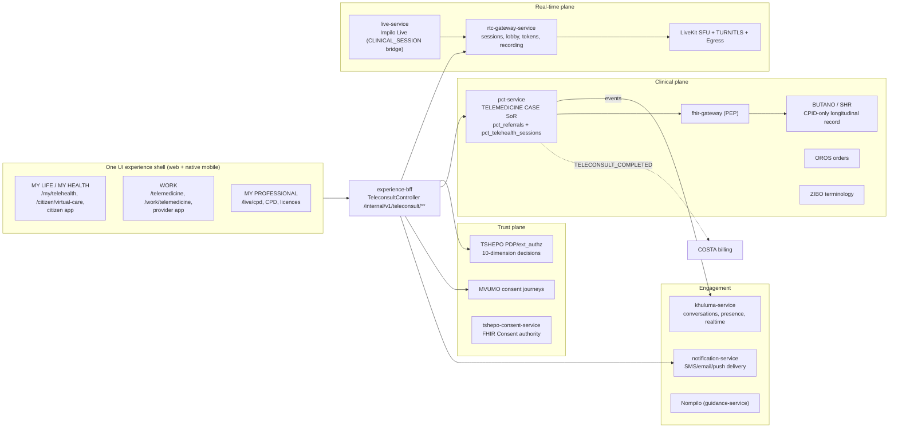

Positioning rules (normative):

- **One UI / One Experience**: every telemedicine surface lives in `ui/one-ui-shell` (+ the two Expo apps sharing `mobile-session`). No standalone telemedicine app. `[LIVE]`
- **Experience modes**: citizen journeys under MY LIFE (`/my/telehealth/{id}`, `/citizen/virtual-care`); provider journeys under WORK (`/telemedicine/**`, `/work/telemedicine/**`); CPD/professional artefacts under MY PROFESSIONAL. Zone visibility is session-contract + role gated (`sidebar-zones.ts`, `zoneVisible`), and a suspended provider keeps MY LIFE / MY PROFESSIONAL while the PDP denies WORK (D-P6). `[BUILT]`
- **Clinical plane**: PCT is the case SoR; BUTANO/SHR is the clinical truth; fhir-gateway is the enforcing PEP; OROS owns orders; ZIBO owns codes.
- **Trust plane**: Envoy ext_authz → TSHEPO on every request; v1.2 trust headers injected by `api-client.ts` (mandatory, actor, governance, context groups — including `X-Work-Context-Token`). `[BUILT]`
- **Media plane**: rtc-gateway is the only LiveKit authority; live-service provides the Impilo Live engagement layer and the `CLINICAL_SESSION` bridge; the media plane MUST NOT hold clinical truth (registry: `must-not-become-system-of-record-for-clinical-or-finance`; `must-not-own-clinical-encounter-lifecycle`).
- **Communication layer**: Khuluma owns conversations/presence/realtime push and links to canonical objects (`REFERRAL`/`ENCOUNTER`/`CASE`); notification-service owns external channel delivery. (Current drift: teleconsult lifecycle notifications go BFF→notification-service directly — see §16 and gap TM-G13.)
- **Source-of-truth boundaries** are those in `services-registry.yaml`/`system-of-record-map.md` and MUST NOT be re-derived from convenience.

## 7. Actors and Role Model

| Actor | Identity basis | Telemedicine capabilities (governed by TSHEPO across the 10 dimensions) |
|---|---|---|
| Citizen / patient | Impilo ID (public), CPID (clinical) | Request virtual care (where enabled), consent, device check, waiting room, participate, receive instructions/orders/summaries, feedback |
| Caregiver / legal guardian | Own identity + MVUMO delegation (`GUARDIANSHIP` or named-action caregiver grant, expiry-bound) | Request/participate/receive on behalf, within delegation scope; dual-identity provenance; never via shared credentials |
| Referring clinician (local) | VARAPI Provider ID + Vashandi assignment + facility context | Create case, build package, obtain consent, submit, execute local tasks, complete loop |
| Consulting clinician / specialist (remote) | VARAPI Provider ID (+ virtual privilege where defined) | Review, accept/decline, request info, consult, structured response, orders (per authority), follow-up |
| Session roles (media plane, template-bound) | Token role ∈ template | `PROVIDER` (publish + roomAdmin), `PATIENT`, `CAREGIVER`, `SUPERVISOR` (publish), `INTERPRETER` (publish, audio-only default), `OBSERVER` (subscribe-only, hidden). rtc-gateway refuses tokens for roles not in the template. `[LIVE]` |
| Telemedicine desk / facility coordinator | Staff identity + facility context | Queue oversight, patient preparation, equipment readiness, scheduling, transfer coordination |
| Pool / virtual-hospital operator | Provider or coordinator + workspace context | Pool queue management, workload balancing, escalation |
| MDT participants | Providers + session-mode roles | Board review, recommendations, consensus/dissent (session mode `[PENDING-POLICY]`, HO-3/HO-4) |
| Operations command | Ops roles | SLA, RTC health, specialty workbench (`/ops/sla`, `/ops/rtc-health`, `/ops/specialty-workbench`) `[BUILT]` |
| Helpdesk / technical support | Support roles | Media diagnostics and user guidance **without clinical content access** (visibility tiers enforce) |
| Trainees / learners | Provider identity + supervision context | Supervised participation; countersignature where required `[PENDING-POLICY]` |
| Nompilo | Platform assistant | Guidance only — MUST NOT diagnose, prescribe, alter clinical facts, or create unreviewed orders |

Role-permission detail per stage is given in each stage's J/K sections; the consolidated role-permission matrix is Appendix A (§33).

## 8. Session-Type Catalogue

The platform realises session types as **profiles over one common lifecycle** (the seven stages) parameterised by: initiating actor, patient participation, referral-package requirement, scheduling, local-clinician presence, sync/async mode, consent profile, participant roles, documentation duty, order authority, closeout, escalation path, and SoR writes. The media plane knows five governed **session templates** today (`TELEMEDICINE`, `MEETING`, `LIVE_EVENT`, `LEARNING_LIVE`, `LEARNING_RECORDING`) `[LIVE]`; the ten-mode clinical taxonomy (MDT, audit, emergency advisory, diagnostics review, etc.) is configured (`session-modes.ts`) but not yet templated `[CONFIG-ONLY]` (HO-3).

| # | Session type | Initiator | Patient present? | Referral pkg | Scheduled? | Local clinician | Mode | Consent profile | Notable roles | Docs duty | Order authority | Closeout | Escalation | SoR writes | Status |
|---|---|---|---|---|---|---|---|---|---|---|---|---|---|---|---|
| 1 | Provider-to-provider teleconsult | Local clinician | Optional | Yes (may be lean) | Optional | Yes | sync or async | Patient consent for data sharing; media consent if patient joins | PROVIDER×2 | Both: referrer note + response | Referrer retains; remote recommends | Response + completion note | To emergency/transfer | PCT case, SHR summary | `[LIVE]` |
| 2 | Provider-to-specialist referral | Referrer | Optional | **Yes (full)** | Optional | Yes | either | As #1 | + SUPERVISOR | As #1 | Specialist may order where policy allows | As #1 | As #1 | As #1 | `[LIVE]` |
| 3 | Direct patient teleconsultation | Provider or patient request | **Yes** | Lean (context pkg) | Usually | Not required | sync | `DIGITAL_TELEMEDICINE` media consent | PROVIDER, PATIENT, CAREGIVER, INTERPRETER | Provider documents | Provider (own authority) | Instructions + completion | Danger-sign → emergency | PCT case, SHR summary | `[LIVE]` |
| 4 | Scheduled virtual clinic | Facility/provider | Yes | Lean | **Yes** | Optional | sync | As #3 | As #3 | As #3 | As #3 | As #3 | + booking appointment | `[BUILT]` (reminder gap TM-G14) |
| 5 | Urgent virtual triage | Any entry pathway | Yes | Minimal | No | Preferred | sync | Verbal/emergency permissible | As #3 | Triage note | Limited | Disposition mandatory | Fast-path | PCT case | `[PARTIAL]` |
| 6 | Emergency clinical support | Local team | Yes (with local team) | Minimal | No | **Yes** | sync | `emergency_approved` / break-glass L4 | + SUPERVISOR | Local documents; remote advises | Remote advises; local executes | Handover note | Daidzai/Nhume/Ndila | PCT case, SHR | `[PARTIAL]` (template gap HO-3) |
| 7 | Asynchronous store-and-forward | Referrer | No | **Yes + S&F package** | No | Yes | **async** | Data-sharing consent | PROVIDER×2 | Response required | Recommend; local executes | Response ack + completion | Convert to sync/urgent | PCT case (`ASYNC`/`MESSAGE` → `IN_REVIEW`) | `[LIVE]` (async spine), package integrity `[PARTIAL]` |
| 8 | Diagnostic image/result review | Ordering clinician | No | Result-focused | Optional | Yes | either | Data sharing | + diagnostic reviewer | Interpretation report | Reviewer reports; referrer acts | Report ack | Critical-result path | SHR report | `[PARTIAL]` (PACS ✅, review mode HO-3) |
| 9 | MDT / specialist-board review | Case owner | Rarely live | Case brief | Yes | Owner presents | sync (board) | Data sharing + identity-visibility level | Multiple PROVIDERs, chair, scribe | Consensus + dissent recorded | Recommendations only | Actions with owners | Chair escalates | PCT case + MDT record | `[CONFIG-ONLY]` (HO-3/HO-4) |
| 10 | Maternal & newborn specialist support | ANC/maternity team | Often | Yes + obstetric set | Either | Yes | either | As #6 where emergent | + midwife | As #2 | As #2 | As #2 | Obstetric emergency fast-path | As #2 | `[PARTIAL]` |
| 11 | Mental-health consultation | Provider/patient | Yes | Lean; sensitivity flags | Usually | Optional | sync | Enhanced privacy; restricted visibility | Minimal roster | Provider | Provider | Safety-net mandatory | Crisis path | Restricted-visibility SHR | `[PENDING-POLICY]` (HO-4) |
| 12 | Chronic-disease follow-up | Programme/provider | Yes | Prior-case link | Yes | No | either | Standing care consent | As #3 | Provider | Provider | Next follow-up set | Deterioration path | PCT case chain | `[PARTIAL]` (no follow-up backend, TM-G8) |
| 13 | Remote monitoring review | Monitoring alert | Data only | Monitoring data | Programme cadence | No | async | Monitoring consent | Reviewer | Review note | Reviewer | Threshold actions | Alert escalation | Observations + review | `[ABSENT]` (RPM missing) |
| 14 | Virtual rehabilitation | Rehab provider | Yes | Care-plan link | Yes | Optional | sync | As #3 | + therapist | Session note | Therapist | Plan progression | As #12 | CarePlan updates | `[PARTIAL]` |
| 15 | Theatre support | Theatre team | Yes (in theatre) | Peri-op set | Scheduled | **Yes** | sync | Peri-op consent set (MVUMO V007) | + SUPERVISOR | Local documents | Local executes | Op-note linkage | Emergency path | Theatre record | `[PARTIAL]` |
| 16 | Virtual ICU support | ICU team | Yes | ICU data set | Standing | **Yes** | sync | As #6 | + intensivist | As #6 | As #6 | Shift handover | As #6 | As #6 | `[ABSENT]` (pool/VH backend, TM-G6) |
| 17 | CHW / midwife escalation | CHW/nurse/midwife | Yes (community) | Minimal + observations | No | CHW present | sync or async | Verbal consent common | CHW + PROVIDER | CHW observation + provider note | Provider | Disposition + community follow-up | Emergency path | Community context + case | `[PARTIAL]` |
| 18 | Teaching / clinical supervision | Supervisor/educator | Only with consent | Teaching brief | Yes | n/a | sync | **Separate teaching consent**; de-identification default | + learners (OBSERVER) | Learning artefacts separate from clinical record | None | Attendance/CPD | n/a | Fundo artefacts, NOT SHR | `[PARTIAL]` (`LEARNING_LIVE` ✅) |
| 19 | Recorded learning session | Educator | Only with explicit consent | As #18 | Yes | n/a | recorded | Recording + teaching consent (distinct from care consent) | As #18 | As #18 | None | Artefact governance | n/a | `LEARNING_RECORDING` artefacts | `[PARTIAL]` (recording→artefact W1 TODO) |
| 20 | Hybrid consultation (local + remote providers) | Local team | Yes | Yes | Either | **Yes** | sync | As #3 | Local + remote PROVIDERs | Split: local exam, remote note | Explicit split | Joint closeout | As #6 | As #2 | `[PARTIAL]` |
| 21 | Second opinion | Any clinician (or patient per policy) | Optional | Yes | Optional | Optional | either | Data sharing | PROVIDER×2 | Opinion note | None (advice only) | Opinion delivered | n/a | Opinion on record | `[PARTIAL]` |
| 22 | Post-discharge / post-referral follow-up | Discharging team | Yes | Discharge summary link | Yes | No | either | Standing consent | As #3 | Provider | Provider | Loop closure to origin | Readmission path | Case linked to origin episode | `[PARTIAL]` (linkage exists via `parentSessionId`/origin refs; loop UX partial) |

Profile rules that apply across types (normative):

- A referral package is REQUIRED for responsibility-transferring types (2, 7, 8 as report, 9 brief) and MUST NOT be forced on types where it adds no clinical value (3, 4, 12) — those use the lean context package (§Stage 2). The UI MUST NOT route non-referral journeys through referral screens.
- Every type MUST declare its expected SoR writes; a session type that writes nothing durable is prohibited.
- Types 18–19 MUST keep learning artefacts out of the clinical record and MUST NOT proceed on care-consent alone.

## 9. Workspace Catalogue

Workspace access is TSHEPO-gated (role + facility/workspace assignment + purpose of use); users see only permitted workspaces (`zoneVisible`, shell workspace policy V008/V009).

| # | Workspace | Canonical surfaces today | Scope | Status |
|---|---|---|---|---|
| 1 | **Facility Telemedicine Desk** | `/queue/incoming-referrals`, `/queue/scheduled`, `/queue/waiting`, `/queue/triage`; facility service queue in `/work/telemedicine/worklist` | Incoming/outgoing referrals, waiting-room oversight, patient prep, local-clinician coordination, task execution, transfer & follow-up | `[PARTIAL]` — queues live; dedicated coordinator UX partial |
| 2 | **Provider Virtual Clinic** | `/telemedicine` hub, `/telemedicine/session/[id]`, `/telemedicine/new`, provider mobile Telemedicine screens | Personal schedule, assigned cases, waiting patients, async consultations, documentation, follow-up, availability | `[LIVE]` core; availability/handover `[PARTIAL]` |
| 3 | **Specialist Pool** | `/work/telemedicine/worklist` (pool view via `useTeleconsultPoolQueue`), `GET /teleconsult/pool/{poolId}/queue` | Specialty queues, acceptance/reassignment, response-time monitoring | `[LIVE]` for enabled pools; on-call coverage & workload balancing `[ABSENT]` (no duty roster — honest UI copy) |
| 4 | **Multidisciplinary Team Workspace** | — (config: session mode) | Case agenda, shared board, structured recommendations, consensus/dissent, actions | `[CONFIG-ONLY]` (HO-3, HO-5) |
| 5 | **Virtual Hospital / Virtual Unit** | `/work/telemedicine/virtual-hospitals[/​[id]]`, `/discover/virtual-care` (citizen), 21 configured institutions incl. National Telemedicine Hospital, Provincial VHs, Maternal & Newborn, Mental Health, Chronic Disease, Radiology/Diagnostics Review, ICU Support, Emergency Advisory, Rehabilitation, Community Follow-up, Learning & Supervision | Governed pools of clinical capability as virtual institutions | `[CONFIG-ONLY]` — "Configured — awaiting backend substrate"; only `REQUESTABLE` ones accept citizen requests (currently the general pool) |
| 6 | **Operations Command** | `/work/telemedicine/operations`, `/telemedicine/analytics`, `/ops/{sla,rtc-health,specialty-workbench}`, `/admin/comms-ops` | Queue health, response times, failed sessions, network failures, escalations, coverage, unresolved cases | `[BUILT]`; per-session failure drill-down `[PARTIAL]` (events on Kafka, no query API) |
| 7 | **Patient & Caregiver Experience** | `/discover/virtual-care` → `/citizen/virtual-care/request` → `/citizen/virtual-care` → `/my/telehealth[/​[id]]` (waiting room → consult → post-consult), citizen app Telehealth screens | Booking/request, consent, preparation, device test, waiting room, consultation, instructions, follow-up, feedback, permitted-person access | `[LIVE]` spine; instructions/orders view + feedback loop `[PARTIAL]` |
| 8 | **Helpdesk & Technical Support** | Operations page helpdesk section (honest gap) | Device/connectivity support, room recovery, rejoin, media diagnostics — **no clinical content access** (visibility tiers) | `[ABSENT]` as dedicated surface |
| 9 | **Learning & Supervision Workspace** | `/learning/sessions/[id]/classroom`, Fundo, `LEARNING_LIVE`/`LEARNING_RECORDING` templates | Teaching, supervision, mentorship, recording governance, separation from clinical records | `[PARTIAL]` |

---

## 10. Canonical Seven-Stage Lifecycle

### 10.1 Reconciliation of the two source models

The **seven operational stages** (workflow edition) remain the principal end-to-end journey. The **seven clinical lifecycle domains** (technical brief) are not a competing pipeline: they are clinical lenses that occur *within and across* the operational stages, and two of them (follow-up/monitoring; closure/transition/escalation) are explicitly **recurrent or cross-cutting**, not one-shot.

| Clinical domain (brief) | Where it lives in the operational stages |
|---|---|
| 1. Entry into virtual care | Stage 1 |
| 2. Context establishment | Stages 1–2 (identity, encounter, longitudinal load, package) |
| 3. Virtual clinical assessment | Stage 5 (and Stage 4 async review) |
| 4. Orders, advice and care planning | Stage 6 (initiated in-session in Stage 5) |
| 5. Coordination with facility-based care | Stages 6–7 (tasks, handoff, transfer) |
| 6. Follow-up and monitoring | Stage 7 — **recurrent loop**; may spawn linked cases (type 12/22) any number of times |
| 7. Closure, transition or escalation | Stage 7 closure; **escalation/transfer/in-person conversion may fire from Stages 1, 3, 4, 5, 6 or 7** |

Vocabulary discipline (normative): a **stage** is a phase of the journey; a **state** is a machine value on an object (§11); an **event** is a published fact; a **screen** is a UI surface; an **actor task** is an assigned duty; a **service** is an owner. The stage number stored on the case (`ReferralEntity.stage`, integer 1–7) is a *progress annotation*, never a substitute for state.

Both **referral-driven** and **non-referral** journeys traverse the same stages: non-referral types (direct patient consult, scheduled clinic, chronic follow-up) use a lean Stage 2 (context package auto-assembled, no referral letter) and MUST NOT be forced through referral screens.

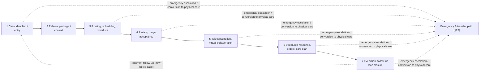

### 10.2 Stage-template key

Each stage below uses the fixed template: **A** Purpose · **B** Entry conditions · **C** Initiating actors · **D** Variants · **E** User journey · **F** Required information · **G** System-generated information · **H** Frontend/mobile · **I** Backend orchestration · **J** Trust/authz · **K** Clinical safety · **L** Data/FHIR · **M** Integrations · **N** Events · **O** Khuluma/notifications · **P** Nompilo · **Q** Audit · **R** Timers/SLA · **S** Offline · **T** Failure/recovery · **U** Exit criteria · **V** State transitions · **W** Acceptance criteria · **X** Example.

---

### STAGE 1 — Case Identified and Entry into Virtual Care

**A. Purpose.** Convert a clinical need into a **durable telemedicine case** with a safely resolved patient, an accountable initiating actor, and an honest urgency picture — *before* any media room exists.

**B. Entry conditions.** Authenticated actor with a permitted entry pathway; for clinical entry, a resolvable patient (or a governed emergency/unidentified pathway); TSHEPO context valid for the action.

**C. Initiating actors.** Local clinician, specialist, facility desk, CHW/nurse/midwife, programme, monitoring system, citizen, caregiver/guardian (delegation-bound), scheduler, MDT coordinator.

**D. Permitted variants — entry pathways.** Each pathway MUST resolve to the same durable case creation; none may bypass identity or trust.

| Pathway | Surface today | Status |
|---|---|---|
| "Start teleconsultation" from active encounter / OPD / emergency / ward / theatre / ANC / PNC / maternity / neonatal / chronic / specialty modules | EHR chart (`/ehr/[patientId]/consults?tab=teleconsults`) + `/telemedicine/new` composer; encounter modules deep-link | `[BUILT]` (single composer; per-module one-click entry `[PARTIAL]`) |
| Facility-initiated referral | `/telemedicine/new` (6-component referral builder) | `[LIVE]` |
| Provider-to-provider request | Same composer, routing target = practitioner | `[LIVE]` |
| Scheduled virtual appointment | Composer + booking-service `TELECONSULT` appointment | `[BUILT]` |
| Patient-initiated request (policy-permitting) | `/citizen/virtual-care/request` (+ citizen mobile `requestTeleconsult`) | `[LIVE]` (routes to `REQUESTABLE` virtual hospitals only — fail-closed) |
| Caregiver/guardian request | Same, acting under MVUMO delegation | `[PARTIAL]` (delegation live CJ14/15; request-on-behalf UX partial) |
| Programme-driven outreach | Campaigns / programme worklists | `[PARTIAL]` |
| Remote-monitoring alert | — | `[ABSENT]` (RPM missing) |
| Diagnostic-result escalation | Result worklists → composer | `[PARTIAL]` |
| Emergency panel | `/emergency` → advisory entry | `[PARTIAL]` (template gap HO-3) |
| CHW / nurse / midwife escalation | Community context + composer | `[PARTIAL]` |
| Non-EHR / standalone entry | Composer without encounter link | `[LIVE]` (encounterId optional) |
| Virtual-hospital worklist | `/work/telemedicine/worklist` pool intake | `[LIVE]` for enabled pools |
| MDT / board-review request | — | `[CONFIG-ONLY]` |
| Follow-up from previous case | New case linked to origin | `[PARTIAL]` |
| Transferred / reassigned case | Re-route of existing case | `[PARTIAL]` (route endpoint exists; reassignment semantics thin) |

**E. User journey (composite).** Actor enters from pathway → patient resolution/confirmation (Impilo ID + demographic confirmation; silent, anti-enumeration) → duplicate/open-case check → clinical question + urgency capture → case created (`DRAFT`) → continue to Stage 2 (full package) or straight to scheduling/immediate session for lean types.

**F. Required information.** Patient reference (resolved CPID; see identity pathways below), initiating actor + role, facility/workspace context, entry pathway, initial clinical question/reason, urgency (`impilo-clinical-priority`: ROUTINE, SOON, URGENT, EMERGENCY), modality intent (`virtual|hybrid`; `virtualMode`), consent posture (known/needed).

**G. System-generated.** `referralId` (UUID; **idempotent creation** via Idempotency-Key), `tenantId`, timestamps, `stage=1`, `status=DRAFT`, default `referralType=SPECIALIST`, `urgency=ROUTINE` unless set, routing hints if provided (`routing_kind`/`routing_pool_id`), data-freshness stamps on any loaded summary.

**H. Frontend/mobile.** Web composer `/telemedicine/new`; citizen request `/citizen/virtual-care/request` (modality picker; consent checkbox required for video/audio); provider mobile `TelemedicineScreen` create; citizen mobile `requestTeleconsult`. Requirements: persistent patient banner once resolved; urgency selector always visible; connectivity check before offering live modes; "existing open case" interstitial on duplicate detection (target; see W).

**I. Backend orchestration.** BFF `POST /internal/v1/teleconsult/sessions` → VITO fail-closed patient validation → `pctClient.createReferral` (→ `pct_referrals` DRAFT) → optional scheduling → **no media provisioning at this stage** (durable-case-before-room is enforced by ordering in the BFF). Citizen lane: `POST /internal/v1/virtual-care/requests` → same PCT spine with `routing_kind=POOL`, `routing_pool_id=GENERAL_TELEMEDICINE` (runtime-proven J-VC-1); non-routable virtual hospital → 422 `VIRTUAL_HOSPITAL_NOT_YET_ROUTABLE`, **no row created**; video/audio without consent → 422 `CONSENT_REQUIRED`, **no row created**.

**J. Trust/authz.** Envoy→TSHEPO on every call; v1.2 headers; purpose of use `TREATMENT` (clinical) or `PERSONAL_CARE` (citizen self-service); provider entry requires valid VARAPI status + (for WORK actions) Vashandi assignment (`WORK-REQUIRES-ASSIGNMENT`) and `WORK-TOKEN-CONTEXT-MATCH`; citizen lane is self-scoped via `X-Actor-ID`; caregiver lane requires MVUMO delegation evaluation (PolicyEngine act-on-behalf step 4.5, `X-Subject-ID`).

**K. Clinical safety — identity pathways (each MUST exist; corrected identity rule §5):**

| Situation | Required behaviour | Status |
|---|---|---|
| Known patient | Impilo ID / demographic confirmation → Trust-Core resolve → CPID; **no public candidate lists**; step-up on weak match (`MATCH_CANDIDATE_FOUND / STEP_UP_REQUIRED`) | `[BUILT]` (VITO resolve + silent-resolution chain) |
| Patient without their Impilo ID at hand | Demographic + second-factor confirmation via staff-mediated resolve; Nompilo helps recover the ID | `[BUILT]` (resolve-contact) |
| Unidentified emergency patient | Proceed under emergency registration (temporary identity), case flagged; reconcile identity later; never block emergency care on registration | `[PARTIAL]` |
| Newborn awaiting registration | Child registered as **distinct person** (own Impilo ID/CPID) with guardian delegation (CJ14) — never inside the mother's record | `[LIVE]` |
| Duplicate identity candidates | `DISPUTED` blocks; dedup steward queue; case MAY proceed on the confirmed record only | `[BUILT]` (identity plane) |
| Guardian/caregiver representing | MVUMO delegation; dual-identity provenance | `[LIVE]` (CJ14/15) |
| Provider acting across facilities | Context switch = revoke + reissue WORK_CONTEXT token; PDP re-evaluates | `[BUILT]` |
| Facility with no live EHR connection | Provisional offline case; queued sync; §19 | `[ABSENT]` (offline case creation not built) |

Also: duplicate **case** detection (open related case for same patient/specialty) MUST warn before create `[ABSENT — TM-G16]`; danger-sign evaluation at entry MUST offer the emergency path (§23); anonymous clinical participation is prohibited (fail-closed VITO validation enforces).

**L. Data/FHIR.** `pct_referrals` row (case aggregate — workflow truth); linked `encounterId` where entered from an encounter; FHIR: Encounter (linked), Patient (by CPID reference only). No SHR write yet at this stage beyond encounter linkage.

**M. Integrations.** VITO (resolve/validate), TSHEPO (+MVUMO for delegations), TUSO (facility context), booking-service (if scheduling at entry), ZIBO (urgency codes).

**N. Events.** `telemedicine.session.referral_created` (topic `clinical.teleconsult.lifecycle`); `.created`; routing hints events where set.

**O. Khuluma/notifications.** Citizen request confirmation (in-app; honest queued-for-pool copy) `[LIVE]`; referrer "draft created" is silent (no external message at DRAFT — PHI-minimisation: external channels carry no clinical content at this stage).

**P. Nompilo.** Explain why identity confirmation is required; help find the Impilo ID; explain proxy/guardian access; plain-language consent preview; connectivity self-check guidance; danger-sign phrasing → escalate to emergency path (never diagnostic).

**Q. Audit.** Case-created audit event with actor, context, pathway; identity resolution audited in the identity plane; TSHEPO decision ids retained (`tshepoDecisionId` on the case).

**R. Timers/SLA.** None active at DRAFT beyond draft-expiry policy `[configurable, pending ratification]`; urgency drives all downstream timers.

**S. Offline.** Target: provisional local case (client-side durable draft) with queued sync and duplicate-event prevention (§19). Today: drafts are server-side; offline entry `[ABSENT]`.

**T. Failure/recovery.** Identity resolve failure → fail-closed with human-readable guidance (no case); PCT down → BFF surfaces error, no partial case; idempotent retry on create (Idempotency-Key); citizen 422s leave no residue (proven J-VC-2/3).

**U. Exit criteria.** Durable case exists (`DRAFT`) with resolved patient, actor, context, question, urgency — OR a scheduled/immediate lean-type case proceeds directly to Stage 3/5 semantics.

**V. State transitions.** ∅ → `DRAFT` (create). `DRAFT → ROUTED` when routing applied at entry.

**W. Acceptance criteria.**
1. Creating a case never creates a media room. 2. Idempotent create (same key → same case). 3. Citizen video request without consent → 422, no row. 4. Non-routable VH → 422, no row. 5. Fail-closed on unresolvable patient. 6. Newborn/guardian pathway produces distinct-person case with delegation provenance. 7. Duplicate-case warning shown when an open case matches patient+specialty (target). 8. All entries audited with pathway.

**X. Example.** Nurse Chienda (RHC, WORK context) sees a jaundiced neonate → EHR → Start teleconsultation → confirms mother-held Impilo ID → newborn's own record (CJ14 chain) → question "neonatal jaundice, bilirubin unavailable, advise phototherapy threshold" → urgency URGENT → case `DRAFT` created; no room exists yet.

---

### STAGE 2 — Referral Package and Context Establishment

**A. Purpose.** Assemble a clinically complete, provenance-honest package so the receiver can act safely without re-asking what the platform already knows; establish encounter and consent context.

**B. Entry.** Case in `DRAFT` (or lean-type auto-package).

**C. Actors.** Referrer (author), facility desk (support), patient/caregiver (supplied data), system (auto-assembly).

**D. Variants.** Full referral package (types 2/7/8/9) · lean context package (types 3/4/12) · store-and-forward package (type 7, integrity-controlled) · emergency minimal package (type 5/6).

**E. Journey.** Composer sections → auto-populated SHR facts reviewed → referrer narrative → attachments (+ annotation) → consent capture → completion indicators → ready to submit.

**F. Required information (package contents).** The package MUST support: consultation question; reason; presenting complaint; HPC; relevant past medical/surgical/obstetric/mental-health/social history; allergies; current medications; examination findings; vital signs; severity + red flags; working diagnosis; differentials; investigations done; available results; treatments given; response to treatment; IPC/isolation considerations; pregnancy status; safeguarding concerns; disability/communication needs; language/interpreter needs; local capabilities and unavailable services/equipment; specific questions; requested urgency; expected response mode; suggested specialty; expected follow-up; attachments; consent evidence. `[PARTIAL — active model carries reason/clinicalSummary/urgency/specialty/attachments/consent; the full structured section set is the legacy model's shape and is not yet on the active spine → TM-G2]`

**G. System-generated.** Provenance class per element (MUST be displayed, never silently merged):

| Class | Source | Display rule |
|---|---|---|
| Auto-generated SHR fact | BUTANO via fhir-gateway | Freshness timestamp mandatory; stale flag past policy age |
| Encounter-specific fact | Active encounter | Tagged to encounter |
| Referrer-authored narrative | Author | Attributed + versioned |
| Imported document | Upload | "Imported — unverified" |
| Patient-supplied | Citizen/caregiver | "Patient-reported" |
| Provisional offline | Offline capture | "Provisional — pending reconciliation" |
| Unverified/stale | Any | MUST NOT masquerade as current clinical fact |

**H. Frontend/mobile.** The original left-navigation + right-summary-panel concept is adapted responsively (normative): desktop MAY use multi-pane (nav / editor / summary); tablet uses collapsible panels; mobile MUST use a compact stepper/horizontal wizard; excessive vertical scrolling is prohibited; the current patient, urgency, save state and submission state MUST remain visible at all times. Editor requirements: autosave; **local draft persistence + server draft persistence; recovery after browser/device/network failure** `[PARTIAL — server drafts live; local durable drafts absent → TM-G17]`; version history; concurrent-editing safety (optimistic lock); completion indicators; required/conditionally-required fields; section navigation; attachment preview; image annotation; file-size/format controls; malware scanning `[ABSENT at upload seam — TM-G18]`; consent before sensitive uploads; data-minimised summary view.

**I. Backend.** `PUT /internal/v1/teleconsult/sessions/{id}/referral` (package update); attachments via document-service (`attachmentDocumentIds`); consent: `POST …/consent` → MVUMO `createConsentRequest` → PCT `updateReferralConsent` (PENDING → resolved status; pointers `mvumoSessionId`/`tshepoDecisionId`).

**J. Trust.** Author must hold the case + clinical write context; sensitive uploads require consent evidence; visibility tiers govern what auto-population may include.

**K. Safety.** Stale/imported/patient-supplied data MUST be visibly classed (G); allergy and medication sections MUST come from SHR truth where it exists, with any manual override flagged for reconciliation (§18).

**L. Data/FHIR.** Package → case aggregate fields + documents; target mapping: Composition (referral note), DocumentReference (attachments), QuestionnaireResponse (structured sections), Consent pointer. IPS summary snapshot for store-and-forward.

**M. Integrations.** document-service, MVUMO/Tshepo-Consent, fhir-gateway (summary load), ZIBO (coded fields).

**N. Events.** `telemedicine.session.referral_updated`, `.consent_updated`.

**O. Comms.** None external at draft; consent requests to the patient ride MVUMO's method selection (portal confirm, token link, in-session).

**P. Nompilo.** Explain consent in plain language; guide what a good clinical question contains; warn on missing danger-sign fields; help with attachment quality (photo guidance).

**Q. Audit.** Package versions attributable; consent events audited in MVUMO + case pointer updates.

**R. Timers.** Draft-age reminder to author `[configurable]`; consent-request expiry per MVUMO template.

**S. Offline.** Store-and-forward package: case identity, patient identity, consent, question, summary snapshot + freshness, documents/images, local capabilities, urgency, signatures, provenance, checksum/integrity, expiry/review deadline (§19). `[PARTIAL]`

**T. Failure.** Upload failure → resumable retry; consent-channel failure → alternative MVUMO method; draft conflict → §18 conflict UX.

**U. Exit.** Package complete per type profile + consent posture satisfied (`obtained | waived | emergency_approved`, or not_required for the type) → submit.

**V. Transitions.** `DRAFT → SUBMITTED` (`POST …/submit`; sets `submittedAt`, enqueues pool where routed). Legacy guard (`CONSENT_REQUIRED_MISSING` 409) is the target behaviour for the active spine `[TM-G3]`.

**W. Acceptance.** 1. Submit blocked without required consent (409/422, actionable copy). 2. Every package element displays provenance class + freshness. 3. Draft survives browser refresh (server) and device loss (target: local). 4. Attachments scanned + size/format enforced. 5. Mobile stepper parity for every section.

**X. Example.** The neonatal case: auto-loaded newborn summary (fresh, 2 min); nurse adds exam findings + phone photo of the infant (annotated), records verbal maternal consent via MVUMO in-session method; completion bar full; submits — case `SUBMITTED`, queued to the paediatric pool.

---

### STAGE 3 — Routing, Matching, Scheduling and Worklists

**A. Purpose.** Place the case with the right clinical capability at the right time — a clinical-operations engine, not a dropdown.

**B. Entry.** `SUBMITTED` (or routing pre-set at creation).

**C. Actors.** Referrer (target selection), routing engine, pool operators, schedulers, receivers (Stage 4 pull).

**D. Variants — routing targets.**

| Target | Mechanism today | Status |
|---|---|---|
| Named practitioner / PractitionerRole | `PRACTITIONER`/`PROVIDER` routing, validated against VARAPI | `[LIVE]` |
| Workspace | `WORKSPACE` (TUSO-validated) | `[LIVE]` |
| Facility clinical service | `FACILITY_SERVICE` (TUSO service, not arbitrary labels) | `[LIVE]` |
| Specialty pool / team | `TEAM`/`SPECIALTY_POOL` (+ pool queues V035) | `[LIVE]` |
| Virtual clinic / virtual hospital | Pool-backed where `REQUESTABLE` | `[PARTIAL]` (VH substrate HO-2) |
| On-call team / unit-ward / national service | `ON_CALL` / `UNIT` / `NATIONAL_POOL` | `[ABSENT]` — honest **501 `ROUTING_TYPE_UNAVAILABLE`**; no duty/pool directory backend (TM-G6) |
| MDT / diagnostic-review pool / emergency-advisory unit | — | `[CONFIG-ONLY]` (HO-3) |

**E–F. Journey + inputs.** Routing decision inputs MUST be drawn from systems of record, never free text: requested specialty + clinical service (ZIBO/TUSO — **specialty CodeSystem not yet seeded → TM-G7**), urgency, patient age group/sex-specific service, provider cadre/scope/licence/restrictions/status (VARAPI axes), facility affiliation + workforce assignment + shift/on-call (VASHANDI), service + equipment capability (TUSO), language, geography, workload/queue length/session load, response-time performance, continuity preference, payer/network restrictions **only where policy legitimately applies (explicit + auditable)**, connectivity (both ends), escalation rules.

**G. Decision classes (MUST be distinguished and recorded on the case):** user-selected target · system recommendation · policy-mandated destination · automatic fallback · manual override · emergency override. **An AI/heuristic routing suggestion MUST NOT silently become assignment**: the basis MUST be shown and human confirmation required unless an approved deterministic rule applies.

**H. Frontend.** Routing picker in composer (`useTeleconsultRouting` — provider/facility/workspace search + VH targets, pinning); `/work/telemedicine/routing`; scheduling via booking-service (`TELECONSULT` type, `impilo-booking-target-type` codes). Worklists (§below).

**I. Backend.** `POST /internal/v1/teleconsult/sessions/{id}/route` → PCT `routeReferral` (`routing_kind` default `POOL`, `routing_pool_id`, `routedAt`, stage≥3, `DRAFT→ROUTED`); submit enqueues via `VirtualPoolQueueService`; scheduling writes `appointment_id`/`scheduled_at` (V032). Routing modes (immediate; scheduled; broadcast/offer-to-pool `[queue is claim-based today — OFFERED semantics target]`; round-robin `[ABSENT]`; skill/continuity-based `[ABSENT]`; escalation/overflow/after-hours `[PARTIAL — SLA breach events exist]`; cross-facility `[LIVE]`; **no-provider-available handling MUST route to a monitored exception queue, never a void** `[PARTIAL]`).

**J. Trust.** Target validation against VARAPI/TUSO is mandatory (BFF does this `[LIVE]`); payer-based restrictions must be policy-encoded (TSHEPO), not UI-filtered.

**K. Safety.** Urgency (EMERGENCY) MUST bypass batch/scheduled routing to the fast path; sex/age-inappropriate service targets blocked.

**L. Data.** Case routing fields; queue materialisation rows; appointment link.

**M. Integrations.** VARAPI, TUSO, VASHANDI (assignment/on-call — pending), booking-service, ZIBO.

**N. Events.** `telemedicine.session.routed`; queue events `pct.telemedicine.pool.materialized`, `pct.telemedicine.queue.sla.breached`; `.scheduled` on appointment.

**O. Comms.** Scheduling confirmations via notification templates (booking V009/V010); **time-of-appointment reminders are impossible today** (`NotifyRequest` lacks `scheduledAt`) → TM-G14. External messages carry time+link, no diagnosis.

**P. Nompilo.** Explain queue position/expected wait honestly; explain why a target was recommended; help patient prepare for the scheduled slot.

**Q. Audit.** Routing decision + class + basis recorded; overrides carry actor + reason.

**R. Timers/SLA.** Routine/priority/urgent/emergency response timers are **configurable policy values, pending national ratification** (no invented numbers). SLA breach → `queue.sla.breached` + escalation routing. `[PARTIAL]`

**S. Offline.** Queued submission routes on reconnection; scheduled cases tolerate deferred confirmation (§19).

**T. Failure.** 501 routing types fail closed with honest copy; pool-empty → exception queue (target); notification failure → §16 retry/fallback.

**U. Exit.** Case sits in a governed queue/worklist with an accountable owner-context, or holds a scheduled appointment.

**V. Transitions.** `DRAFT|SUBMITTED → ROUTED`; `→ SCHEDULED` (telehealth session link); queue placement is not a state change (materialisation).

**W. Acceptance.** 1. Every routing decision records its class + basis. 2. Invalid targets rejected at validation, not at acceptance. 3. SLA timers attach per urgency (configurable). 4. No case can be routed into a target that cannot see it (void-proofing: queue must be observable by ≥1 active workspace). 5. 501 for unbuilt types (never fake success).

**X. Example.** Neonatal URGENT case → paediatric specialty pool (system recommendation, basis: specialty+urgency+pool coverage); Ops sees queue depth 3, SLA timer URGENT running.

---

### STAGE 4 — Review, Triage, Clarification, Assignment and Acceptance

**A. Purpose.** A qualified receiver examines the package, decides the case's clinical path, and *explicitly* takes (or redirects) responsibility.

**B. Entry.** Case visible in receiver worklist (`ROUTED`/`SUBMITTED`, queued or offered).

**C. Actors.** Receiving specialist/pool member, pool coordinator, MDT chair, scheduler.

**D. Variants.** Named-target review · pool claim · async review (store-and-forward) · MDT intake · scheduling-first acceptance.

**E. Journey — receiver review screen MUST include:** referral narrative; patient identity + demographic confirmation (Impilo ID display per policy); longitudinal summary; active encounter; visit summary; allergies; medications; observations/vitals; diagnoses/problems; investigations + results; attachments; consent state; provenance + freshness; facility capabilities; urgency; routing explanation; referral history; waiting time; prior telemedicine cases; care plans; current participants; local responsible clinician. `[PARTIAL — worklist + console exist; several context panels thin → TM-G2]`

**Worklists (normative set).** My Sent Requests · Assigned to Me · Offered to Me · Workspace Queue · Team Queue · Unit/Ward Queue · Facility Service Queue · Specialty Pool · Scheduled Today · Waiting Room · Needs More Information · Urgent & Overdue · Follow-Up Due · Awaiting Local Action · Awaiting Results · Awaiting Closure · Reassigned · Declined · Cancelled · Failed Delivery · Offline Sync Required. Today: facility service queue, specialty pool, sent/incoming, scheduled `[LIVE]`; the post-response and exception worklists depend on the target states (§11) `[ABSENT]`. Worklist features: filters, sort, search, grouping, saved views, pagination/virtualisation, unread, aging indicators, urgency display, PHI-minimised rows, role-scoped visibility.

**F–G. Information.** Action forms require reasons where mandated (decline/reassign — mandatory reason list below); system records waiting time, SLA state, action provenance.

**H. Frontend.** `/work/telemedicine/worklist` (accept/decline with mandatory reason `[LIVE]`); console `GET …/sessions/{id}/console`; request-more-info via case messages `[PARTIAL]`.

**I. Backend — action semantics (each row is normative):**

| Action | Reason req. | Responsibility result | Status transition | Notify | Timer | Referrer action needed | Original receiver keeps visibility |
|---|---|---|---|---|---|---|---|
| Accept (consulting clinician) | No | Consulting role bound | `→ ACCEPTED` | Referrer + patient | Response timer starts | No | — |
| Accept as primary remote (policy) | Yes | Primary transfers | `→ ACCEPTED` + transfer record | All parties | Continues | Acknowledge | Yes |
| Assign to self / claim from pool | No | Assignment | queue-dequeue + `ACCEPTED` | Referrer | Continues | No | Pool sees claimed |
| Request more information | Yes | Unchanged | `→ NEEDS_MORE_INFORMATION` `[target state]` (today: message + `IN_REVIEW`) | Referrer actionable | **Pauses** | **Yes** | Yes |
| Return for correction | Yes | Back to referrer | `→ DRAFT` (re-open package) `[target]` | Referrer | Pauses | Yes | Yes |
| Reassign | Yes | Moves | re-route; case never invisible | Both receivers + referrer | Continues | No | Yes (audit trail) |
| Add specialist / convert to MDT | No | Shared | participants added / MDT profile | Participants | Continues | No | Yes |
| Schedule / propose different time | No | Unchanged | `→ SCHEDULED` | Patient + referrer | Reset to slot | Possibly | Yes |
| Initiate immediate session | No | Accepted implicit | `→ ACCEPTED` (+ Stage 5) | Participants | Session timers | No | — |
| Asynchronous response | No | Consulting | Stage 6 direct (`RESPONDED`) | Referrer | Response timer stops | Ack | — |
| Escalate | Yes | Raised | escalation route | Escalation target | Escalation SLA | No | Yes |
| Decline | **Yes** | None taken | `→ DECLINED` → **must land in referrer + exception worklist, never a void** | Referrer actionable | Referrer timer | **Yes** | Yes |
| Cancel invalid duplicate | Yes | n/a | `→ CANCELLED` `[target]` linked to surviving case | Referrer | Stops | No | Yes |
| Redirect to emergency/in-person | Yes | Disposition | `→ ESCALATED/TRANSFERRED` `[target]` | All + facility | Emergency SLA | Yes | Yes |

Mandatory decline/reassignment reasons: out of scope · wrong specialty · wrong service · unavailable · insufficient information · requires immediate physical assessment · duplicate · licence/authority restriction · service not available · technical inability · conflict of interest · continuity concern · other + narrative.

**J. Trust.** Acceptance MUST be blocked for invalid licence/scope/assignment/context: VARAPI axes (`SUSPENDED/RESTRICTED → active_flag=false`) + PDP per-action resolution (never token-baked) `[BUILT identity-plane; per-accept enforcement on the teleconsult path PARTIAL — today a "soft duty gate" records onDuty true/false/UNKNOWN → TM-G5]`.

**K. Safety — responsibility ladder (definitions binding):** opening ≠ reading ≠ claiming ≠ accepting ≠ joining a session ≠ assuming clinical responsibility ≠ receiving transferred care. Each rung is a distinct recorded act; UI copy MUST not conflate them.

**L–N.** Case fields (`responses[]` acceptance records); events `.support_requested` (info request), acceptance in lifecycle topic; queue dequeue events.

**O. Comms.** Acceptance/decline/info-request notifications to referrer (BFF `emitTelemedicineNotification`) `[BUILT]`; patient-facing "clinician ready/scheduled" via `rtc.telemedicine.*` keys.

**P. Nompilo.** For receivers: summarise the package, highlight red flags + missing info (advisory only). For referrers: explain decline reasons and next options.

**Q. Audit.** Every action + reason + responsibility delta audited.

**R. Timers.** Acceptance SLA per urgency `[configurable]`; pause/resume semantics per action table; breach → escalation routing + ops visibility.

**S. Offline.** Receiver offline → pool coverage; async review queues; decisions sync with idempotency.

**T. Failure.** Licence lapse between claim and accept → hard block + reroute; receiver silence → SLA escalation; **no action may strand the case** (void-proofing invariant).

**U. Exit.** `ACCEPTED` (with accountable consulting clinician) → Stage 5/6; or redirected (declined/reassigned/escalated) with referrer notified and case visible.

**V. Transitions.** `SUBMITTED|ROUTED → ACCEPTED | DECLINED | NEEDS_MORE_INFORMATION[target] | SCHEDULED | ESCALATED[target]`.

**W. Acceptance criteria.** 1. Invalid-authority acceptance impossible (hard PDP deny). 2. Decline without reason impossible. 3. Declined/reassigned cases appear in referrer + exception worklists within seconds. 4. Info-request pauses SLA and notifies referrer actionably. 5. The responsibility ladder is visible on the console (who holds what, since when).

**X. Example.** Paediatrician on the pool claims the neonatal case, reviews photo + history, requests bilirubin nomogram data (info request; timer pauses; nurse notified), nurse replies with a new photo of the lab slip; paediatrician accepts and starts an immediate session.

---

### STAGE 5 — Teleconsultation and Virtual Clinical Collaboration

**A. Purpose.** Conduct the virtual clinical interaction — synchronous, asynchronous continuation, or hybrid — inside a governed clinical workspace where the media room is infrastructure and the case is the truth.

**B. Entry.** `ACCEPTED` (immediate) or `SCHEDULED` (slot reached); consent posture satisfied for the modality; participants token-eligible.

**C. Actors.** Consulting clinician (PROVIDER role), patient (PATIENT), caregiver (CAREGIVER), interpreter (INTERPRETER, audio-only default), supervisor (SUPERVISOR), observer (OBSERVER — subscribe-only, hidden), local clinician (device-assisted examination), helpdesk (no clinical content).

**D. Variants.** Live video/audio consult · audio-only · chat-continued · asynchronous continuation · MDT board `[CONFIG-ONLY]` · hybrid local+remote.

**E. User journey.** Provider opens session console → sees waiting room → patient completes device check + ask-to-join (no token) → provider admits → media session joins both → consultation with documentation alongside → closeout panel → end session (case does NOT complete — Stage 6/7 follow).

**F–G. The clinical session workspace (composition contract).** Not three static panes: a responsive workspace with these regions (desktop multi-pane; tablet collapsible; mobile stacked with persistent header):

1. **Session header** `[LIVE partial]` — patient, age, sex, Impilo ID display per policy, urgency, location/facility, case status, network quality, session duration, participants, recording status, consent state, **Emergency action (always visible, never dominant)**.
2. **Communication area** `[LIVE]` — secure chat (session-scope), audio, video, participant list + role labels, mute/camera, screen/document share (template-scoped: PROVIDER, SUPERVISOR), interpreter participation, connection-quality indicators, reconnection (grace 120 s), switch-to-audio-only (`LowBandwidthToggle`), secure async continuation (Khuluma thread), participant removal (roomAdmin), threaded clinical messages `[PARTIAL]`, call history `[PARTIAL]`.
3. **Waiting room** `[LIVE]` — patient check-in; provider readiness; device/mic/camera test; bandwidth assessment; privacy guidance ("find a private place"); consent confirmation; estimated wait `[PARTIAL]`; queue updates; local-staff readiness `[PARTIAL]`; interpreter status `[PARTIAL]`; leave-and-get-notified (Khuluma alert) `[PARTIAL]`; urgent-deterioration instructions (emergency action from the waiting room).
4. **Clinical documentation** `[PARTIAL → TM-G9]` — structured assessment; consultation note; per-question responses; history; local-assisted examination; findings; diagnosis + differential (ZIBO-coded); red flags; care plan; orders; advice; local tasks; follow-up; transfer decision; disposition; signature/countersignature. Today: structured response fields (`diagnosis/actionPlan/redFlags/followUp`) exist; a full in-session encounter-note surface does not.
5. **Patient context** `[PARTIAL]` — longitudinal summary, active encounter, allergies, medications, observations, results, imaging, documents, prior notes, care plans, social/safeguarding flags, freshness + provenance.
6. **Collaboration** `[CONFIG-ONLY]` — MDT board, shared agenda, participant recommendations, consensus + dissent/minority opinion, task assignment, annotations, shared timeline, handoff.
7. **Orders and actions** `[PARTIAL → TM-G4]` — lab, imaging, medication, procedures, blood products, monitoring, referral, transfer, ambulance/dispatch, education, follow-up, admin support. Today: `TeleconsultOrdersSection` places coded lab/imaging (OROS) and medication (pharmacy-service) orders via the **generic** order paths — without teleconsult provenance (no `TELECONSULT` RequestSource) and outside the teleconsult controller.
8. **Closeout** `[PARTIAL]` — session summary, attendance, actions + owners, patient instructions, local-clinician acknowledgement, follow-up, escalation, incomplete items.

**Communication modes (record classification is normative):**

| Mode | Part of clinical record? | Today |
|---|---|---|
| Secure real-time chat (in-room data channel) | Clinically relevant content MUST survive room closure → case/Khuluma persistence | Template `chat.persistence: SESSION` — **ephemeral → TM-G10** |
| Audio / video | Not recorded unless consented recording; attendance + timestamps ARE recorded | `[LIVE]` |
| Asynchronous messages (case messages / Khuluma threads with `REFERRAL` links) | Yes (case record / conversation SoR) | `[LIVE]` |
| Store-and-forward package | Yes | `[PARTIAL]` |
| MDT multi-participant | Yes (structured outcomes) | `[CONFIG-ONLY]` |
| Provider-only side discussion (policy-permitting) | Operational unless clinically material — MUST be labelled | `[ABSENT]` |
| Patient/caregiver discussion | Yes (instructions) | `[LIVE]` |
| Interpreter-mediated | Attendance recorded; content per above | `[LIVE role]` |
| Device-assisted examination | Findings → documentation | `[PARTIAL]` |
| Document/image review | Reviewed artefacts referenced on case | `[LIVE]` |
| Remote-monitoring review | Observations + review note | `[ABSENT]` |

**H. Frontend/mobile.** Web: `/telemedicine/session/[sessionId]` (provider console; `WaitingRoomAdmitControl` 5 s poll; `TelemedicineLiveSessionEmbed`; `AdaptiveSessionRoom` on LiveKit with adaptive streaming + dynacast; `ConsultStageLayout`); patient `/my/telehealth/[sessionId]` (WAITING_ROOM → IN_CONSULT → POST_CONSULT; `PatientWaitingRoom` device check; `PatientConsultView` PiP/mic/cam/leave/low-bandwidth; `PostConsultSummary`). Mobile: provider `TelemedicineScreen`/`TelemedicineCallScreen`; citizen `TelehealthListScreen`/`TelehealthSessionScreen`; shared `AdaptiveSessionRoomNative`/`PreJoinNative` (`mobileParity: FULL` for TELEMEDICINE). Media buttons MUST stay honestly disabled until a governed token exists ("Waiting for governed RTC media") — `[LIVE]`.

**I. Backend orchestration — media session lifecycle.**
1. BFF provisions rtc session lazily when media is first needed (`provisionRtcSessionIfNeeded`): `POST /internal/v1/rtc/sessions` with `sessionId = referralId`, `owningService/owningRef`, template `TELEMEDICINE`.
2. Tokens: `POST …/sessions/{id}/media/token` (+`/refresh`); role-scoped, template-checked (unknown role → refuse), TTL 3600 s, media profile `FULL|AUDIO_ONLY`.
3. **Lobby**: non-roomAdmin join → participant `WAITING` (no token); provider admit → `ADMITTED` → token minted → LiveKit join → `CONNECTED`; deny → `DENIED`; leave → `LEFT`. Idempotent provisioning (concurrent first tokens safe); patient-token governance compares in the correct identifier space (CPID fix `5f68ca1e`).
4. Webhooks: LiveKit → rtc-gateway verifier → `rtc.session_events` + `impilo.rtc.*.v1` events; bounded retry absorbs the `room_started`-inside-provisioning race.
5. End: `POST …/sessions/{id}/end` → rtc `ENDED`; room cleanup; **case remains open** (ending a call MUST NOT complete the case).

**Audio/video technical requirements (LiveKit realisation — all `[LIVE]` unless noted):** server-side room creation only; participant identity = platform identity (never self-asserted); role-scoped least-privilege tokens with expiry; join/publish/subscribe per template; waiting-room admission; room naming free of PHI (`impilo-telemedicine-<uuid>`); reconnection with 120 s grace; ICE via STUN + **TURN-over-TLS on 443** (dedicated SNI `turn.impilo.mohcc.gov.zw` → Traefik passthrough → LiveKit 5349; direct media 7881/TCP + 7882/UDP with public + LAN candidates); network-quality adaptation; audio-only fallback; camera-off mode; session recovery; duplicate-participant handling; kicked/revoked participants; abandoned-room cleanup (empty_timeout); call metadata (`rtc.participant_stats`); recording controls (template: PROVIDER-only start, consent required, sensitivity CLINICAL, artifact owner PCT; egress → MinIO → document-service adoption `[LIVE]`); retention per policy `[configurable]`; audit; failure telemetry. SIP/PSTN dial-in `[ABSENT — reserved flag only]`.
**Encryption model (stated precisely — no false E2EE claim):** signaling WSS/TLS at the edge; WebRTC media encrypted **hop-by-hop with DTLS-SRTP** between each participant and the SFU (and TURN relays carry already-encrypted payloads); the SFU necessarily terminates SRTP to route media. This is transport encryption with a trusted sovereign SFU — it is **not** end-to-end encryption between participants, and MUST NOT be described as E2EE unless LiveKit E2EE key-provider mode is adopted and proven.

**J. Trust.** Token issuance gated on: template role validity, participant admission state, consent (BFF blocks `DENIED|REVOKED|REFUSED`; rtc-gateway/PCT flag-gated hard `consentReference` requirement for VIDEO/AUDIO — **the hard gate MUST become default-on → TM-G3**), break-glass override requires `breakGlassReason` + `breakGlassApprovedBy`.

**K. Clinical responsibility during the session (binding).** Roles: local responsible clinician; remote consulting clinician; primary decision-maker; co-management; transfer of responsibility (explicit, authorised, timestamped, accepted — never implied by joining); emergency authority; trainee + countersignature `[PENDING-POLICY]`; interpreter; scribe `[ABSENT]`; observer; technical support. **The remote clinician's involvement MUST NOT ambiguously extinguish local responsibility.**

**L. Data/FHIR.** rtc session/participant/stats/recording tables (media truth); case messages/responses (clinical); target FHIR: Encounter (virtual class), Communication (clinically relevant messages), Provenance on every authored artefact.

**M. Integrations.** rtc-gateway/LiveKit, live-service (`CLINICAL_SESSION` bridge on VIDEO), Khuluma (async continuation, waiting-room comms), document-service (recordings), MVUMO (in-session consent method; **consent withdrawal during an active session MUST stop the affected modality immediately** `[PARTIAL]`).

**N. Events.** `telemedicine.session.{room_provisioned, waiting_room.entered, started, media_started, media_ended}`; `impilo.rtc.{session.started, session.finished, participant.joined, participant.left, participant.waiting, participant.admitted, participant.denied, track.published, track.unpublished, recording.*}.v1`.

**O. Comms.** `rtc.telemedicine.patient-waiting` (to provider), `rtc.telemedicine.session-ready` (to patient on admit) `[LIVE]`; failed-call and provider-delayed notices `[PARTIAL]`.

**P. Nompilo.** Waiting-room explanations (who's joined, what happens next); device troubleshooting; privacy prompts; structured pre-consult preparation capture (never presenting as a clinician); stated danger signs → emergency path; post-session "what happens next" summaries.

**Q. Audit.** Depth `CLINICAL` (template): joins/leaves/admits/denies/recording state changes all audited with identity + timestamps.

**R. Timers.** Token TTL 3600 s; reconnect grace 120 s; waiting-room wait targets `[configurable]`; abandoned-room cleanup (LiveKit `empty_timeout` 900 s).

**S. Offline/degraded.** Video→audio downgrade `[LIVE]`; audio→async downgrade (chat/Khuluma continuation) `[PARTIAL]`; media failure with chat continuation MUST keep the case actionable; stale-summary warnings; §19.

**T. Failure/recovery.** Reconnect within grace; duplicate join handled; token expiry → refresh endpoint; media plane down → async path remains; failed session → helpdesk diagnostics (per-session query API `[PARTIAL]`); every failure path leaves the case open and visible.

**U. Exit.** Clinical interaction concluded (or converted); documentation drafted; media ended (`media_ended`); case proceeds to Stage 6.

**V. Transitions.** Case: `ACCEPTED|SCHEDULED` (unchanged during session; media states are session-plane). Session-plane: participant `WAITING→ADMITTED→CONNECTED→LEFT` / `DENIED`; rtc `PROVISIONED→ENDED`.

**W. Acceptance.** 1. Patient can never hold a token before admission (negative-proof e2e `[LIVE]`). 2. Unknown template role refused. 3. Ending media never completes the case. 4. Emergency action reachable from waiting room and session. 5. Recording impossible without consent + PROVIDER initiation (proven). 6. Audio-only fallback preserves the consult. 7. Encryption description in all user-facing text matches §I precisely.

**X. Example.** Paediatrician admits the nurse+newborn from the waiting room; poor bandwidth → audio-only with photo review; verbal guidance while nurse examines; paediatrician drafts structured response during the call; call ends; case still `ACCEPTED`, response pending.

---

### STAGE 6 — Structured Response, Orders, Care Plan and Handoff

**A. Purpose.** Convert clinical judgement into an actionable, attributable, structured package: answers, orders, tasks, care-plan updates and handoff — the difference between advice and executed care.

**B. Entry.** Consulting clinician holds the case (`ACCEPTED`, in/after session, or async review).

**C. Actors.** Consulting clinician (author), supervisor (countersign `[PENDING-POLICY]`), referrer (acknowledger), local team (task owners).

**D. Variants.** Full structured response · async message response (`IN_REVIEW`) · decline-with-advice · MDT consensus package `[CONFIG-ONLY]`.

**E–F. Response package (MUST support).** Clinical interpretation; answers to each consultation question; diagnosis + differential (ZIBO-coded); result/imaging interpretation; red flags; immediate actions; treatment recommendations; medication orders/recommendations; lab orders; imaging orders; procedure orders; monitoring requirements; escalation thresholds; referral/transfer decision; local tasks with **responsible actor + due time for every task**; follow-up timeframe + mode; patient/caregiver instructions (plain language); local-clinician instructions; pending information; safety-net advice; uncertainty; limitations of remote assessment; attachments; annotated images; disposition; signatures; provenance; system metadata. Today's structured spine: `{diagnosis, actionPlan, redFlags, followUp}` `[LIVE]` — the full set is target `[TM-G9]`.

**Instrument taxonomy (binding).** *Recommendation* (advice, no fulfilment obligation) ≠ *order* (enters OROS fulfilment; acknowledgement + result return) ≠ *instruction* (human directive to patient/local team) ≠ *task* (tracked local work item with owner + due) ≠ *care-plan update* ≠ *referral* (new case/episode) ≠ *transfer* (responsibility movement) ≠ *patient advice*. **Free-text recommendations MUST NOT bypass structured order workflows where an actual order is required** — the composer MUST offer conversion ("make this an order") and warn on order-like language `[ABSENT — TM-G4]`.

**G. System-generated.** Response version, author identity + authority evidence, timestamps, coded-term validation results, conflict-check results.

**H. Frontend.** Structured response form (`respond-structured`) `[LIVE]`; full response composer with sections + validation `[PARTIAL]`; countersignature UX `[ABSENT]`.

**I. Backend + pre-submission validation (MUST):** required fields; provider authority for each order type (prescribing rights via VARAPI axes); diagnosis/terminology validation (ZIBO `$validate-code`); medication/allergy conflicts; dose/route checks; pending critical actions; unsigned notes; unresolved conflicts; unacknowledged local responsibility; follow-up ownership; transfer requirements. Today: `respondReferral` / `respondReferralStructured` set `RESPONDED` (stage≥6) with minimal validation `[TM-G1/G9]`.

**Amendment model (no unlawful freezing).** Signed version → amendment / addendum / correction / late entry, each with author + reason + immutable audit history; prior versions retrievable. `[PARTIAL — versions in `responses[]`; formal amendment semantics target]`

**J. Trust.** Order authority enforced per instrument; countersignature policy for trainees; response author must be the accepted consulting clinician (or governed delegate).

**K. Safety.** Red-flag section mandatory when urgency ≥ URGENT; safety-net advice mandatory for patient-facing responses; duplicate-order prevention (§18).

**L. Data/FHIR (target mapping).** Composition (response note) · ServiceRequest (lab/imaging/procedure orders) · MedicationRequest · CarePlan/Goal · Task (local tasks) · Communication (instructions) · Provenance. Today: `structuredResponse` jsonb + thin DiagnosticReport at completion `[TM-G11]`.

**M. Integrations.** OROS (orders — **MUST gain `TELECONSULT` RequestSource + case linkage → TM-G4**), pharmacy-service, ZIBO, fhir-gateway/BUTANO, booking (follow-up slot).

**N. Events.** `telemedicine.session.response_submitted`; order events on OROS topics (once wired).

**O. Comms.** "Response available" to referrer (actionable, PHI-minimised externally); "instructions available" to patient (deep link into `/my/telehealth`).

**P. Nompilo.** Explain the response to the patient in plain language; remind local team of due tasks; never alter content.

**Q. Audit.** Response versions, signatures, validation outcomes, conversion of recommendations to orders.

**R. Timers.** Referrer/local acknowledgement timer; critical-action ack timers (§21) `[configurable]`.

**S. Offline.** Response composed offline queues with signature + integrity; orders MUST NOT dispatch twice on reconciliation (idempotency).

**T. Failure.** Order-system down → response persists with orders queued + visibly pending (never silently dropped); FHIR write failure → surfaced (`clinicalSummaryWritten:false` pattern) and retried.

**U. Exit — submission does NOT end the journey.** The case moves to the appropriate post-response posture: awaiting local execution · awaiting patient action · awaiting results · awaiting follow-up · awaiting transfer · awaiting closure (`AWAITING_*`/`FOLLOW_UP_DUE` target states — today `RESPONDED` covers all `[TM-G8]`).

**V. Transitions.** `ACCEPTED → RESPONDED` (structured) or `→ IN_REVIEW` (message); `→ DECLINED` (decline path).

**W. Acceptance.** 1. Order-authority violations blocked at submission. 2. Every task has owner + due. 3. Amendment never destroys prior versions. 4. Submission produces referrer + patient notifications. 5. Response visible on the patient timeline with provenance.

**X. Example.** Paediatrician submits: diagnosis "neonatal jaundice, phototherapy threshold not exceeded (coded)", actions "recheck TcB in 12 h; feed 3-hourly", red flags "lethargy, poor feeding → immediate referral", follow-up "24 h virtual review", task owner Nurse Chienda due 12 h; instructions to mother in Shona.

---

### STAGE 7 — Execution, Follow-Up, Transition and Loop Closure

**A. Purpose.** Ensure recommended care actually happens, outcomes are recorded, follow-up recurs as needed, and the loop closes with an auditable completion note — or transitions (transfer, escalation, new episode) without ever going dark.

**B. Entry.** `RESPONDED` (or direct-to-completion for advice-only types).

**C. Actors.** Referrer/local team (executors), consulting clinician (oversight), patient/caregiver, facility desk, programme follow-up units.

**D. Variants.** Local execution + completion · recurrent follow-up loop (new linked case) · transfer to in-person care · transfer to another virtual service · emergency escalation · no-show path · administrative cancellation · erroneous-entry correction · reopen.

**E–F. Completion note (MUST record — enforced today: 400 unless `actionsTaken`/`patientOutcome`/`closureNarrative` present — "no closure without audit" `[LIVE]`).** Full target set: actions taken; medications administered/commenced; tests performed; procedures completed; monitoring completed; counselling; patient instructions delivered; transfer arranged; referral completed; orders NOT completed + reason; patient outcome; condition at closeout; pending results (assigned!); unresolved symptoms; safety concerns; follow-up execution; patient contact outcome; no-show; lost contact; re-escalation; final narrative.

**Outcome vocabulary (MUST support):** improved · stable · deteriorated · transferred · referred · admitted · discharged · returned for review · deceased (governed — links the PCT death pathway) · unable to assess · lost to follow-up · ongoing care.

**G. System-generated.** `completionPayload` structured note {actionsTaken, patientOutcome, closureNarrative, followUp, completedBy, completedAt}; billing trigger; recording attachment (`recording_ref` via `impilo.rtc.recording.available.v1` consumer, idempotent) `[LIVE]`.

**H. Frontend.** Completion form on console `[LIVE minimal]`; execution checklist with per-task state `[ABSENT — TM-G8]`; patient post-consult summary `[LIVE]`.

**I. Backend.** `POST …/sessions/{id}/complete` (idempotent) → PCT `completeReferral` → `COMPLETED` + note + `TELECONSULT_COMPLETED` value trigger (→ COSTA draft→approve→finalize `[LIVE]`) + thin FHIR DiagnosticReport write (`clinicalSummaryWritten` honest flag) + notification + analytics.

**Closure preconditions (normative — target enforcement):** all critical tasks resolved/explicitly deferred/transferred; pending results assigned to an owner; follow-up ownership clear; patient/caregiver communication recorded; local-clinician acknowledgement where required; final summary written to the patient timeline; correct encounter disposition; final audit event; outcome + quality data captured. `[PARTIAL — note enforced; task/result gating absent]`

**Post-closure capabilities (MUST exist):** reopen (`CASE_REOPENED`, reason-bound) `[ABSENT]`; follow-up case linked to original `[PARTIAL]`; new episode on recurrence; transfer paths; closure after no-show (with outreach evidence); administrative cancellation; erroneous-entry correction (`ENTERED_IN_ERROR` — record retained, excluded from clinical reading views). **"Permanently archive" language is retracted**: closed cases remain retrievable by authorised clinicians under retention/access/legal policy — closure is a state, not disappearance.

**J–K. Trust/safety.** Completion by authorised actor on the case; deceased outcome routes through the governed death workflow; follow-up MUST recur freely (Stage 7 → new Stage 1 linked case) — monitoring reviews and chronic loops are cycles, not one-offs.

**L. Data/FHIR.** Completion → case aggregate + (target) Composition/EpisodeOfCare closure + Encounter disposition; recording artefact → DocumentReference (adopted via document-service `register-external` `[LIVE]`).

**M. Integrations.** COSTA (billing `[LIVE]`), Rito (feedback/experience `[PARTIAL]`), Ndila/Nhume/Daidzai on conversion (§23), booking (follow-up appointment).

**N. Events.** `telemedicine.session.completed`; `TELECONSULT_COMPLETED` (topics `clinical.teleconsult.value` + `core.transaction.events`); `.recording_attached`; `.followup_required`.

**O. Comms.** Closure message to patient (plain, PHI-minimised); follow-up-due reminders `[requires scheduled notify — TM-G14]`; missed-appointment/no-show notices; feedback request (Rito).

**P. Nompilo.** Remind about tests/medication/transfer/follow-up; help report a problem; explain what "closed" means and how to seek reopening.

**Q. Audit.** Final audit event with outcome; completion idempotency preserves the original note.

**R. Timers.** Follow-up-due; overdue-critical-action escalation; closure-delay metric.

**S. Offline.** Completion capture offline queues; reconciliation preserves the earliest valid completion (idempotent).

**T. Failure.** Billing failure MUST NOT roll back clinical completion (compensating retry); FHIR write failure surfaced + retried; lost-contact path documented, never silent abandonment.

**U. Exit.** `COMPLETED` with note (today) → target closure family (§11) with all preconditions; or transition (transfer/escalation/new linked case).

**V. Transitions.** `RESPONDED|ACCEPTED|SUBMITTED → COMPLETED` (today, ungated beyond the note) — target: via `AWAITING_*` → `COMPLETED_AWAITING_CLOSURE → CLOSED`, plus `REOPENED`, `CANCELLED`, `EXPIRED`, `ABANDONED`, `ENTERED_IN_ERROR`.

**W. Acceptance.** 1. Completion without a note is impossible (400 — proven). 2. Completion is idempotent (proven). 3. Billing fires exactly once per case. 4. Pending results cannot be orphaned at closure (target). 5. Reopen preserves full history (target). 6. Closed cases remain retrievable under policy.

**X. Example.** Nurse records: TcB rechecked (below threshold), feeding counselling done, mother instructed, outcome "improved", follow-up executed at 24 h virtually; completes with narrative; COSTA charge row appears for the referral id (runtime-proven); mother receives a closure message and a feedback prompt.

---

## 11. State Machine

### 11.1 Two coupled machines (architectural invariant)

The **case machine** (PCT, clinical-workflow truth) and the **session machine** (rtc-gateway, media truth) are distinct and MUST remain so: LiveKit/room state MUST NOT drive case state except through explicit orchestration events. A third, subordinate machine (booking appointment) attaches via `appointment_id`.

### 11.2 Canonical case states

**CURRENT (implemented on `pct_referrals.status` — string, transitions currently ungated `[TM-G1]`):** `DRAFT`, `ROUTED`, `SUBMITTED`, `ACCEPTED`, `IN_REVIEW`, `SCHEDULED`, `RESPONDED`, `DECLINED`, `COMPLETED`.

**TARGET additions (rationalised from the commissioning list against repo reality; each is additive and backward-compatible):** `NEEDS_MORE_INFORMATION`, `OFFERED` (broadcast/offer semantics), `AWAITING_LOCAL_ACTION`, `AWAITING_PATIENT_ACTION`, `AWAITING_RESULTS`, `FOLLOW_UP_DUE`, `COMPLETED_AWAITING_CLOSURE`, `ESCALATED`, `TRANSFERRED`, `CLOSED`, `REOPENED` (transient → active family), `CANCELLED`, `EXPIRED`, `ABANDONED`, `ENTERED_IN_ERROR`.

**Deliberately NOT adopted as case states (with reasons):** `READY_FOR_SUBMISSION` (a completion indicator on DRAFT, not a state); `PENDING_ROUTING`/`QUEUED` (queue membership is materialisation, not case state); `CHECKED_IN`, `WAITING_ROOM`, `READY`, `IN_SESSION`, `RECONNECTING`, `PAUSED` (session-plane: participant/media states); `ASYNC_OPEN` (= ACCEPTED with `virtualMode: async`); `RESPONSE_DRAFT`/`RESPONSE_SUBMITTED` (response versioning inside ACCEPTED/RESPONDED).

### 11.3 State table

| State | Meaning | Owning actor | Key visible actions | Permitted next | Prohibited (examples) | Timer | Notification | Audit | Reopen rule | Terminal |
|---|---|---|---|---|---|---|---|---|---|---|
| DRAFT | Case being assembled | Initiator | edit, submit, cancel | SUBMITTED, ROUTED, CANCELLED*, EXPIRED* | → ACCEPTED direct | draft-age | none ext. | created | n/a | No |
| ROUTED | Target bound | Initiator/engine | submit, re-route | SUBMITTED, CANCELLED* | → COMPLETED | none | none | routed | n/a | No |
| SUBMITTED | Awaiting receiver | Receiving context | claim, accept, decline, info-req | ACCEPTED, DECLINED, NEEDS_MORE_INFORMATION*, OFFERED*, SCHEDULED, ESCALATED*, EXPIRED* | → CLOSED | acceptance SLA | referrer confirm | submitted | n/a | No |
| OFFERED* | Offered to pool/individual | Pool | claim, pass | ACCEPTED, SUBMITTED (return) | — | offer expiry | offeree | offered | n/a | No |
| NEEDS_MORE_INFORMATION* | Blocked on referrer | Referrer | supply info, cancel | SUBMITTED | → COMPLETED | **paused** | referrer actionable | info-req | n/a | No |
| ACCEPTED | Consulting clinician bound | Consulting clinician | session, respond, escalate, transfer | RESPONDED, IN_REVIEW, SCHEDULED, DECLINED(retract w/ reason), ESCALATED*, TRANSFERRED* | → DRAFT | response SLA | referrer+patient | accepted | n/a | No |
| SCHEDULED | Slot booked | Scheduler | reschedule, start session, no-show | ACCEPTED (session start), CANCELLED*, ABANDONED* | — | slot timers | patient reminders | scheduled | n/a | No |
| IN_REVIEW | Async exchange open | Consulting clinician | message, respond-structured | RESPONDED, ACCEPTED | — | response SLA | on message | message | n/a | No |
| RESPONDED | Structured response delivered | Local team | execute, acknowledge, complete | AWAITING_* family*, COMPLETED, ESCALATED*, TRANSFERRED* | → DRAFT | ack + execution | referrer actionable | response | n/a | No |
| AWAITING_LOCAL_ACTION* / AWAITING_PATIENT_ACTION* / AWAITING_RESULTS* | Execution posture | Named owner | record execution/result | FOLLOW_UP_DUE*, COMPLETED_AWAITING_CLOSURE* | — | task/result timers | owner reminders | per action | n/a | No |
| FOLLOW_UP_DUE* | Follow-up owed | Follow-up owner | execute follow-up, spawn linked case | COMPLETED_AWAITING_CLOSURE*, new case | — | overdue escalation | patient+owner | follow-up | recurs | No |
| COMPLETED_AWAITING_CLOSURE* | Note pending final checks | Case owner | close | CLOSED* | — | closure-delay | — | pre-close | n/a | No |
| COMPLETED | (current) Note recorded; effective terminal today | — | view | (target: CLOSED*, REOPENED*) | — | — | closure msg | completed | via REOPENED* | Today: yes (idempotent) |
| CLOSED* | Fully closed, retrievable | — | view, reopen (governed) | REOPENED* | any silent edit | — | feedback req. | closed | reason-bound | Yes |
| DECLINED | Receiver declined w/ reason | Referrer | re-route, cancel | SUBMITTED (re-route), CANCELLED* | disappearing | referrer timer | referrer actionable | declined | n/a | No (must be re-actioned) |
| ESCALATED* | Raised to emergency/higher tier | Escalation target | emergency flow | TRANSFERRED*, ACCEPTED (new tier), CLOSED* | — | emergency SLA | all parties | escalated | n/a | No |
| TRANSFERRED* | Responsibility moved | New owner | continue in new context | CLOSED* (origin) | — | handover ack | both teams | transfer | n/a | Origin: yes |
| CANCELLED* | Administratively cancelled w/ reason | — | view | — | — | — | initiator | cancelled | governed | Yes |
| EXPIRED* | Policy time limit passed | Ops | review, revive→SUBMITTED | SUBMITTED, CLOSED* | silent expiry | — | ops+referrer | expired | yes | No |
| ABANDONED* | Progress ceased without closure | Ops exception queue | investigate, close, revive | CLOSED*, SUBMITTED | silent | — | ops | abandoned | yes | No |
| ENTERED_IN_ERROR* | Created in error | Governance | view (excluded from clinical reads) | — | reuse | — | — | error-marked | no | Yes |

\* = target state (backward-compatible addition). Timer pause/resume, notification and audit semantics per row are normative for implementation of TM-B1.

### 11.4 Diagram

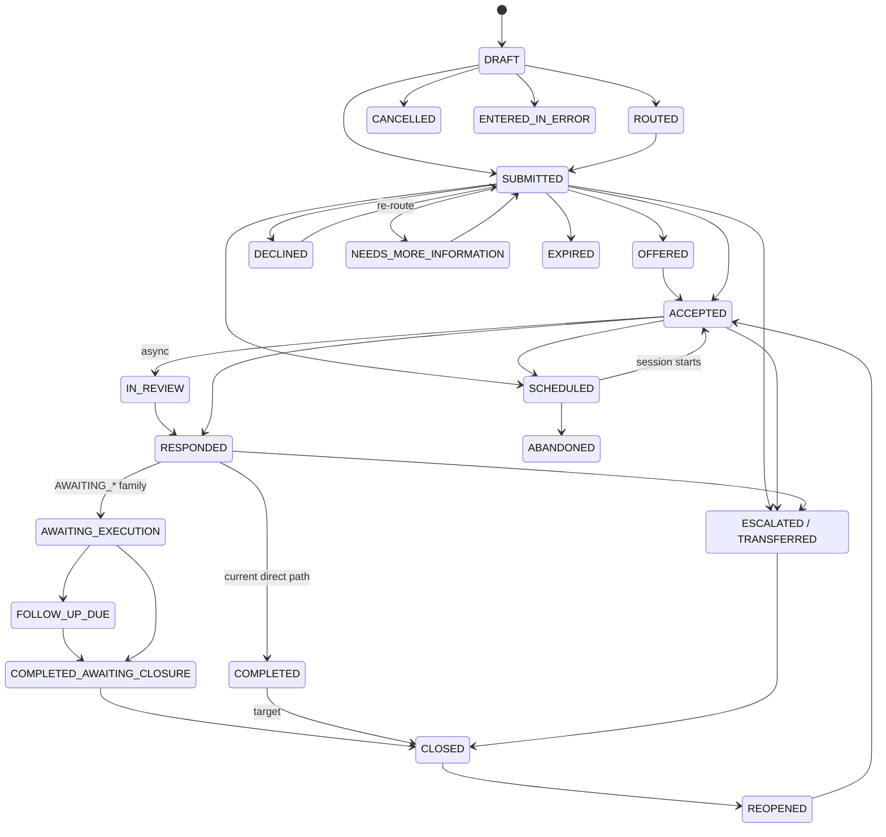

### 11.5 Session-plane machines (implemented `[LIVE]`)

Participant: `WAITING → ADMITTED → CONNECTED → LEFT`, `WAITING → DENIED` (token-eligible = ADMITTED|CONNECTED|LEFT). Media session: `PROVISIONED → ENDED`. Recording: `ACTIVE → COMPLETE | FAILED | STOPPED`. Appointment (booking): per booking-service contract, linked not embedded.

---

## 12. Information and Data Model

**Prime directive.** There is **no parallel telemedicine clinical model**. PCT maintains an internal **orchestration aggregate** (`pct_referrals` + queue/pool/telehealth tables) for workflow state, assignment, room metadata and timers — this is legitimate. Clinical facts MUST map to the shared clinical model (BUTANO/SHR, FHIR R4 baseline; IPS for summaries; IHE document/imaging profiles and DICOM where imaging participates; ZIBO-mediated terminology, never arbitrary free-text codes).

### 12.1 FHIR R4 resource evaluation

| Resource | Telemedicine use | Status |
|---|---|---|
| Patient | Subject by **CPID reference only** (no PII in SHR — `PiiPreventionInterceptor` enforced) | `[LIVE]` (identity plane) |
| RelatedPerson | Guardian/caregiver | **Deliberate deviation:** delegation is the MVUMO `Relationship` entity, not FHIR RelatedPerson. Mapping to RelatedPerson is OPTIONAL for export only. `[DECISION D-8]` |
| Practitioner / PractitionerRole | VARAPI provider identity/registration; VASHANDI posting | `[BUILT]` (VARAPI/VASHANDI SoR; FHIR projection partial) |
| Organization / Location / HealthcareService | TUSO facilities, services; virtual institutions pending substrate | `[PARTIAL]` |
| Encounter | Virtual encounter (class virtual) linked to case | `[PARTIAL]` |
| EpisodeOfCare | Case-chain across follow-ups | `[ABSENT — target]` |
| Appointment / Schedule / Slot | booking-service appointment (TELECONSULT) | `[BUILT]` (internal model; FHIR projection absent) |
| Task | Local execution tasks | `[ABSENT — TM-B7]` |
| Communication / CommunicationRequest | Clinically relevant messages; notification requests | `[PARTIAL]` (Khuluma/notification internal models) |
| CareTeam | Session/case participants incl. MDT | `[ABSENT]` |
| Consent | **tshepo-consent-service is the FHIR Consent authority**; MVUMO materialises directives into it | `[LIVE]` |
| Questionnaire / QuestionnaireResponse | Structured package sections; forms-service owns definitions (PCT must not) | `[PARTIAL]` |
| Composition | Referral note; response note; IPS document (`IpsBundleGenerator` — FINAL composition) | `[PARTIAL]` |
| DocumentReference | Attachments; adopted recordings | `[LIVE]` (document-service) |
| Observation | Vitals/monitoring (IPS vital-signs + laboratory categories live) | `[PARTIAL]` |
| DiagnosticReport | Completion summary (thin, `teleconsult-summary` code) — MUST be enriched (TM-G11) | `[LIVE-thin]` |
| ImagingStudy | Imaging review sessions | `[PARTIAL]` (PACS plane) |
| Condition / AllergyIntolerance | Diagnosis/problems; allergy truth | `[LIVE]` (SHR) |
| MedicationRequest / MedicationAdministration | Teleconsult prescriptions; local administration record | `[PARTIAL]` (pharmacy path; teleconsult provenance missing) |
| ServiceRequest / Procedure | Orders; performed procedures | `[PARTIAL]` (OROS internal; teleconsult wiring TM-G4) |
| CarePlan / Goal | Care-plan updates | `[PARTIAL]` |
| Provenance / AuditEvent | Authorship + modality provenance on every artefact; audit | `[PARTIAL]` (audit events exist; FHIR Provenance projection target) |

### 12.2 Element ownership (rule per element)

For each data element the spec's rule is: **owner** (registry SoR) · **source of truth** (single) · **authoritative identifier** (§5 table) · **create/update rights** (TSHEPO-gated role) · **versioning** (immutable audit history) · **provenance** (class + author + freshness) · **retention** (policy-configurable; clinical artefacts follow national record retention) · **sensitivity** (visibility tiers) · **offline behaviour** (§19 class). The [traceability matrix](telemedicine-traceability-gap-matrix.md) carries the full element-by-element table.

## 13. Service Responsibilities and Integrations

Binding ownership (verbatim registry constraints in brackets):

| Service | Owns in telemedicine | MUST NOT | Participates when |
|---|---|---|---|
| **PCT** | Case lifecycle, stages, tasks, assignments, timers, completion, telehealth session records, ops snapshot | Become the media server; duplicate the SHR; own form definitions | Always (case spine) |
| **Impilo Live (live-service)** | Live engagement layer; `CLINICAL_SESSION` bridge; events/attendance/replay for its modes | Own clinical encounter lifecycle; bypass TSHEPO | VIDEO clinical sessions; teaching/broadcast modes |
| **rtc-gateway + LiveKit** | Media sessions, lobby truth, tokens, recording transport, webhooks→events | Be clinical/finance SoR; embed business workflows; expose raw room credentials | Any real-time media |
| **Khuluma** | Conversations, participants, receipts, presence, links(REFERRAL/ENCOUNTER/CASE), escalations/SLA, realtime push | Duplicate notification inbox, channels sessions, live events, call/meeting media SoR | Threads, waiting-room comms, on-call presence, async continuation |
| **notification-service** | External channel delivery (SMS/EMAIL/WhatsApp/USSD), templates, providers | Clinical/finance SoR | Every external message |
| **Nompilo (guidance-service)** | Route-bound contextual guidance, Ask, command bar | Diagnose, prescribe, alter clinical facts, create unreviewed orders | All user-facing stages |
| **TSHEPO (+ tshepo-authz)** | 10-dimension PDP, ext_authz, work-context tokens, visibility profiles | Be bypassed (no exceptions) | Every request |
| **MVUMO** | Consent journeys/templates/proofs, delegations (guardian/caregiver), remote consent sessions | Hold the FHIR Consent authority (that is tshepo-consent) | Consent capture, proxy actions, break-glass acknowledgement |
| **tshepo-consent-service** | FHIR R4 Consent storage + evaluation (`/v1/consent/evaluate`) | — | Consent enforcement decisions |
| **VITO** | Client identity, Impilo ID issuance, safe search, dedup/merge | Public people-search | Patient resolution, conflicts |
| **VARAPI** | Provider identity, cadre, licence, restrictions, status axes | — | Before any clinical assignment/acceptance |
| **VASHANDI** | Employment, posting, shift, roster | Imply authority from registration alone | Assignment/duty checks; on-call (pending) |
| **TUSO** | Facility/service/workspace/capability; (target) virtual-institution substrate per HO-2 | Free-string facility typing for routing | Routing, context |
| **BUTANO/SHR (+ fhir-gateway PEP)** | Longitudinal clinical truth; enforcement | Accept PII; be silently overwritten (concurrency + provenance rules §18) | All clinical reads/writes |
| **OROS** | Clinical orders + fulfilment | — | Stage 5/6 orders (wiring TM-G4) |
| **ZIBO** | Terminology (`impilo-clinical-priority`, booking codes, procedure codes; specialty CodeSystem pending TM-G7) | — | All coded fields |
| **Ndila / Nhume** | Location/routing; dispatch/transport | — | Physical conversion, transfer, ambulance |
| **Daidzai** | Emergency/EMS orchestration (orchestrates, does NOT own PCT/Butano/Khuluma/Rito domains) | — | Emergency escalation |
| **Rito** | Feedback, complaints, experience, safety reporting, mortality-review ownership | — | Post-closure feedback; safety incidents; quality loops |
| **COSTA / MUSHEX / Ruvimbo** | Costing/billing; payments; coverage/authorisation | Obstruct emergency care on financial status (absolute) | Completion billing `[LIVE]`; coverage rules must be explicit + auditable |
| **Fundo** | Tele-education, CPD, learning artefacts | Repurpose clinical sessions for teaching/recording without separate authority + consent | Teaching/supervision/recorded learning |
| **booking-service / scheduling-service** | Appointments/slots | — | Scheduled sessions, follow-ups |
| **document-service** | Attachments, adopted recordings, signed URLs | — | Stage 2 attachments; Stage 7 artefacts |

**No service is forced into every journey**: e.g. an async provider-to-provider advice case with no patient media touches PCT, TSHEPO, VARAPI, Khuluma/notification — and legitimately never touches rtc-gateway, MVUMO media consent, COSTA (if non-billable), Ndila/Nhume, or Fundo.

## 14. Frontend and Mobile Experience

**Route inventory (canonical today).** Provider web: `/telemedicine`, `/telemedicine/new`, `/telemedicine/session/[sessionId]`, `/telemedicine/analytics`, `/work/telemedicine{,/worklist,/virtual-hospitals[/id],/routing,/groups,/session-modes,/operations}`, `/ehr/[patientId]/consults?tab=teleconsults`, queues `/queue/{waiting,triage,incoming-referrals,scheduled}`. Citizen web: `/discover/virtual-care`, `/citizen/virtual-care{,/request}`, `/my/telehealth[/​[sessionId]]`, `/my/comms`. Adjacent: `/live/**` (Impilo Live), `/learning/sessions/[id]/classroom`, `/ask`, `/guidance`. Mobile: provider `TelemedicineScreen`/`TelemedicineCallScreen`/`ProviderLiveHubScreen`; citizen `TelehealthListScreen`/`TelehealthSessionScreen`/`CommsHubScreen`; shared `mobile-session` engine; deep linking per `DEEP_LINKING.md`.

**Design principles (all normative).** Responsive; mobile-first; no excessive vertical scrolling; horizontal stepper/wizard where suitable; collapsible contextual panels; persistent patient + urgency context; clear back/forward; visible save state; clear stage + status; **no dead-end pages** (every state names its next action); no flat text walls; progressive disclosure; role-aware workspaces; accessible typography; keyboard navigation; screen-reader compatibility; high-contrast; low-literacy support; plain-language patient content; **English, Shona, Ndebele readiness**; clear offline/stale indicators; safe loading + retry; meaningful empty states; **no mock buttons and no cosmetic controls without durable backend behaviour** (enforced by `test:no-stubs` — controls awaiting backends use honest disabled/deferred states, the established repo pattern).

**Per-screen contract.** Every screen MUST define primary actions, secondary actions, empty state, loading state, error state, offline state, permission-denied state, mobile adaptation, deep-link behaviour. The screen inventory with these contracts is Appendix I; deep links MUST survive auth (post-login return) and honour zone gating.

## 15. Backend and API Requirements

**Capability → current endpoint mapping** (naming follows existing conventions; do not invent parallel paths):

| Capability | Endpoint (today) | Notes |
|---|---|---|
| Create case | `POST /internal/v1/teleconsult/sessions`; citizen `POST /internal/v1/virtual-care/requests` | VITO fail-closed; idempotent |
| Save draft/package | `PUT …/sessions/{id}/referral` | server draft |
| Attach document | document-service + `attachmentDocumentIds` | scanning gap TM-G18 |
| Capture/validate consent | `POST …/sessions/{id}/consent` → MVUMO; evaluate via tshepo-consent | |
| Recommend/route | `POST …/sessions/{id}/route`; PCT `POST /v1/referrals/{id}/route` | 501 for unbuilt types |
| Worklists/queues | `GET …/sessions`, `GET …/pool/{poolId}/queue`, `/referrals/incoming` | |
| Claim/accept/decline/info | `POST …/sessions/{id}/{accept|decline}`; messages for info-request | decline reason mandatory |
| Schedule | booking-service via BFF; link V032 | |
| Check in / waiting room | `GET …/sessions/{id}/waiting-room`; admit/deny endpoints | lobby truth in rtc-gateway |
| Create media session / token / join / leave / attendance | rtc `POST /internal/v1/rtc/sessions`, `…/participants/token[/refresh]`, admit/deny, participants, stats | template-enforced |
| Secure message | `POST/GET …/sessions/{id}/messages`; Khuluma `/conversations` | |
| Clinical draft/response | `POST …/sessions/{id}/response`; PCT `respond-structured` | |
| Place order / assign task | **target** — OROS with TELECONSULT source + Task model | TM-G4/B7 |
| Complete / record execution | `POST …/sessions/{id}/complete` (idempotent, note-enforced) | |
| Follow-up schedule | **target** (TM-B7/G8) | |
| Close/reopen/cancel/escalate/transfer | **target** state-machine endpoints (TM-B1) | |
| Audit history | **target** case-audit read API | |
| Ops | `GET …/ops/{sla,rtc-health,specialty-workbench}`, `/ops/telemedicine` | |

**Platform requirements (normative, all endpoints):** Idempotency-Key on writes `[LIVE]`; optimistic locking/versioning on mutable aggregates (ETag or repo-equivalent) `[PARTIAL]`; bounded retries; transactional outbox (`event_outbox` in every service `[LIVE]`) + dead-letter handling `[PARTIAL]`; correlation + causation ids (`X-Correlation-ID` `[LIVE]`; causation `[PARTIAL]`); event + API versioning (`impilo.rtc.*.v1` pattern; extend to lifecycle events `[TM-G12]`); pagination/filtering on lists; websocket/SSE updates (Khuluma realtime gateway; `useSessionRealtime`) `[LIVE]`; rate limits `[PARTIAL]`; access control server-side always; safe error responses (structured codes like `CONSENT_REQUIRED`, `ROUTING_TYPE_UNAVAILABLE`, `VIRTUAL_HOSPITAL_NOT_YET_ROUTABLE` — no stack traces, no PHI in errors).

## 16. Event and Notification Model

### 16.1 Event catalogue (canonical names — current where they exist, target names follow the same conventions)

| Commissioned concept | Canonical event (today) | Topic |
|---|---|---|
| TelemedicineCaseCreated | `telemedicine.session.referral_created` (+`.created`) | `clinical.teleconsult.lifecycle` |
| ReferralDraftSaved | `telemedicine.session.referral_updated` | same |
| ReferralSubmitted | submit → lifecycle event + `.followup_required` | same |
| ConsentCaptured | `telemedicine.session.consent_updated` | same |
| RoutingRecommended / CaseRouted | `telemedicine.session.routed` | same |
| CaseOffered / CaseAssigned | pool materialisation (`pct.telemedicine.pool.materialized`) | pool topic |
| AdditionalInformationRequested | `telemedicine.session.support_requested` | lifecycle |
| CaseAccepted / CaseDeclined | acceptance/decline in lifecycle | lifecycle |
| AppointmentScheduled | `telemedicine.session.scheduled` | lifecycle |
| PatientCheckedIn / WaitingRoomEntered | `.waiting_room.entered`; `impilo.rtc.participant.waiting.v1` | lifecycle / rtc |
| SessionStarted / Ended | `.started`/`.media_started`/`.media_ended`; `impilo.rtc.session.{started,finished}.v1` | lifecycle / rtc |
| ParticipantJoined/Disconnected | `impilo.rtc.participant.{joined,left}.v1` | rtc |
| NetworkDegraded | quality telemetry (`participant_stats`) — **event target** | — |
| ClinicalResponseSubmitted | `telemedicine.session.response_submitted` | lifecycle |
| OrderPlaced / TaskAssigned | **target** (OROS/Task wiring) | — |
| ResponseAcknowledged / FollowUpScheduled / FollowUpOverdue | **target** | — |
| CaseEscalated / CareTransferred | **target** | — |
| CompletionNoteSubmitted / CaseClosed | `.completed` + `TELECONSULT_COMPLETED` | lifecycle + `clinical.teleconsult.value` + `core.transaction.events` |
| CaseReopened | **target** | — |
| NotificationDeliveryFailed | notification-service delivery state — **event target** | — |
| RecordingAttached | `telemedicine.session.recording_attached` (consumer of `impilo.rtc.recording.available.v1`) | lifecycle |
| SLA breach | `pct.telemedicine.queue.sla.breached` | pool topic |

### 16.2 Notification catalogue

Delivery split (normative): **Khuluma** owns in-platform conversations/realtime/presence and SHOULD orchestrate journey messaging; **notification-service** executes external channels. *Current drift:* teleconsult lifecycle notifications are emitted **BFF→notification-service directly** (`emitTelemedicineNotification`), with Khuluma consuming lifecycle topics for its own surfaces — a ratification decision is required (OD-3) and until then both paths are documented, neither removed.

Every notification defines: trigger · recipient · permitted channels · urgency · PHI sensitivity · purpose · retry · fallback channel · acknowledgement requirement · escalation · expiry · deep link · audit. **External messages MUST NOT carry diagnosis, HIV status, mental-health detail, reproductive-health detail or other sensitive clinical content** — time, place, action and deep link only.

Catalogue (keys where they exist): referral submitted (referrer confirm, in-app) · case assigned/accepted (`TELECONSULT_*` via BFF) · more info requested (actionable) · appointment scheduled/changed (booking V009/V010) · pre-session + device-check reminder (**blocked by NotifyRequest lacking `scheduledAt` → TM-G14**) · provider delayed / patient delayed · waiting-room update (`rtc.telemedicine.patient-waiting`) · clinician ready (`rtc.telemedicine.session-ready`) · missed appointment / failed call · async response available · order/action available · follow-up due · critical action overdue · closure · feedback request (Rito). Registration script: `register-session-notification-templates.sh`.

## 17. Trust, Consent, Privacy and Security

**Identity (binding, per `identity-trust-contract.md` — it wins).** Public term: **Impilo ID** ("Impilo Health ID"). HID/CRID/CPID never client-facing; browser holds neither (short-lived Patient Context Token + authorised display data). Clinical subject key: CPID, minted only by tshepo-identity, never derived. Legacy UI copy saying "Health ID" to citizens is **non-compliant** and scheduled for correction (TM-G15). Provider identity is HID-plane (Varapi `impilo_health_id`) and out of CPID scope.

**Authority (provider).** Professional identity + current licence + restrictions + scope + cadre + qualifications (VARAPI axes; derived projections only via `deriveStatusProjections`) + facility/virtual affiliation + employment/assignment + shift (VASHANDI engagement types incl. `TELEMED`) + delegated authority + trainee supervision + jurisdiction (diaspora/cross-border `[PENDING-POLICY]`) + prescribing authority + emergency exception. Enforced per action at the PDP (`WORK-REQUIRES-ASSIGNMENT`, `WORK-TOKEN-CONTEXT-MATCH`); never baked into tokens.

**Consent model.** MVUMO journey (templates incl. `DIGITAL_TELEMEDICINE` L1, `GOVERNANCE_BREAK_GLASS` L4; methods PORTAL_CONFIRM/TOKEN_LINK/TELEMEDICINE_SESSION/EXPLICIT_OPT_IN) → tshepo-consent FHIR Consent directive → case pointers. Consent record fields: subject, consenting person, relationship, capacity, witness, scope, purpose, participants, channel, effective period, revocation, emergency basis, provenance, evidence, policy version. **A single generic consent token does not solve every consent problem**: virtual-care consent ≠ data-sharing consent ≠ additional-participant consent ≠ recording consent ≠ teaching consent ≠ photography/upload consent ≠ remote-monitoring consent — each is a distinct MVUMO template/scoped directive. Special populations: minors (guardian delegation, age-based self-claim), newborns (distinct person), reduced capacity, unconscious (emergency basis), mental-health contexts (restricted visibility `[PENDING-POLICY]`), safeguarding, sensitive services, caregiver access, separated guardians (per-guardian delegations), participant invitations, break-glass (reason + approver + duration + review), **withdrawal during an active session stops the affected modality immediately** `[PARTIAL]`.

**Purpose-of-use.** Two vocabularies exist (enum `TREATMENT…BREAK_GLASS/SYSTEM` vs policy-seed `PERSONAL_CARE`/`CARE_COORDINATION`/`RESOLUTION`) — reconciliation is OD-2; until ratified, use the enum on clinical actions and the seed vocabulary where seeds require it.

**Security engineering.** Server-issued least-privilege time-bound tokens; no raw room credentials in UX; TURN-over-TLS on 443; PHI-free room names/telemetry/logs; visibility tiers + PEPs (pct timeline 403; fhir-gateway `VISIBILITY_CLINICAL_BLOCKED`); escalation grants (`visibility_escalation_request/grant`); malware scanning at upload (TM-G18); secrets via cluster secret management (LIVEKIT_KEYS pattern); certificate rotation with fingerprint-gated reload; penetration testing per programme policy.

## 18. Clinical Safety and Multi-Writer Requirements

The platform MUST: never silently overwrite safety-critical information; use optimistic concurrency; display conflicting versions; retain provenance; require reconciliation for medications, allergies, diagnosis status, critical observations and disposition; distinguish draft from signed data; surface freshness; flag offline/provisional data; prevent stale snapshots appearing current; support addenda/corrections; preserve immutable audit; handle simultaneous local + remote documentation; prevent duplicate orders (idempotency + same-case-same-order detection); support critical-result acknowledgement; support task ownership + escalation; prevent unqualified acceptance; enforce countersignature where required.

**Conflict UX (normative — not a backend exception).** On write conflict the author sees, in place: both versions side-by-side with author/time/context, the safety-critical differences highlighted, and three actions — adopt theirs, keep mine (with reason), or merge field-by-field; unresolved safety-critical conflicts block signing, never silently pick a winner. Reconciliation events are audited and visible on the timeline. `[ABSENT as UX — TM-B6]`

## 19. Offline and Low-Connectivity Operation

**Postures.** Facility offline / remote provider offline / both intermittent — no design may assume permanent real-time synchronisation.

**Mechanisms (normative set).** Local durable drafts; queued submission; **signed store-and-forward package** (case identity, patient identity, consent, clinical question, summary snapshot + freshness timestamp, documents/images, local capabilities, urgency, signatures, provenance, checksum/integrity control, expiry/review deadline); attachment compression + resumable upload; delayed notification + order delivery; provisional local action records; central write awaiting reconciliation; duplicate-event prevention (idempotency keys, event ids); timeline reconciliation with **clock-skew tolerance** (server-authoritative ordering, client timestamps advisory); media failure → chat continuation; video→audio→async downgrade ladder; stale-summary warnings; post-reconnect conflict resolution via §18 UX. Current state: downgrade ladder partial, async spine live, offline case/draft/queue `[ABSENT — TM-B5]`.

## 20. Scheduling, Queues and Routing

Covered normatively in Stage 3; contract summary: booking-service owns appointments (`TELECONSULT` type, ZIBO booking codes); PCT owns queue materialisation + SLA breach events; routing decision classes recorded; unbuilt routing types fail closed (501); no-provider-available → monitored exception queue (target); SLA values are configurable policy pending national ratification — **this document invents no clinical SLA numbers**.

## 21. Orders, Tasks and Results

Orders placed in/after a teleconsult MUST: enter OROS with `TELECONSULT` request source + case linkage (TM-G4); flow normal fulfilment/acknowledgement/result-return; return results to the case's awaiting-results posture; require acknowledgement for critical results with escalation on timeout (§16 catalogue); prevent duplicates (§18). Tasks MUST carry owner + due + state, feed the Awaiting-Local-Action worklists, and escalate on overdue (TM-B7). Medication orders traverse pharmacy fulfilment with teleconsult provenance.

## 22. Follow-Up, Monitoring and Loop Closure

Follow-up is a **first-class recurrent loop**: a follow-up commitment (timeframe + mode + owner) is captured in Stage 6, tracked in Stage 7 (`FOLLOW_UP_DUE`), executed as a linked case (type 12/22, chain via origin refs/EpisodeOfCare), and can recur indefinitely. Monitoring reviews (type 13) are scheduled instances of the same loop fed by observation intake `[ABSENT — RPM]`. Loop closure back to the referrer (completion note visible at origin; "Returned from teleconsult" surfaced in the EHR chart `[LIVE]`) is mandatory. Overdue follow-up escalates to the owner and ops (TM-B7).

## 23. Emergency Escalation and Conversion to Physical Care

Telemedicine MUST NOT trap an emergency in a virtual workflow. The **Emergency action is clearly visible without dominating routine care** (session header + waiting room + citizen surfaces).

| Moment | Required behaviour | Services |
|---|---|---|
| Before joining (entry/triage) | Danger-sign evaluation → emergency pathway offer; urgency EMERGENCY fast-path | PCT, Nompilo (phrase detection → escalate, never diagnose) |
| Waiting room deterioration | Patient/caregiver emergency control → provider + desk alert; local emergency services instructions | rtc events, Khuluma, notification |
| During consultation | Remote clinician triggers: urgent local action; local emergency call; Daidzai escalation; Nhume dispatch/transfer; Ndila routing + facility destination selection | Daidzai (orchestrates), Nhume, Ndila, TUSO |
| Conversion to physical care | Transfer note (mandatory); structured handover; **virtual clinician continues until safe handoff where appropriate**; facility destination confirmed | PCT (TRANSFERRED target state), SHR |
| Failure of escalation | Documented failed-escalation record + alternative path + ops alert — never silent | PCT, ops |
| After the event | Guardian/caregiver notification; break-glass review; post-event review (Rito; mortality review under Rito ownership) | MVUMO/TSHEPO, Rito |

Emergency break-glass: `PurposeOfUse.BREAK_GLASS`/`EMERGENCY`, MVUMO `GOVERNANCE_BREAK_GLASS` L4 acknowledgement, `breakGlassReason` + approver captured (BFF `[LIVE]`), mandatory review. **Financial status MUST NOT obstruct emergency care** (absolute; binds COSTA/MUSHEX/Ruvimbo participation).

---

## 24. Quality, Performance and Operational Oversight

**Metric set (operational + clinical).** Requests; demand by service/geography; time-to-route; time-to-first-review; time-to-acceptance; time-to-consultation; consultation duration; response turnaround; queue aging; abandonment; no-show; reassignment; decline reasons; escalations; transfers; order completion; follow-up completion; closure delay; dropped-call rate; reconnect success; audio-only fallback rate; failed notifications; patient experience; provider experience; safety incidents; complaints; outcome distribution; **equity of access** (geography, language, connectivity class); low-bandwidth performance; service availability. Surfaces today: `/ops/sla`, `/ops/rtc-health`, `/ops/specialty-workbench`, `/telemedicine/analytics`, `participant_stats` `[BUILT]`; per-session failure drill-down `[PARTIAL]`.

**Telemetry hygiene (MUST).** No protected clinical content in telemetry or application logs — metrics are counts/durations/status codes keyed by ids, never narratives. **Rito integration**: feedback requests at closure, complaints, safety reporting, quality-improvement loops (Rito owns experience + mortality-review) `[PARTIAL]`.

## 25. Accessibility, Language and Inclusion

Normative: WCAG-aligned components; keyboard-complete; screen-reader labelled (session controls especially); high-contrast; captions/interpreter support for deaf users (INTERPRETER role live; captions `[PENDING — accessibilityOptions hooks exist]`); low-literacy plain language; **English/Shona/Ndebele** readiness for all patient-facing content (instructions in Stage 6 explicitly); audio-first pathways for low-literacy/low-bandwidth users; USSD/IVR reach via notification-service channels for non-smartphone users `[PARTIAL]`; disability + communication needs recorded in the package (Stage 2) and honoured in session setup.

## 26. Non-Functional Requirements

Numerical targets are **configurable-pending-approval** unless a ratified source exists; none are invented here.

| Domain | Requirement |
|---|---|
| Availability / DR / backup | Media plane degradable to async without data loss; case spine on the platform's Postgres HA/backup posture; recovery procedures per estate runbooks |
| Scalability / capacity / concurrency | Single-SFU today (preview scale); national scale requires distributed LiveKit + regional TURN (documented future architecture — the `turn.` SNI seam is the expansion point); pool queues virtualised |
| Latency / media quality | Adaptive streaming + dynacast `[LIVE]`; audio-first fallback; quality events captured |
| Reliability / retry / recovery | Idempotent writes; outbox delivery; webhook retry (bounded); reconnect grace 120 s |
| Security / privacy / audit | §17; §5 identifiers; CLINICAL audit depth; immutable history |
| Maintainability / observability | §27; honest-gap UI doctrine keeps surface truthfully in sync with backend |
| Accessibility / localisation / mobile / browser | §25; native mobile parity `FULL` for TELEMEDICINE; evergreen browsers + WebRTC baseline |
| Low bandwidth | Audio-only mode; low-bandwidth toggle; compressed attachments; async ladder |
| Data + media retention / storage | Recordings: MinIO + document-service adoption, retention policy-configurable; attachments virus-scanned (target), size/format-limited |
| Encryption / secrets / certs | TLS everywhere at edge; DTLS-SRTP media (§Stage 5 I — no E2EE claim); secrets in cluster secrets; cert renewal auto-syncs + fingerprint-gated LiveKit reload `[LIVE]` |
| Abuse prevention / rate limiting / DoS | BFF + gateway rate limits `[PARTIAL]`; token TTLs; lobby admission prevents room flooding |
| Safe failure | Fail-closed on identity/consent/authority; fail-open NEVER for clinical writes; honest UI states on backend absence |

## 27. Observability, Audit and Reporting

Golden signals per service (BFF teleconsult routes, PCT lifecycle, rtc-gateway sessions/webhooks, LiveKit node) + event-stream lag; session diagnostics from `rtc.session_events`/`participant_stats` (query API target); audit chain: TSHEPO decision ids on case, CLINICAL-depth session audit, completion/final events; reporting via analytics `/internal/v1/telemedicine/sla` and ops snapshot `/ops/telemedicine`. Log hygiene per §24. National reporting derives from events (`clinical.teleconsult.*`, `core.transaction.events`) — never by scraping service databases.

## 28. Testing Strategy and Journey Catalogue

The full 40-journey catalogue with persona/preconditions/steps/expected UI/states/APIs/events/SHR writes/audit/notifications/failure criteria lives in [`telemedicine-journey-catalogue.md`](telemedicine-journey-catalogue.md). Test pyramid (all mandatory classes): unit; state-machine; policy; API contract; event contract; integration; persistence; restart recovery; concurrency; offline reconciliation; WebRTC/media (real browsers, fake devices); TURN fallback; low-bandwidth simulation; mobile; accessibility; browser; load; failover; security; privacy; clinical-safety; end-to-end. **A green frontend mock is not proof of a working telemedicine journey** — journey proof requires runtime evidence against the live estate (the established `scripts/runtime-proof/*` + Playwright pattern with psql/API assertions).

## 29. Detailed Acceptance Criteria

Stage-level acceptance criteria are embedded in each stage's **W** section; journey-level criteria in the catalogue; state-machine criteria in §11.3 rows; the traceability matrix binds each requirement to its verification.

## 30. Implementation Gap Analysis

Maintained as a living document: [`telemedicine-traceability-gap-matrix.md`](telemedicine-traceability-gap-matrix.md) (requirement → source → decision → owner → surface → API → table → event → FHIR → tests → status → gap → priority → remediation).

## 31. Prioritised Implementation Backlog

Maintained as a living document: [`telemedicine-implementation-backlog.md`](telemedicine-implementation-backlog.md) (20 epics, per-item problem/outcome/owner/dependencies/acceptance/tests/migration/risk/priority/national-blocker flag).

## 32. Open Decisions and Explicit Assumptions

| # | Open decision (requires PO / clinical-policy / architecture sign-off) | Interim posture |
|---|---|---|
| OD-1 | National SLA values for routine/priority/urgent/emergency response, acceptance, follow-up and closure timers | Configurable policy values; no numbers invented |
| OD-2 | Purpose-of-use vocabulary reconciliation (enum vs policy-seed namespaces) | Enum on clinical actions; seed vocab where seeds demand |
| OD-3 | Notification orchestration: ratify BFF→notification-service direct emission vs routing journey messaging through Khuluma | Both documented; neither removed |
| OD-4 | Consent hard-gate default: make `consentReference`-required-for-media default-on (currently flag-gated) | Flag-gated; target default-on (TM-G3) |
| OD-5 | Identity copy migration plan ("Health ID" → "Impilo ID" in citizen-facing UI) — wording, cards, translations | Contract is ratified; copy migration scheduled (TM-G15) |
| OD-6 | Primary-responsibility transfer policy (when a remote clinician may become primary; countersignature rules for trainees) | Consulting-role default; transfer requires explicit record |
| OD-7 | Virtual-hospital regulatory model (operating authority, jurisdiction, diaspora privileges — HO-2/HO-4) | Config-only substrate; fail-closed |
| OD-8 | Guardianship export mapping (MVUMO Relationship → FHIR RelatedPerson) for interoperability | Internal model authoritative; export optional |
| OD-9 | Recording retention periods and patient access to recordings | Policy-configurable; artifact owner PCT |
| OD-10 | Session-chat clinical persistence rule (which chat content becomes record, mechanism) | Template `SESSION` persistence; TM-G10 target |

**Explicit assumptions.** A1: FHIR R4 remains the ratified interoperability baseline. A2: LiveKit remains the media implementation (provider-neutral abstraction retained). A3: The uploaded source documents contain no requirement contradicting the commissioning brief's distillation (see §1 source-recovery note). A4: Single-tenant national deployment posture for v1 scale statements.

## 33. Appendices

### Appendix A — Role-permission matrix (summary)

| Capability | Citizen | Caregiver (delegated) | Referrer | Consulting clinician | Pool coordinator | Facility desk | Ops | Helpdesk | Learner/Observer |
|---|---|---|---|---|---|---|---|---|---|
| Create case | policy-permitted request | via delegation | ✔ | — | — | ✔ (on behalf) | — | — | — |
| Build package | supply data | supply data | ✔ | — | — | assist | — | — | — |
| Route / schedule | — | — | ✔ | propose | ✔ | ✔ | — | — | — |
| Accept / decline | — | — | — | ✔ (authority-gated) | reassign | — | — | — | — |
| Join session | ✔ (admitted) | ✔ (consented+admitted) | ✔ | ✔ (roomAdmin) | — | readiness | — | diagnostics only, no clinical content | subscribe-only, hidden |
| Admit / deny | — | — | — | ✔ | — | ✔ (policy) | — | — | — |
| Start recording | — | — | — | ✔ (consent-gated) | — | — | — | — | — |
| Orders | — | — | own authority | ✔ per authority | — | — | — | — | — |
| Respond / complete | — | — | complete (execution) | ✔ respond | — | assist | — | — | — |
| Reopen / cancel / error-mark | — | — | request | request | — | — | ✔ governed | — | — |
| Ops dashboards | — | — | — | own metrics | pool metrics | facility metrics | ✔ | RTC health only | — |

### Appendix B — State-transition matrix
§11.3 is the normative table; the machine-readable transition set ships with the state-machine implementation (TM-B1).

### Appendix C — FHIR resource mapping
§12.1 is the normative table.

### Appendix D — Event catalogue
§16.1 is the normative catalogue (verbatim current names).

### Appendix E — Notification catalogue
§16.2 is the normative catalogue.

### Appendix F — Error catalogue (structured codes in use)

| Code | Meaning | Where |
|---|---|---|
| `CONSENT_REQUIRED` | Media/action blocked pending consent | BFF 403 / citizen 422 |
| `CONSENT_REQUIRED_MISSING` | Submit without consent | legacy guard 409 (target on active spine) |
| `ROUTING_TYPE_UNAVAILABLE` | Unbuilt routing type | 501 |
| `VIRTUAL_HOSPITAL_NOT_YET_ROUTABLE` | Non-requestable VH | 422 |
| `VISIBILITY_CLINICAL_BLOCKED` | Visibility tier denies clinical read | fhir-gateway 403 |
| Completion-note 400 | Completion without note | PCT |
| `MATCH_CANDIDATE_FOUND / STEP_UP_REQUIRED` | Identity weak match | identity plane |

### Appendix G — Sample payloads
Canonical samples live with the contracts: `contracts/openapi/pct.openapi.yaml` (telehealth session create), `contracts/schemas/session-templates/telemedicine.json` (template), `contracts/openapi/mobile-{provider,citizen}.openapi.yaml`, `contracts/impilo-live.ts`. The structured response spine: `{"diagnosis": "...", "actionPlan": "...", "redFlags": "...", "followUp": "..."}`; the completion note: `{"actionsTaken": "...", "patientOutcome": "improved", "closureNarrative": "...", "followUp": "...", "completedBy": "<provider>", "completedAt": "<ts>"}`.

### Appendix H — Sequence diagrams

**H.1 Provider-to-provider teleconsultation (happy path)**
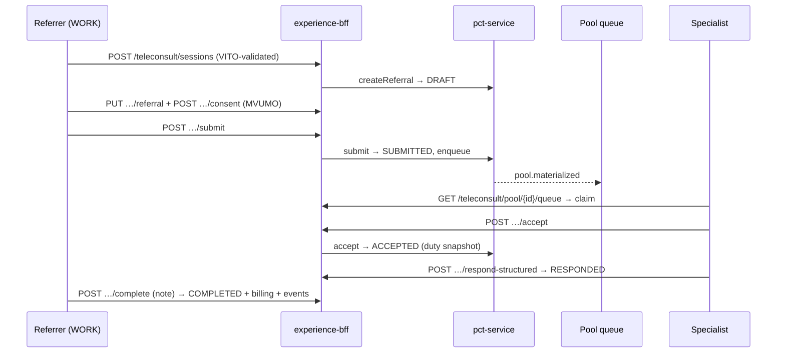

**H.2 Direct patient consultation with waiting room**
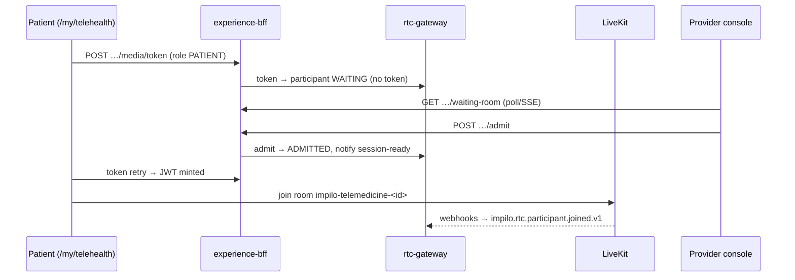

**H.3 Asynchronous store-and-forward**
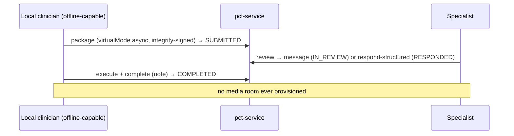

**H.4 Emergency escalation from a session**
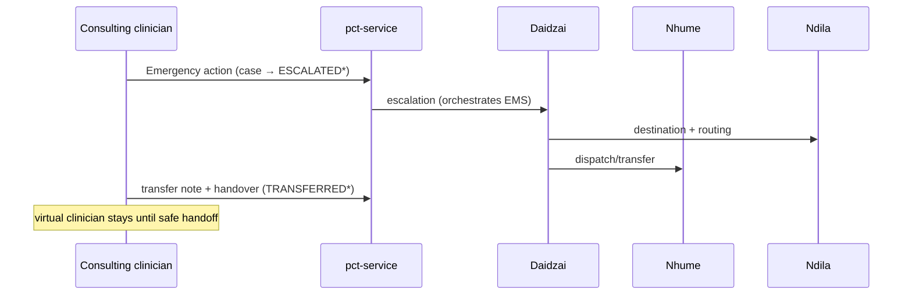

**H.5 Session creation + token issuance (governed)**
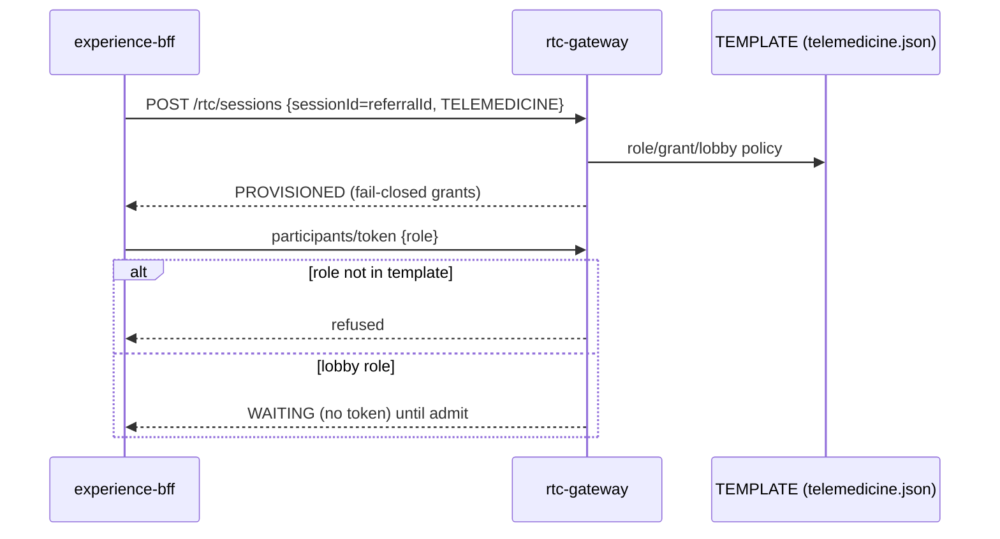

**H.6 Response submission and SHR write**
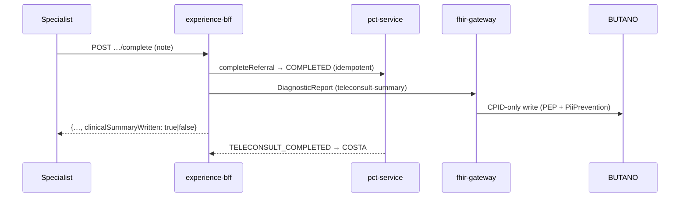

**H.7 Offline reconciliation (target)**
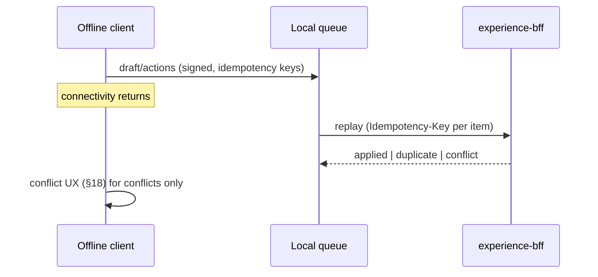

**H.8 Closure and follow-up loop**
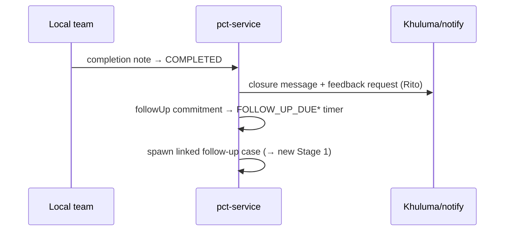

### Appendix I — Screen inventory
§14 route inventory is normative; per-screen state contracts (empty/loading/error/offline/denied/mobile/deep-link) accompany each route's implementation and are asserted by the shell gates (`test:routes`, `test:no-stubs`).

### Appendix J — End-to-end journey matrix
[`telemedicine-journey-catalogue.md`](telemedicine-journey-catalogue.md).

---

*End of specification. Change control per §1.*
