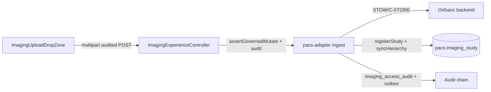

# DICOM Governed Upload Workflow — Deferred Decision Record

**Prepared:** 2026-06-18  
**Product Truth branch:** `claude/staging-ux-orchestration-remediation-Yypyl`  
**Product Truth HEAD at decision:** `4d60ba3a` — feat(registry): collect extended client demographics in wizard  
**Intake branch:** `intake/dicom-governed-upload-workflow`  
**Status:** `DEFERRED_PENDING_UPLOAD_POLICY`

---

## 1. Objective

Implement governed DICOM upload only when backend/BFF/PACS ownership, audit, role, patient, and facility context are clear — with no direct browser-to-PACS upload and no upload UI before a governed backend path exists.

---

## 2. Current Product Truth state

| Layer | Current capability | Governance |
|-------|-------------------|------------|
| **pacs-adapter-service** | Metadata registration (`POST /internal/v1/imaging-studies`), forward/sync-hierarchy, viewer launch, report/order links | `imaging_access_audit` + `event_outbox`; TrustContext actor; **no binary DICOM ingest/STOW endpoint** |
| **experience-bff `/internal/v1/imaging/**`** | Governed imaging metadata proxy via `ImagingExperienceController` | `ImagingGovernanceService` (PDP + Tshepo audit) + patient binding |
| **experience-bff `/internal/v1/pacs/**`** | Raw Orthanc proxy: STOW-RS (`POST /dicomweb/studies`), C-STORE-style (`POST /instances/dicom`) | Spring Security RBAC only — **no Tshepo audit, no patient binding, no pacs-adapter registration** |
| **ui/one-ui-shell** | Imaging viewer (DICOMWEB_STACK, OHIF, DWV_NATIVE); no upload drop zone | View-only; DWV Phase A explicitly excludes local file upload |

The only binary upload path today is the **ungoverned BFF → Orthanc proxy**. Uploaded DICOM patient identity is derived from DICOM tags inside the file, not from the governed chart context (`patientCpid`, facility, purpose-of-use).

---

## 3. Decision

**Do not implement** governed DICOM upload in this absorption stream.

**Status:** `DEFERRED_PENDING_UPLOAD_POLICY`

### Why deferred (clinical safety)

1. **Wrong-patient binding risk** — STOW/C-STORE accepts DICOM whose internal PatientID/AccessionNumber may not match the active chart context. Without a defined validation/dedup/accession-to-patient binding policy, upload is a clinical safety hazard.
2. **No adapter ingest endpoint** — `pacs-adapter-service` does not own binary ingest. Upload bypasses governed study registration, `imaging_access_audit`, and outbox events.
3. **No upload policy doctrine** — Product Truth lacks an approved policy for: who may upload, which patient/facility context is authoritative, duplicate study handling, accession correlation, and failure/offline behaviour.
4. **Programme sequencing** — Annotation persistence and triage-imaging links can proceed on existing governed study metadata without opening an ungoverned upload surface.

---

## 4. Rejected approaches

| Approach | Reason rejected |
|----------|-----------------|
| Add UI drop zone on existing `/internal/v1/pacs/dicomweb/**` proxy | Direct browser-to-PACS; no audit; no patient binding; violates global doctrine |
| BFF-only upload with local metadata | BFF is not system of record for imaging studies |
| Wholesale lift from `origin/ioptime/dev` | Source branch closed; no merge/cherry-pick/restore |
| Ungoverned STOW with post-hoc correlate | Wrong-patient data may enter Orthanc before correlation; irreversible in many deployments |

---

## 5. Future governed design (when policy is approved)

When Product Owner approves upload policy, implement in this order:

1. **pacs-adapter-service** — Add governed ingest endpoint(s) that: accept upload intent with explicit `patientCpid`, `facilityId`, optional `governedStudyId`/`accessionNumber`; proxy/store in Orthanc; register or correlate study row; sync hierarchy; write `imaging_access_audit` + outbox (`imaging.upload.received`).
2. **experience-bff** — Add audited proxy under `/internal/v1/imaging/**` (not `/internal/v1/pacs/**`): `assertGovernedMutate()`, patient binding, Tshepo audit (`IMAGING_DICOM_UPLOAD`).
3. **ui/one-ui-shell** — Drop zone only after backend + BFF tests prove persistence/read-back; require active chart patient + facility context.

**Recommended future intake branch:** `intake/dicom-governed-upload-workflow`  
**Recommended commit grouping:** `feat(pacs): add governed DICOM upload endpoint` → `feat(bff): add audited imaging upload proxy` → `feat(imaging): add governed DICOM upload drop zone`

---

## 6. Stop conditions (for future intake)

Do not implement upload UI if any of:

- No safe persistence location in pacs-adapter
- No read-back path for uploaded study in governed API
- No audit event on upload
- No patient + facility context validation
- Only possible result is UI-only collection or direct browser-to-PACS upload

---

## 7. Relationship to other workstreams

| Workstream | Relationship |
|------------|--------------|
| **PACS_IMAGING_ANNOTATION_PERSISTENCE** | Independent — annotations attach to existing governed studies |
| **PCT_TRIAGE_IMAGING_LINKS** | Independent — links reference opaque `governedStudyId` |
| **DICOM Phase A DWV viewer** | Already landed; view-only; no upload |

---

## 8. Guardrails preserved

- No merge/cherry-pick/restore from `origin/ioptime/dev`
- No direct browser-to-PACS upload
- No SecurityConfig narrowing
- No package removals
- No deploy in this decision record
