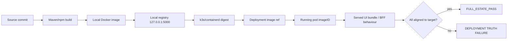

# vNext Full Estate Deploy Plan

> All of vNext is accountable. All deployable vNext services must run. One estate means all
> deployable vNext services. Waves are sequencing, not optionality. Deployment truth is the
> running estate, not the deployment story. A deployment is not complete until the full estate
> is running, aligned, healthy, current, and testable.

Doctrine: [`docs/deployment/VNEXT_UNIFIED_RUNTIME_ESTATE_DOCTRINE.md`](../../docs/deployment/VNEXT_UNIFIED_RUNTIME_ESTATE_DOCTRINE.md)

## Canonical operator commands

```bash
# Status (read-only): estate readiness + image truth + UI/BFF behaviour + label
bash scripts/operator/full-estate.sh status

# Update (mutating, authorized): full build -> push -> import -> helm full estate -> verify
bash scripts/operator/full-estate.sh update          # requires AUTHORIZE FULL BOOT PREVIEW DEPLOY
# or directly:
printf 'AUTHORIZE FULL BOOT PREVIEW DEPLOY\n' | bash scripts/deploy/full-boot-preview-deploy.sh

# Stop / start / restart (mutating; data preserved, no deletes)
bash scripts/operator/full-estate.sh stop --yes
bash scripts/operator/full-estate.sh start --yes
bash scripts/operator/full-estate.sh restart --yes

# Explicit debug/partial modes (never default; print the banner)
bash scripts/deploy/full-boot-preview-deploy.sh --debug-required-spine-only
```

## Runtime image truth chain (local Docker -> registry -> k3s -> running pod)



## Canonical full-estate update workflow

1. Build all estate services (`build-full-vnext.sh` + `build-full-vnext-images.sh --full-estate`).
   - Stale-JAR guard refuses packaging old `target/*.jar`.
   - Per-service build records written to `reports/full-boot/full-image-build-records.json` (the target digest set).
2. **Push to the local registry** (`push-images-to-local-registry.sh runtime`) — build is not enough.
3. Import/verify in k3s/containerd (`fullboot.sh import-images` + `verify-images`).
4. `helm upgrade` with the full estate enabled (no `--max-wave`).
5. Rollout (phased via `phased-wave-preview-promote.sh` to respect the pod cap).
6. Per-wave readiness checks.
7. Final verification:
   - `check-runtime-image-truth.sh` (digest alignment; fails on stale non-exempt).
   - `verify-ui-bundle-truth.sh` (served bundle hash + feature markers).
   - `verify-bff-behaviour-truth.sh` (changed-endpoint behaviour, not metadata).
   - `report-preview-generation.sh` (single public stack).
   - API smoke (`run-full-boot-smoke-tests.sh`).
8. `check-full-boot-runtime-completeness.sh` must return `FULL_ESTATE_PASS`.

## Success criteria (FULL_ESTATE_PASS)
- All 89 runtime microservices + `experience-bff` + `one-ui-shell` deployed and Ready.
- 7 required infra images healthy.
- No missing services; runtime image truth passes (no stale non-exempt).
- BFF downstream mappings pass (no `localhost`).
- Single public ingress to the full estate.
- Served UI bundle reflects the deployed commit; BFF changed-endpoint behaviour matches.

## Safety guardrails
- Default is full estate; partial requires an explicit debug flag and prints the banner.
- `stop` only scales to zero; PVCs/Postgres/secrets/namespace/Helm release preserved.
- No destructive deletes; no global containerd prune; targeted import only.
- `impilo-preview` 4-service slice is never modified by the full-estate path.

## Pod-cap handling
- `phased-wave-preview-promote.sh` waits for a pod ceiling (`PHASED_WAVE_POD_CEILING`, default 108)
  and promotes wave-by-wave, pushing each wave to the registry, until the final wave reaches the
  full estate and runtime image truth passes.

## Supporting artifact validation
- Libraries, contracts, schemas, docs, reports, fixtures are accountable and validated by the
  existing guards (parity, contracts, registry inventory) but are `non_runtime_artifact` —
  they do not run as pods. `external_dependency_with_internal_adapter` infra images are exempt
  from the stale check but reported for visibility (see `config/runtime-image-truth-exemptions.yml`).

## Post-deploy API smoke (minimum)
- `/health/version` env=full-preview, commit==target.
- `GET /internal/v1/settings/display` → 200 (trust headers).
- Citizen feed + appointments endpoints reachable (see `run-full-boot-smoke-tests.sh`).
